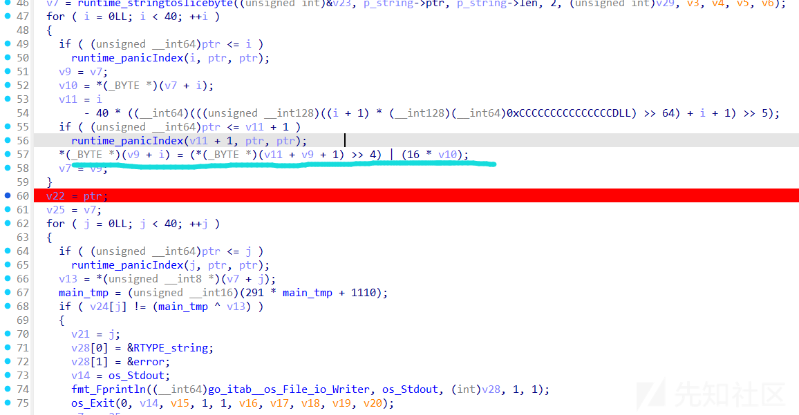
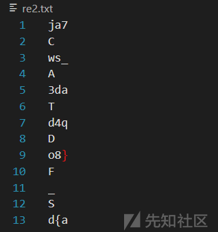
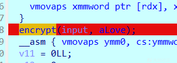
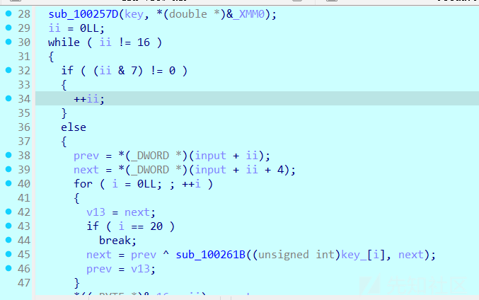
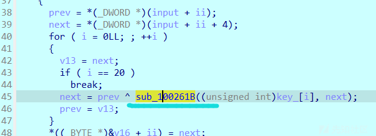

# 2024年第九届“楚慧杯”湖北省网络与数据安全实践能力竞赛-RE-先知社区

> **来源**: https://xz.aliyun.com/news/16287  
> **文章ID**: 16287

---

# go\_bytes

Flag：DASCTF{faddff8cb4d711edbb2294085339ce84}  
这一部分就是使用下一个字符的高4字节部分作为这个字符的低4字节部分。

  
解密的话先把下面的xor给解出来然后正向遍历把低4字节作为下一个字符的高4字节就行。

```
tmp = 0xDEAD

enc = [  0xB9, 0x22, 0x00, 0x00, 0x00, 0x00, 0x00, 0x00, 0xF8, 0xC9, 
  0x00, 0x00, 0x00, 0x00, 0x00, 0x00, 0x89, 0x8C, 0x00, 0x00, 
  0x00, 0x00, 0x00, 0x00, 0x18, 0xFF, 0x00, 0x00, 0x00, 0x00, 
  0x00, 0x00, 0x39, 0x14, 0x00, 0x00, 0x00, 0x00, 0x00, 0x00, 
  0x0A, 0x4E, 0x00, 0x00, 0x00, 0x00, 0x00, 0x00, 0x8B, 0x2A, 
  0x00, 0x00, 0x00, 0x00, 0x00, 0x00, 0xCB, 0x07, 0x00, 0x00, 
  0x00, 0x00, 0x00, 0x00, 0xEB, 0xBD, 0x00, 0x00, 0x00, 0x00, 
  0x00, 0x00, 0xAB, 0xFA, 0x00, 0x00, 0x00, 0x00, 0x00, 0x00, 
  0xFB, 0x3F, 0x00, 0x00, 0x00, 0x00, 0x00, 0x00, 0x4B, 0x78, 
  0x00, 0x00, 0x00, 0x00, 0x00, 0x00, 0x1E, 0x9F, 0x00, 0x00, 
  0x00, 0x00, 0x00, 0x00, 0xEB, 0x4F, 0x00, 0x00, 0x00, 0x00, 
  0x00, 0x00, 0x0B, 0x4D, 0x00, 0x00, 0x00, 0x00, 0x00, 0x00, 
  0x8E, 0xD0, 0x00, 0x00, 0x00, 0x00, 0x00, 0x00, 0xBB, 0x38, 
  0x00, 0x00, 0x00, 0x00, 0x00, 0x00, 0xAE, 0xCB, 0x00, 0x00, 
  0x00, 0x00, 0x00, 0x00, 0xCE, 0xD2, 0x00, 0x00, 0x00, 0x00, 
  0x00, 0x00, 0x3E, 0x91, 0x00, 0x00, 0x00, 0x00, 0x00, 0x00, 
  0x6B, 0x0A, 0x00, 0x00, 0x00, 0x00, 0x00, 0x00, 0x3B, 0xF0, 
  0x00, 0x00, 0x00, 0x00, 0x00, 0x00, 0x7B, 0x50, 0x00, 0x00, 
  0x00, 0x00, 0x00, 0x00, 0x8B, 0x39, 0x00, 0x00, 0x00, 0x00, 
  0x00, 0x00, 0xDE, 0x93, 0x00, 0x00, 0x00, 0x00, 0x00, 0x00, 
  0xCE, 0x3C, 0x00, 0x00, 0x00, 0x00, 0x00, 0x00, 0x9E, 0x45, 
  0x00, 0x00, 0x00, 0x00, 0x00, 0x00, 0xBE, 0x4A, 0x00, 0x00, 
  0x00, 0x00, 0x00, 0x00, 0x3E, 0x55, 0x00, 0x00, 0x00, 0x00, 
  0x00, 0x00, 0x6E, 0x31, 0x00, 0x00, 0x00, 0x00, 0x00, 0x00, 
  0xBE, 0x33, 0x00, 0x00, 0x00, 0x00, 0x00, 0x00, 0xFE, 0x42, 
  0x00, 0x00, 0x00, 0x00, 0x00, 0x00, 0xCE, 0xCE, 0x00, 0x00, 
  0x00, 0x00, 0x00, 0x00, 0xDE, 0x4D, 0x00, 0x00, 0x00, 0x00, 
  0x00, 0x00, 0x2B, 0x98, 0x00, 0x00, 0x00, 0x00, 0x00, 0x00, 
  0x1B, 0xA3, 0x00, 0x00, 0x00, 0x00, 0x00, 0x00, 0x2E, 0x80, 
  0x00, 0x00, 0x00, 0x00, 0x00, 0x00, 0xEE, 0x12, 0x00, 0x00, 
  0x00, 0x00, 0x00, 0x00, 0x7A, 0xF6, 0x00, 0x00, 0x00, 0x00, 
  0x00, 0x00, 0x79, 0xEB, 0x00, 0x00, 0x00, 0x00, 0x00, 0x00]

# print(hex((291 * tmp + 1110) & 0xffff))

flag = []
tmp1 = 0x40

for i in range(0, len(enc), 8):
    tmp = (291 * tmp + 1110) & 0xffff
    xor = (enc[i+1] << 8) + enc[i]
    ans = (xor ^ tmp)
    flag.append(tmp1 ^ (ans >> 4))
    tmp1 = (ans << 4) & 0xff

print(bytes(flag))

```

# bouquet

Flag：DASCTF{asd48\_daj7w\_3adqo}  
给了个中序遍历和一个后序遍历，实际上因为flag很短并且已知flag头是DASCTF{，我只根据中序遍历就解出来了。



纸上画出来再层次遍历就是flag了。

# zistel

Flag: z1g\_I3\_S0\_Coo0l!  
就是通过这个函数进行加密：



里面先用传入的"love"字符串初始化了key，直接动调拿到就行。



之后就是逆这个函数



一步步动态调试得到加密过程：

```
enc = [  0x58, 0x31, 0x29, 0x33, 0x11, 0x02, 0x76, 0x60, 0x46, 0x5F, 
  0x18, 0x42, 0x29, 0x6F, 0x74, 0x63]

# xor = [  0x55, 0x41, 0x24, 0x25, 0x01, 0x07, 0x5F, 0x58, 0x32, 0x00, 
#   0x58, 0x60, 0x32, 0x00, 0x58, 0x60]

key = [  0x83, 0xD1, 0xDB, 0xBB, 0x2E, 0x0F, 0x34, 0x05, 0xAD, 0xDE, 
  0xEF, 0xBE]

box = [0] * 256

for i in range(256):
    box[i] = i & 3

inp = [0x44,0x41,0x53,0x43,0x54,0x46,0x7b,0x61,0x62,0x63,0x64,0x65,0x66,0x67,0x68,0x7d]

def num_to_arr(num):
    result = []
    while(num):
        result.append(num & 0xff)
        num >>= 8
    return result

def encry(key, next):
    v10 = key ^ next
    v11 = key
    arr1 = num_to_arr(v10)
    arr2 = num_to_arr(v11)
    # print(hex(v11))
    # for i in range(len(arr2)):
    #     print(hex(arr1[i]), end=',')
    for i in range(4):
        # print(box[arr2[i]], hex(arr2[i]))
        arr1[i], arr1[box[arr2[i]]] = arr1[box[arr2[i]]], arr1[i]
    num = (arr1[0]) | (arr1[1]<<8) | (arr1[2]<<16) | (arr1[3]<<24)
    # print(hex(num ^ key))
    return num ^ key

for i in range(0, 16, 8):
    prev = (inp[i+3]<<24) + (inp[i+2]<<16) + (inp[i+1]<<8) + inp[i]
    next = (inp[i+7]<<24) + (inp[i+6]<<16) + (inp[i+5]<<8) + inp[i+4]
    for cnt in range(20):
        count = cnt * 4
        dword_key = (key[(count+3) % 12]<<24) + (key[(count+2) % 12]<<16) + (key[(count+1) % 12]<<8)+ key[count % 12]
        tmp = next
        next = prev ^ encry(dword_key, next)
        prev = tmp

        # print(hex(next), hex(prev))
    inp[i] = next & 0xff
    inp[i+1] = next>>8 & 0xff
    inp[i+2] = next>>16 & 0xff
    inp[i+3] = next>>24 & 0xff
    inp[i+4] = prev & 0xff
    inp[i+5] = prev>>8 & 0xff
    inp[i+6] = prev>>16 & 0xff
    inp[i+7] = prev>>24 & 0xff
for i in range(len(inp)):
    print(hex(inp[i]), end=',')

```

Exp:

```
enc = [  0x58, 0x31, 0x29, 0x33, 0x11, 0x02, 0x76, 0x60, 0x46, 0x5F, 
  0x18, 0x42, 0x29, 0x6F, 0x74, 0x63]

# enc = [  0x49, 0x41, 0x24, 0x39, 0x1D, 0x07, 0x5F, 0x58, 0x41, 0x63, 
#   0x32, 0x10, 0x27, 0x04, 0x5A, 0x6D]
# xor = [  0x55, 0x41, 0x24, 0x25, 0x01, 0x07, 0x5F, 0x58, 0x32, 0x00, 
#   0x58, 0x60, 0x32, 0x00, 0x58, 0x60]

key = [  0x83, 0xD1, 0xDB, 0xBB, 0x2E, 0x0F, 0x34, 0x05, 0xAD, 0xDE, 
  0xEF, 0xBE]

box = [0] * 256

for i in range(256):
    box[i] = i & 3

inp = [0x44,0x41,0x53,0x43,0x54,0x46,0x7b,0x61,0x62,0x63,0x64,0x65,0x66,0x67,0x68,0x7d]

def num_to_arr(num):
    result = []
    while(num):
        result.append(num & 0xff)
        num >>= 8
    return result

def encry(key, next):
    v10 = key ^ next
    v11 = key
    arr1 = num_to_arr(v10)
    arr2 = num_to_arr(v11)
    # print(hex(v11))
    # for i in range(len(arr2)):
    #     print(hex(arr1[i]), end=',')
    for i in range(4):
        # print(box[arr2[i]], hex(arr2[i]))
        arr1[i], arr1[box[arr2[i]]] = arr1[box[arr2[i]]], arr1[i]
    num = (arr1[0]) | (arr1[1]<<8) | (arr1[2]<<16) | (arr1[3]<<24)
    # print(hex(num ^ key))
    return num ^ key

for i in range(0, 16, 8):
    next = (enc[i+3]<<24) + (enc[i+2]<<16) + (enc[i+1]<<8) + enc[i]
    prev = (enc[i+7]<<24) + (enc[i+6]<<16) + (enc[i+5]<<8) + enc[i+4]
    for cnt in range(19, -1, -1):
        count = cnt * 4
        dword_key = (key[(count+3) % 12]<<24) + (key[(count+2) % 12]<<16) + (key[(count+1) % 12]<<8)+ key[count % 12]
        # tmp = next
        # next = prev ^ encry(dword_key, next)
        # prev = tmp

        tmp = prev
        prev = next ^ encry(dword_key, tmp)
        next = tmp

        # print(hex(next), hex(prev))
    inp[i] = prev & 0xff
    inp[i+1] = prev>>8 & 0xff
    inp[i+2] = prev>>16 & 0xff
    inp[i+3] = prev>>24 & 0xff
    inp[i+4] = next & 0xff
    inp[i+5] = next>>8 & 0xff
    inp[i+6] = next>>16 & 0xff
    inp[i+7] = next>>24 & 0xff
print(bytes(inp))

```
