# Windows内核回调-先知社区

> **来源**: https://xz.aliyun.com/news/16292  
> **文章ID**: 16292

---

# 内核回调

MSDN中内核回调的介绍如下

内核的回调机制**为驱动程序提供了一种在满足某些条件时请求和提供通知的常规方法**

windows提供了如下函数来进行注册

```
PsSetCreateProcessNotifyRoutine
PsSetCreateProcessNotifyRoutineEx
PsSetCreateThreadNotifyRoutine
PsRemoveCreateThreadNotifyRoutine
PsRemoveLoadImageNotifyRoutine
PsSetLoadImageNotifyRoutine

```

下面简单介绍一下

## 进程 线程回调

### PsSetCreateProcessNotifyRoutine

```
NTSTATUS
PsSetCreateProcessNotifyRoutine(
    _In_ PCREATE_PROCESS_NOTIFY_ROUTINE NotifyRoutine,
    _In_ BOOLEAN Remove
    );

```

接收两个参数 第一个是回调函数 第二个表名是注册还是移除

demo如下

```
VOID TestRoutine(
    _In_ HANDLE ParentId,
    _In_ HANDLE ProcessId,
    _In_ BOOLEAN Create
) {

    if (Create) {
        DbgPrint("PID: %d, ID: %d, Create", ParentId, ProcessId);
    }
    else
    {
        DbgPrint("PID: %d, ID: %d, Remove", ParentId, ProcessId);
    }

}

NTSTATUS UnloadDriver(PDRIVER_OBJECT DriverObject)
{
    PsSetCreateProcessNotifyRoutine((PCREATE_PROCESS_NOTIFY_ROUTINE)TestRoutine, TRUE);

    DbgPrint("Unload!");
}

NTSTATUS DriverEntry(PDRIVER_OBJECT DriverObject, PUNICODE_STRING RegistryPath)
{

    PsSetCreateProcessNotifyRoutine((PCREATE_PROCESS_NOTIFY_ROUTINE)TestRoutine,FALSE);

    DriverObject->DriverUnload = UnloadDriver;

    return STATUS_SUCCESS;
}

```

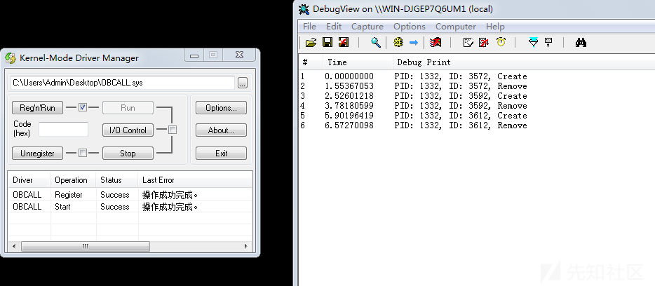

### PsSetCreateProcessNotifyRoutineEx

类似的 我们先给出demo

```
VOID TestRoutine(
    _Inout_ PEPROCESS Process,
    _In_ HANDLE ProcessId,
    _Inout_opt_ PPS_CREATE_NOTIFY_INFO CreateInfo
    ) {

    if (CreateInfo) {
        DbgPrint("ID: %d, Create",ProcessId);
    }
    else
    {
        DbgPrint("ID: %d, Remove",ProcessId);
    }

}

NTSTATUS UnloadDriver(PDRIVER_OBJECT DriverObject)
{
    // PsSetCreateProcessNotifyRoutine((PCREATE_PROCESS_NOTIFY_ROUTINE)TestRoutine, TRUE);
    PsSetCreateProcessNotifyRoutineEx((PCREATE_PROCESS_NOTIFY_ROUTINE_EX)TestRoutine, TRUE);
    DbgPrint("Unload!");
}

NTSTATUS DriverEntry(PDRIVER_OBJECT DriverObject, PUNICODE_STRING RegistryPath)
{

    PsSetCreateProcessNotifyRoutineEx((PCREATE_PROCESS_NOTIFY_ROUTINE_EX)TestRoutine,FALSE);

    DriverObject->DriverUnload = UnloadDriver;

    return STATUS_SUCCESS;
}

```

发现完全没输出 区别在哪儿呢?

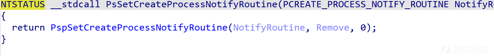


可以看见这两个函数 内部都调用了`PspSetCreateProcessNotifyRoutine` 其中第三个参数不一样

卸载部分简要看看

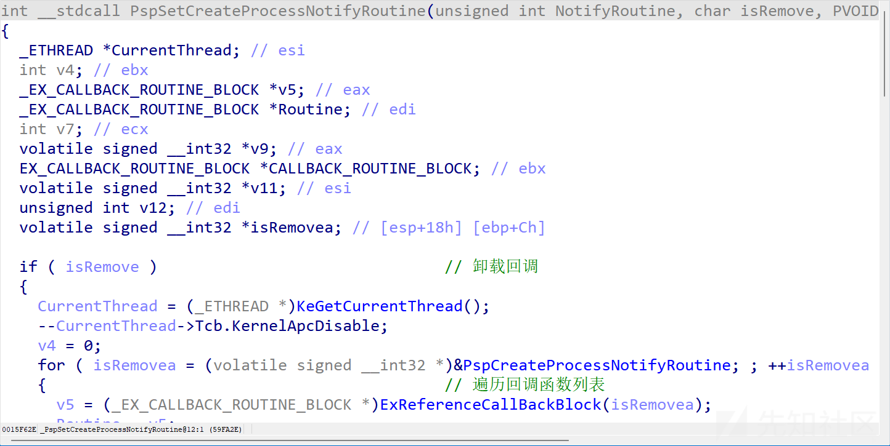

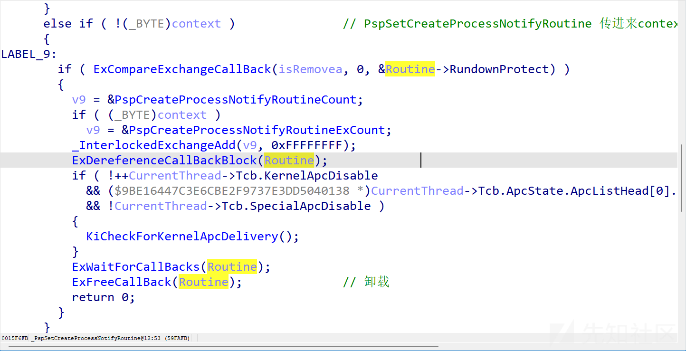

注册部分通过`MmVerifyCallbackFunction`判断回调函数合法性

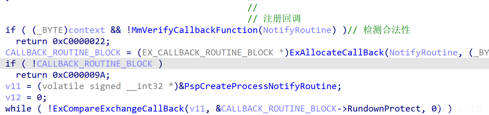

如果想要成功注册回调 要么`context`为0 要么flags的值必须得有0x20 也就是`LDRP_IMAGE_INTEGRITY_FORCED`

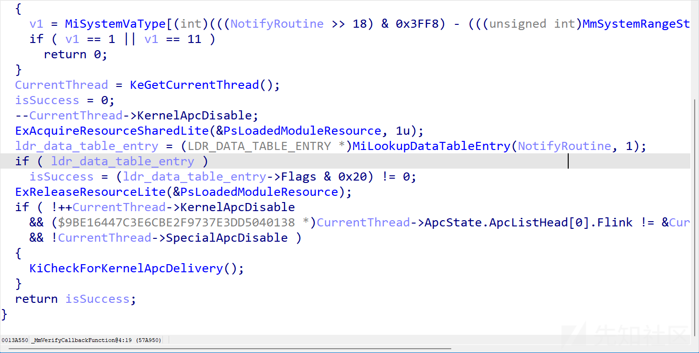

那么修改flags就行

```
PLDR_DATA_TABLE_ENTRY ldr = (PLDR_DATA_TABLE_ENTRY)((ULONG_PTR)DriverObject->DriverSection);
    ldr->Flags |= 0x20;

```

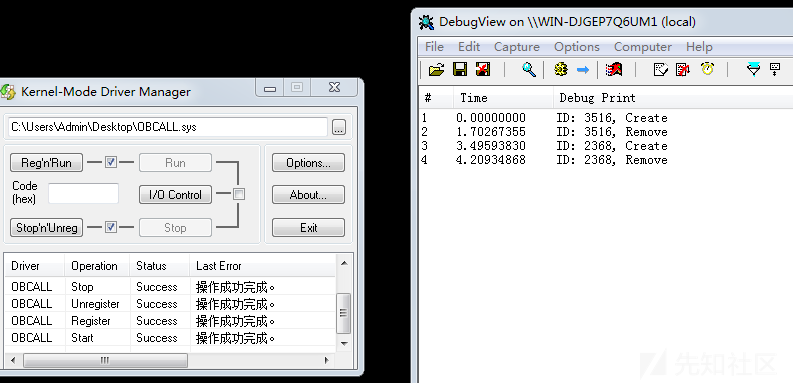

线程的类似 在此不过多赘述

## 模块回调

`PsSetLoadImageNotifyRoutine`

demo如下

```
VOID TestRoutine(
    _In_opt_ PUNICODE_STRING FullImageName,
    _In_ HANDLE ProcessId,                // pid into which image is being mapped
    _In_ PIMAGE_INFO ImageInfo
) {
    DbgPrint("%wZ", FullImageName);

}

NTSTATUS UnloadDriver(PDRIVER_OBJECT DriverObject)
{
    PsRemoveLoadImageNotifyRoutine((PLOAD_IMAGE_NOTIFY_ROUTINE)TestRoutine);
    DbgPrint("Unload!");
}


NTSTATUS DriverEntry(PDRIVER_OBJECT DriverObject, PUNICODE_STRING RegistryPath)
{


    PsSetLoadImageNotifyRoutine((PLOAD_IMAGE_NOTIFY_ROUTINE)TestRoutine);


    DriverObject->DriverUnload = UnloadDriver;

    return STATUS_SUCCESS;
}

```

可以通过模块回调实现阻止驱动加载

通过ImageInfo获得imageBase

然后解析pe文件 修改入口点执行的代码 直接ret

注意 直接修改会蓝屏 要关闭写保护

```
void EnableCR0WriteProtection(KIRQL irql)
{
    UINT64 cr0 = __readcr0();
    cr0 |= 0x10000;
    _enable();
    __writecr0(cr0);
    KeLowerIrql(irql);
}


KIRQL DisableCR0WriteProtection()
{
    KIRQL irql = KeRaiseIrqlToDpcLevel();
    UINT64 cr0 = __readcr0();
    cr0 &= 0xfffffffffffeffff;
    __writecr0(cr0);
    _disable();
    return irql;

}

NTSTATUS DieEntry(IN PDRIVER_OBJECT MyDriver, IN PUNICODE_STRING RegistryPath)
{
    return STATUS_UNSUCCESSFUL;
}

VOID TestRoutine(
    _In_opt_ PUNICODE_STRING FullImageName,
    _In_ HANDLE ProcessId,                // pid into which image is being mapped
    _In_ PIMAGE_INFO ImageInfo
) {

    if (ImageInfo->SystemModeImage) {
        PIMAGE_NT_HEADERS pNtHeader = NULL;
        PIMAGE_DOS_HEADER pDosHeader = NULL;
        PULONG Entry = NULL;

        KIRQL  kirql = DisableCR0WriteProtection();


        pDosHeader = (PIMAGE_DOS_HEADER)(ULONG_PTR)ImageInfo->ImageBase;
        pNtHeader = (PIMAGE_NT_HEADERS)((ULONG_PTR)ImageInfo->ImageBase + pDosHeader->e_lfanew);
        Entry = (ULONG_PTR)ImageInfo->ImageBase + pNtHeader->OptionalHeader.AddressOfEntryPoint;

        DbgPrint("%x\n", Entry);

        memcpy(Entry, DieEntry, 32);
        EnableCR0WriteProtection(kirql);

    }

}

NTSTATUS UnloadDriver(PDRIVER_OBJECT DriverObject)
{
    PsRemoveLoadImageNotifyRoutine((PLOAD_IMAGE_NOTIFY_ROUTINE)TestRoutine);
    DbgPrint("Unload!");
}


NTSTATUS DriverEntry(PDRIVER_OBJECT DriverObject, PUNICODE_STRING RegistryPath)
{


    PsSetLoadImageNotifyRoutine((PLOAD_IMAGE_NOTIFY_ROUTINE)TestRoutine);


    DriverObject->DriverUnload = UnloadDriver;

    return STATUS_SUCCESS;
}

```

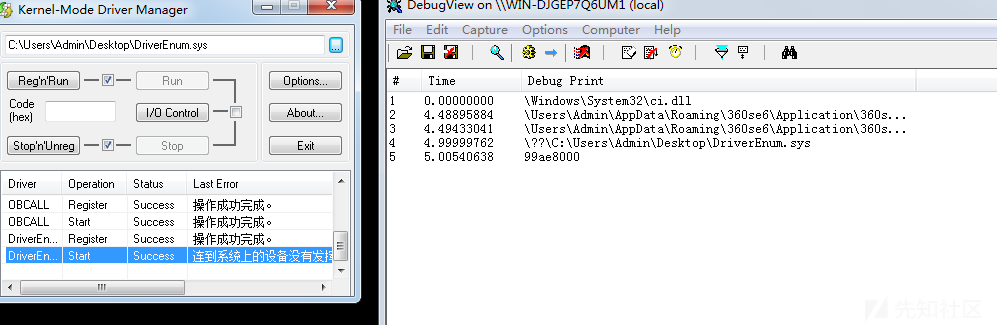

## 对象回调

先看`OBJECT_TYPE`结构

```
struct _OBJECT_TYPE
{
    struct _LIST_ENTRY TypeList;                                            //0x0
    struct _UNICODE_STRING Name;                                            //0x8
    VOID* DefaultObject;                                                    //0x10
    UCHAR Index;                                                            //0x14
    ULONG TotalNumberOfObjects;                                             //0x18
    ULONG TotalNumberOfHandles;                                             //0x1c
    ULONG HighWaterNumberOfObjects;                                         //0x20
    ULONG HighWaterNumberOfHandles;                                         //0x24
    struct _OBJECT_TYPE_INITIALIZER TypeInfo;                               //0x28
    struct _EX_PUSH_LOCK TypeLock;                                          //0x78
    ULONG Key;                                                              //0x7c
    struct _LIST_ENTRY CallbackList;                                        //0x80
};

```

我们关注`TypeInfo`和`CallbackList`这两个成员

`CallbackList`是回调函数列表

`TypeInfo`的结构如下

```
//0x50 bytes (sizeof)
struct _OBJECT_TYPE_INITIALIZER
{
    USHORT Length;                                                          //0x0
    union
    {
        UCHAR ObjectTypeFlags;                                              //0x2
        struct
        {
            UCHAR CaseInsensitive:1;                                        //0x2
            UCHAR UnnamedObjectsOnly:1;                                     //0x2
            UCHAR UseDefaultObject:1;                                       //0x2
            UCHAR SecurityRequired:1;                                       //0x2
            UCHAR MaintainHandleCount:1;                                    //0x2
            UCHAR MaintainTypeList:1;                                       //0x2
            UCHAR SupportsObjectCallbacks:1;                                //0x2
        };
    };
    ULONG ObjectTypeCode;                                                   //0x4
    ULONG InvalidAttributes;                                                //0x8
    struct _GENERIC_MAPPING GenericMapping;                                 //0xc
    ULONG ValidAccessMask;                                                  //0x1c
    ULONG RetainAccess;                                                     //0x20
    enum _POOL_TYPE PoolType;                                               //0x24
    ULONG DefaultPagedPoolCharge;                                           //0x28
    ULONG DefaultNonPagedPoolCharge;                                        //0x2c
    VOID (*DumpProcedure)(VOID* arg1, struct _OBJECT_DUMP_CONTROL* arg2);   //0x30
    LONG (*OpenProcedure)(enum _OB_OPEN_REASON arg1, CHAR arg2, struct _EPROCESS* arg3, VOID* arg4, ULONG* arg5, ULONG arg6); //0x34
    VOID (*CloseProcedure)(struct _EPROCESS* arg1, VOID* arg2, ULONG arg3, ULONG arg4); //0x38
    VOID (*DeleteProcedure)(VOID* arg1);                                    //0x3c
    LONG (*ParseProcedure)(VOID* arg1, VOID* arg2, struct _ACCESS_STATE* arg3, CHAR arg4, ULONG arg5, struct _UNICODE_STRING* arg6, struct _UNICODE_STRING* arg7, VOID* arg8, struct _SECURITY_QUALITY_OF_SERVICE* arg9, VOID** arg10); //0x40
    LONG (*SecurityProcedure)(VOID* arg1, enum _SECURITY_OPERATION_CODE arg2, ULONG* arg3, VOID* arg4, ULONG* arg5, VOID** arg6, enum _POOL_TYPE arg7, struct _GENERIC_MAPPING* arg8, CHAR arg9); //0x44
    LONG (*QueryNameProcedure)(VOID* arg1, UCHAR arg2, struct _OBJECT_NAME_INFORMATION* arg3, ULONG arg4, ULONG* arg5, CHAR arg6); //0x48
    UCHAR (*OkayToCloseProcedure)(struct _EPROCESS* arg1, VOID* arg2, VOID* arg3, CHAR arg4); //0x4c
};

```

`SupportsObjectCallbacks`成员决定了`CallbackList`是否启用 如果为0 则不启用


OBCALL.sys实现了calc.exe的保护 在修改`SupportsObjectCallbacks`位后失效

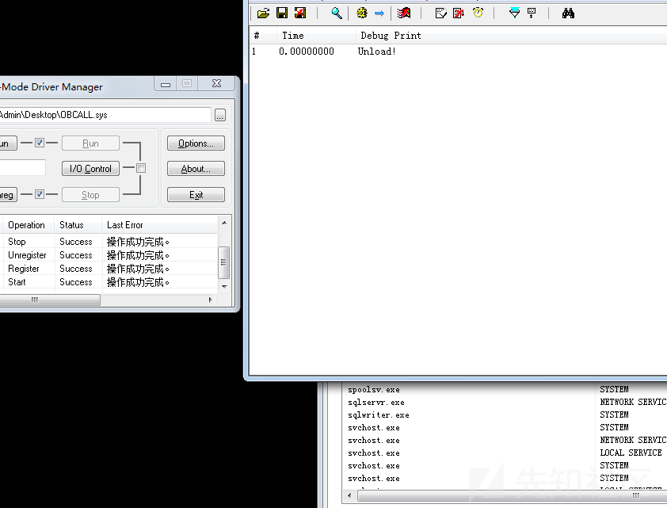

`ValidAccessMask` 表示权限 句柄的权限与上这个权限就是实际的权限

下面这些`**Procedure`则是另一组回调函数 优先级高于`CallbackList`

可以通过`ObRegisterCallbacks`创建对象回调

`ObRegisterCallbacks` 接收两个参数 指向`_OB_CALLBACK_REGISTRATION`结构的指针和`注册后的回调句柄`

第二个参数在卸载回调的时候需要用到

```
NTKERNELAPI
NTSTATUS
ObRegisterCallbacks (
    _In_ POB_CALLBACK_REGISTRATION CallbackRegistration,
    _Outptr_ PVOID *RegistrationHandle
    );

typedef struct _OB_OPERATION_REGISTRATION {
    _In_ POBJECT_TYPE                *ObjectType;
    _In_ OB_OPERATION                Operations;
    _In_ POB_PRE_OPERATION_CALLBACK  PreOperation;
    _In_ POB_POST_OPERATION_CALLBACK PostOperation;
} OB_OPERATION_REGISTRATION, *POB_OPERATION_REGISTRATION;

typedef struct _OB_CALLBACK_REGISTRATION {
    _In_ USHORT                     Version;
    _In_ USHORT                     OperationRegistrationCount;
    _In_ UNICODE_STRING             Altitude;
    _In_ PVOID                      RegistrationContext;
    _In_ OB_OPERATION_REGISTRATION  *OperationRegistration;
} OB_CALLBACK_REGISTRATION, *POB_CALLBACK_REGISTRATION;

```

`_OB_OPERATION_REGISTRATION` 结构有4个成员

`ObjectType` 对象类型 可以指定进程线程互斥体等

`Operations` create还是dump

`PreOperation` `PostOperation` 回调函数 pre 和 post代表时机

`_OB_CALLBACK_REGISTRATION`的5个成员

`Version` 驱动指定为`OB_FLT_REGISTRATION_VERSION` 或者使用ObGetFilterVersion函数来获取

`OperationRegistrationCount` 需要注册几个回调函数

`Altitude` 海拔 一个字符串 表示加载的优先级 数字越大优先级越低

`OperationRegistration` 储存回调函数的数组

`RegistrationContext` 回调的参数

demo如下

```
PVOID RegistrationHandle = NULL;


NTSTATUS UnloadDriver(PDRIVER_OBJECT DriverObject)
{
    if (RegistrationHandle) {
        ObUnRegisterCallbacks(RegistrationHandle);
    }
    DbgPrint("Unload!");
}


OB_PREOP_CALLBACK_STATUS TestRoutine(
    _In_ PVOID RegistrationContext,
    _Inout_ POB_PRE_OPERATION_INFORMATION OperationInformation
) {

    DbgPrint("111\n");
    return OB_PREOP_SUCCESS;
}


NTSTATUS DriverEntry(PDRIVER_OBJECT DriverObject, PUNICODE_STRING RegistryPath)
{
    OB_OPERATION_REGISTRATION obOpreationRegistration = { 0 };
    OB_CALLBACK_REGISTRATION obCbRegistration = { 0 };

    obOpreationRegistration.ObjectType = *PsProcessType;
    obOpreationRegistration.Operations = OB_OPERATION_HANDLE_CREATE;
    obOpreationRegistration.PreOperation = TestRoutine;


    obCbRegistration.Version = ObGetFilterVersion();
    UNICODE_STRING altitude = {0};
    RtlInitUnicodeString(&altitude, "114514");
    obCbRegistration.Altitude = altitude;
    obCbRegistration.OperationRegistrationCount = 1;
    obCbRegistration.RegistrationContext = NULL;
    obCbRegistration.OperationRegistration = &obOpreationRegistration;

    ObRegisterCallbacks(&obCbRegistration, &RegistrationHandle);


    DriverObject->DriverUnload = UnloadDriver;

    return STATUS_SUCCESS;
}

```

驱动加载后发现没用 什么原因呢?

调试发现`ObRegisterCallbacks`返回0xc0000022

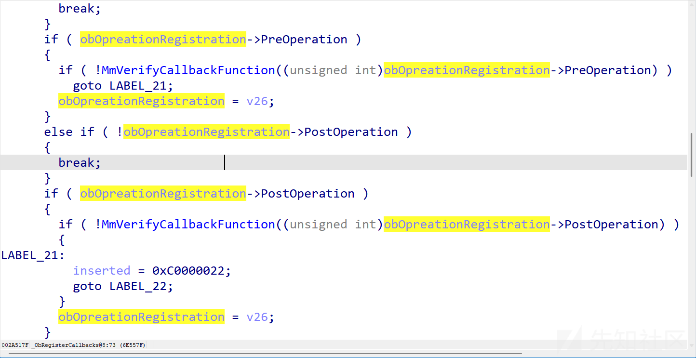

可以看到是`MmVerifyCallbackFunction` 没过 那么我们和PsSetCreateProcessNotifyRoutineEx的处理方式一样

```
PLDR_DATA_TABLE_ENTRY ldr = (PLDR_DATA_TABLE_ENTRY)DriverObject->DriverSection;
    ldr->Flags |= 0x20;

```


在回调函数的参数中`POB_PRE_OPERATION_INFORMATION`的几个成员含义如下

```
typedef struct _OB_PRE_OPERATION_INFORMATION {
    _In_ OB_OPERATION           Operation;
    union {
        _In_ ULONG Flags;
        struct {
            _In_ ULONG KernelHandle:1;
            _In_ ULONG Reserved:31;
        };
    };
    _In_ PVOID                         Object;
    _In_ POBJECT_TYPE                  ObjectType;
    _Out_ PVOID                        CallContext;
    _In_ POB_PRE_OPERATION_PARAMETERS  Parameters;
} OB_PRE_OPERATION_INFORMATION, *POB_PRE_OPERATION_INFORMATION;

```

`Operation` 是创建还是dump触发的回调

`KernelHandle` 是否是内核调用的

`Object` 被操作的对象

`ObjectType` 对象类型

`CallContext` 回调参数

`Parameters` 描述当前操作的具体参数 可以以此设置权限

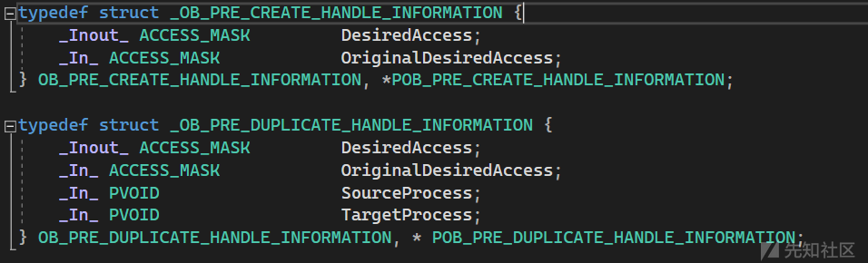

```
OB_PREOP_CALLBACK_STATUS TestRoutine(
    _In_ PVOID RegistrationContext,
    _Inout_ POB_PRE_OPERATION_INFORMATION OperationInformation
) {
    if (OperationInformation->Object) {
        pEPROCESS pEprocess = (pEPROCESS)(OperationInformation->Object);
        if (_stricmp("calc.exe", pEprocess->ImageFileName) == 0) {
            DbgPrint("Done!\n");
            OperationInformation->Parameters->CreateHandleInformation.DesiredAccess = 0;
        }
    }
    return OB_PREOP_SUCCESS;
}

```

效果如下

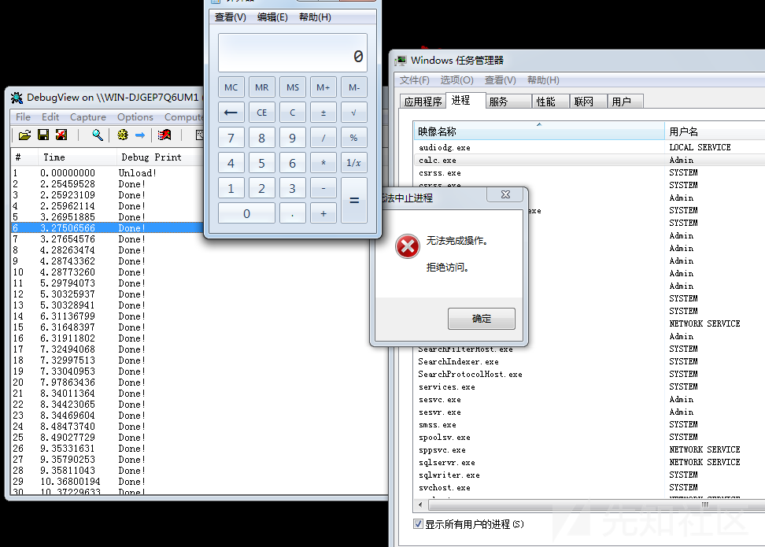
