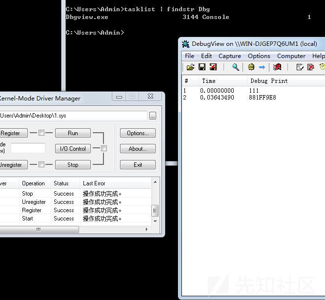
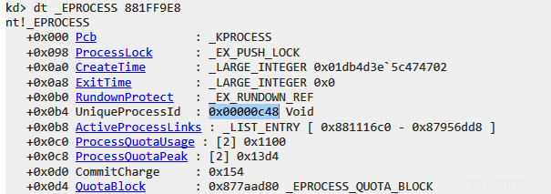
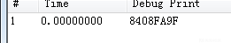
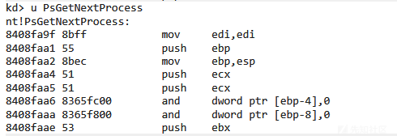
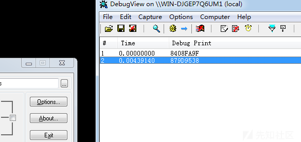
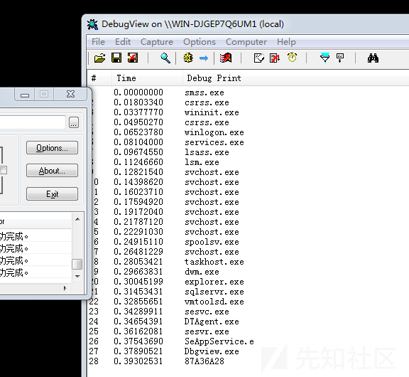
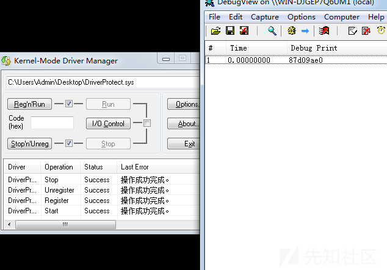

# windows内核进程遍历常见方式-先知社区

> **来源**: https://xz.aliyun.com/news/16294  
> **文章ID**: 16294

---

# 内核进程遍历方式

本文介绍常见几种内核进程遍历方式

## 暴力枚举pid

遍历pid 通过`PsLookupProcessByProcessId`函数来打开 获得`EPROCESS`结构 再通过`PsGetProcessImageFileName`获取进程名 与传入进程名比较

这两个函数都是导出的 但是PsGetProcessImageFileName没有文档化 自己声明一下

```
NTKERNELAPI PCHAR PsGetProcessImageFileName(PEPROCESS Process);


PEPROCESS pEprocess = NULL;
    for (ULONG i = 8; i <= 100000; i += 4) {
        NTSTATUS status =  PsLookupProcessByProcessId(i, &pEprocess);
        if (NT_SUCCESS(status)) {
            PCHAR processName = PsGetProcessImageFileName(pEprocess);
            if (_stricmp(processName, "dbgview.exe") == 0) {
                DbgPrint("111\n");
                break;
            }
            ObDereferenceObject(pEprocess);
        }
    }
    DbgPrint("%p", pEprocess);
    ObDereferenceObject(pEprocess);

```





封装一下 方便写模板

```
NTKERNELAPI PCHAR PsGetProcessImageFileName(PEPROCESS Process);
PEPROCESS GetProcessByName(PUCHAR TargetName) {

    PEPROCESS pEprocess = NULL;
    for (ULONG i = 8; i <= 100000; i += 4) {
        NTSTATUS status = PsLookupProcessByProcessId(i, &pEprocess);
        if (NT_SUCCESS(status)) {
            PCHAR processName = PsGetProcessImageFileName(pEprocess);
            if (_stricmp(processName, TargetName) == 0) {
                return pEprocess;
            }
            ObDereferenceObject(pEprocess);
        }
    }

    return NULL;
}

```

## PsGetNextProcess

该函数是未导出的

这里通过获取附近的导出函数 然后匹配特征码来得到

我们选择`IoCreateStreamFileObjectLite`


```
PVOID FuzzFunc(PUCHAR startAddress,ULONG length,PUCHAR signature,ULONG signatureLength) {
    PUCHAR endAddress = startAddress + length - signatureLength;
    PUCHAR i = NULL;
    ULONG j = 0;

    if (!startAddress || !signature || signatureLength == 0 || length < signatureLength) {
        return NULL;
    }
    for (i = startAddress; i <= endAddress; i++) {
        for (j = 0 ; j < signatureLength; j++) {
            if (*(PUCHAR)(i + j) != signature[j]) {
                break;
            }
        }

        if (j >= signatureLength) {
            return (PVOID)i;
        }
    }
    return NULL;
}

NTSTATUS DriverEntry(PDRIVER_OBJECT DriverObject, PUNICODE_STRING RegistryPath)
{
    PUCHAR pStartaddr = IoCreateStreamFileObjectLite;
    UCHAR signature[] = {0x00,0x00,0x66, 0xFF, 0x8E,0x86};
    PUCHAR temAddr = FuzzFunc(pStartaddr, 0x1000, signature, 6);
    PUCHAR funcAddr = temAddr - 22;
    DbgPrint("%p\n", funcAddr);


    DriverObject->DriverUnload = UnloadDriver;

    return STATUS_SUCCESS;
}

```





```
typedef PEPROCESS(NTAPI* pPsGetNextProcess)(IN PEPROCESS OldProcess);


NTKERNELAPI PCHAR PsGetProcessImageFileName(PEPROCESS Process);
pPsGetNextProcess PsGetNextProcess = NULL;


PEPROCESS GetProcessByName2(PUCHAR TargetName) {
    if (!PsGetNextProcess) {
        return NULL;
    }

    PEPROCESS currentProcess = PsGetCurrentProcess();
    PEPROCESS nextProcess = NULL;
    nextProcess = PsGetNextProcess(currentProcess);

    while (nextProcess != NULL && nextProcess != currentProcess)
    {
        PCHAR processName = PsGetProcessImageFileName(nextProcess);
        nextProcess = PsGetNextProcess(nextProcess);
        if (_stricmp(processName, TargetName) == 0) {
            return nextProcess;
        }
    }
    return NULL;
}


NTSTATUS DriverEntry(PDRIVER_OBJECT DriverObject, PUNICODE_STRING RegistryPath)
{
    PUCHAR funcAddr = NULL;
    PUCHAR pStartaddr = IoCreateStreamFileObjectLite;
    UCHAR signature[] = {0x00,0x00,0x66, 0xFF, 0x8E,0x86};
    PUCHAR temAddr = FuzzFunc(pStartaddr, 0x1000, signature, 6);

    PEPROCESS pEprocess = NULL;

    if (temAddr) {
        funcAddr = temAddr - 22;
        DbgPrint("%p\n", funcAddr);


        PsGetNextProcess = (pPsGetNextProcess)funcAddr;
        pEprocess = GetProcessByName2("dbgview.exe");
        DbgPrint("%p\n", pEprocess);
    }


    DriverObject->DriverUnload = UnloadDriver;

    return STATUS_SUCCESS;
}

```



## 手动遍历ActiveProcessLinks

实际上PsGetNextProcess就是这么做的

首先通过`PsGetCurrentProcess`获取一个`PEPROCESS`

然后遍历链表匹配名称即可

```
PEPROCESS GetProcessByName3(PUCHAR TargetName) {
    PLIST_ENTRY CurrentEntry = NULL;
    PLIST_ENTRY StartEntry = NULL;
    PEPROCESS CurrentProcess = PsGetCurrentProcess();

    StartEntry = (PLIST_ENTRY)((ULONG_PTR)CurrentProcess + 0x0b8); //ActiveProcessLinks
    CurrentEntry = StartEntry->Flink;
    while (CurrentEntry != StartEntry) {
        PEPROCESS Process = (PEPROCESS)((ULONG_PTR)CurrentEntry - 0x0b8);
        PCHAR processName = PsGetProcessImageFileName(Process);

        DbgPrint("%s\n", processName);
        if (_stricmp(processName, TargetName) == 0) {
            return Process;
        }

        CurrentEntry = CurrentEntry->Flink;

    }

    return NULL;

}

```



## 遍历句柄表

获取全局句柄表

```
PULONG pHandleTable = NULL;
PULONG GetPspCidTable() {
    if (!pHandleTable) {
        PULONG pPspCidTable = (ULONG_PTR)PsLookupThreadByThreadId + 0x1e + 2;
        PULONG PspCidTable = *(PULONG)pPspCidTable;
        pHandleTable = *(PULONG)PspCidTable;
    }
    return pHandleTable;
}

```

写回调函数 通过判断typeindex来判断是否是进程 匹配到名字直接写入全局变量

```
pEPROCESS targetProcess = NULL;
BOOLEAN NTAPI getProcessRoutine(
    _In_ struct _HANDLE_TABLE_ENTRY* HandleTableEntry,
    _In_ HANDLE Handle,
    _In_ PVOID Context
) {

    if (HandleTableEntry) {

        PUCHAR TargetName = (PUCHAR)Context;
        POBJECT_HEADER objHead = (HandleTableEntry->Value & 0xfffffff8) - 0x18;
        if (objHead->TypeIndex == 7) {

            pEPROCESS pEprocess = (pEPROCESS)((ULONG_PTR)objHead + 0x18);
            if (_stricmp(pEprocess->ImageFileName, TargetName) == 0) {
                targetProcess = pEprocess;
            }
        }


    }
    return FALSE;
}

```

```
PEPROCESS GetProcessByName4(PUCHAR TargetName) {
    PULONG table = GetPspCidTable();
    ExEnumHandleTable(table, getProcessRoutine, TargetName, NULL);

    return targetProcess;

}

```

```
DbgPrint("%x\n", GetProcessByName4("dbgview.exe"));
    DriverObject->DriverUnload = UnloadDriver;

```



私有句柄表的思路也是类似的 在此不赘述
