# 某某语音auth值生成分析-先知社区

> **来源**: https://xz.aliyun.com/news/16296  
> **文章ID**: 16296

---

本文仅用于分享交流

抓包发现校验的参数auth  
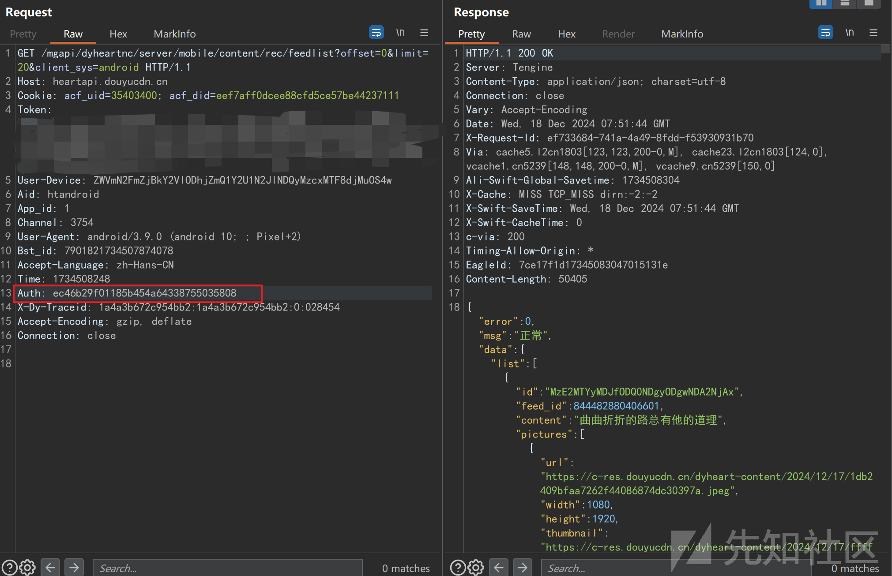

下面来分析这个auth的生成

用jadx反编译apk

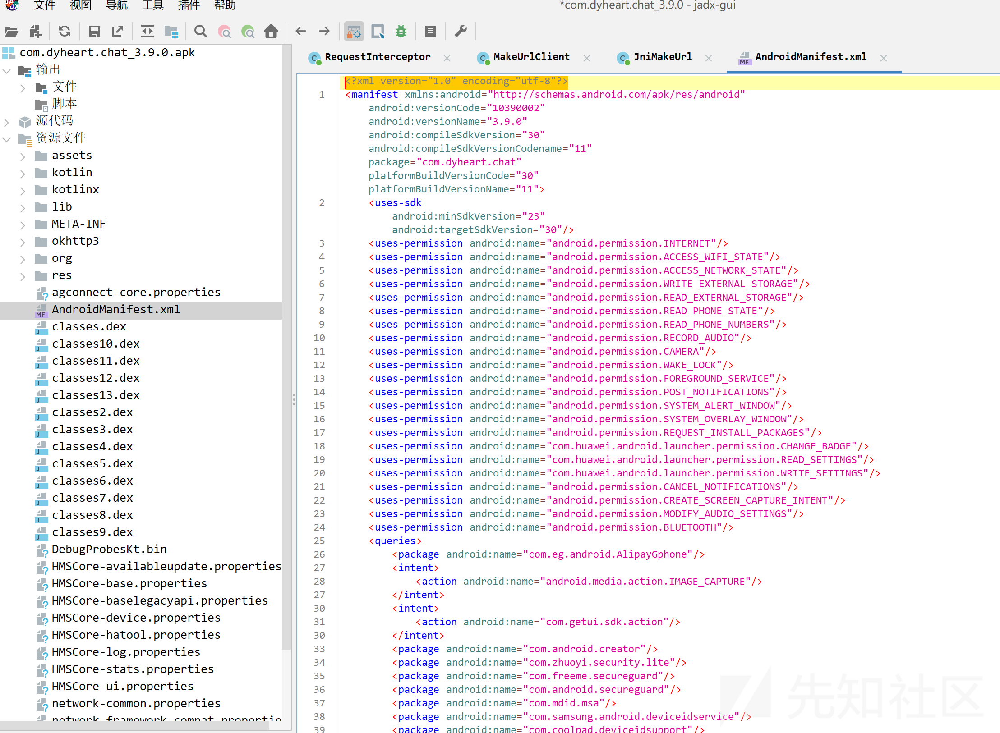

经过尝试，发现搜索关键字"auth"能找到相关位置  
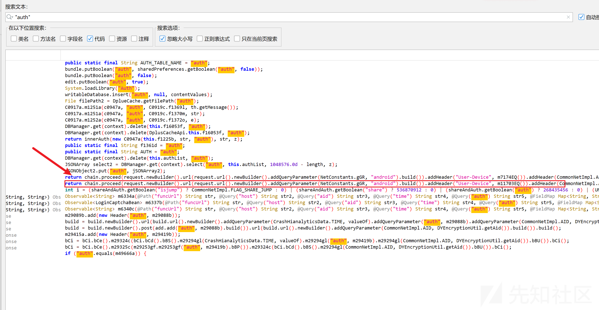

定位到这个拦截器的位置

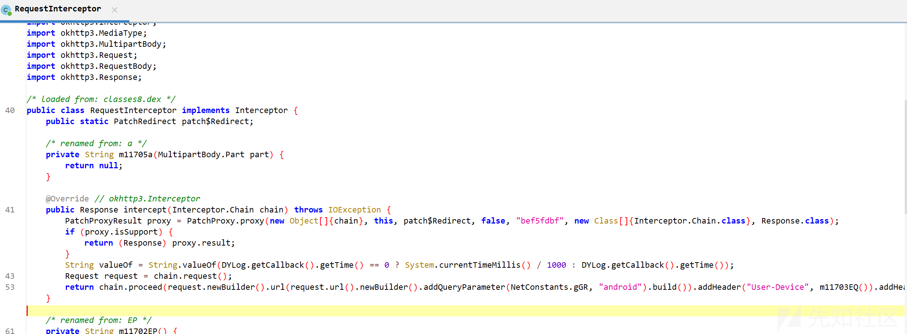

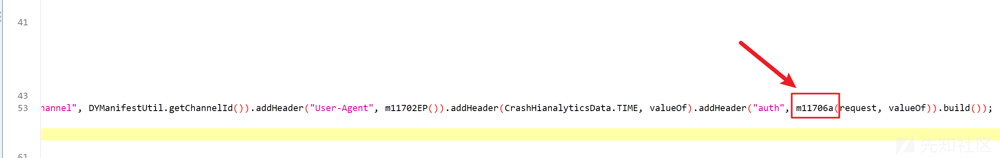

进入函数m11706a

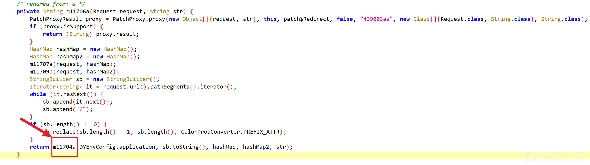

进入函数m11704a  
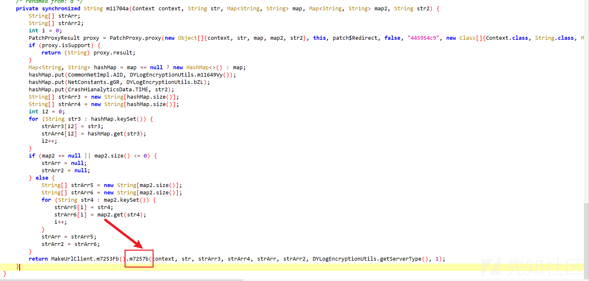

进入函数m7257b  
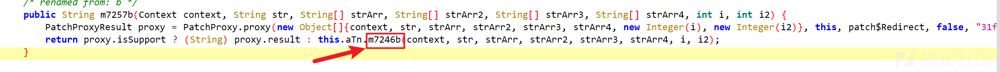

进入函数m7246b

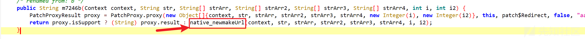

最后发现native\_newmakeUrl是jni函数

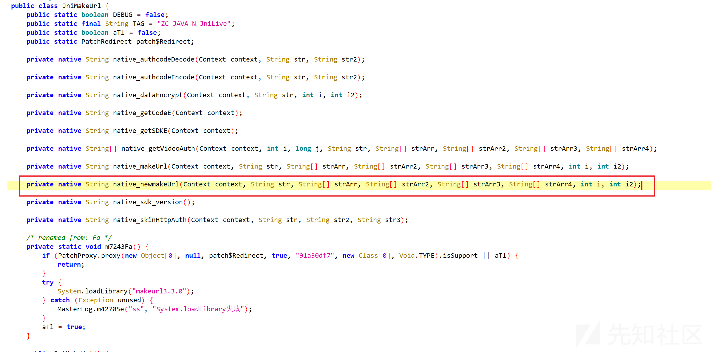

将库makeurl3.3.0拖入ida,并没有在导出表中发现相关函数名，说明可能是动态加载

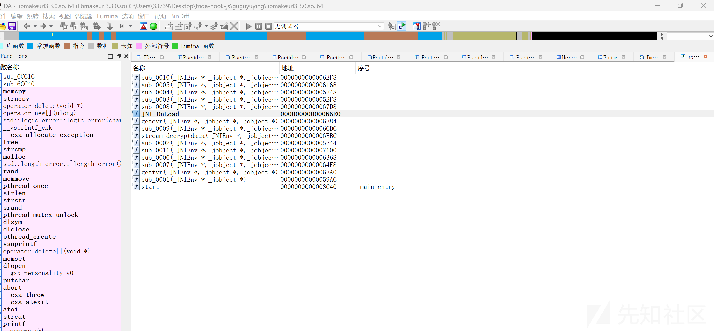

这时候就要祭出hook脚本来定位native\_newmakeUrl的位置  
在Android系统中，与JNI相关的核心实现大多集中在libart.so这个动态共享库中。其中RegisterNatives函数负责动态注册，所以通过hook打印出其调用时的关键参数信息，就能找到动态加载的so库函数的相关信息  
代码如下

```
function hook_RegisterNatives() {
    var symbols = Module.enumerateSymbolsSync("libart.so");
    var addrRegisterNatives = null;
    for (var i = 0; i < symbols.length; i++) {
        var symbol = symbols[i];

        //_ZN3art3JNI15RegisterNativesEP7_JNIEnvP7_jclassPK15JNINativeMethodi
        if (symbol.name.indexOf("art") >= 0 &&
                symbol.name.indexOf("JNI") >= 0 &&
                symbol.name.indexOf("RegisterNatives") >= 0 &&
                symbol.name.indexOf("CheckJNI") < 0) {
            addrRegisterNatives = symbol.address;
            console.log("RegisterNatives is at ", symbol.address, symbol.name);
        }
    }

    if (addrRegisterNatives != null) {
        Interceptor.attach(addrRegisterNatives, {
            onEnter: function (args) {
                console.log("[RegisterNatives] method_count:", args[3]);
                var env = args[0];
                var java_class = args[1];
                var class_name = Java.vm.tryGetEnv().getClassName(java_class);
                //console.log(class_name);

                var methods_ptr = ptr(args[2]);

                var method_count = parseInt(args[3]);
                for (var i = 0; i < method_count; i++) {
                    var name_ptr = Memory.readPointer(methods_ptr.add(i * Process.pointerSize * 3));
                    var sig_ptr = Memory.readPointer(methods_ptr.add(i * Process.pointerSize * 3 + Process.pointerSize));
                    var fnPtr_ptr = Memory.readPointer(methods_ptr.add(i * Process.pointerSize * 3 + Process.pointerSize * 2));

                    var name = Memory.readCString(name_ptr);
                    var sig = Memory.readCString(sig_ptr);
                    var find_module = Process.findModuleByAddress(fnPtr_ptr);
                    console.log("[RegisterNatives] java_class:", class_name, "name:", name, "sig:", sig, "fnPtr:", fnPtr_ptr, "module_name:", find_module.name, "module_base:", find_module.base, "offset:", ptr(fnPtr_ptr).sub(find_module.base));

                }
            }
        });
    }
}

setImmediate(hook_RegisterNatives);

```

但是发现了存在frida反调试，估计是有特征检测和进程附加

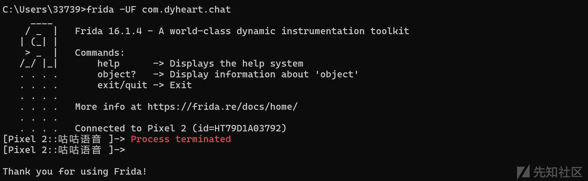

绕过的办法很多，这里选择使用florida这个去除部分特征的server  
<https://github.com/Ylarod/Florida>  
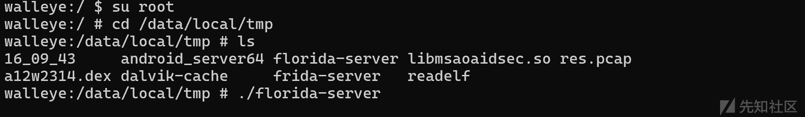

运行hook nativeregister的js脚本，发现能绕过，而且打印出了native\_makeUrl的地址

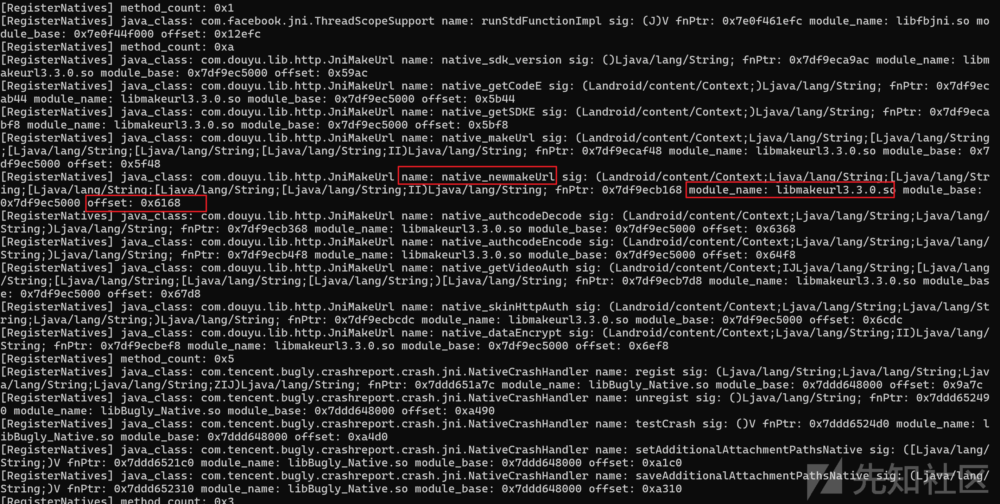

在ida中跳转到0x6168，这里的sub\_0005就是native\_makeUrl的逻辑了

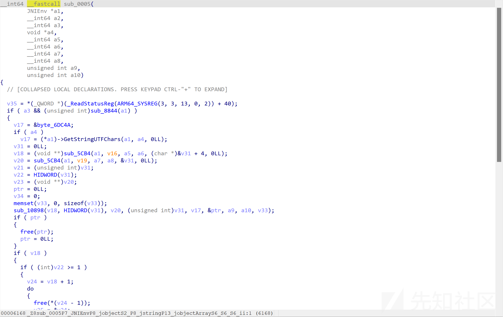

下面来hook一下这个native\_makeUrl,来确定定位的对不对

```
Java.perform(() => {
    // 获取包含目标原生函数的Java类对象
    var JniMakeUrlClass = Java.use("com.douyu.lib.http.JniMakeUrl");
    if (JniMakeUrlClass) {
        // 替换目标原生函数的实现
        JniMakeUrlClass.native_newmakeUrl.implementation = function (context, str, strArr, strArr2, strArr3, strArr4, i, i2) {
            // 在这里可以添加代码来打印传入的参数信息
            console.log("Context 参数: ", context);
            console.log("字符串参数: ", str);
            console.log("字符串数组参数（长度: " + (strArr && strArr.length || 0) + "）:");
            if (strArr && Array.isArray(strArr)) {
                for (var j = 0; j < strArr.length; j++) {
                    console.log("  元素 " + j + ": " + strArr[j]);
                }
            }
            // 同理处理其他字符串数组参数strArr2、strArr3、strArr4
            console.log("字符串数组参数2（长度: " + (strArr2 && strArr2.length || 0) + "）:");
            if (strArr2 && Array.isArray(strArr2)) {
                for (var k = 0; k < strArr2.length; k++) {
                    console.log("  元素 " + k + ": " + strArr2[k]);
                }
            }
            console.log("字符串数组参数3（长度: " + (strArr3 && strArr3.length || 0) + "）:");
            if (strArr3 && Array.isArray(strArr3)) {
                for (var l = 0; l < strArr3.length; l++) {
                    console.log("  元素 " + l + ": " + strArr3[k]);
                }
            }
            console.log("字符串数组参数4（长度: " + (strArr4 && strArr4.length || 0) + "）:");
            if (strArr4 && Array.isArray(strArr4)) {
                for (var m = 0; m < strArr4.length; m++) {
                    console.log("  元素 " + m + ": " + strArr4[m]);
                }
            }
            console.log("整数参数1: ", i);
            console.log("整数参数2: ", i2);

            // 调用原函数获取返回值
            var retval = this.native_newmakeUrl(context, str, strArr, strArr2, strArr3, strArr4, i, i2);
            // 可以在这里打印返回值相关信息，比如
            console.log("函数返回值: ", retval);
            return retval;
        };
    } else {
        console.log("未能找到 com.douyu.lib.http.JniMakeUrl 类");
    }
});

```

看着没啥毛病，估计调用链定位得没问题  
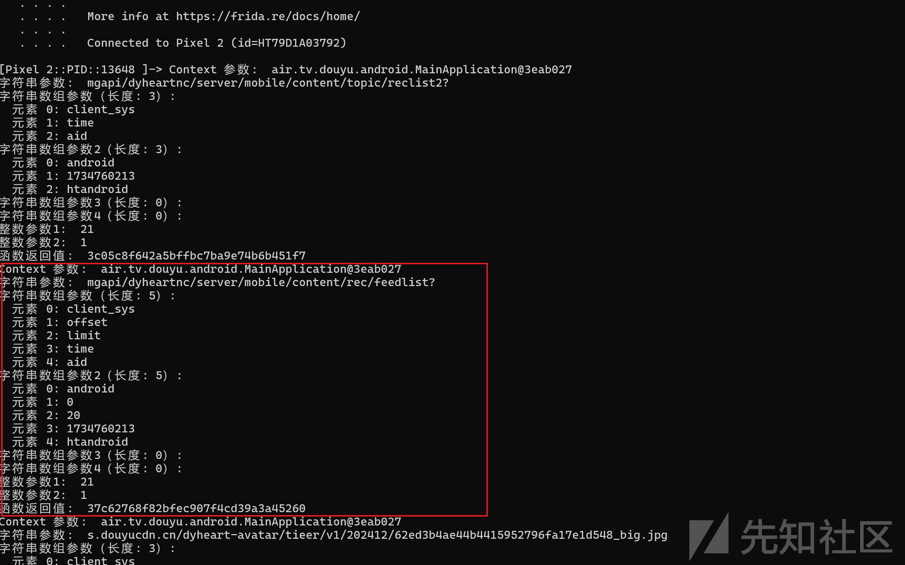

总结调用链

```
com.dyheart.lib.dylog.network.RequestInterceptor.a(Request request, String str)——>
com.dyheart.lib.dylog.network.RequestInterceptor.a(Context context, String str, Map<String, String> map, Map<String, String> map2, String str2)——>
com.douyu.lib.http.MakeUrlClient.b(Context context, String str, String[] strArr, String[] strArr2, String[] strArr3, String[] strArr4, int i, int i2)——>
com.douyu.lib.http.MakeUrlClient.b(Context context, String str, String[] strArr, String[] strArr2, String[] strArr3, String[] strArr4, int i, int i2)——>
com.douyu.lib.http.JniMakeUrl.native_newmakeUrl
```

下面具体分析auth的生成  
有时候感觉不必每个函数的看得清清楚楚，找到关键点可能会有四两拨千斤的效果  
这里的关键的就是native\_newmakeUrl函数  
通过hook,可以看到native\_newmakeUrl的参数是多数都是些固定值，除了字符串数组2的元素3，目测是一个时间戳

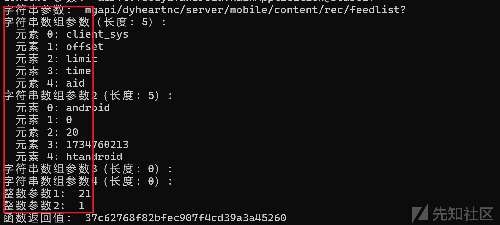  
于是下面从变成从前面调用链中的许多的函数中找到这个元素3是怎么生成的就好了  
先定位到前一个函数的strArr2

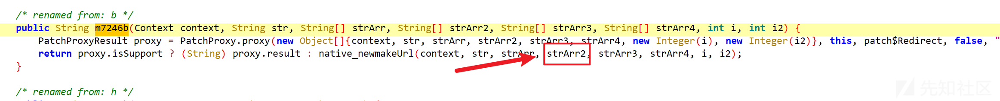  
接着回溯


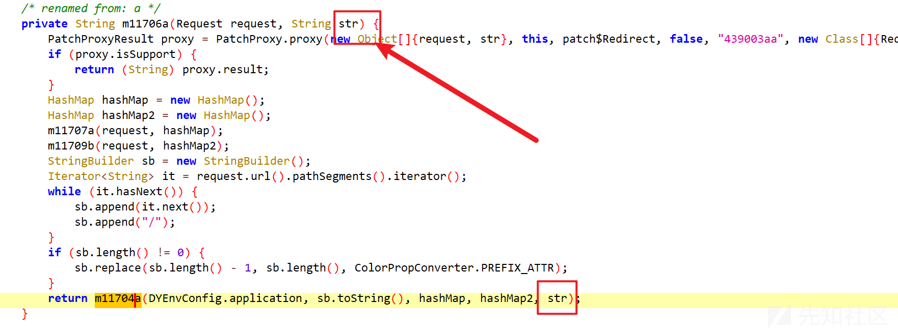

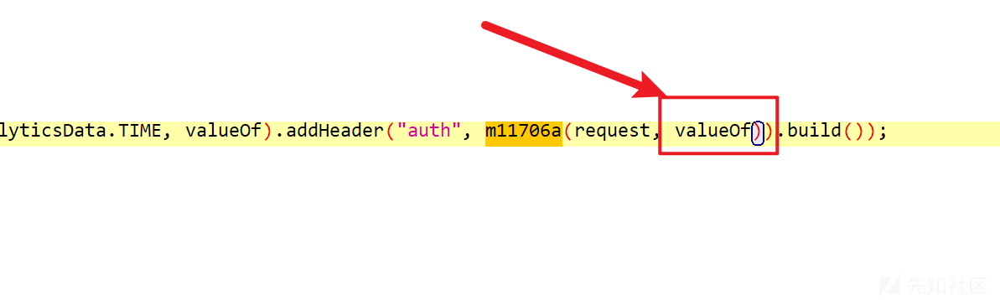  
最终发现这个元素3是在调用链的最开始传进来的，是时间戳无疑了，System.currentTimeMillis()/1000一眼钉帧了

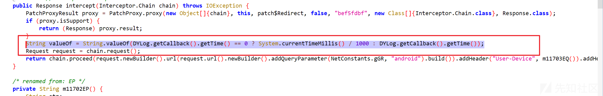

这样子用于生成auth的所有参数都搞定了

接着看看auth是怎么生成的，我们来到偏移0x6168,将第一个参数类型改成JNIEnv\*。这里起手是拉到返回值出逆着看。  
很快就发现这个返回值是将v29转变成java字符串而成的，而v29可能与v33有关

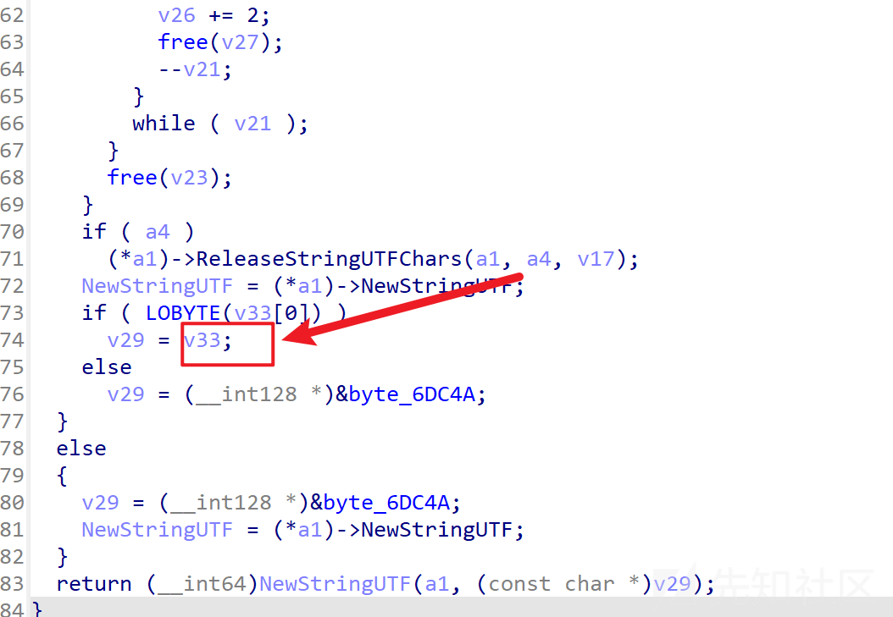  
接着网上看发现v33被sub\_10898赋值了

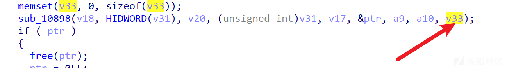  
于是hook一下sub\_10898

```
function hook_sub_10898(){
    var addr = Module.findBaseAddress("libmakeurl3.3.0.so");
    console.log("libmakeurl3.3.0.so base address: " + addr);
    var funcAddr = addr.add(0x10898);
    console.log("makeurl3.3.0.so makeurl address: " + funcAddr);
    Interceptor.attach(funcAddr, {
        onEnter: function (args) {
            this.args8 = args[8];
            console.log("args0: " + args[0]);
            console.log("args1: " + args[1].toInt32());
            console.log("args2: " + args[2]);
            console.log("args3: " + args[3]);
            console.log("args4: " + Memory.readUtf8String(args[4]));
            console.log("args5: " + (args[5].readPointer()));
            console.log("args6: " + args[6].toInt32());
            console.log("args7: " + args[7].toInt32());
            console.log("args8: " + hexdump(args[8]));
        },
        onLeave: function (retval){
            // console.log("retval:" + retval);
            console.log("retval:" + Memory.readUtf8String(retval));
            console.log("args8:" + hexdump(this.args8));
        }
    })
}

```

这里的args8也就是v33,它经过了这个函数确实变成了auth的值  
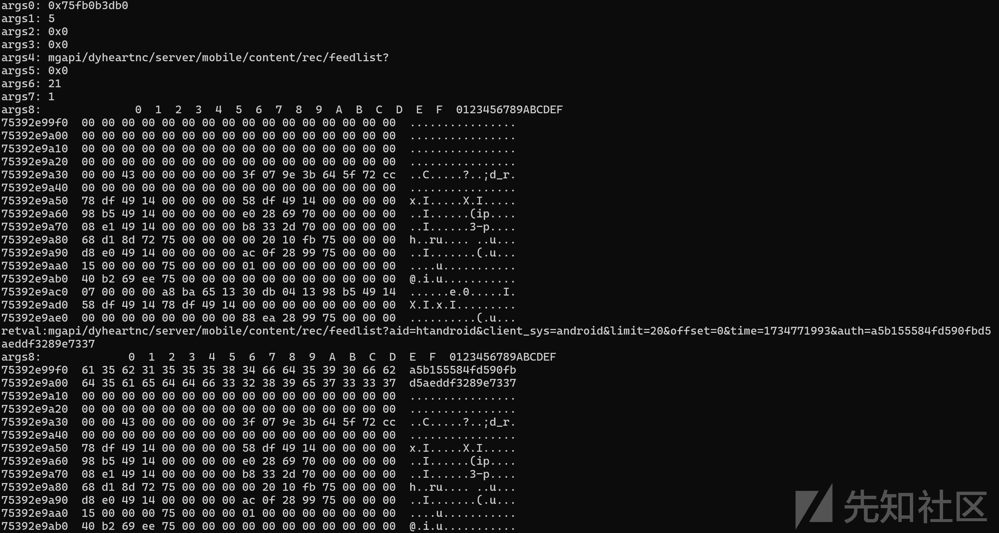  
于是键入sub\_10898,还是起手拉最后，看返回值  
emm...... 发现result是a6和a9拼接的，但是并没有直接看到a9是怎么来的qaq  
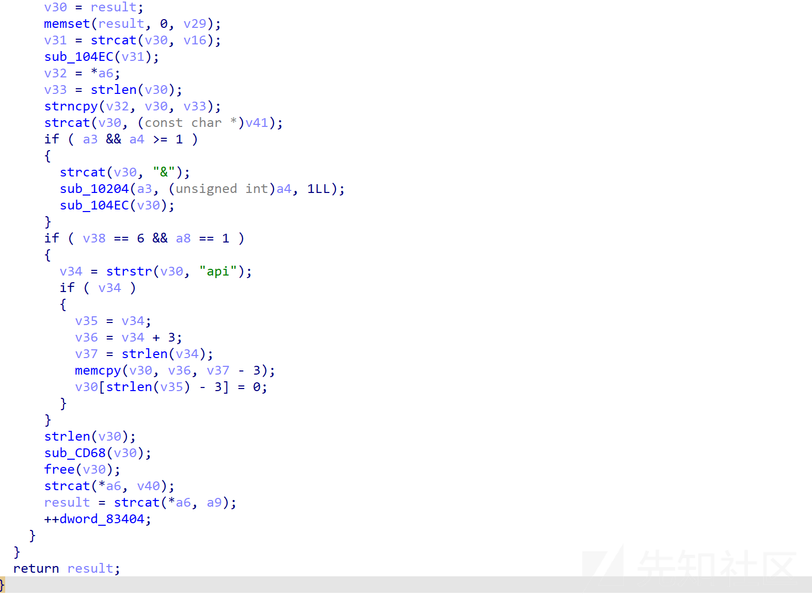  
太菜了wuwuwu，还是先hook一手离result最近的sub\_CD68

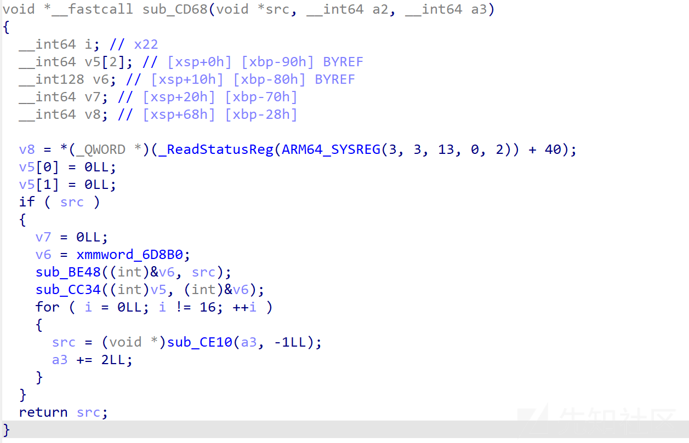

```
function hook_sub_CD68(){
    var addr = Module.findBaseAddress("libmakeurl3.3.0.so");
    console.log("libmakeurl3.3.0.so base address: " + addr);
    var funcAddr = addr.add(0xCD68);
    Interceptor.attach(funcAddr, {
        onEnter: function (args) {
            this.args1 = args[1];
            console.log("args0: " + args[0].readUtf8String());
            console.log("args1: " + args[1]);
            console.log("args2: " + hexdump(args[2]));
        },
        onLeave: function (retval){
            console.log("retval:" + retval);
        }
    })
}

```

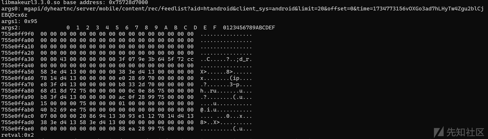

经过观察，后面拼接的"vOXGo3ad7hLHyTw4Zgu2blCjEBQDcx6z"貌似是不会变的

观察一下前面的sub\_CE10，这个貌似是规范输出的

  
观察一下sub\_CC34，这个长得有点像MD5

于是对比一下,发现确实是MD5

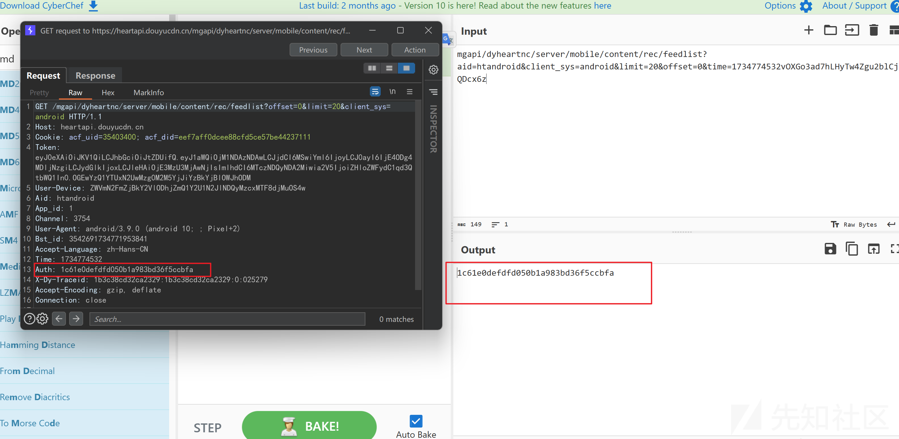

于是分析到此就可以知道auth是如何生成的了。
