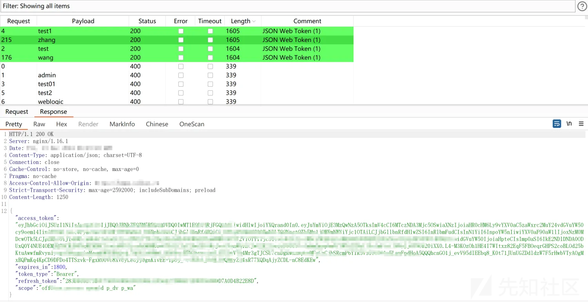
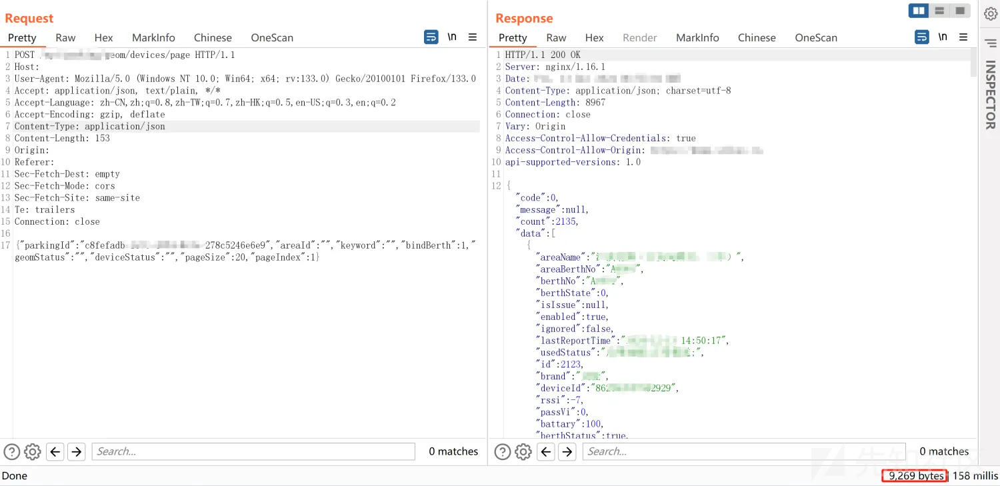
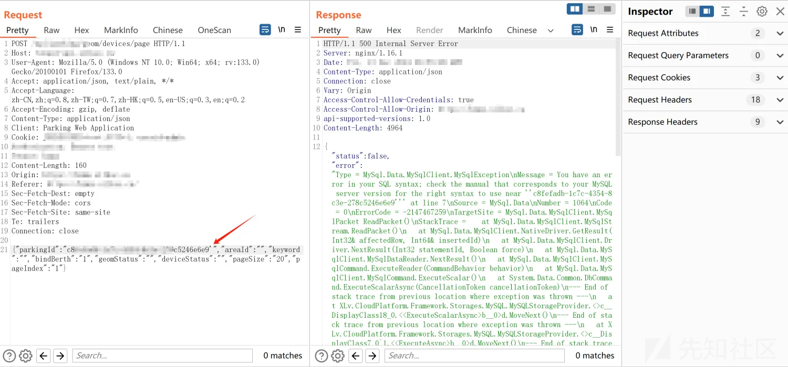
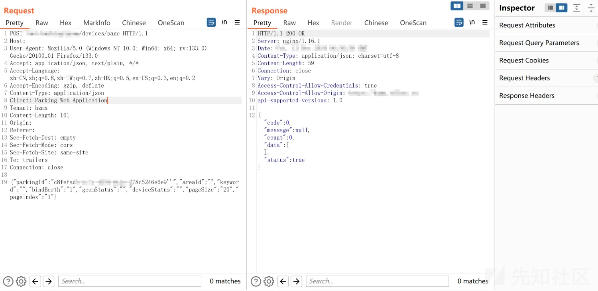
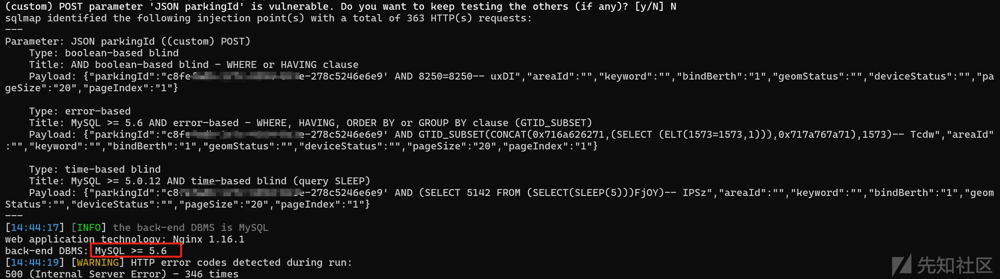
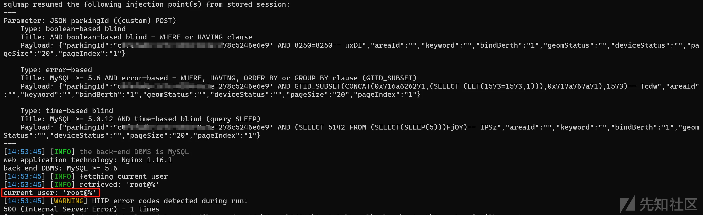
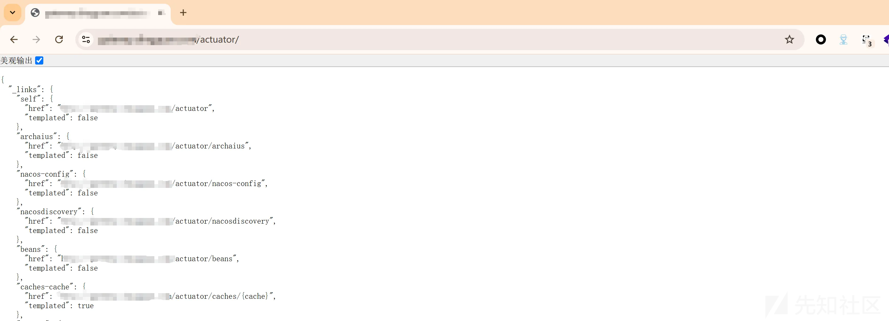
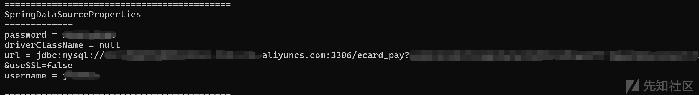
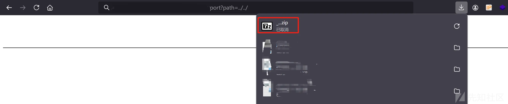
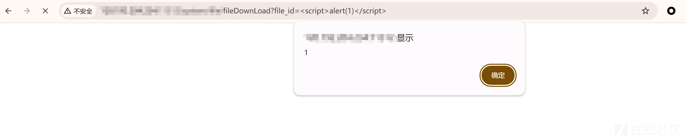

# 针对单一系统渗透测试-先知社区

> **来源**: https://xz.aliyun.com/news/16298  
> **文章ID**: 16298

---

# 声明

本文章所分享内容仅用于网络安全技术讨论，切勿用于违法途径，所有渗透都需获取授权，违者后果自行承担，与本号及作者无关，请谨记守法.  
此文章不允许未经授权转发至除先知社区以外的其它平台！！！

# 前言

最近基本没啥事，就帮我朋友测测系统，当然是授权了的。此系统漏洞还是比较多的，并且利用起来比较简单，并没有很复杂的利用点，一个个功能点的进行测试不可能测不到，话不多说直接开干。

# 弱口令

首先开局一个登录框，一般进行爆破都会对密码进行爆破，账号默认为admin，但是将近10万的字典却并没有爆出来，所以换方向，默认密码admin或者123456等弱密码，然后对账号进行爆破，这不，就出货了，爆破出四个弱口令账号，均可进行登录

  
但是测试发现wang和zhang的账号权限更高，数据更多，因此使用其中一个账号进行渗透，使用wang账号登录进去

# SQL注入

因数据太敏感就不展示网站页面了，反正就是各种点点点，发现某个接口存在报错情况

  
通过单引号测试，存在报错，看报错情况像是MYSQL数据库

  
闭合单引号，发现正常回显，这一看情况就是了

  
直接丢sqlmap一键梭，成功出货

  
爆出数据库为root，后续继续深入爆破发现大量密码并且该域名存在其它网站，可以试试跨库查询，可以直接横向渗透了

# spring泄露

通过burp被动插件扫描出springboot泄露，而且泄露的路径很多，这里一看就像有东西的样子

  
存在一个headump泄露，使用headump还原工具发现阿里云数据库并且存在账号密码，我想这 不是都爆出数据库了吗，怎么还存在云数据库，以看spring泄露接口原来是其它域名，因此猜测阿里云数据库为其它子域名的服务接口，但是连不上去，不知道是不是做了限制

# 文件下载

通过前端源码发现大量接口，其字段都很敏感且感觉就像有东西的样子，比如upload,file,userlist,info等等，这不就找到一个接口可以对网站进行整站打包下载，里面的数据库备份文件，日志，源码等等都有

# XSS

通过代码简单审计存在另一个文件下载接口，但是是根据file\_id来判断，例如xxxxxx-xxxx-xxxx-xxxxxx这种形式，一看就没戏，但是这里却可以进行XSS，这里也说明还有其它的地方可能也存在，并没有配置全局过滤

