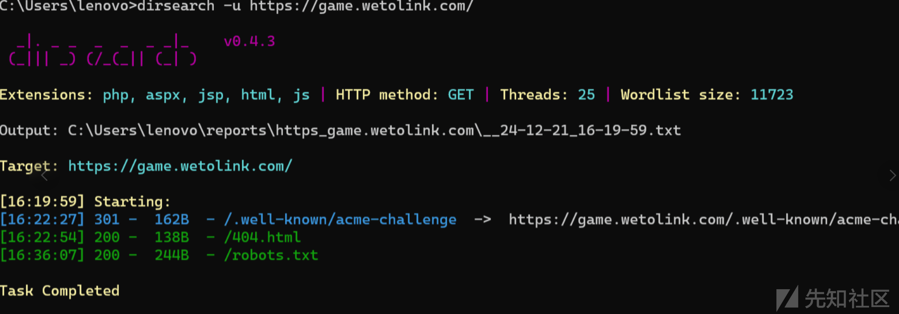
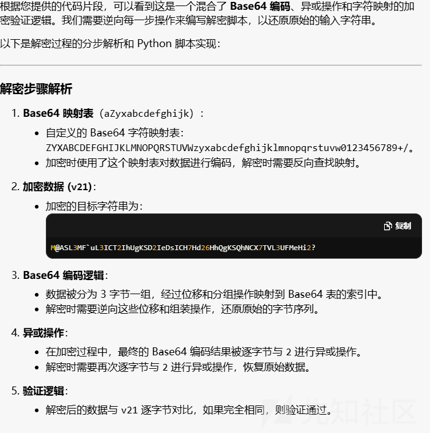
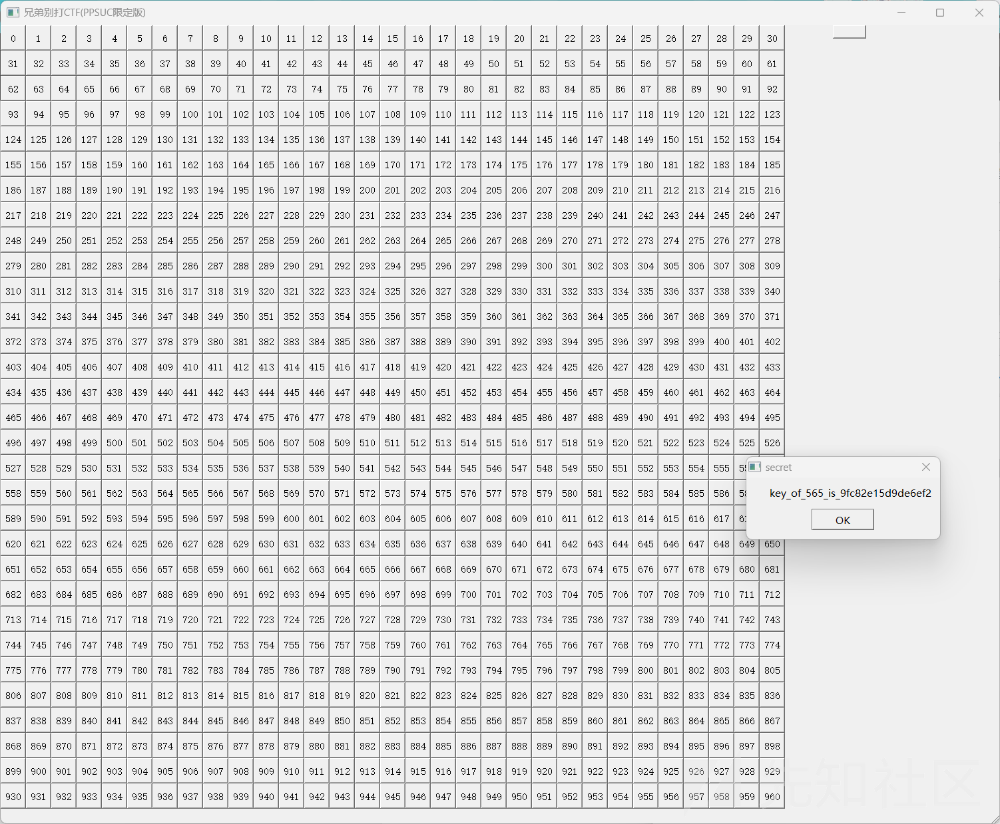
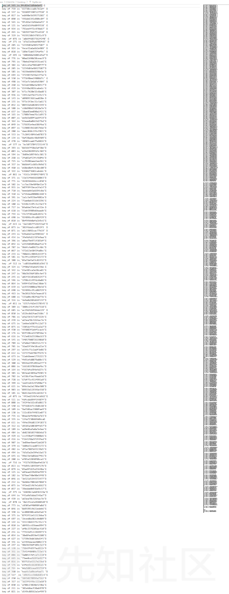

# 暴力通关，PyAutoGUI解re游戏题——DASCTF2024最后一战RE部分题解-先知社区

> **来源**: https://xz.aliyun.com/news/16304  
> **文章ID**: 16304

---

# 前言

DASCTF2024最后一战的题目其实中规中矩没什么好说的，但是队友的一种做法非常新颖，所以笔者决定写这篇文章，扩宽一下大家的做题思路。

# CHECKIN

不算签到的签到题，其实是个web签到题，但是放在checkin里没人猜得到((  
扫一下，在robot.txt里找到flag。



# tryre

将IDA的伪代码简要分析一下，发现是base64加一点点魔改，伪代码发给gpt直接梭哈



## EXP

```
# 自定义 Base64 字符映射表
custom_base64 = "ZYXABCDEFGHIJKLMNOPQRSTUVWzyxabcdefghijklmnopqrstuvw0123456789+/"
reverse_base64 = {char: idx for idx, char in enumerate(custom_base64)}

# 加密数据
encrypted = "M@ASL3MF`uL3ICT2IhUgKSD2IeDsICH7Hd26HhQgKSQhNCX7TVL3UFMeHi2?"


# 解密：逐字节异或还原
def xor_decrypt(data, key=2):
    return ''.join(chr(ord(char) ^ key) for char in data)


# 解密：Base64 自定义表解码
def custom_base64_decode(data):
    decoded_bytes = []
    for i in range(0, len(data), 4):
        chunk = data[i:i + 4]

        # 处理填充字符 '='
        padding = chunk.count('=')
        chunk = chunk.replace('=', 'A')  # 临时替换填充字符，用于解码

        # 逐字节解码
        b1 = reverse_base64[chunk[0]] << 2 | reverse_base64[chunk[1]] >> 4
        b2 = (reverse_base64[chunk[1]] & 0xF) << 4 | reverse_base64[chunk[2]] >> 2
        b3 = (reverse_base64[chunk[2]] & 0x3) << 6 | reverse_base64[chunk[3]]

        decoded_bytes.extend([b1, b2, b3])

        # 根据填充字符调整解码结果
        if padding > 0:
            decoded_bytes = decoded_bytes[:-padding]

    return bytes(decoded_bytes)


# 解密过程
def decrypt(encrypted):
    # Step 1: 逐字节异或还原
    after_xor = xor_decrypt(encrypted)

    # Step 2: 使用自定义 Base64 表解码
    decoded = custom_base64_decode(after_xor)

    return decoded.decode('utf-8')


# 调用解密函数
try:
    decrypted = decrypt(encrypted)
    print("解密结果:", decrypted)
except Exception as e:
    print("解密失败:", e)
```

DASCTF{454646fa-2462-4392-82ea-5f809ad5ddc2}

# secret\_of\_inkey

点进去发现是一个小游戏。

  
解析一下，每一个格子需要key来解锁 每一格格子可能会给出4个key（可能重复）  
正常解法应该IDA解析算法，然后写算法爆破得到结果。

但是为什么不能直接玩出flag呢，自己玩太累交给机器玩不就好了。

一开始的思路是ocr识别的，但是一些数字和字母识别的成功率不高，最后换成了pyautogui来进行自动化脚本操作。  


简单介绍一下pyautogui

## PyAutoGUI

PyAutoGUI提供了一种强大且易于使用的方式来自动化各种与计算机交互的任务。它可以帮助提高生产力,并简化复杂的工作流程

需要注意的是我们需要使用剪枝来避免进入重复的死循环。

## EXP

```
import pyautogui
import time
from pywinauto.application import Application

print("脚本将在3秒后开始运行...")
time.sleep(3)

start_x, start_y, end_x, end_y = 900, 210, 2080, 1390

grid = []
key = []

grid.append(565)
key.append('9fc82e15d9de6ef2')

# 初始化一个集合用于记录已访问的网格位置
visited = set()
visited.add(565)

while len(grid):
    current_grid = grid.pop()
    current_key = key.pop()

    grid_x = start_x + 38 * (current_grid % 31) + 5
    grid_y = start_y + 38 * (current_grid // 31) + 16

    pyautogui.click(grid_x, grid_y)
    time.sleep(0.3)
    pyautogui.typewrite(current_key + '\n')
    time.sleep(0.3)

    try:
        app = Application(backend="uia").connect(title="Right!")
        dialog = app.window(title="Right!")
        static_text = dialog.child_window(control_type="Text")
        text = static_text.window_text()
    except Exception as e:
        print(f"无法连接到窗口: {e}")
        continue

    pyautogui.typewrite('\n')

    print(text)
    if 'true' in text.lower():
        break
    if 'nothing' in text.lower():
        continue

    t = text.split('\n')
    print(t)

    # 假设每一行都有足够的长度，添加异常处理以避免索引错误
    for i in range(min(4, len(t))):
        try:
            new_key = t[i][-17:-1]
            new_grid = int(t[i][7:10])

            if new_grid not in visited:
                key.append(new_key)
                grid.append(new_grid)
                visited.add(new_grid)  # 标记为已访问
        except (ValueError, IndexError) as e:
            print(f"解析第 {i} 行时出错: {e}")
            continue

    print("当前已访问的网格数量:", len(visited))
    print("待处理的key:", key)
    print("待处理的grid:", grid)
```

flag:DASCTF{Do\_y0u\_l1ke\_wh4t\_you\_s3e}

## 后续

希望这篇文章能扩宽大家的解题思路。  
CHECKIN与secret\_of\_inkey solved by 梦云喵师傅
