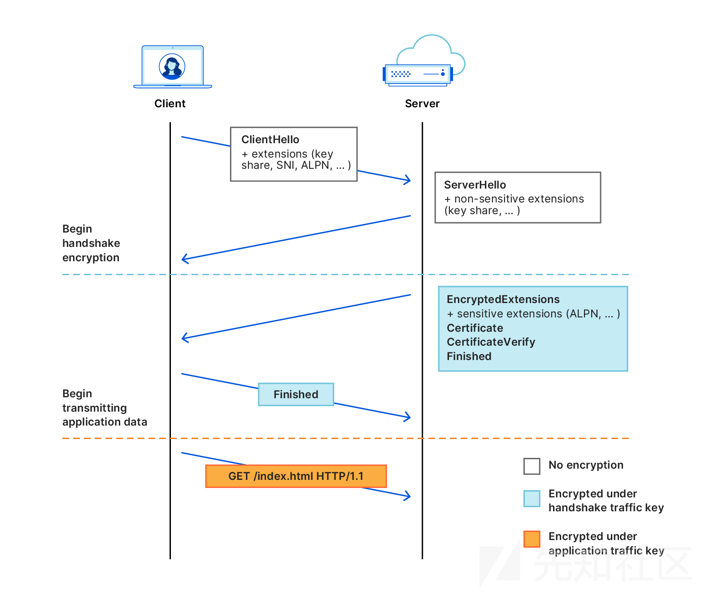
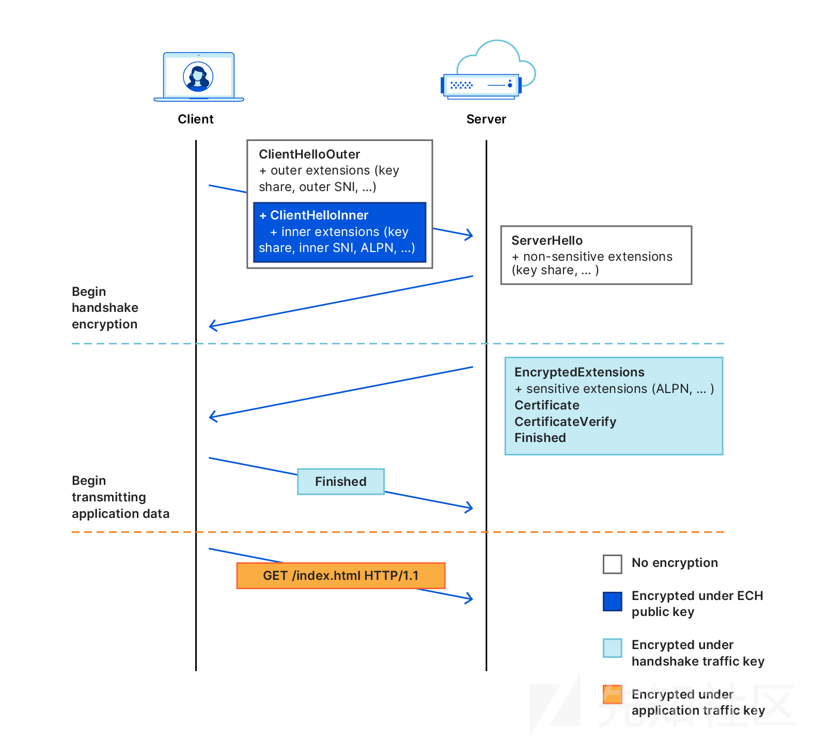
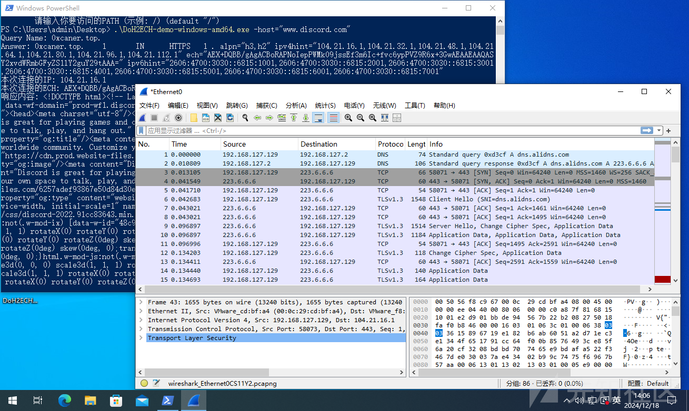
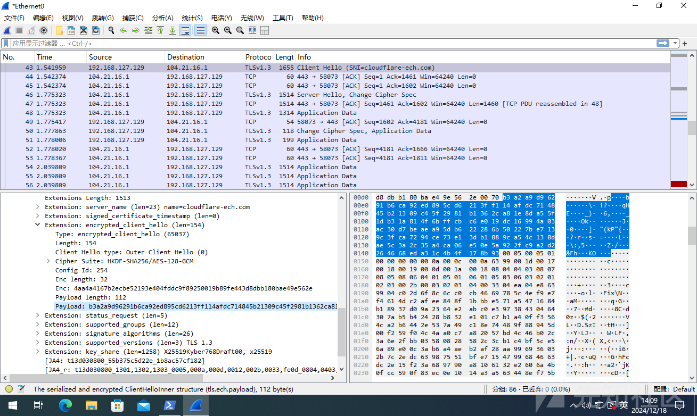

# ECH，新时代的域前置-先知社区

> **来源**: https://xz.aliyun.com/news/16321  
> **文章ID**: 16321

---

## 背景

自从传统修改HOST的方式的域前置技术被各大CDN厂商修复之后，CloudFlare推动并率先支持的ECH技术，可达成近似目的。

Encrypted Client Hello（ECH）是一种用于TLS1.3协议的扩展，旨在增强隐私保护，针对中间人攻击和流量分析的防护。ECH允许客户端在TLS握手的初期就加密"Client hello"信息，从而防止第三方查看链接的细节。

查看你的浏览器是否支持ECH可以访问以下链接：

```
https://tls-ech.dev/
https://cloudflare-ech.com/cdn-cgi/trace
```

## ECH对比传统握手过程

传统的TLS1.3握手存在以下明文信息：

* 客户端支持的加密套件
* SNI（Server Name Indication,服务器名称指示），即要访问的服务器名
* 其他协议扩展字段



这些明文信息会被各类企业内部网络设备检测，而ECH技术会加密整个ClientHello包，把真正的ClientHello使用公钥加密，并放入握手包的extension部分也被称为ClientHelloInner，而流量设备能看到的ClientHelloOuter（也就是原始的明文ClientHello部分）的SNI是虚假的。



那么这个加密ClientHelloInner部分的公钥从哪里来呢？

公钥被CloudFlare放在了DNS域名的HTTPS解析记录里面，可以通过dig命令查看。

支持ECH的情况:

```
~# dig +short research.cloudflare.com TYPE65
1 . alpn="h2" ipv4hint=104.18.4.139,104.18.5.139 ech=AEX+DQBBmgAgACCNFwS4pgiG2q4rxde+tqxJ4wUIeoHX1aAAv4oYxDjlZwAEAAEAAQASY2xvdWRmbGFyZS1lY2guY29tAAA= ipv6hint=2606:4700::6812:48b,2606:4700::6812:58b

```

不支持ECH的情况:

```
~# dig +short crypto.cloudflare.com TYPE65
1 . alpn="h2" ipv4hint=162.159.135.79,162.159.136.79 ipv6hint=2606:4700:7::a29f:874f,2606:4700:7::a29f:884f

```

ech部分的内容包含了，ECH握手过程所需的一切

```
public_name: cloudflare-ech.com                    // 公钥名称
pk: 8d1704b8a60886daae2bc5d7beb6ac49e305087a81d7d5a000bf8a18c438e567 // 公钥
kemid: 32                                          // 密钥交换算法 ID
extensions: []                                     // 协议扩展
version: 65037                                     // 配置版本
cipher_suite: [{1 1}]                              // 对称加密套件
```

解析ECH，可以参考这个项目:<https://github.com/hellais/ech>

而目前所有CloudFlare ECH服务端共用一个公钥，你可以向开启了CloudFlare ECH服务的任意域名，发送DNS的HTTPS类型请求获取TLS握手公钥（托管在CloudFlare的DNS均默认开启），但是考虑到DNS请求是明文传输的，可以更进一步，使用DoH（DNS over HTTPS）服务，加密整个过程。

## ECH客户端

2024年5月Golang官方添加了ECH客户端支持：<https://go-review.googlesource.com/c/go/+/578575#related-content>

我据此编写了一个使用阿里 DoH + Cloudflare的ECH实现的一个简单的Https GET请求demo：<https://github.com/0xCaner/DoH2ECH_demo>

## 编译

```
Linux和Mac上的编译方法 (Requires go >= 1.23)
# 为 Linux 64-bit 编译
GOOS=linux GOARCH=amd64 go build -o DoH2ECH-demo-linux-amd64

# 为 Windows 64-bit 编译
GOOS=windows GOARCH=amd64 go build -o DoH2ECH-demo-windows-amd64.exe

# 为 macOS 64-bit 编译
GOOS=darwin GOARCH=amd64 go build -o DoH2ECH-demo-darwin-amd64
```

## 运行

```
Usage of DoH2ECH-demo-windows-amd64.exe:
  -h    显示帮助信息
  -host string
        请输入你要访问的HOST (示例: www.discord.com) (default "www.discord.com")
  -path string
        请输入你要访问的PATH (示例: /) (default "/")
```

```
.\DoH2ECH-demo-windows-amd64.exe -host="www.discord.com" -path="/"
等效于访问https://www.discord.com/
```

## 连接测试

以访问www.discord.com为例子 **（该技术目前测试可以绕过GFW）**

DNS：只有dns.alidns.com的请求（可更换为任意DoH服务，目前使用的是阿里DoH）



SNI: 只能看到cloudflare-ech.com:



真正的inner-client-hello包使用公钥加密在Extension中，无法被流量设备发现真实目标网站。

## 参考资料

<https://developers.cloudflare.com/ssl/edge-certificates/ech/>

<https://github.com/hellais/ech>

<https://tls-ech.dev/>

<https://go-review.googlesource.com/c/go/+/578575#related-content>

[golang/go#63369](https://github.com/golang/go/issues/63369)
