# 基于科来的哥斯拉流量分析-先知社区

> **来源**: https://xz.aliyun.com/news/16332  
> **文章ID**: 16332

---

简单介绍科来使用  
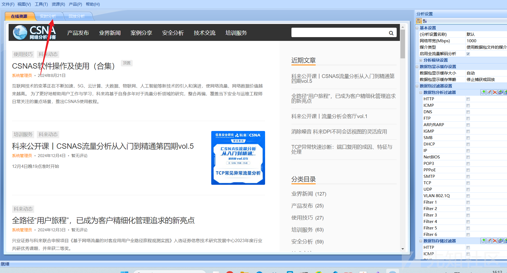

### `实时分析`

与wireshark的抓包功能类似不在赘述  
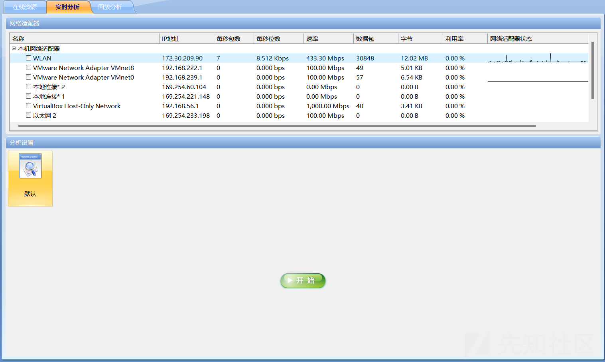

### `回访分析`

流量分析最常用,点击添加文件或直接将数据包拖进然后点击开始

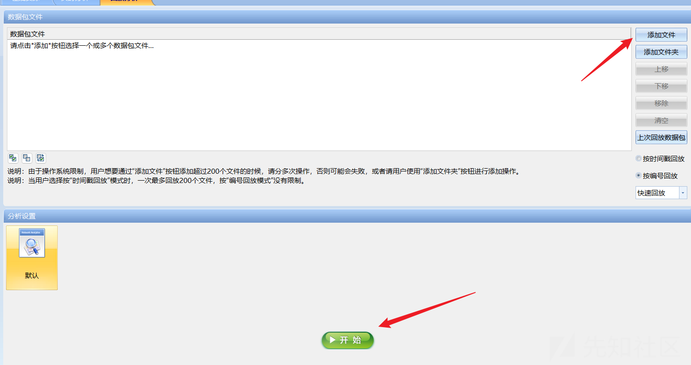

### 哥斯拉流量分析

这里不看概要点击协议,看协议分级,统计各种数据包的流量占比

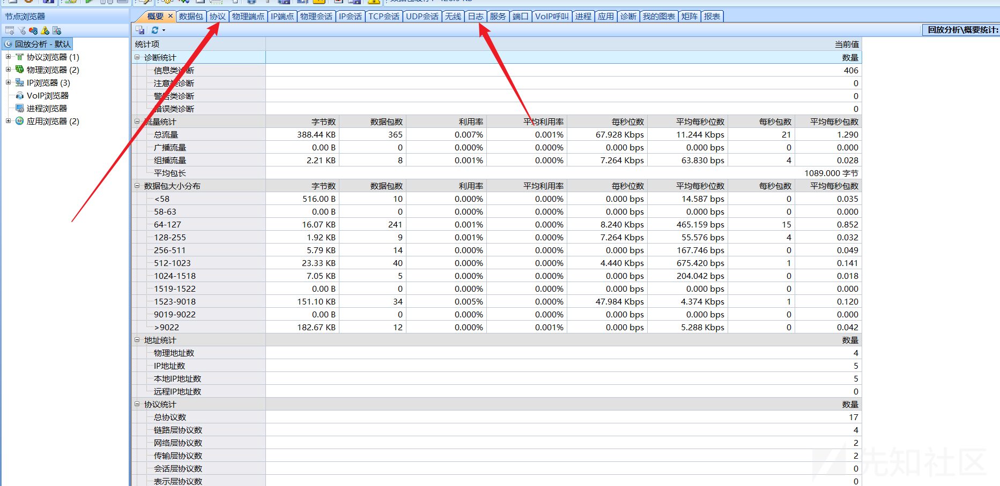

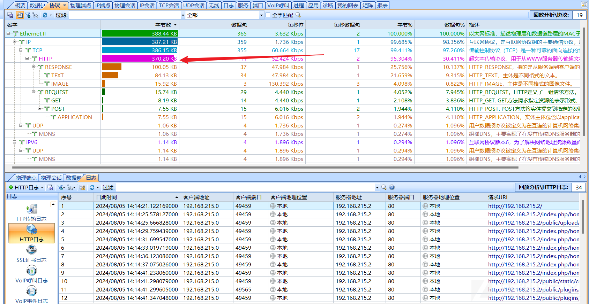

http最多,在通过日志的http日志就可以直观的看出流量走向

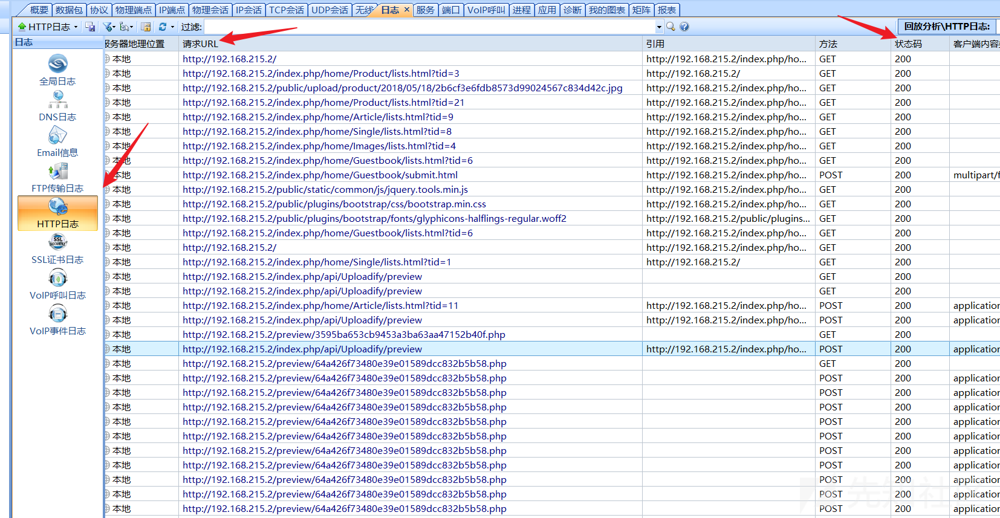

通过请求的url,方法,响应的状态码相结合来快速的定位恶意流量  
可以看到**3595ba653cb9453a3ba63aa47152b40f.php**是首次被请求的且后缀为php,双击就可以打开它的数据流,即使删除这个数据流页面还是定格在初始点击的位置,这一点比wireshark好很多

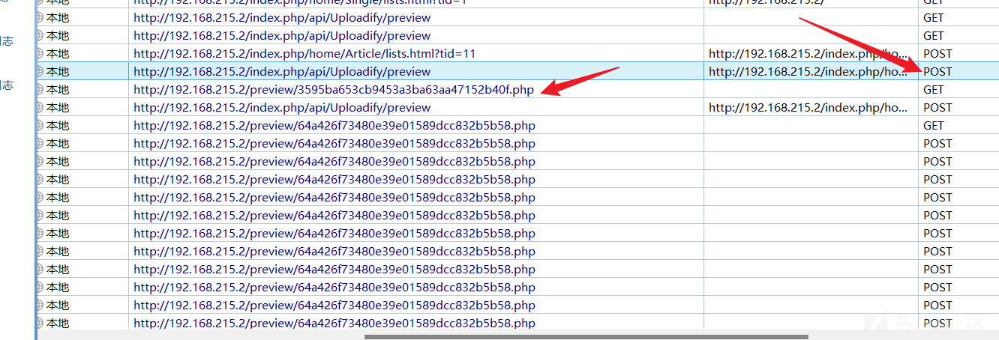

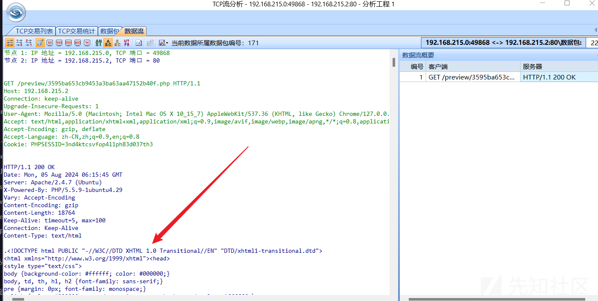

将响应内容保存发现发现是phpinfo页面

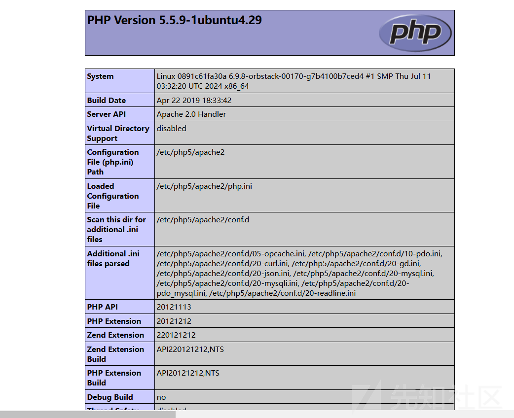

打开这个**3595ba653cb9453a3ba63aa47152b40f.php**日志的上一个日志看为什么会回显phpinfo()页面  
右键打开科来自带的编解码转换工具,对段base64解码内容为`<?php phpinfo();`通过回显可以知道将其保存到`3595ba653cb9453a3ba63aa47152b40f.php`,这个preview存在文件上传漏洞

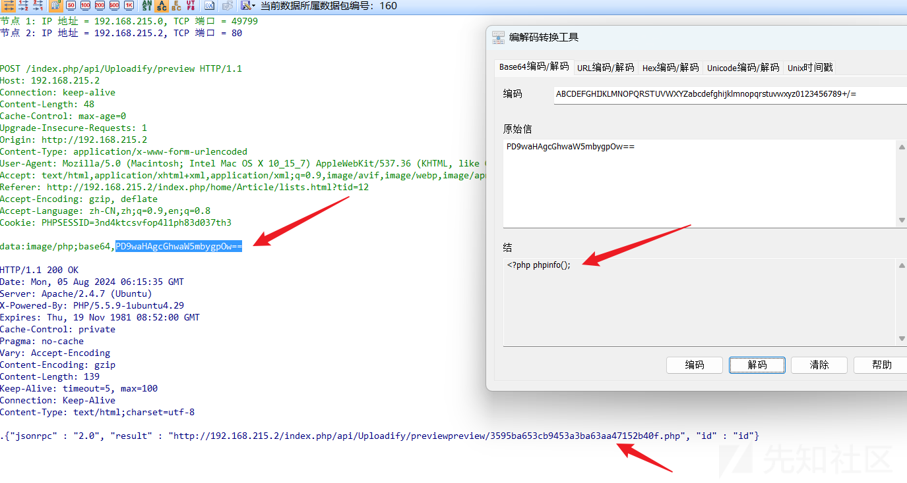

分析下一个数据包可以知道攻击者上传了一个base64编码的gsl马保存到**64a426f73480e39e01589dcc832b5b58.php**

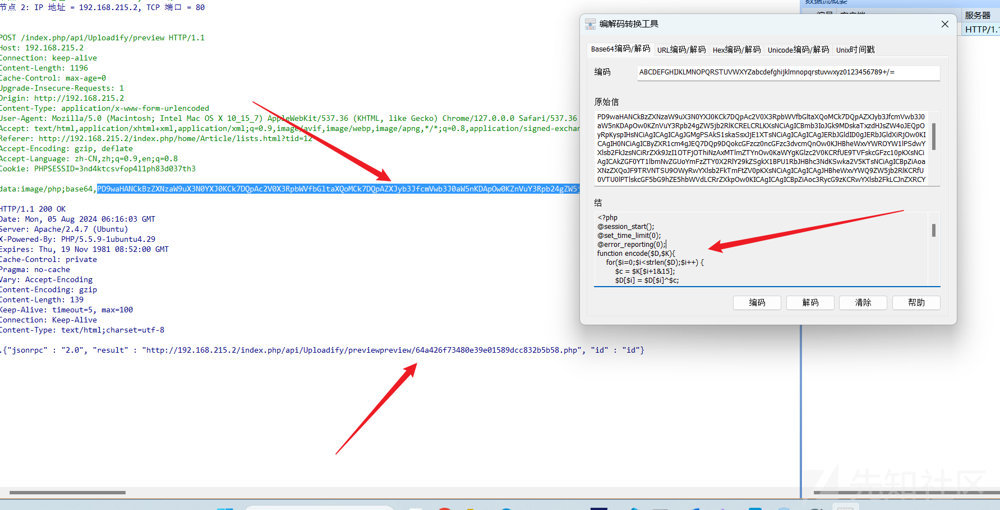

对gsl马进行分析知道了密码为`password`与key值为`2591c98b70119fe6`

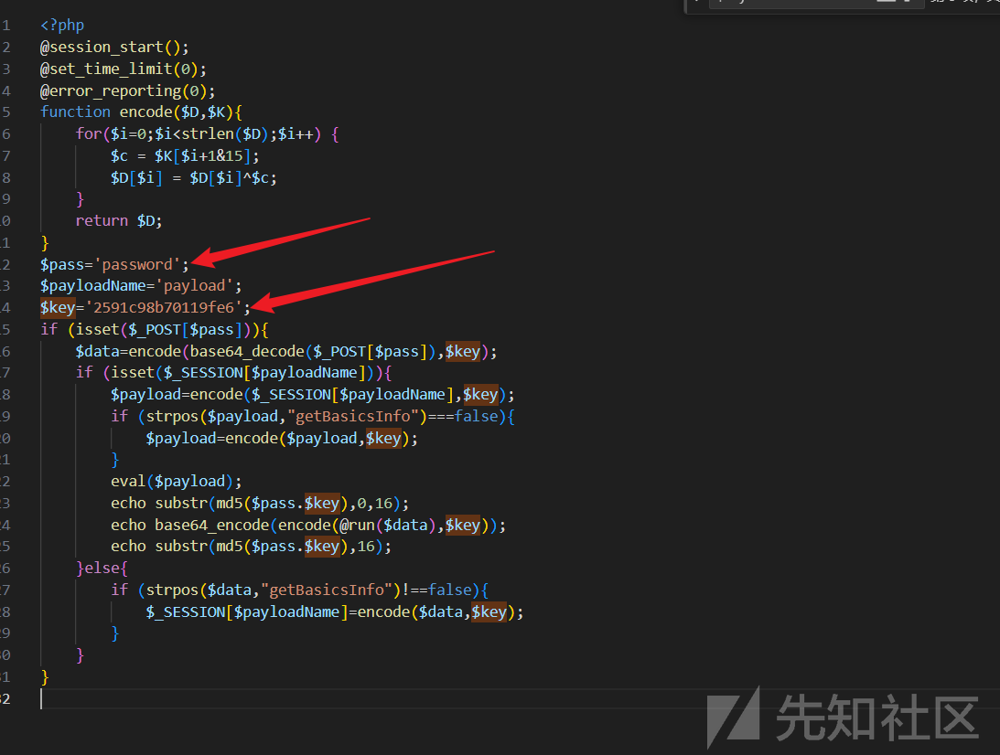

继续分析使用ABC\_123师傅写工具对passwd传参密文进行解密

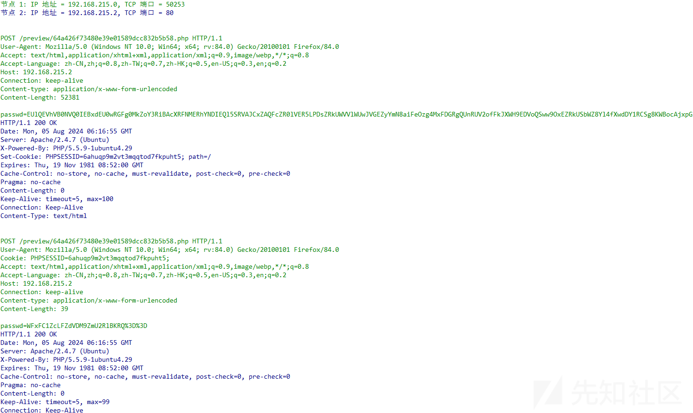

可以看到哥斯拉工具的一些操作的运行逻辑

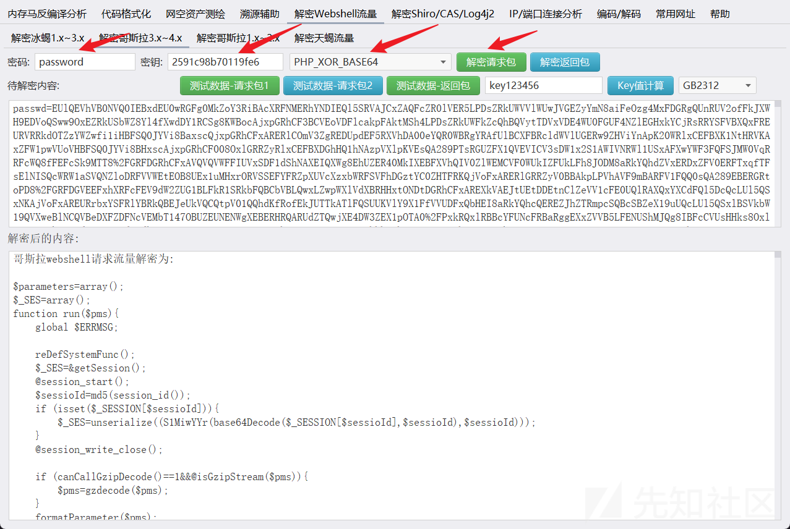

解密响应包

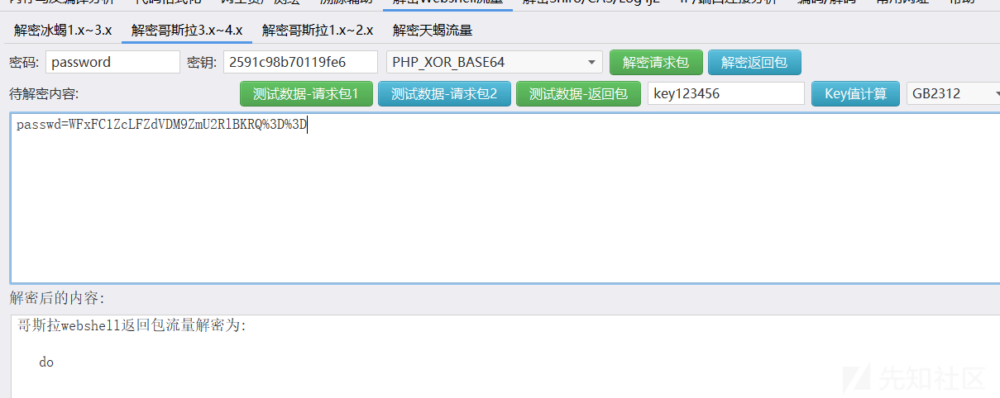

接下来连续几个都是这种类似于传输执行逻辑确认连接的的包,没有具体执行命令

在数据包305,首先使用gls的test的方法测试连接性(这里不在展示工具解密截图)在调用getBasicsInfo查询基本配置信息

```
#第一次请求
password=WFxFC1ZcLFZdVDM9ZmU2RlBKRQ%3D%3D
哥斯拉webshell请求流量解密为:
methodName test

响应
da5e516094aa1c4dKrI5Yzk4YjcwMvr2YGVx7+lAM2M5OA==e3193740098942d0
哥斯拉webshell返回包流量解密为:
ok

#第二次请求
password=WFxFC1ZcLFZdVDM0ZmU2VVBNcwJKUQFEeV9XVg%3D%3D
哥斯拉webshell请求流量解密为:
methodName getBasicsInfo

响应
da5e516094aa1c4dKrI5Yzk4YjcwMkRsOwrcCiVE/syxjE2Mojh4M3KfsLLbXGT5sejfYMf0A7BHu8xZWJ5xHMS2cR8Q3CQTqvkvvdjICLD1Fod5tX7QMvWoB77yqpV/HAOQJ6NBJXTEFHmrmEyVH9b9E8Uoxse2vSQk9e7+ozW6yNUTHGdIgc/+xp2zvnhx/zctONliK74J/m+q89ARX7d/GgM4V7wIMt8BeThVRlslQndGFGkeb78Dt5XGwCuDXaok/lgtlPBW7xmDCWJeQw+05dRRwVyKr5Q5zqmUjizuy6frayHdyb+uRMOP+Pq/Gv0AysdTzEbztn3eQINrnxNOvEIsNiSKAq4f7ACLRS9wM9IZldKpSQRh3N6oC94Eynj65JyLwBdAvucRRo2Lme8Rz9gwh6a9OXSJMiv5BJW7AAgzVGxtZoePQPnaJT106fz3winsYr5f1DhhVq2IxwNLhYWNB5stottpI0oqNxeAGuw+auxtqXgMT+9wIpdvSp8pyT0jVaMs2ROkY/XCQsmtXKKU75eLMvCBpHDvKuy+qzwFPNngaA/Ey4pu6F7P0EvU2ttrPsIP+ZLMJuGiFm3QEbkjiy4JP5eQkC1DYWAhBdd8XXw9zO2Kanh5Cf4FVhOtlEWnSDOSWr7bNljK1ioEqojVianfLW0mf/+jl1aoLcWRvTFCswOT3NsvNBJbQYsPk1s3YAMPhn0abhVOGe+14SsKfZyk/Lep2T0bwEpgSfNUYCMIGvqaz/vBpa8Yq+TAPMm0a5GC3hW7xTllSS9906tPNB3Ano93SZBywo0K9tW2lCzS7Tjm4gL34NYOP5RsLThRFyCQjNH/FjZ3Yz+6aFJ+qQL4+lpQCGs8vIWzbDqnU4r3eyttk5l1EhHGvvdy00r+opOXp/WsEbn2TvWcDOs1K7B1j+sC7lSS+xTjPTbUiqkJ1D9g0PE2oYtWHpuGFcUTSuemUW+uFurHOsJRVr8u8u7mvGLKEcVel3bHmsOoMgJUEeRUcCMATb7DmH+jpjJbatJTbed9Negn591S1sp8YDjj8HAHmkEePOiOPDd9kKvpI58Lgsg3OnXtT3ZBp6GyDGj32hZkH8CwZ/VbodMurG4/J77uI5jQv7BPBkMvJ0+6M78/Hr8/HwXEBm5N/xqTYO557kRSCbvY0XqY+zhRxtyWw8fNnzBL2/5zQGi0PmREfZgLxlUdDfMb0jgwMTtJudfD5cRLs/P3E42XsggmvxV3kDroTwadGuYC+LXVfGMV42CZsuSxYG+ZY7nPokHpBipd18FOEeXj42HVH8w1aYOaPhEE2qXKjvlAD2FZ5ermvxhVTDqrmOQInARfzfFO0xrJVzM1NTk=e3193740098942d0

哥斯拉webshell返回包流量解密为:
OsInfo : Linux 0891c61fa30a 6.9.8-orbstack-00170-g7b4100b7ced4 #1 SMP Thu Jul 11 03:32:20 UTC 2024 x86_64
CurrentUser : www-data
REMOTE_ADDR : 192.168.215.0
REMOTE_PORT : 50585
HTTP_X_FORWARDED_FOR : 
HTTP_CLIENT_IP : 
SERVER_ADDR : 192.168.215.2
SERVER_NAME : 192.168.215.2
SERVER_PORT : 80
disable_functions : pcntl_alarm,pcntl_fork,pcntl_waitpid,pcntl_wait,pcntl_wifexited,pcntl_wifstopped,pcntl_wifsignaled,pcntl_wexitstatus,pcntl_wtermsig,pcntl_wstopsig,pcntl_signal,pcntl_signal_dispatch,pcntl_get_last_error,pcntl_strerror,pcntl_sigprocmask,pcntl_sigwaitinfo,pcntl_sigtimedwait,pcntl_exec,pcntl_getpriority,pcntl_setpriority,
Open_basedir : 
timezone : 
encode : ISO-8859-15
extension_dir : /usr/lib/php5/20121212
systempdir : /tmp/
include_path : .:/usr/share/php:/usr/share/pear
DOCUMENT_ROOT : /var/www/html
PHP_SAPI : apache2handler
PHP_VERSION : 5.5.9-1ubuntu4.29
PHP_INT_SIZE : 8
ProcessArch : x64
PHP_OS : Linux
canCallGzipDecode : 1
canCallGzipEncode : 1
session_name : PHPSESSID
session_save_path : /var/lib/php5
session_save_handler : files
session_serialize_handler : php
user_ini_filename : .user.ini
memory_limit : 128M
upload_max_filesize : 2M
post_max_size : 8M
max_execution_time : 0
max_input_time : 60
default_socket_timeout : 60
mygid : 33
mypid : 961
SERVER_SOFTWAREypid : Apache/2.4.7 (Ubuntu)
loaded_extensions : Core,date,ereg,libxml,openssl,pcre,zlib,bcmath,bz2,calendar,ctype,dba,dom,hash,fileinfo,filter,ftp,gettext,SPL,iconv,mbstring,session,posix,Reflection,standard,shmop,SimpleXML,soap,sockets,Phar,exif,sysvmsg,sysvsem,sysvshm,tokenizer,wddx,xml,xmlreader,xmlwriter,zip,apache2handler,PDO,curl,gd,json,mysql,mysqli,pdo_mysql,readline,mhash,Zend OPcache
short_open_tag : false
asp_tags : false
safe_mode : false
CurrentDir : /var/www/html/preview
FileRoot : /
```

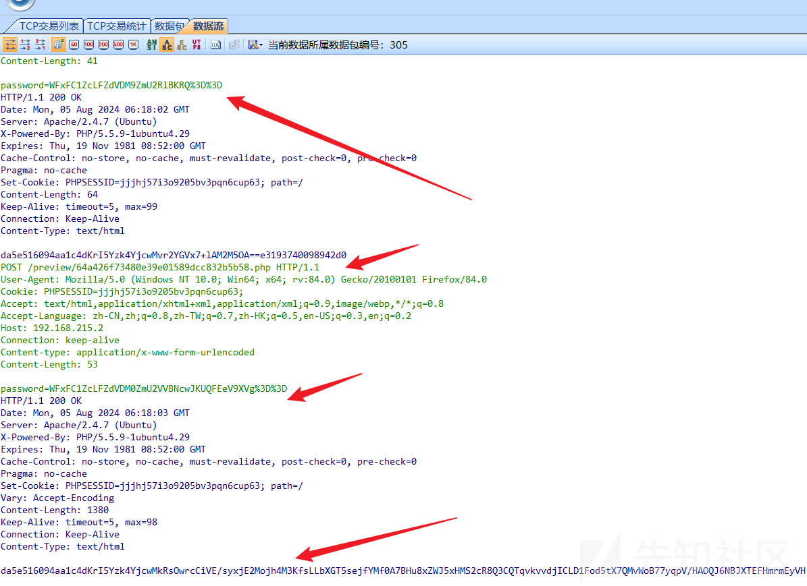

具体**test、getBasicsInfo**执行逻辑可以通过前面传输文件中可以看到

#### test

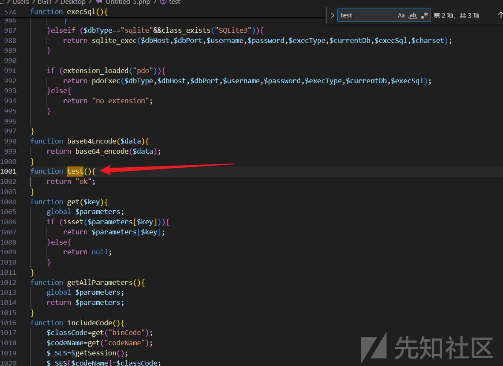

#### getBasicsInfo

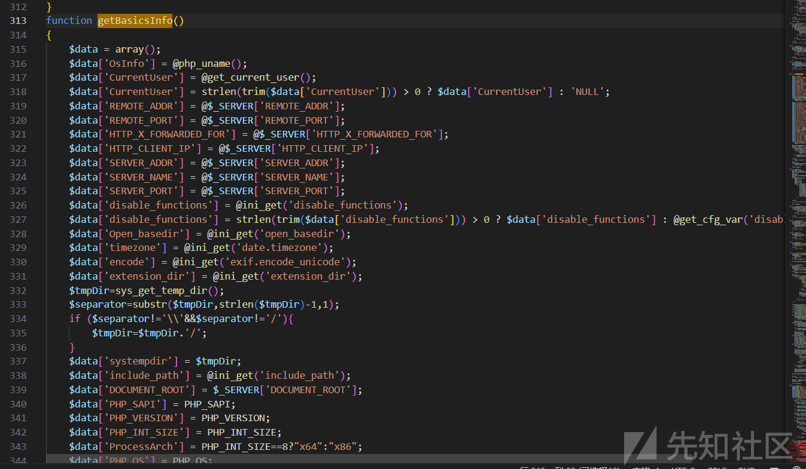

在序号为31的数据包中

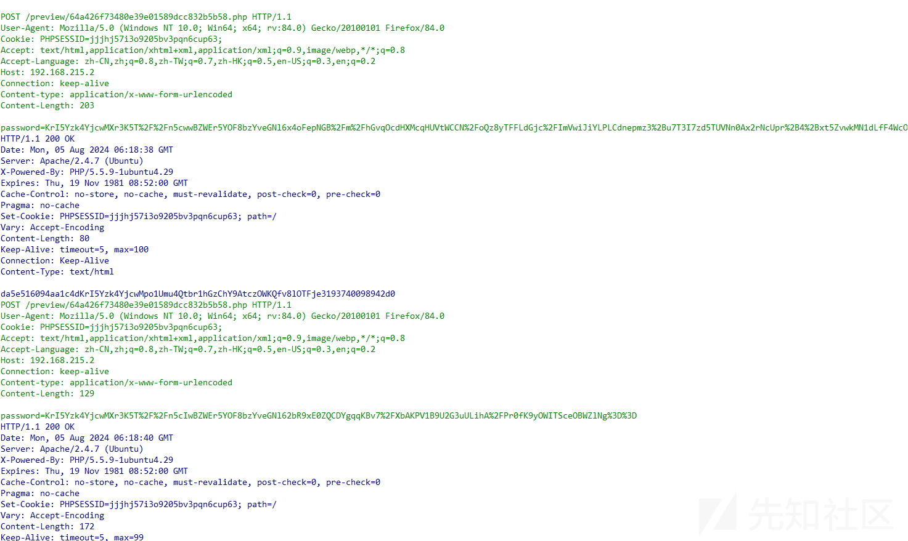

对其请求与响应进行解密的  
通过execCommand方法执行

```
cmdLine  sh -c "cd "/var/www/html/preview/";cd "/"&&echo yQ3SXF&&pwd&&echo BZ1BR3" 2>&1
```

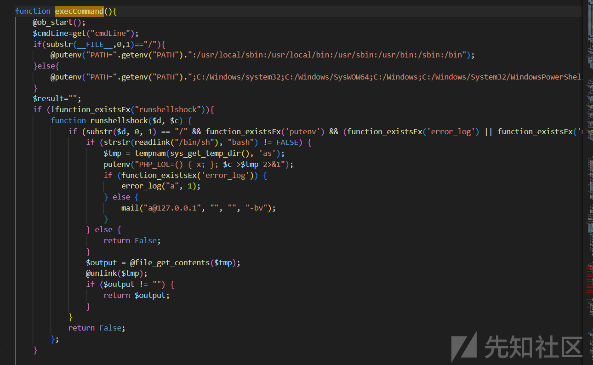

响应输出**echo yQ3SXF&&pwd&&echo BZ1BR3**开头与结尾都是混淆中间的 **/** 才是响应的真正的内容,

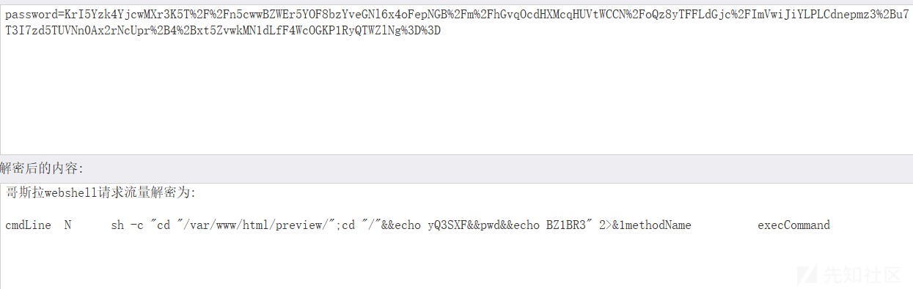

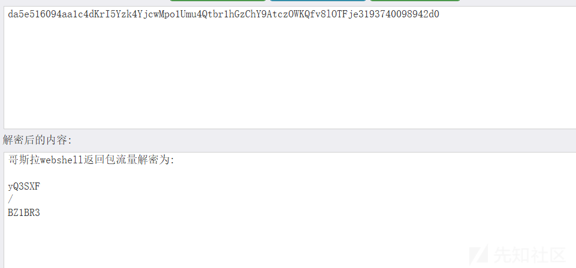

在ls查看目录

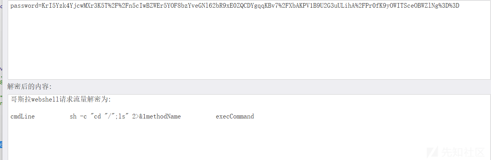

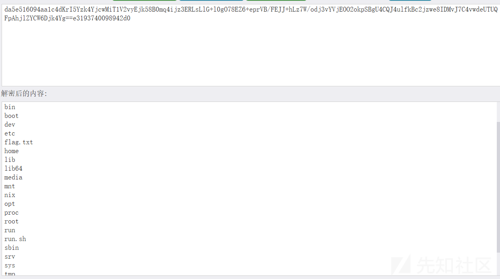

在cat /flag.txt文件

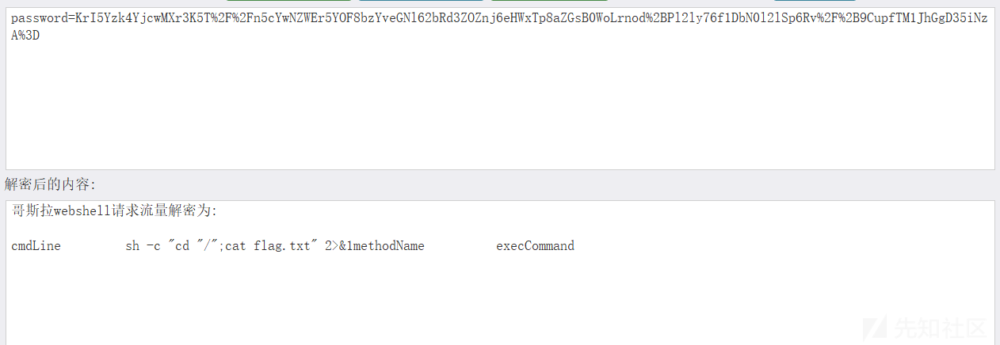

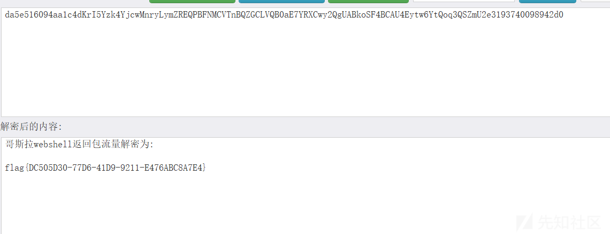
