# AFL源码学习(一)-先知社区

> **来源**: https://xz.aliyun.com/news/16333  
> **文章ID**: 16333

---

# AFL学习(一)

AFL是fuzzing的一个工具，全称是American Fuzzy Lop，由Google安全工程师Michał Zalewski开发的一款开源fuzzing测试工具。

它使用了一个新的编译时插桩技术和遗传算法，可以自动发现触发目标二进程程序的测试用例，从而大大提高测试代码的功能覆盖率。

AFL项目：[google/AFL: american fuzzy lop - a security-oriented fuzzer](https://github.com/google/AFL)

**关于`AFL`的介绍网上有很多我这里就不介绍了，直接开始分析源码，我们通过源码视角来切入分析`AFL`后，再来讲解原理会更容易理解。**

## 简单使用AFL

### 安装AFL

解压之后安装

```
make
sudo make install

```

### 插装编译测试

写一个测试案列然后使用afl进行编译

```
afl-gcc -g -o test test.c

```

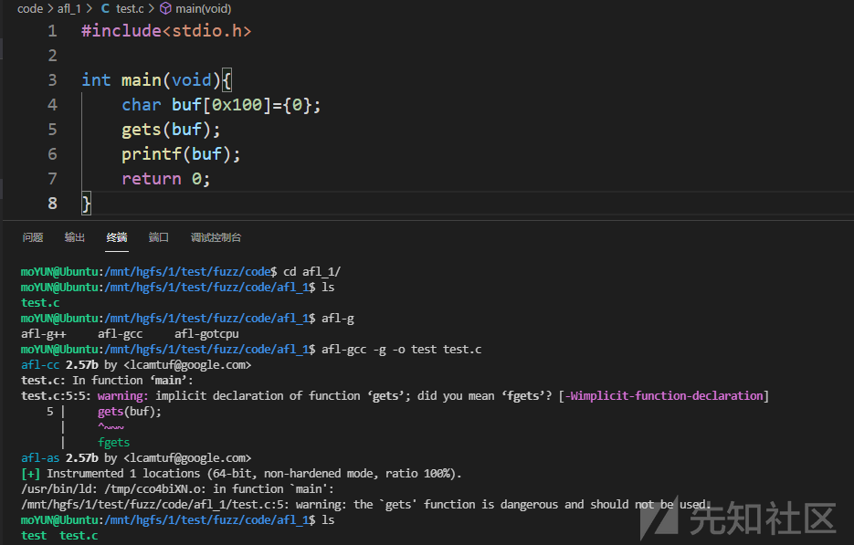

编译成功之后创建种子文件夹

> 作为模糊测试，AFL需要提供初始的种子输入。但实际上，提供任何无意义的输入作为种子，模糊测试也一般能达到效果，只不过效率会低一些而已。

```
mkdir seeds
echo "123" > seeds/any_seed

```

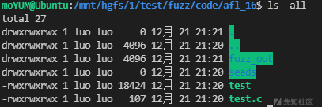

### 开始fuzz

```
afl-fuzz -i seeds -o fuzz_out ./test

```

报错`core_pattern`

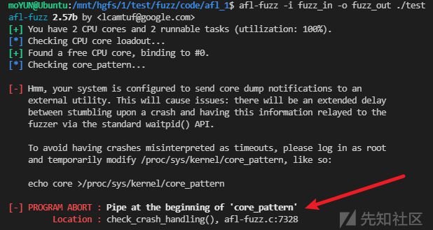

解决办法

```
sudo su
echo core >/proc/sys/kernel/core_pattern

```

这种情况就是内存设置太小了，或者程序所需要的内存太大了，一般情况下加上 “-m none” 就好了

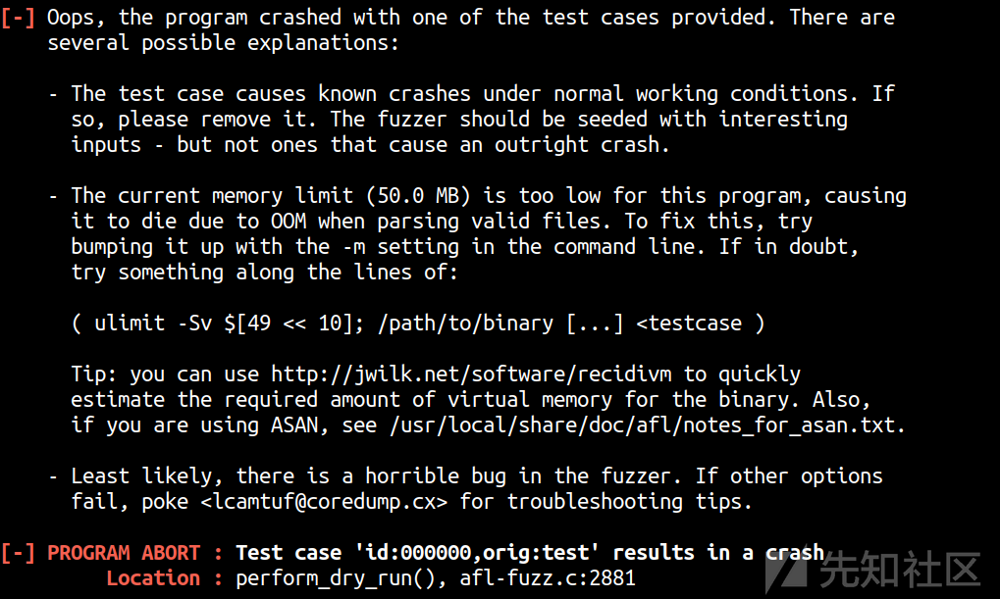

正常界面

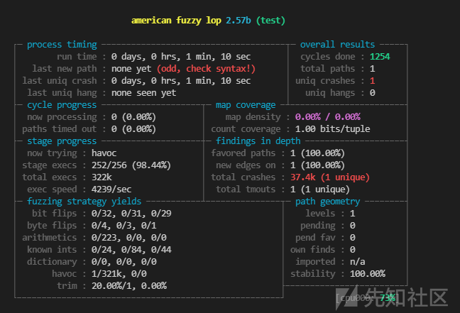

### 分析crash

xxd 查看crash内容，就这个是栈溢出漏洞

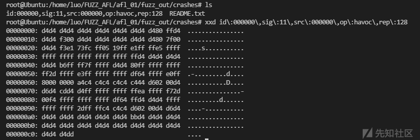

## 熟悉AFL界面

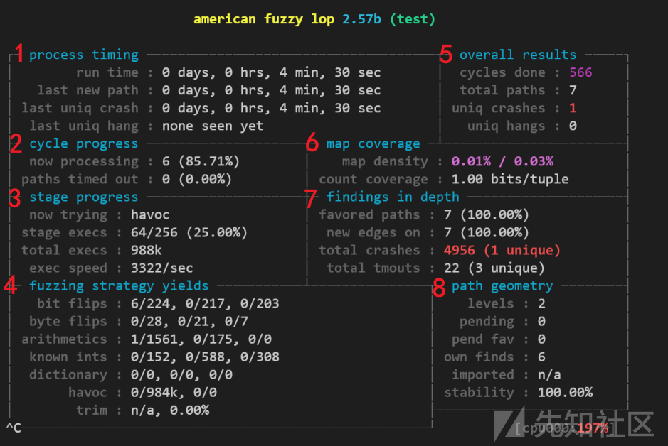

1、Process Timing

​ Fuzzer运行时长、以及距离最近发现的路径、崩溃和挂起经过了多长时间。

2、cycle progress

​ 循环进度，就是输入队列的进度。显示当前处于fuzz队列的第几个测试用例，超市用例数。

3、Stage progress

​ 正在测试的策略，当前执行的次数，总执行次数，平均执行速度。

4、fuzzing strategy yields

​ 关于异变策略产生的最新行为和结果的详细信息。

5、Overall results

​ fuzzer当前状态：循环队列次数(566)、总路径数(7)、崩溃次数(1)、挂起次数(0)。

6、map coverage

​ 二进制文件中插桩代码所观察到覆盖范围的细节。`map density`：使用的位图大小占总位图大小的比例 / 所有用例使用的位图大小占总位图大小的比例。`count coverage`：位图中每个被命中的字节平均改变的位数（取值为[1, 8]）。

7、findings in depth

​ 青睐的测试用例数量、覆盖新路径测试用例数量、总崩溃数、总超时数。

8、path geometry

​ 有关Fuzzer找到的执行路径的信息。

## 分析源码

关于`AFL`的介绍网上有很多我这里就不介绍了，直接开始分析源码，我们通过源码视角来切入分析`AFL-fuzz`的一个原理以及实现。

先来看一下`AFL2.57b`的一个源码依赖图，代码体量也是比较多的，为了由浅入深我们直接从小的模块开始入手，这里我们从`afl-gcc`编译文件开始分析，然后慢慢从旁支开始往核心`afl-fuzz`分析能够更好着手一点。


#### afl-gcc

**先放开发者给的一个注释说明**

> `afl-gcc` 是 `gcc, g++, clang, clang++` 的包装器。它的作用是设置一些编译参数，然后调用这些编译器。事实上，**编译出来的 `afl-clang, afl-g++` 等文件都是指向 `afl-gcc` 的软链接。**
>
> `afl-gcc` 需要知道 `afl-as` 的路径。`afl-as` 是插桩器，我们将会在后文分析它的逻辑。默认情况下， `afl-as` 位于 `/usr/local/lib/afl/` ，不过也可以透过 `AFL_PATH` 指定。
>
> **一些细节：**  
> 如果 `AFL_HARDEN` 打开， `afl-gcc` 会给下游编译器传递一些开关（ `-D_FORTIFY_SOURCE=2, -fstack-protector-all`），使得内存 bug 更容易暴露和复现。如果 `AFL_USE_ASAN` 打开，将会使用 ASan。
>
> ​ 另外， `afl-gcc` 允许用户使用非标准的下游编译器（也就是说，并非 gcc 或 clang）。设置 `AFL_CC` 和 `AFL_CXX` 即可。

大纲体现就三个函数

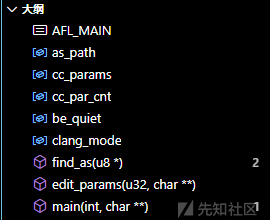

先从`main`函数开始看，先通过`find_as()`来寻找`afl-as`插桩器的位置，然后通过`edit_params()`修改下游编译的参数，最后`execvp`执行下游编译器。

```
//afl-gcc.c
int main(int argc, char** argv) {
  //检查是否为 AFL_QUIET，如果不是则输出 作者
  if (isatty(2) && !getenv("AFL_QUIET")) {

    SAYF(cCYA "afl-cc " cBRI VERSION cRST " by <lcamtuf@google.com>\n");

  } else be_quiet = 1;
  //需要带参数调用
  if (argc < 2) {
   //...
    exit(1);

  }
  //寻找afl-as
  find_as(argv[0]);
  //修改编译参数
  edit_params(argc, argv);
  // 执行下游编译器
  execvp(cc_params[0], (char**)cc_params);

  FATAL("Oops, failed to execute '%s' - check your PATH", cc_params[0]);

  return 0;

}

```

`find_as()`主要就是寻找`afl-as`的位置，首先通过**环境变量**，再通过`argv[0]`所在的目录，最后通过`makefile` 定义的`AFL_PATH`。

```
static void find_as(u8* argv0) {
  //环境变量读取AFL_PATH
  u8 *afl_path = getenv("AFL_PATH");
  u8 *slash, *tmp;
  //如果存在AFL_PATH,并且 AFL_PATH/as 存在 则成功找到
  if (afl_path) {
    //申请临时变量来存储 path
    tmp = alloc_printf("%s/as", afl_path);

    if (!access(tmp, X_OK)) {
      as_path = afl_path;
      ck_free(tmp);
      return;
    }

    ck_free(tmp);

  }
  //在argv[0] 所在的目录下找 afl-as
  slash = strrchr(argv0, '/');

  if (slash) {

    u8 *dir;

    *slash = 0;
    dir = ck_strdup(argv0);
    *slash = '/';

    tmp = alloc_printf("%s/afl-as", dir);

    if (!access(tmp, X_OK)) {
      as_path = dir;
      ck_free(tmp);
      return;
    }

    ck_free(tmp);
    ck_free(dir);

  }
  //最后通过编译时的 AFL_PATH 去找as ，一般为 "/usr/local/lib/afl"
  if (!access(AFL_PATH "/as", X_OK)) {
    as_path = AFL_PATH;
    return;
  }

  FATAL("Unable to find AFL wrapper binary for 'as'. Please set AFL_PATH");

}

```

`edit_params()`来编辑下游编译器的参数。

首先，分析`argv[0]`来确定需要调用的编译器，比如传入的是`afl-clang`，那调用的就是`clang`。

然后，将自己的argv[1]开始参数复制一份，然后传给下游编译器来进行编译。具体的一些详细开关不再展开，`-B`参数会被默认覆盖为`as_path`，因为使用`-B as_path`编译的时候，使得下游原生的编译器被`afl-as`替换，具体插装过程需要通过`afl-as`负责实现。

```
/* Copy argv to cc_params, making the necessary edits. */
//下游编译器的参数编辑
static void edit_params(u32 argc, char** argv) {

  u8 fortify_set = 0, asan_set = 0;
  u8 *name;

#if defined(__FreeBSD__) && defined(__x86_64__)
  u8 m32_set = 0;
#endif
  //申请空间来存储 下游编译的参数
  cc_params = ck_alloc((argc + 128) * sizeof(u8*));
  name = strrchr(argv[0], '/');
  if (!name) name = argv[0]; else name++;
  //判断编译器
  if (!strncmp(name, "afl-clang", 9)) {
    // clang
    clang_mode = 1;

    setenv(CLANG_ENV_VAR, "1", 1);
    //clang++
    if (!strcmp(name, "afl-clang++")) {
      u8* alt_cxx = getenv("AFL_CXX");
      cc_params[0] = alt_cxx ? alt_cxx : (u8*)"clang++";
    } else {
      //如果AFL_CC环境存在则第一个参数为AFL_CC，否则为 clang
      u8* alt_cc = getenv("AFL_CC");
      cc_params[0] = alt_cc ? alt_cc : (u8*)"clang";
    }

  } else {

    /* With GCJ and Eclipse installed, you can actually compile Java! The
       instrumentation will work (amazingly). Alas, unhandled exceptions do
       not call abort(), so afl-fuzz would need to be modified to equate
       non-zero exit codes with crash conditions when working with Java
       binaries. Meh. */

#ifdef __APPLE__

    if (!strcmp(name, "afl-g++")) cc_params[0] = getenv("AFL_CXX");
    else if (!strcmp(name, "afl-gcj")) cc_params[0] = getenv("AFL_GCJ");
    else cc_params[0] = getenv("AFL_CC");

    if (!cc_params[0]) {

      SAYF("\n" cLRD "[-] " cRST
           "On Apple systems, 'gcc' is usually just a wrapper for clang. Please use the\n"
           "    'afl-clang' utility instead of 'afl-gcc'. If you really have GCC installed,\n"
           "    set AFL_CC or AFL_CXX to specify the correct path to that compiler.\n");

      FATAL("AFL_CC or AFL_CXX required on MacOS X");

    }

#else

    if (!strcmp(name, "afl-g++")) {
      u8* alt_cxx = getenv("AFL_CXX");
      cc_params[0] = alt_cxx ? alt_cxx : (u8*)"g++";
    } else if (!strcmp(name, "afl-gcj")) {
      u8* alt_cc = getenv("AFL_GCJ");
      cc_params[0] = alt_cc ? alt_cc : (u8*)"gcj";
    } else {
      u8* alt_cc = getenv("AFL_CC");
      cc_params[0] = alt_cc ? alt_cc : (u8*)"gcc";
    }

#endif /* __APPLE__ */

  }
  //复制传入的参数
  while (--argc) {
    //从第二个参数开始
    u8* cur = *(++argv);

    if (!strncmp(cur, "-B", 2)) {

      if (!be_quiet) WARNF("-B is already set, overriding");
      //抛弃 -B 后的参数
      if (!cur[2] && argc > 1) { argc--; argv++; }
      continue;

    }

    if (!strcmp(cur, "-integrated-as")) continue;

    if (!strcmp(cur, "-pipe")) continue;

#if defined(__FreeBSD__) && defined(__x86_64__)
    //x86架构识别
    if (!strcmp(cur, "-m32")) m32_set = 1;
#endif

    if (!strcmp(cur, "-fsanitize=address") ||
        !strcmp(cur, "-fsanitize=memory")) asan_set = 1;

    if (strstr(cur, "FORTIFY_SOURCE")) fortify_set = 1;

    cc_params[cc_par_cnt++] = cur;

  }
  // 上面抛弃-B 是因为默认自带 -B as_path
  cc_params[cc_par_cnt++] = "-B";
  cc_params[cc_par_cnt++] = as_path;

 //...

  cc_params[cc_par_cnt] = NULL;

}

```

#### afl-as插桩器

**先放开发者给的一个注释说明**

> afl-as.c是一个GNU汇编器(as)的包装器。主要功能如下
>
> 1.预处理由GCC/clang生成的汇编文件
>
> 2.注入来自afl-as.h的插桩代码
>
> 3.当使用afl-gcc/afl-clang编译程序时会自动调用
>
> 需要注意的是:不会对手写的汇编代码进行插桩,包括独立的.s文件或**asm**块
>
> 对于clang用户,experimental/clang\_asm\_normalize/提供了一个解决方案,可以处理手写汇编。但GCC没有类似的解决方案。

直接看`main`函数,大体执行流程可以为这样：初始化随机种子->修改as参数->在汇编上插桩->调用as编译。

```
int main(int argc, char** argv) {

  s32 pid;
  u32 rand_seed;
  int status;
  u8* inst_ratio_str = getenv("AFL_INST_RATIO");

  struct timeval tv;
  struct timezone tz;

  clang_mode = !!getenv(CLANG_ENV_VAR);

  if (isatty(2) && !getenv("AFL_QUIET")) {

    SAYF(cCYA "afl-as " cBRI VERSION cRST " by <lcamtuf@google.com>\n");

  } else be_quiet = 1;

  if (argc < 2) {

    SAYF("\n"
         "This is a helper application for afl-fuzz. It is a wrapper around GNU 'as',\n"
         "executed by the toolchain whenever using afl-gcc or afl-clang. You probably\n"
         "don't want to run this program directly.\n\n"

         "Rarely, when dealing with extremely complex projects, it may be advisable to\n"
         "set AFL_INST_RATIO to a value less than 100 in order to reduce the odds of\n"
         "instrumenting every discovered branch.\n\n");

    exit(1);

  }
  //获取系统当前时间和日期，精确到微秒级别
  gettimeofday(&tv, &tz);

  rand_seed = tv.tv_sec ^ tv.tv_usec ^ getpid();

  srandom(rand_seed);//随机种子
  //修改as编译参数
  edit_params(argc, argv);

  if (inst_ratio_str) {

    if (sscanf(inst_ratio_str, "%u", &inst_ratio) != 1 || inst_ratio > 100) 
      FATAL("Bad value of AFL_INST_RATIO (must be between 0 and 100)");

  }

  if (getenv(AS_LOOP_ENV_VAR))
    FATAL("Endless loop when calling 'as' (remove '.' from your PATH)");

  setenv(AS_LOOP_ENV_VAR, "1", 1);

  /* When compiling with ASAN, we don't have a particularly elegant way to skip
     ASAN-specific branches. But we can probabilistically compensate for
     that... */

  if (getenv("AFL_USE_ASAN") || getenv("AFL_USE_MSAN")) {
    sanitizer = 1;
    inst_ratio /= 3;
  }
  //进行插桩
  if (!just_version) add_instrumentation();
  //启动子线程进行编译
  if (!(pid = fork())) {

    execvp(as_params[0], (char**)as_params);
    FATAL("Oops, failed to execute '%s' - check your PATH", as_params[0]);

  }

  if (pid < 0) PFATAL("fork() failed");

  if (waitpid(pid, &status, 0) <= 0) PFATAL("waitpid() failed");

  if (!getenv("AFL_KEEP_ASSEMBLY")) unlink(modified_file);

  exit(WEXITSTATUS(status));

}

```

`edit_params()`修改`as`参数。

因为有很多是`MACOS`的操作，这里直接删除掉了，我们重点关注`linux`。

1. 它首先确定`as`的名称，默认会是`GNU as`，否则被`AFL_AS`覆盖。
2. 复制原来的`argv`给`as`参数
3. 设置临时文件`modified_file`，路径为`/tmp/.afl-pid-time.s`

```
static void edit_params(int argc, char** argv) {

  u8 *tmp_dir = getenv("TMPDIR"), *afl_as = getenv("AFL_AS");
  u32 i;

  /* Although this is not documented, GCC also uses TEMP and TMP when TMPDIR
     is not set. We need to check these non-standard variables to properly
     handle the pass_thru logic later on. */

  if (!tmp_dir) tmp_dir = getenv("TEMP");
  if (!tmp_dir) tmp_dir = getenv("TMP");
  if (!tmp_dir) tmp_dir = "/tmp";

  as_params = ck_alloc((argc + 32) * sizeof(u8*));
    //确定编译器
  as_params[0] = afl_as ? afl_as : (u8*)"as";

  as_params[argc] = 0;
    //复制参数
  for (i = 1; i < argc - 1; i++) {

    if (!strcmp(argv[i], "--64")) use_64bit = 1;
    else if (!strcmp(argv[i], "--32")) use_64bit = 0;

    as_params[as_par_cnt++] = argv[i];

  }


    //最后一个文件为输入文件名
  input_file = argv[argc - 1];
  //检查输入的文件名
  if (input_file[0] == '-') {

    if (!strcmp(input_file + 1, "-version")) {
      just_version = 1;
      modified_file = input_file;
      goto wrap_things_up;
    }

    if (input_file[1]) FATAL("Incorrect use (not called through afl-gcc?)");
      else input_file = NULL;

  } else {

    /* Check if this looks like a standard invocation as a part of an attempt
       to compile a program, rather than using gcc on an ad-hoc .s file in
       a format we may not understand. This works around an issue compiling
       NSS. */

    if (strncmp(input_file, tmp_dir, strlen(tmp_dir)) &&
        strncmp(input_file, "/var/tmp/", 9) &&
        strncmp(input_file, "/tmp/", 5)) pass_thru = 1;

  }
  //生成最后的修改文件
  modified_file = alloc_printf("%s/.afl-%u-%u.s", tmp_dir, getpid(),
                               (u32)time(NULL));

wrap_things_up:
  //添加输出文件到末尾
  as_params[as_par_cnt++] = modified_file;
  as_params[as_par_cnt]   = NULL;

}

```

具体插桩代码使用的是`add_instrumentation()`，代码比较长，我们分析插桩的一个体现。

##### 插桩汇编分析

**test.c源码**

```
#include <stdio.h>
#include<stdlib.h>
#include<malloc.h>
int main(int argc, char *argv[])
{
    int size;
    scanf("%d",&size);
    printf("size :%d\n",size);
    char* buf =(char*) malloc(size);
    read(0,buf,0x200);
    puts(buf);
    return 0;
}

```

正常使用`gcc`编译的

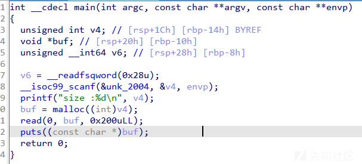

使用`afl-gcc`编译的

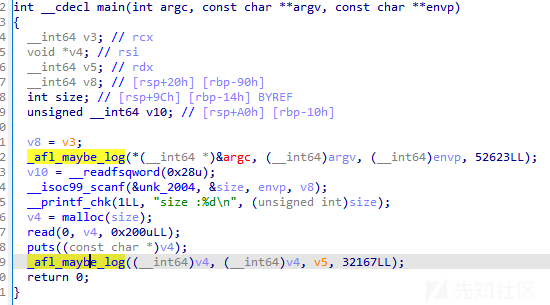

可以发现插桩后的代码会出现`_afl_maybe_log()`函数，因为程序比较简单虽然只有两个`branch`但是都插了桩。

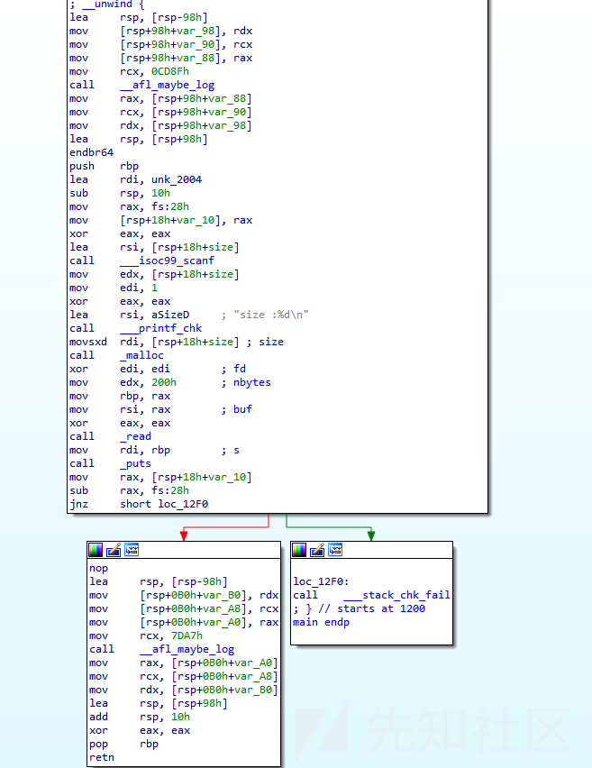

并且在调用`_afl_maybe_log()`的时候会使用一个独立的栈，整体如下。

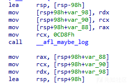

先分析一下上面的汇编执行过程，先理清楚逻辑体现：

1. `rsp`抬高
2. `rdx,rcx,rax`的值存到栈上
3. `rcx`被赋值一个随机数(`afl-as`生成)
4. 调用`_afl_maybe_log()`
5. 恢复`rax,rcx,rdx,rsp`

[AFL 白皮书](https://github.com/google/AFL/blob/master/docs/technical_details.txt)中解释上面代码执行本质体现了如下的逻辑：

```
cur_location = <COMPILE_TIME_RANDOM>; //每个代码块生成一个随机数，作为其“位置”的记录
/*
    对分支处的”源位置“和”目标位置“进行异或，并将异或的结果作为该分支的key，保存每个分支的执行次数（就是在用hash记录元组及覆盖情况）
*/
shared_mem[cur_location ^ prev_location]++; 
prev_location = cur_location >> 1;//自己跳转到自己计算得到的hash的key会是0，要避免这种情况，于是进行移位操作

```

这就能体现`cur_location`了，是一个随机生成的值，存放在`rcx`中，然后调用`_afl_maybe_log()`，实现`shared_mem[]`增加和`prev_location`变换。

继续分析`_afl_maybe_log()`,开始会先判断**共享内存区域**是否已经映射，如果没有映射则会先进行初始化操作(`__afl_setup`)。

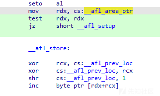

如果已经初始化，那么直接执行（`__afl_store`）。

`__afl_store`：

1. 先把传进来的`rcx`(cur\_location)和`_afl_prev_loc`异或
2. 然后`_afl_prev_loc`还原到原本的值
3. 将`_afl_prev_loc`右移一位
4. 增加`shared_mem[]`

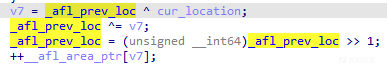

现在我们看如果**`共享内存区域`**没有初始化会发生什么，整体的反编译代码如下：

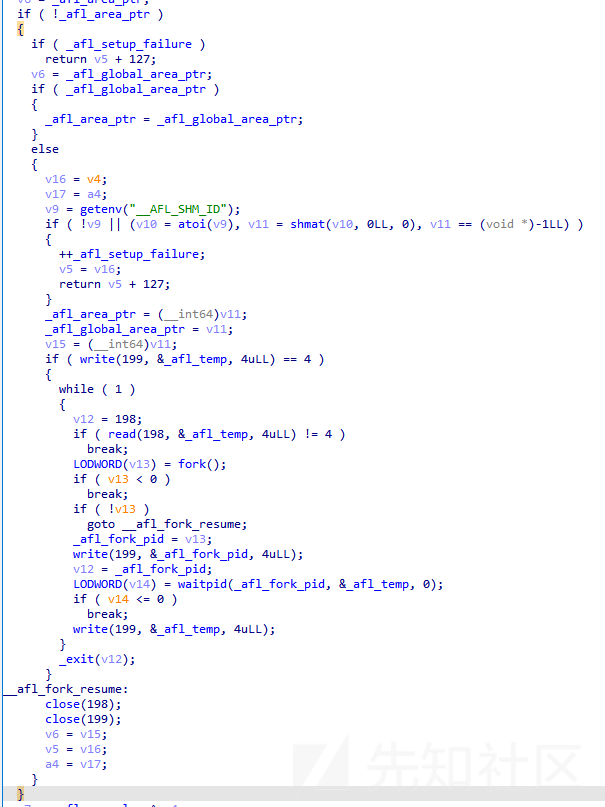

进入到`__afl_setup`，先判断`__afl_setup_failure`是否为0，如果不为0会直接返回，然后判断`__afl_global_area_ptr`是否存在，如果存在直接覆盖`__afl_area_ptr`，然后再次检查是否需要申请空间给`__afl_area_ptr`，即`__afl_global_area_ptr`存在时跳转`__afl_store`执行**“hit count”**，否则执行`__afl_setup_first`来初始化。

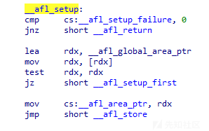

需要注意的是`__afl_global_area_ptr`和`__afl_area_ptr`两个字段都是`bss`段上的变量，主要区别在于多个文件编译的时候，`__afl_global_area_ptr`只会有一个，但是`__afl_area_ptr`会有多个，`__afl_global_area_ptr`在不痛文件中指向同一个地址，`__afl_area_ptr`不同文件中指向不同地址。

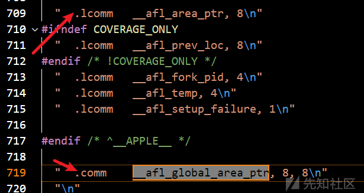

所以当全局变量`__afl_global_area_ptr`存在时，以`__afl_global_area_ptr`为主。

`__afl_setup_first`会把寄存器参数保存在栈上，然后用`r12`来存储`rsp`的值，并对`rsp`做`0x10`字节对齐

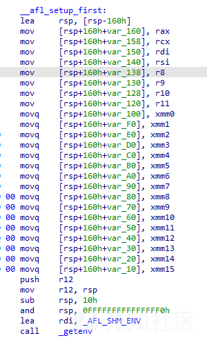

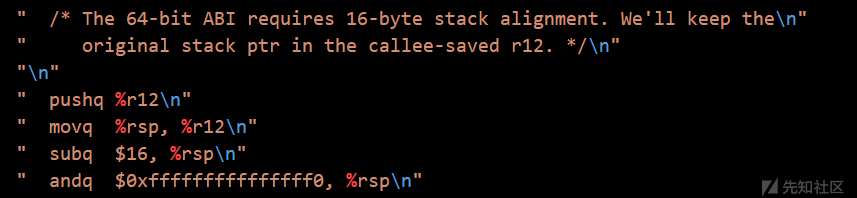

对齐之后会先获取环境变量`__AFL_SHM_ID`，如果不存在则会跳转`__afl_setup_abort`(就是清理操作然后恢复寄存器参数),

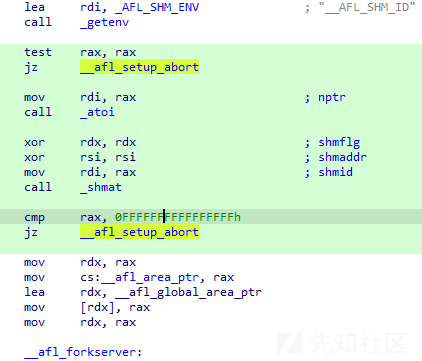

先看失败的情况，如果`__AFL_SHM_ID`不存在，会先自增`_afl_setup_failure`，这个字段导致之后都不会进入到`fork server`。然后进行恢复寄存器之后返回。

> 这也解释了为何我们不使用 `afl-fuzz` 而直接运行插桩后的目标程序，也能执行如常。这个设计体现了 AFL 的用户友好性。

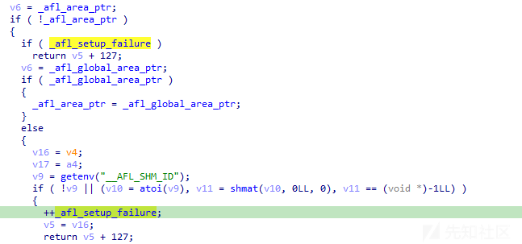

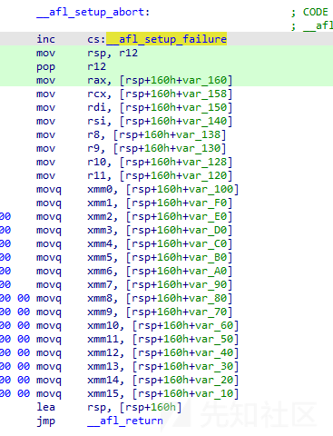

如果有环境变量`__AFL_SHM_ID`，使用`shmat(getenv("__AFL_SHM_ID"),0,0);`来获取共享内存，不过一般用`shmat()`的时候都会通过`shmget`来获取`id`,那这个`"__AFL_SHM_ID"`从何而来呢。

```
int shmid = shmget(IPC_PRIVATE, 1024, IPC_CREAT | 0666);//获取id
char *shmaddr = shmat(shmid, NULL, 0);
shmdt(shmaddr) //需要先卸载内存地址，解除映射绑定
shmctl(shmid, IPC_RMID, NULL) //删除id

```

通过交叉索引定位到`afl-fuzz.c`中的`setup_shm`函数，会先对该环境变量赋值，之后才会进行fuzz。

> 不是通过 **afl-fuzz** 运行程序，这片虚拟内存不会被创建，也不会存在 `__AFL_SHM_ID` 环境变量了。不得不说性AFL 的用户友好性。

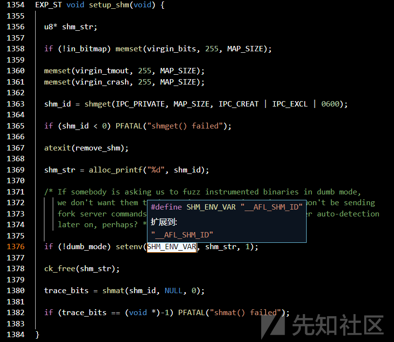

现在获取到了共享内存，然后会同时保存到`_afl_area_ptr`和`_afl_global_area_ptr`上，然后进入`__afl_forkserver`。

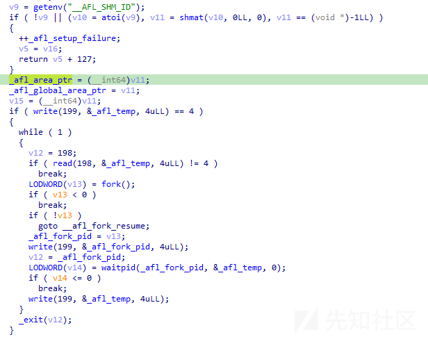

##### \_\_afl\_forkserver

> [AFL 白皮书]([AFL/docs/technical_details.txt at master · google/AFL](https://github.com/google/AFL/blob/master/docs/technical_details.txt))中提到，`execve()` 的效率比较低。fuzzer 需要高频率地执行目标程序，显然不宜在 `execve()` 上浪费过多时间。AFL 的解决方案是使用 fork server：让程序在第一个基本块处停下，等待 fuzzer 发送指令；收到指令后继续执行程序；执行完毕后，恢复 fork 时的状态。得益于 copy-on-write 技术，我们可以高效地实现这一需求。
>
> 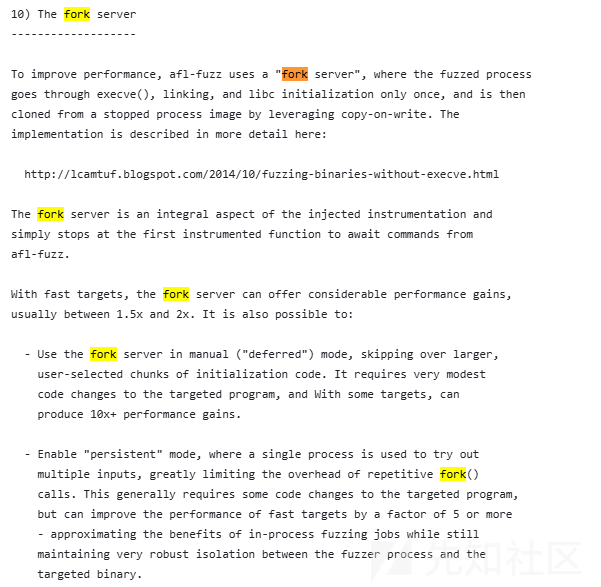

`fork server` 使用 198(read)、199（write）来进行管道的通信，首先会往`__afl_temp(4 bytes)`写入4字节,如果写入成功则执行`__afl_fork_wait_loop`，否则失败跳转`__afl_fork_resume`(清理资源恢复寄存器返回)

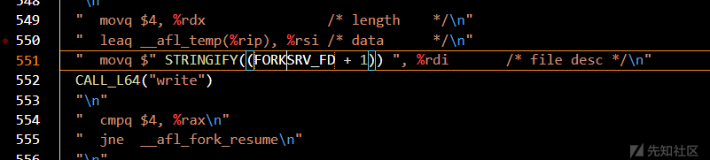

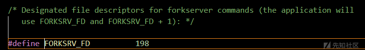

`__afl_fork_wait_loop`就是一个`while`的无限循环，会通过从`__afl_temp`读取数据，然后fork(如果失败,直接`_exit`退出)，子进程进入`__afl_fork_resume`，主进程继续执行，利用管道传递给`fuzzer` **fork\_id**，然后调用 `waitpid()` 等待子进程执行完毕（如果等待失败,直接`_exit`退出），然后将子进程退出的原因传递给`fuzzer`，并继续循环。


##### 小结插桩实现原理

程序会在第一个`branch`处进行初始化共享内存，后陷入循环完成fork子进程、让子进程恢复原本逻辑，主线程向

`fuzzer` 报告子进程的pid和执行情况，之后继续循环，这就是很多人说的fuzzer 是被 fuzz 进程的父父进程。

通过`fork server`，AFL避免了频繁使用execve调用，从而提高fuzz效率。

再阅读了 `afl-gcc` 和 `afl-as` 的源码后对AFL编译和插桩有了一定了解之后，我们再来看AFL中覆盖率是如何体现的，就比较轻松了。

## 覆盖率

AFL 有一个基于边界（edge）覆盖率的反馈机制。

每个块开头都会插入桩，用来判断当前程序的执行路径，如箭头所示路径为:`A->C->E`,那么在`AFL`中为了描述边界(`edge`),就会把源基本快和目的基本块组合成元组(`tuple`),那么这个路径只有`2`个`tuple(AC,CE)`。

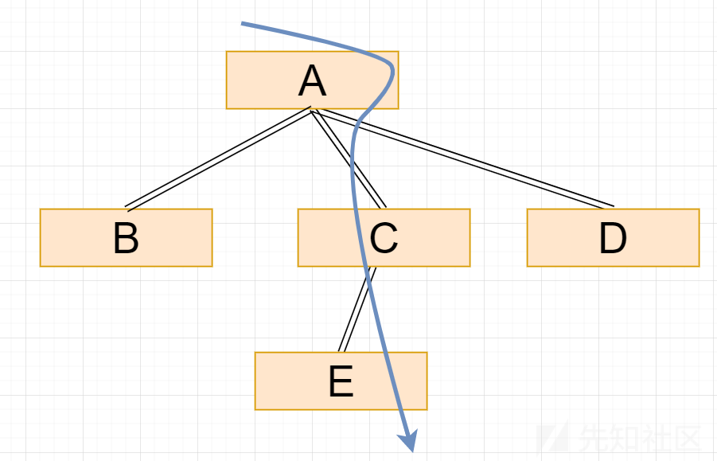

那么通过记录`tuple`信息就可以记录**边界覆盖率**，程序记录 `tuple` 的命中数，命中数被划分成 `8` 个组别。`AFL`通过一个`bitmap`来记录这些信息，`target`是将每个分支的执行次数用**1**个`byte`来储存，而`fuzzer`则进一步把这个执行次数归入`8`种`buckets`中。

```
static const u8 count_class_lookup8[256] = {
//左边为分支执行次数   //右边为记述byte
  [0]           = 0, 
  [1]           = 1, 
  [2]           = 2, 
  [3]           = 4, 
  [4 ... 7]     = 8, 
  [8 ... 15]    = 16,
  [16 ... 31]   = 32,
  [32 ... 127]  = 64,
  [128 ... 255] = 128

};

```

> * 这样处理之后，对分支执行次数就会有一个简单的分类
> * 对于某些**异变输入**来说，如果这次执行没有出现崩溃等异常输出，`fuzzer`还会检查其是否新增了执行路径。具体来说，是对`trace_bits`计算`hash`并来实现
> * 通过比较`hash`值，就可以判断`trace_bits`是否发生了变化，从而判断此次**异变输入**是否带来了新路径，为之后的fuzzing提供参考信息

参考链接

[AFL源码阅读（一）：启程](https://www.ruanx.net/afl-source-1/)

[AFL/docs/technical\_details.txt at master · google/AFL](https://github.com/google/AFL/blob/master/docs/technical_details.txt)

[[原创]漏洞挖掘技术之 AFL 项目分析-二进制漏洞-看雪-安全社区|安全招聘|kanxue.com](https://bbs.kanxue.com/thread-249912.htm#msg_header_h2_2)

[【AFL（一）】入门小白第一次测试 - 未配妥剑，已入江湖 - 博客园](https://www.cnblogs.com/wayne-tao/p/11739420.html)

[AFL中使用的环境变量 以及状态栏、fuzzer\_stats文件、plot\_data文件中各字段的含义\_cycles done-CSDN博客](https://blog.csdn.net/weixin_50972562/article/details/125550494)
