# Tomcat CVE-2024-50379 / CVE-2024-56337 条件竞争漏洞分析-先知社区

> **来源**: https://xz.aliyun.com/news/16337  
> **文章ID**: 16337

---

## Tomcat CVE-2024-50379 / CVE-2024-56337 条件竞争漏洞分析

### 0x01 漏洞描述

两个漏洞内容是一样的，只是 CVE-2024-50379 没有修复完全，CVE-2024-56337 做了二次修复

漏洞描述：

```
Time-of-check Time-of-use (TOCTOU) Race Condition vulnerability during 
JSP compilation in Apache Tomcat permits an RCE on case insensitive file 
systems when the default servlet is enabled for write (non-default 
configuration).
```

几个关键点：

* insensitive file systems （大小写不敏感系统：`windows` 系统）
* the default servlet （用于处理静态文件的 `DefaultServlet` 类）
* enabled for write （允许写：参考 `CVE-2017` 的那个 `PUT RCE` 需要特殊配置）
* Race Condition （条件竞争）

### 0x02 调试环境

参考曾经 `PUT RCE` 需要打开 `conf/web.xml` 的 `readonly` 为 `false`

```
<servlet>
    <servlet-name>default</servlet-name>
    <servlet-class>org.apache.catalina.servlets.DefaultServlet</servlet-class>
    <init-param>
        <param-name>debug</param-name>
        <param-value>0</param-value>
    </init-param>
    <init-param>
        <param-name>listings</param-name>
        <param-value>false</param-value>
    </init-param>
    <init-param>
        <param-name>readonly</param-name>
        <param-value>false</param-value>
    </init-param>
    <load-on-startup>1</load-on-startup>
</servlet>

```

启动 `Tomcat` 时使用 `bin/catalina.bat` 的 `jpda` 启动

```
catalina.bat jpda start

```

把 `lib/*.jar` 文件使用 `IDEA` 右键 `Add As Library` 然后我们就可以动态调试了

注意 `Tomcat` 默认使用的是 `8000` 调试端口

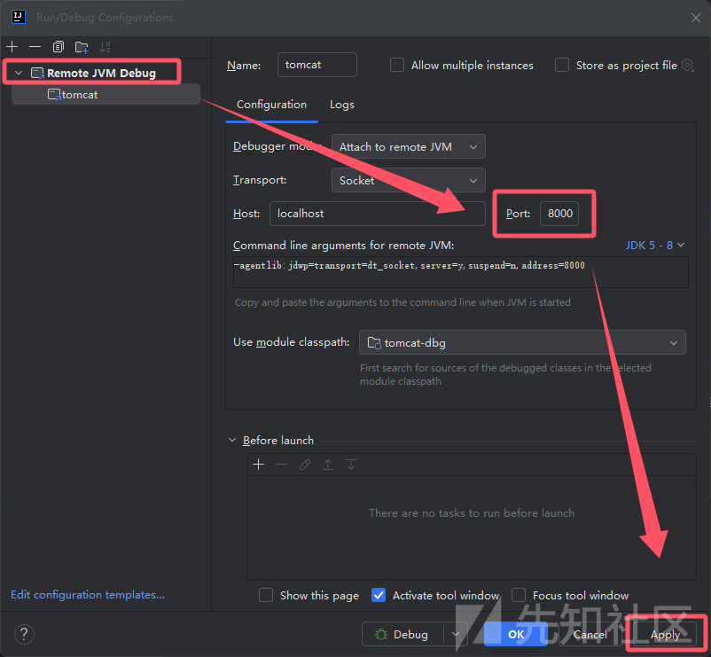

### 0x03 初步分析

参考 `0x01` 中的几个关键点，猜测基本的漏洞原理：

* 线程 A 写 `JSP`（大写，注意 `JspServlet` 不处理这种文件只处理小写）
* 线程 B 读 `jsp`（小写）
* 由于 `windows` 大小写问题导致目标解析了 `JSP` 文件

接下来我们从 `DefaultServlet` 的入口 `doGet` 开始

```
protected void doGet(HttpServletRequest request, HttpServletResponse response) throws IOException, ServletException {
    this.serveResource(request, response, true, this.fileEncoding);
}

```

跟入 `serveResource` 可以主要逻辑如下：

* `getResource` 得到文件如果不存在返回 `404`
* `getResource` 得到文件如果存在返回具体内容

```
protected void serveResource(HttpServletRequest request, HttpServletResponse response, boolean content, String inputEncoding) throws IOException, ServletException {
    boolean serveContent = content;
    String path = this.getRelativePath(request, true);
    // ...
    if (path.length() == 0) {
        this.doDirectoryRedirect(request, response);
    } else {
        WebResource resource = this.resources.getResource(path);
        boolean isError = DispatcherType.ERROR == request.getDispatcherType();
        String requestUri;
        if (!resource.exists()) {
            // 返回 404
        } else {
            // 返回文件内容
        }
    }
}

```

跟入 `this.resources.getResource(path)` 到达 `StandardRoot#getRource`

```
protected WebResource getResource(String path, boolean validate, boolean useClassLoaderResources) {
    if (validate) {
        path = this.validate(path);
    }
    return this.isCachingAllowed() ? this.cache.getResource(path, useClassLoaderResources) : this.getResourceInternal(path, useClassLoaderResources);
}

```

以上 `DefaultServlet` 负责静态资源处理，而 `JspServlet` 负责 `jsp` 处理和编译

其中 `JspServlet` 只处理 `jsp/jspx` 参考下图 `org.apache.catalina.mapper.Mapper#internalMapWrapper`

访问 `a.JSP` 和 `a.Jsp` 等变形内容，都是由 `DefaultServlet` 处理

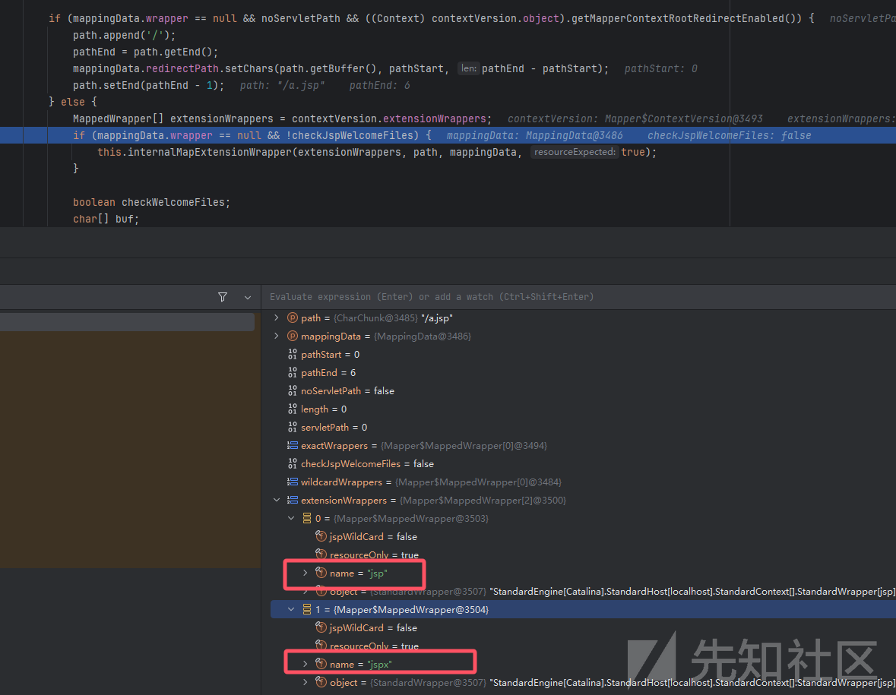

跟入 `JspServlet#serviceJspFile` 方法，进入 `getResource` 方法

```
private void serviceJspFile(HttpServletRequest request, HttpServletResponse response, String jspUri, boolean precompile) throws ServletException, IOException {
    JspServletWrapper wrapper = this.rctxt.getWrapper(jspUri);
    if (wrapper == null) {
        synchronized(this) {
            wrapper = this.rctxt.getWrapper(jspUri);
            if (wrapper == null) {
                // 跟入
                if (null == this.context.getResource(jspUri)) {

```

调试后发现同样到达了 `StandardRoot#getRource` 方法，二者在寻找本地文件的代码相同

回到 `StandardRoot` 类，由于该类是两个 `Servlet` **共同**寻找文件的方法，**我们从该类开始深入分析，即可找到竞争的原因**

```
return this.isCachingAllowed() ? this.cache.getResource(path, useClassLoaderResources) : this.getResourceInternal(path, useClassLoaderResources);

```

在调用 `this.cache.getResource` 前判断是否开启了 `cache`

注意该功能文档位于：<https://tomcat.apache.org/tomcat-9.0-doc/config/resources.html>

主要内容是：

* 如果此标志的值为true，则将使用静态资源的缓存。
* 如果未指定，则标志的默认值为true。

跟入 `cache` 类（这里无需过多关心，竞争的原理和这里的缓存无关）

```
protected WebResource getResource(String path, boolean useClassLoaderResources) {
    // 这里匹配 path 不处理 .class 和 .jar 文件
    if (this.noCache(path)) {
        return this.root.getResourceInternal(path, useClassLoaderResources);
    } else {
        // 默认 strategy 是空
        WebResourceRoot.CacheStrategy strategy = this.getCacheStrategy();
        if (strategy != null && strategy.noCache(path)) {
            return this.root.getResourceInternal(path, useClassLoaderResources);
        } else {
            this.lookupCount.increment();
            // 关键方法
            CachedResource cacheEntry = (CachedResource)this.resourceCache.get(path);
            if (cacheEntry != null && !cacheEntry.validateResource(useClassLoaderResources)) {
                this.removeCacheEntry(path);
                cacheEntry = null;
            }

```

注意第一次访问 `favicon.ico` 得到的是空

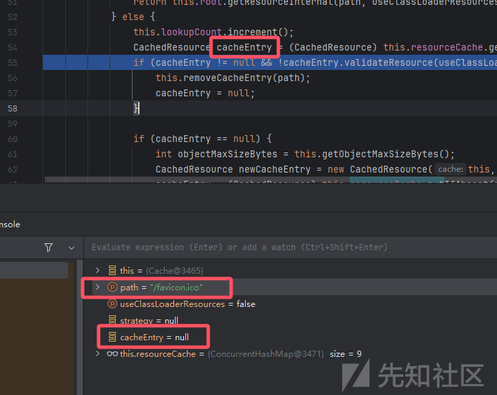

默认内容是以下

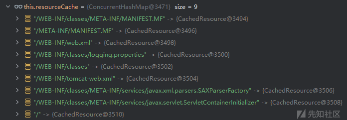

由于结果是空，进入下一行关键方法 `cacheEntry.validateResource`

```
this.root.getResourceInternal(this.webAppPath, useClassLoaderResources);

```

进入 `StandardRoot` 的 `getResourceInternal`

```
result = webResourceSet.getResource(path);

```

进入 `DirResourceSet` 的 `getResource`

```
public WebResource getResource(String path) {
    this.checkPath(path);
    String webAppMount = this.getWebAppMount();
    WebResourceRoot root = this.getRoot();
    if (path.startsWith(webAppMount)) {
        // webAppMount 默认是空
        File f = this.file(path.substring(webAppMount.length()), false);
        // ...
        // 返回文件
    } else {
        return new EmptyResource(root, path);
    }
}

```

### 0x04 AbstractFileResourceSet file

进入核心方法 `this.file` 中 （AbstractFileResourceSet）

```
protected final File file(String name, boolean mustExist) {
    // 一些前置处理
    String canPath = null;
    try {
        // JRE 方法
        canPath = file.getCanonicalPath();
    } catch (IOException var6) {
    }
    // 一些后置处理 返回文件对象
}

```

进入 `JRE` 方法 `WinNTFileSystem#getCanonicalPath`

该方法内容简单总结：将给定的文件路径标准化和规范化

* 处理 `Windows` 驱动器
* 方法检查是否启用缓存。如果缓存未启用，则调用 `canonicalize0` 方法标准化
* 如果缓存可用，则首先检查缓存中是否已经存在该路径的标准化结果，如果存在直接返回
* 另有一个前缀缓存机制，优化父目录相关的问题

可以看到在 `JRE` 中非常注重提升性能，避免重复代码和计算问题

关键部分我已经注释在代码中

```
@Override
public String canonicalize(String path) throws IOException {
    // windows 盘符问题处理代码忽略
    if (!useCanonCaches) {
        return canonicalize0(path);
    } else {
        // 从缓存中获取
        String res = cache.get(path);
        if (res == null) {
            String dir = null;
            String resDir = null;
            // 拿不到缓存 就从前缀缓存中获取下
            if (useCanonPrefixCache) {
                dir = parentOrNull(path);
                if (dir != null) {
                    resDir = prefixCache.get(dir);
                    if (resDir != null) {
                        String filename = path.substring(1 + dir.length());
                        res = canonicalizeWithPrefix(resDir, filename);
                        cache.put(dir + File.separatorChar + filename, res);
                    }
                }
            }
            if (res == null) {
                // 缓存和前缀缓存都没拿到就调用 canonicalize0 方法
                res = canonicalize0(path);
                // 设置缓存
                cache.put(path, res);
                if (useCanonPrefixCache && dir != null) {
                    resDir = parentOrNull(res);
                    if (resDir != null) {
                        File f = new File(res);
                        if (f.exists() && !f.isDirectory()) {
                            // 设置前缀缓存
                            prefixCache.put(dir, resDir);
                        }
                    }
                }
            }
        }
        return res;
    }
}

```

观察到 `cache` 和 `prefixCache` 内容分别如下：一个是具体文件，一个是目录，都是 `JRE` 为性能而做的优化


注意到一个 `native` 方法 `canonicalize0` 底层做了什么

我找到了 `WinNTFileSystem#canonicalize0` 的 `C` 代码

```
JNIEXPORT jstring JNICALL
Java_java_io_WinNTFileSystem_canonicalize0(JNIEnv *env, jobject this,
                                           jstring pathname)
{
    // ...
    WCHAR *cp = (WCHAR*)malloc(len * sizeof(WCHAR));
    if (cp != NULL) {
        // 核心方法
        if (wcanonicalize(path, cp, len) >= 0) {
            rv = (*env)->NewString(env, cp, (jsize)wcslen(cp));
        }
        free(cp);
    } else {
        JNU_ThrowOutOfMemoryError(env, "native memory allocation failed");
    }
    // ...
    return rv;
}

```

核心方法是：wcanonicalize

找到 `jdk` 的 `jdk/src/windows/native/java/io/canonicalize_md.c` 方法

```
int
wcanonicalize(WCHAR *orig_path, WCHAR *result, int size)
{
    // ...
    dst = result; 
    // ...
    h = FindFirstFileW(path, &fd);
    // ...
    if (h != INVALID_HANDLE_VALUE) {
        // 如果找到文件 拼接存在的文件名
        /* Lookup succeeded; append true name to result and continue */
        FindClose(h);
        if (!(dst = wcp(dst, dend, L'\\', fd.cFileName,
                        fd.cFileName + wcslen(fd.cFileName)))){
            goto err;
        }
        src = p;
        continue;
    } else {
        if (!lastErrorReportable()) {
            // 找不到文件 拼接原始文件名

           if (!(dst = wcp(dst, dend, L'\0', src, src + wcslen(src)))){
               goto err;
           }
            break;
        } else {
            goto err;
        }
    }
}

```

其中 FindFirstFileW 函数说明如下

<https://learn.microsoft.com/zh-cn/windows/win32/api/fileapi/nf-fileapi-findfirstfilew>

忽略了大部分代码，只保留关键代码：

* 假设输入 orig\_path 是 xxx/a.jsp
* FindFirstFileW 实际找到的文件是 PUT 成功上传的 a.JSP 文件（已存在文件）
* 最终返回的结果是找到的本地的 a.JSP
* 如果找不到文件，原样返回

**总结：**

* **canonicalize0 方法的输入是 a.jsp 时，如果本地有 a.JSP 文件，会返回 a.JSP 而不是 a.jsp**
* **canonicalize0 方法输入是 a.jsp 时，如果本地没有 a.JSP 文件，原样返回 a.jsp**

为了验证结果，我本地 PUT 写了个 a.JSP 文件，手动访问 a.jsp 成功断点并截图，证明了我的猜测

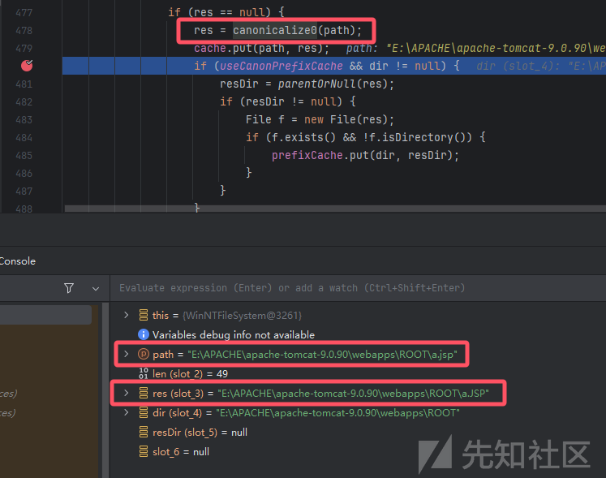

下一步 a.jsp 小写 jsp 被写进去了缓存中 （a.jsp -> a.JSP）

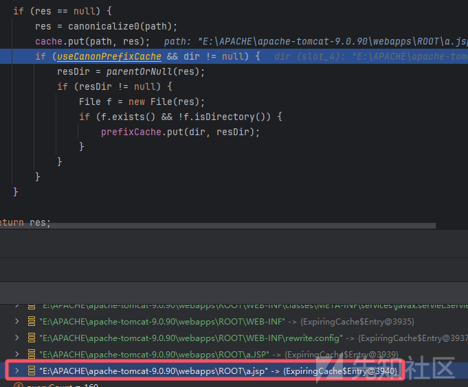

注意高版本 `Java` 的该属性默认是 `false` 不存在缓存机制，你无法进入这个 `else` 分支

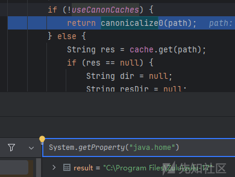

回到 AbstractFileResourceSet 的 file 方法后置处理部分

```
try {
    // JRE 方法
    canPath = file.getCanonicalPath();
} catch (IOException var6) {
}

if (canPath != null && canPath.startsWith(this.canonicalBase)) {
    String absPath = this.normalize(file.getAbsolutePath());
    // ... 一些处理
    if (!canPath.equals(absPath)) {
        if (!canPath.equalsIgnoreCase(absPath)) {
            this.logIgnoredSymlink(this.getRoot().getContext().getName(), absPath, canPath);
        }
        return null;
    } else {
        // 只有 canPath 和 absPath 相同时才会返回文件
        return file;
    }
    // ...
    return null;
}

```

### 0x05 abs path 与 can path

**getCanonicalPath** 的结果是 **can path**

后续和 **abs path** 做比较，决定了返回是 **null** 还是具体的 **File** 对象

其中 abs path 是用户输入的路径拼接处理后的本地绝对路径（不一定必须存在）

其中 can path 是 JRE 类 WinNTFileSystem JNI/cache 处理后得到的路径

大体上分两种情况分析：

**（1）PUT a.JSP 情况**

abs path 显然是 /a.JSP

**情况1.1** can path 无缓存，本地不存在 /a.JSP 文件，原样返回，得到 /a.JSP

**情况1.2** can path 无缓存，本地存在 /a.JSP 文件，原样返回，得到 /a.JSP

**情况1.3** can path 有缓存 a.JSP -> a.JSP 直接读缓存，原样返回，得到 /a.JSP

**情况1.4** can path 有缓存 a.JSP -> a.JSP 直接读缓存，原样返回，得到 /a.JSP

以上任意一种情况，都一定会导致缓存中写入一条新的 a.JSP -> a.JSP

当我们访问 GET a.JSP 时，可以找到上传的 a.JSP 文件（此时由 DefaultServlet 处理静态资源）

**（2）GET a.jsp 情况**

abs path 显然是 /a.jsp

此时应该有三种缓存情况：

**2.1. 缓存 a.jsp -> a.jsp**  
**2.2. 缓存 a.jsp -> a.JSP**  
**2.3. 没有缓存**

情况2.1的原因：GET a.jsp 的时候没有上传 a.JSP 文件，原样返回了

情况2.2的原因：GET a.jsp 的时候已经存在 PUT 上传的 a.JSP 文件，返回以存在文件优先（参考上文 JNI 部分）

情况2.3的原因：高版本 JDK 默认不开缓存 / 手动关了缓存功能 / 第一次访问

情况2.1分析：can path 直接读缓存 /a.jsp，**进入 JspServlet 后续处理阶段，能不能 RCE 看 a.JSP 文件在不在**

情况2.2分析：can path 直接读缓存 /a.JSP，无法通过 equals 验证，返回空，最终返回 404

情况2.3分析：can path 返回看本地有没有 a.JSP（又分为以下两种情况）

情况2.3.1分析：本地有 a.JSP 返回 a.JSP 导致 equals 校验失败，给缓存添加了 a.jsp -> a.JSP

情况2.3.2分析：本地无 a.JSP 返回 a.jsp 可以过校验，给缓存添加了 a.jsp -> a.jsp

如果是 情况 2.3.2 第一次访问，缓存添加了 a.jsp -> a.jsp 内容

然后 PUT a.JSP 成功上传一个问题

再走 情况2.1 进入 JspServlet 后续处理阶段，因为 a.JSP 文件存在，导致了 RCE

### 0x06 二次校验

在我后续调试中，发现即使 a.jsp 的 equals 校验通过，后续还有一层校验

当顺利通过这一层之后，后续存在 `Tomcat` 内置缓存的处理

```
org.apache.catalina.webresources#getResource
```

对得到的 `resource` 再次校验

```
cacheEntry.validateResource(useClassLoaderResources);

```

跟入到达：this.root.getResourceInternal(this.webAppPath, useClassLoaderResources);

层层深入再次到达：AbstractFileResourceSet file 方法

我们要保证二次校验这里还是 a.jsp -> a.jsp

### 0x07 n次校验

还没有结束，在 JspServlet 后续处理的过程中，会再次抵达 AbstractFileResourceSet file 方法

JspCompilationContext#getLastModified

```
URL jspUrl = this.getResource(resource);
```

JspCompilationContext#getResource

还没有结束

JspCompilationContext#getLastModified 中调用了

```
uc.getLastModified()
```

到达 org.apache.catalina.webresources.CachedResource#getResource

再次抵达 AbstractFileResourceSet file 方法

最后达到真正的 `JspServlet` 读取文件的地方

JspUtil#getInputStream

再次抵达 AbstractFileResourceSet file 方法

### 0x08 竞争的是什么

**竞争的难点是什么**：我们需要保证，以上的 n 次 file 方法，取到的 cache **都必须**是 a.jsp -> a.jsp

只要有一次是：a.jsp -> a.JSP 就会导致无法通过 equals 校验，返回 null 无法后续走完全程

回顾一下，什么情况下会出现：a.jsp -> a.JSP

PUT a.JSP 只要完成了，本地存在了 a.JSP 文件

就会导致下一次的 AbstractFileResourceSet file 方法中 can path 得到 a.JSP 和 abs path 不一致

以上，可以看到，保存了一次 a.jsp -> a.jsp

我们必须要 PUT a.JSP 文件落地之前

完美地通过以上 n 次的 AbstractFileResourceSet file 方法（注意这个 n 不止4次，实际需要更多次）

以上 n 次的 equals 校验，必须都拿到 a.jsp - > a.jsp 才会成功执行 jsp 文件导致 RCE

通过以上 n 次之后，还需要再 InputStream 读取的时候，文件正好落地，成功读到文件内容

### 0x09 过期策略

如果你仔细调试，你会发现为什么有时候 cache 里的 a.jsp -> a.jsp 不见了

因为 cache 有过期策略

```
synchronized String get(String key) {
    // 超过 300 个缓存就清空
    if (++queryCount >= queryOverflow) {
        cleanup();
    }
    // 根据 key 取
    Entry entry = entryFor(key);
    if (entry != null) {
        return entry.val();
    }
    return null;
}
private Entry entryFor(String key) {
    Entry entry = map.get(key);
    if (entry != null) {
        long delta = System.currentTimeMillis() - entry.timestamp();
        // 默认超时 30 秒
        if (delta < 0 || delta >= millisUntilExpiration) {
            // a.jsp -> a.jsp 只会保持 30 秒
            map.remove(key);
            entry = null;
        }
    }
    return entry;
}

```

所以我们的调试要在 30 秒内速速操作，超过就找不到了

### 0x08 修复

**CVE-2024-50379** 的修复如下

<https://github.com/apache/tomcat/commit/43b507ebac9d268b1ea3d908e296cc6e46795c00>

<https://github.com/apache/tomcat/commit/631500b0c9b2a2a2abb707e3de2e10a5936e5d41>

**读操作和写操作加了锁**

官方修复时的想法应该是：（不考虑缓存情况）

当 PUT 操作没有完成写入的时候，GET a.jsp getResource 操作阻塞

官方的锁考虑了大小写，PUT a.JSP 的 write 操作和 GET a.jsp 的 read 操作是同一个锁，读和写冲突

```
private String getLockKey(String path) {
    // Normalize path to ensure that the same key is used for the same path.
    String normalisedPath = RequestUtil.normalize(path);
    if (caseSensitive) {
        return normalisedPath;
    }
    // a.JSP 和 a.jsp 都是 a.jsp 的 lock key
    return normalisedPath.toLowerCase(Locale.ENGLISH);
}

```

**CVE-2024-56337** 二次修复

官方给出建议：必须设置该属性为 false

```
sun.io.useCanonCaches
```

回顾上文 `canonicalize` 方法当该属性是 false 时直接 JNI 获取路径，不进行缓存

```
if (!useCanonCaches) {
    return canonicalize0(path);
} else {
    // ...

```

缓存这里存在的安全问题

* 第一次 GET a.jsp 时缓存中添加了 a.jsp -> a.jsp
* 第 n 次 GET a.jsp 可能有两种缓存：a.jsp -> a.JSP / a.jsp->a.jsp

如果某一个时刻

* PUT a.JSP 文件已经写入了
* GET a.jsp 的时候缓存中内容是 a.jsp -> a.jsp 成功绕过 equals 验证
* JspServlet 读到 a.JSP 文件有内容成功执行

如果不使用缓存，将会出现以下问题：

* GET a.jsp 时如果 a.JSP 文件存在，can path 一定是 JSP 导致无法通过 equals 校验
* GET a.jsp 时如果 a.JSP 文件不存在，can path 一定是 jsp 可以进入 JspServlet 后续

没有缓存，于是当 PUT a.JSP 文件落地后，后续的 GET a.jsp 将全部得到 a.JSP 无法通过 equals 校验

正是因为缓存，导致了一种可能：PUT a.JSP 后可能 GET a.jsp 得到的 can path 还是 a.jsp

以上内容，考虑情况比较多且比较复杂，难免存在一些错误之处，欢迎师傅们讨论和指出问题

### 0x05 检测

作为扫描器，不可以使用线程对冲的方式，可能会导致巨量脏数据

经过一些测试和综合考虑，我找到一种几乎无误报漏报，无损无脏数据的扫描方式

我已经给 **xray 商业版（洞鉴）**添加了该扫描方案，具体逻辑如下：

**（1）判断 PUT 操作有效**

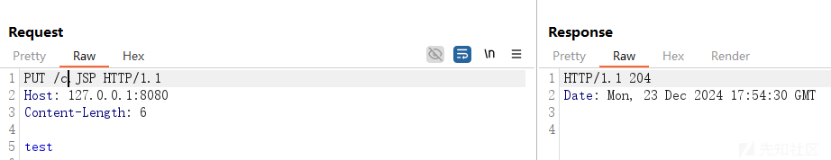

如果 PUT 任意一个随机文件得到 204 返回，证明开启了 PUT 操作

补充：为了证实 PUT 操作确实有效和脏数据考虑，下一步可以 GET 访问确认成功，最后 DELETE 删除该临时文件

**（2）判断操作系统**

感谢漏洞百出群友的帮助，找到了一种判断目标是否是 WINDOWS 系统的方法

以 Linux 系统为例

PUT 上传一个 :.txt 文件成功，响应 201

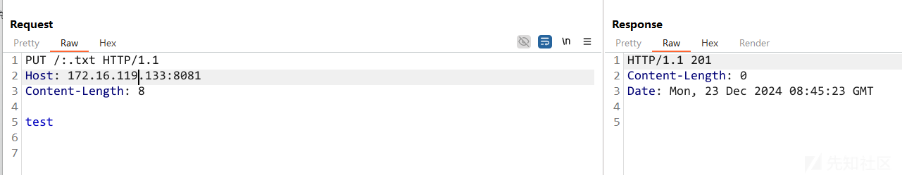

访问 :.txt 成功，内容正确

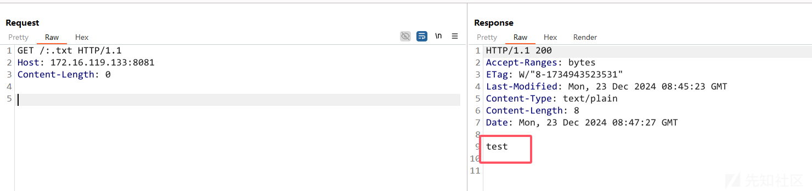

但是在 Windows 系统会遇到 409 的报错

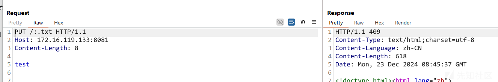

根据该差异，可以确定目标系统的类型

**（3）版本信息**

通过以上两点，可以证明开启 PUT 且是 WINDOWS

只需要再通过一个 404 路径，使用正则取到 `Tomcat` 报错版本信息

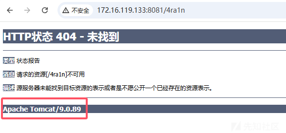

根据官方公告，精确匹配 tomcat 版本

```
// Affected versions:
//- Apache Tomcat 11.0.0-M1 through 11.0.1
//- Apache Tomcat 10.1.0-M1 through 10.1.33
//- Apache Tomcat 9.0.0.M1 through 9.0.97
if (ver >= 9_000_000 && ver <= 9_000_097) ||
    (ver >= 10_001_000 && ver <= 10_001_033) ||
    (ver >= 11_000_000 && ver <= 11_000_001) ||
    // 目前来看 9/10/11 的 M 版本都有漏洞
    (strings.Contains(verStr, "M") &&
        (strings.HasPrefix(verStr, "9.") ||
            strings.HasPrefix(verStr, "10.") ||
         strings.HasPrefix(verStr, "11."))) {
        // 报告漏洞
    }
}

```

通过这三步，即可完成一个几乎无误报漏报无损无脏数据的漏洞检测方案

（注意：几乎完美，但不能覆盖所有情况，如果用户手动关闭缓存，远程无法检测到）

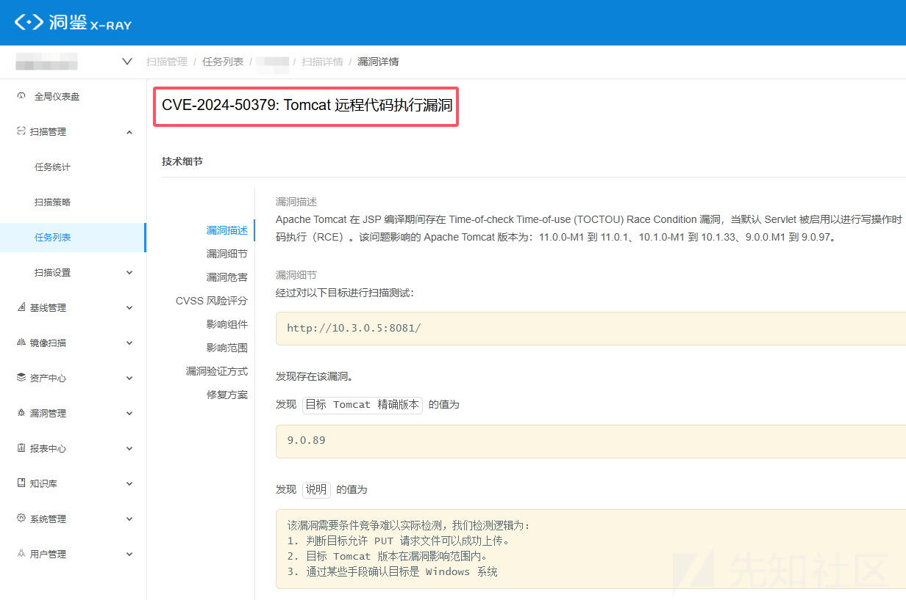

## 0x06 致谢

感谢 漏洞百出 群友一起交流以及给出 windows 系统检测思路
