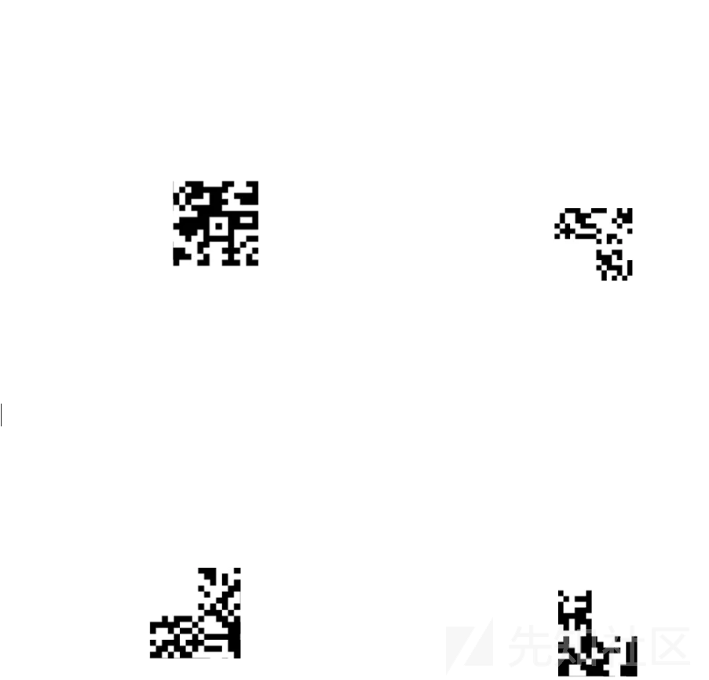
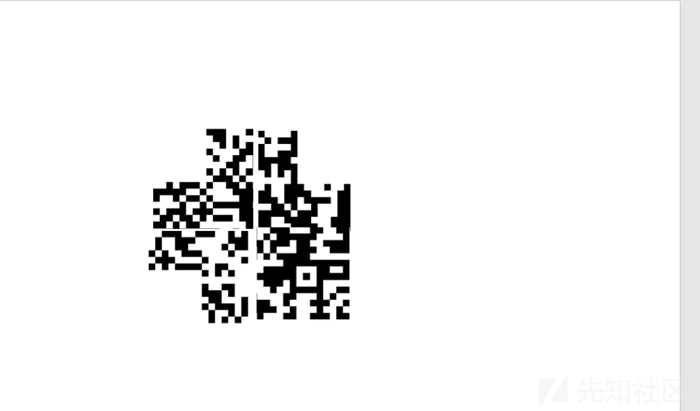
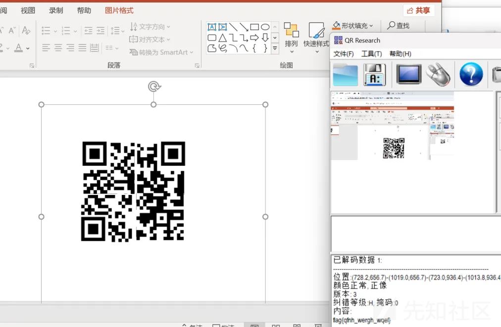
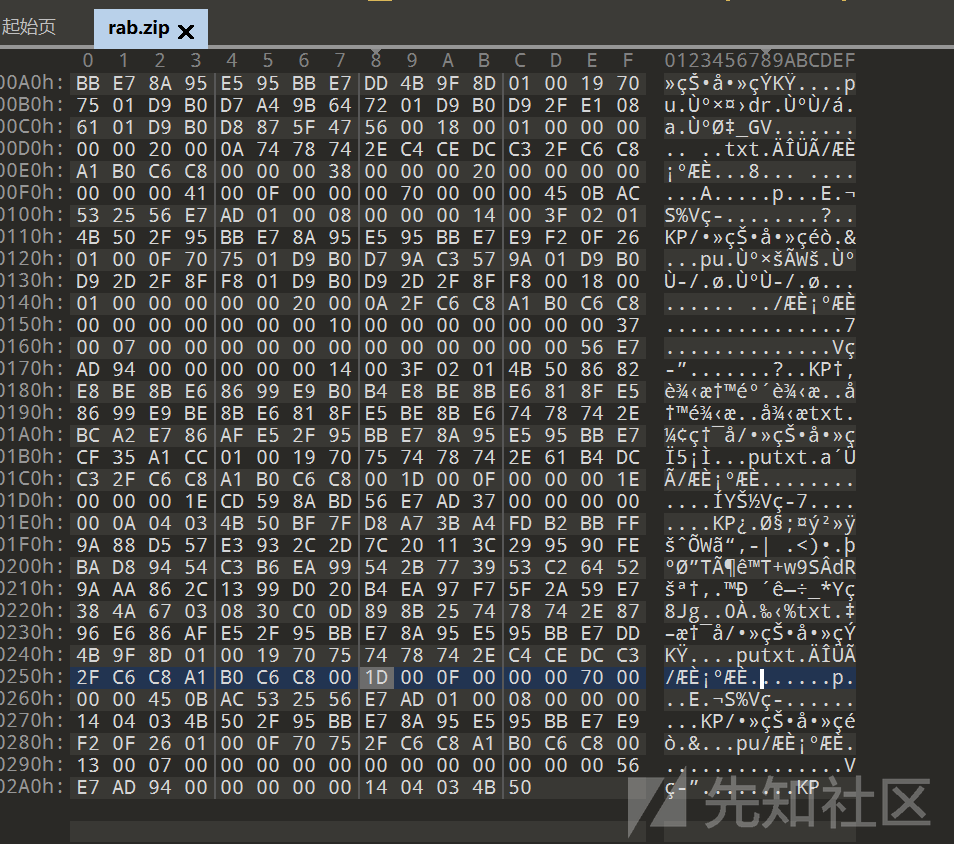
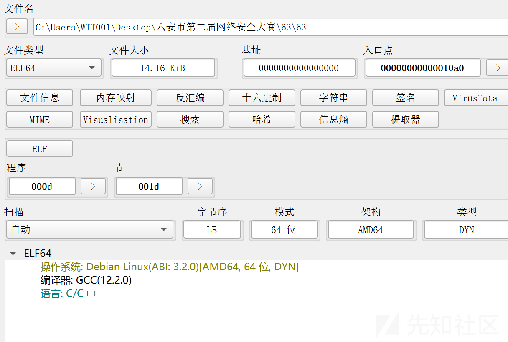
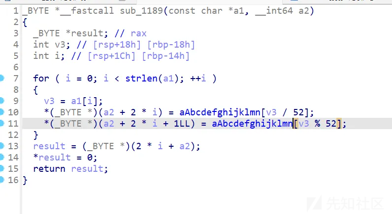
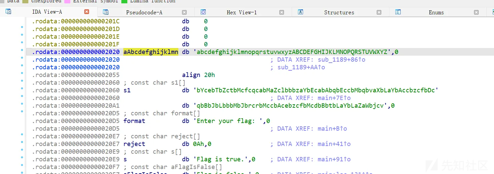
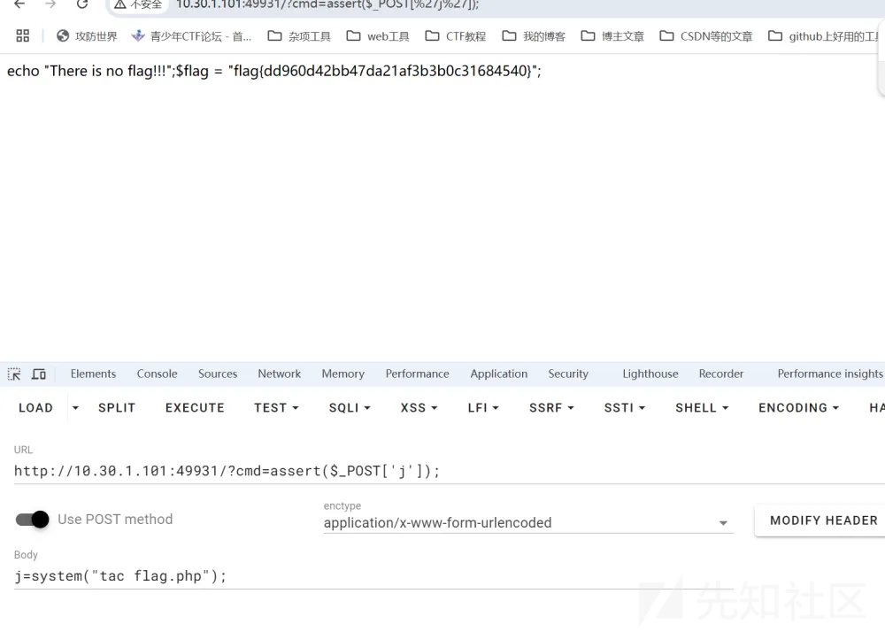

# 六安市第二届网络安全大赛WP-先知社区

> **来源**: https://xz.aliyun.com/news/16346  
> **文章ID**: 16346

---

### misc

#### 听说你也喜欢俄罗斯方块？

给了四张图片



ppt拼接之后



缺三个角补上



flag{qfnh\_wergh\_wqef}

#### rab

反的压缩包



转一下


密码：拾叁拾陆叁拾贰陆拾肆

密文：4p4n575851324332474r324753574o594n5n5746514q53324r4252464s3344544q564p445334444447453458535952544o4934513q3q3q3q

13

16

32

64

rot13

16进制

base32

base64

解得

flag{base\_family\_is\_rot}

### re

#### 63

64位的



f5





魔改base64

bYcebTbZctbMcfcqcabMaZclbbbzaYbEcabAbqbEccbMbqbvaXbLaYbAccbzcfbDc

EXP

```
def decode(encoded):
    # aAbcdefghijklmn 字符串
    mapping = "abcdefghijklmnopqrstuvwxyzABCDEFGHIJKLMNOPQRSTUVWXYZ"
    original_chars = []

    # 每两个字符解码一次
    for i in range(0, len(encoded), 2):
        x = encoded[i]
        y = encoded[i + 1]

        index1 = mapping.index(x)
        index2 = mapping.index(y)

        # 计算原字符的 ASCII 值
        original_value = index1 * 52 + index2
        original_chars.append(chr(original_value))

    # 将列表转换为字符串
    return ''.join(original_chars)

encoded_string = "bYcebTbZctbMcfcqcabMaZclbbbzaYbEcabAbqbEccbMbqbvaXbLaYbAccbzcfbDcqbBbJbLbbbMbJbrcrbMccbAcebzcfbMcdbBbtbLaYbLaZaWbjcv"
decoded_string = decode(encoded_string)
print(decoded_string)
```

flag{93da44cd25ccc2d19f9ea2f3e2fd8f6c}

### **web**

#### 1



上传木马，命令执行得到flag

#### 2

忘记截图了

跟这题差不多

```
<?php
include("flag.php");
highlight_file(__FILE__);
if(isset($_GET['num'])){
    $num = $_GET['num'];
    if($num==4476){
        die("no no no!");
    }
    if(preg_match("/[a-z]/i", $num)){
        die("no no no!");
    }
    if(intval($num,0)==4476){
        echo $flag;
    }else{
        echo intval($num,0);
    }
}
```

可以用8进制数绕过

?num=010574

### crypto

#### **Keyboard**

```
vcrtdg pok wzsq vbthfy {CERXSF 9i0plk _U76THG 9i0plk i7jh8y _IOMJL mjhb 9i0plk a2e3qs _5Y6FRG uybnjg wr34ds _IOMJL wr34ds u76thg vhng 9i0plk wzsq 5et4df cerxsf _OL0 wzsq wzexda wzexda a2e3qs 9i0plk 5et4df cerxsf }
```

flag中不包含空格

键盘围绕中间的字母

flag{Do\_You\_Know\_The\_Keyboard\_Password}
