# 记一次某红蓝演练经历-先知社区

> **来源**: https://xz.aliyun.com/news/16350  
> **文章ID**: 16350

---

## 记一次某红蓝演练经历

在某天接到任务，对xxx进行一次红蓝演练，于是把自己渗透过程给记录下来，漏洞关键地方也会打码，希望各位大佬理解，菜鸡一枚，勿喷/(ㄒoㄒ)/~~

## 概述

拿到目标域名第一件事就是信息收集，曾经一位大佬告诉我的一句名言：信息收集的深度决定渗透测试的广度，送给大家。由于这里给出了xxx公司，而且目标资产基本都在`云上`，我就通过这个企业的备案还有它旗下的一些资产进行收集，这里我用到的工具有大家熟知的:`Hunter`、`Fofa`、`360Quake`等，这里也推荐一款工具就是`无影TscanPlus`，之前没怎么关注，因为感觉资产测绘的工具都大差不差，但是听朋友说这款工具信息收集还不错，于是就尝试使用了一下，我配置了各种key以后，信息收集能力还是不错的，声明一下:我没有会员哈哈哈哈，不过还是可以当作一款信息收集工具的，会员可以增加全量POC，感觉还是很不错的，接下来就是拿到资产以后进行渗透

## 正文

首先拿到资产进行筛选，嗯？突然看到一个特别熟悉的框架，由于之前团队经常打杀猪盘这类违反网站，所以一眼就看出来了这是`fastadmin`框架，当然通过`findsomething`这个插件也能看到js路径有fastadmin的字样，当时看到这个瞬间兴奋起来了，这是马上要拿下了吗？

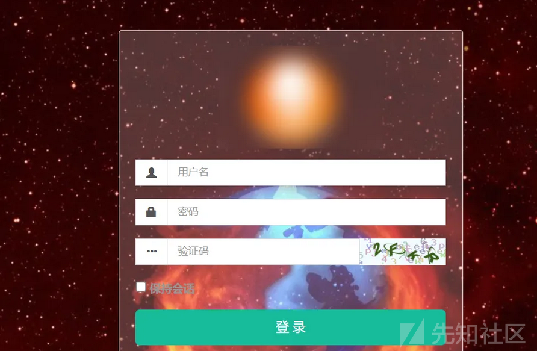

但是切记半场开香槟是大忌，于是想到之前有个fastadmin任意文件读取漏洞嘛，尝试利用一下，POC也放下面了

```
GET /index/ajax/lang?lang=../../application/database
```

很幸运，漏洞是存在的，成功拿到数据库的账号和密码，不错不错

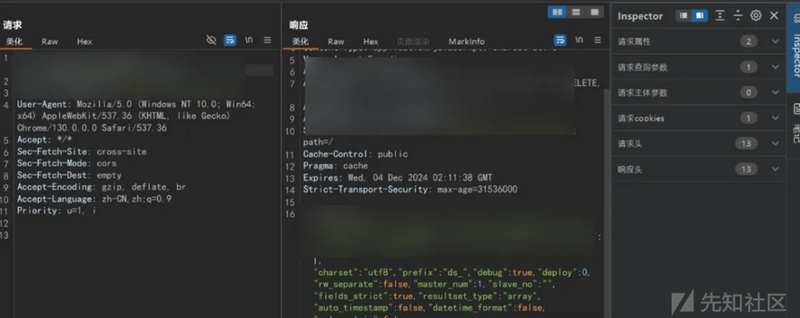  
还是不能高兴太早，因为拿到的是域名，得找它的ip并且还要开放`3306端口`或者数据库端口才行，于是通过`多地ping`寻找真实ip，很幸运，对方并没有购买`CDN服务`，通过`Nmap`也确定了`3306端口`对外开放，接下来就是爽连的过程了，数据还不少呢，算一个小战果吧，因为当时进后台发现了近20W+的个人身份信息

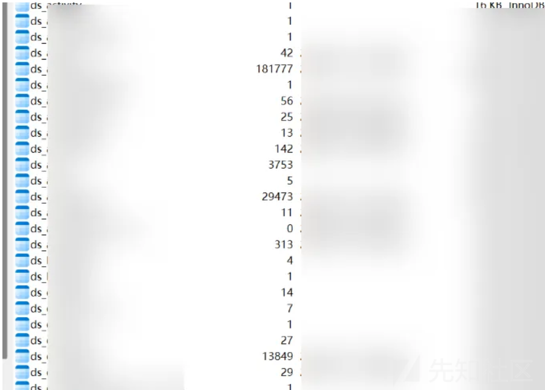  
既然有了数据库，那就尝试进后台拿shell，这里fastadmin数据库密码都经过加盐处理了，一般来说是解密不了的，当然运气好的哥们除外

  
这里我就想到之前可以通过修改密码进入后台的方式，于是去网上找一下fastadmin的密码与之匹配的盐值，然后修改后台密码为123456即可，记得该回去哈，如图  
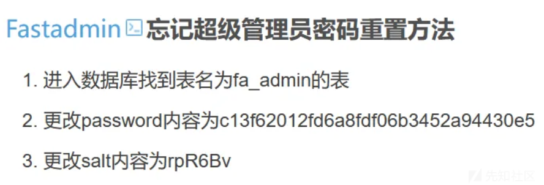  
按照图中所示，修改了密码后，进入后台，发现了不少数据，大概4W+数据吧，还有不少实名认证信息，到这里fastadmin基本上可以结束了，因为大部分是shell不了的

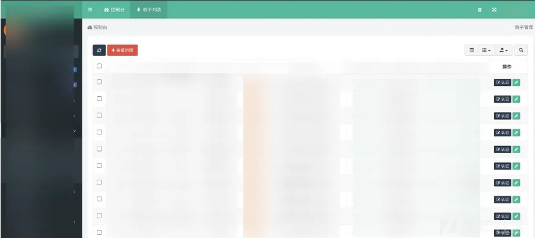  
但是我突然想到，欸，我有个朋友很厉害，于是跟他深入交流了一波，你懂的嘿嘿，这里成功通过后台拿到`shell`，这里细节不过多描述，最后也是成功连上了`哥斯拉`，看到了网站下部署的服务，很经典的框架和文件结构，而且是`云上`，所以就没有再深入了

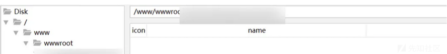  
后来在复盘的时候，发现这个是主域名，但是目标主ip不是这个，所以打的稍稍有点偏了，不过没关系，还有呢！

熟悉的界面，没错就是jeecg-boot，我这里直接未授权就进来了

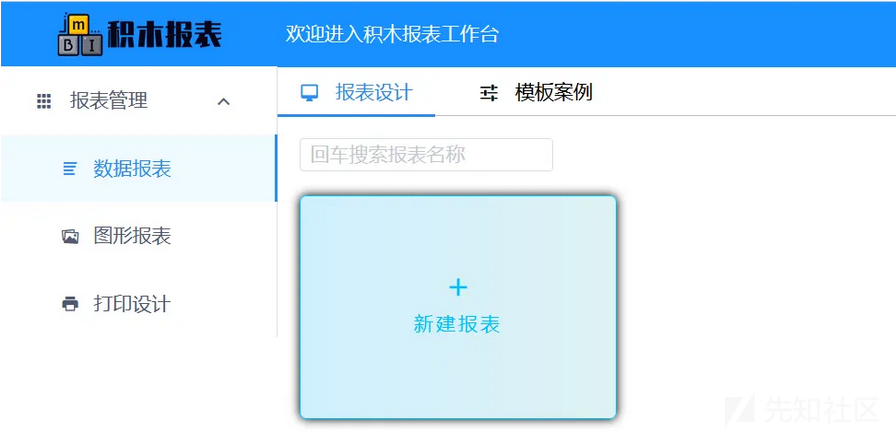  
当时想着系统版本应该比较拉胯，于是工具(`I-Wanna-GetALL`)一把梭，通过积木报表的历史漏洞RCE，当时用`Vshell`上线失败了，可能是工具和环境有问题吧，于是用`msf`上线拿到服务器权限，这里我没有仔细翻，也许会有宝藏谁知道呢，而且是台双网卡的云服务器  
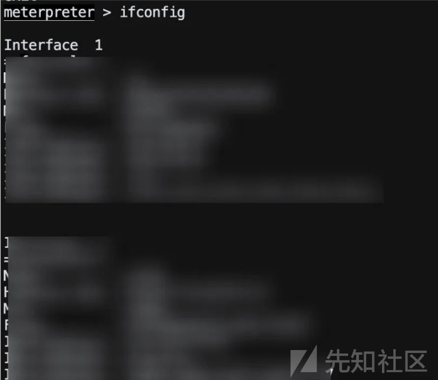  
于是又在一堆目标里翻垃圾，终于苍天不负有心人，在xx目标url中一处js里找到了阿里OSS的AK/SK，所以平常多翻翻`j`s文件还是有好处的，指不定就有`AK/SK`等着咱们呢，这有个小技巧就是阿里云的存储桶key这些的特征是`LTAI`开头等，各大云厂商的特征网上也有文章介绍，这里不做过多阐述，下面开始爽连

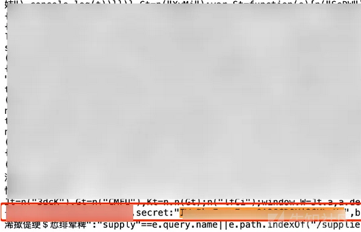  
既然有了存储桶权限，那我们去看看这个`key`下有什么东西吧，这里我想到一款云上工具:`CF`，来自狼组安全团队的一款工具，挺不错的，这里也放一下工具的使用手册，新手放心食用，最新的云鉴也可以试试，毕竟CF的动静还是挺大的

```
https://wiki.teamssix.com/CF/
```

于是就根据工具罗列出该`AK/SK`的权限，不错不错，最高权限，后来也是看到有大概`50+`个ECS、`6+`个域名、`3+`个数据库服务

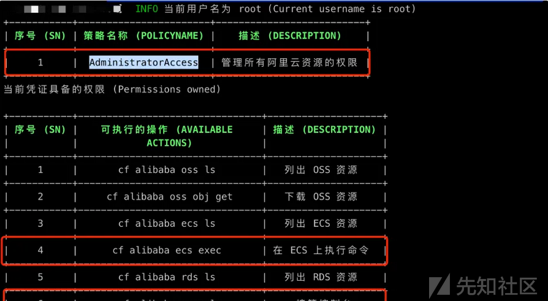  
这里是下面的`ECS实例`

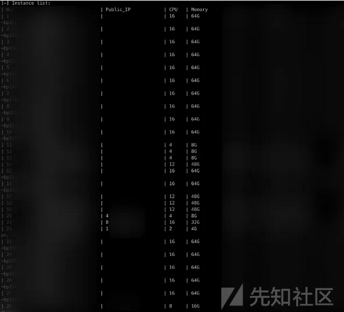  
AK\SK下的`OSS Bucket`

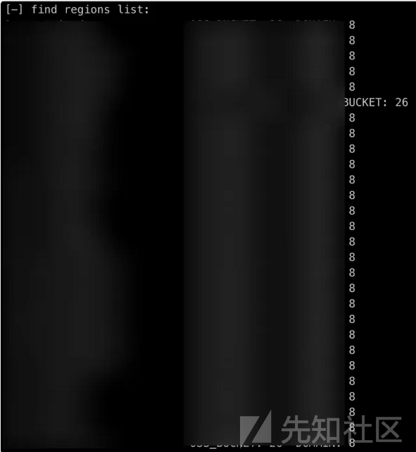  
这里我也是成功通过创建凭据拿到了阿里云的控制台权限

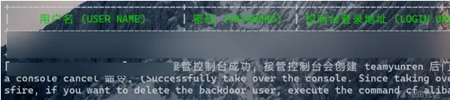  
这里提示一下，用`CF`创建后门用户的时候，阿里云会产生告警，可能会让对方警惕起来，所以非必要还是杜绝这种操作吧，项目结束后也要记得把后门用户给清理掉，否则追责起来很麻烦

  
后来就是列举一些`ECS`实例，通过`反弹shell`的方式或者执行命令来上线，这里也是成功上线大概`10+`台机器，因为机器太多了，然后关键机器已经拿到了，所以后续就没有必要继续拿服务器权限了

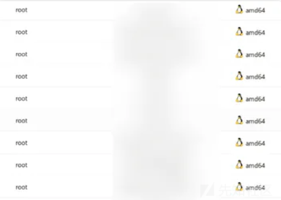  
基本上一天就打穿了，非常爽，后来就是在云上翻垃圾的时候，通过搭建隧道进入云上内网，翻到一些泛微、Nacos这种服务，这里是翻到Nacos的配置文件里ssh账密泄露、数据库等，拿拿数据分啥的

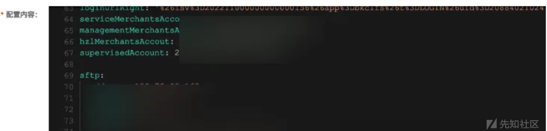  
数据库配置，用DBeaver和Navicat都可以连，这两都挺不错

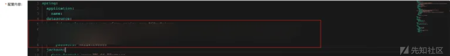  
这里是利用内网泛微E-mobile的弱口令进的后台，网上可以搜搜泛微的通用默认密码，说不定瞎猫碰见死耗子了呢

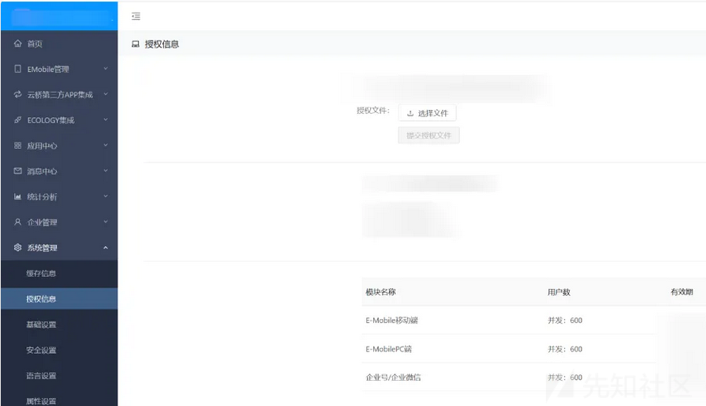  
然后看到`泛微E-mobile`就想尝试一下之前爆出的任意文件读取漏洞，因为我在公网当时找了好几个ip，都是`302重定`向然后说资源不存在之类的，可能是接口做了鉴权？这里也不太清楚，于是我就抱着试一试的心态看看内网这次能不能成功，果然，上天比较眷顾我，竟然复现成功了！刚开始读取的是`Linux`的`etc/passwd`，返回`302`，心里已经拔凉拔凉的了，但是我不甘心！突然想到也许是`windows`系统?于是读取`windows/win.ini`，成功读取到了文件，果然渗透还是要不放过任何细节才能出货呀

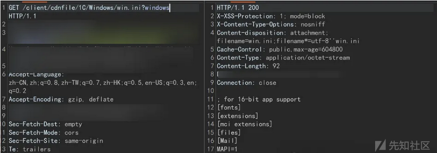  
后来就是无情的翻垃圾过程了，服务器上存在一些Gitlab配置文件，导致信息泄露，可以拿到代码仓库等信息  
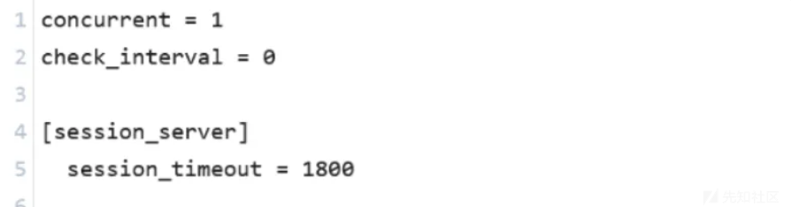

  
apixis配置信息泄露

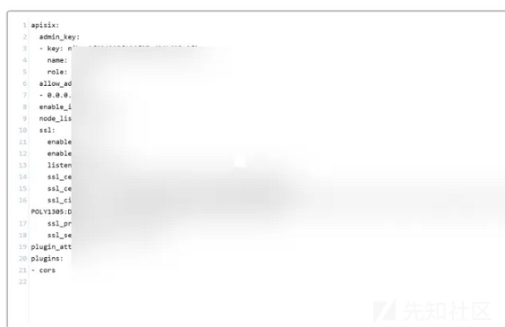  
然后还有黑盒测一些系统通过一些接口可以访问到后台的功能，这里是没有做足够的鉴权，危害还是挺大的

  
后续他们的成员也是发现了入侵行为，赶紧购买了阿里云一系列资源保护服务，还好把整个过程都提前记录了下来，后续也是希望能够通过本次红蓝演练提升企业的安全意识吧，我认为这才是攻防演练的目的，并不是为了攻击而攻击，而是提高企业的安全水位和员工的安全意识

## 总结

到这里基本就结束了，后续就是写报告进行复盘了，主要还是记录一下自己攻防的一次经历吧，算不上特别出彩，但是整个红蓝演练过程中还是学到了不少奇淫技巧，也对云上的攻防有了更多的了解，当作一次小小的练习吧，同时也希望能够给大家一些启发，互相交流，不断学习！

## 声明

本文所提供的信息仅供学习和研究网络安全技术之用途。读者在使用这些信息时应自行判断其适用性，并对其行为负全责。作者不对任何读者因使用本文中信息而导致的任何直接或间接损失负责。  
转载须知：如需转载本文，请务必保留本文末尾的免责声明，并标明文章出处，同时提供原文链接。未经许可，请勿对本文进行修改，以保持信息的完整性。感谢各位师傅们的理解与支持。
