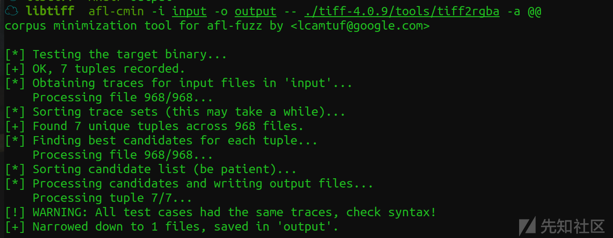
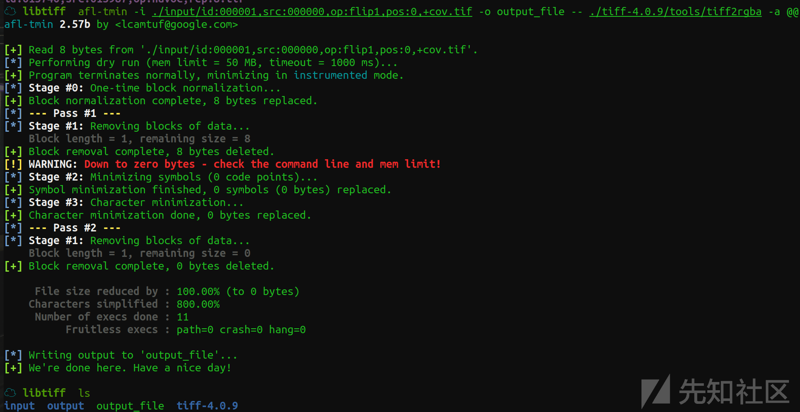
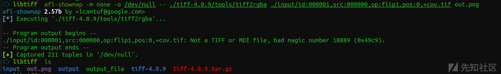
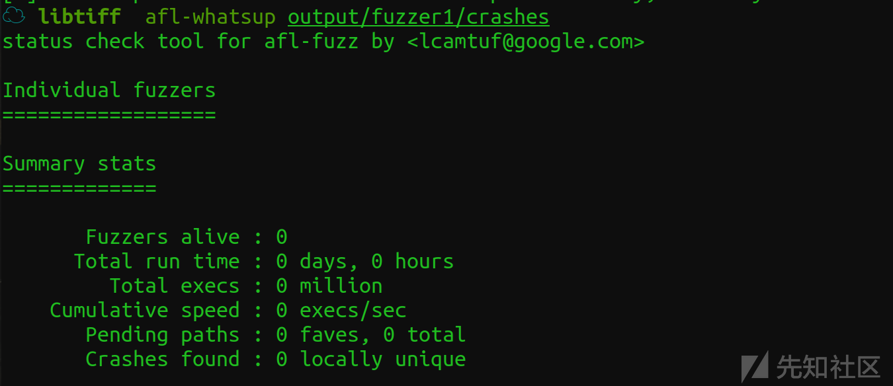
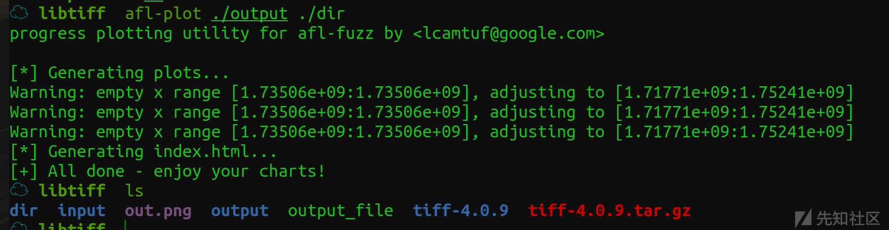
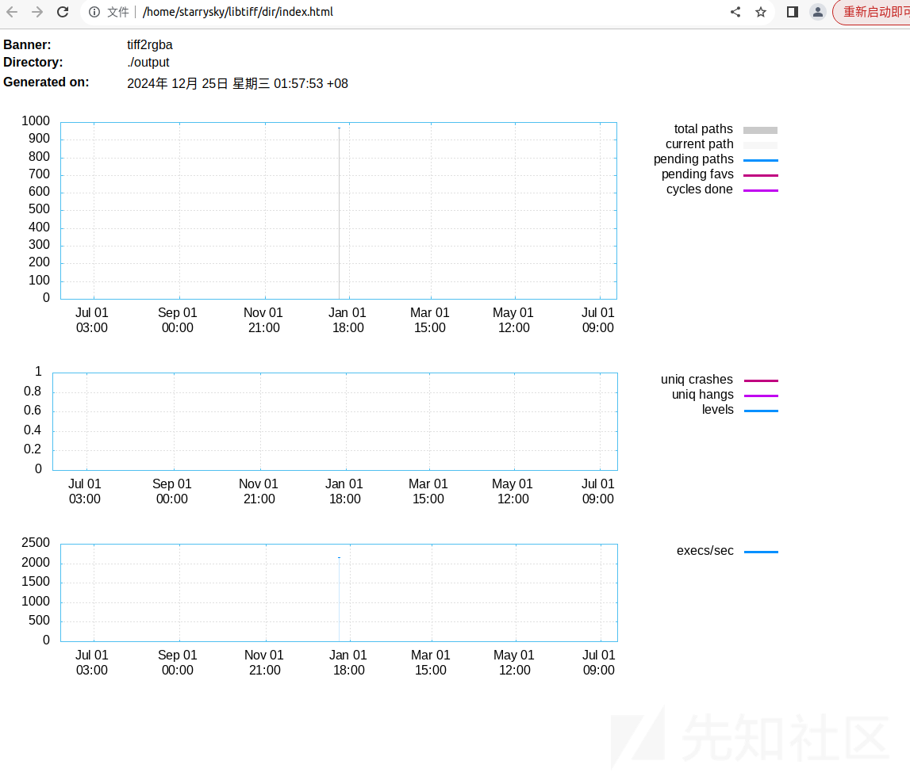
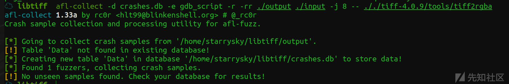

# AFL工具使用实践：以libtiff为例的使用指南-先知社区

> **来源**: https://xz.aliyun.com/news/16353  
> **文章ID**: 16353

---

## libtiff下载

libtiff是一个开源库，用于处理TIFF（Tagged Image File Format，标记图像文件格式）图像

```
$mkdir libtiff
$cd libtiff
$wget http://download.osgeo.org/libtiff/tiff-4.0.9.tar.gz
$tar zxvf tiff-4.0.9.tar.gz
$cd tiff-4.0.9

```

## fuzz

afl\_testcase demo下载地址：<https://lcamtuf.coredump.cx/afl/demo/afl_testcases.tgz>

```
#设置环境变量中c和c++的编译器为afl-gcc和afl-g++
$export CC=afl-gcc
$export CXX=afl-g++
#编译
$./configure --disable-shared
$make
$cd ..
#创建用于输入和输出的文件夹
$mkdir input output
#将测试用例放到输入文件夹
$cp ../AFL/testcases/tiff/edges-only/images/* input
#开始fuzz
$sudo su
$echo core >/proc/sys/kernel/core_pattern
$afl-fuzz -i input -o output ./tiff-4.0.9/tools/tiff2rgba -a @@

```

## 修剪

术语称为语料库蒸馏，是模糊测试中的一个重要步骤，它可以帮助我们减少测试用例的数量，同时保持测试的覆盖率

### cmin

cmin 工具的目的是移除那些执行相同代码路径的输入文件，从而找到与全集具有相同覆盖范围的最小子集。如果多个文件覆盖了相同的代码，那么可以丢弃多余的文件，这样可以减少测试用例的数量，提高测试效率

```
$afl-cmin -i input -o output -- ./tiff-4.0.9/tools/tiff2rgba -a @@

```



### tmin

tmin 工具用于减小单个输入文件的大小。在默认的 instrumented 模式下工作，如果加上 -x 参数，则指定为 crash 模式，这会直接剔除那些导致程序非正常退出的文件

```
$afl-tmin -i ./input/id:000001,src:000000,op:flip1,pos:0,+cov.tif -o output_file -- ./tiff-4.0.9/tools/tiff2rgba -a @@

```



## showmap

用于测试插桩程序，编译完可以使用 afl-showmap 跟踪单个输入的执行路径并打印输出、捕获的元素 tuples，这些tuples用于获取分支信息，从而衡量覆盖情况

```
$afl-showmap -m none -o /dev/null -- ./tiff-4.0.9/tools/tiff2rgba ./input/id:000001,src:000000,op:flip1,pos:0,+cov.tif out.png

```



## screen

当模糊测试被中断时，可以通过 screen 会话重新启动之前的案例

安装：

```
$sudo apt install screen

```

使用：

```
$screen afl-fuzz -i input -o output ./tiff-4.0.9/tools/tiff2rgba -a @@

```

也可以重命名：

```
$ screen -S fuzzer1
$ afl-fuzz -i testcase_dir -o findings_dir /path/to/program [params] @@
[detached from 6999.fuzzer1]
$ screen -r fuzzer1
  ...

```

## 单系统并行测试

在多核心机器上，可以将模糊测试实例绑定到一个核心上，有多少核心就可以运行多少个模糊测试实例，以提升执行速度

查看核心数：

```
$ cat /proc/cpuinfo| grep "cpu cores"| uniq

```

并行 fuzz：-M 指定主 Fuzzer，-S 指定多个从属 Fuzzer，-o 指定同步目录，其中主 Fuzzer 进行确定性测试，从属 Fuzzer 进行完全随机变异，并行测试中所有 Fuzzer 相互协作，找到新代码路径时相互传递新的测试用例，通过比较 id 同步 interesting case

```
$screen afl-fuzz -i input -o output -M fuzzer1 -- ./tiff-4.0.9/tools/tiff2rgba -a @@
$screen afl-fuzz -i input -o output -S fuzzer2 -- ./tiff-4.0.9/tools/tiff2rgba -a @@

```

## whatsup

afl-whatsup 工具用于查看每个模糊测试器的运行状态和总体运行概况。，如果只需要显示概况，可以加上 -s 选项

```
$afl-whatsup output/fuzzer1/crashes

```



## plot

以图形化方式展示模糊测试的情况

安装：

```
$ apt-get install gnuplot

```

使用：指定 fuzz 结果目录和生成图像目录

```
$afl-plot ./output ./dir

```



可以打开输出目录中的网页查看图标分析



## collect

用于处理测试结果，是 afl-utils 中的工具，可以分析 crash 的原因并清晰的显示出来

安装：

```
$ git clone https://github.com/rc0r/exploitable
$ sudo python setup.py install
$ git clone https://github.com/rc0r/afl-utils
$ sudo python setup.py install

```

使用 python2 报错没有 which，可以自定义一个 which 函数：

```
def which(program):
    # 查找程序在系统中的路径
    for path in os.environ["PATH"].split(os.pathsep):
        exe_file = os.path.join(path, program)
        if os.path.isfile(exe_file) and os.access(exe_file, os.X_OK):
            return exe_file
    return None

```

同时修改源代码中的 which：

```
gdb_binary = which("gdb")

```

执行：

```
$afl-collect -d crashes.db -e gdb_script -r -rr ./output ./input -j 8 -- ././tiff-4.0.9/tools/tiff2rgba

```


