# 前端加解密对抗encrypt-labs-先知社区

> **来源**: https://xz.aliyun.com/news/16356  
> **文章ID**: 16356

---

## 前言

项目地址：`https://github.com/SwagXz/encrypt-labs`

作者：`SwagXz`

现在日子越来越不好过了，无论攻防、企业src还是渗透项目，总能看到大量的存在加密的网站，XZ师傅的前端加密靶场还是很值得做一做的，环境很贴合实战会遇到的一些情况，本人web小菜鸡练完之后反正是收获颇丰，推荐给各位师傅。

之前自己在学习前端加解密经常遇到加密解不了的情况；之后慢慢看师傅们的文章，也学到了很多绕过技术，于是写了个简单的靶场，为之后的师傅们铺路学习,加密方式列出了我经常见的8种方式包含非对称加密、对称加密、加签以及禁止重放的测试场景，比如AES、DES、RSA，用于渗透测试加解密练习。希望可以帮助到最近在学习这块知识的师傅，靶场函数.很简单，和实战相比还是差的有点多，不过应该够入门了

默认密码：admin/123456

<http://82.156.57.228:43899> (混淆)

<http://82.156.57.228:43899/easy.php> （无混淆）

## 加解密插件/工具

burp自动加解密插件autoDeceder：`https://github.com/f0ng/autoDecoder`

这个插件可以帮忙处理常见的`AES、DES、SM4、SM2、RSA`等加密，灰常好用

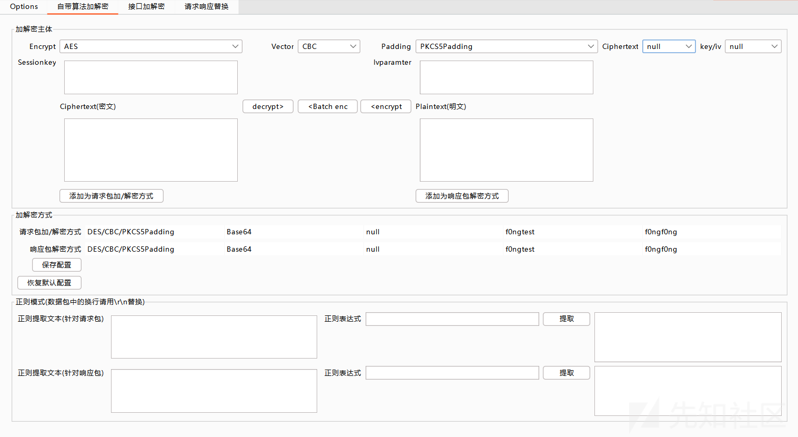

还有个浏览器插件:`Ctool 程序开发常用工具:https://ctool.dev/`

直接在谷歌商店或者火狐商店即可下载

也是可以对常见的加密方式进行加密解密,这个适用的加解密方式更多，如果只是用于验证加解密情况的话，这个插件会方便很多

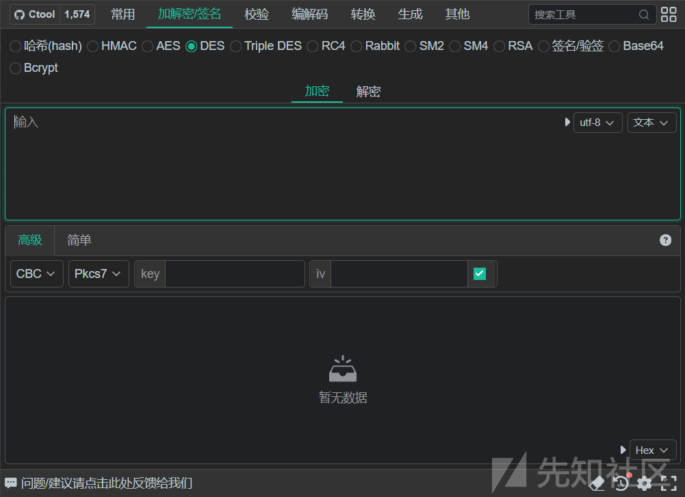

## encrypt-labs

使用无混淆的进行测试说明

`http://82.156.57.228:43899/easy.php （无混淆）`

`admin/123456`

#### 【第一关】AES固定key

抓包发现数据包被加密了：加密参数为`encryptedData`

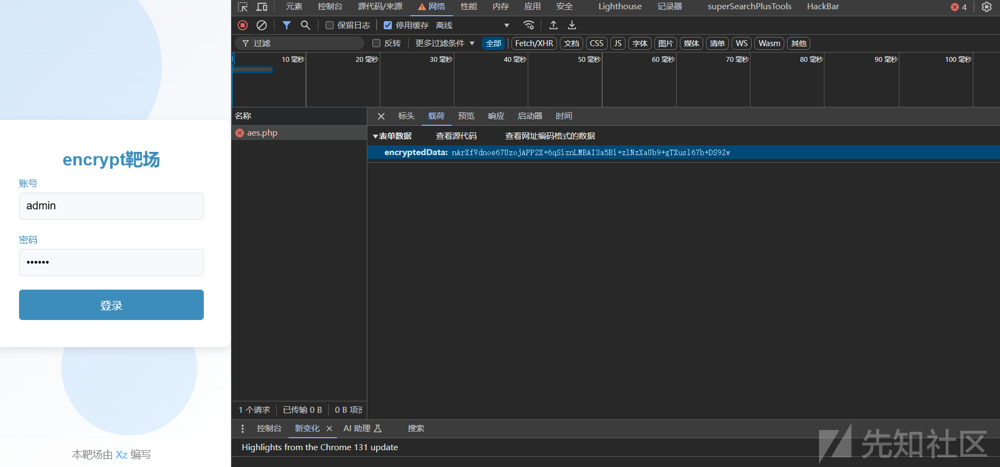

直接跟进js查看，直接在进入位置下断点，再次抓包

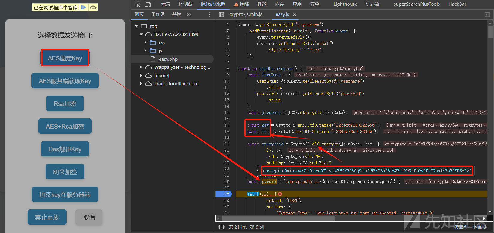

一个断点直接找到加密后的数据和加密前的数据，向上查找，发现是用`AES`加密

```
function sendDataAes(url) {
    const formData = {
        username: document.getElementById("username")
            .value,
        password: document.getElementById("password")
            .value
    };
    const jsonData = JSON.stringify(formData);

    const key = CryptoJS.enc.Utf8.parse("1234567890123456");
    const iv = CryptoJS.enc.Utf8.parse("1234567890123456");

    const encrypted = CryptoJS.AES.encrypt(jsonData, key, {
            iv: iv,
            mode: CryptoJS.mode.CBC,
            padding: CryptoJS.pad.Pkcs7
        })
        .toString();
    const params = `encryptedData=${encodeURIComponent(encrypted)}
```

根据断点信息可知:

`AES`加密，`CBC`模式，`PKCS5Padding`

`key:1234567890123456` / `iv:1234567890123456`

##### autoDecoder

配置数据包自动加解密

输入`key` / `iv`，设置`正则表达式`，正确设置`正则表达式`之后才可以实现自动解密 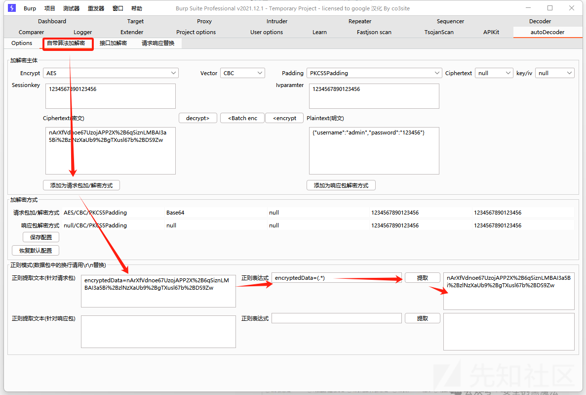

配置需要加解密的域名

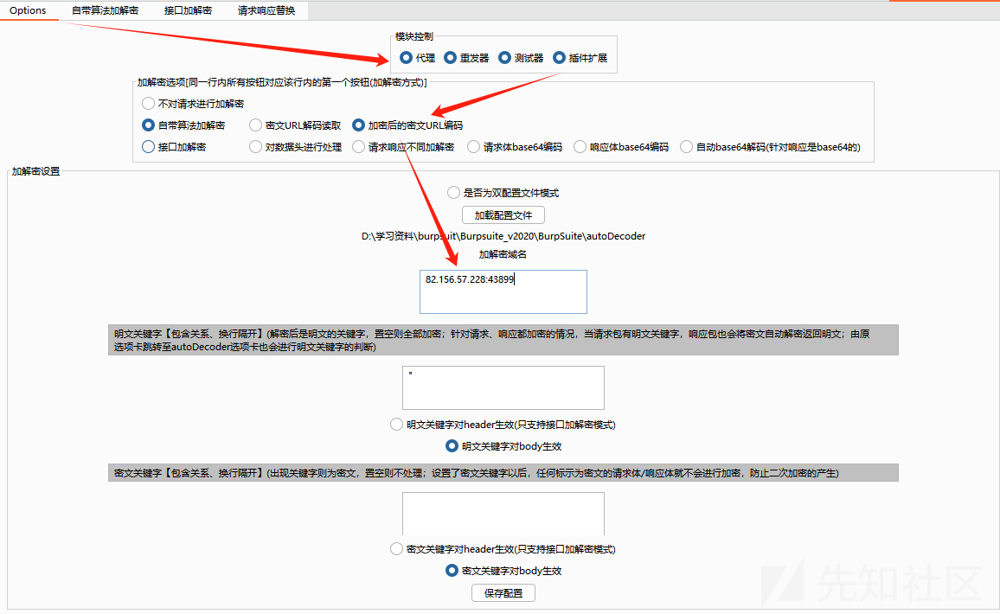

尝试重放

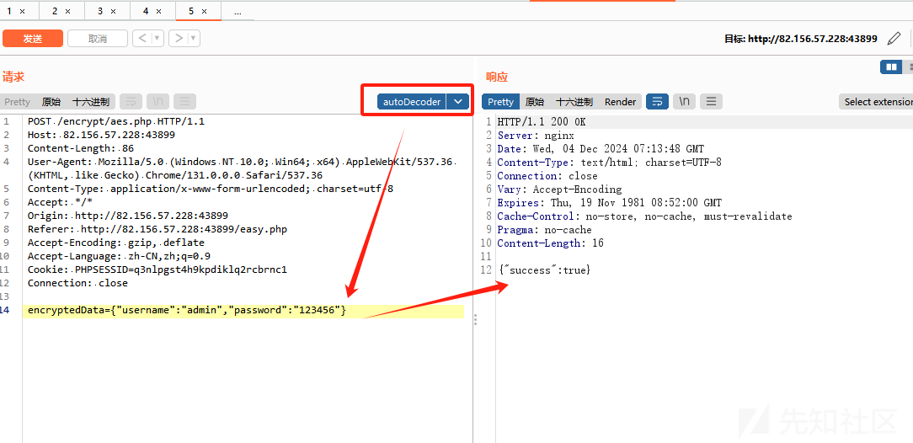

#### 【第二关】AES服务端获取Key

点击第二关抓包，可以获取到两个数据包，一个是服务端返回的`key`和`iv`，一个是登录数据包

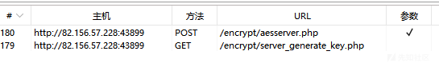

经过测试发现，重发数据包该`key`和`iv`，发现`key`和`iv`短时间内不会发生变化，应该是服务端和客户端断连之前，`key`和`iv`都会保持不变

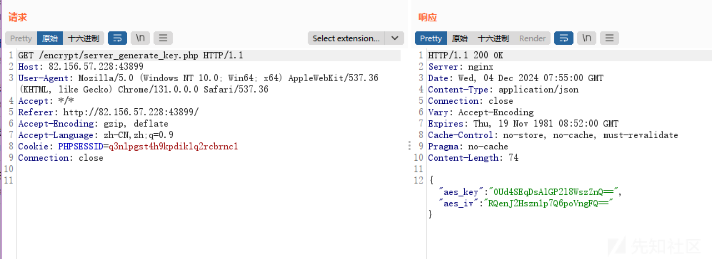

`{"aes_key":"OUd4SEqDsA1GP2l8WszZnQ==","aes_iv":"RQenJ2Hszn1p7Q6poVngFQ=="}`

查看js数据,确定为`AES`加密

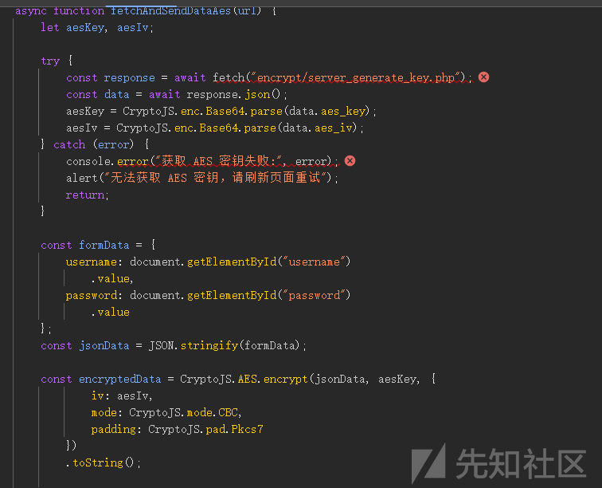

##### autoDecoder

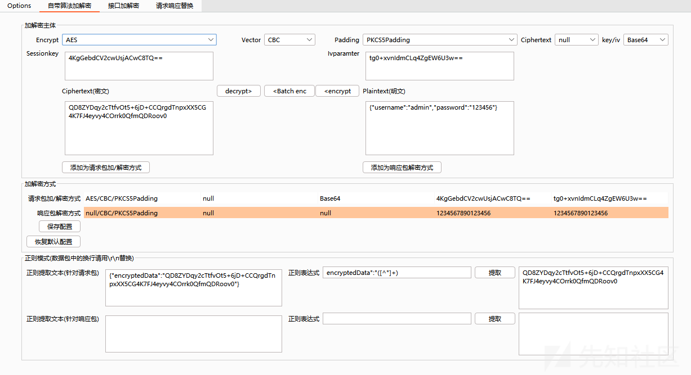

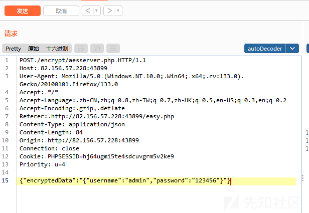

#### 【第三关】RSA加密

抓包查看：加密参数是`data`

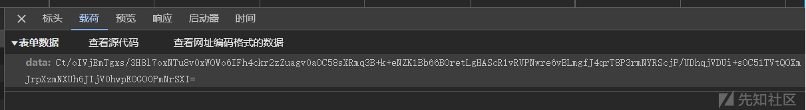

进入`eazy.js`下断点，往上查看，很容易获取到了`publickey`

```
-----BEGIN PUBLIC KEY-----
MIGfMA0GCSqGSIb3DQEBAQUAA4GNADCBiQKBgQDRvA7giwinEkaTYllDYCkzujvi
NH+up0XAKXQot8RixKGpB7nr8AdidEvuo+wVCxZwDK3hlcRGrrqt0Gxqwc11btlM
DSj92Mr3xSaJcshZU8kfj325L8DRh9jpruphHBfh955ihvbednGAvOHOrz3Qy3Cb
ocDbsNeCwNpRxwjIdQIDAQAB
-----END PUBLIC KEY-----
```

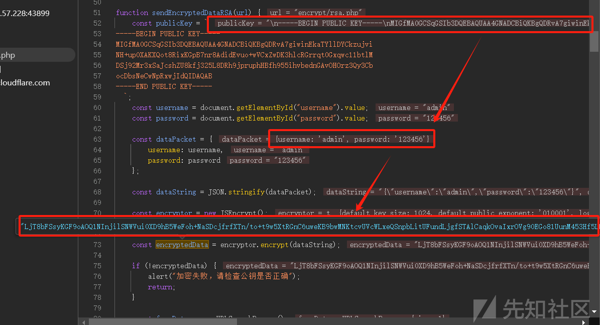

经确认为`RSA`加密，`RSA`加密需一个公钥，解密需要私钥，没有私钥，只能尝试加密

##### autoDecoder

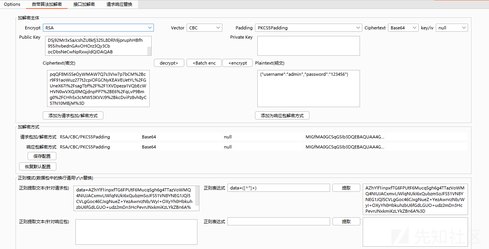

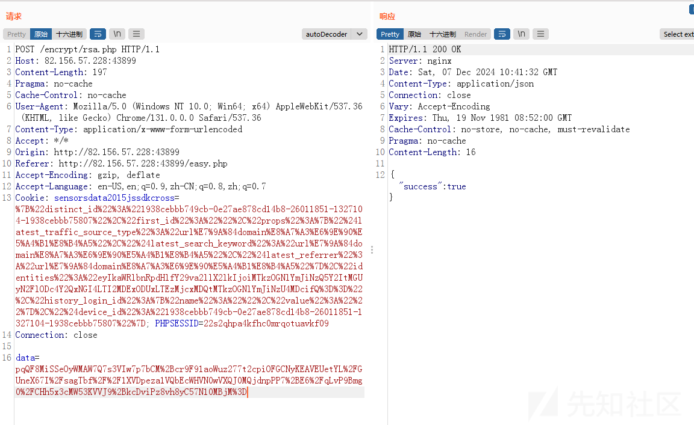

#### 【第四关】AES+Rsa加密

抓包查看 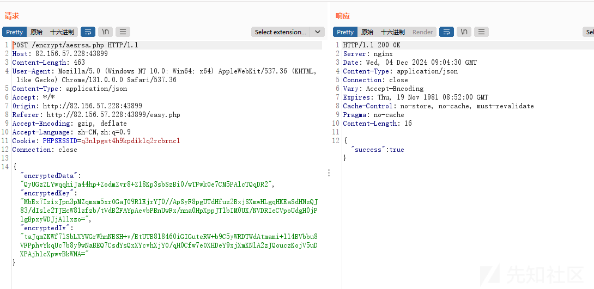 下断点往上查看

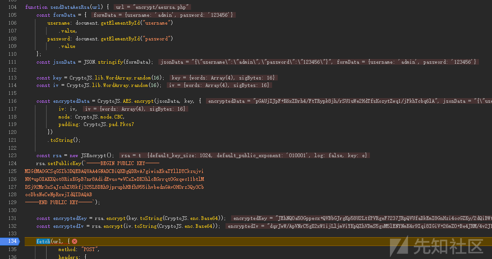

```
function sendDataAesRsa(url) {
    const formData = {
        username: document.getElementById("username")
            .value,
        password: document.getElementById("password")
            .value
    };
    const jsonData = JSON.stringify(formData);

    const key = CryptoJS.lib.WordArray.random(16);
    const iv = CryptoJS.lib.WordArray.random(16);

    const encryptedData = CryptoJS.AES.encrypt(jsonData, key, {
            iv: iv,
            mode: CryptoJS.mode.CBC,
            padding: CryptoJS.pad.Pkcs7
        })
        .toString();

    const rsa = new JSEncrypt();
    rsa.setPublicKey(`-----BEGIN PUBLIC KEY-----
MIGfMA0GCSqGSIb3DQEBAQUAA4GNADCBiQKBgQDRvA7giwinEkaTYllDYCkzujvi
NH+up0XAKXQot8RixKGpB7nr8AdidEvuo+wVCxZwDK3hlcRGrrqt0Gxqwc11btlM
DSj92Mr3xSaJcshZU8kfj325L8DRh9jpruphHBfh955ihvbednGAvOHOrz3Qy3Cb
ocDbsNeCwNpRxwjIdQIDAQAB
-----END PUBLIC KEY-----`);

    const encryptedKey = rsa.encrypt(key.toString(CryptoJS.enc.Base64));
    const encryptedIv = rsa.encrypt(iv.toString(CryptoJS.enc.Base64));
```

被加密的参数是`formData`也就是`"{"username":"admin","password":"123456"}"`，经过`AES`加密，且加密使用的`key`和`iv`是16位随机数、得到`encryptedData`

之后对`key`和`iv`进行`rsa`加密得到`encryptedKey`和`encryptedIv`

再将这三个参数传入数据包中，发包进行验证

现在想办法将随机16位的`key`和`iv`进行固定，右键选择替换内容，使用本地替换的方式将`key`和`iv`固定下来，就选择之前第一关的`key`和`iv`即可

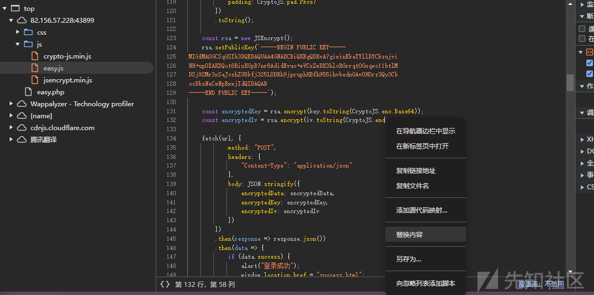

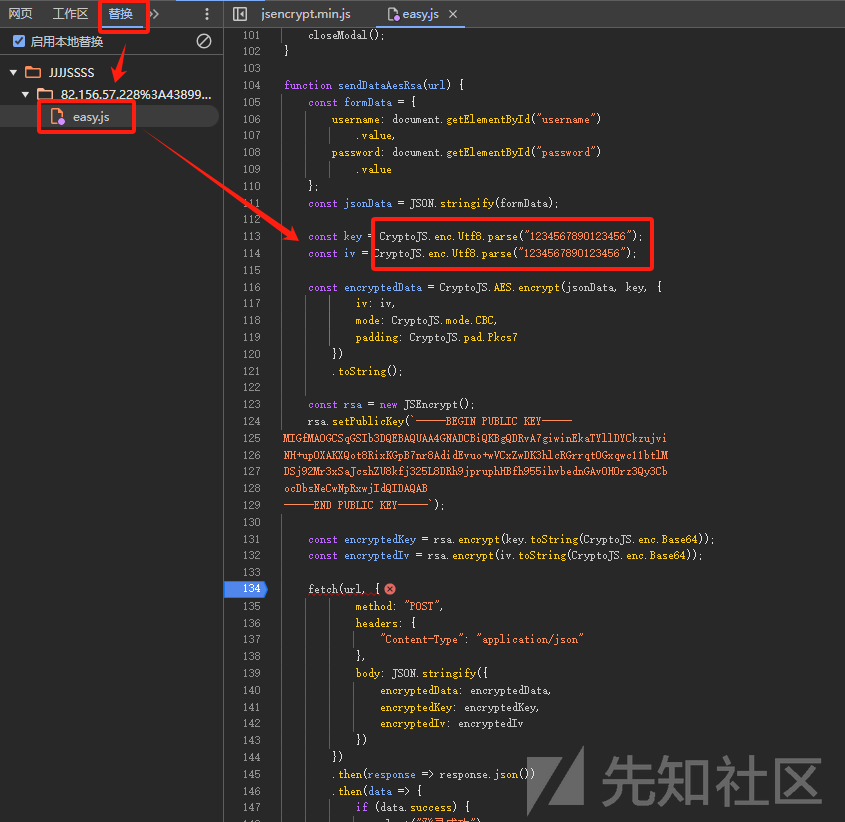

再次下断点，查看是否修改成功，可以看到已经修改成功，`key`和`iv`变成了`1234567890123456`

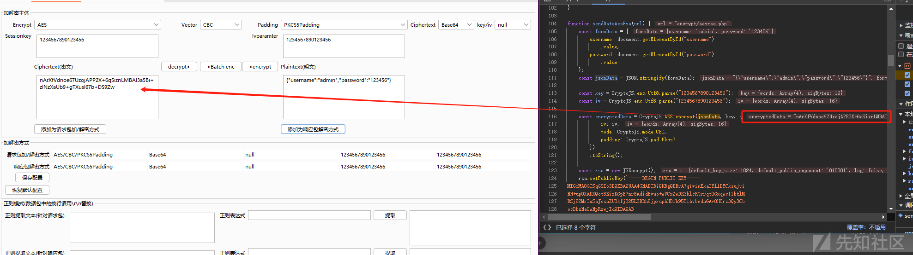

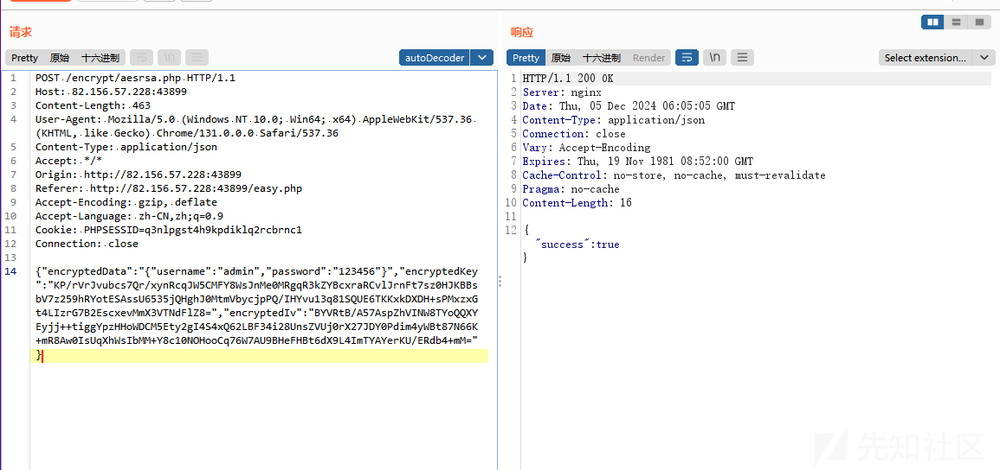

成功替换`encryptedData`，其中加密的`key`和`iv`经过测试似乎不用替换也能通过，就不进行加解密操作了

#### 【第五关】Des规律Key

抓包查看，可以看到只对`password`进行了加密

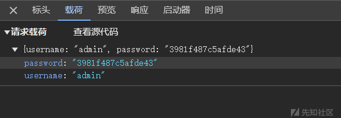 进入`js`下断点抓包

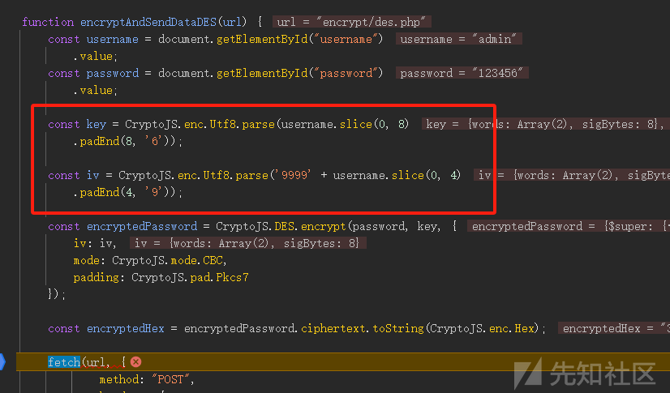 可以看到就是简单的`DES`加密，`key`和`iv`都使用了`username`的值

`key`是八位，如果`username`不满8位，则用6补满

`iv`是八位，9999+username的前四位

`key：admin666 iv：9999admi`

##### autoDecode

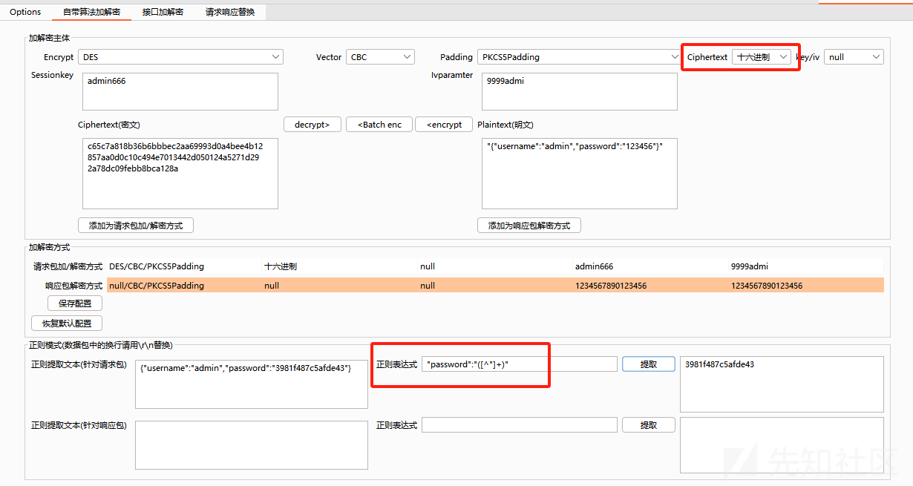 成功解密 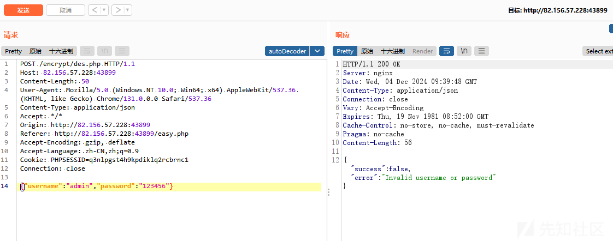

#### 【第六关】明文加签

依旧抓包

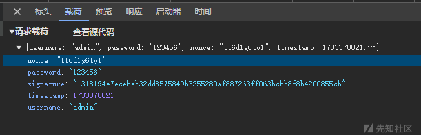

可以看到有两个参数不清楚是啥，分别是`nonce`，`signature，`还有个时间戳，分析下js看看，依旧是js中下断点，发包

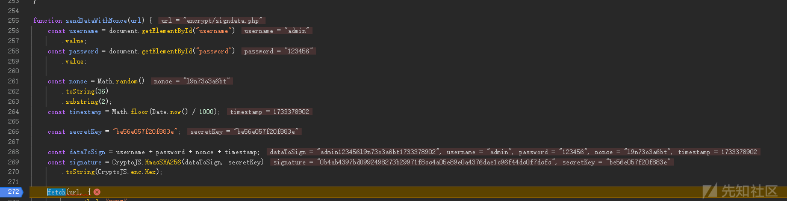

```
function sendDataWithNonce(url) {
    const username = document.getElementById("username")
        .value;
    const password = document.getElementById("password")
        .value;

    const nonce = Math.random()
        .toString(36)
        .substring(2);
    const timestamp = Math.floor(Date.now() / 1000);

    const secretKey = "be56e057f20f883e";

    const dataToSign = username + password + nonce + timestamp;
    const signature = CryptoJS.HmacSHA256(dataToSign, secretKey)
        .toString(CryptoJS.enc.Hex);
```

nonce：由`0-9 a-z`生成的10位随机数

dataToSign：`username + password + nonce + timestamp`

signature：由`dataToSign`经`SHA256`加密生成，`secretKey`为固定值`be56e057f20f883e`

`SHA256`在`autoDecoer`中没有，尝试自写发包器，其中`nonce`可以随机生成也可以固定

```
import requests
import time
import hashlib
import hmac


def generate_signature(username, password, nonce, timestamp, secret_key):
    data_to_sign = username + password + nonce + str(timestamp)
    h = hmac.new(secret_key.encode('utf-8'), digestmod=hashlib.sha256)
    h.update(data_to_sign.encode('utf-8'))
    return h.hexdigest()


url = "http://82.156.57.228:43899/encrypt/signdata.php"
username = "admin"
password = "123456"
nonce = "dq7kos6hzy"
secret_key = "be56e057f20f883e"

while True:
    timestamp = int(time.time())
    signature = generate_signature(username, password, nonce, timestamp, secret_key)
    headers = {
        "Host": "82.156.57.228:43899",
        "Content-Length": "163",
        "User-Agent": "Mozilla/5.0 (Windows NT 10.0; Win64; x64) AppleWebKit/537.36 (KHTML, like Gecko) Chrome/131.0.0.0 Safari/537.36",
        "Content-Type": "application/json",
        "Accept": "*/*",
        "Origin": "http://82.156.57.228:43899",
        "Referer": "http://82.156.57.228:43899/easy.php",
        "Accept-Encoding": "gzip, deflate",
        "Accept-Language": "zh-CN,zh;q=0.9",
        "Cookie": "PHPSESSID=q3nlpgst4h9kpdiklq2rcbrnc1",
        "Connection": "close"
    }
    data = {
        "username": username,
        "password": password,
        "nonce": nonce,
        "timestamp": timestamp,
        "signature": signature
    }
    response = requests.post(url, json=data, headers=headers)
    print(response.status_code)
    print(response.text)
    time.sleep(1)  # 发包间隔
```

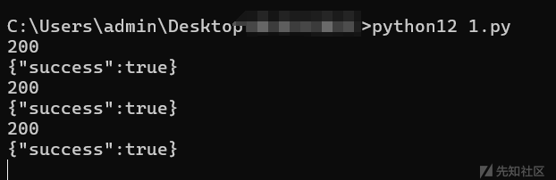

#### 【第七关】加签key在服务端

依旧抓包，发送了俩数据包

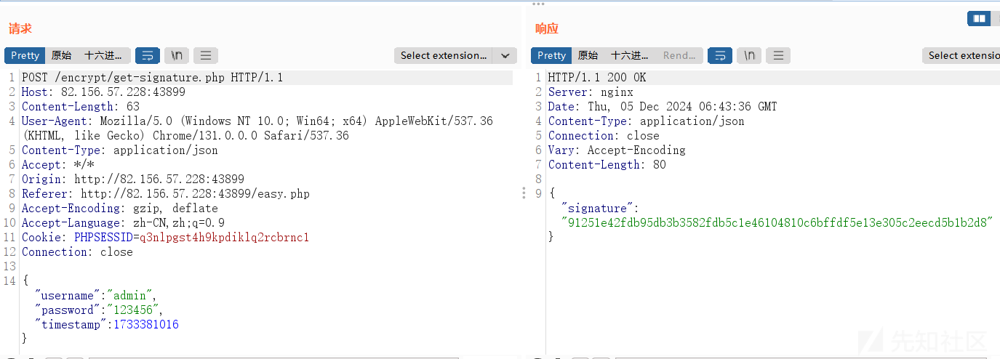

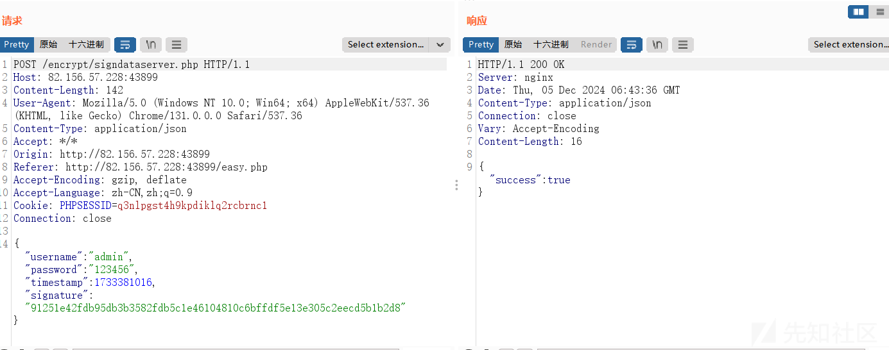

通过第一个数据包获取`signature`，第二个数据包发包时加上这个，达到加签key在服务端的效果

emmm测试了下，如果要做密码爆破操作的话，需要发第一个包

获取对应的`signature`值，丢到第二个包中，依旧是自写脚本即可，不难，这里不演示了。

#### 【第八关】禁止重放

还是抓包 账号密码还是明文的，多次重放发现返回`No Repeater`

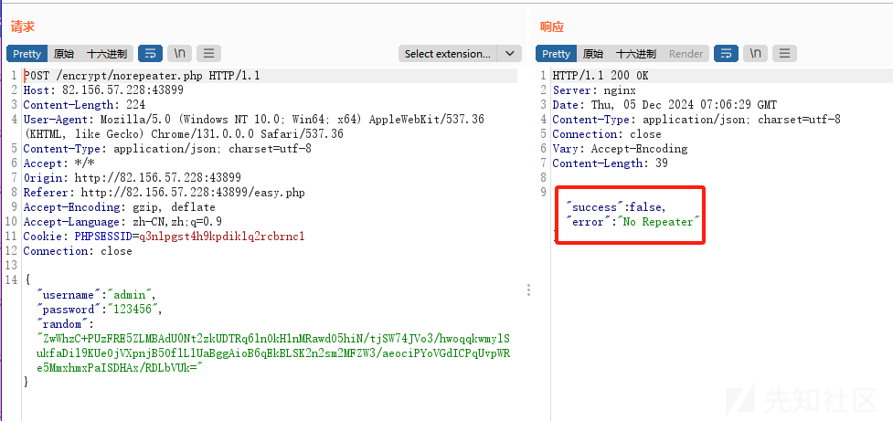

其中加密参数为`random`，分析js看看

依旧是断点，查看

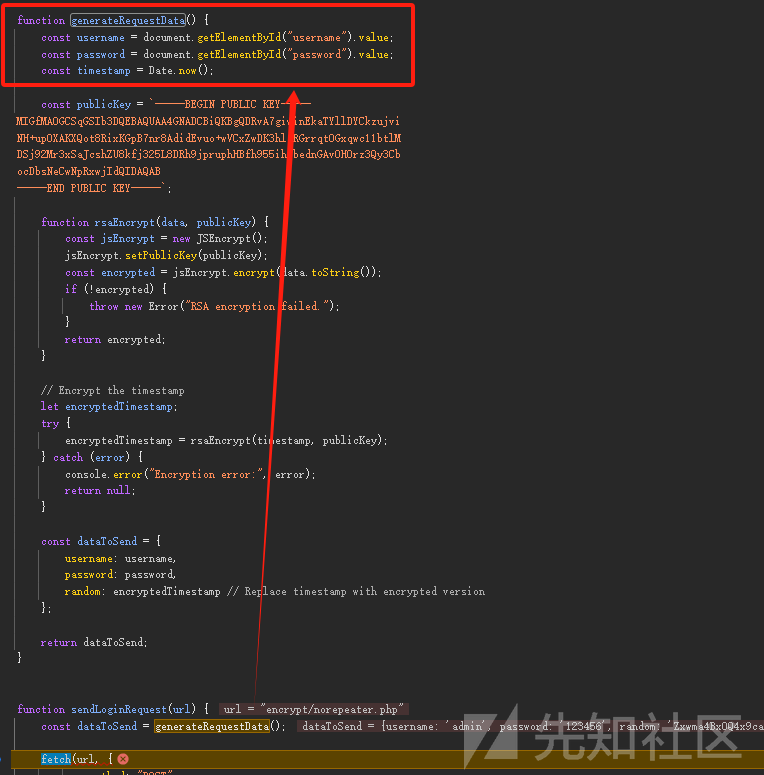

```
function generateRequestData() {
    const username = document.getElementById("username").value;
    const password = document.getElementById("password").value;
    const timestamp = Date.now();

    const publicKey = `-----BEGIN PUBLIC KEY-----
MIGfMA0GCSqGSIb3DQEBAQUAA4GNADCBiQKBgQDRvA7giwinEkaTYllDYCkzujvi
NH+up0XAKXQot8RixKGpB7nr8AdidEvuo+wVCxZwDK3hlcRGrrqt0Gxqwc11btlM
DSj92Mr3xSaJcshZU8kfj325L8DRh9jpruphHBfh955ihvbednGAvOHOrz3Qy3Cb
ocDbsNeCwNpRxwjIdQIDAQAB
-----END PUBLIC KEY-----`;

    function rsaEncrypt(data, publicKey) {
        const jsEncrypt = new JSEncrypt(); 
        jsEncrypt.setPublicKey(publicKey);
        const encrypted = jsEncrypt.encrypt(data.toString());
        if (!encrypted) {
            throw new Error("RSA encryption failed.");
        }
        return encrypted;
    }

    // Encrypt the timestamp
    let encryptedTimestamp;
    try {
        encryptedTimestamp = rsaEncrypt(timestamp, publicKey);
    } catch (error) {
        console.error("Encryption error:", error);
        return null;
    }

    const dataToSend = {
        username: username,
        password: password,
        random: encryptedTimestamp // Replace timestamp with encrypted version
    };

    return dataToSend;
}


function sendLoginRequest(url) {
    const dataToSend = generateRequestData();unction sendLoginRequest(url) {
    const dataToSend = generateRequestData();

function generateRequestData() {
    const username = document.getElementById("username").value;
    const password = document.getElementById("password").value;
    const timestamp = Date.now();
```

现在是要寻找`random`参数怎么来的,根据上面js可知是通过`encryptedTimestamp`来的，`encryptedTimestamp`是通过时间戳经过`RSA`加密来的

依旧写一个发包器来实现

```
import requests
import json
from Crypto.PublicKey import RSA
from Crypto.Cipher import PKCS1_v1_5
from Crypto.Cipher import AES
from Crypto.Util.Padding import pad
from base64 import b64encode, b64decode
import time


def rsa_encrypt(data, public_key):
    """
    RSA加密，Base64格式
    """
    key = RSA.import_key(public_key)
    cipher = PKCS1_v1_5.new(key)
    encrypted_data = cipher.encrypt(data.encode('utf-8'))
    return b64encode(encrypted_data).decode('utf-8')


def generate_request_data():
    """
    生成random字段
    """
    username = "admin"
    password = "123456"
    timestamp = str(int(round(time.time() * 1000)))  # 时间戳
    print(timestamp)

    public_key = """-----BEGIN PUBLIC KEY-----\nMIGfMA0GCSqGSIb3DQEBAQUAA4GNADCBiQKBgQDRvA7giwinEkaTYllDYCkzujvi
NH+up0XAKXQot8RixKGpB7nr8AdidEvuo+wVCxZwDK3hlcRGrrqt0Gxqwc11btlM
DSj92Mr3xSaJcshZU8kfj325L8DRh9jpruphHBfh955ihvbednGAvOHOrz3Qy3Cb
ocDbsNeCwNpRxwjIdQIDAQAB\n-----END PUBLIC KEY-----"""

    encrypted_timestamp = rsa_encrypt(timestamp, public_key)
    data_to_send = {
        "username": username,
        "password": password,
        "random": encrypted_timestamp
    }
    print(data_to_send)
    return data_to_send


def send_request():

    url = "http://82.156.57.228:43899/encrypt/norepeater.php"
    headers = {
        "Host": "82.156.57.228:43899",
        "Content-Length": "224",
        "User-Agent": "Mozilla/5.0 (Windows NT 10.0; Win64; x64) AppleWebKit/537.36 (KHTML, like Gecko) Chrome/131.0.0.0 Safari/537.36",
        "Content-Type": "application/json; charset=utf-8",
        "Accept": "*/*",
        "Origin": "http://82.156.57.228:43899",
        "Referer": "http://82.156.57.228:43899/easy.php",
        "Accept-Encoding": "gzip, deflate",
        "Accept-Language": "zh-CN,zh;q=0.9",
        "Connection": "close"
    }
    data = generate_request_data()
    response = requests.post(url, headers=headers, data=json.dumps(data))
    print(response.text)


if __name__ == "__main__":
    while True:  
        send_request()
        time.sleep(5)
```
