# ciscn2024 androidso_re分析-先知社区

> **来源**: https://xz.aliyun.com/news/16357  
> **文章ID**: 16357

---

开局看看apk界面,要求输入flag，入口界面是com.example.re11113.MainActivity


jadx反编译看看源码，看到了legal函数，估计是校验方法

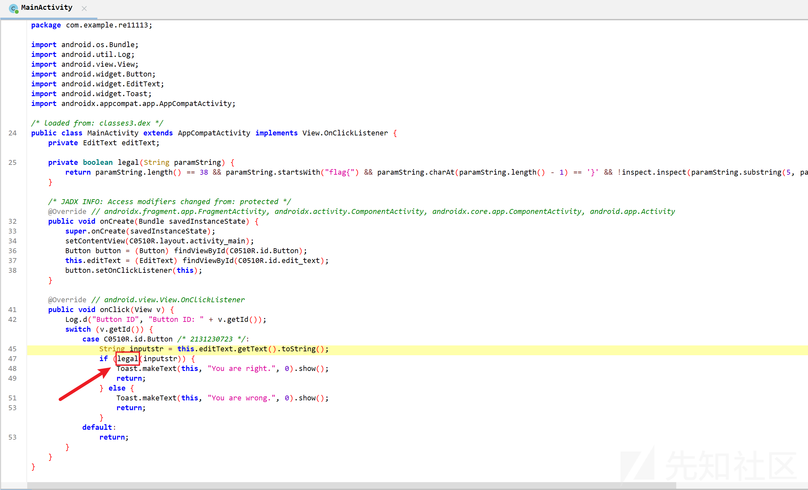

这个legal会校验格式是否为flag{xxxx}，括号里面是32位，并且还会对括号里面的内容使用inspect进行校验

```
private boolean legal(String paramString) {
        return paramString.length() == 38 && paramString.startsWith("flag{") && paramString.charAt(paramString.length() - 1) == '}' && !inspect.inspect(paramString.substring(5, paramString.length() - 1));
    }

```

进入这个inspect函数，发现逻辑很简单，就是调用原生库进行des加密，然后再与"JqslHrdvtgJrRs2QAp+FEVdwRPNLswrnykD/sZMivmjGRKUMVIC/rw=="进行判断。很明显我们只需要通过des解密这个字符串就好了。所以，接着问题的关键就在于iv和key是什么。  
jni.getiv和jni.getkey看着名字就估计是获取iv和key的函数。获取到getiv和getkey的返回值估计就解决了

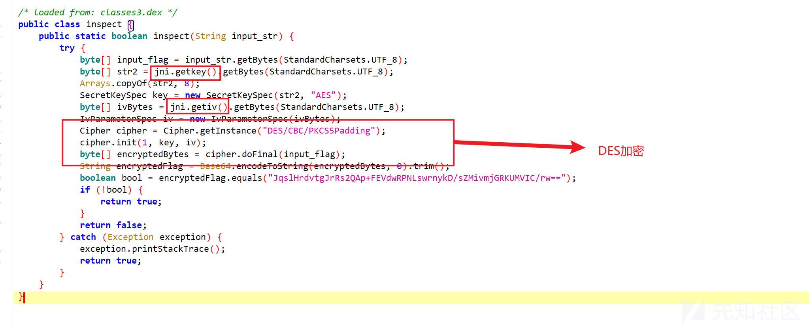

获取getiv和getkey返回值，最容易能想到的就是通过frida hook。代码也很简单

```
function hook_jni() {
    Java.perform(function () {
        var jniClass = Java.use("com.example.re11113.jni");
        jniClass.getiv.implementation = function () {
            var ret = this.getiv();
            console.log("getiv: " + ret);
            return ret;
        }
        jniClass.getkey.implementation = function () {
            var ret = this.getkey();
            console.log("getkey: " + ret);
            return ret;
        }
    })

}
setImmediate(hook_jni);

```

但是hook的时候抽象的事情就发生了。。。注释掉getkey的hook代码，只hook getiv是没问题的  
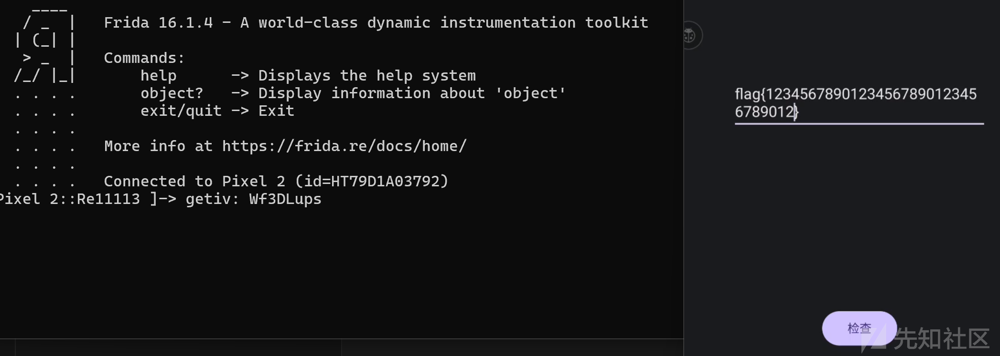  
但是一旦尝试hook getkey就会闪退

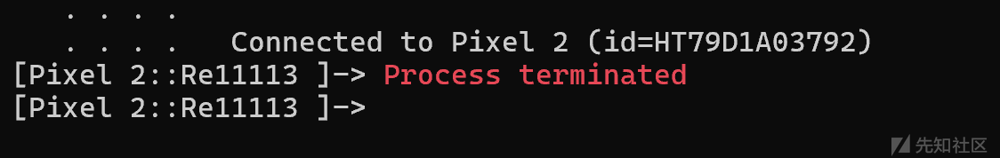

接下来该怎么办。要么解决闪退问题，继续hook，要么硬刚ida反编译的getkey函数中的伪代码，要么使用unidbg模拟安卓环境指向getkey

#### unidbg

先分析一下最简单丝滑的方法——unidbg  
unidbg是一款基于Java的跨平台逆向工具，主要用于模拟执行Android和iOS应用中的 ARM、ARM64、x86 等多种指令集的代码  
<https://github.com/zhkl0228/unidbg>  
这里使用版本0.97  
添加so库，创建相应的MainActivity  
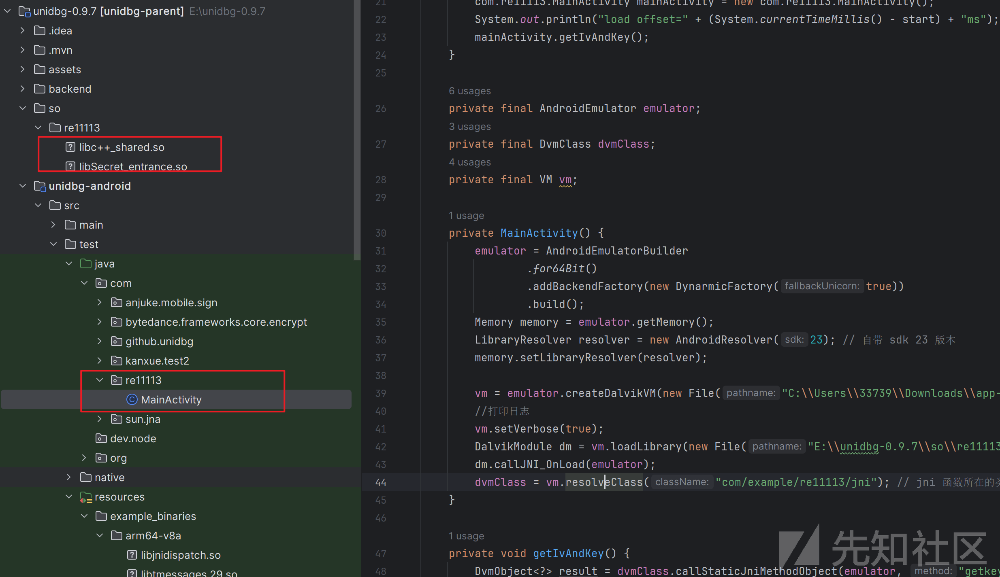

代码如下：

```
package com.re11113;
import com.github.unidbg.AndroidEmulator;
import com.github.unidbg.LibraryResolver;
import com.github.unidbg.arm.backend.DynarmicFactory;
import com.github.unidbg.linux.android.AndroidEmulatorBuilder;
import com.github.unidbg.linux.android.AndroidResolver;
import com.github.unidbg.linux.android.dvm.DalvikModule;
import com.github.unidbg.linux.android.dvm.DvmClass;
import com.github.unidbg.linux.android.dvm.DvmObject;
import com.github.unidbg.linux.android.dvm.VM;
import com.github.unidbg.memory.Memory;
import java.io.File;

public class MainActivity {
    public static void main(String[] args) {
        long start = System.currentTimeMillis();
        com.re11113.MainActivity mainActivity = new com.re11113.MainActivity();
        System.out.println("load offset=" + (System.currentTimeMillis() - start) + "ms");
        mainActivity.getIvAndKey();
    }
    private final AndroidEmulator emulator;
    private final DvmClass dvmClass;
    private final VM vm;
    private MainActivity() {
        emulator = AndroidEmulatorBuilder
                .for64Bit()
                .addBackendFactory(new DynarmicFactory(true))
                .build();
        Memory memory = emulator.getMemory();
        LibraryResolver resolver = new AndroidResolver(23); // 自带 sdk 23 版本
        memory.setLibraryResolver(resolver);
        vm = emulator.createDalvikVM(new File("C:\\Users\\33739\\Downloads\\app-debug (1).apk"));
        //打印日志
        vm.setVerbose(true);
        DalvikModule dm = vm.loadLibrary(new File("E:\\unidbg-0.9.7\\so\\re11113\\libSecret_entrance.so"), true);
        dm.callJNI_OnLoad(emulator);
        dvmClass = vm.resolveClass("com/example/re11113/jni"); // jni 函数所在的类
    }
    private void getIvAndKey() {
        DvmObject<?> result = dvmClass.callStaticJniMethodObject(emulator, "getkey()Ljava/lang/String;");
        System.out.println("result is => " + result.getValue());
        result = dvmClass.callStaticJniMethodObject(emulator, "getiv()Ljava/lang/String;");
        System.out.println("result is => " + result.getValue());
    }
}

```

运行直接就拿下key了

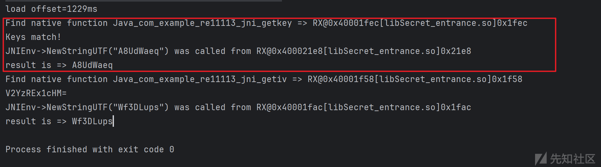

#### frida attach

现在android studio里的logcat中查找闪退的原因，发现问题确实是出现在getkey,logcat中显示输入了非utf-8编码的字符'0x33 0x5c <0xbb> 0x3d 0xf7 0x58 0x7e 0xf5'。  
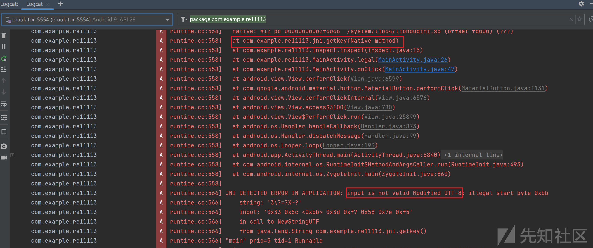

在native中，生成一个utf-8的java字符串使用的是NewStringUTF,下面尝试hook一下这个native层方法

```
function hook_newStringUTF() {
    Java.perform(function () {
        var modules = Process.enumerateModules();
        var newStringUTFAddr = null;
        for (var i = 0; i < modules.length; i++) {
            var module = modules[i];
            try {
                var symbols = module.enumerateSymbols();
                for (var j = 0; j < symbols.length; j++) {
                    if (symbols[j].name.indexOf("NewStringUTF") >= 0) {
                        newStringUTFAddr = symbols[j].address;
                        console.log("Found NewStringUTF in module: " + module.name + " at: " + newStringUTFAddr + " with name: " + symbols[j].name);
                        break;
                    }
                }
            } catch (e) {
                console.warn("Failed to enumerate symbols for module: " + module.name);
            }
            if (newStringUTFAddr) {
                break;
            }
        }
        if (newStringUTFAddr) {
            Interceptor.attach(newStringUTFAddr, {
                onEnter: function(args) {
                    var inputStr = args[1].readCString();
                    console.log("NewStringUTF called with: " + inputStr);
                },
                onLeave: function(retval) {
                    console.log("NewStringUTF returning: " + retval);
                }
            });
        } else {
            console.log("NewStringUTF address not found!");
        }
    });
}

```

发现确实是传了不对的东西。。。  
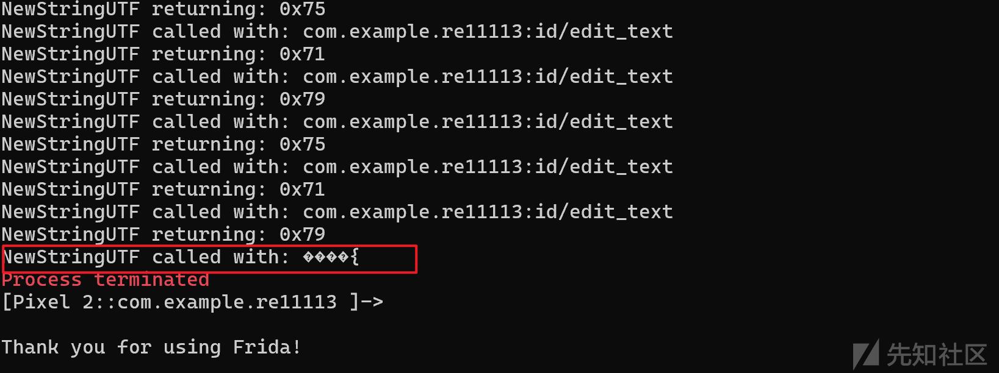

至于为什么，看了网上大佬的文章好像也没得到答案，然后使用了网上大佬的attach方法，即在在主动调用getkey前添加个附加代码，整体如下：

```
function hook() {
    Java.perform(function () {
        let jni = Java.use("com.example.re11113.jni");
        var iv = jni.getiv();
        console.log("IV: "+iv);
        var getKeyBase = Module.findExportByName("libSecret_entrance.so", "Java_com_example_re11113_jni_getkey");
        console.log("getkey base: " + getKeyBase);
        Interceptor.attach(getKeyBase, {
            onEnter: function(args) {
            },
            onLeave: function(retval) {
            }
        });
        var key = jni.getkey();
        console.log("Key: " + key);
    })
}

```

但是还是闪退崩溃了。。抽象。。可能是环境不同吧，我这里安卓10，pixel2  
emm.... 莫名其妙想到了用objection附加看看，结果行了。。。。。。

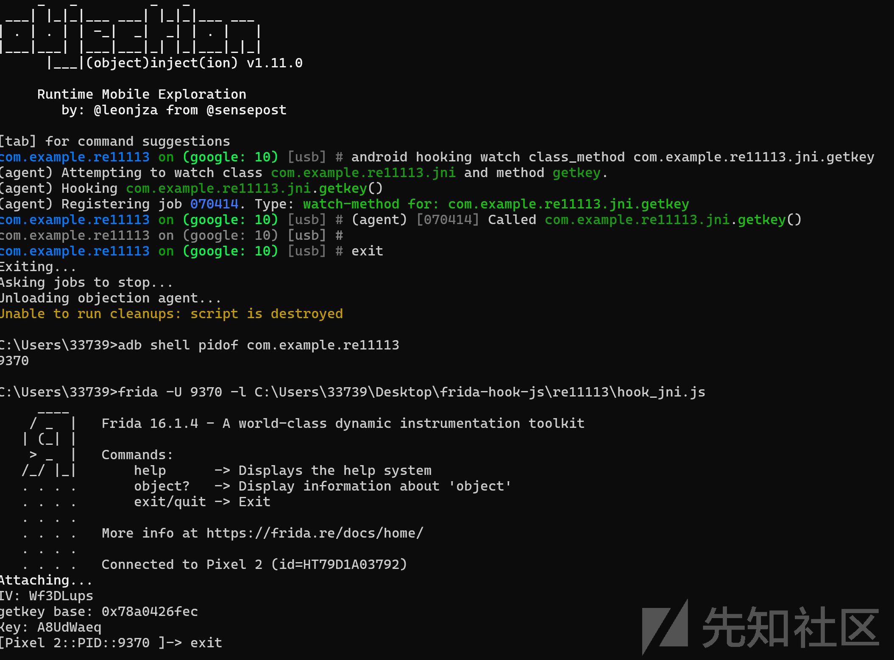

太菜了，不是很懂

#### so分析

直接分享so中的getkey汇编或者伪代码也不是特别复杂

先从返回值入手，  
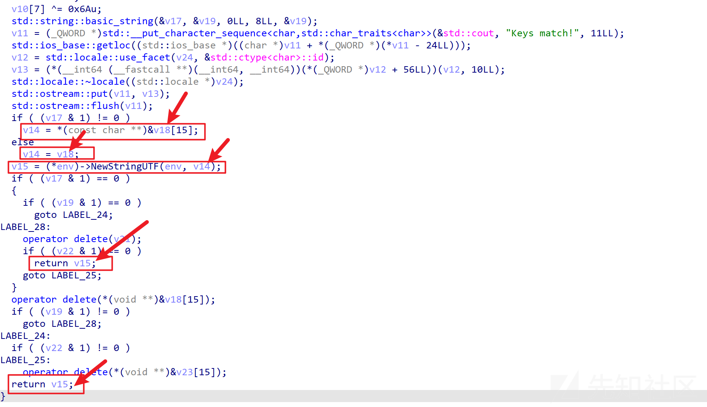  
返回值v15被赋值成了java字符串，这个java字符串使用v14转化的，然后又从v14往上找到v18

查看交叉引用，发现v18为"YourRC4Key"

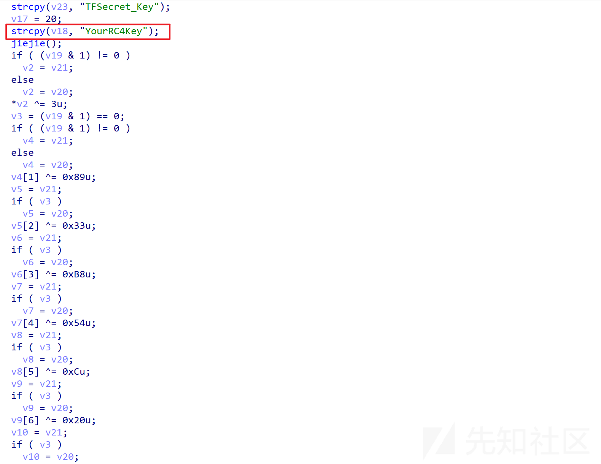

v18在下面有没有做什么处理呢？  
根据上面的"TFSecret\_Key"和"YourRC4Key"猜一手jiejie函数是RC4加密，而这个"YourRC4Key"是密钥  
进入jiejie小看一下  
这段使用std::vector创建了一个存储 256 个整数的容器，并用一些初始值填充它。估计是s盒初始化

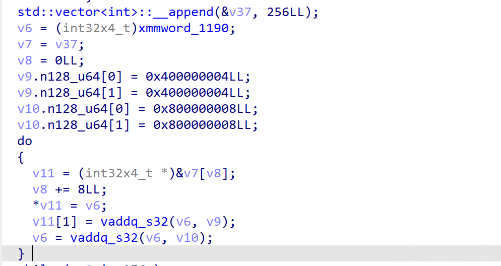  
这部分应该就是s盒置换了

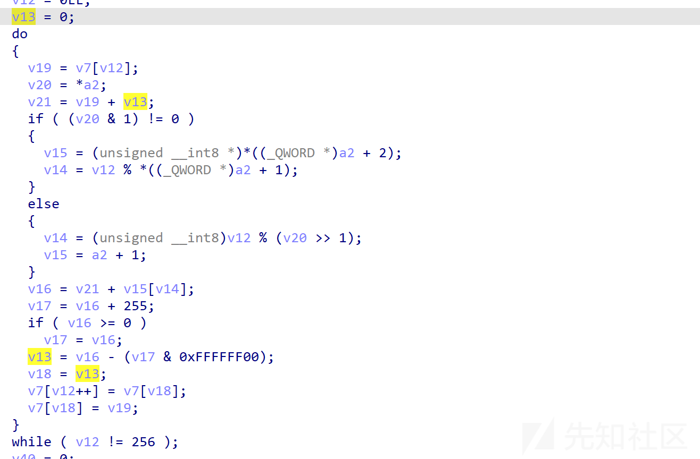  
这里应该就是从s盒中取值进行计算了

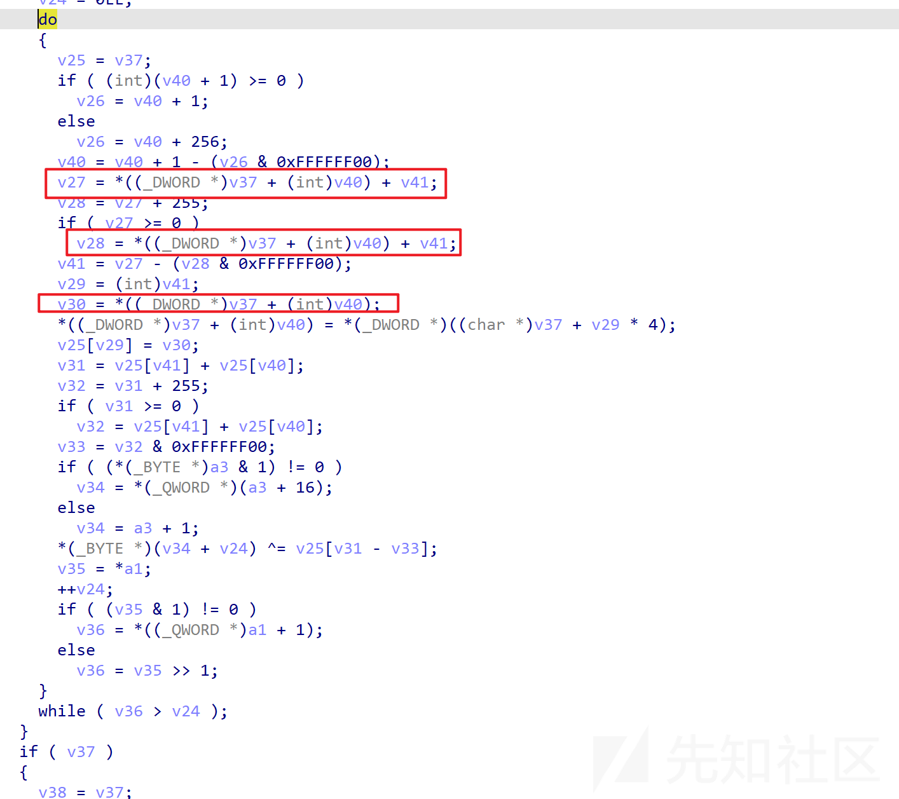

退出jiejie函数，发现下面这一坨好像是对字符串的前八位进行异或操作。但是进行异或操作的变量是v20或者v21，现在要确定他们跟v18是否指向同一块地址

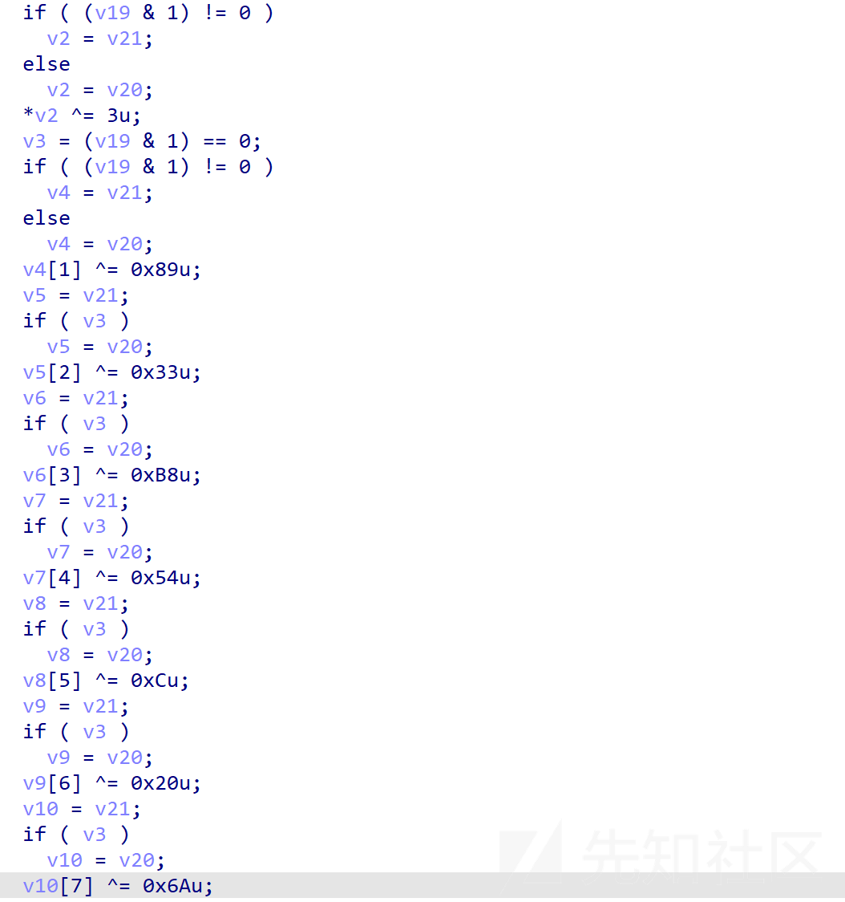

查看汇编代码，发现异或运行确实是对v18指向的地址进行的

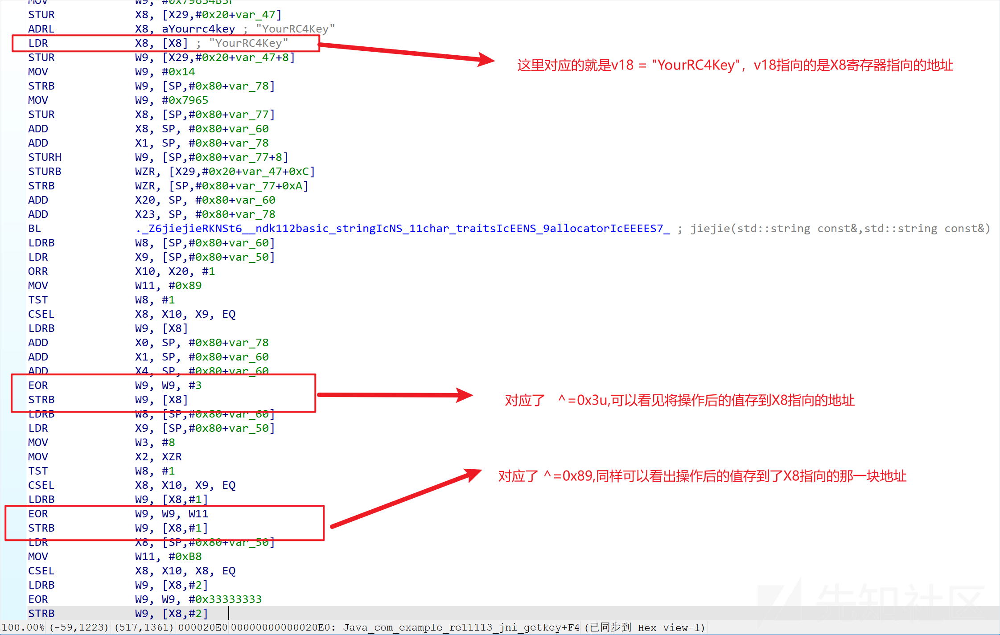

所以getkey最后的返回结果就是先进行RC4加密再取前八位进行异或操作得到的字符串，

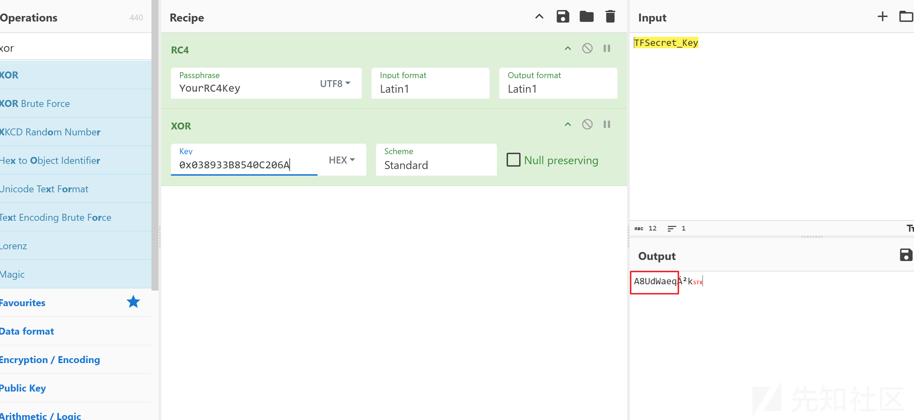  
这个A8UdWaeq即为返回结果

#### 最终结果及解决

最终得到的iv是Wf3DLups，key是A8UdWaeq  
直接des解密即可

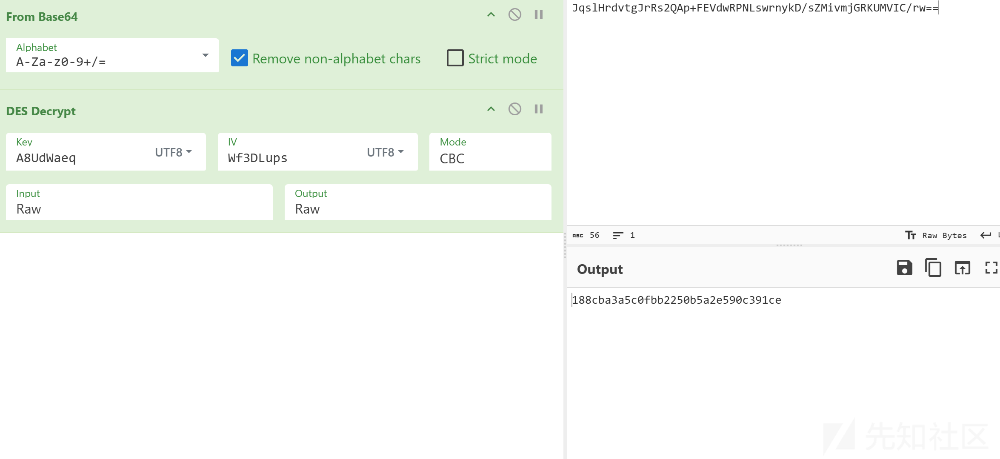

总结一下，这道题实际上不难，但是用frida hook getkey的时候会崩溃闪退，还是很搞心态的。分析一下也能扩展思路，还是很有帮助

#### 参考文章

<https://orangestarone.github.io/2024/06/23/2024CISCNandroidso-re/index.html>  
<https://blog.node189.top/posts/androidso_re/>  
<https://bbs.kanxue.com/thread-281916.htm?style=1>
