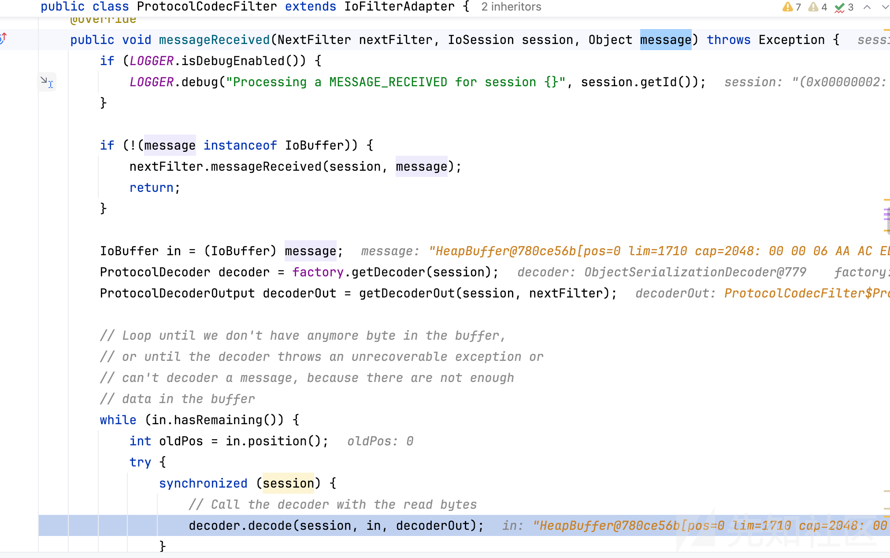
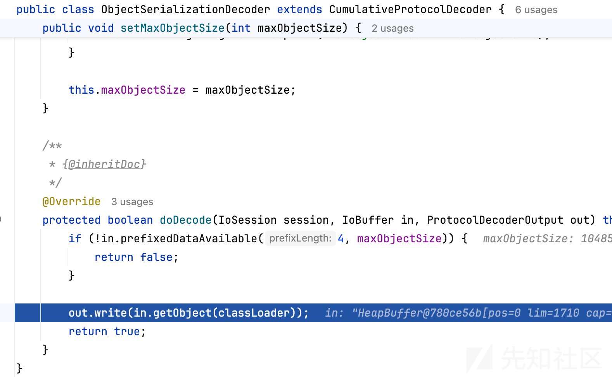
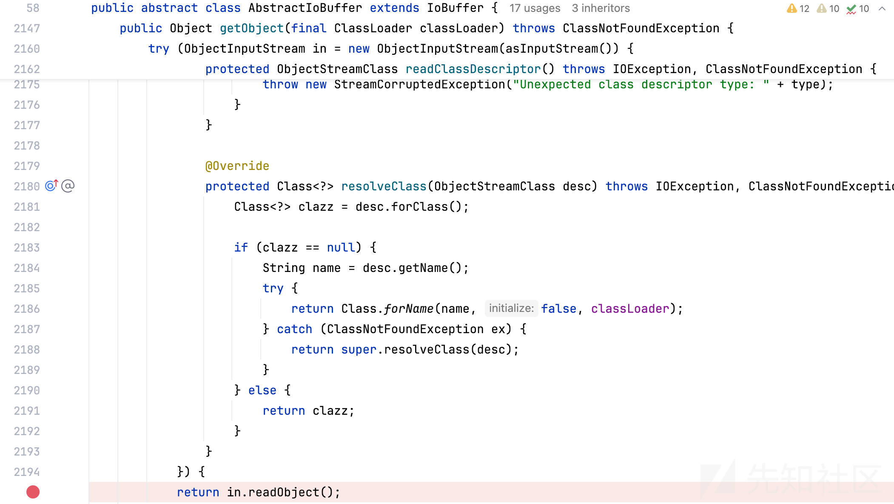
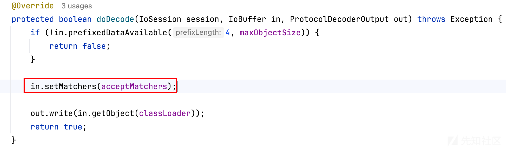
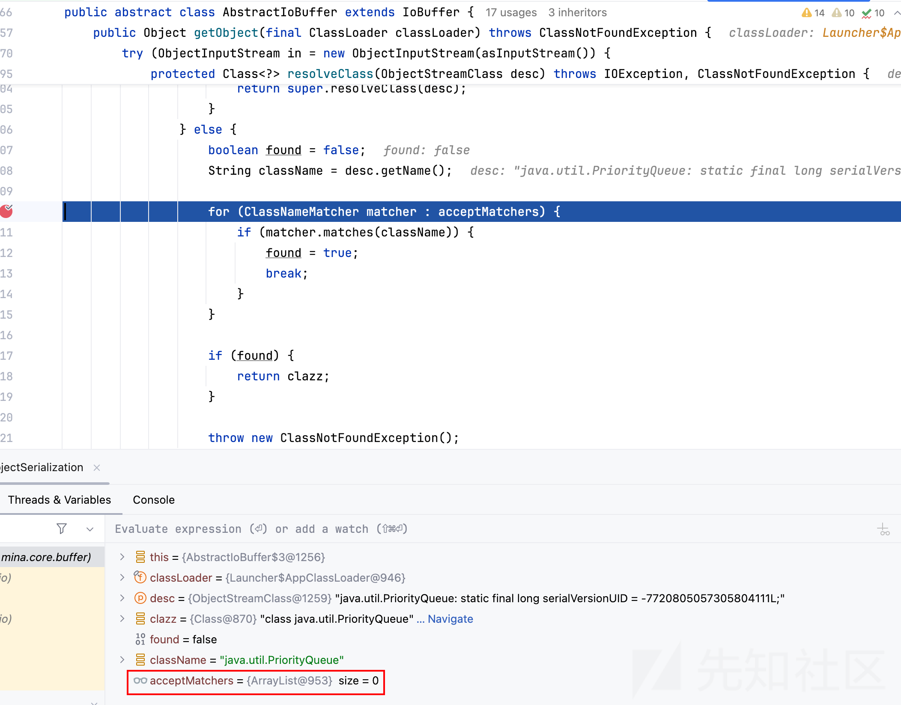

# Apache mina CVE-2024-52046漏洞分析复现-先知社区

> **来源**: https://xz.aliyun.com/news/16360  
> **文章ID**: 16360

---

简单看看apache mina这个洞，比较简单，师傅们多包涵

**CVE-2024-52046**

**影响版本**：

Apache MINA 2.0.X < 2.0.27

Apache MINA 2.1.X < 2.1.10

Apache MINA 2.2.X < 2.2.4

> 该漏洞仅在应用程序使用 IoBuffer#getObject() 方法,并通过ProtocolCodecFilter和ObjectSerializationCodecFactory进行数据处理时才会受到影响

**分析复现**

使用github上的2.0.26版本，<https://github.com/apache/mina/releases/tag/2.0.26>

创建一个server和client环境

MinaClient

```
package org.apache.mina;

import org.apache.mina.core.future.ConnectFuture;
import org.apache.mina.core.service.IoConnector;
import org.apache.mina.core.session.IoSession;
import org.apache.mina.filter.codec.ProtocolCodecFilter;
import org.apache.mina.filter.codec.serialization.ObjectSerializationCodecFactory;
import org.apache.mina.transport.socket.nio.NioSocketConnector;
import java.net.InetSocketAddress;

public class MinaClient {
    public static void main(String[] args) throws Exception {
        IoConnector connector = new NioSocketConnector();

        // 设置处理器
        connector.setHandler(new ClientHandler());

        // 设置编解码器
        connector.getFilterChain().addLast("codec",
                new ProtocolCodecFilter(new ObjectSerializationCodecFactory()));

        // 连接到服务器
        ConnectFuture future = connector.connect(new InetSocketAddress("localhost", 8080));
        future.awaitUninterruptibly();

        IoSession session = future.getSession();

        session.write(<恶意Object>);

        // 等待关闭连接
        session.getCloseFuture().awaitUninterruptibly();
        connector.dispose();
    }

}

class ClientHandler extends org.apache.mina.core.service.IoHandlerAdapter {
    @Override
    public void messageReceived(IoSession session, Object message) throws Exception {
        System.out.println("Client received message: " + message);
    }

    @Override
    public void exceptionCaught(IoSession session, Throwable cause) throws Exception {
        cause.printStackTrace();
    }
}

```

MinaServer

```
import org.apache.mina.core.service.IoAcceptor;
import org.apache.mina.core.session.IdleStatus;
import org.apache.mina.core.session.IoSession;
import org.apache.mina.filter.codec.ProtocolCodecFilter;
import org.apache.mina.filter.codec.serialization.ObjectSerializationCodecFactory;
import org.apache.mina.transport.socket.nio.NioSocketAcceptor;

import java.net.InetSocketAddress;

public class MinaServer {
    public static void main(String[] args) throws Exception {
        IoAcceptor acceptor = new NioSocketAcceptor();

        // 设置处理器
        acceptor.setHandler(new ServerHandler());

        // 设置编解码器
        acceptor.getFilterChain().addLast("codec",
                new ProtocolCodecFilter(new ObjectSerializationCodecFactory()));

        // 绑定端口
        acceptor.bind(new InetSocketAddress(8080));
        System.out.println("Server started at port 8080");
    }
}

class ServerHandler extends org.apache.mina.core.service.IoHandlerAdapter {
    @Override
    public void messageReceived(IoSession session, Object message) throws Exception {
        System.out.println("Received message: " + message);
        // 回复消息
        session.write("Echo: " + message);
    }

    @Override
    public void exceptionCaught(IoSession session, Throwable cause) throws Exception {
        cause.printStackTrace();
    }
}

```

开启server，使用client向server发送序列化数据，由于解码器为ProtocolCodecFilter和ObjectSerializationCodecFactory，server对于接受的message会自动进行反序列化处理



在ObjectSerializationDecoder#doDecode处执行getObject



由AbstractIoBuffer#getObject完成反序列化

  


**修复**

修复简单粗暴，2.0.27版本中，反序列化时会检查当前类是否允许，需要手动在ObjectSerializationDecoder设置允许的类，否则默认拒绝所有类




