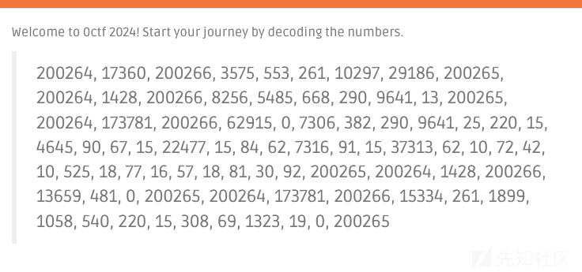
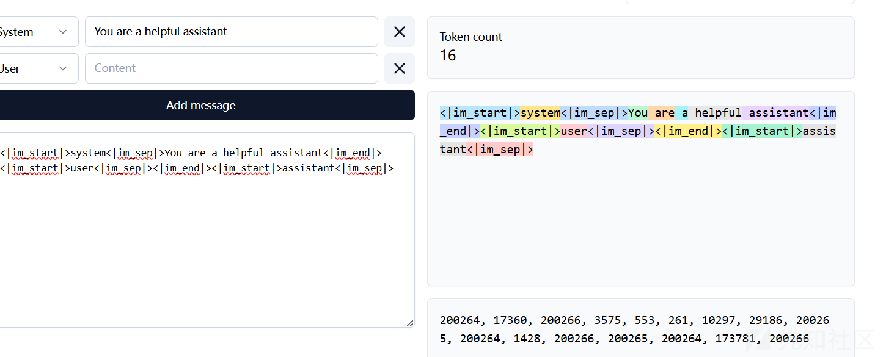
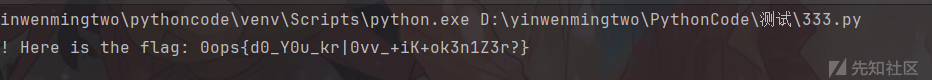
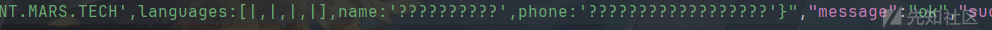

# 0CTF 2024 部分WP-先知社区

> **来源**: https://xz.aliyun.com/news/16362  
> **文章ID**: 16362

---

## Numbers



给了一些数字，搜索发现是 tiktoken 的 token 数量，



不要前面的提示词，只要中间部分即可，模型应该是 GPT-4，对应的编码方式就是 o200k\_base，利用脚本进行解密

```
import tiktoken 

encoding = tiktoken.get_encoding("o200k_base")
print(encoding.decode([62915, 0, 7306, 382, 290, 9641, 25, 220, 15, 4645, 90, 67, 15, 22477, 15, 84, 62, 7316, 91, 15, 37313, 62, 10, 72, 42, 10, 525, 18, 77, 16, 57, 18, 81, 30, 92,]))

```

得到 flag，



## Recruitment

下载源码文件：

```
import base64  
import os  
import secrets  
import subprocess as sp  
import demjson3 as json  
from flask import Flask, render_template, request  
from io import BytesIO  
from PIL import Image  

PROGRAMMING_LANGUAGES = "Python|Java|C|C++|C#|HTML5|CSS3|JavaScript|Ruby|PHP|Swift|Go|Kotlin|Rust|TypeScript|Perl|Dart|Scala|Haskell|Lua|Objective-C|Elixir".lower()  

app = Flask(__name__)  
app.secret_key = secrets.token_hex(32)  

UPLOAD_FOLDER = 'uploads'  
if not os.path.exists(UPLOAD_FOLDER):  
    os.makedirs(UPLOAD_FOLDER)  

app.config['UPLOAD_FOLDER'] = UPLOAD_FOLDER  

FLAG = os.environ.get("FLAG", "flag{test}")  

@app.route('/')  
def index():  
    return render_template('index.html')  

@app.route('/apply')  
def apply():  
    return render_template('apply.html')  

@app.route('/api/submit', methods=['POST'])  
def submit():  
    if 'file' not in request.form:  
        return 'No file part', 400  
    file_data = request.form['file']  
    if file_data == '':  
        return 'No selected file', 400  
    if (len(file_data) > 20000):  
        return 'Too big', 400  
    file_data = file_data.split(",")[1]  

    image = Image.open(BytesIO(base64.b64decode(file_data)))  
    img_filename = secrets.token_hex(16) + '.png'  
    img_filepath = os.path.join(app.config['UPLOAD_FOLDER'], img_filename)  
    image.save(img_filepath)  
    decode(img_filepath)  

    result_filepath = img_filepath + '.json'  
    decode_result = json.decode_file(result_filepath, encoding='utf-8')  
    if (not decode_result['success']):  
        raise Exception("Error")  

    code_matrix = str(decode_result['codeMatrix'])  
    code_result = str(decode_result['codeResult'])  
    check_qrcode(code_matrix)  
    check_result(code_result)  

    return FLAG, 200  

def check_result(decode_result):  
    data = json.decode(decode_result)  

    # Confirmation of identity  
    # On Mars, we use a novel writing system.    
    # Fortunately, these characters are all included in the Unicode system on Earth.    
    assert data['name'] == "滌漾火珈豆谷欝寵齦棧"  
    assert data['email'] == "ĄąŁęțÿżÀÁćæçöśű@POD-ASIA.RECRUITMENT.MARS.TECH"  
    assert data['phone'] == "껪ㇴ㍂舘덃駱縷긭ㇼ蘭㍑糧곀뇂㍅㋗懲궒"  

    # Language check  
    # Python is important and should not be listed at the last place.    for lang in data['languages']:  
        assert len(str(lang)) > 0  
        assert str(lang).lower() in PROGRAMMING_LANGUAGES  
    assert data['languages'][3] != "Python"  

def check_qrcode(code_matrix):  
    bit_matrix = [  
        [  
            int(pixel) for pixel in line  
        ]  
        for line in code_matrix.strip('\n').split('\n')  
    ]  

    # Compliance check  
    dimension = len(bit_matrix)  
    for line in bit_matrix:  
        assert len(line) == dimension  

    # Our printer's precision is terrible.  
    # So, the QR code version cannot be too high.    
    assert dimension <= (7 * 4 + 17)  

    # Our printer is experiencing issues with ink flow.  
    # Must use the highest error correction level.    
    assert bit_matrix[8][0] == 0  
    assert bit_matrix[8][1] == 0  
    assert bit_matrix[dimension - 1][8] == 0  
    assert bit_matrix[dimension - 2][8] == 0  

def decode(filepath):  
    try:  
        cmd = ['java', '-jar', 'zxing-test-1.0-SNAPSHOT.jar'] + [filepath]  
        p = sp.Popen(cmd, stdout=sp.PIPE, stderr=sp.STDOUT, universal_newlines=False)  
        p.wait()  
        if (p.returncode != 0):  
            raise Exception("Error")  
    except OSError as e:  
        raise Exception("Could not execute specified Java binary") from e  

if __name__ == '__main__':  
    app.run(debug=False, port=3049)

```

简单看看逻辑，会先在路由 `/apply` 要求输入一些信息，然后生成为一个二维码，而后 `/api/submit` 路由又会对这个二维码进行一些条件判断。先执行 `decode()` 方法把二维码解析为 json 文件，解析后的 json 文件内容如下：

剩下就是对 json 内容进行一个验证，通过后就会返回 flag，

```
check_qrcode(code_matrix)  
check_result(code_result)

```

先看 `check_result` 方法

```
assert data['name'] == "滌漾火珈豆谷欝寵齦棧"  
assert data['email'] == "ĄąŁęțÿżÀÁćæçöśű@POD-ASIA.RECRUITMENT.MARS.TECH"  
assert data['phone'] == "껪ㇴ㍂舘덃駱縷긭ㇼ蘭㍑糧곀뇂㍅㋗懲궒"  


for lang in data['languages']:  
    assert len(str(lang)) > 0  
    assert str(lang).lower() in PROGRAMMING_LANGUAGES  
assert data['languages'][3] != "Python"

```

就是需要内容为其指定的值，然后 `'languages'` 列表元素都在 `PROGRAMMING_LANGUAGES` 中并且第四个元素不能是 `Python`，

继续看 `check_qrcode` 方法，

```
assert dimension <= (7 * 4 + 17)  

assert bit_matrix[8][0] == 0  
assert bit_matrix[8][1] == 0  
assert bit_matrix[dimension - 1][8] == 0 
assert bit_matrix[dimension - 2][8] == 0

```

对二维码的尺寸有一个限制，还需要满足这些特定位置的值为 0。

现在我们先满足 `check_qrcode` 条件，了解到二维码尺寸和生成二维码的版本有关，公式为 `21+(n−1)×4`，所以这里生成二维码就选择版本 7 即可满足尺寸要求。结合上面的 json 数据简单写一个生成二维码的 java 脚本：

```
package org.example;  

import com.google.zxing.BarcodeFormat;  
import com.google.zxing.EncodeHintType;  
import com.google.zxing.WriterException;  
import com.google.zxing.qrcode.QRCodeWriter;  
import com.google.zxing.qrcode.decoder.ErrorCorrectionLevel;  
import com.google.zxing.common.BitMatrix;  
import com.google.zxing.client.j2se.MatrixToImageWriter;  

import java.io.IOException;  
import java.nio.file.FileSystems;  
import java.nio.file.Path;  
import java.util.Map;  

public class qr {   
    public static void encode() throws WriterException, IOException {    
        QRCodeWriter writer = new QRCodeWriter();  

        // 输入数据：一个包含邮箱、名字、电话号码的 JSON 格式字符串，languages只要在PROGRAMMING_LANGUAGES中就行。
        String inputData = "{email:'ĄąŁęțÿżÀÁćæçöśű@POD-ASIA.RECRUITMENT.MARS.TECH',languages:[|,|,|,|],name:'滌漾火珈豆谷欝寵齦棧',phone:'껪ㇴ㍂舘덃駱縷긭ㇼ蘭㍑糧곀뇂㍅㋗懲궒'}";  

                BitMatrix bitMatrix = writer.encode(inputData, BarcodeFormat.QR_CODE, 300, 300, Map.of(  
                EncodeHintType.QR_VERSION, 7,  
                EncodeHintType.ERROR_CORRECTION, ErrorCorrectionLevel.L  
        ));  

        Path path = FileSystems.getDefault().getPath("QR.png");  

        MatrixToImageWriter.writeToPath(bitMatrix, "PNG", path);  

        System.out.println("二维码已成功生成并保存为 QRCode.png");  
    }  

    public static void main(String[] args) {  
        try {  
            encode();  // 调用二维码生成方法  
        } catch (WriterException | IOException e) {  
            e.printStackTrace();  
        }  
    }  
}

```

这样生成的二维码被解析为 json 数据后满足了 `assert dimension <= (7 * 4 + 17)` 条件，接着需要满足

```
assert bit_matrix[8][0] == 0  
assert bit_matrix[8][1] == 0  
assert bit_matrix[dimension - 1][8] == 0 
assert bit_matrix[dimension - 2][8] == 0

```

刚开始利用 GPT 添加如下代码尝试把相应模块变为 0，也就是变为白色

```
int dimension = bitMatrix.getWidth();  
bitMatrix.unset(8, 0); // (8, 0)  
bitMatrix.unset(8, 1); // (8, 1)  
bitMatrix.unset(dimension - 1, 8); // (dimension-1, 8)  
bitMatrix.unset(dimension - 2, 8); // (dimension-2, 8)

```

但是怎么试都不行，貌似两者的 `bitMatrix` 不是一个东西，简单了解 jar 包作用，将其进行反编译得到：

```
package org.example;  

import com.alibaba.fastjson2.JSON;  
import com.google.zxing.BinaryBitmap;  
import com.google.zxing.ChecksumException;  
import com.google.zxing.DecodeHintType;  
import com.google.zxing.FormatException;  
import com.google.zxing.NotFoundException;  
import com.google.zxing.client.j2se.BufferedImageLuminanceSource;  
import com.google.zxing.common.BitMatrix;  
import com.google.zxing.common.DecoderResult;  
import com.google.zxing.common.DetectorResult;  
import com.google.zxing.common.HybridBinarizer;  
import com.google.zxing.qrcode.decoder.Decoder;  
import com.google.zxing.qrcode.decoder.QRCodeDecoderMetaData;  
import com.google.zxing.qrcode.detector.Detector;  
import java.awt.image.BufferedImage;  
import java.io.File;  
import java.io.IOException;  
import java.nio.charset.StandardCharsets;  
import java.nio.file.Files;  
import java.nio.file.OpenOption;  
import java.nio.file.Path;  
import java.util.Base64;  
import java.util.Map;  
import javax.imageio.ImageIO;  

/* loaded from: zxing-test-1.0-SNAPSHOT.jar:com/example/zxingtest/ZXingApplication.class */  
public class png{  
    private static final Decoder decoder = new Decoder();  

    public static void main(String[] args) {  
        String imagePath = "QRCode.png";  
        File imageFile = new File(imagePath);  
        TestResult result = new TestResult();  
        try {  
            try {  
                BufferedImage bufferedImage = ImageIO.read(imageFile);  
                BinaryBitmap binaryBitmap = new BinaryBitmap(new HybridBinarizer(new BufferedImageLuminanceSource(bufferedImage)));  
                result = decode(binaryBitmap);  
                String text = JSON.toJSONString(result);  
                String newFileName = imageFile.getName() + ".json";  
                Path outputFilePath = imageFile.toPath().resolveSibling(newFileName);  
                try {  
                    Files.writeString(outputFilePath, text, StandardCharsets.UTF_8, new OpenOption[0]);  
                } catch (IOException e) {  
                }  
            } catch (NotFoundException e2) {  
                result.setSuccess(false);  
                result.setMessage("No qrcode");  
                String text2 = JSON.toJSONString(result);  
                String newFileName2 = imageFile.getName() + ".json";  
                Path outputFilePath2 = imageFile.toPath().resolveSibling(newFileName2);  
                try {  
                    Files.writeString(outputFilePath2, text2, StandardCharsets.UTF_8, new OpenOption[0]);  
                } catch (IOException e3) {  
                }  
            } catch (Exception e4) {  
                result.setSuccess(false);  
                result.setMessage("Unknown error");  
                String text3 = JSON.toJSONString(result);  
                String newFileName3 = imageFile.getName() + ".json";  
                Path outputFilePath3 = imageFile.toPath().resolveSibling(newFileName3);  
                try {  
                    Files.writeString(outputFilePath3, text3, StandardCharsets.UTF_8, new OpenOption[0]);  
                } catch (IOException e5) {  
                }  
            }  
        } catch (Throwable th) {  
            String text6 = JSON.toJSONString(result);  
            String newFileName6 = imageFile.getName() + ".json";  
            Path outputFilePath6 = imageFile.toPath().resolveSibling(newFileName6);  
            try {  
                Files.writeString(outputFilePath6, text6, StandardCharsets.UTF_8, new OpenOption[0]);  
            } catch (IOException e10) {  
            }  
            throw th;  
        }  
    }  

    public static final TestResult decode(BinaryBitmap image) throws NotFoundException, ChecksumException, FormatException {  
        DetectorResult detectorResult = new Detector(image.getBlackMatrix()).detect(null);  
        BitMatrix matrix = detectorResult.getBits().clone();  
        DecoderResult decoderResult = decoder.decode(detectorResult.getBits(), (Map<DecodeHintType, ?>) null);  
        if (decoderResult.getOther() instanceof QRCodeDecoderMetaData) {  
            mirror(matrix);  
        }  
        TestResult result = new TestResult();  
        result.setSuccess(true);  
        result.setCodeResult(decoderResult.getText());  
        result.setCodeBytes(Base64.getEncoder().encodeToString(decoderResult.getRawBytes()));  
        result.setMessage("ok");  
        result.setCodeMatrix(matrix.toString("1", "0", "\n"));  
//        System.out.println(matrix);  
        return result;  
    }  

    public static void mirror(BitMatrix bitMatrix) {  
        for (int x = 0; x < bitMatrix.getWidth(); x++) {  
            for (int y = x + 1; y < bitMatrix.getHeight(); y++) {  
                if (bitMatrix.get(x, y) != bitMatrix.get(y, x)) {  
                    bitMatrix.flip(y, x);  
                    bitMatrix.flip(x, y);  
                }  
            }  
        }  
    }  
}

```

主要注意到 `result.setCodeMatrix(matrix.toString("1", "0", "\n"));`，这里 matrix 和上面的 `bitMatrix` 确实是同一对象，但是具体转换就不知道了，后面也懒得看了，直接改得到的 `result['codeMatrix']` 值让其满足上面四个条件，然后再重新生成一个二维码

```
package org.example;  

import com.google.zxing.BarcodeFormat;  
import com.google.zxing.EncodeHintType;  
import com.google.zxing.common.BitMatrix;  
import com.google.zxing.client.j2se.MatrixToImageWriter;  
import com.google.zxing.qrcode.QRCodeWriter;  

import java.io.File;  
import java.io.IOException;  
import java.util.HashMap;  
import java.util.Map;  

public class testpng {  
    public static void main(String[] args) {  
        // 得到 bitMatrix 数据，手动更改四个点位
        String bitMatrixData =  
                "111111100101101101101010011011111000101111111" +  
                "100000100011001111000001010000010101001000001" +  
                "101110101101001101101011010101010001001011101" +  
                "101110100011100110011001001100110001101011101" +  
                "101110100000010010011111101100110111101011101" +  
                "100000100011110100111000101010101100001000001" +  
                "111111101010101010101010101010101010101111111" +  
                "000000001001000011111000101001010001100000000" +  
                "001011111111001111001111111111011000011000100" +  
                "101100000111100101001011000000000010110011111" +  
                "101101100110010111001001001000110001010100011" +  
                "110011000111010101101001101010101010101011000" +  
                "101001101110001101100111010011001100010010010" +  
                "100010000001111001101010010011001000010011001" +  
                "000110101010110100100001100101010000110101101" +  
                "000011010111011110000011100101111001001010000" +  
                "110000111001110010101010111111101101010010011" +  
                "111011010100010010001000000000010011010010011" +  
                "011011111101010001111010101110111101110101011" +  
                "000010001101010010110000000010101011001011000" +  
                "000011111101111111111111110011001001111111011" +  
                "100110001101101000111000100011001000100011111" +  
                "000110101000001001001010110101010001101011111" +  
                "001010001101100111111000101001010001100010000" +  
                "100011111100101111001111100111111000111110010" +  
                "011110001000100101000101000111001101101100111" +  
                "111010111100010111100011111010010101101101011" +  
                "010101000010110100001000001010101001101011001" +  
                "101001101000001101101011111011001111110101000" +  
                "010111011110011101111001010011001101001100111" +  
                "111101100010110100111110101101010100110100111" +  
                "011101001110111100001000100000110010001011000" +  
                "001011100001110010111110001110011100010101001" +  
                "000111000001010010000100110010010100101100101" +  
                "000010100011110000101100100011101100101101011" +  
                "011110010011010010010110001010101111101011000" +  
                "100110101110011101111111100011001001111111000" +  
                "000000001011001001101000101011001100100011111" +  
                "111111101011101111001010101101010001101010011" +  
                "100000101000100001111000101101000010100011011" +  
                "101110101100101111001111100110011101111110010" +  
                "101110100010100101000010000000010001101010101" +  
                "101110101010010111101011001110101010110011011" +  
                "100000100000110100110100010010101000110011010" +  
                "111111100011111001111100111011001101010111011";  

        // 清除换行符并将每行转换为一个二维矩阵  
        int matrixSize = (int) Math.sqrt(bitMatrixData.length());  // 假设是正方形的二维码  

        // 将 bitMatrix 字符串转化为一个整数类型的矩阵  
        int[][] matrix = new int[matrixSize][matrixSize];  
        for (int i = 0; i < matrixSize; i++) {  
            for (int j = 0; j < matrixSize; j++) {  
                matrix[i][j] = bitMatrixData.charAt(i * matrixSize + j) == '1' ? 1 : 0;  
            }  
        }  
        BitMatrix bitMatrix = new BitMatrix(matrixSize);  
        for (int i = 0; i < matrixSize; i++) {  
            for (int j = 0; j < matrixSize; j++) {  
                if (matrix[i][j] == 1) {  
                    bitMatrix.set(j, i);
                }  
            }  
        }  
        Map<EncodeHintType, Object> hintMap = new HashMap<>();  
        hintMap.put(EncodeHintType.MARGIN, 1);  // 设置二维码的边距（默认为4）  

        try {  
            File outputFile = new File("111.png");  
            MatrixToImageWriter.writeToFile(bitMatrix, "PNG", outputFile);  

            System.out.println("二维码已生成并保存为 111.png");  

        } catch (IOException e) {  
            System.err.println("二维码生成失败: " + e.getMessage());  
        }  
    }  
}

```

得到二维码同样能识别，因为这里只改了四个点位，并且在第一次生成二维码的时候就选择了最高纠错级别。但是发现解析得到的 json 数据是乱码无法加载



这里可以利用 UTF-8 编码得到正常字符，但又因为 utf-8 编码字节变多导致尺寸不对

```
EncodeHintType.CHARACTER_SET, "UTF-8"

```

最后参考这篇文章生成二维码，<https://lape.si/writeups/0ctf/recruitment>，然后利用上面方法更改第一个 check 点，最后得到二维码


