# Windows应急响应之USBDevices日志-先知社区

> **来源**: https://xz.aliyun.com/news/16363  
> **文章ID**: 16363

---

这里准备了两个设备，一个是鼠标、一个是SanDisk的U盘

### SetupAPI.dev日志

日志目录`C:\Windows\INF\setupapi.dev.log`

setupapi日志可以存储与系统上加载的驱动程序和设备相关的所有事件，不仅仅可以用于badusb排查的，应该也可以应用于驱动后门排查。日志比较详细的记录了加载驱动程序的过程和对应的时间。

通过更改注册表`HKEY_LOCAL_MACHINE\Software\Microsoft\Windows\CurrentVersion\Setup\LogLevel`可以选择记录的错误级别、日志记录的详细程度、关闭日志记录，看本机默认值是`0x20004001`

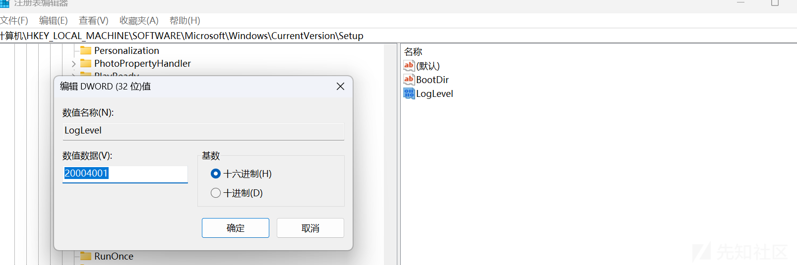

`0x20004001`有什么含义呢？对比微软提供的表格来看一下，大概就是没有设备安装日志记录、在详细模式下记录错误、警告和其他信息、写入每个条目后不要将日志记录信息刷新到磁盘。

<https://learn.microsoft.com/zh-cn/windows-hardware/drivers/install/setting-setupapi-logging-levels>

| 常规日志记录级别 | 含义 |
| --- | --- |
| 0x00000000 | 使用当前0x20) (默认设置。 |
| 0x00000001 | 关闭 (没有设备安装日志记录) 。 |
| 0x00000010 | 记录错误。 |
| 0x00000020 | 记录错误和警告。 |
| 0x00000030 | 记录错误、警告和其他信息。 |
| 0x00000040 | 在详细模式下记录错误、警告和其他信息。 |
| 0x00000050 | 在详细模式下记录错误、警告和其他信息，以及时间戳条目。 |
| 0x00000060 | 在详细模式下记录错误、警告和其他信息，以及时间条目。 此外，所有条目都带有时间戳。 |
| 0x00000070 | 在详细模式下记录错误、警告和其他信息，以及时间消息。 所有条目都带有时间戳。 包括可能减慢系统速度的其他消息，例如缓存命中数。 |
| 0x000000FF | 指定最详细的可用日志记录。 |

| 设备日志记录级别 | 含义 |
| --- | --- |
| 0x00000000 | 使用当前0x3000) (默认设置。 |
| 0x00000100 | 关闭 (没有设备安装日志记录) 。 |
| 0x00001000 | 记录错误。 |
| 0x00002000 | 记录错误和警告。 |
| 0x00003000 | 记录错误、警告和其他信息。 |
| 0x00004000 | 在详细模式下记录错误、警告和其他信息。 |
| 0x00005000 | 在详细模式下记录错误、警告和其他信息，以及时间戳条目。 |
| 0x00006000 | 在详细模式下记录错误、警告和其他信息，以及时间条目。 此外，所有条目都带有时间戳。 |
| 0x00007000 | 在详细模式下记录错误、警告和其他信息，以及时间消息。 所有条目都带有时间戳。 包括可能减慢系统速度的其他消息，例如缓存命中数。 |
| 0x0000FF00 | 指定最详细的可用日志记录。 |

| 特殊标志 | 含义 |
| --- | --- |
| 0x08000000 | 向所有日志条目添加时间戳。 |
| 0x20000000 | 写入每个条目后不要将日志记录信息刷新到磁盘。 (日志记录速度更快，但如果系统崩溃，信息可能会丢失。) |
| 0x40000000 | 按时间顺序编写日志条目，而不是对条目进行分组。 |
| 0x80000000 | 将输出发送到调试器以及日志文件。 |

注册表`HKEY_LOCAL_MACHINE\Software\Microsoft\Windows\CurrentVersion\Setup\LogMask`可以设置文本日志的事件类别，但是默认不存在`LogMask`，也就是SetupAPI 会启用文本日志的所有事件类别。

| 事件类别操作 | 事件类别清单常量 | 事件类别值 |
| --- | --- | --- |
| 设备安装 | TXTLOG\_DEVINST | 0x00000001 |
| 管理 INF 文件 | TXTLOG\_INF | 0x00000002 |
| 管理文件队列 | TXTLOG\_FILEQ | 0x00000004 |
| 复制文件 | TXTLOG\_COPYFILES | 0x00000008 |
| 管理注册表设置 | TXTLOG\_REGISTRY | 0x00000010 |
| 验证数字签名 | TXTLOG\_SIGVERIF | 0x00000020 |
| 管理设备和驱动程序属性 | TXTLOG\_PROPERTIES | 0x00000040 |
| 备份数据 | TXTLOG\_BACKUP | 0x00000080 |
| 管理用户界面对话框 | TXTLOG\_UI | 0x00000100 |
| 新建设备管理器 | TXTLOG\_NEWDEV | 0x01000000 |
| 用户模式 PnP 管理器 | TXTLOG\_UMPNPMGR | 0x02000000 |
| 管理驱动程序存储 | TXTLOG\_DRIVER\_STORE | 0x04000000 |
| 类安装程序或合作安装程序操作 | TXTLOG\_INSTALLER | 0x40000000 |
| 供应商提供的操作 | TXTLOG\_VENDOR | 0x80000000 |

那有没有什么工具能直接解析setupapi日志呢，找到一个工具，<https://usbdetective.com/>  
但是没钱只能用社区版，可以读取出插入过的USB设备的型号和时间，还算可以，付费版还有一些其他的小功能，不过都有平替。

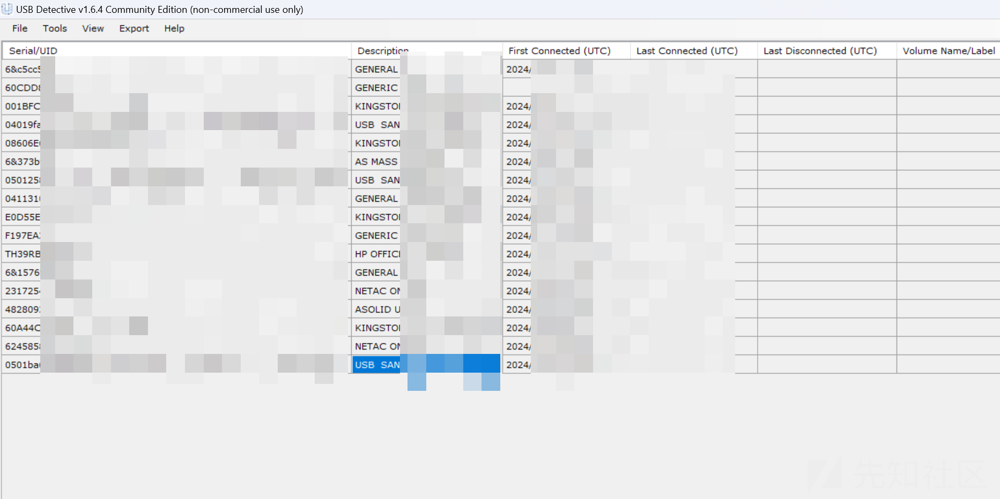

但是SetupAPI日志记录的远不止这个小工具解析出来的这些内容。

尝试手动分析一下看看，每条日志都是从>>>开始，到<<<结束，同时记录时间

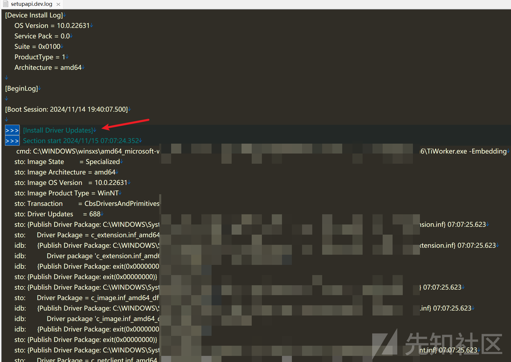

我们选取一天日志，从开机之后开始看，开机时会自动加载很多驱动，这里随便找了一个，可以对比火绒剑查看

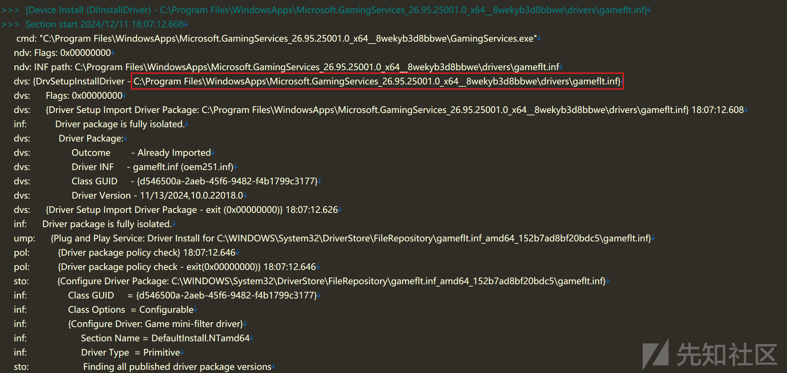

经过对比发现setupapi日志里关于各种驱动的记录远少于火绒剑中解析得到的数量，或许可以根据setupapi日志中详细的过程，辅助火绒剑进行排查，对可疑的进行进一步分析。当然这篇文章不是针对驱动后门的排查，所以不做进一步讨论了。

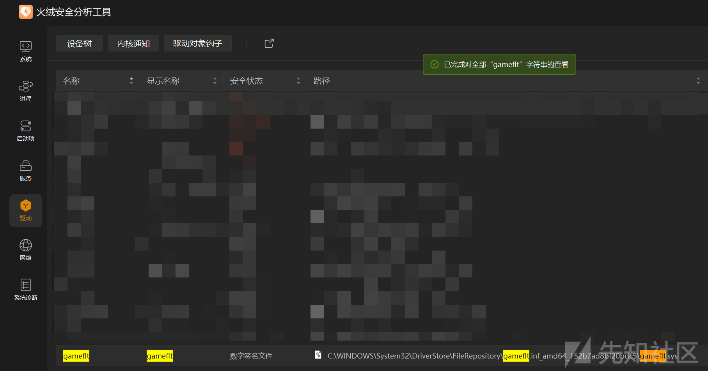

回来继续看日志，找到微软关于Event\_category字段的解释

<https://learn.microsoft.com/zh-cn/windows-hardware/drivers/install/setupapi-logging--windows-vista-and-later->

| Event\_category 字段 | SetupAPI 操作 |
| --- | --- |
| "...: " | 供应商提供的操作 |
| "bak：" | 备份数据 |
| "cci：" | 类安装程序或合作安装程序操作 |
| "cpy：" | 复制文件 |
| "dvi：" | 设备安装 |
| "flq：" | 管理文件队列 |
| "inf：" | 管理 INF 文件 |
| "ndv：" | 新建设备向导 |
| "prp：" | 管理设备和驱动程序属性 |
| "reg：" | 管理注册表设置 |
| "set： " | 常规设置 |
| "sig：" | 验证数字签名 |
| "sto：" | 管理驱动程序存储 |
| "ui ： " | 管理用户界面对话框 |
| "ump： " | 用户模式 PnP 管理器 |

但是微软提供的字段少了dvs的解释，那dvs是什么含义呢，根据dvi对应的`Driver installer`，盲猜一手dvs对应`Driver Setup`


先来看SanDisk的U盘的相关日志，很容易注意到USBSTOR\DISK这一串


`USBSTOR`表示该设备属于 USB 存储类设备。这是常见的设备类别标识，通常用于识别 USB 存储设备（例如 U 盘、外置硬盘等）

`DISK&VEN__USB&PROD__SANDISK_3.2GEN1&REV_1.00`包含设备的子类信息以及供应商和产品标识

`DISK`:子类标识，表示设备类型为磁盘设备

`VEN` 是 Vendor ID 的缩写，表示供应商信息

`USB` 表示设备供应商为 USB 类设备，在这里的话可能是默认值

`PROD` 是 Product ID 的缩写，表示产品名称

`SANDISK_3.2GEN1` 是产品的具体名称，表明这是 SanDisk 的 USB 3.2 Gen 1 存储设备

`REV` 应该是设备的固件版本号

`1.00` 表示固件版本为 1.00

`0501BAxxxxxxxxxxxxxxxxxxxxxxxxxxxxxxxxxxxxxxxxx6047`是设备的唯一序列号，通常由设备的硬件或固件生成，用来区分同一型号的不同设备。通过标识符，系统可以识别该设备的具体实例，哪怕是同型号的其他设备也不会有相同的值

`{DIF_UPDATEDRIVER_UI}` 是一个设备安装函数请求，表示用户界面用于驱动程序更新的流程已启动

`{DIF_UPDATEDRIVER_UI - exit(0xe000020e)` Windows 错误代码，表示没有可用的驱动程序更新

`{Update Driver Software Wizard exit(000004c7)}`：可能是由于Windows策略限制导致的退出

继续看日志，过几秒后面还有一段

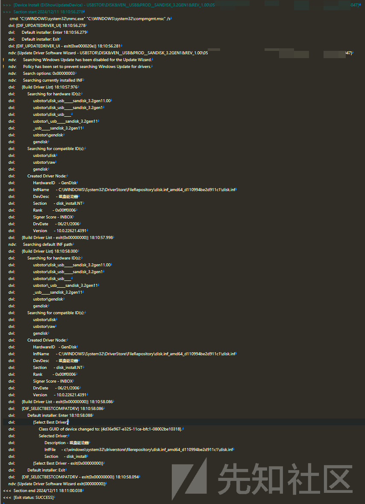

`compmgmt.msc`驱动程序更新启动

`DIF_UPDATEDRIVER_UI` 表示设备更新驱动程序的用户界面操作启动并退出，没有立即报错

`exit(0xe000020e)` 表示无新驱动程序更新可用

之后因为Windows Update 被禁用，所以搜索已安装的INF驱动文件

系统搜索硬件ID，尝试用不同的硬件ID去匹配，跟设备管理器查到的硬件ID是一样的

```
dvi:                usbstor\disk_usb_____sandisk_3.2gen11.00
     dvi:                usbstor\disk_usb_____sandisk_3.2gen1
     dvi:                usbstor\disk_usb____
     dvi:                usbstor\_usb_____sandisk_3.2gen11
     dvi:                _usb_____sandisk_3.2gen11
     dvi:                usbstor\gendisk
     dvi:                gendisk
```

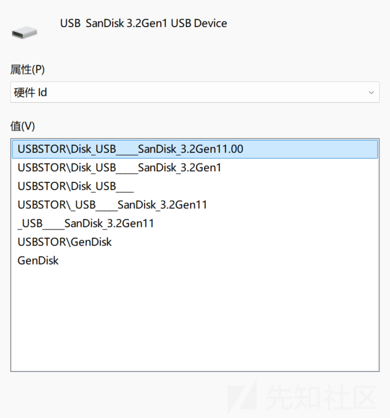

匹配到合适的驱动程序，创建驱动节点

```
dvi:           Created Driver Node:
     dvi:                HardwareID   - GenDisk
     dvi:                InfName      - C:\WINDOWS\System32\DriverStore\FileRepository\disk.inf_amd64_d110994be2d911c1\disk.inf
     dvi:                DevDesc      - 磁盘驱动器
     dvi:                Section      - disk_install.NT
     dvi:                Rank         - 0x00ff0006
     dvi:                Signer Score - INBOX
     dvi:                DrvDate      - 06/21/2006
     dvi:                Version      - 10.0.22621.4391
```

硬件 ID: `GenDisk`（通用磁盘设备）

驱动文件: `disk.inf`

设备描述: 磁盘驱动器

签名来源: INBOX，Windows自带的内置驱动程序

驱动版本: `10.0.22621.4391`

选择最佳驱动:

```
dvi:                {Select Best Driver}
     dvi:                     Class GUID of device changed to: {4d36e967-e325-11ce-bfc1-08002be10318}.
     dvi:                     Selected Driver:
     dvi:                          Description - 磁盘驱动器
     dvi:                          InfFile     - c:\windows\system32\driverstore\filerepository\disk.inf_amd64_d110994be2d911c1\disk.inf
     dvi:                          Section     - disk_install
     dvi:                {Select Best Driver - exit(0x00000000)}
```

`4d36e967-e325-11ce-bfc1-08002be10318`是Windows保留类和 GUID 的信息

<https://learn.microsoft.com/en-us/windows-hardware/drivers/install/system-defined-device-setup-classes-available-to-vendors>

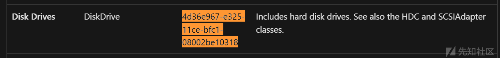

在搜唯一标识符的时候，发现了这个`USB\VID_0781&PID_5591\`

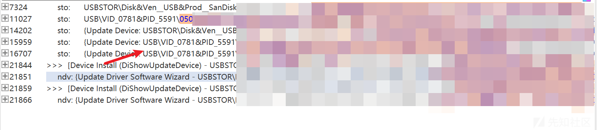

来看一下微软的文档，大概就是VID后面的四位是供应商代码，PID后面的四位是供应商分配给设备的产品代码

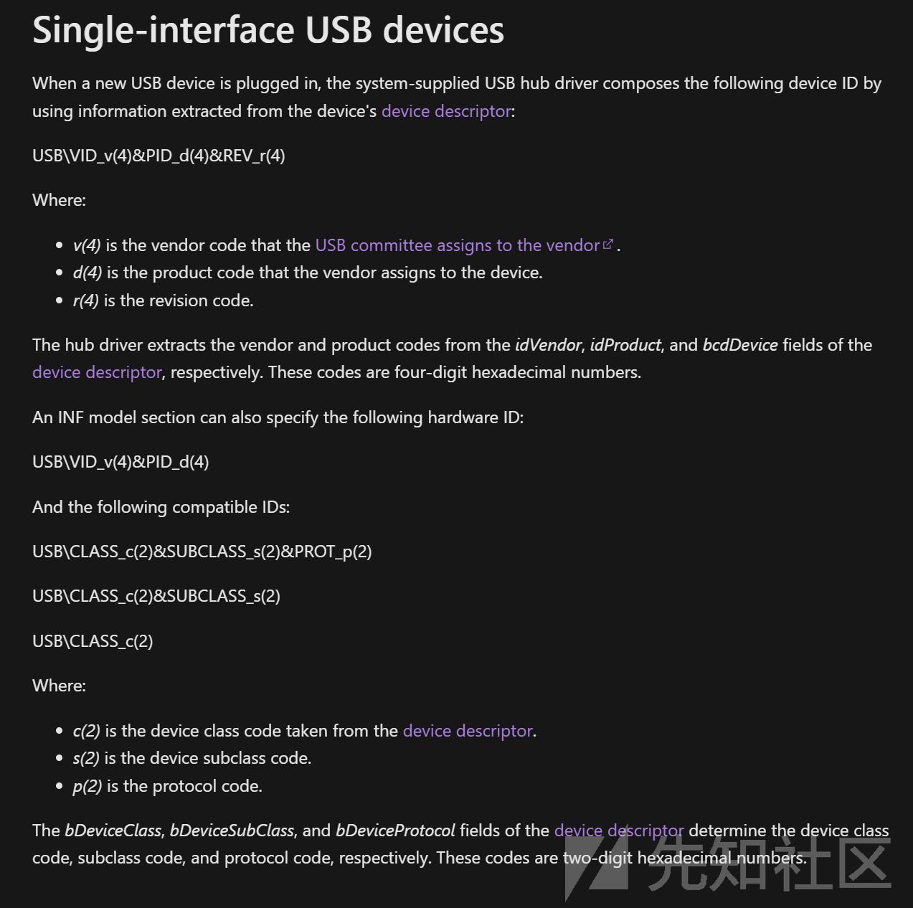

我们可以找一个网站查一下VID和PID对应的厂商

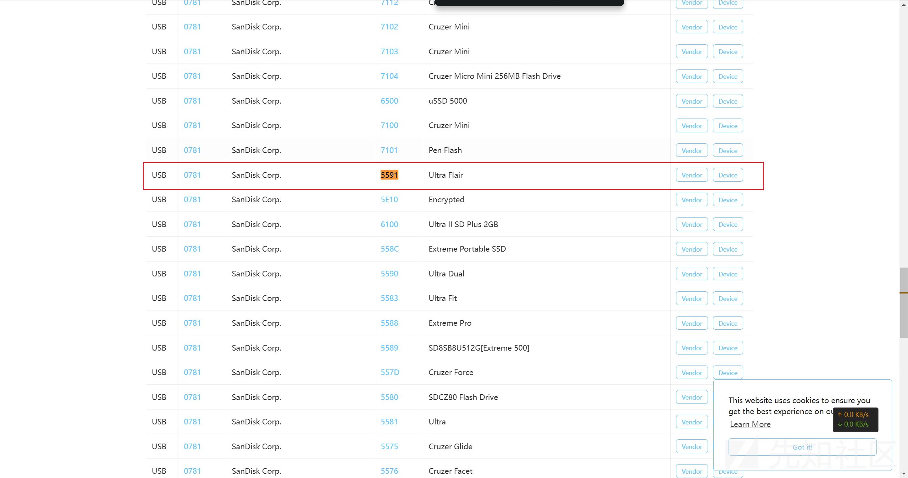

鼠标驱动同理，都差不多

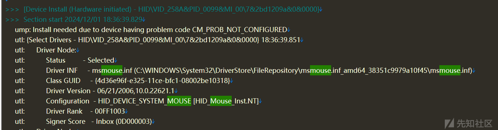

### Kernel-PnP/Configuration日志

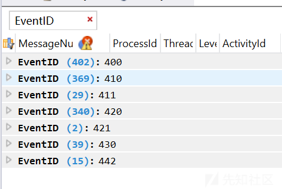

从本机日志来看，事件ID有7个，以400、410、420为主

| 事件ID | 含义 |
| --- | --- |
| 400 | 已配置设备 |
| 410 | 已启动设备 |
| 411 | 设备在启动时出现问题 |
| 420 | 已删除设备 |
| 421 | 无法删除设备 |
| 430 | 设备需要进一步安装 |

这里看了一下配置U盘时候的日志，相关信息跟上面setupapi日志可以对起来查看，而且看起来是先配置的`VID_0781&PID_5591`，后面可能根据INF之类的直接解析出来厂商是`SanDisk`

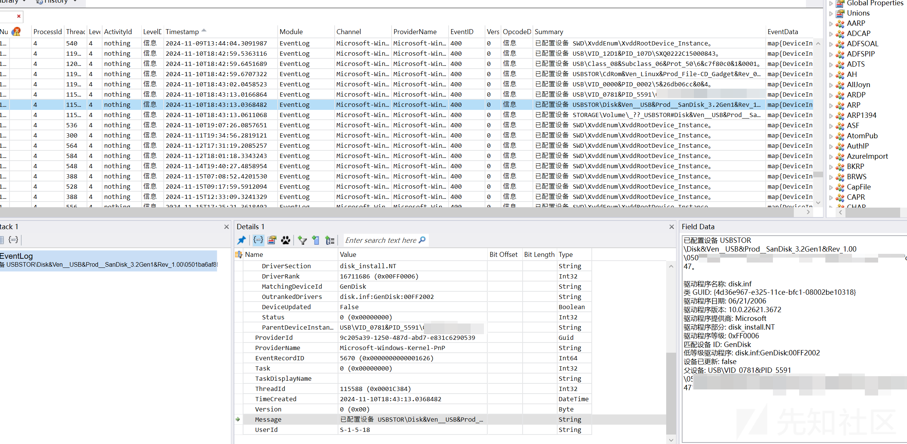

### Kernel-PnP/Driver Watchdog日志

如果一些驱动设备启动过程时间过长会记录线程ID、设备、服务

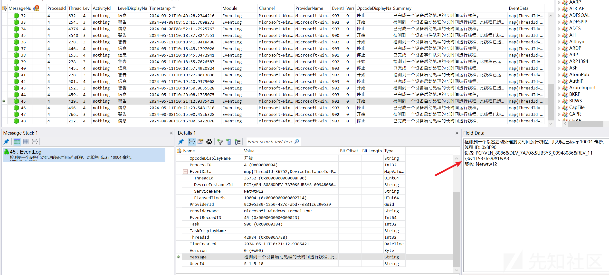

### DeviceSetupManager日志

包含`Microsoft-Windows-DeviceSetupManager%4Operational.evtx`和`Microsoft-Windows-DeviceSetupManager%4Admin.evtx`

先来看一下`Microsoft-Windows-DeviceSetupManager%4Admin.evtx`

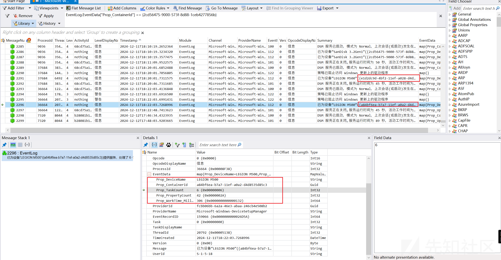

Prop\_DeviceName就是设备名，比如我的鼠标就是`LEGION M500`的，`Prop_TaskCount` 表示当前设备安装或配置过程中需要执行的任务总数，回到Kernel-PnP/Configuration，可以看到这个时间点一共有12条记录，配置启动6次，与`Prop_TaskCount`吻合。

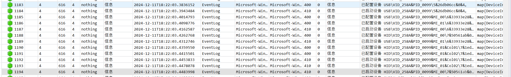

再来看`Microsoft-Windows-DeviceSetupManager%4Operational.evtx`这个时间点，显示的是设备准备就绪、配置完成。`Task: 0`表示所有任务已完成，设备配置成功

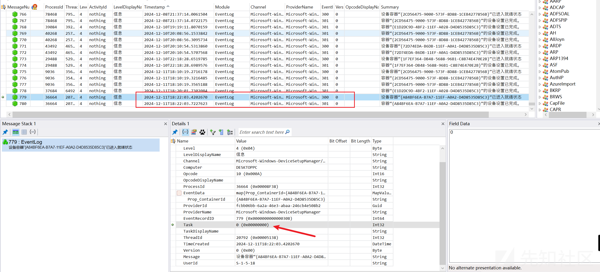

`Prop_ContainerId`记录了⼀个 UUID ，理论上来说UUID 是与设备⼀对⼀，但是在日志里并不一样，可以看到同一个鼠标和U盘，他们的UUID可能都会有变化，可能是因为不同的接口或者其他原因让系统把这个设备识别成了一个新设备，所以在排查的时候不能仅根据`Prop_ContainerId`进行筛选，也要考虑设备名、VID、PID这些综合判断是不是同一个设备。

### Amcache日志

目录如下：

Amcache会记录已安装的应⽤程序、已执⾏的程序、加载的驱动程序等，包含所有的元数据和执⾏信息，解析工具链接

<https://github.com/EricZimmerman/AmcacheParser>

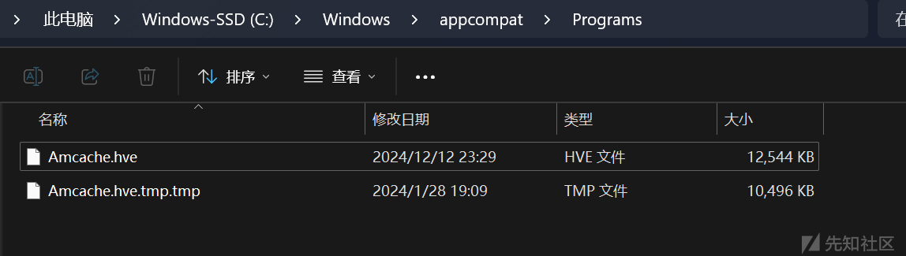

`AmcacheParser.exe -f "C:\Windows\appcompat\Programs\Amcache.hve" --csv result`

也是可以解析出来设备驱动相关的几乎所有信息


内容也是包含很多，包括驱动ID、硬件ID、厂商名、设备型号、驱动目录、版本号等

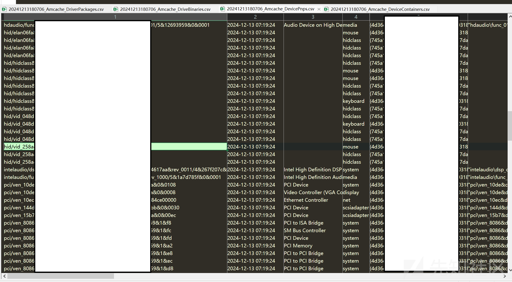
