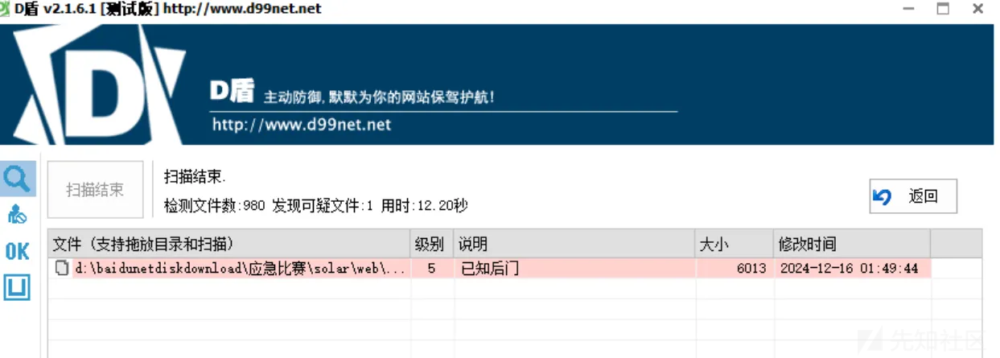
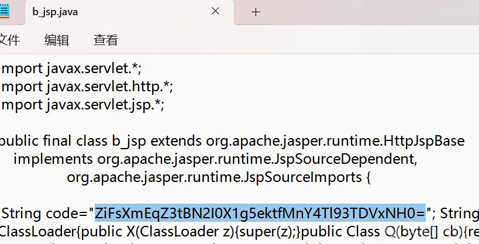
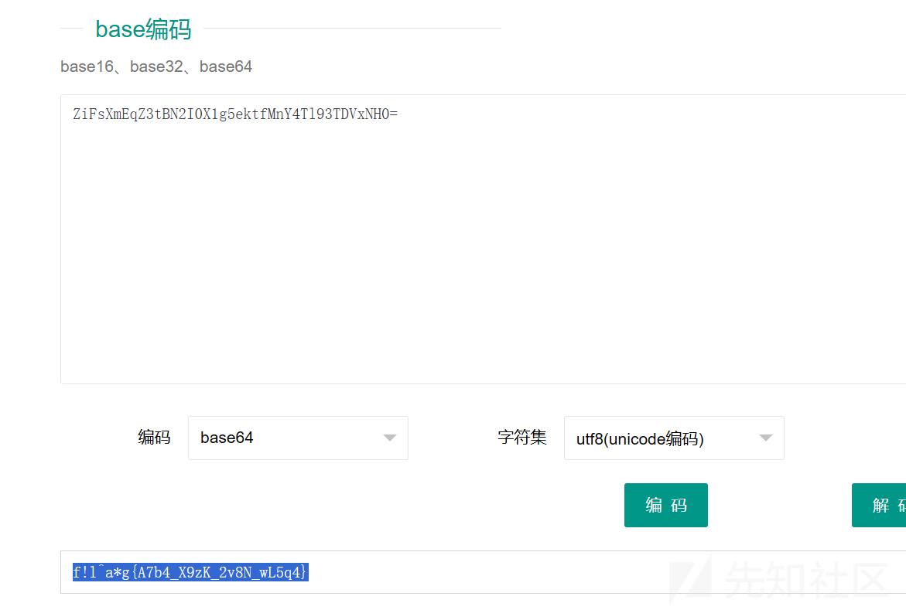
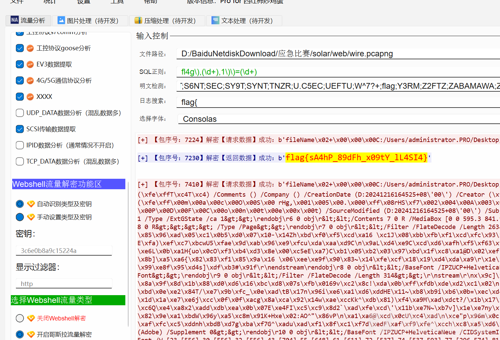
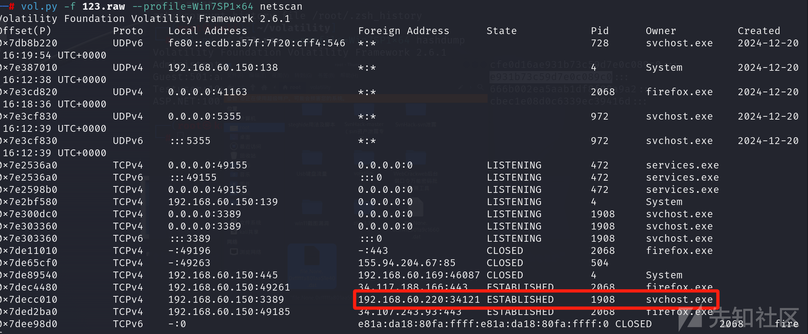
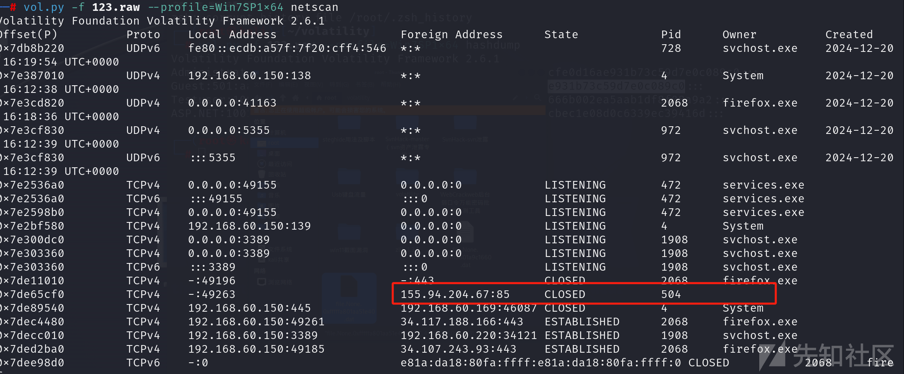
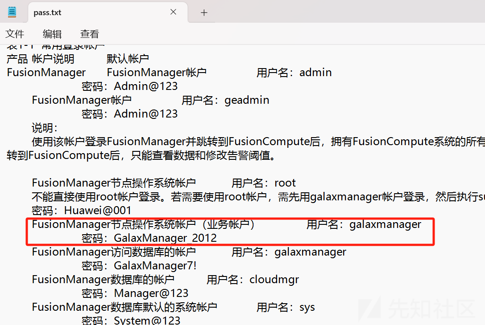
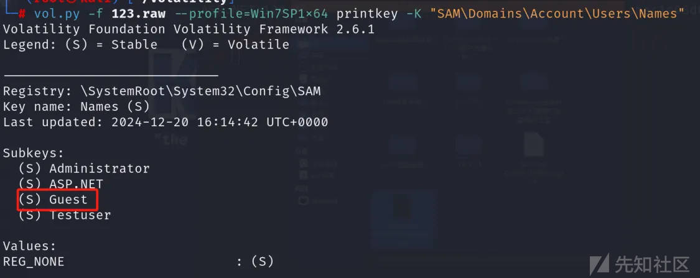

# 2024第一届Solar杯应急响应挑战赛WP-先知社区

> **来源**: https://xz.aliyun.com/news/16375  
> **文章ID**: 16375

---

## 日志流量

### 日志流量-1

直接放到D盾分析





解码



flag{A7b4\_X9zK\_2v8N\_wL5q4}

### 日志流量-2

哥斯拉流量



工具解一下

flag{sA4hP\_89dFh\_x09tY\_lL4SI4}

## 内存取证

### 内存取证-1

```
vol.py -f 123.raw --profile=Win7SP1x64 netscan
```



flag{192.168.60.220}

### 内存取证-2



flag{155.94.204.67}

### 内存取证-3

查看文件

```
vol.py -f 123.raw --profile=Win7SP1x64 filescan | grep txt
```


看到一个pass.txt文本

提取出来



flag{GalaxManager\_2012}

### 内存取证-4

用注册表查看账户



flag{Guest}

## **签到**

从给出的邮件头信息来看，邮件的发送顺序大致如下：

首先，邮件是从 `mail.solar.sec`，对应 `VM-20-3-centos` 这台主机发出，通过 `Postfix` 服务发送到 `mail.da4s8gag.com`

然后， `mail.da4s8gag.com`将邮件转发到 `newxmmxszc6-1.qq.com` （通过 `NewMX` 以及相关的 `SMTP` 服务，有对应的 `id` 编号等记录），最终目标是要发送给 `hellosolartest@qq.com` 收件人。

flag{mail.solar.sec|mail.da4s8gag.com|newxmmxszc6-1.qq.com}
