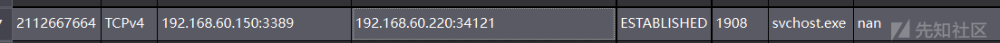
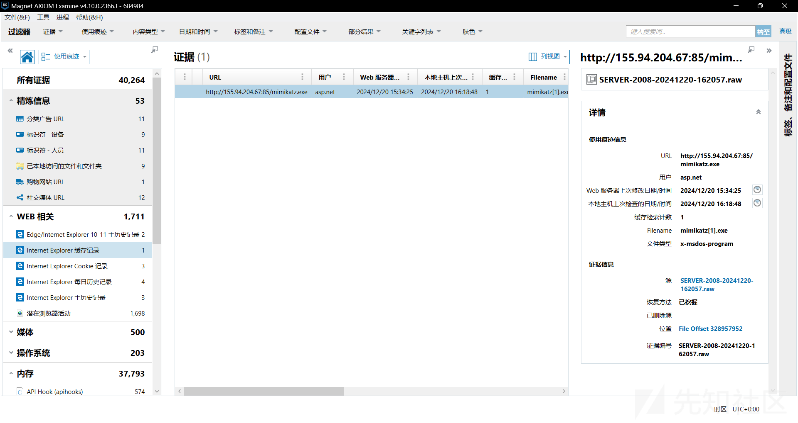
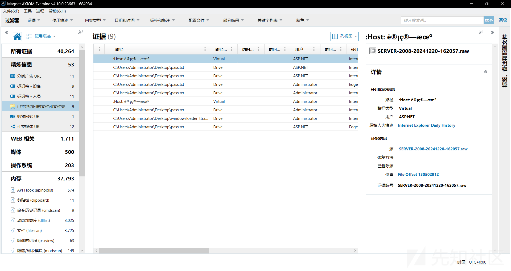
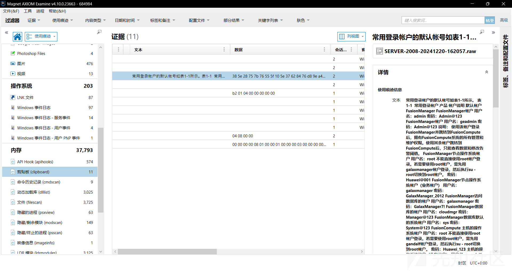
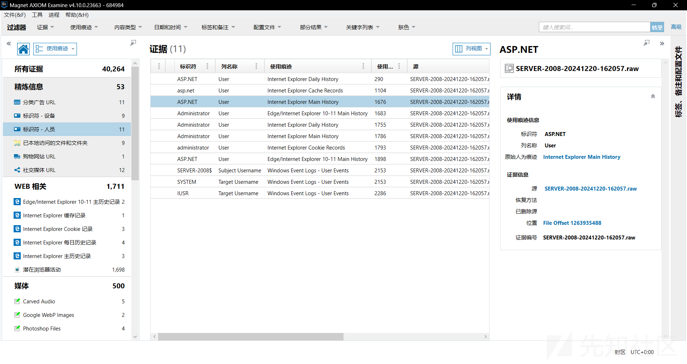
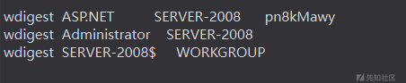
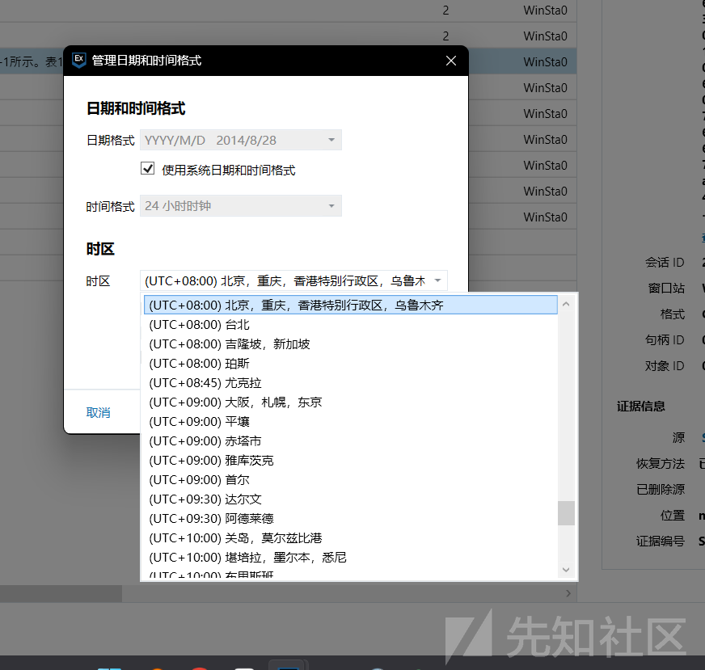
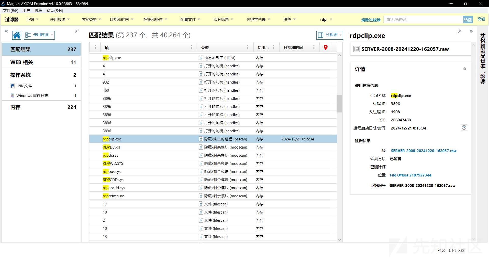
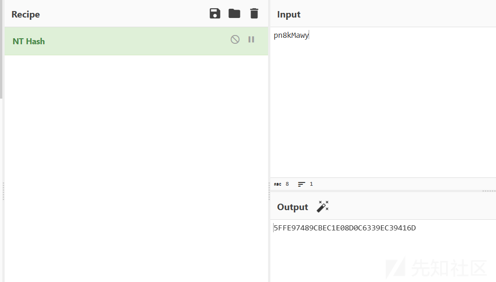

# 2024第一届Solar杯应急响应挑战赛 内存取证-先知社区

> **来源**: https://xz.aliyun.com/news/16377  
> **文章ID**: 16377

---

# 2024第一届Solar杯应急响应挑战赛 内存取证

提供vol和magnet两种做法 基本上都能解决

## 内存取证1：

请找到rdp连接的跳板地址  
flag格式 flag{1.1.1.1}

rdp连接既远程连接 而windows远程连接默认端口为3389端口

python2 vol.py -f ../SERVER-2008-20241220-162057.raw --profile=Win7SP1x64 netscan | grep 3389

## 内存取证2：

请找到攻击者下载黑客工具的IP地址  
flag格式 flag{1.1.1.1}

magnet分析可以直接看到浏览器缓存记录

vol cmdscan

同样可以看到mimikatz的下载记录

## 内存取证3：

攻击者获取的“FusionManager节点操作系统帐户（业务帐户）”的密码是什么  
flag格式 flag{xxxx}

cmdscan或是magnet访问记录可以看到攻击者访问了 pass.txt文件 提取后可以得到一堆账号密码

magnet直接查看剪贴板

## 内存取证4：

请找到攻击者创建的用户  
flag格式 flag{xxxx}

挨个试就行

mimicatz同样可以看到账号密码

## 内存取证5：

请找到攻击者利用跳板rdp登录的时间  
flag格式 flag{2024/01/01 00:00:00}

折磨 搞了半天是时区没搞对

vol 直接pslist找到rdp进程的时间 后面加八小时

magnet需在右下角选择北京时区

## 内存取证6：

请找到攻击者创建的用户的密码哈希值  
flag格式 flag{XXXX}

使用mimicatz得到账户密码

nt hash得到hash值
